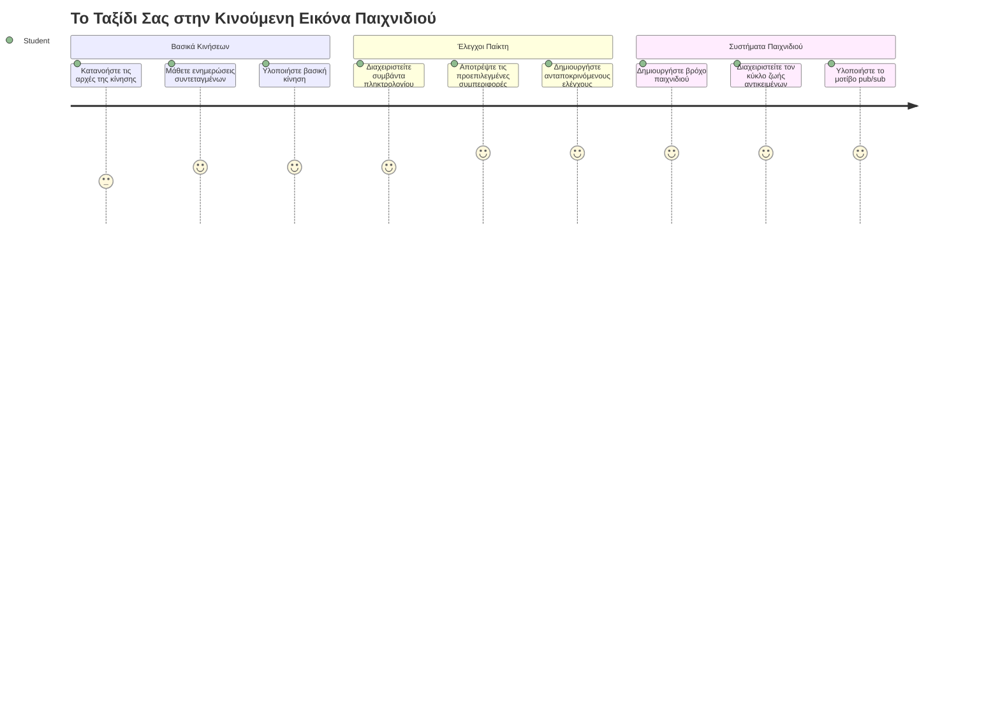
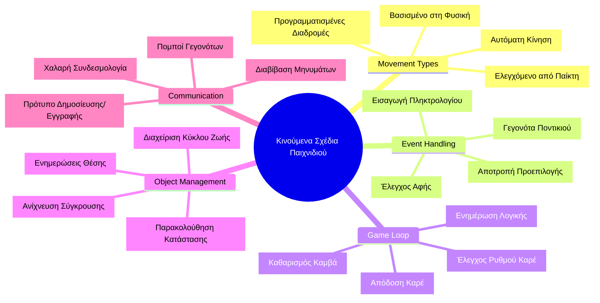
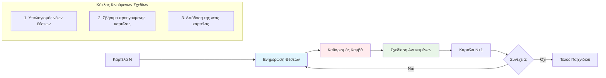
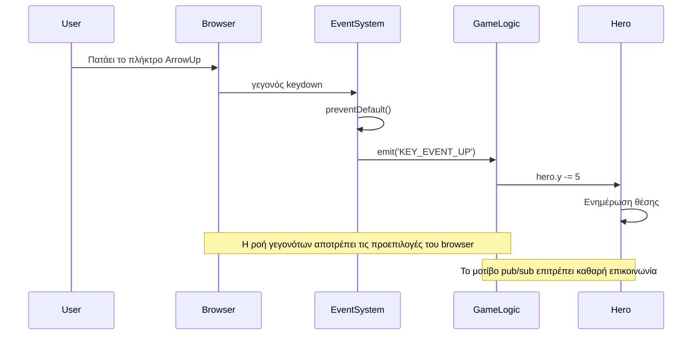
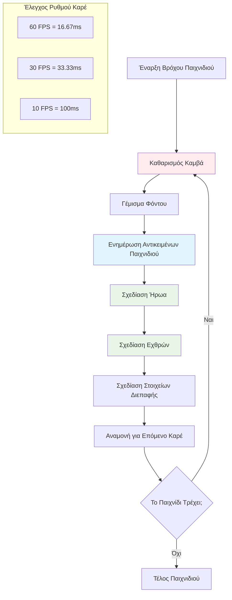
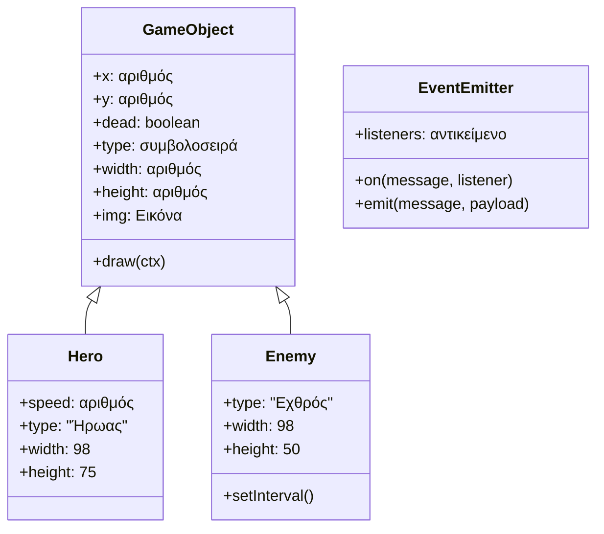
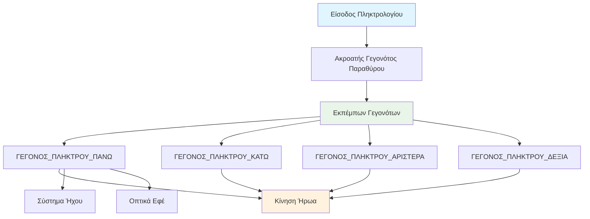
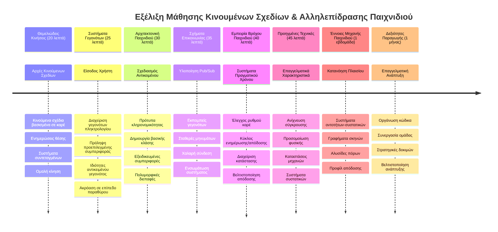

# Δημιουργία ενός Διαστημικού Παιχνιδιού Μέρος 3: Προσθήκη Κίνησης


Σκέψου τα αγαπημένα σου παιχνίδια – αυτό που τα κάνει συναρπαστικά δεν είναι μόνο τα όμορφα γραφικά, αλλά ο τρόπος με τον οποίο όλα κινούνται και ανταποκρίνονται στις ενέργειές σου. Αυτή τη στιγμή, το διαστημικό σου παιχνίδι μοιάζει με έναν όμορφο πίνακα ζωγραφικής, αλλά πρόκειται να προσθέσουμε κίνηση που το ζωντανεύει.

Όταν οι μηχανικοί της NASA προγραμμάτιζαν τον υπολογιστή καθοδήγησης για τις αποστολές Apollo, αντιμετώπισαν μια παρόμοια πρόκληση: πώς κάνεις ένα διαστημόπλοιο να ανταποκρίνεται στις εντολές του πιλότου ενώ διατηρεί αυτόματα τις διορθώσεις πορείας; Οι αρχές που θα μάθουμε σήμερα αντικατοπτρίζουν αυτές τις ίδιες έννοιες – τη διαχείριση της κίνησης που ελέγχεται από τον παίκτη παράλληλα με τις αυτόματες συμπεριφορές του συστήματος.

Σε αυτό το μάθημα, θα μάθεις πώς να κάνεις τα διαστημόπλοια να γλιστρούν στην οθόνη, να ανταποκρίνονται στις εντολές του παίκτη και να δημιουργούν ομαλά μοτίβα κίνησης. Θα χωρίσουμε τα πάντα σε διαχειρίσιμες έννοιες που χτίζονται φυσικά η μία πάνω στην άλλη.

Στο τέλος, οι παίκτες θα πετούν το ηρωικό τους πλοίο γύρω από την οθόνη ενώ εχθρικά σκάφη θα περιπολούν από πάνω. Το πιο σημαντικό, θα κατανοείς τις βασικές αρχές που τροφοδοτούν τα συστήματα κίνησης στα παιχνίδια.


## Προ-Διαλέξη Κουίζ

[Προ-διαλέξη κουίζ](https://ff-quizzes.netlify.app/web/quiz/33)

## Κατανόηση της Κίνησης στα Παιχνίδια

Τα παιχνίδια ζωντανεύουν όταν τα πράγματα αρχίζουν να κινούνται και υπάρχουν βασικά δύο τρόποι να συμβεί αυτό:

- **Κίνηση που ελέγχεται από τον παίκτη**: Όταν πατάς ένα κουμπί ή κάνεις κλικ με το ποντίκι, κάτι κινείται. Αυτή είναι η άμεση σύνδεση μεταξύ σου και του κόσμου του παιχνιδιού.
- **Αυτόματη κίνηση**: Όταν το ίδιο το παιχνίδι αποφασίζει να κινήσει αντικείμενα – όπως εκείνα τα εχθρικά σκάφη που πρέπει να περιπολούν την οθόνη είτε κάνεις κάτι είτε όχι.

Το να κινήσεις αντικείμενα στην οθόνη του υπολογιστή είναι πιο απλό από ό,τι νομίζεις. Θυμήσου εκείνες τις συντεταγμένες x και y από τα μαθηματικά; Είναι ακριβώς αυτά με τα οποία δουλεύουμε εδώ. Όταν ο Γαλιλαίος παρακολουθούσε τους δορυφόρους του Δία το 1610, στην ουσία έκανε το ίδιο – σχεδίαζε θέσεις με το χρόνο για να κατανοήσει τα μοτίβα κίνησης.

Η κίνηση των αντικειμένων στην οθόνη μοιάζει με τη δημιουργία ενός flipbook animation – πρέπει να ακολουθήσεις αυτά τα τρία απλά βήματα:


1. **Ενημέρωση της θέσης** – Άλλαξε που πρέπει να είναι το αντικείμενό σου (ίσως το μετακινήσεις 5 pixels δεξιά)
2. **Διαγραφή του παλιού καρέ** – Καθάρισε την οθόνη ώστε να μην βλέπεις φαντασμαγορικά ίχνη παντού
3. **Σχεδιασμός του νέου καρέ** – Τοποθέτησε το αντικείμενό σου στη νέα θέση του

Κάνε το αρκετά γρήγορα, και μπαμ! Έχεις ομαλή κίνηση που φαίνεται φυσική στους παίκτες.

Να πώς μπορεί να μοιάζει αυτό σε κώδικα:

```javascript
// Ορίστε τη θέση του ήρωα
hero.x += 5;
// Εκκαθαρίστε το ορθογώνιο που φιλοξενεί τον ήρωα
ctx.clearRect(0, 0, canvas.width, canvas.height);
// Ζωγραφίστε εκ νέου το φόντο του παιχνιδιού και τον ήρωα
ctx.fillRect(0, 0, canvas.width, canvas.height);
ctx.fillStyle = "black";
ctx.drawImage(heroImg, hero.x, hero.y);
```

**Αυτό κάνει ο κώδικας:**
- **Ενημερώνει** την x-συντεταγμένη του ήρωα κατά 5 pixels για να κινηθεί οριζόντια
- **Καθαρίζει** ολόκληρη την περιοχή του καμβά για να αφαιρέσει το προηγούμενο καρέ
- **Γεμίζει** τον καμβά με μαύρο φόντο
- **Ξανασχεδιάζει** την εικόνα του ήρωα στη νέα θέση του

✅ Μπορείς να σκεφτείς γιατί το να ξανασχεδιάζεις τον ήρωά σου πολλά καρέ το δευτερόλεπτο μπορεί να κοστίζει σε απόδοση; Διάβασε για [εναλλακτικές αυτής της προσέγγισης](https://developer.mozilla.org/en-US/docs/Web/API/Canvas_API/Tutorial/Optimizing_canvas).

## Χειρισμός Πλήκτρων Πληκτρολογίου

Εδώ συνδέουμε την εισαγωγή του παίκτη με τη δράση του παιχνιδιού. Όταν κάποιος πατάει το spacebar για να πυροβολήσει ένα λέιζερ ή πατάει ένα βελάκι για να αποφύγει έναν αστεροειδή, το παιχνίδι σου πρέπει να ανιχνεύσει και να ανταποκριθεί σε αυτήν την εντολή.

Τα γεγονότα του πληκτρολογίου συμβαίνουν στο επίπεδο του παραθύρου, που σημαίνει ότι ολόκληρο το παράθυρο του προγράμματος περιήγησης ακούει για αυτές τις πατημένες πλήκτρα. Αντίθετα, τα κλικ του ποντικιού μπορεί να συνδεθούν με συγκεκριμένα στοιχεία (όπως το κλικ σε ένα κουμπί). Για το διαστημικό μας παιχνίδι, θα επικεντρωθούμε στους χειρισμούς με το πληκτρολόγιο, αφού αυτό δίνει στους παίκτες κλασική arcade αίσθηση.

Αυτό μου θυμίζει πώς οι τηλεγραφητές τον 19ο αιώνα έπρεπε να μεταφράζουν την είσοδο σε κώδικα Morse σε νοήματα – εμείς κάνουμε κάτι παρόμοιο, μεταφράζοντας πατήματα πλήκτρων σε εντολές του παιχνιδιού.

Για να χειριστείς ένα γεγονός πρέπει να χρησιμοποιήσεις τη μέθοδο `addEventListener()` του παραθύρου και να της δώσεις δύο παραμέτρους. Η πρώτη παράμετρος είναι το όνομα του γεγονότος, για παράδειγμα `keyup`. Η δεύτερη είναι η συνάρτηση που πρέπει να εκτελεστεί όταν συμβεί το γεγονός.

Παράδειγμα:

```javascript
window.addEventListener('keyup', (evt) => {
  // evt.key = string αναπαράσταση του πλήκτρου
  if (evt.key === 'ArrowUp') {
    // κάνε κάτι
  }
});
```

**Ανάλυση τι συμβαίνει εδώ:**
- **Ακούει** για γεγονότα πληκτρολογίου σε ολόκληρο το παράθυρο
- **Καταγράφει** το αντικείμενο γεγονότος που περιέχει πληροφορίες για το ποιο πλήκτρο πατήθηκε
- **Ελέγχει** αν το πατημένο πλήκτρο είναι συγκεκριμένο (σε αυτή την περίπτωση, το βελάκι πάνω)
- **Εκτελεί** κώδικα όταν η συνθήκη ικανοποιείται

Για τα γεγονότα πληκτρολογίου υπάρχουν δύο ιδιότητες που μπορείς να χρησιμοποιήσεις για να δεις ποιο πλήκτρο πατήθηκε:

- `key` - αυτό είναι μια συμβολοσειρά που αναπαριστά το πατημένο πλήκτρο, π.χ. `'ArrowUp'`
- `keyCode` - αυτό είναι ένας αριθμητικός κωδικός, π.χ. `37`, που αντιστοιχεί στο `ArrowLeft`

✅ Η διαχείριση γεγονότων πληκτρολογίου είναι χρήσιμη και εκτός ανάπτυξης παιχνιδιών. Ποιες άλλες χρήσεις μπορείς να σκεφτείς για αυτή την τεχνική;


### Ειδικά Πλήκτρα: Μια Προειδοποίηση!

Ορισμένα πλήκτρα έχουν τις προεπιλεγμένες συμπεριφορές του προγράμματος περιήγησης που μπορεί να παρεμποδίσουν το παιχνίδι σου. Τα βελάκια κάνουν κύλιση της σελίδας και το spacebar μετακινεί προς τα κάτω – συμπεριφορές που δεν θες όταν κάποιος προσπαθεί να πλοηγήσει το διαστημόπλοιο του.

Μπορούμε να αποτρέψουμε αυτές τις προεπιλεγμένες συμπεριφορές και να αφήσουμε το παιχνίδι να χειριστεί την είσοδο. Αυτό είναι παρόμοιο με το πώς οι πρώτοι προγραμματιστές υπολογιστών έπρεπε να παρακάμψουν διακοπές συστήματος για να δημιουργήσουν εξατομικευμένες συμπεριφορές – εμείς το κάνουμε σε επίπεδο προγράμματος περιήγησης. Να πώς:

```javascript
const onKeyDown = function (e) {
  console.log(e.keyCode);
  switch (e.keyCode) {
    case 37:
    case 39:
    case 38:
    case 40: // Πλήκτρα βέλους
    case 32:
      e.preventDefault();
      break; // Πλήκτρο διαστήματος
    default:
      break; // μην εμποδίζετε άλλα πλήκτρα
  }
};

window.addEventListener('keydown', onKeyDown);
```

**Κατανόηση αυτού του κώδικα πρόληψης:**
- **Ελέγχει** συγκεκριμένους κωδικούς πλήκτρων που μπορεί να προκαλέσουν ανεπιθύμητες συμπεριφορές του browser
- **Αποτρέπει** την προεπιλεγμένη ενέργεια του browser για τα βελάκια και το spacebar
- **Επιτρέπει** στα άλλα πλήκτρα να λειτουργούν κανονικά
- **Χρησιμοποιεί** το `e.preventDefault()` για να σταματήσει την ενσωματωμένη συμπεριφορά του browser

### 🔄 **Παιδαγωγικός Έλεγχος**
**Κατανόηση Χειρισμού Γεγονότων**: Πριν προχωρήσουμε στην αυτόματη κίνηση, βεβαιώσου ότι μπορείς να:
- ✅ Εξηγήσεις τη διαφορά μεταξύ των γεγονότων `keydown` και `keyup`
- ✅ Κατανοήσεις γιατί αποτρέπουμε τις προεπιλεγμένες συμπεριφορές του browser
- ✅ Περιγράψεις πώς οι ακροατές γεγονότων συνδέουν την είσοδο του χρήστη με τη λογική του παιχνιδιού
- ✅ Αναγνωρίσεις ποια πλήκτρα μπορεί να παρεμποδίσουν τους χειρισμούς του παιχνιδιού

**Γρήγορος Αυτοέλεγχος**: Τι θα συνέβαινε αν δεν αποτρέπαμε την προεπιλεγμένη συμπεριφορά για τα βελάκια;
*Απάντηση: Ο browser θα έκανε κύλιση της σελίδας, παρεμποδίζοντας την κίνηση μέσα στο παιχνίδι*

**Αρχιτεκτονική Συστήματος Γεγονότων**: Τώρα κατανοείς:
- **Ακρόαση σε επίπεδο παραθύρου**: Λήψη γεγονότων σε επίπεδο προγράμματος περιήγησης
- **Ιδιότητες αντικειμένου γεγονότος**: Συμβολοσειρές `key` έναντι αριθμών `keyCode`
- **Πρόληψη προεπιλεγμένης ενέργειας**: Σταμάτημα ανεπιθύμητων συμπεριφορών browser
- **Λογική με όρους**: Ανάκριση σε συγκεκριμένους συνδυασμούς πλήκτρων

## Κίνηση που Προκαλείται από το Παιχνίδι

Τώρα ας μιλήσουμε για αντικείμενα που κινούνται χωρίς την παρέμβαση του παίκτη. Σκέψου εχθρικά σκάφη που περιπολούν στην οθόνη, σφαίρες που πετούν σε ευθεία γραμμή ή σύννεφα που επιπλέουν στο φόντο. Αυτή η αυτόνομη κίνηση κάνει τον κόσμο του παιχνιδιού να μοιάζει ζωντανός ακόμη και όταν κανείς δεν αγγίζει τους χειρισμούς.

Χρησιμοποιούμε τους ενσωματωμένους χρονιστές του JavaScript για να ενημερώνουμε θέσεις σε κανονικά διαστήματα. Αυτή η έννοια μοιάζει με το πώς λειτουργούν τα εκκρεμή ρολόγια – ένας κανονικός μηχανισμός που ενεργοποιεί συνεπείς, χρονισμένες ενέργειες. Να πόσο απλό μπορεί να είναι:

```javascript
const id = setInterval(() => {
  // Μετακινήστε τον εχθρό στον άξονα y
  enemy.y += 10;
}, 100);
```

**Αυτό κάνει ο κώδικας κίνησης:**
- **Δημιουργεί** έναν χρονιστή που τρέχει κάθε 100 χιλιοστά του δευτερολέπτου
- **Ενημερώνει** την y-συντεταγμένη του εχθρού κατά 10 pixels κάθε φορά
- **Αποθηκεύει** το ID του διαστήματος χρόνου ώστε να μπορούμε να το σταματήσουμε αργότερα αν χρειαστεί
- **Μετακινεί** τον εχθρό προς τα κάτω στην οθόνη αυτόματα

## Ο Βρόχος του Παιχνιδιού

Να η έννοια που δένει όλα μαζί – ο βρόχος του παιχνιδιού. Αν το παιχνίδι σου ήταν ταινία, ο βρόχος του παιχνιδιού θα ήταν ο προβολέας ταινιών, που δείχνει καρέ μετά καρέ τόσο γρήγορα ώστε όλα να φαίνονται ομαλά σε κίνηση.

Κάθε παιχνίδι έχει έναν από αυτούς τους βρόχους που τρέχει στο παρασκήνιο. Είναι μια συνάρτηση που ενημερώνει όλα τα αντικείμενα του παιχνιδιού, ξανασχεδιάζει την οθόνη και επαναλαμβάνει αυτή τη διαδικασία συνεχώς. Παρακολουθεί τον ήρωά σου, όλους τους εχθρούς, τα λέιζερ που πετούν – ολόκληρη την κατάσταση του παιχνιδιού.

Αυτή η έννοια μου θυμίζει πώς οι πρώτοι κινούμενοι σχεδιαστές ταινιών όπως ο Walt Disney έπρεπε να ξανασχεδιάζουν χαρακτήρες καρέ-καρέ για να δημιουργήσουν την ψευδαίσθηση της κίνησης. Κάνουμε το ίδιο, αλλά με κώδικα αντί για μολύβια.

Έτσι μπορεί να μοιάζει ένας τυπικός βρόχος παιχνιδιού, εκφρασμένος σε κώδικα:


```javascript
const gameLoopId = setInterval(() => {
  function gameLoop() {
    ctx.clearRect(0, 0, canvas.width, canvas.height);
    ctx.fillStyle = "black";
    ctx.fillRect(0, 0, canvas.width, canvas.height);
    drawHero();
    drawEnemies();
    drawStaticObjects();
  }
  gameLoop();
}, 200);
```

**Κατανόηση της δομής του βρόχου παιχνιδιού:**
- **Καθαρίζει** ολόκληρο τον καμβά για να αφαιρέσει το προηγούμενο καρέ
- **Γεμίζει** το φόντο με ένα συμπαγές χρώμα
- **Σχεδιάζει** όλα τα αντικείμενα του παιχνιδιού στις τρέχουσες θέσεις τους
- **Επαναλαμβάνει** αυτή τη διαδικασία κάθε 200 χιλιοστά του δευτερολέπτου για να δημιουργήσει ομαλή κινούμενη εικόνα
- **Διαχειρίζεται** το ρυθμό καρέ ελέγχοντας την χρονοκαθυστέρηση

## Συνέχιση του Διαστημικού Παιχνιδιού

Τώρα θα προσθέσουμε κίνηση στη στατική σκηνή που δημιούργησες προηγουμένως. Θα τη μετατρέψουμε από ένα στιγμιότυπο οθόνης σε μια διαδραστική εμπειρία. Θα δουλέψουμε βήμα προς βήμα ώστε να διασφαλίσουμε ότι το κάθε κομμάτι χτίζεται πάνω στο προηγούμενο.

Πάρε τον κώδικα από εκεί που σταματήσαμε στο προηγούμενο μάθημα (ή ξεκίνα με τον κώδικα στο φάκελο [Μέρος II - αρχικό](../../../../6-space-game/3-moving-elements-around/your-work) αν χρειάζεσαι μια νέα αρχή).

**Αυτό χτίζουμε σήμερα:**
- **Χειρισμοί ήρωα**: Τα βελάκια θα οδηγούν το διαστημόπλοιό σου στην οθόνη
- **Κίνηση εχθρών**: Εκείνα τα ξένα σκάφη θα ξεκινήσουν την πορεία τους

Ας αρχίσουμε να υλοποιούμε αυτές τις λειτουργίες.

## Συνιστώμενα βήματα

Εντόπισε τα αρχεία που δημιουργήθηκαν μέσα στο υποφάκελο `your-work`. Πρέπει να περιέχει τα ακόλουθα:

```bash
-| assets
  -| enemyShip.png
  -| player.png
-| index.html
-| app.js
-| package.json
```

Ξεκινάς το πρότζεκτ σου στον φάκελο `your-work` πληκτρολογώντας:

```bash
cd your-work
npm start
```

**Αυτή η εντολή κάνει:**
- **Πλοηγείται** στον κατάλογο του πρότζεκτ σου
- **Ξεκινά** έναν HTTP Server στη διεύθυνση `http://localhost:5000`
- **Εξυπηρετεί** τα αρχεία του παιχνιδιού ώστε να τα δοκιμάσεις σε browser

Αυτό θα ξεκινήσει έναν HTTP Server στη διεύθυνση `http://localhost:5000`. Άνοιξε ένα πρόγραμμα περιήγησης και εισήγαγε αυτή τη διεύθυνση, τώρα θα εμφανίζει τον ήρωα και όλους τους εχθρούς· τίποτα δεν κινείται - ακόμα!

### Πρόσθεσε κώδικα

1. **Πρόσθεσε συγκεκριμένα αντικείμενα** για `hero`, `enemy` και γενικό `game object`. Θα πρέπει να έχουν τις ιδιότητες `x` και `y`. (Θυμήσου το κομμάτι για [Κληρονομικότητα ή Σύνθεση](../README.md)).

   *ΥΠΟΔΕΙΞΗ* Το `game object` πρέπει να είναι αυτό που έχει τα `x` και `y` και την ικανότητα να σχεδιάζει τον εαυτό του σε καμβά.

   > **Συμβουλή**: Ξεκίνα προσθέτοντας μια νέα κλάση `GameObject` με τον κατασκευαστή της ορισμένο όπως παρακάτω, και μετά σχεδίασέ την στον καμβά:

    ```javascript
    class GameObject {
      constructor(x, y) {
        this.x = x;
        this.y = y;
        this.dead = false;
        this.type = "";
        this.width = 0;
        this.height = 0;
        this.img = undefined;
      }
    
      draw(ctx) {
        ctx.drawImage(this.img, this.x, this.y, this.width, this.height);
      }
    }
    ```

    **Κατανόηση αυτής της βασικής κλάσης:**
    - **Ορίζει** κοινές ιδιότητες που μοιράζονται όλα τα αντικείμενα παιχνιδιού (θέση, μέγεθος, εικόνα)
    - **Περιλαμβάνει** μια σημαία `dead` για να παρακολουθεί αν το αντικείμενο πρέπει να αφαιρεθεί
    - **Παρέχει** τη μέθοδο `draw()` που σχεδιάζει το αντικείμενο στον καμβά
    - **Ορίζει** προεπιλεγμένες τιμές για όλες τις ιδιότητες που μπορούν να παρακαμφθούν από τις παιδιά κλάσεις


    Τώρα, επεκτείνουμε αυτή την `GameObject` για να δημιουργήσουμε τους `Hero` και `Enemy`:
    
    ```javascript
    class Hero extends GameObject {
      constructor(x, y) {
        super(x, y);
        this.width = 98;
        this.height = 75;
        this.type = "Hero";
        this.speed = 5;
      }
    }
    ```

    ```javascript
    class Enemy extends GameObject {
      constructor(x, y) {
        super(x, y);
        this.width = 98;
        this.height = 50;
        this.type = "Enemy";
        const id = setInterval(() => {
          if (this.y < canvas.height - this.height) {
            this.y += 5;
          } else {
            console.log('Stopped at', this.y);
            clearInterval(id);
          }
        }, 300);
      }
    }
    ```

    **Κύριες έννοιες σε αυτές τις κλάσεις:**
    - **Κληρονομούν** από την `GameObject` χρησιμοποιώντας τη λέξη-κλειδί `extends`
    - **Καλούν** τον κατασκευαστή γονέα με `super(x, y)`
    - **Ορίζουν** συγκεκριμένες διαστάσεις και ιδιότητες για κάθε τύπο αντικειμένου
    - **Υλοποιούν** αυτόματη κίνηση για τους εχθρούς χρησιμοποιώντας το `setInterval()`

2. **Πρόσθεσε διαχειριστές γεγονότων πληκτρολογίου** για να χειριστείς την πλοήγηση με πλήκτρα (κίνηση του ήρωα πάνω/κάτω αριστερά/δεξιά)

   *ΘΥΜΗΣΟΥ* είναι καρτεσιανό σύστημα, πάνω-αριστερά είναι το `0,0`. Θυμήσου επίσης να προσθέσεις κώδικα για να σταματήσεις την *προεπιλεγμένη συμπεριφορά*

   > **Συμβουλή**: Δημιούργησε τη λειτουργία `onKeyDown` και σύνδεσέ την στο παράθυρο:

   ```javascript
   const onKeyDown = function (e) {
     console.log(e.keyCode);
     // Προσθέστε τον κώδικα από το παραπάνω μάθημα για να σταματήσετε την προεπιλεγμένη συμπεριφορά
     switch (e.keyCode) {
       case 37:
       case 39:
       case 38:
       case 40: // Πλήκτρα βελών
       case 32:
         e.preventDefault();
         break; // Κενό
       default:
         break; // μην μπλοκάρετε άλλα πλήκτρα
     }
   };

   window.addEventListener("keydown", onKeyDown);
   ```
    
   **Αυτό κάνει ο διαχειριστής γεγονότων:**
   - **Ακούει** για γεγονότα keydown σε ολόκληρο το παράθυρο
   - **Καταγράφει** τον κωδικό πλήκτρου για να βοηθήσει στο debugging των πατημένων πλήκτρων
   - **Αποτρέπει** την προεπιλεγμένη συμπεριφορά του browser για τα βελάκια και το spacebar
   - **Επιτρέπει** στα άλλα πλήκτρα να λειτουργούν κανονικά
   
   Έλεγξε το κονσόλα του browser σου σε αυτό το σημείο και παρακολούθησε τις εγγραφές των πληκτρολογήσεων.

3. **Υλοποίησε** το [μοτίβο Pub sub](../README.md), αυτό θα κρατήσει τον κώδικά σου καθαρό καθώς ακολουθείς τα υπόλοιπα μέρη.

   Το μοτίβο Δημοσίευσης-Εγγραφής βοηθά στην οργάνωση του κώδικά σου διαχωρίζοντας την ανίχνευση γεγονότων από τη διαχείρισή τους. Αυτό κάνει τον κώδικα πιο αρθρωτό και ευκολότερο στη συντήρηση.

   Για να κάνεις αυτό το τελευταίο βήμα, μπορείς:

   1. **Πρόσθεσε έναν ακροατή γεγονότων** στο παράθυρο:

       ```javascript
       window.addEventListener("keyup", (evt) => {
         if (evt.key === "ArrowUp") {
           eventEmitter.emit(Messages.KEY_EVENT_UP);
         } else if (evt.key === "ArrowDown") {
           eventEmitter.emit(Messages.KEY_EVENT_DOWN);
         } else if (evt.key === "ArrowLeft") {
           eventEmitter.emit(Messages.KEY_EVENT_LEFT);
         } else if (evt.key === "ArrowRight") {
           eventEmitter.emit(Messages.KEY_EVENT_RIGHT);
         }
       });
       ```

   **Αυτό κάνει το σύστημα γεγονότων:**
   - **Ανιχνεύει** εισροή από το πληκτρολόγιο και τη μετατρέπει σε προσαρμοσμένα γεγονότα παιχνιδιού
   - **Διαχωρίζει** ανίχνευση εισόδου από τη λογική του παιχνιδιού
   - **Κάνει** εύκολη την αλλαγή χειρισμών αργότερα χωρίς να επηρεάζει τον κώδικα του παιχνιδιού
   - **Επιτρέπει** σε πολλαπλά συστήματα να ανταποκρίνονται στην ίδια είσοδο


   2. **Δημιούργησε μια κλάση EventEmitter** για δημοσίευση και εγγραφή μηνυμάτων:

       ```javascript
       class EventEmitter {
         constructor() {
           this.listeners = {};
         }
       
         on(message, listener) {
           if (!this.listeners[message]) {
             this.listeners[message] = [];
           }
           this.listeners[message].push(listener);
         }
       
   3. **Πρόσθεσε σταθερές** και ρύθμισε το EventEmitter:

       ```javascript
       const Messages = {
         KEY_EVENT_UP: "KEY_EVENT_UP",
         KEY_EVENT_DOWN: "KEY_EVENT_DOWN",
         KEY_EVENT_LEFT: "KEY_EVENT_LEFT",
         KEY_EVENT_RIGHT: "KEY_EVENT_RIGHT",
       };
       
       let heroImg, 
           enemyImg, 
           laserImg,
           canvas, ctx, 
           gameObjects = [], 
           hero, 
           eventEmitter = new EventEmitter();
       ```

   **Κατανόηση της ρύθμισης:**
   - **Ορίζει** σταθερές μηνυμάτων για να αποφευχθούν τυπογραφικά λάθη και να γίνει ευκολότερη η αναδιάρθρωση
   - **Δηλώνει** μεταβλητές για τις εικόνες, το context του καμβά και την κατάσταση του παιχνιδιού
   - **Δημιουργεί** έναν παγκόσμιο εκπέμποντα γεγονότων για το σύστημα δημοσίευσης-εγγραφής
   - **Αρχικοποιεί** έναν πίνακα για να κρατά όλα τα αντικείμενα του παιχνιδιού

   4. **Αρχικοποιήστε το παιχνίδι**

       ```javascript
       function initGame() {
         gameObjects = [];
         createEnemies();
         createHero();
       
         eventEmitter.on(Messages.KEY_EVENT_UP, () => {
           hero.y -= 5;
         });
       
         eventEmitter.on(Messages.KEY_EVENT_DOWN, () => {
           hero.y += 5;
         });
       
         eventEmitter.on(Messages.KEY_EVENT_LEFT, () => {
           hero.x -= 5;
         });
       
4. **Ρυθμίστε το βρόχο του παιχνιδιού**

   Αναδομήστε (refactor) τη συνάρτηση `window.onload` για να αρχικοποιήσετε το παιχνίδι και να ρυθμίσετε ένα βρόχο παιχνιδιού με καλό διάστημα. Θα προσθέσετε επίσης μια ακτίνα λέιζερ:

    ```javascript
    window.onload = async () => {
      canvas = document.getElementById("canvas");
      ctx = canvas.getContext("2d");
      heroImg = await loadTexture("assets/player.png");
      enemyImg = await loadTexture("assets/enemyShip.png");
      laserImg = await loadTexture("assets/laserRed.png");
    
      initGame();
      const gameLoopId = setInterval(() => {
        ctx.clearRect(0, 0, canvas.width, canvas.height);
        ctx.fillStyle = "black";
        ctx.fillRect(0, 0, canvas.width, canvas.height);
        drawGameObjects(ctx);
      }, 100);
    };
    ```

   **Κατανόηση της ρύθμισης του παιχνιδιού:**
   - **Περιμένει** να φορτώσει εντελώς η σελίδα πριν ξεκινήσει
   - **Παίρνει** το στοιχείο του καμβά και το 2D rendering context
   - **Φορτώνει** όλους τους πόρους εικόνας ασύγχρονα με χρήση `await`
   - **Ξεκινά** τον βρόχο του παιχνιδιού που τρέχει σε διαστήματα των 100ms (10 FPS)
   - **Καθαρίζει** και ξαναζωγραφίζει ολόκληρη την οθόνη σε κάθε καρέ

5. **Προσθέστε κώδικα** για να κινήσετε τους εχθρούς σε συγκεκριμένο διάστημα

    Αναδομήστε τη συνάρτηση `createEnemies()` για να δημιουργήσετε τους εχθρούς και να τους προσθέσετε στην καινούργια κλάση gameObjects:

    ```javascript
    function createEnemies() {
      const MONSTER_TOTAL = 5;
      const MONSTER_WIDTH = MONSTER_TOTAL * 98;
      const START_X = (canvas.width - MONSTER_WIDTH) / 2;
      const STOP_X = START_X + MONSTER_WIDTH;
    
      for (let x = START_X; x < STOP_X; x += 98) {
        for (let y = 0; y < 50 * 5; y += 50) {
          const enemy = new Enemy(x, y);
          enemy.img = enemyImg;
          gameObjects.push(enemy);
        }
      }
    }
    ```

    **Τι κάνει η δημιουργία εχθρών:**
    - **Υπολογίζει** τις θέσεις για να κεντράρει τους εχθρούς στην οθόνη
    - **Δημιουργεί** ένα πλέγμα εχθρών χρησιμοποιώντας εμφωλευμένους βρόχους
    - **Αναθέτει** την εικόνα εχθρού σε κάθε αντικείμενο εχθρού
    - **Προσθέτει** κάθε εχθρό στον παγκόσμιο πίνακα αντικειμένων του παιχνιδιού
    
    και προσθέστε μια συνάρτηση `createHero()` για παρόμοια διαδικασία του ήρωα.
    
    ```javascript
    function createHero() {
      hero = new Hero(
        canvas.width / 2 - 45,
        canvas.height - canvas.height / 4
      );
      hero.img = heroImg;
      gameObjects.push(hero);
    }
    ```

    **Τι κάνει η δημιουργία του ήρωα:**
    - **Τοποθετεί** τον ήρωα στο κάτω κέντρο της οθόνης
    - **Αναθέτει** την εικόνα του ήρωα στο αντικείμενο ήρωα
    - **Προσθέτει** τον ήρωα στον πίνακα αντικειμένων του παιχνιδιού για απεικόνιση

    και τέλος, προσθέστε μια συνάρτηση `drawGameObjects()` για να ξεκινήσει το σχέδιο:

    ```javascript
    function drawGameObjects(ctx) {
      gameObjects.forEach(go => go.draw(ctx));
    }
    ```

    **Κατανόηση της συνάρτησης σχεδίασης:**
    - **Επαναλαμβάνει** όλα τα αντικείμενα του παιχνιδιού στον πίνακα
    - **Καλεί** τη μέθοδο `draw()` σε κάθε αντικείμενο
    - **Περνά** το context του καμβά ώστε τα αντικείμενα να μπορούν να σχεδιάζονται

    ### 🔄 **Παιδαγωγικός Έλεγχος**
    **Πλήρης Κατανόηση Συστήματος Παιχνιδιού**: Επαληθεύστε τη δεξιότητά σας στην ολική αρχιτεκτονική:
    - ✅ Πώς επιτρέπει η κληρονομικότητα στους Ήρωα και τον Εχθρό να μοιράζονται κοινές ιδιότητες του GameObject;
    - ✅ Γιατί το πρότυπο pub/sub κάνει τον κώδικά σας πιο διαχειρίσιμο;
    - ✅ Ποιο ρόλο παίζει ο βρόχος παιχνιδιού στη δημιουργία ομαλής κίνησης;
    - ✅ Πώς συνδέουν οι ακροατές γεγονότων την είσοδο χρήστη με τη συμπεριφορά αντικειμένων του παιχνιδιού;

    **Ενσωμάτωση Συστήματος**: Το παιχνίδι σας πλέον επιδεικνύει:
    - **Αντικειμενοστραφής Σχεδίαση**: Βασικές κλάσεις με εξειδικευμένη κληρονομικότητα
    - **Αρχιτεκτονική βάσει Γεγονότων**: Πρότυπο pub/sub για χαλαρή σύνδεση
    - **Πλαίσιο Κινηματογράφησης**: Βρόχος παιχνιδιού με συνεπή ενημερώσεις καρέ
    - **Διαχείριση Εισόδου**: Γεγονότα πληκτρολογίου με αποτροπή προεπιλεγμένης συμπεριφοράς
    - **Διαχείριση Πόρων**: Φόρτωση εικόνων και απεικόνιση sprite

    **Επαγγελματικά Πρότυπα**: Έχετε υλοποιήσει:
    - **Διαχωρισμό Ανησυχιών**: Απομόνωση λογικής, εισόδου και απεικόνισης
    - **Πολυμορφισμό**: Όλα τα αντικείμενα του παιχνιδιού έχουν κοινή διεπαφή σχεδίασης
    - **Περάσματα Μηνυμάτων**: Καθαρή επικοινωνία ανάμεσα στα συστατικά
    - **Διαχείριση Πόρων**: Αποτελεσματική διαχείριση sprite και κινούμενων σχεδίων

    Οι εχθροί σας θα αρχίσουν να προχωρούν προς το διαστημόπλοιο του ήρωά σας!
      }
    }
    ```
    
    and add a `createHero()` function to do a similar process for the hero.
    
    ```javascript
    function createHero() {
      hero = new Hero(
        canvas.width / 2 - 45,
        canvas.height - canvas.height / 4
      );
      hero.img = heroImg;
      gameObjects.push(hero);
    }
    ```

    και τέλος, προσθέστε μια συνάρτηση `drawGameObjects()` για να ξεκινήσει το σχέδιο:

    ```javascript
    function drawGameObjects(ctx) {
      gameObjects.forEach(go => go.draw(ctx));
    }
    ```

    Οι εχθροί σας θα αρχίσουν να προχωρούν προς το διαστημόπλοιο του ήρωά σας!

---

## Πρόκληση GitHub Copilot Agent 🚀

Ιδού μία πρόκληση που θα βελτιώσει την τελειοποίηση του παιχνιδιού σας: προσθήκη ορίων και ομαλών χειριστηρίων. Προς το παρόν, ο ήρωάς σας μπορεί να πετάξει εκτός οθόνης και η κίνηση ίσως φαίνεται κοφτή.

**Η αποστολή σας:** Κάντε το διαστημόπλοιό σας να φαίνεται πιο ρεαλιστικό εφαρμόζοντας όρια οθόνης και ομαλή κίνηση. Αυτό είναι παρόμοιο με το πώς τα συστήματα ελέγχου πτήσης της NASA αποτρέπουν τα διαστημικά σκάφη από το να υπερβαίνουν ασφαλείς παραμέτρους λειτουργίας.

**Τι να δημιουργήσετε:** Φτιάξτε ένα σύστημα που κρατά το διαστημόπλοιο του ήρωα στην οθόνη και κάνει τους χειρισμούς ομαλούς. Όταν οι παίκτες κρατούν πατημένο ένα πλήκτρο βέλους, το πλοίο θα γλιστρά συνεχώς αντί για διακριτές κινήσεις. Σκεφτείτε να προσθέσετε οπτική ανατροφοδότηση όταν το πλοίο φτάνει στα όρια της οθόνης – ίσως ένα διακριτικό εφέ για να δείξει το όριο της περιοχής παιχνιδιού.

Μάθετε περισσότερα για τη [λειτουργία agent](https://code.visualstudio.com/blogs/2025/02/24/introducing-copilot-agent-mode) εδώ.

## 🚀 Πρόκληση

Η οργάνωση κώδικα γίνεται ολοένα και πιο σημαντική καθώς τα έργα μεγαλώνουν. Μπορεί να έχετε παρατηρήσει ότι το αρχείο σας γεμίζει με συναρτήσεις, μεταβλητές και κλάσεις όλες μαζί. Μου θυμίζει πώς οι μηχανικοί που οργάνωναν τον κώδικα της αποστολής Apollo έπρεπε να δημιουργήσουν σαφή, συντηρήσιμα συστήματα πάνω στα οποία μπορούσαν να δουλέψουν διαδοχικές ομάδες.

**Η αποστολή σας:**
Σκεφτείτε σαν αρχιτέκτονας λογισμικού. Πώς θα οργανώνατε τον κώδικά σας έτσι ώστε έξι μήνες από τώρα, εσείς ή ένας συνεργάτης να μπορείτε να καταλάβετε τι γίνεται; Ακόμα και αν όλα μείνουν σε ένα αρχείο προς το παρόν, μπορείτε να δημιουργήσετε καλύτερη οργάνωση:

- **Ομαδοποίηση σχετικών συναρτήσεων** με σαφείς επικεφαλίδες σχολίων
- **Διαχωρισμός ανησυχιών** – κρατήστε τη λογική του παιχνιδιού ξεχωριστή από την απεικόνιση
- **Χρήση συνεπών ονομάτων** για μεταβλητές και συναρτήσεις
- **Δημιουργία μονάδων** ή namespaces για να οργανώσετε διαφορετικές πτυχές του παιχνιδιού σας
- **Προσθήκη τεκμηρίωσης** που εξηγεί τον σκοπό κάθε βασικής ενότητας

**Ερωτήσεις για σκέψη:**
- Ποια μέρη του κώδικα σας είναι τα πιο δύσκολα να κατανοηθούν όταν επιστρέφετε σε αυτά;
- Πώς θα μπορούσατε να οργανώσετε τον κώδικα σας για να είναι πιο εύκολο για κάποιον άλλο να συνεισφέρει;
- Τι θα συμβεί αν θέλετε να προσθέσετε νέα χαρακτηριστικά όπως power-ups ή διαφορετικούς τύπους εχθρών;

## Κουίζ μετά το μάθημα

[Κουίζ μετά το μάθημα](https://ff-quizzes.netlify.app/web/quiz/34)

## Ανασκόπηση & Αυτομελέτη

Έχουμε χτίσει τα πάντα από την αρχή, κάτι που είναι φανταστικό για εκμάθηση, αλλά εδώ υπάρχει ένα μικρό μυστικό – υπάρχουν μερικά εκπληκτικά JavaScript frameworks που μπορούν να διαχειριστούν μεγάλο μέρος της βαριάς δουλειάς για εσάς. Μόλις αισθανθείτε άνετα με τα βασικά που καλύψαμε, αξίζει να [εξερευνήσετε τι υπάρχει διαθέσιμο](https://github.com/collections/javascript-game-engines).

Σκεφτείτε τα frameworks σαν να έχετε ένα καλά εφοδιασμένο εργαλειοθήκη αντί να φτιάχνετε κάθε εργαλείο με το χέρι. Μπορούν να λύσουν πολλές από τις προκλήσεις οργάνωσης κώδικα που αναφέραμε, συν επιπλέον λειτουργίες που θα χρειάζονταν εβδομάδες για να φτιάξετε μόνοι σας.

**Πράγματα που αξίζει να εξερευνήσετε:**
- Πώς οργανώνουν τον κώδικα οι μηχανές παιχνιδιών – θα εκπλαγείτε με τα έξυπνα πρότυπα που χρησιμοποιούν
- Τεχνικές απόδοσης για να τρέχουν παιχνιδια καμβά ομαλά
- Σύγχρονες δυνατότητες JavaScript που μπορούν να κάνουν τον κώδικά σας πιο καθαρό και πιο διαχειρίσιμο
- Διάφορες προσεγγίσεις διαχείρισης αντικειμένων παιχνιδιού και των σχέσεών τους

## 🎯 Η Χρονική Γραμμή Εμπειρίας σας στην Κινούμενη Εικόνα Παιχνιδιού


### 🛠️ Περίληψη Εργαλειοθήκης Ανάπτυξης Παιχνιδιού

Μετά την ολοκλήρωση αυτού του μαθήματος, έχετε κατακτήσει:
- **Αρχές Κινούμενης Εικόνας**: Κίνηση βασισμένη σε καρέ και ομαλές μεταβάσεις
- **Προγραμματισμός βάσει Γεγονότων**: Διαχείριση πληκτρολόγησης με σωστή διαχείριση γεγονότων
- **Αντικειμενοστραφής Σχεδίαση**: Ιεραρχίες κληρονομικότητας και πολυμορφικές διεπαφές
- **Πρότυπα Επικοινωνίας**: Αρχιτεκτονική pub/sub για βιώσιμο κώδικα
- **Αρχιτεκτονική Βρόχου Παιχνιδιού**: Ενημερώσεις και κύκλοι απεικόνισης σε πραγματικό χρόνο
- **Συστήματα Εισόδου**: Χαρτογράφηση χειριστών με αποτροπή προεπιλεγμένων συμπεριφορών
- **Διαχείριση Πόρων**: Φόρτωση sprite και αποτελεσματικές τεχνικές απεικόνισης

### ⚡ **Τι Μπορείτε να Κάνετε στα Επόμενα 5 Λεπτά**
- [ ] Ανοίξτε την κονσόλα του browser και δοκιμάστε `addEventListener('keydown', console.log)` για να δείτε γεγονότα πληκτρολογίου
- [ ] Δημιουργήστε ένα απλό στοιχείο div και μετακινήστε το με τα πλήκτρα βέλους
- [ ] Πειραματιστείτε με το `setInterval` για να δημιουργήσετε συνεχή κίνηση
- [ ] Δοκιμάστε την αποτροπή προεπιλεγμένης συμπεριφοράς με `event.preventDefault()`

### 🎯 **Τι Μπορείτε να Καταφέρετε Αυτή την Ώρα**
- [ ] Ολοκληρώστε το κουίζ μετά το μάθημα και κατανοήστε τον προγραμματισμό βάσει γεγονότων
- [ ] Δημιουργήστε το κινούμενο διαστημόπλοιο ήρωα με πλήρη χειρισμό πληκτρολογίου
- [ ] Υλοποιήστε ομαλά πρότυπα κίνησης εχθρών
- [ ] Προσθέστε όρια για να εμποδίσετε αντικείμενα παιχνιδιού να βγαίνουν εκτός οθόνης
- [ ] Δημιουργήστε βασική ανίχνευση συγκρούσεων μεταξύ αντικειμένων παιχνιδιού

### 📅 **Εβδομαδιαίο Ταξίδι Κινούμενης Εικόνας**
- [ ] Ολοκληρώστε το πλήρες παιχνίδι στο διάστημα με καλοδουλεμένη κίνηση και αλληλεπιδράσεις
- [ ] Προσθέστε προχωρημένα πρότυπα κίνησης όπως καμπύλες, επιτάχυνση και φυσική
- [ ] Υλοποιήστε ομαλές μεταβάσεις και συναρτήσεις easing
- [ ] Δημιουργήστε εφέ σωματιδίων και συστήματα οπτικής ανατροφοδότησης
- [ ] Βελτιστοποιήστε την απόδοση του παιχνιδιού για ομαλό gameplay στα 60fps
- [ ] Προσθέστε αφής κινητού και ευέλικτο σχεδιασμό

### 🌟 **Μηνιαία Διαδραστική Ανάπτυξη**
- [ ] Δημιουργήστε σύνθετες διαδραστικές εφαρμογές με προχωρημένα συστήματα κινούμενης εικόνας
- [ ] Μάθετε βιβλιοθήκες animation όπως GSAP ή δημιουργήστε τη δική σας μηχανή animation
- [ ] Συμβάλετε σε έργα ανοιχτού κώδικα ανάπτυξης παιχνιδιών και κινούμενων σχεδίων
- [ ] Κατακτήστε τη βελτιστοποίηση απόδοσης για γραφικές απαιτητικές εφαρμογές
- [ ] Δημιουργήστε εκπαιδευτικό υλικό για ανάπτυξη παιχνιδιών και animation
- [ ] Φτιάξτε portfolio που να δείχνει δεξιότητες σταδιακού προγραμματισμού

**Εφαρμογές στον Πραγματικό Κόσμο**: Οι δεξιότητές σας στην κινούμενη εικόνα παιχνιδιού εφαρμόζονται άμεσα σε:
- **Διαδραστικές Ιστοσελίδες**: Δυναμικά dashboards και interfaces σε πραγματικό χρόνο
- **Οπτικοποίηση Δεδομένων**: Κινούμενα γραφήματα και διαδραστικά γραφικά
- **Εκπαιδευτικό Λογισμικό**: Διαδραστικές προσομοιώσεις και εργαλεία μάθησης
- **Κινητή Ανάπτυξη**: Παιχνίδια αφής και χειρισμός χειρονομιών
- **Εφαρμογές Desktop**: Εφαρμογές Electron με ομαλά animations
- **Web Animations**: Βιβλιοθήκες CSS και JavaScript animation

**Επαγγελματικές Δεξιότητες που Αποκτήσατε**: Τώρα μπορείτε:
- **Αρχιτεκτονική** συστήματα βάσει γεγονότων που κλιμακώνονται με τη πολυπλοκότητα
- **Υλοποίηση** ομαλών animations με μαθηματικές αρχές
- **Ανίχνευση Σφαλμάτων** σε σύνθετα συστήματα αλληλεπίδρασης με εργαλεία browser
- **Βελτιστοποίηση** της απόδοσης παιχνιδιού για ποικιλία συσκευών και browser
- **Σχεδιασμό** διαχειρίσιμων δομών κώδικα με αποδεδειγμένα πρότυπα

**Έννοιες Ανάπτυξης Παιχνιδιών που Κατακτήσατε**:
- **Διαχείριση Ρυθμού Καρέ**: Κατανόηση FPS και ρυθμίσεων χρονισμού
- **Διαχείριση Εισόδου**: Πλατφόρμα-ανεξάρτητος χειρισμός πληκτρολογίου και γεγονότων
- **Κύκλος Ζωής Αντικειμένων**: Δημιουργία, ενημέρωση και πρότυπα καταστροφής
- **Συγχρονισμός Κατάστασης**: Διατήρηση συνεπούς κατάστασης παιχνιδιού σε καρέ
- **Αρχιτεκτονική Γεγονότων**: Αποσυνδεδεμένη επικοινωνία μεταξύ συστημάτων παιχνιδιού

**Επόμενο Επίπεδο**: Είστε έτοιμοι να προσθέσετε ανίχνευση συγκρούσεων, συστήματα βαθμολογίας, ηχητικά εφέ ή να εξερευνήσετε σύγχρονες μηχανές παιχνιδιών όπως Phaser ή Three.js!

🌟 **Επίτευγμα Ξεκλειδώθηκε**: Έχετε δημιουργήσει ένα πλήρες διαδραστικό σύστημα παιχνιδιού με επαγγελματικά πρότυπα αρχιτεκτονικής!

## Ανάθεση

[Σχολιάστε τον κώδικά σας](assignment.md)

---

<!-- CO-OP TRANSLATOR DISCLAIMER START -->
**Αποποίηση ευθυνών**:  
Αυτό το έγγραφο έχει μεταφραστεί χρησιμοποιώντας την υπηρεσία αυτόματης μετάφρασης AI [Co-op Translator](https://github.com/Azure/co-op-translator). Ενώ επιδιώκουμε την ακρίβεια, παρακαλούμε να λάβετε υπόψη ότι οι αυτοματοποιημένες μεταφράσεις ενδέχεται να περιέχουν λάθη ή ανακρίβειες. Το πρωτότυπο έγγραφο στη γλώσσα του πρέπει να θεωρείται η επίσημη πηγή. Για κρίσιμες πληροφορίες, συνίσταται η επαγγελματική ανθρώπινη μετάφραση. Δεν φέρουμε ευθύνη για τυχόν παρεξηγήσεις ή λανθασμένες ερμηνείες που προκύπτουν από τη χρήση αυτής της μετάφρασης.
<!-- CO-OP TRANSLATOR DISCLAIMER END -->