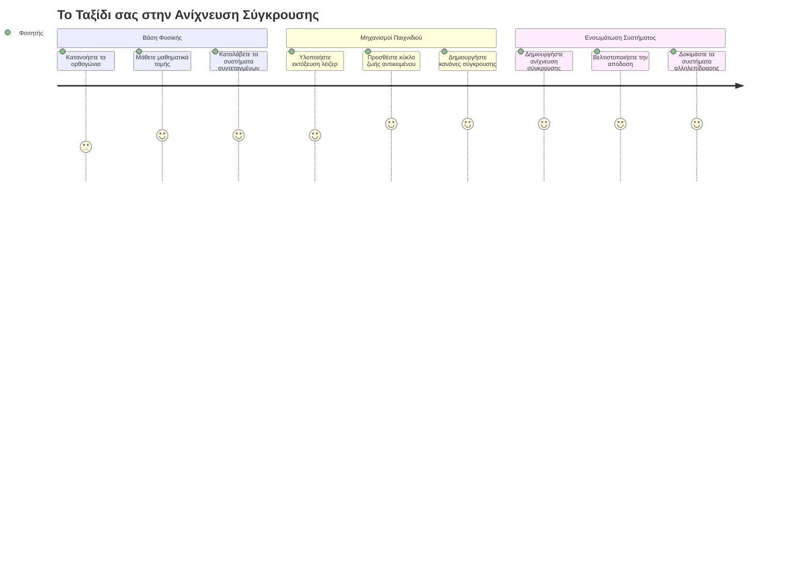
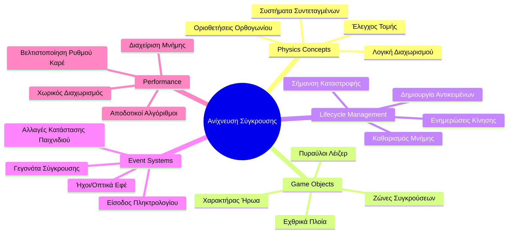
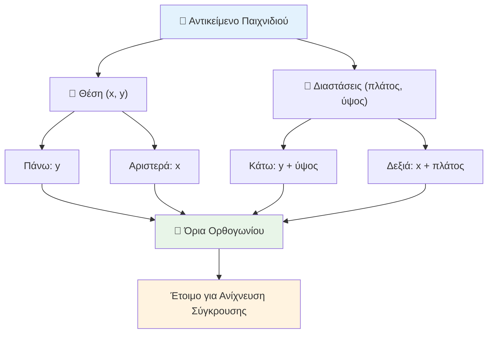
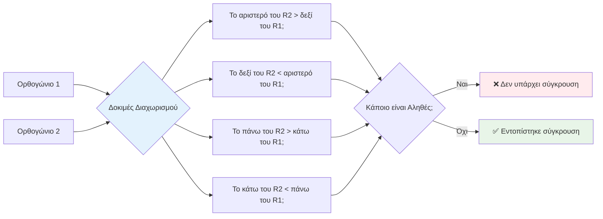
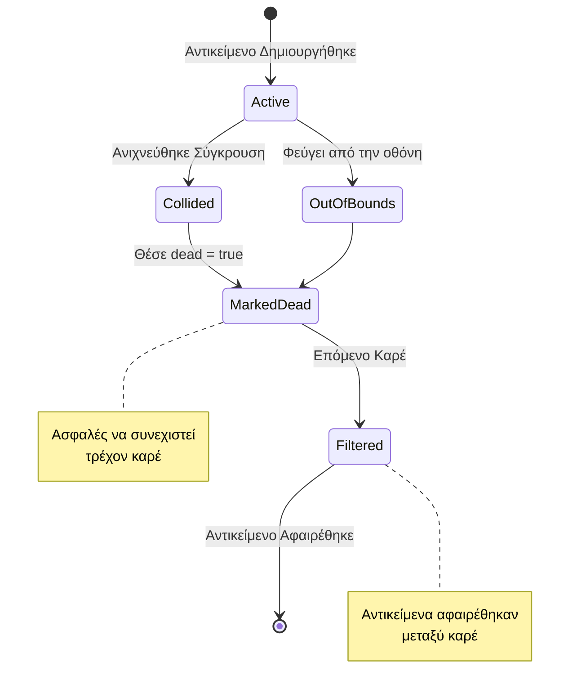
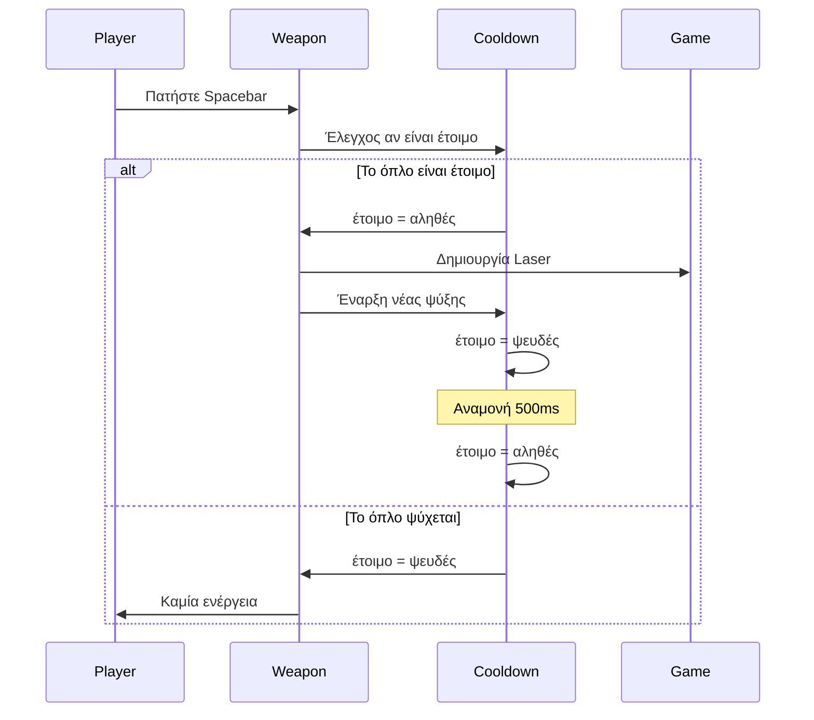
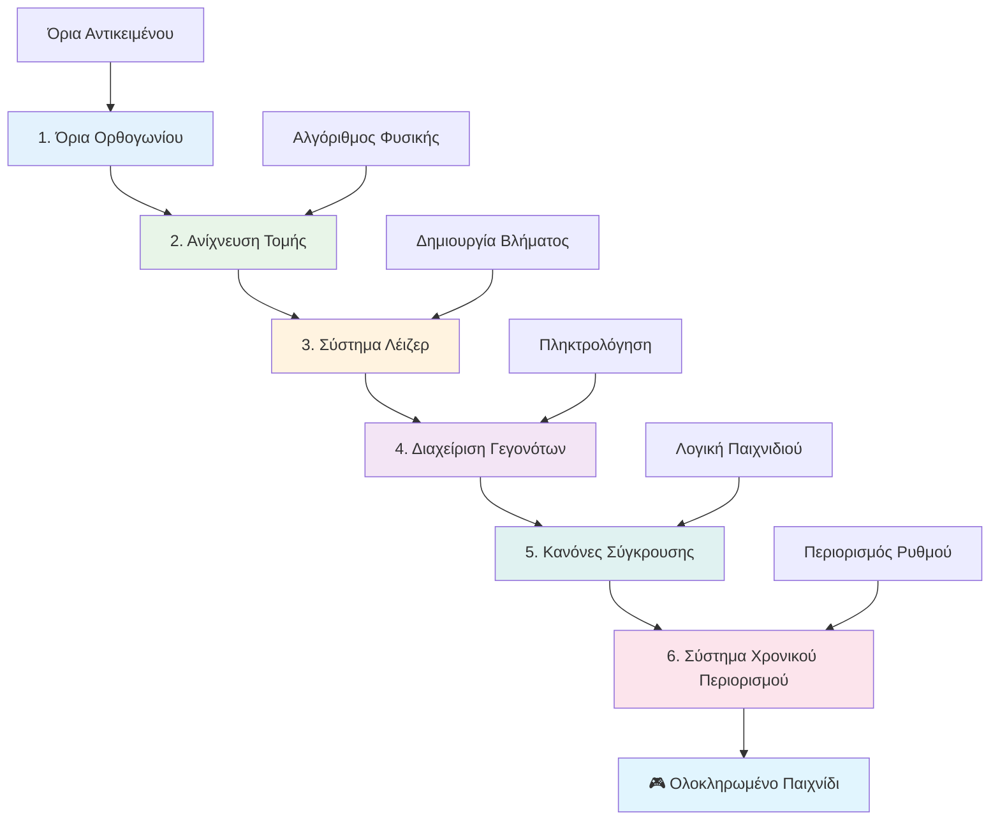
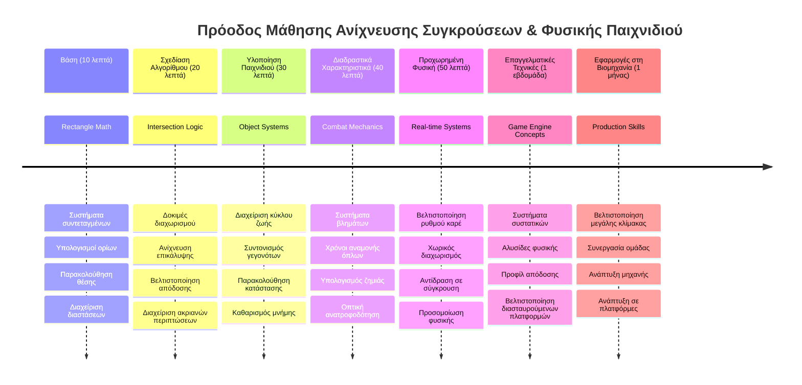

# Δημιουργία ενός Διαστημικού Παιχνιδιού Μέρος 4: Προσθήκη Ακτίνας Λέιζερ και Ανίχνευση Συγκρούσεων


## Προ-διάλεξη Αξιολόγηση

[Προ-διάλεξη αξιολόγηση](https://ff-quizzes.netlify.app/web/quiz/35)

Σκέψου τη στιγμή στο Star Wars όταν οι τορπίλες πρωτονίων του Luke χτυπούν την έξοδο καυσαερίων του Death Star. Αυτή η ακριβής ανίχνευση σύγκρουσης άλλαξε τη μοίρα του γαλαξία! Στα παιχνίδια, η ανίχνευση συγκρούσεων λειτουργεί με τον ίδιο τρόπο - καθορίζει πότε τα αντικείμενα αλληλεπιδρούν και τι συμβαίνει μετά.

Σε αυτό το μάθημα, θα προσθέσεις όπλα λέιζερ στο διαστημικό σου παιχνίδι και θα υλοποιήσεις την ανίχνευση συγκρούσεων. Όπως οι σχεδιαστές αποστολών της NASA υπολογίζουν τις τροχιές των διαστημοπλοίων για να αποφύγουν τα συντρίμμια, έτσι κι εσύ θα μάθεις πώς να ανιχνεύεις πότε τα αντικείμενα παιχνιδιού τέμνονται. Θα το χωρίσουμε σε διαχειρίσιμα βήματα που βασίζονται το ένα στο άλλο.

Μέχρι το τέλος, θα έχεις ένα λειτουργικό σύστημα μάχης όπου τα λέιζερ καταστρέφουν τους εχθρούς και οι συγκρούσεις ενεργοποιούν γεγονότα στο παιχνίδι. Αυτές οι ίδιες αρχές σύγκρουσης χρησιμοποιούνται σε όλα, από προσομοιώσεις φυσικής μέχρι διαδραστικές διεπαφές ιστού.


✅ Κάνε λίγη έρευνα για το πολύ πρώτο υπολογιστικό παιχνίδι που γράφτηκε ποτέ. Ποια ήταν η λειτουργικότητά του;

## Ανίχνευση Συγκρούσεων

Η ανίχνευση συγκρούσεων λειτουργεί όπως οι αισθητήρες πλησιμότητας στο σεληνιακό όχημα Apollo - ελέγχει συνεχώς αποστάσεις και ενεργοποιεί συναγερμούς όταν τα αντικείμενα πλησιάζουν πολύ κοντά. Στα παιχνίδια, αυτό το σύστημα καθορίζει πότε τα αντικείμενα αλληλεπιδρούν και τι πρέπει να συμβεί στη συνέχεια.

Η προσέγγιση που θα χρησιμοποιήσουμε αντιμετωπίζει κάθε αντικείμενο του παιχνιδιού ως ορθογώνιο, παρόμοια με το πώς τα συστήματα ελέγχου εναέριας κυκλοφορίας χρησιμοποιούν απλοποιημένα γεωμετρικά σχήματα για την παρακολούθηση αεροσκαφών. Η ορθογώνια μέθοδος μπορεί να φαίνεται βασική, αλλά είναι υπολογιστικά αποδοτική και λειτουργεί καλά στις περισσότερες περιπτώσεις παιχνιδιών.

### Αναπαράσταση Ορθογωνίου

Κάθε αντικείμενο παιχνιδιού χρειάζεται συντεταγμένες ορίων, παρόμοια με το πώς το ρομπότ Mars Pathfinder χαρτογράφησε τη θέση του στην επιφάνεια του Άρη. Να πώς ορίζουμε αυτές τις συντεταγμένες ορίων:


```javascript
rectFromGameObject() {
  return {
    top: this.y,
    left: this.x,
    bottom: this.y + this.height,
    right: this.x + this.width
  }
}
```

**Αναλύουμε αυτό:**
- **Άνω άκρη**: Είναι το σημείο όπου ξεκινά το αντικείμενο κάθετα (η θέση y)
- **Αριστερή άκρη**: Το σημείο όπου ξεκινά οριζόντια (η θέση x)
- **Κάτω άκρη**: Πρόσθεσε το ύψος στην τιμή y - τώρα ξέρεις πού τελειώνει!
- **Δεξιά άκρη**: Πρόσθεσε το πλάτος στην τιμή x - και έχεις το πλήρες όριο

### Αλγόριθμος Τομής

Η ανίχνευση τομών ορθογωνίων χρησιμοποιεί λογική παρόμοια με το πώς το διαστημικό τηλεσκόπιο Hubble καθορίζει αν ουράνια αντικείμενα αλληλεπικαλύπτονται στο πεδίο ορατότητάς του. Ο αλγόριθμος ελέγχει τη διαχωριστική κατάσταση:


```javascript
function intersectRect(r1, r2) {
  return !(r2.left > r1.right ||
    r2.right < r1.left ||
    r2.top > r1.bottom ||
    r2.bottom < r1.top);
}
```

**Η δοκιμή διαχωρισμού λειτουργεί όπως τα ραντάρ:**
- Είναι το ορθογώνιο 2 εντελώς δεξιά του ορθογωνίου 1;
- Είναι το ορθογώνιο 2 εντελώς αριστερά του ορθογωνίου 1;
- Είναι το ορθογώνιο 2 εντελώς κάτω από το ορθογώνιο 1;
- Είναι το ορθογώνιο 2 εντελώς πάνω από το ορθογώνιο 1;

Αν κανένας από αυτούς τους όρους δεν ισχύει, τα ορθογώνια πρέπει να αλληλεπικαλύπτονται. Αυτή η προσέγγιση αντανακλά το πώς οι χειριστές ραντάρ καθορίζουν αν δύο αεροσκάφη είναι σε ασφαλείς αποστάσεις.

## Διαχείριση Κύκλου Ζωής Αντικειμένων

Όταν ένα λέιζερ χτυπά έναν εχθρό, και τα δύο αντικείμενα πρέπει να αφαιρεθούν από το παιχνίδι. Ωστόσο, η διαγραφή αντικειμένων κατά τη διάρκεια ενός βρόχου μπορεί να προκαλέσει σφάλματα - ένα μάθημα που μάθανε δύσκολα τα πρώιμα συστήματα υπολογιστών όπως ο Apollo Guidance Computer. Αντίθετα, χρησιμοποιούμε μια προσέγγιση "σήμανσης για διαγραφή" που αφαιρεί με ασφάλεια αντικείμενα μεταξύ των καρέ.


Να πώς σηματοδοτούμε κάτι για αφαίρεση:

```javascript
// Σήμανση αντικειμένου για αφαίρεση
enemy.dead = true;
```

**Γιατί λειτουργεί αυτή η προσέγγιση:**
- Σηματοδοτούμε το αντικείμενο ως "νεκρό" αλλά δεν το διαγράφουμε αμέσως
- Επιτρέπει στο τρέχον καρέ του παιχνιδιού να ολοκληρωθεί με ασφάλεια
- Αποφεύγονται σφάλματα από προσπάθειες χρήσης αντικειμένων που έχουν ήδη φύγει!

Έπειτα φιλτράρουμε τα σημαδεμένα αντικείμενα πριν από τον επόμενο κύκλο απόδοσης:

```javascript
gameObjects = gameObjects.filter(go => !go.dead);
```

**Τι κάνει αυτή η φιλτράρισμα:**
- Δημιουργεί μια καινούρια λίστα μόνο με τα "ζωντανά" αντικείμενα
- Απομακρύνει οτιδήποτε έχει σημαδευτεί ως νεκρό
- Διατηρεί το παιχνίδι ομαλό στη λειτουργία
- Αποτρέπει συσσώρευση καταστραμμένων αντικειμένων και φούσκωμα μνήμης

## Υλοποίηση Μηχανισμών Λέιζερ

Τα λέιζερ στα παιχνίδια λειτουργούν με την ίδια αρχή όπως οι φαντοτορπίλες στο Star Trek - είναι διακριτά αντικείμενα που ταξιδεύουν σε ευθεία γραμμή μέχρι να χτυπήσουν κάτι. Κάθε πάτημα του spacebar δημιουργεί ένα νέο αντικείμενο λέιζερ που κινείται στην οθόνη.

Για να λειτουργήσει, πρέπει να συντονίσουμε μερικά κομμάτια:

**Βασικά στοιχεία υλοποίησης:**
- **Δημιουργία** αντικειμένων λέιζερ που εμφανίζονται από τη θέση του ήρωα
- **Διαχείριση** εισόδου από το πληκτρολόγιο για την εκτόξευση λέιζερ
- **Διαχείριση** κίνησης και κύκλου ζωής των λέιζερ
- **Υλοποίηση** οπτικής αναπαράστασης των βλημάτων λέιζερ

## Υλοποίηση Ελέγχου Ρυθμού Πυροδότησης

Οι απεριόριστοι ρυθμοί πυρκαγιάς θα υπερφορτώσουν τη μηχανή του παιχνιδιού και θα κάνουν το παιχνίδι πάρα πολύ εύκολο. Τα πραγματικά όπλα έχουν παρόμοιους περιορισμούς - ακόμα και οι φακοί του USS Enterprise χρειάζονταν χρόνο επαναφόρτισης ανάμεσα σε βολές.

Θα υλοποιήσουμε ένα σύστημα cooldown που εμποδίζει το spam rapid-fire ενώ διατηρεί τα χειριστήρια ευαίσθητα:


```javascript
class Cooldown {
  constructor(time) {
    this.cool = false;
    setTimeout(() => {
      this.cool = true;
    }, time);
  }
}

class Weapon {
  constructor() {
    this.cooldown = null;
  }
  
  fire() {
    if (!this.cooldown || this.cooldown.cool) {
      // Δημιουργία δέσμης λέιζερ
      this.cooldown = new Cooldown(500);
    } else {
      // Το όπλο ακόμα ψύχεται
    }
  }
}
```

**Πώς λειτουργεί το cooldown:**
- Όταν το όπλο δημιουργείται, είναι "ζεστό" (δεν μπορεί να πυροβολήσει)
- Μετά την περίοδο αναμονής, γίνεται "κρύο" (έτοιμο να πυροβολήσει)
- Πριν από το πυροβολισμό ελέγχουμε: "Είναι το όπλο κρύο;"
- Αυτό αποτρέπει το spam κλικ ενώ διατηρεί responsive τα χειριστήρια

✅ Ανατρέξτε στο μάθημα 1 στη σειρά του διαστημικού παιχνιδιού για υπενθύμιση σχετικά με τα cooldowns.

## Δημιουργία Συστήματος Ανίχνευσης Συγκρούσεων

Θα επεκτείνεις τον υπάρχοντα κώδικα του διαστημικού σου παιχνιδιού για να δημιουργήσεις ένα σύστημα ανίχνευσης συγκρούσεων. Όπως το αυτόματο σύστημα αποφυγής συγκρούσεων στον Διεθνή Διαστημικό Σταθμό, το παιχνίδι σου θα παρακολουθεί συνεχώς τις θέσεις των αντικειμένων και θα αντιδρά σε τομές.

Ξεκινώντας από τον κώδικα της προηγούμενης διάλεξής σου, θα προσθέσεις την ανίχνευση συγκρούσεων με συγκεκριμένους κανόνες που διέπουν τις αλληλεπιδράσεις των αντικειμένων.

> 💡 **Συμβουλή:** Το sprite του λέιζερ είναι ήδη μέσα στον φάκελο assets και αναφέρεται στον κώδικά σου, έτοιμο για υλοποίηση.

### Κανόνες Σύγκρουσης για Υλοποίηση

**Μηχανισμοί παιχνιδιού για προσθήκη:**
1. **Η ακτίνα λέιζερ χτυπά τον εχθρό**: Το αντικείμενο του εχθρού καταστρέφεται όταν χτυπηθεί από ακτίνα λέιζερ
2. **Η ακτίνα λέιζερ φτάνει στα όρια της οθόνης**: Η ακτίνα αφαιρείται όταν φτάνει στο πάνω όριο της οθόνης
3. **Σύγκρουση εχθρού και ήρωα**: Καταστρέφονται και τα δύο αντικείμενα όταν τέμνονται
4. **Ο εχθρός φτάνει κάτω στην οθόνη**: Συνθήκη game over όταν οι εχθροί φτάνουν στο κάτω μέρος της οθόνης

### 🔄 **Παιδαγωγικός Έλεγχος**
**Βάσεις Ανίχνευσης Συγκρούσεων**: Πριν την υλοποίηση, βεβαιώσου ότι κατανοείς:
- ✅ Πώς τα όρια των ορθογωνίων ορίζουν τις ζώνες σύγκρουσης
- ✅ Γιατί οι δοκιμές διαχωρισμού είναι πιο αποδοτικές από τον υπολογισμό τομής
- ✅ Τη σημασία της διαχείρισης κύκλου ζωής των αντικειμένων σε βρόχους παιχνιδιών
- ✅ Πώς τα συστήματα με ενεργοποίηση με γεγονότα συντονίζουν τις αντιδράσεις σύγκρουσης

**Γρήγορη Αυτο-αξιολόγηση**: Τι θα συνέβαινε αν διέγραφες τα αντικείμενα αμέσως χωρίς να τα σημαδεύεις πρώτα;
*Απάντηση: Η διαγραφή στο μέσο βρόχου μπορεί να προκαλέσει σφάλματα ή παράλειψη αντικειμένων στην επανάληψη*

**Κατανόηση Φυσικής**: Τώρα καταλαβαίνεις:
- **Συστήματα Συντεταγμένων**: Πώς η θέση και οι διαστάσεις δημιουργούν όρια
- **Λογική Τομής**: Μαθηματικές αρχές πίσω από την ανίχνευση σύγκρουσης
- **Βελτιστοποίηση Απόδοσης**: Γιατί είναι σημαντικοί οι αποδοτικοί αλγόριθμοι σε πραγματικό χρόνο
- **Διαχείριση Μνήμης**: Ασφαλή πρότυπα κύκλου ζωής αντικειμένων για σταθερότητα

## Ρύθμιση του Περιβάλλοντος Ανάπτυξής σου

Καλά νέα - έχουμε ήδη στήσει τα περισσότερα από τα θεμέλια για εσένα! Όλα τα assets του παιχνιδιού και η βασική δομή περιμένουν στον υποφάκελο `your-work`, έτοιμα για να προσθέσεις τις νέες λειτουργίες σύγκρουσης.

### Δομή Έργου

```bash
-| assets
  -| enemyShip.png
  -| player.png
  -| laserRed.png
-| index.html
-| app.js
-| package.json
```

**Κατανόηση της δομής αρχείων:**
- **Περιέχει** όλες τις εικόνες sprite που χρειάζονται για τα αντικείμενα παιχνιδιού
- **Περιλαμβάνει** το κύριο αρχείο HTML και το αρχείο JavaScript της εφαρμογής
- **Παρέχει** τη ρύθμιση πακέτου για τοπικό διακομιστή ανάπτυξης

### Εκκίνηση Τοπικού Διακομιστή

Πήγαινε στον φάκελο του έργου σου και εκκίνησε τον τοπικό διακομιστή:

```bash
cd your-work
npm start
```

**Αυτή η εντολή:**
- **Αλλάζει** τον κατάλογο στον φάκελο εργασίας του έργου σου
- **Ξεκινάει** έναν τοπικό διακομιστή HTTP στο `http://localhost:5000`
- **Εξυπηρετεί** τα αρχεία του παιχνιδιού για δοκιμή και ανάπτυξη
- **Ενεργοποιεί** ζωντανή ανάπτυξη με αυτόματο reload

Άνοιξε το πρόγραμμα περιήγησής σου και πήγαινε στο `http://localhost:5000` για να δεις την τρέχουσα κατάσταση του παιχνιδιού με τον ήρωα και τους εχθρούς στην οθόνη.

### Υλοποίηση Βήμα-βήμα

Όπως η συστηματική προσέγγιση που χρησιμοποίησε η NASA για τον προγραμματισμό του Voyager, θα υλοποιήσουμε την ανίχνευση συγκρούσεων μεθοδικά, κατασκευάζοντας κάθε στοιχείο βήμα βήμα.


#### 1. Πρόσθεσε όρια σύγκρουσης ορθογωνίου

Πρώτα, ας μάθουμε στα αντικείμενα του παιχνιδιού μας πώς να περιγράφουν τα όριά τους. Πρόσθεσε αυτή τη μέθοδο στην κλάση `GameObject` σου:

```javascript
rectFromGameObject() {
    return {
      top: this.y,
      left: this.x,
      bottom: this.y + this.height,
      right: this.x + this.width,
    };
  }
```

**Αυτή η μέθοδος επιτυγχάνει:**
- **Δημιουργεί** ένα αντικείμενο ορθογωνίου με ακριβείς συντεταγμένες ορίων
- **Υπολογίζει** την κάτω και δεξιά άκρη με χρήση θέσης και διαστάσεων
- **Επιστρέφει** ένα αντικείμενο έτοιμο για αλγορίθμους ανίχνευσης σύγκρουσης
- **Παρέχει** τυποποιημένη διεπαφή για όλα τα αντικείμενα παιχνιδιού

#### 2. Υλοποίηση ανίχνευσης τομής

Τώρα ας φτιάξουμε τον ντετέκτιβ σύγκρουσης - μια συνάρτηση που μπορεί να πει πότε δύο ορθογώνια επικαλύπτονται:

```javascript
function intersectRect(r1, r2) {
  return !(
    r2.left > r1.right ||
    r2.right < r1.left ||
    r2.top > r1.bottom ||
    r2.bottom < r1.top
  );
}
```

**Αυτός ο αλγόριθμος λειτουργεί έτσι:**
- **Ελέγχει** τέσσερις συνθήκες διαχωρισμού μεταξύ ορθογωνίων
- **Επιστρέφει** `false` αν ισχύει οποιαδήποτε διαχωριστική συνθήκη
- **Δείχνει** σύγκρουση όταν δεν υπάρχει διαχωρισμός
- **Χρησιμοποιεί** τη λογική άρνησης για αποδοτικό έλεγχο τομής

#### 3. Υλοποίηση συστήματος εκτόξευσης λέιζερ

Εδώ τα πράγματα γίνονται συναρπαστικά! Ας φτιάξουμε το σύστημα εκτόξευσης λέιζερ.

##### Σταθερές μηνυμάτων

Πρώτα, ας ορίσουμε τύπους μηνυμάτων ώστε τα διαφορετικά μέρη του παιχνιδιού μας να μπορούν να επικοινωνούν:

```javascript
KEY_EVENT_SPACE: "KEY_EVENT_SPACE",
COLLISION_ENEMY_LASER: "COLLISION_ENEMY_LASER",
COLLISION_ENEMY_HERO: "COLLISION_ENEMY_HERO",
```

**Αυτές οι σταθερές παρέχουν:**
- **Τυποποιούν** τα ονόματα γεγονότων σε όλη την εφαρμογή
- **Επιτρέπουν** συνεπή επικοινωνία ανάμεσα στα συστήματα του παιχνιδιού
- **Αποτρέπουν** λάθη ορθογραφίας κατά την εγγραφή χειριστών γεγονότων

##### Διαχείριση εισόδου πληκτρολογίου

Πρόσθεσε ανίχνευση πλήκτρου διαστήματος στον ακροατή γεγονότων πλήκτρων:

```javascript
} else if(evt.keyCode === 32) {
  eventEmitter.emit(Messages.KEY_EVENT_SPACE);
}
```

**Αυτός ο χειριστής εισόδου:**
- **Ανιχνεύει** πατήματα space με το keyCode 32
- **Αποστέλλει** ένα τυποποιημένο μήνυμα γεγονότος
- **Επιτρέπει** αποσυνδεδεμένη λογική εκτόξευσης

##### Ρύθμιση ακροατών γεγονότων

Καταχώρησε τη συμπεριφορά εκτόξευσης στη λειτουργία `initGame()`:

```javascript
eventEmitter.on(Messages.KEY_EVENT_SPACE, () => {
 if (hero.canFire()) {
   hero.fire();
 }
});
```

**Αυτός ο ακροατής:**
- **Αντιδρά** σε γεγονότα πλήκτρου space
- **Ελέγχει** κατάσταση cooldown πριν πυροβολήσει
- **Ενεργοποιεί** δημιουργία λέιζερ όταν επιτρέπεται

Πρόσθεσε χειρισμό συγκρούσεων για αλληλεπιδράσεις λέιζερ-εχθρού:

```javascript
eventEmitter.on(Messages.COLLISION_ENEMY_LASER, (_, { first, second }) => {
  first.dead = true;
  second.dead = true;
});
```

**Αυτός ο χειριστής σύγκρουσης:**
- **Λαμβάνει** δεδομένα γεγονότος σύγκρουσης με τα δύο αντικείμενα
- **Σηματοδοτεί** και τα δύο αντικείμενα για αφαίρεση
- **Εξασφαλίζει** σωστό καθαρισμό μετά τη σύγκρουση

#### 4. Δημιουργία κλάσης Laser

Υλοποίησε ένα βλήμα λέιζερ που κινείται προς τα επάνω και διαχειρίζεται τον κύκλο ζωής του:

```javascript
class Laser extends GameObject {
  constructor(x, y) {
    super(x, y);
    this.width = 9;
    this.height = 33;
    this.type = 'Laser';
    this.img = laserImg;
    
    let id = setInterval(() => {
      if (this.y > 0) {
        this.y -= 15;
      } else {
        this.dead = true;
        clearInterval(id);
      }
    }, 100);
  }
}
```

**Αυτή η υλοποίηση κλάσης:**
- **Επεκτείνει** την GameObject για να κληρονομήσει βασική λειτουργικότητα
- **Ορίζει** τις κατάλληλες διαστάσεις για το sprite του λέιζερ
- **Δημιουργεί** αυτόματη κίνηση προς τα πάνω με `setInterval()`
- **Διαχειρίζεται** την αυτοκαταστροφή όταν φτάσει στην κορυφή της οθόνης
- **Διαχειρίζεται** τη χρονομέτρηση της κινούμενης εικόνας και τον καθαρισμό

#### 5. Υλοποίηση συστήματος ανίχνευσης συγκρούσεων

Δημιούργησε μια ολοκληρωμένη συνάρτηση ανίχνευσης συγκρούσεων:

```javascript
function updateGameObjects() {
  const enemies = gameObjects.filter(go => go.type === 'Enemy');
  const lasers = gameObjects.filter(go => go.type === "Laser");
  
  // Δοκιμή συγκρούσεων λέιζερ-εχθρού
  lasers.forEach((laser) => {
    enemies.forEach((enemy) => {
      if (intersectRect(laser.rectFromGameObject(), enemy.rectFromGameObject())) {
        eventEmitter.emit(Messages.COLLISION_ENEMY_LASER, {
          first: laser,
          second: enemy,
        });
      }
    });
  });

  // Αφαίρεση καταστραμμένων αντικειμένων
  gameObjects = gameObjects.filter(go => !go.dead);
}
```

**Αυτό το σύστημα σύγκρουσης:**
- **Φιλτράρει** αντικείμενα παιχνιδιού κατά τύπο για αποδοτικό έλεγχο
- **Ελέγχει** κάθε λέιζερ έναντι κάθε εχθρού για τομές
- **Αποστέλλει** γεγονότα σύγκρουσης όταν εντοπίζει τομές
- **Καθαρίζει** αντικείμενα που καταστράφηκαν μετά την επεξεργασία σύγκρουσης

> ⚠️ **Σημαντικό**: Πρόσθεσε `updateGameObjects()` στον κύριο βρόχο παιχνιδιού μέσα στο `window.onload` για να ενεργοποιήσεις την ανίχνευση συγκρούσεων.

#### 6. Πρόσθεσε σύστημα cooldown στην κλάση Hero

Εμπλούτισε την κλάση Hero με τη μηχανική του πυροβολισμού και τον περιορισμό ρυθμού:

```javascript
class Hero extends GameObject {
  constructor(x, y) {
    super(x, y);
    this.width = 99;
    this.height = 75;
    this.type = "Hero";
    this.speed = { x: 0, y: 0 };
    this.cooldown = 0;
  }
  
  fire() {
    gameObjects.push(new Laser(this.x + 45, this.y - 10));
    this.cooldown = 500;

    let id = setInterval(() => {
      if (this.cooldown > 0) {
        this.cooldown -= 100;
      } else {
        clearInterval(id);
      }
    }, 200);
  }
  
  canFire() {
    return this.cooldown === 0;
  }
}
```

**Κατανόηση της ενισχυμένης κλάσης Hero:**
- **Αρχικοποιεί** τον χρονοδιακόπτη cooldown στο μηδέν (έτοιμος να πυροβολήσει)
- **Δημιουργεί** αντικείμενα λέιζερ τοποθετημένα πάνω από το πλοίο ήρωα
- **Ορίζει** περίοδο cooldown για αποφυγή γρήγορων βολών
- **Μειώνει** τον χρόνο cooldown με ενημερώσεις βάσει διαστημάτων
- **Παρέχει** μέθοδο `canFire()` για έλεγχο κατάστασης πυροδότησης

### 🔄 **Παιδαγωγικός Έλεγχος**
**Ολοκληρωμένη Κατανόηση Συστήματος**: Επαλήθευσε την εξοικείωσή σου με το σύστημα σύγκρουσης:
- ✅ Πώς τα όρια των ορθογωνίων επιτρέπουν αποδοτική ανίχνευση σύγκρουσης;
- ✅ Γιατί η διαχείριση κύκλου ζωής αντικειμένων είναι κρίσιμη για τη σταθερότητα του παιχνιδιού;
- ✅ Πώς το σύστημα cooldown αποτρέπει προβλήματα απόδοσης;
- ✅ Ποιος ρόλος παίζει η αρχιτεκτονική βάσει γεγονότων στον χειρισμό συγκρούσεων;

**Ενσωμάτωση Συστήματος**: Η ανίχνευση σύγκρουσης σου δείχνει:
- **Μαθηματική Ακρίβεια**: Αλγόριθμοι τομής ορθογωνίων
- **Βελτιστοποίηση Απόδοσης**: Αποδοτικά πρότυπα δοκιμών σύγκρουσης
- **Διαχείριση Μνήμης**: Ασφαλής δημιουργία και καταστροφή αντικειμένων
- **Συντονισμός Γεγονότων**: Αποσυνδεδεμένη επικοινωνία συστήματος
- **Επεξεργασία σε Πραγματικό Χρόνο**: Ενημερώσεις βάσει καρέ

**Επαγγελματικά Πρότυπα**: Υλοποίησες:
- **Διαχωρισμός Ευθυνών**: Διαχωρισμός φυσικής, απόδοσης και εισόδου
- **Αντικειμενοστραφής Σχεδιασμός**: Κληρονομικότητα και πολυμορφισμός
- **Διαχείριση Κατάστασης**: Κύκλος ζωής αντικειμένων και παρακολούθηση κατάστασης παιχνιδιού
- **Βελτιστοποίηση Απόδοσης**: Αποτελεσματικοί αλγόριθμοι για χρήση σε πραγματικό χρόνο

### Δοκιμή της Υλοποίησής σου

Το διαστημικό σου παιχνίδι τώρα διαθέτει πλήρη σύστημα ανίχνευσης συγκρούσεων και μηχανισμό μάχης. 🚀 Δοκίμασε αυτές τις νέες δυνατότητες:
- **Πλοήγηση** με τα πλήκτρα βελών για επαλήθευση ελέγχου κίνησης
- **Πυροβόλησε** λέιζερ με το spacebar - παρατήρησε πώς το cooldown αποτρέπει το spam
- **Παρατήρησε συγκρούσεις** όταν τα λέιζερ χτυπούν εχθρούς, ενεργοποιώντας αφαίρεση
- **Επιβεβαίωσε καθαρισμό** καθώς τα καταστραμμένα αντικείμενα εξαφανίζονται από το παιχνίδι

Έχεις υλοποιήσει επιτυχώς σύστημα ανίχνευσης συγκρούσεων χρησιμοποιώντας τις ίδιες μαθηματικές αρχές που καθοδηγούν την πλοήγηση διαστημοπλοίων και ρομποτική.

### ⚡ **Τι μπορείς να κάνεις στα επόμενα 5 λεπτά**
- [ ] Άνοιξε τα DevTools του browser και θέσε σημεία διακοπής στη λειτουργία ανίχνευσης σύγκρουσης
- [ ] Δοκίμασε να τροποποιήσεις την ταχύτητα των λέιζερ ή την κίνηση των εχθρών για να δεις τα αποτελέσματα σύγκρουσης
- [ ] Πειραματίσου με διαφορετικές τιμές cooldown για να δοκιμάσεις τους ρυθμούς πυροδότησης
- [ ] Προσθέστε δηλώσεις `console.log` για να παρακολουθείτε σε πραγματικό χρόνο τα συμβάντα σύγκρουσης

### 🎯 **Τι Μπορείτε να Κατακτήσετε Αυτή την Ώρα**
- [ ] Ολοκληρώστε το κουίζ μετά το μάθημα και κατανοήστε τους αλγορίθμους ανίχνευσης σύγκρουσης
- [ ] Προσθέστε οπτικά εφέ όπως εκρήξεις όταν συμβαίνουν συγκρούσεις
- [ ] Υλοποιήστε διαφορετικούς τύπους βλημάτων με μεταβαλλόμενες ιδιότητες
- [ ] Δημιουργήστε power-ups που ενισχύουν προσωρινά τις ικανότητες του παίκτη
- [ ] Προσθέστε ηχητικά εφέ για πιο ικανοποιητικές συγκρούσεις

### 📅 **Η Εβδομαδιαία Φυσική Προγραμματισμού Σας**
- [ ] Ολοκληρώστε το πλήρες παιχνίδι στο διάστημα με βελτιωμένα συστήματα σύγκρουσης
- [ ] Υλοποιήστε προηγμένα σχήματα σύγκρουσης πέρα από ορθογώνια (κύκλοι, πολύγωνα)
- [ ] Προσθέστε συστήματα σωματιδίων για ρεαλιστικά εφέ εκρήξεων
- [ ] Δημιουργήστε πολύπλοκη συμπεριφορά εχθρών με αποφυγή συγκρούσεων
- [ ] Βελτιστοποιήστε την ανίχνευση σύγκρουσης για καλύτερη απόδοση με πολλά αντικείμενα
- [ ] Προσθέστε προσομοίωση φυσικής όπως ορμή και ρεαλιστική κίνηση

### 🌟 **Η Μηνιαία Κατάρτιση στη Φυσική Παιχνιδιών Σας**
- [ ] Δημιουργήστε παιχνίδια με προηγμένες μηχανές φυσικής και ρεαλιστικές προσομοιώσεις
- [ ] Μάθετε ανίχνευση σύγκρουσης 3D και αλγορίθμους χωρικής διαίρεσης
- [ ] Συνεισφέρετε σε βιβλιοθήκες φυσικής ανοιχτού κώδικα και μηχανές παιχνιδιών
- [ ] Εξειδικευτείτε στη βελτιστοποίηση απόδοσης για εφαρμογές με βαριά γραφικά
- [ ] Δημιουργήστε εκπαιδευτικό περιεχόμενο σχετικά με φυσική παιχνιδιών και ανίχνευση σύγκρουσης
- [ ] Δημιουργήστε χαρτοφυλάκιο που επιδεικνύει προηγμένες δεξιότητες προγραμματισμού φυσικής

## 🎯 Το Χρονοδιάγραμμα Κατάκτησης Ανίχνευσης Σύγκρουσης


### 🛠️ Περίληψη του Εργαλείου Φυσικής Παιχνιδιών Σας

Μετά την ολοκλήρωση αυτού του μαθήματος, τώρα έχετε κατακτήσει:
- **Μαθηματικά Σύγκρουσης**: Αλγόριθμοι τομής ορθογωνίων και συστήματα συντεταγμένων
- **Βελτιστοποίηση Απόδοσης**: Αποδοτική ανίχνευση σύγκρουσης για εφαρμογές σε πραγματικό χρόνο
- **Διαχείριση Κύκλου Ζωής Αντικειμένων**: Ασφαλή πρότυπα δημιουργίας, ενημέρωσης και καταστροφής
- **Αρχιτεκτονική Εκδηλώσεων**: Αποσυνδεδεμένα συστήματα για απόκριση σύγκρουσης
- **Ενσωμάτωση Βρόχου Παιχνιδιού**: Ενημερώσεις φυσικής ανά καρέ και συντονισμός απόδοσης
- **Συστήματα Εισόδου**: Ανταποκρινόμενοι έλεγχοι με περιορισμό ρυθμού και ανατροφοδότηση
- **Διαχείριση Μνήμης**: Αποδοτική επαναχρησιμοποίηση αντικειμένων και στρατηγικές καθαρισμού

**Εφαρμογές στον Πραγματικό Κόσμο**: Οι δεξιότητες ανίχνευσης σύγκρουσης εφαρμόζονται άμεσα σε:
- **Διαδραστικές Προσομοιώσεις**: Επιστημονική μοντελοποίηση και εκπαιδευτικά εργαλεία
- **Σχεδίαση Διεπαφής Χρήστη**: Συναρτήσεις σύρσεως και ανίχνευση αφής
- **Οπτικοποίηση Δεδομένων**: Διαδραστικά διαγράμματα και κλικ σε στοιχεία
- **Κινητή Ανάπτυξη**: Αναγνώριση χειρονομιών αφής και χειρισμός σύγκρουσης
- **Προγραμματισμός Ρομποτικής**: Σχεδιασμός διαδρομών και αποφυγή εμποδίων
- **Γραφικά Υπολογιστών**: Ακτινοβολία και χωρικοί αλγόριθμοι

**Επαγγελματικές Δεξιότητες που Αποκτήσατε**: Τώρα μπορείτε να:
- **Σχεδιάζετε** αποδοτικούς αλγόριθμους για ανίχνευση σύγκρουσης σε πραγματικό χρόνο
- **Υλοποιήσετε** συστήματα φυσικής που κλιμακώνονται με την πολυπλοκότητα αντικειμένων
- **Εντοπίζετε σφάλματα** σε πολύπλοκα συστήματα αλληλεπίδρασης με μαθηματικές αρχές
- **Βελτιστοποιήσετε** την απόδοση για διάφορες δυνατότητες υλικού και προγράμματος περιήγησης
- **Αρχιτεκτονήσετε** συντηρήσιμα συστήματα παιχνιδιών χρησιμοποιώντας δοκιμασμένα πρότυπα σχεδιασμού

**Κατακτήσεις Εννοιών Ανάπτυξης Παιχνιδιών**:
- **Προσομοίωση Φυσικής**: Ανίχνευση και απόκριση σύγκρουσης σε πραγματικό χρόνο
- **Τεχνική Απόδοσης**: Βελτιστοποιημένοι αλγόριθμοι για διαδραστικές εφαρμογές
- **Συστήματα Εκδηλώσεων**: Αποσυνδεδεμένη επικοινωνία ανάμεσα σε συστατικά παιχνιδιού
- **Διαχείριση Αντικειμένων**: Αποτελεσματικά πρότυπα κύκλου ζωής για δυναμικό περιεχόμενο
- **Χειρισμός Εισόδου**: Ανταποκρινόμενοι έλεγχοι με κατάλληλη ανατροφοδότηση

**Επόμενο Επίπεδο**: Είστε έτοιμοι να εξερευνήσετε προηγμένες μηχανές φυσικής όπως το Matter.js, να υλοποιήσετε ανίχνευση σύγκρουσης 3D ή να δημιουργήσετε πολύπλοκα συστήματα σωματιδίων!

🌟 **Κατάκτηση Ξεκλειδώθηκε**: Δημιουργήσατε ένα πλήρες σύστημα αλληλεπίδρασης βασισμένο στη φυσική με σύγκρουση επαγγελματικού επιπέδου!

## Πρόκληση Πράκτορα GitHub Copilot 🚀

Χρησιμοποιήστε τη λειτουργία Πράκτορα για να ολοκληρώσετε την ακόλουθη πρόκληση:

**Περιγραφή:** Ενισχύστε το σύστημα ανίχνευσης σύγκρουσης υλοποιώντας power-ups που εμφανίζονται τυχαία και παρέχουν προσωρινές ικανότητες όταν συλλέγονται από το πλοίο ήρωα.

**Προτροπή:** Δημιουργήστε μια κλάση PowerUp που επεκτείνει το GameObject και υλοποιήστε ανίχνευση σύγκρουσης μεταξύ του ήρωα και των power-ups. Προσθέστε τουλάχιστον δύο τύπους power-ups: ένα που αυξάνει το ρυθμό πυρός (μειώνει τον χρόνο επαναφόρτωσης) και ένα άλλο που δημιουργεί προσωρινή ασπίδα. Συμπεριλάβετε λογική εμφάνισης που δημιουργεί power-ups σε τυχαία χρονικά διαστήματα και θέσεις.

---


## 🚀 Πρόκληση

Προσθέστε μια έκρηξη! Ρίξτε μια ματιά στους πόρους του παιχνιδιού στο [the Space Art repo](../../../../6-space-game/solution/spaceArt/readme.txt) και προσπαθήστε να προσθέσετε μια έκρηξη όταν η ακτίνα λέιζερ χτυπήσει έναν εξωγήινο

## Κουίζ μετά τη Διάλεξη

[Κουίζ μετά τη διάλεξη](https://ff-quizzes.netlify.app/web/quiz/36)

## Ανασκόπηση & Αυτομελέτη

Πειραματιστείτε με τα διαστήματα στο παιχνίδι σας μέχρι τώρα. Τι συμβαίνει όταν τα αλλάζετε; Διαβάστε περισσότερα για τα [γεγονότα χρονισμού JavaScript](https://www.freecodecamp.org/news/javascript-timing-events-settimeout-and-setinterval/).

## Εργασία

[Εξερευνήστε τις συγκρούσεις](assignment.md)

---

<!-- CO-OP TRANSLATOR DISCLAIMER START -->
**Αποποίηση Ευθυνών**:  
Αυτό το έγγραφο έχει μεταφραστεί χρησιμοποιώντας υπηρεσία αυτόματης μετάφρασης AI [Co-op Translator](https://github.com/Azure/co-op-translator). Παρόλο που προσπαθούμε για ακρίβεια, παρακαλούμε να λάβετε υπόψη ότι οι αυτοματοποιημένες μεταφράσεις μπορεί να περιέχουν λάθη ή ανακρίβειες. Το πρωτότυπο έγγραφο στην μητρική του γλώσσα πρέπει να θεωρείται ως η αυθεντική πηγή. Για κρίσιμες πληροφορίες συνιστάται η επαγγελματική μετάφραση από άνθρωπο. Δεν φέρουμε ευθύνη για οποιεσδήποτε παρεξηγήσεις ή λανθασμένες ερμηνείες που προκύπτουν από τη χρήση αυτής της μετάφρασης.
<!-- CO-OP TRANSLATOR DISCLAIMER END -->