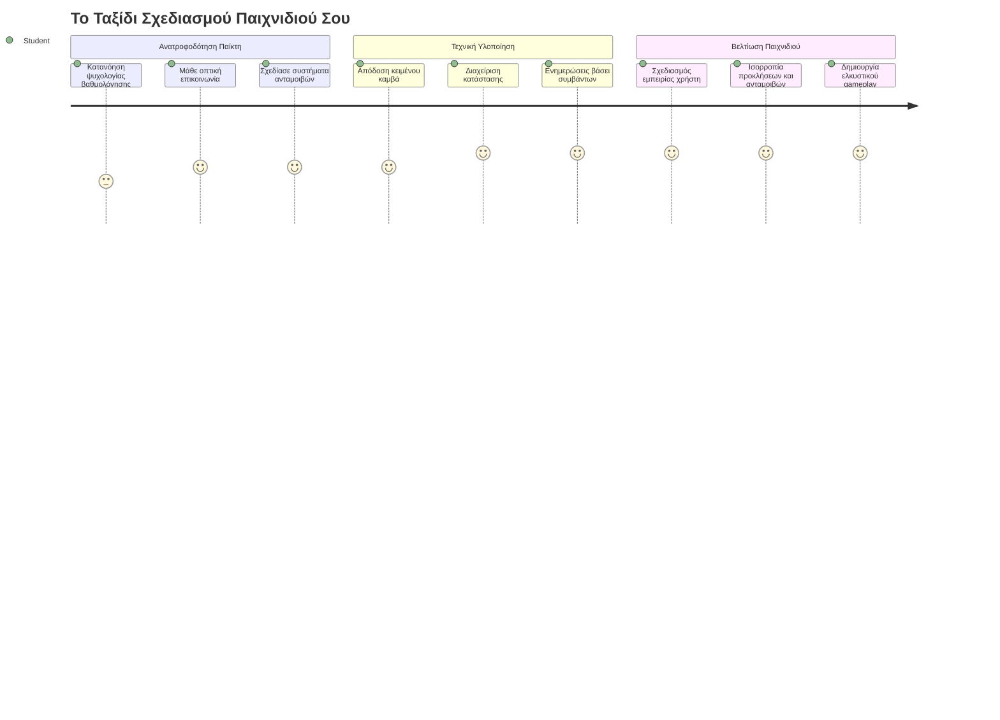
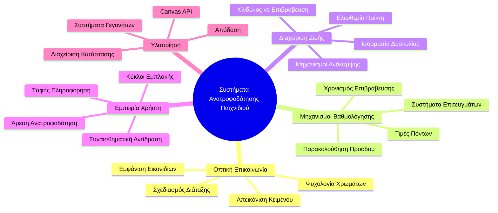
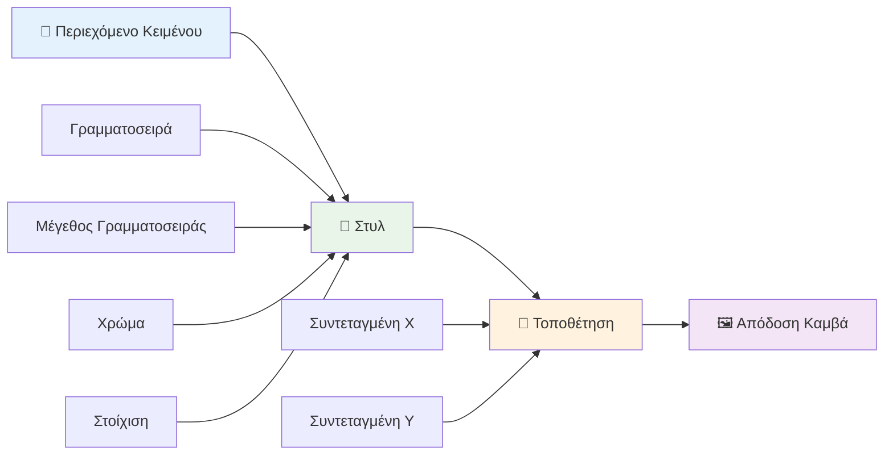
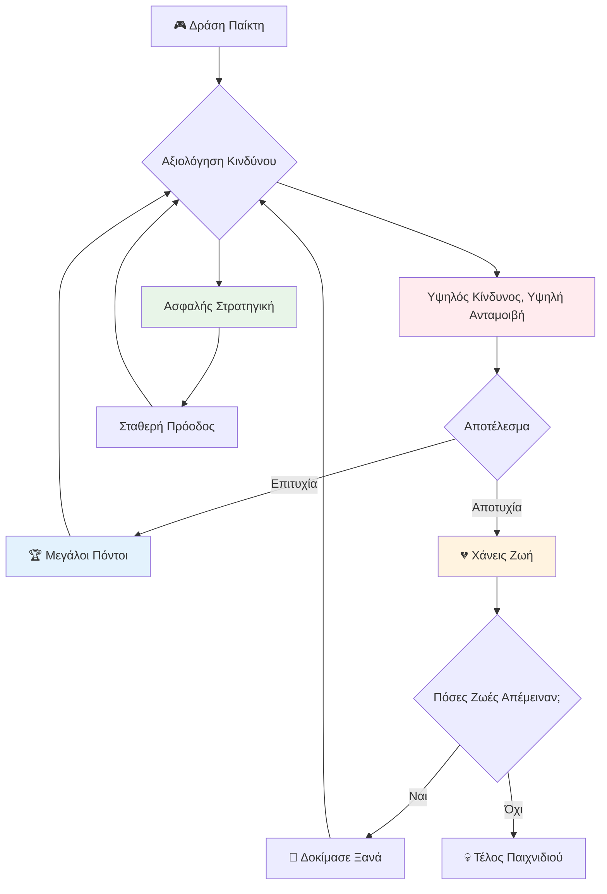
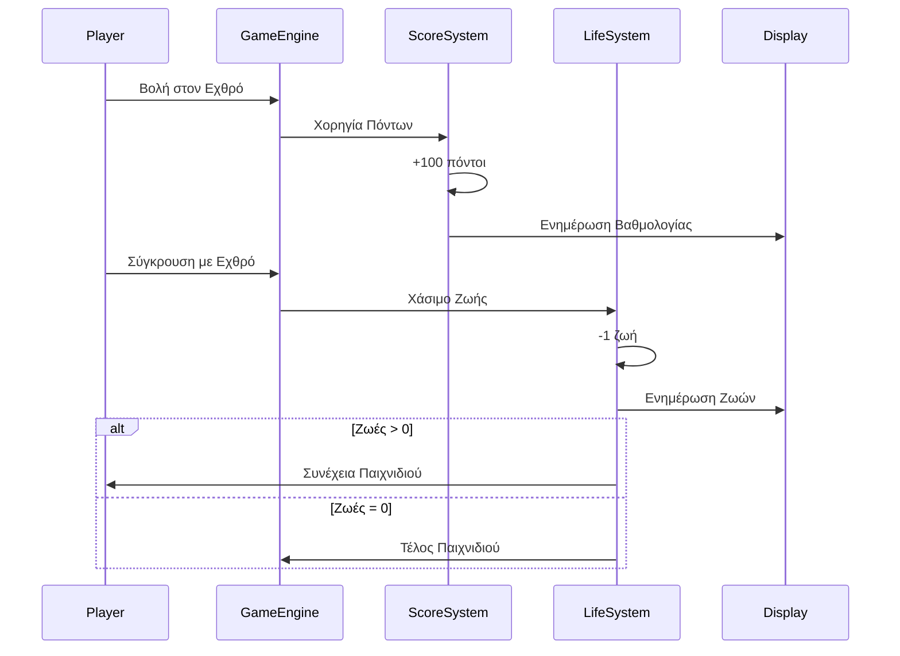
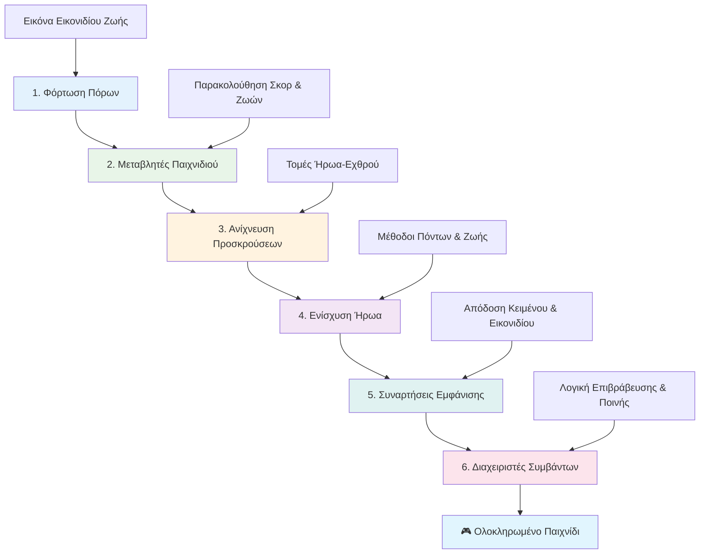
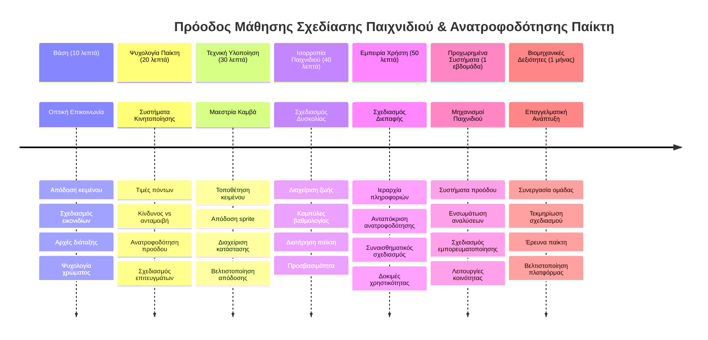

<!--
CO_OP_TRANSLATOR_METADATA:
{
  "original_hash": "2ed9145a16cf576faa2a973dff84d099",
  "translation_date": "2026-01-06T20:37:20+00:00",
  "source_file": "6-space-game/5-keeping-score/README.md",
  "language_code": "el"
}
-->
# Δημιουργία Παιχνιδιού Διαστήματος Μέρος 5: Σκοράρισμα και Ζωές


## Κουίζ Προ-Διάλεξης

[Κουίζ προ-διάλεξης](https://ff-quizzes.netlify.app/web/quiz/37)

Έτοιμος να κάνεις το παιχνίδι σου να μοιάζει με πραγματικό παιχνίδι; Ας προσθέσουμε τη βαθμολογία και τη διαχείριση των ζωών - τους βασικούς μηχανισμούς που μετέτρεψαν τα πρώιμα arcade παιχνίδια όπως το Space Invaders από απλές επιδείξεις σε εθιστική ψυχαγωγία. Εδώ το παιχνίδι σου γίνεται πραγματικά παικτό.


## Ζωγραφίζοντας Κείμενο στην Οθόνη - Η Φωνή του Παιχνιδιού σου

Για να εμφανίσουμε τη βαθμολογία σου, πρέπει να μάθουμε πώς να αποτυπώνουμε κείμενο στον καμβά. Η μέθοδος `fillText()` είναι το βασικό σου εργαλείο - είναι η ίδια τεχνική που χρησιμοποιούσαν τα κλασικά arcade παιχνίδια για να δείχνουν σκορ και πληροφορίες κατάστασης.


Έχεις πλήρη έλεγχο της εμφάνισης του κειμένου:

```javascript
ctx.font = "30px Arial";
ctx.fillStyle = "red";
ctx.textAlign = "right";
ctx.fillText("show this on the screen", 0, 0);
```

✅ Βαθύτερη εμβάθυνση στο [προσθήκη κειμένου σε καμβά](https://developer.mozilla.org/docs/Web/API/Canvas_API/Tutorial/Drawing_text) - ίσως εκπλαγείς από το πόσο δημιουργικός μπορείς να γίνεις με τις γραμματοσειρές και το στυλ!

## Ζωές - Περισσότερα από Απλές Αριθμοί

Στο σχεδιασμό παιχνιδιών, μια "ζωή" αντιπροσωπεύει το περιθώριο λάθους του παίκτη. Αυτή η ιδέα προέρχεται από τα μηχανήματα πινγκ πονγκ, όπου είχες πολλές μπάλες να παίξεις. Σε πρώιμα βιντεοπαιχνίδια όπως τα Asteroids, οι ζωές έδιναν την άδεια στους παίκτες να πάρουν ρίσκα και να μάθουν από τα λάθη.


Η οπτική αναπαράσταση έχει μεγάλη σημασία - η εμφάνιση εικονιδίων πλοίων αντί απλώς του "Ζωές: 3" δημιουργεί άμεση οπτική αναγνώριση, παρόμοια με τον τρόπο που οι πρώιμες arcade καμπίνες χρησιμοποιούσαν εικονίδια για επικοινωνία πέρα από γλωσσικά εμπόδια.

## Δημιουργώντας το Σύστημα Ανταμοιβής του Παιχνιδιού σου

Τώρα θα υλοποιήσουμε τα βασικά συστήματα ανατροφοδότησης που κρατούν τους παίκτες αφοσιωμένους:


- **Σύστημα σκοραρίσματος**: Κάθε εχθρικό πλοίο που καταστρέφεται δίνει 100 πόντους (οι στρογγυλοί αριθμοί είναι πιο εύκολοι για τον παίκτη να υπολογίζει νοητικά). Το σκορ εμφανίζεται στην κάτω αριστερή γωνία.
- **Μετρητής ζωών**: Ο ήρωάς σου ξεκινά με τρεις ζωές - ένα πρότυπο που καθιερώθηκε από τα πρώιμα arcade παιχνίδια για να ισορροπήσει την πρόκληση με το παικτικό ενδιαφέρον. Κάθε σύγκρουση με εχθρό κοστίζει μια ζωή. Οι εναπομείνασες ζωές εμφανίζονται κάτω δεξιά με εικονίδια πλοίων .

## Ας Ξεκινήσουμε!

Πρώτα, στήσε τον χώρο εργασίας σου. Πλοηγήσου στα αρχεία μέσα στον υποφάκελο `your-work`. Πρέπει να δεις αυτά τα αρχεία:

```bash
-| assets
  -| enemyShip.png
  -| player.png
  -| laserRed.png
-| index.html
-| app.js
-| package.json
```

Για να δοκιμάσεις το παιχνίδι σου, εκκίνησε τον development server από το φάκελο `your_work`:

```bash
cd your-work
npm start
```

Αυτό τρέχει έναν τοπικό διακομιστή στη διεύθυνση `http://localhost:5000`. Άνοιξε αυτή τη διεύθυνση στον browser σου για να δεις το παιχνίδι σου. Δοκίμασε τους ελέγχους με τα βελάκια και προσπάθησε να πυροβολήσεις εχθρούς για να επιβεβαιώσεις ότι όλα λειτουργούν.


### Ώρα για Κώδικα!

1. **Πάρε τα οπτικά αρχεία που θα χρειαστείς**. Αντίγραψε το αρχείο `life.png` από τον φάκελο `solution/assets/` μέσα στο φάκελό σου `your-work`. Έπειτα πρόσθεσε την lifeImg στη συνάρτηση window.onload σου:

    ```javascript
    lifeImg = await loadTexture("assets/life.png");
    ```

1. Μην ξεχάσεις να προσθέσεις την `lifeImg` στη λίστα των assets σου:

    ```javascript
    let heroImg,
    ...
    lifeImg,
    ...
    eventEmitter = new EventEmitter();
    ```
  
2. **Ορίστε τις μεταβλητές του παιχνιδιού**. Πρόσθεσε κώδικα για να παρακολουθείς το συνολικό σκορ (ξεκινώντας από 0) και τις εναπομείνασες ζωές (ξεκινώντας από 3). Θα τα εμφανίζουμε στην οθόνη ώστε οι παίκτες να γνωρίζουν πάντα πού βρίσκονται.

3. **Υλοποίησε ανίχνευση συγκρούσεων**. Επέκτεινε τη συνάρτηση `updateGameObjects()` σου ώστε να ανιχνεύει πότε οι εχθροί συγκρούονται με τον ήρωα:

    ```javascript
    enemies.forEach(enemy => {
        const heroRect = hero.rectFromGameObject();
        if (intersectRect(heroRect, enemy.rectFromGameObject())) {
          eventEmitter.emit(Messages.COLLISION_ENEMY_HERO, { enemy });
        }
      })
    ```

4. **Πρόσθεσε παρακολούθηση ζωών και πόντων στον Ήρωα σου**.  
   1. **Αρχικοποίησε τους μετρητές**. Κάτω από `this.cooldown = 0` στην κλάση `Hero`, όρισε ζωές και πόντους:

        ```javascript
        this.life = 3;
        this.points = 0;
        ```

   1. **Εμφάνισε αυτές τις τιμές στον παίκτη**. Δημιούργησε συναρτήσεις για να σχεδιάσεις αυτές τις τιμές στην οθόνη:

        ```javascript
        function drawLife() {
          // ΠΡΕΠΕΙ ΝΑ ΓΙΝΕΙ, 35, 27
          const START_POS = canvas.width - 180;
          for(let i=0; i < hero.life; i++ ) {
            ctx.drawImage(
              lifeImg, 
              START_POS + (45 * (i+1) ), 
              canvas.height - 37);
          }
        }
        
        function drawPoints() {
          ctx.font = "30px Arial";
          ctx.fillStyle = "red";
          ctx.textAlign = "left";
          drawText("Points: " + hero.points, 10, canvas.height-20);
        }
        
        function drawText(message, x, y) {
          ctx.fillText(message, x, y);
        }

        ```

   1. **Σύνδεσε τα όλα στον βρόχο του παιχνιδιού**. Πρόσθεσε αυτές τις συναρτήσεις στη window.onload αμέσως μετά το `updateGameObjects()`:

        ```javascript
        drawPoints();
        drawLife();
        ```

### 🔄 **Παιδαγωγικός Έλεγχος**
**Κατανόηση Σχεδιασμού Παιχνιδιών**: Πριν υλοποιήσεις συνέπειες, βεβαιώσου ότι κατανοείς:
- ✅ Πώς η οπτική ανατροφοδότηση μεταφέρει την κατάσταση παιχνιδιού στους παίκτες
- ✅ Γιατί η συνεπής τοποθέτηση των στοιχείων UI βελτιώνει τη χρηστικότητα
- ✅ Την ψυχολογία πίσω από τις τιμές των πόντων και τη διαχείριση ζωών
- ✅ Πώς η απόδοση κειμένου στον καμβά διαφέρει από το HTML κείμενο

**Γρήγορο Αυτοτεστ**: Γιατί τα arcade παιχνίδια συνήθως χρησιμοποιούν στρογγυλούς αριθμούς για τις τιμές πόντων;  
*Απάντηση: Οι στρογγυλοί αριθμοί είναι πιο εύκολοι για τον παίκτη να υπολογίζει νοητικά και δημιουργούν ικανοποιητική ψυχολογική ανταμοιβή*

**Αρχές Εμπειρίας Χρήστη**: Τώρα εφαρμόζεις:  
- **Οπτική Ιεραρχία**: Σημαντικές πληροφορίες τοποθετημένες με έμφαση  
- **Άμεση Ανατροφοδότηση**: Ενημερώσεις σε πραγματικό χρόνο στις ενέργειες του παίκτη  
- **Γνωστικό Φορτίο**: Απλή, καθαρή παρουσίαση πληροφορίας  
- **Σχεδιασμός Συναισθήματος**: Εικονίδια και χρώματα που δημιουργούν σύνδεση με τον παίκτη

1. **Υλοποίησε συνέπειες και ανταμοιβές στο παιχνίδι**. Τώρα θα προσθέσουμε τα συστήματα ανατροφοδότησης που κάνουν τις ενέργειες του παίκτη ουσιαστικές:

   1. **Οι συγκρούσεις κοστίζουν ζωές**. Κάθε φορά που ο ήρωας σου συγκρούεται με έναν εχθρό, χάνεις μια ζωή.
   
      Πρόσθεσε αυτή τη μέθοδο στην κλάση `Hero` σου:

        ```javascript
        decrementLife() {
          this.life--;
          if (this.life === 0) {
            this.dead = true;
          }
        }
        ```

   2. **Το να πυροβολάς εχθρούς σου δίνει πόντους**. Κάθε επιτυχημένο χτύπημα δίνει 100 πόντους, παρέχοντας άμεση θετική ανατροφοδότηση για την ακρίβεια.

      Επέκτεινε την κλάση Hero με αυτή τη μέθοδο αύξησης πόντων:
    
        ```javascript
          incrementPoints() {
            this.points += 100;
          }
        ```

        Τώρα σύνδεσε αυτές τις συναρτήσεις με τα γεγονότα σύγκρουσης:

        ```javascript
        eventEmitter.on(Messages.COLLISION_ENEMY_LASER, (_, { first, second }) => {
           first.dead = true;
           second.dead = true;
           hero.incrementPoints();
        })

        eventEmitter.on(Messages.COLLISION_ENEMY_HERO, (_, { enemy }) => {
           enemy.dead = true;
           hero.decrementLife();
        });
        ```

✅ Περίεργος για άλλα παιχνίδια που έχουν φτιαχτεί με JavaScript και Canvas; Εξερεύνησε λίγο - ίσως εκπλαγείς με όσα είναι δυνατά!

Αφού υλοποιήσεις αυτές τις λειτουργίες, δοκίμασε το παιχνίδι σου για να δεις ολόκληρο το σύστημα ανατροφοδότησης σε δράση. Πρέπει να βλέπεις τα εικονίδια ζωών κάτω δεξιά, το σκορ σου κάτω αριστερά, και να παρακολουθείς πώς οι συγκρούσεις μειώνουν τις ζωές ενώ τα επιτυχημένα χτυπήματα αυξάνουν το σκορ.

Το παιχνίδι σου τώρα έχει τους βασικούς μηχανισμούς που έκαναν τα πρώιμα arcade παιχνίδια τόσο εθιστικά - καθαρούς στόχους, άμεση ανατροφοδότηση και ουσιαστικές συνέπειες για τις ενέργειες του παίκτη.

### 🔄 **Παιδαγωγικός Έλεγχος**
**Ολοκληρωμένο Σύστημα Σχεδιασμού Παιχνιδιού**: Επαλήθευσε την κατανόησή σου για τα συστήματα ανατροφοδότησης:
- ✅ Πώς οι μηχανισμοί σκοραρίσματος δημιουργούν κίνητρο και αφοσίωση
- ✅ Γιατί η οπτική συνέπεια είναι σημαντική στον σχεδιασμό UI
- ✅ Πώς το σύστημα ζωών ισορροπεί πρόκληση και διατήρηση παικτών
- ✅ Ποιο ρόλο παίζει η άμεση ανατροφοδότηση στη δημιουργία ικανοποιητικού gameplay

**Ενσωμάτωση Συστήματος**: Το σύστημά σου ανατροφοδότησης δείχνει:
- **Σχεδιασμό Εμπειρίας Χρήστη**: Καθαρή οπτική επικοινωνία και ιεραρχία πληροφορίας  
- **Αρχιτεκτονική Βασισμένη σε Γεγονότα**: Ανταποκρινόμενες ενημερώσεις στις ενέργειες των παικτών  
- **Διαχείριση Κατάστασης**: Παρακολούθηση και εμφάνιση δυναμικών δεδομένων παιχνιδιού  
- **Κυριαρχία στον Καμβά**: Απόδοση κειμένου και τοποθέτηση sprites  
- **Ψυχολογία Παιχνιδιού**: Κατανόηση κινήτρων και εμπλοκής παικτών

**Επαγγελματικά Πρότυπα**: Έχεις υλοποιήσει:
- **Αρχιτεκτονική MVC**: Διαχωρισμό λογικής παιχνιδιού, δεδομένων και παρουσίασης  
- **Πρότυπο Παρατηρητή**: Ενημερώσεις βάσει γεγονότων για αλλαγές κατάστασης παιχνιδιού  
- **Σχεδιασμό Συστατικών**: Επαναχρησιμοποιήσιμες συναρτήσεις για απόδοση και λογική  
- **Βελτιστοποίηση Απόδοσης**: Αποδοτική απόδοση σε βρόχους παιχνιδιού

### ⚡ **Τι Μπορείς να Κάνεις στα Επόμενα 5 Λεπτά**
- [ ] Πειραματίσου με διαφορετικά μεγέθη και χρώματα γραμματοσειρών για την εμφάνιση σκορ  
- [ ] Δοκίμασε να αλλάξεις τις τιμές των πόντων και δες πώς επηρεάζεται το αίσθημα του παιχνιδιού  
- [ ] Πρόσθεσε δηλώσεις console.log για να παρακολουθείς πότε αλλάζουν πόντοι και ζωές  
- [ ] Δοκίμασε ακραίες καταστάσεις όπως να τελειώσουν οι ζωές ή να πετύχεις υψηλά σκορ

### 🎯 **Τι Μπορείς να Κατακτήσεις Αυτή την Ώρα**
- [ ] Ολοκλήρωσε το κουίζ μετά το μάθημα και κατανοήσε την ψυχολογία σχεδιασμού παιχνιδιού  
- [ ] Πρόσθεσε ηχητικά εφέ για σκοράρισμα και απώλεια ζωών  
- [ ] Υλοποίησε σύστημα υψηλού σκορ με χρήση localStorage  
- [ ] Δημιούργησε διαφορετικές τιμές πόντων για διαφορετικούς τύπους εχθρών  
- [ ] Πρόσθεσε οπτικά εφέ όπως δόνηση οθόνης όταν χάνεις ζωή

### 📅 **Το Ταξίδι σου στον Σχεδιασμό Παιχνιδιών Διαρκείας Μιάς Εβδομάδας**
- [ ] Ολοκλήρωσε πλήρες παιχνίδι διαστήματος με στιβαρά συστήματα ανατροφοδότησης  
- [ ] Υλοποίησε προχωρημένους μηχανισμούς σκοραρίσματος όπως πολλαπλασιαστές combo  
- [ ] Πρόσθεσε επιτεύγματα και ξεκλειδώματα περιεχομένου  
- [ ] Δημιούργησε προοδευτικές δυσκολίες και συστήματα ισορροπίας  
- [ ] Σχεδίασε διεπαφές χρήστη για μενού και οθόνες τέλους παιχνιδιού  
- [ ] Μελέτησε άλλα παιχνίδια για να κατανοήσεις μηχανισμούς εμπλοκής

### 🌟 **Η Εξειδίκευση σου στον Ανάπτυξη Παιχνιδιών Μήνα Μακρά**
- [ ] Δημιούργησε πλήρη παιχνίδια με εξελιγμένα συστήματα προόδου  
- [ ] Μάθε ανάλυση παιχνιδιών και μέτρηση συμπεριφοράς παικτών  
- [ ] Συνεισέφερε σε ανοιχτά έργα ανάπτυξης παιχνιδιών  
- [ ] Κυρίαρχησε σε προχωρημένα μοτίβα σχεδιασμού και εμπορευματοποίησης  
- [ ] Δημιούργησε εκπαιδευτικό περιεχόμενο για σχεδιασμό παιχνιδιών και εμπειρία χρήστη  
- [ ] Δημιούργησε ένα portfolio που να προβάλλει δεξιότητες σχεδιασμού και ανάπτυξης παιχνιδιών

## 🎯 Χρονοδιάγραμμα Εξειδίκευσης στο Σχεδιασμό Παιχνιδιών


### 🛠️ Συνοπτικό Εργαλειοθήκη Σχεδιασμού Παιχνιδιών

Μετά την ολοκλήρωση αυτής της ενότητας, έχεις κυριαρχήσει στα εξής:  
- **Ψυχολογία Παίκτη**: Κατανόηση κινήτρων, ρίσκου/ανταμοιβής και βρόχων εμπλοκής  
- **Οπτική Επικοινωνία**: Αποτελεσματικός σχεδιασμός UI με κείμενο, εικονίδια και διάταξη  
- **Συστήματα Ανατροφοδότησης**: Απόκριση σε πραγματικό χρόνο σε ενέργειες και γεγονότα  
- **Διαχείριση Κατάστασης**: Αποτελεσματική παρακολούθηση και απεικόνιση δεδομένων  
- **Απόδοση Κειμένου στον Καμβά**: Επαγγελματική προβολή κειμένου με στυλ και τοποθέτηση  
- **Ενσωμάτωση Γεγονότων**: Σύνδεση ενεργειών χρήστη με ουσιαστικές συνέπειες  
- **Ισορροπία Παιχνιδιού**: Σχεδιασμός καμπυλών δυσκολίας και συστημάτων προόδου

**Πρακτικές Εφαρμογές**: Οι δεξιότητές σου στον σχεδιασμό εφαρμόζονται άμεσα σε:  
- **Σχεδιασμό Διεπαφής Χρήστη**: Δημιουργία ελκυστικών και διαισθητικών διεπαφών  
- **Ανάπτυξη Προϊόντων**: Κατανόηση κινήτρων χρηστών και βρόχων ανατροφοδότησης  
- **Εκπαιδευτική Τεχνολογία**: Παιχνιδοποίηση και συστήματα εμπλοκής μάθησης  
- **Οπτικοποίηση Δεδομένων**: Μετατροπή πολύπλοκων πληροφοριών σε προσβάσιμες και ελκυστικές  
- **Ανάπτυξη Εφαρμογών για Κινητά**: Μηχανισμοί διατήρησης και σχεδιασμός εμπειρίας χρήστη  
- **Μάρκετινγκ Τεχνολογία**: Κατανόηση συμπεριφοράς χρηστών και βελτιστοποίηση μετατροπών

**Επαγγελματικές Δεξιότητες**: Τώρα μπορείς να:  
- **Σχεδιάζεις** εμπειρίες που κινητοποιούν και δεσμεύουν χρήστες  
- **Υλοποιείς** συστήματα ανατροφοδότησης που καθοδηγούν αποτελεσματικά τη συμπεριφορά  
- **Ισορροπείς** την πρόκληση με την ευκολία για διαδραστικά συστήματα  
- **Δημιουργείς** οπτική επικοινωνία που λειτουργεί σε διαφορετικές ομάδες χρηστών  
- **Αναλύεις** τη συμπεριφορά χρηστών και βελτιώνεις το σχεδιασμό

**Κατανοημένες Έννοιες Ανάπτυξης Παιχνιδιών**:  
- **Κίνητρα Παίκτη**: Κατανόηση των αιτιών αφοσίωσης και διατήρησης  
- **Οπτικός Σχεδιασμός**: Δημιουργία καθαρών, ελκυστικών και λειτουργικών διεπαφών  
- **Ενσωμάτωση Συστήματος**: Σύνδεση πολλών συστημάτων παιχνιδιού για συνεκτική εμπειρία  
- **Βελτιστοποίηση Απόδοσης**: Αποδοτική απόδοση και διαχείριση κατάστασης  
- **Προσβασιμότητα**: Σχεδιασμός για διαφορετικά επίπεδα δεξιοτήτων και ανάγκες παικτών

**Επόμενο Επίπεδο**: Είσαι έτοιμος να εξερευνήσεις προχωρημένα μοτίβα σχεδιασμού παιχνιδιών, να υλοποιήσεις αναλυτικά συστήματα ή να μελετήσεις εμπορευματοποίηση και στρατηγικές διατήρησης!

🌟 **Επίτευγμα Ξεκλειδώθηκε**: Έχεις δημιουργήσει πλήρες σύστημα ανατροφοδότησης παικτών με επαγγελματικές αρχές σχεδιασμού!

---

## Πρόκληση GitHub Copilot Agent 🚀

Χρησιμοποίησε τη λειτουργία Agent για να ολοκληρώσεις την ακόλουθη πρόκληση:

**Περιγραφή:** Ενίσχυσε το σύστημα σκοραρίσματος του παιχνιδιού διαστήματος υλοποιώντας λειτουργία για υψηλό σκορ με μόνιμη αποθήκευση και μηχανισμούς μπόνους σκορ.

**Ερώτημα:** Δημιούργησε σύστημα υψηλού σκορ που αποθηκεύει το καλύτερο σκορ του παίκτη στο localStorage. Πρόσθεσε μπόνους πόντους για συνεχόμενες δολοφονίες εχθρών (σύστημα combo) και εφάρμοσε διαφορετικές τιμές πόντων ανά τύπο εχθρού. Συμπεριέλαβε οπτικό δείκτη όταν ο παίκτης πετυχαίνει νέο υψηλό σκορ και εμφάνισε το τρέχον υψηλό σκορ στην οθόνη του παιχνιδιού.

## 🚀 Πρόκληση

Έχεις πλέον ένα λειτουργικό παιχνίδι με σκορ και ζωές. Σκέψου ποιες πρόσθετες λειτουργίες θα μπορούσαν να βελτιώσουν την εμπειρία του παίκτη.

## Κουίζ Μετά τη Διάλεξη

[Κουίζ μετά τη διάλεξη](https://ff-quizzes.netlify.app/web/quiz/38)

## Επισκόπηση & Αυτομελέτη

Θέλεις να εξερευνήσεις περισσότερα; Έρευνα διαφορετικές προσεγγίσεις στο σκοράρισμα και τα συστήματα ζωής στα παιχνίδια. Υπάρχουν εντυπωσιακές μηχανές παιχνιδιών όπως το [PlayFab](https://playfab.com) που διαχειρίζονται σκορ, πίνακες κατάταξης και πρόοδο παικτών. Πώς θα μπορούσε η ενσωμάτωση κάτι τέτοιου να ανεβάσει το παιχνίδι σου σε άλλο επίπεδο;

## Εργασία

[Δημιουργία Παιχνιδιού με Σκοράρισμα](assignment.md)

---

<!-- CO-OP TRANSLATOR DISCLAIMER START -->
**Αποποίηση Ευθύνης**:  
Αυτό το έγγραφο έχει μεταφραστεί χρησιμοποιώντας την υπηρεσία αυτόματης μετάφρασης AI [Co-op Translator](https://github.com/Azure/co-op-translator). Παρόλο που προσπαθούμε για ακρίβεια, παρακαλούμε να γνωρίζετε ότι οι αυτοματοποιημένες μεταφράσεις ενδέχεται να περιέχουν λάθη ή ανακρίβειες. Το πρωτότυπο έγγραφο στην αρχική του γλώσσα θα πρέπει να θεωρείται η επίσημη πηγή. Για κρίσιμες πληροφορίες, συνιστάται επαγγελματική μετάφραση από ανθρώπους. Δεν φέρουμε ευθύνη για τυχόν παρανοήσεις ή λανθασμένες ερμηνείες που προκύπτουν από τη χρήση αυτής της μετάφρασης.
<!-- CO-OP TRANSLATOR DISCLAIMER END -->