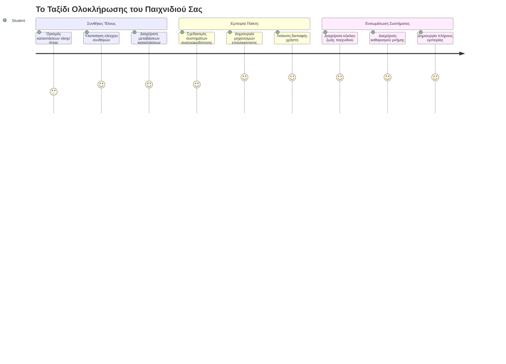
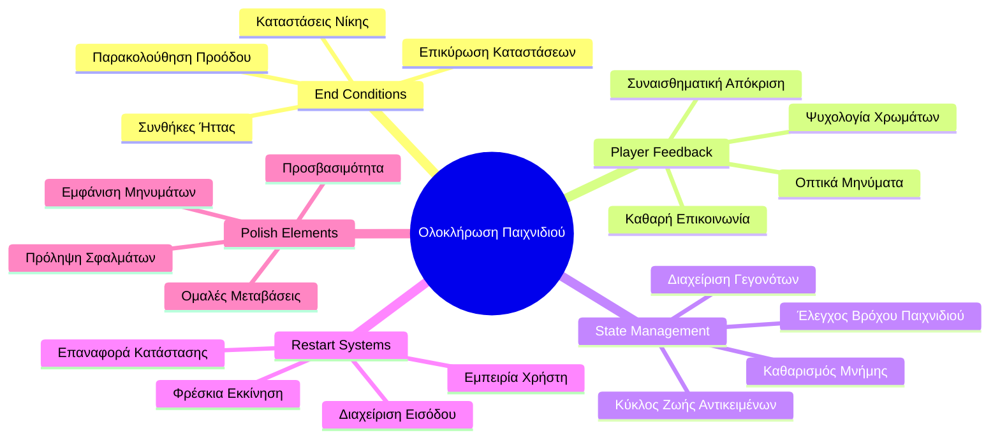
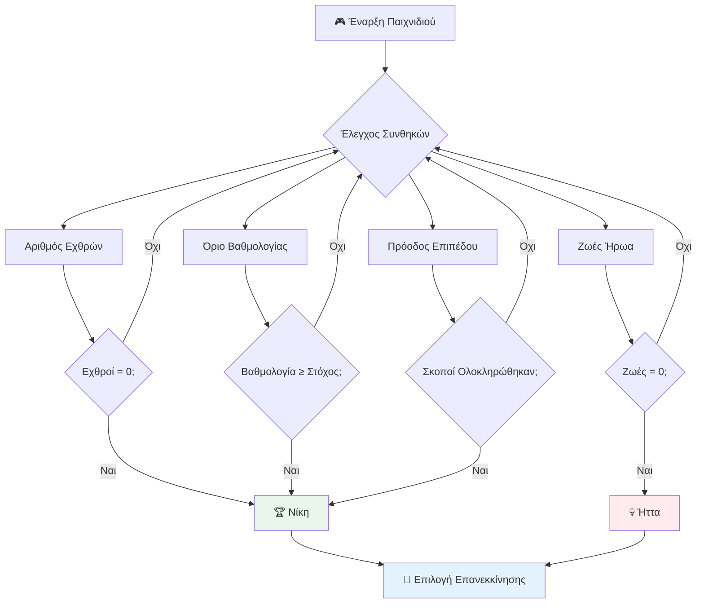
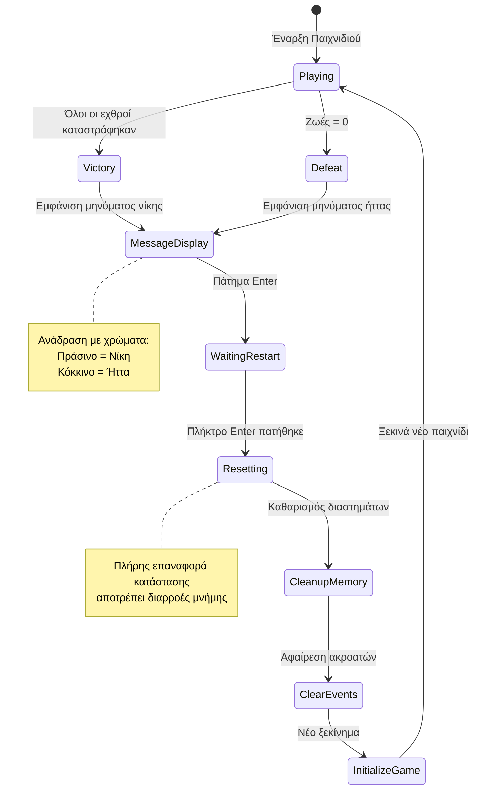
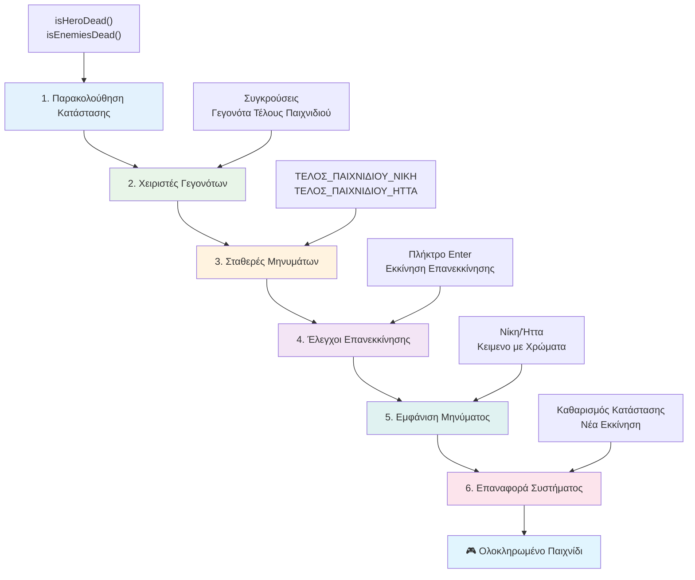
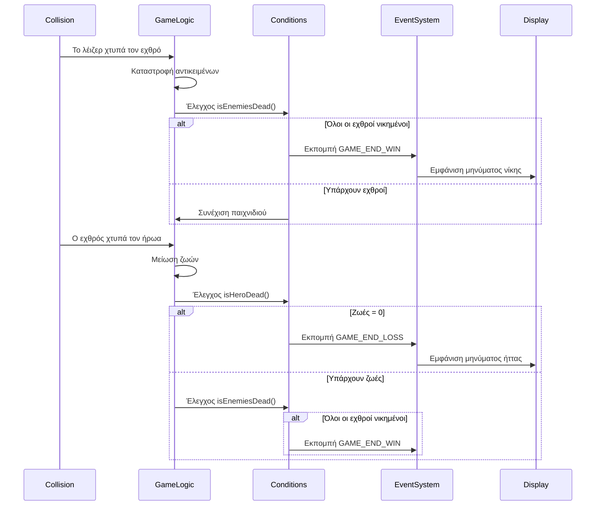
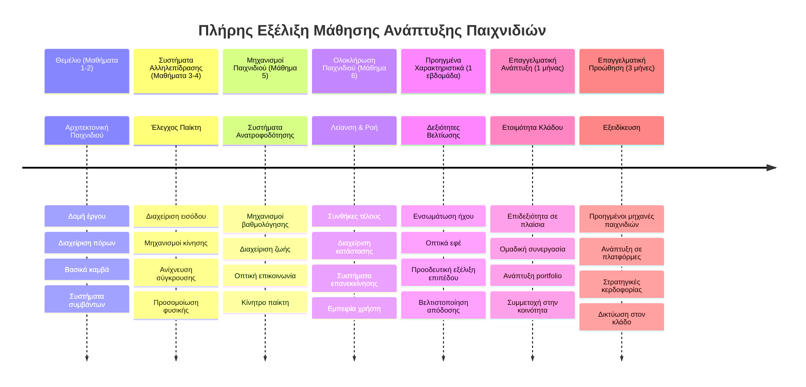

<!--
CO_OP_TRANSLATOR_METADATA:
{
  "original_hash": "a4b78043f4d64bf3ee24e0689b8b391d",
  "translation_date": "2026-01-06T20:35:08+00:00",
  "source_file": "6-space-game/6-end-condition/README.md",
  "language_code": "el"
}
-->
# Δημιουργία Παιχνιδιού Διαστήματος Μέρος 6: Τέλος και Επανεκκίνηση


Κάθε σπουδαίο παιχνίδι χρειάζεται σαφείς συνθήκες τέλους και έναν ομαλό μηχανισμό επανεκκίνησης. Έχετε δημιουργήσει ένα εντυπωσιακό παιχνίδι διαστήματος με κίνηση, μάχη και σκοράρισμα - τώρα είναι η ώρα να προσθέσετε τα τελευταία κομμάτια που το κάνουν να νιώθει ολοκληρωμένο.

Το παιχνίδι σας τρέχει απεριόριστα, σαν τους ανιχνευτές Voyager που εκτόξευσε η NASA το 1977 - εξακολουθούν να ταξιδεύουν στο διάστημα δεκαετίες αργότερα. Ενώ αυτό είναι καλό για την εξερεύνηση του διαστήματος, τα παιχνίδια χρειάζονται ορισμένα σημεία τέλους για να δημιουργήσουν ικανοποιητικές εμπειρίες.

Σήμερα, θα υλοποιήσουμε σωστούς όρους νίκης/ήττας και ένα σύστημα επανεκκίνησης. Μέχρι το τέλος αυτού του μαθήματος, θα έχετε ένα καλοδουλεμένο παιχνίδι που οι παίκτες μπορούν να ολοκληρώσουν και να ξαναπαίξουν, όπως τα κλασικά arcade παιχνίδια που καθόρισαν το μέσο.


## Quiz Προ του Μαθήματος

[Quiz προ του μαθήματος](https://ff-quizzes.netlify.app/web/quiz/39)

## Κατανόηση των Συνθηκών Τέλους Παιχνιδιού

Πότε πρέπει να τελειώσει το παιχνίδι σας; Αυτή η βασική ερώτηση διαμορφώνει τον σχεδιασμό παιχνιδιών από την εποχή των πρώτων arcade. Το Pac-Man τελειώνει όταν σε πιάσουν τα φαντάσματα ή καθαρίσεις όλα τα τελείες, ενώ το Space Invaders τελειώνει όταν οι εξωγήινοι φτάσουν στο κάτω μέρος ή τους καταστρέψεις όλους.

Ως δημιουργός του παιχνιδιού, ορίζετε τις συνθήκες νίκης και ήττας. Για το παιχνίδι διαστήματος, ακολουθούν δοκιμασμένες προσεγγίσεις που δημιουργούν ενδιαφέρουσα εμπειρία gameplay:


- **Έχουν καταστραφεί `N` εχθρικά πλοία**: Είναι αρκετά κοινό, αν χωρίσετε το παιχνίδι σε επίπεδα, να πρέπει να καταστρέψετε `N` πλοία για να περάσετε το επίπεδο  
- **Το πλοίο σας έχει καταστραφεί**: Υπάρχουν παιχνίδια όπου χάνετε αν το πλοίο σας καταστραφεί. Μια άλλη συνηθισμένη προσέγγιση είναι η ύπαρξη ζωών. Κάθε φορά που το πλοίο καταστρέφεται, χάνετε μια ζωή. Όταν χάσετε όλες τις ζωές, χάνετε το παιχνίδι.  
- **Έχετε συλλέξει `N` πόντους**: Μια άλλη κοινή συνθήκη τέλους είναι η συλλογή πόντων. Πώς αποκτάτε πόντους είναι δικό σας θέμα, αλλά είναι συνηθισμένο να αποδίδονται πόντοι σε διάφορες δραστηριότητες όπως η καταστροφή εχθρικού πλοίου ή η συλλογή αντικειμένων που *πέφτουν* όταν καταστρέφονται.  
- **Ολοκλήρωση ενός επιπέδου**: Αυτό μπορεί να περιλαμβάνει πολλές προϋποθέσεις, όπως καταστροφή `X` εχθρικών πλοίων, συλλογή `Y` πόντων ή τη συλλογή συγκεκριμένου αντικειμένου.

## Υλοποίηση Λειτουργίας Επανεκκίνησης Παιχνιδιού

Τα καλά παιχνίδια ενθαρρύνουν την επαναληψιμότητα μέσω ομαλών μηχανισμών επανεκκίνησης. Όταν οι παίκτες ολοκληρώνουν ένα παιχνίδι (ή χάνουν), συχνά θέλουν να προσπαθήσουν ξανά αμέσως - είτε για να ξεπεράσουν το σκορ τους είτε για να βελτιώσουν την απόδοσή τους.


Το Tetris το δείχνει τέλεια: όταν τα κομμάτια σου φτάσουν στην κορυφή, μπορείς αμέσως να ξεκινήσεις νέο παιχνίδι χωρίς να πλοηγείσαι σε περίπλοκα μενού. Θα χτίσουμε ένα παρόμοιο σύστημα επανεκκίνησης που επαναφέρει καθαρά την κατάσταση του παιχνιδιού και φέρνει τους παίκτες γρήγορα ξανά στη δράση.

✅ **Προβληματισμός**: Σκεφτείτε τα παιχνίδια που έχετε παίξει. Υπό ποιες συνθήκες τελειώνουν και πώς σας ζητείται να κάνετε επανεκκίνηση; Τι κάνει μια εμπειρία επανεκκίνησης ομαλή ή απογοητευτική;

## Τι Θα Δημιουργήσετε

Θα υλοποιήσετε τα τελευταία χαρακτηριστικά που μετατρέπουν το πρότζεκτ σας σε μια ολοκληρωμένη εμπειρία παιχνιδιού. Αυτά τα στοιχεία ξεχωρίζουν τα καλοδουλεμένα παιχνίδια από τα βασικά πρωτότυπα.

**Αυτά προσθέτουμε σήμερα:**

1. **Συνθήκη νίκης:** Καταστρέψτε όλους τους εχθρούς και γιορτάστε δεόντως (το αξίζετε!)  
2. **Συνθήκη ήττας:** Χάστε τις ζωές και δείτε την οθόνη ήττας  
3. **Μηχανισμός επανεκκίνησης:** Πατήστε Enter για να ξεκινήσετε ξανά - γιατί ένα παιχνίδι δεν φτάνει ποτέ  
4. **Διαχείριση κατάστασης:** Καθαρή εκκίνηση κάθε φορά - χωρίς υπολείμματα εχθρών ή περίεργα σφάλματα από το προηγούμενο παιχνίδι

## Ξεκινώντας

Ας ετοιμάσουμε το περιβάλλον ανάπτυξης. Θα πρέπει να έχετε όλα τα αρχεία του παιχνιδιού διαστήματος από τα προηγούμενα μαθήματα.

**Το πρότζεκτ σας πρέπει να μοιάζει κάπως έτσι:**

```bash
-| assets
  -| enemyShip.png
  -| player.png
  -| laserRed.png
  -| life.png
-| index.html
-| app.js
-| package.json
```

**Ξεκινήστε τον διακομιστή ανάπτυξης σας:**

```bash
cd your-work
npm start
```

**Αυτή η εντολή:**
- Τρέχει έναν τοπικό διακομιστή στο `http://localhost:5000`
- Σερβίρει σωστά τα αρχεία σας
- Ανανεώνεται αυτόματα όταν κάνετε αλλαγές

Ανοίξτε το `http://localhost:5000` στον browser σας και βεβαιωθείτε ότι το παιχνίδι τρέχει. Πρέπει να μπορείτε να κινείστε, να πυροβολείτε και να αλληλεπιδράτε με τους εχθρούς. Μόλις το επιβεβαιώσετε, προχωράμε στην υλοποίηση.

> 💡 **Επαγγελματική Συμβουλή**: Για να αποφύγετε προειδοποιήσεις στο Visual Studio Code, δηλώστε το `gameLoopId` στην κορυφή του αρχείου σας ως `let gameLoopId;` αντί να το δηλώνετε μέσα στη συνάρτηση `window.onload`. Αυτό ακολουθεί τις σύγχρονες βέλτιστες πρακτικές δήλωσης μεταβλητών JavaScript.


## Βήματα Υλοποίησης

### Βήμα 1: Δημιουργία Συναρτήσεων Ελέγχου Συνθηκών Τέλους

Χρειαζόμαστε συναρτήσεις που παρακολουθούν πότε πρέπει να τελειώσει το παιχνίδι. Όπως οι αισθητήρες στον Διεθνή Διαστημικό Σταθμό που επιτηρούν κρίσιμα συστήματα, έτσι αυτές οι συναρτήσεις θα ελέγχουν διαρκώς την κατάσταση του παιχνιδιού.

```javascript
function isHeroDead() {
  return hero.life <= 0;
}

function isEnemiesDead() {
  const enemies = gameObjects.filter((go) => go.type === "Enemy" && !go.dead);
  return enemies.length === 0;
}
```

**Αυτό που συμβαίνει κάτω από την επιφάνεια:**
- **Ελέγχει** αν ο ήρωας μας έμεινε από ζωές (αλίμονο!)  
- **Μετρά** πόσοι εχθροί είναι ακόμα ζωντανοί και σε δράση  
- **Επιστρέφει** `true` όταν το πεδίο μάχης είναι καθαρό από εχθρούς  
- **Χρησιμοποιεί** απλή λογική true/false για να κρατήσει τα πράγματα απλά  
- **Φιλτράρει** όλα τα αντικείμενα του παιχνιδιού για να βρει τους επιζώντες

### Βήμα 2: Ενημέρωση Διαχειριστών Συμβάντων για τις Συνθήκες Τέλους

Τώρα θα συνδέσουμε αυτούς τους ελέγχους με το σύστημα συμβάντων του παιχνιδιού. Κάθε φορά που συμβαίνει μία σύγκρουση, το παιχνίδι θα αξιολογεί αν ενεργοποιείται κάποια συνθήκη τέλους. Αυτό προσφέρει άμεση ανατροφοδότηση για κρίσιμα γεγονότα.


```javascript
eventEmitter.on(Messages.COLLISION_ENEMY_LASER, (_, { first, second }) => {
    first.dead = true;
    second.dead = true;
    hero.incrementPoints();

    if (isEnemiesDead()) {
      eventEmitter.emit(Messages.GAME_END_WIN);
    }
});

eventEmitter.on(Messages.COLLISION_ENEMY_HERO, (_, { enemy }) => {
    enemy.dead = true;
    hero.decrementLife();
    if (isHeroDead())  {
      eventEmitter.emit(Messages.GAME_END_LOSS);
      return; // απώλεια πριν τη νίκη
    }
    if (isEnemiesDead()) {
      eventEmitter.emit(Messages.GAME_END_WIN);
    }
});

eventEmitter.on(Messages.GAME_END_WIN, () => {
    endGame(true);
});
  
eventEmitter.on(Messages.GAME_END_LOSS, () => {
  endGame(false);
});
```

**Τι συμβαίνει εδώ:**
- **Η δέσμη laser χτυπά εχθρό**: Και οι δύο εξαφανίζονται, παίρνετε πόντους, και ελέγχουμε αν έχετε κερδίσει  
- **Ο εχθρός χτυπά εσάς**: Χάνετε μία ζωή, και ελέγχουμε αν αναπνέετε ακόμα  
- **Έξυπνη σειρά ελέγχων**: Ελέγχουμε πρώτα για ήττα (κανείς δεν θέλει να κερδίσει και να χάσει ταυτόχρονα!)  
- **Άμεσες αντιδράσεις**: Μόλις συμβεί κάτι σημαντικό, το παιχνίδι το γνωρίζει αμέσως

### Βήμα 3: Προσθήκη Νέων Σταθερών Μηνυμάτων

Θα χρειαστεί να προσθέσετε νέους τύπους μηνυμάτων στο σταθερό αντικείμενο `Messages`. Αυτές οι σταθερές βοηθούν στη διατήρηση της συνέπειας και αποτρέπουν τυπογραφικά λάθη στο σύστημα συμβάντων.

```javascript
GAME_END_LOSS: "GAME_END_LOSS",
GAME_END_WIN: "GAME_END_WIN",
```

**Σε αυτό το σημείο έχουμε:**
- **Προσθέσει** σταθερές για γεγονότα τέλους παιχνιδιού ώστε να κρατάμε συνέπεια  
- **Χρησιμοποιήσει** περιγραφικά ονόματα που δείχνουν καθαρά τον σκοπό του γεγονότος  
- **Ακολουθήσει** την υπάρχουσα ονοματολογία για τους τύπους μηνυμάτων

### Βήμα 4: Υλοποίηση Ελέγχων Επανεκκίνησης

Τώρα θα προσθέσετε χειρισμούς πληκτρολογίου που επιτρέπουν στους παίκτες να επανεκκινήσουν το παιχνίδι. Το πλήκτρο Enter είναι φυσική επιλογή αφού συνήθως συσχετίζεται με επιβεβαίωση ενεργειών και ξεκίνημα νέων παιχνιδιών.

**Προσθέστε ανίχνευση πλήκτρου Enter στο υπάρχον ακροατή συμβάντων keydown:**

```javascript
else if(evt.key === "Enter") {
   eventEmitter.emit(Messages.KEY_EVENT_ENTER);
}
```

**Προσθέστε τη νέα σταθερά μηνύματος:**

```javascript
KEY_EVENT_ENTER: "KEY_EVENT_ENTER",
```

**Τι πρέπει να ξέρετε:**
- **Επεκτείνει** το υπάρχον σύστημα χειρισμού πληκτρολογίου  
- **Χρησιμοποιεί** το πλήκτρο Enter ως ενεργοποιητή επανεκκίνησης για φιλική εμπειρία χρήστη  
- **Εκπέμπει** ένα προσαρμοσμένο συμβάν που άλλα μέρη του παιχνιδιού μπορούν να ακούσουν  
- **Διατηρεί** το ίδιο πρότυπο με τους άλλους χειρισμούς πληκτρολογίου

### Βήμα 5: Δημιουργία Συστήματος Εμφάνισης Μηνυμάτων

Το παιχνίδι πρέπει να επικοινωνεί τα αποτελέσματα καθαρά στους παίκτες. Θα δημιουργήσουμε ένα σύστημα μηνυμάτων που δείχνει καταστάσεις νίκης και ήττας με χρωματιστό κείμενο, όπως οι τερματικές διεπαφές των πρώτων υπολογιστών όπου το πράσινο σήμαινε επιτυχία και το κόκκινο σφάλματα.

**Δημιουργήστε τη συνάρτηση `displayMessage()`:**

```javascript
function displayMessage(message, color = "red") {
  ctx.font = "30px Arial";
  ctx.fillStyle = color;
  ctx.textAlign = "center";
  ctx.fillText(message, canvas.width / 2, canvas.height / 2);
}
```

**Βήμα βήμα, εδώ τι συμβαίνει:**
- **Ορίζει** μέγεθος και γραμματοσειρά για καθαρό, ευανάγνωστο κείμενο  
- **Εφαρμόζει** παράμετρο χρώματος με προεπιλογή το "κόκκινο" για προειδοποιήσεις  
- **Κεντράρει** το κείμενο οριζόντια και κατακόρυφα στον καμβά  
- **Χρησιμοποιεί** σύγχρονες παραμέτρους προεπιλογής JavaScript για ευέλικτη επιλογή χρώματος  
- **Εκμεταλλεύεται** το 2D context του καμβά για άμεση απόδοση κειμένου

**Δημιουργήστε τη συνάρτηση `endGame()`:**

```javascript
function endGame(win) {
  clearInterval(gameLoopId);

  // Ορίστε μια καθυστέρηση για να εξασφαλίσετε ότι έχουν ολοκληρωθεί τυχόν εκκρεμείς αποδόσεις
  setTimeout(() => {
    ctx.clearRect(0, 0, canvas.width, canvas.height);
    ctx.fillStyle = "black";
    ctx.fillRect(0, 0, canvas.width, canvas.height);
    if (win) {
      displayMessage(
        "Victory!!! Pew Pew... - Press [Enter] to start a new game Captain Pew Pew",
        "green"
      );
    } else {
      displayMessage(
        "You died !!! Press [Enter] to start a new game Captain Pew Pew"
      );
    }
  }, 200)  
}
```

**Τι κάνει αυτή η συνάρτηση:**
- **Παγώνει** τα πάντα στη θέση τους - τέλος κίνησης πλοίων ή laser  
- **Κάνει** ένα μικρό παύση (200ms) για να ολοκληρωθεί το τελευταίο καρέ  
- **Καθαρίζει** την οθόνη και τη βάφει μαύρη για δραματικό εφέ  
- **Δείχνει** διαφορετικά μηνύματα για νικητές και ηττημένους  
- **Χρωματίζει** τα νέα - πράσινο για καλό, κόκκινο για... όχι και τόσο καλό  
- **Λέει** στους παίκτες ακριβώς πώς να ξαναμπουν στο παιχνίδι

### 🔄 **Παιδαγωγικός Έλεγχος**
**Διαχείριση Κατάστασης Παιχνιδιού**: Πριν υλοποιήσετε λειτουργία επαναφοράς, βεβαιωθείτε ότι κατανοείτε:  
- ✅ Πώς οι συνθήκες τέλους δημιουργούν ξεκάθαρους στόχους παιχνιδιού  
- ✅ Γιατί η οπτική ανατροφοδότηση είναι ουσιώδης για την κατανόηση του παίκτη  
- ✅ Τη σημασία του σωστού καθαρισμού για αποφυγή διαρροών μνήμης  
- ✅ Πώς η αρχιτεκτονική με βάση τα συμβάντα επιτρέπει καθαρές μεταβάσεις κατάστασης  

**Γρήγορο Αυτοδιαγώνισμα**: Τι θα γινόταν αν δεν καθαρίζατε τους ακροατές συμβάντων κατά την επαναφορά;  
*Απάντηση: Διαρροές μνήμης και διπλοεγγραφές ακροατών που προκαλούν απρόβλεπτη συμπεριφορά*

**Αρχές Σχεδιασμού Παιχνιδιών**: Τώρα υλοποιείτε:  
- **Ξεκάθαρους Στόχους**: Οι παίκτες ξέρουν τι σημαίνει επιτυχία/αποτυχία  
- **Άμεση Ανατροφοδότηση**: Οι αλλαγές κατάστασης ανακοινώνονται αμέσως  
- **Έλεγχο Χρήστη**: Οι παίκτες μπορούν να επανεκκινήσουν όταν είναι έτοιμοι  
- **Αξιοπιστία Συστήματος**: Καθαρή διαχείριση αποφεύγει bugs και προβλήματα απόδοσης

### Βήμα 6: Υλοποίηση Λειτουργίας Επαναφοράς Παιχνιδιού

Το σύστημα επαναφοράς πρέπει να καθαρίζει πλήρως την τρέχουσα κατάσταση του παιχνιδιού και να ξεκινά μια νέα συνεδρία παιχνιδιού. Αυτό διασφαλίζει καθαρή εκκίνηση χωρίς υπόλοιπα δεδομένα από το προηγούμενο παιχνίδι.

**Δημιουργήστε τη συνάρτηση `resetGame()`:**

```javascript
function resetGame() {
  if (gameLoopId) {
    clearInterval(gameLoopId);
    eventEmitter.clear();
    initGame();
    gameLoopId = setInterval(() => {
      ctx.clearRect(0, 0, canvas.width, canvas.height);
      ctx.fillStyle = "black";
      ctx.fillRect(0, 0, canvas.width, canvas.height);
      drawPoints();
      drawLife();
      updateGameObjects();
      drawGameObjects(ctx);
    }, 100);
  }
}
```

**Ας αναλύσουμε κάθε μέρος:**
- **Ελέγχει** αν τρέχει ήδη ένας βρόχος παιχνιδιού πριν κάνει επαναφορά  
- **Καθαρίζει** το τρέχον βρόχο για να σταματήσει όλη τη δραστηριότητα  
- **Αφαιρεί** όλους τους ακροατές συμβάντων για αποφυγή διαρροών  
- **Επανεκκινεί** την κατάσταση του παιχνιδιού με καινούργια αντικείμενα και μεταβλητές  
- **Ξεκινά** νέο βρόχο παιχνιδιού με τις απαραίτητες λειτουργίες  
- **Διατηρεί** το ίδιο διάστημα 100ms για συνεπή απόδοση

**Προσθέστε το χειρισμό πλήκτρου Enter στη συνάρτηση `initGame()`:**

```javascript
eventEmitter.on(Messages.KEY_EVENT_ENTER, () => {
  resetGame();
});
```

**Προσθέστε τη μέθοδο `clear()` στην κλάση EventEmitter:**

```javascript
clear() {
  this.listeners = {};
}
```

**Κύρια σημεία να θυμάστε:**
- **Συνδέει** το πάτημα του Enter με την επαναφορά παιχνιδιού  
- **Καταχωρεί** τον ακροατή συμβάντων κατά την αρχικοποίηση του παιχνιδιού  
- **Προσφέρει** έναν καθαρό τρόπο να αφαιρούνται όλοι οι ακροατές κατά την επαναφορά  
- **Αποτρέπει** διαρροές μνήμης καθαρίζοντας διαχειριστές συμβάντων μεταξύ παιχνιδιών  
- **Επαναφέρει** το αντικείμενο listeners σε κενή κατάσταση για νέα αρχικοποίηση

## Συγχαρητήρια! 🎉

👽 💥 🚀 Έχετε δημιουργήσει με επιτυχία ένα ολοκληρωμένο παιχνίδι από το μηδέν. Όπως οι προγραμματιστές που έφτιαξαν τα πρώτα βιντεοπαιχνίδια τη δεκαετία του 1970, μετατρέψατε γραμμές κώδικα σε μια διαδραστική εμπειρία με σωστούς μηχανισμούς παιχνιδιού και ανατροφοδότηση προς τον χρήστη. 🚀 💥 👽

**Καταφέρατε:**
- **Υλοποιήσατε** πλήρεις συνθήκες νίκης και ήττας με ανατροφοδότηση  
- **Δημιουργήσατε** ένα απρόσκοπτο σύστημα επανεκκίνησης για συνεχή παιχνίδι  
- **Σχεδιάσατε** ξεκάθαρη οπτική επικοινωνία για τις καταστάσεις του παιχνιδιού  
- **Διαχειριστήκατε** πολύπλοκες μεταβάσεις και καθαρισμό κατάστασης  
- **Συνδέσατε** όλα τα στοιχεία σε ένα συνεκτικό, παιξίμο παιχνίδι

### 🔄 **Παιδαγωγικός Έλεγχος**
**Ολοκληρωμένο Σύστημα Ανάπτυξης Παιχνιδιού**: Γιορτάστε την κατανόηση του πλήρους κύκλου ανάπτυξης:  
- ✅ Πώς οι συνθήκες τέλους δημιουργούν ικανοποιητικές εμπειρίες για τον παίκτη;  
- ✅ Γιατί η σωστή διαχείριση κατάστασης είναι κρίσιμη για τη σταθερότητα του παιχνιδιού;  
- ✅ Πώς η οπτική ανατροφοδότηση ενισχύει την κατανόηση του παίκτη;  
- ✅ Τι ρόλο παίζει το σύστημα επανεκκίνησης στη διατήρηση των παικτών;

**Επάρκεια Συστήματος**: Το ολοκληρωμένο σας παιχνίδι αποδεικνύει:  
- **Ανάπτυξη Παιχνιδιού Full-Stack**: Από τα γραφικά μέχρι την είσοδο και τη διαχείριση κατάστασης   
- **Επαγγελματική Αρχιτεκτονική**: Συστήματα βασισμένα σε συμβάντα με σωστό καθαρισμό  
- **Σχεδιασμό Εμπειρίας Χρήστη**: Καθαρή ανατροφοδότηση και διαισθητικοί έλεγχοι  
- **Βελτιστοποίηση Απόδοσης**: Αποδοτική απόδοση και διαχείριση μνήμης  
- **Τελική Λεπτομέρεια**: Όλες οι λεπτομέρειες που κάνουν ένα παιχνίδι να νιώθει ολοκληρωμένο

**Επαγγελματικές Δεξιότητες**: Υλοποιήσατε:  
- **Αρχιτεκτονική Βρόχου Παιχνιδιού**: Συστήματα σε πραγματικό χρόνο με σταθερή απόδοση  
- **Προγραμματισμό Βασισμένο σε Συμβάντα**: Αποσυνδεδεμένα συστήματα με υψηλή κλιμάκωση  
- **Διαχείριση Κατάστασης**: Πολύπλοκη διαχείριση δεδομένων και κύκλου ζωής  
- **Σχεδιασμό Διεπαφής Χρήστη**: Καθαρή επικοινωνία και ευέλικτοι έλεγχοι  
- **Δοκιμές και Εντοπισμό Σφαλμάτων**: Επαναληπτική ανάπτυξη και επίλυση προβλημάτων

### ⚡ **Τι Μπορείτε να Κάνετε στα Επόμενα 5 Λεπτά**
- [ ] Παίξτε το ολοκληρωμένο παιχνίδι σας και δοκιμάστε όλες τις συνθήκες νίκης και ήττας  
- [ ] Πειραματιστείτε με διαφορετικές παραμέτρους συνθηκών τέλους  
- [ ] Δοκιμάστε να προσθέσετε δηλώσεις console.log για να παρακολουθείτε αλλαγές κατάστασης  
- [ ] Μοιραστείτε το παιχνίδι σας με φίλους και συλλέξτε σχόλια

### 🎯 **Τι Μπορείτε να Επιτύχετε Αυτή την Ώρα**
- [ ] Ολοκληρώστε το quiz μετά το μάθημα και αναστοχαστείτε την πορεία ανάπτυξης παιχνιδιού  
- [ ] Προσθέστε ηχητικά εφέ για νίκες και ήττες  
- [ ] Υλοποιήστε επιπλέον συνθήκες τέλους όπως χρονικά όρια ή επιπλέον στόχους  
- [ ] Δημιουργήστε διαφορετικά επίπεδα δυσκολίας με διαφορετικό αριθμό εχθρών  
- [ ] Βελτιώστε την οπτική παρουσίαση με καλύτερες γραμματοσειρές και χρώματα

### 📅 **Η Εβδομαδιαία Διοργάνωση Δεξιοτήτων Ανάπτυξης Παιχνιδιού**
- [ ] Ολοκληρώστε το βελτιωμένο παιχνίδι διαστήματος με πολλαπλά επίπεδα και πρόοδο  
- [ ] Προσθέστε προχωρημένα χαρακτηριστικά όπως power-ups, διαφορετικούς τύπους εχθρών, και ειδικά όπλα  
- [ ] Δημιουργήστε σύστημα υψηλών σκορ με μόνιμη αποθήκευση  
- [ ] Σχεδιάστε διεπαφές για μενού, ρυθμίσεις και επιλογές παιχνιδιού  
- [ ] Βελτιστοποιήστε την απόδοση για διάφορες συσκευές και browsers  
- [ ] Αναπτύξτε το παιχνίδι online και μοιραστείτε το με την κοινότητα
### 🌟 **Η Μηνιαία Καριέρα σας στην Ανάπτυξη Παιχνιδιών**
- [ ] Δημιουργήστε πολλαπλά ολοκληρωμένα παιχνίδια εξερευνώντας διαφορετικά είδη και μηχανισμούς
- [ ] Μάθετε προηγμένα πλαίσια ανάπτυξης παιχνιδιών όπως το Phaser ή το Three.js
- [ ] Συνεισφέρετε σε έργα ανοιχτού κώδικα ανάπτυξης παιχνιδιών
- [ ] Μελετήστε αρχές σχεδιασμού παιχνιδιών και ψυχολογία παικτών
- [ ] Δημιουργήστε ένα portfolio που να παρουσιάζει τις δεξιότητές σας στην ανάπτυξη παιχνιδιών
- [ ] Συνδεθείτε με την κοινότητα ανάπτυξης παιχνιδιών και συνεχίστε να μαθαίνετε

## 🎯 Το Πλήρες Χρονοδιάγραμμα Κατάκτησης Ανάπτυξης Παιχνιδιών


### 🛠️ Περίληψη του Πλήρους Σετ Εργαλείων Ανάπτυξης Παιχνιδιών

Μετά την ολοκλήρωση ολόκληρης αυτής της σειράς παιχνιδιών στο διάστημα, τώρα έχετε κατακτήσει:
- **Αρχιτεκτονική Παιχνιδιών**: Συστήματα με βάση τα συμβάντα, βρόχοι παιχνιδιού, και διαχείριση καταστάσεων
- **Προγραμματισμός Γραφικών**: Canvas API, απόδοση sprite, και οπτικά εφέ
- **Συστήματα Εισόδου**: Διαχείριση πληκτρολογίου, ανίχνευση συγκρούσεων, και ανταποκρινόμενοι έλεγχοι
- **Σχεδιασμός Παιχνιδιών**: Ανάδραση παικτών, συστήματα προόδου, και μηχανισμοί δέσμευσης
- **Βελτιστοποίηση Απόδοσης**: Αποδοτική απόδοση, διαχείριση μνήμης, και έλεγχος ρυθμού καρέ
- **Εμπειρία Χρήστη**: Καθαρή επικοινωνία, διαισθητικοί έλεγχοι, και λεπτομέρειες φινιρίσματος
- **Επαγγελματικά Πρότυπα**: Καθαρός κώδικας, τεχνικές αποσφαλμάτωσης, και οργάνωση έργου

**Εφαρμογές στον Πραγματικό Κόσμο**: Οι δεξιότητές σας στην ανάπτυξη παιχνιδιών εφαρμόζονται απευθείας σε:
- **Διαδραστικές Εφαρμογές Web**: Δυναμικά περιβάλλοντα και συστήματα σε πραγματικό χρόνο
- **Οπτικοποίηση Δεδομένων**: Κινούμενα γραφήματα και διαδραστικά γραφικά
- **Εκπαιδευτική Τεχνολογία**: Παιχνιδοποίηση και ελκυστικές μαθησιακές εμπειρίες
- **Ανάπτυξη για Κινητά**: Αλληλεπίδραση αφής και βελτιστοποίηση απόδοσης
- **Λογισμικό Προσομοίωσης**: Φυσικοί κινητήρες και μοντελοποίηση σε πραγματικό χρόνο
- **Δημιουργικές Βιομηχανίες**: Διαδραστική τέχνη, ψυχαγωγία και ψηφιακές εμπειρίες

**Επαγγελματικές Δεξιότητες που Αποκτήσατε**: Τώρα μπορείτε να:
- **Σχεδιάζετε** πολύπλοκα διαδραστικά συστήματα από το μηδέν
- **Αποσφαλματώνετε** εφαρμογές σε πραγματικό χρόνο με συστηματικές προσεγγίσεις
- **Βελτιστοποιείτε** την απόδοση για ομαλές εμπειρίες χρήστη
- **Σχεδιάζετε** ελκυστικά περιβάλλοντα χρήστη και πρότυπα αλληλεπίδρασης
- **Συνεργάζεστε** αποτελεσματικά σε τεχνικά έργα με κατάλληλη οργάνωση κώδικα

**Κατακτημένες Έννοιες Ανάπτυξης Παιχνιδιών**:
- **Συστήματα σε Πραγματικό Χρόνο**: Βρόχοι παιχνιδιών, διαχείριση ρυθμού καρέ, και απόδοση
- **Αρχιτεκτονική με Βάση τα Συμβάντα**: Αποσυνδεδεμένα συστήματα και μεταφορά μηνυμάτων
- **Διαχείριση Καταστάσεων**: Πολύπλοκη διαχείριση δεδομένων και διαχείριση κύκλου ζωής
- **Προγραμματισμός Διεπαφής Χρήστη**: Γραφικά καμβά και ανταποκρινόμενος σχεδιασμός
- **Θεωρία Σχεδιασμού Παιχνιδιών**: Ψυχολογία παικτών και μηχανισμοί δέσμευσης

**Επόμενο Επίπεδο**: Είστε έτοιμοι να εξερευνήσετε προηγμένα πλαίσια παιχνιδιών, 3D γραφικά, συστήματα multiplayer, ή να μεταβείτε σε επαγγελματικούς ρόλους ανάπτυξης παιχνιδιών!

🌟 **Επίτευγμα Ξεκλειδωμένο**: Ολοκληρώσατε ένα πλήρες ταξίδι ανάπτυξης παιχνιδιών και δημιουργήσατε μια διαδραστική εμπειρία επαγγελματικής ποιότητας από το μηδέν!

**Καλωσήρθατε στην κοινότητα ανάπτυξης παιχνιδιών!** 🎮✨

## Πρόκληση GitHub Copilot Agent 🚀

Χρησιμοποιήστε το λειτουργικό Agent για να ολοκληρώσετε την παρακάτω πρόκληση:

**Περιγραφή:** Ενισχύστε το παιχνίδι στο διάστημα υλοποιώντας ένα σύστημα προόδου επιπέδων με αυξανόμενη δυσκολία και επιπλέον χαρακτηριστικά.

**Προτροπή:** Δημιουργήστε ένα πολυεπίπεδο σύστημα παιχνιδιού στο διάστημα όπου κάθε επίπεδο έχει περισσότερα εχθρικά πλοία με αυξημένη ταχύτητα και υγεία. Προσθέστε έναν πολλαπλασιαστή σκορ που αυξάνεται με κάθε επίπεδο, και υλοποιήστε power-ups (όπως γρήγορη βολή ή ασπίδα) που εμφανίζονται τυχαία όταν οι εχθροί καταστρέφονται. Συμπεριλάβετε μπόνους ολοκλήρωσης επιπέδου και εμφανίστε το τρέχον επίπεδο στην οθόνη μαζί με το υπάρχον σκορ και τις ζωές.

Μάθετε περισσότερα σχετικά με το [agent mode](https://code.visualstudio.com/blogs/2025/02/24/introducing-copilot-agent-mode) εδώ.

## 🚀 Προαιρετική Πρόκληση Βελτίωσης

**Προσθέστε Ήχο στο Παιχνίδι σας**: Ενισχύστε την εμπειρία παιχνιδιού σας υλοποιώντας ηχητικά εφέ! Σκεφτείτε να προσθέσετε ήχο για:

- **Πυροβολισμούς λέιζερ** όταν ο παίκτης πυροβολεί
- **Καταστροφή εχθρών** όταν τα πλοία χτυπιούνται
- **Ζημιά ήρωα** όταν ο παίκτης δέχεται χτυπήματα
- **Μουσική νίκης** όταν το παιχνίδι κερδίζεται
- **Ήχο ήττας** όταν το παιχνίδι χάνεται

**Παράδειγμα υλοποίησης ήχου:**

```javascript
// Δημιουργήστε αντικείμενα ήχου
const laserSound = new Audio('assets/laser.wav');
const explosionSound = new Audio('assets/explosion.wav');

// Παίξτε ήχους κατά τη διάρκεια γεγονότων παιχνιδιού
function playLaserSound() {
  laserSound.currentTime = 0; // Επαναφορά στην αρχή
  laserSound.play();
}
```

**Τι πρέπει να γνωρίζετε:**
- **Δημιουργεί** αντικείμενα Audio για διάφορα ηχητικά εφέ
- **Επαναφέρει** το `currentTime` για να επιτρέπει γρήγορα διαδοχικά ηχητικά εφέ
- **Αντιμετωπίζει** τις πολιτικές αυτόματης αναπαραγωγής των προγραμμάτων περιήγησης με ενεργοποίηση ήχων από αλληλεπιδράσεις χρήστη
- **Διαχειρίζεται** την ένταση και το χρονισμό του ήχου για καλύτερη εμπειρία παιχνιδιού

> 💡 **Μάθημα**: Εξερευνήστε αυτό το [εικονικό ηχητικό περιβάλλον](https://www.w3schools.com/jsref/tryit.asp?filename=tryjsref_audio_play) για να μάθετε περισσότερα σχετικά με την υλοποίηση ήχου σε παιχνίδια JavaScript.

## Quiz Μετά το Μάθημα

[Quiz μετά το μάθημα](https://ff-quizzes.netlify.app/web/quiz/40)

## Ανασκόπηση & Αυτοδιδασκαλία

Η εργασία σας είναι να δημιουργήσετε ένα νέο δείγμα παιχνιδιού, οπότε εξερευνήστε μερικά από τα ενδιαφέροντα παιχνίδια εκεί έξω για να δείτε τι είδους παιχνίδι μπορεί να θελήσετε να δημιουργήσετε.

## Εργασία

[Δημιουργήστε ένα Δείγμα Παιχνιδιού](assignment.md)

---

<!-- CO-OP TRANSLATOR DISCLAIMER START -->
**Αποποίηση ευθυνών**:  
Αυτή η μετάφραση έχει πραγματοποιηθεί με τη χρήση της υπηρεσίας αυτόματης μετάφρασης AI [Co-op Translator](https://github.com/Azure/co-op-translator). Παρόλο που καταβάλλουμε προσπάθεια για ακρίβεια, παρακαλούμε να σημειώσετε ότι οι αυτόματες μεταφράσεις ενδέχεται να περιέχουν λάθη ή ανακρίβειες. Το πρωτότυπο έγγραφο στη μητρική του γλώσσα πρέπει να θεωρείται η αρμόδια πηγή. Για κρίσιμες πληροφορίες συνιστάται η επαγγελματική ανθρωπογενής μετάφραση. Δεν φέρουμε ευθύνη για τυχόν παρερμηνείες ή παρανοήσεις που προκύπτουν από τη χρήση αυτής της μετάφρασης.
<!-- CO-OP TRANSLATOR DISCLAIMER END -->