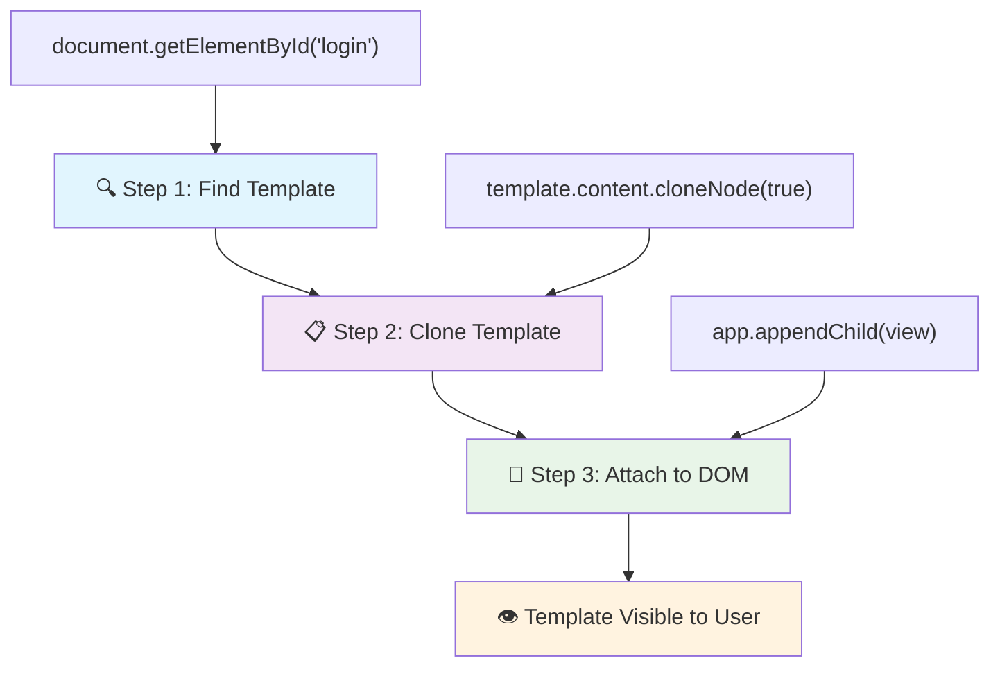
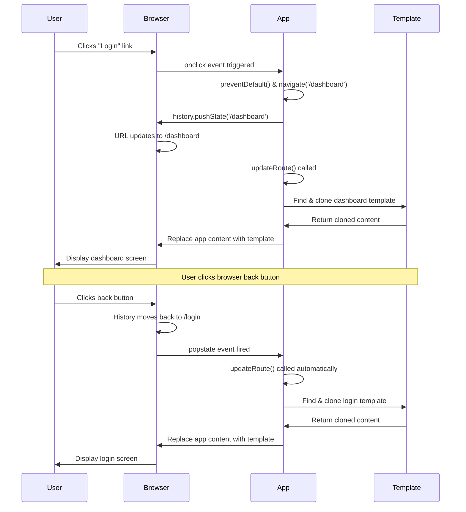

<!--
CO_OP_TRANSLATOR_METADATA:
{
  "original_hash": "5d259f6962464ad91e671083aa0398f4",
  "translation_date": "2025-10-23T20:25:24+00:00",
  "source_file": "7-bank-project/1-template-route/README.md",
  "language_code": "el"
}
-->
# Δημιουργία Εφαρμογής Τραπεζικής Μέρος 1: HTML Πρότυπα και Διαδρομές σε Μια Εφαρμογή Ιστού

Όταν ο υπολογιστής καθοδήγησης του Apollo 11 πλοηγούσε προς τη Σελήνη το 1969, έπρεπε να εναλλάσσεται μεταξύ διαφορετικών προγραμμάτων χωρίς να επανεκκινεί ολόκληρο το σύστημα. Οι σύγχρονες εφαρμογές ιστού λειτουργούν παρόμοια – αλλάζουν αυτό που βλέπετε χωρίς να φορτώνουν τα πάντα από την αρχή. Αυτό δημιουργεί την ομαλή, ευέλικτη εμπειρία που περιμένουν οι χρήστες σήμερα.

Σε αντίθεση με τις παραδοσιακές ιστοσελίδες που φορτώνουν ξανά ολόκληρες σελίδες για κάθε αλληλεπίδραση, οι σύγχρονες εφαρμογές ιστού ενημερώνουν μόνο τα μέρη που χρειάζονται αλλαγή. Αυτή η προσέγγιση, όπως ακριβώς η αλλαγή οθονών στο κέντρο ελέγχου ενώ διατηρείται η συνεχής επικοινωνία, δημιουργεί την ομαλή εμπειρία που έχουμε συνηθίσει.

Αυτό που κάνει τη διαφορά τόσο δραματική:

| Παραδοσιακές Εφαρμογές Πολλαπλών Σελίδων | Σύγχρονες Εφαρμογές Μίας Σελίδας |
|------------------------------------------|----------------------------------|
| **Πλοήγηση** | Επαναφόρτωση ολόκληρης σελίδας για κάθε οθόνη | Άμεση αλλαγή περιεχομένου |
| **Απόδοση** | Πιο αργή λόγω πλήρους λήψης HTML | Πιο γρήγορη με μερικές ενημερώσεις |
| **Εμπειρία Χρήστη** | Ενοχλητικές αναλαμπές σελίδας | Ομαλές, μεταβάσεις τύπου εφαρμογής |
| **Κοινή χρήση δεδομένων** | Δύσκολη μεταξύ σελίδων | Εύκολη διαχείριση κατάστασης |
| **Ανάπτυξη** | Πολλαπλά αρχεία HTML για συντήρηση | Ένα HTML με δυναμικά πρότυπα |

**Κατανόηση της εξέλιξης:**
- **Παραδοσιακές εφαρμογές** απαιτούν αιτήματα στον διακομιστή για κάθε ενέργεια πλοήγησης
- **Σύγχρονες SPAs** φορτώνουν μία φορά και ενημερώνουν δυναμικά το περιεχόμενο χρησιμοποιώντας JavaScript
- **Οι προσδοκίες των χρηστών** πλέον προτιμούν άμεσες, απρόσκοπτες αλληλεπιδράσεις
- **Οφέλη απόδοσης** περιλαμβάνουν μειωμένο εύρος ζώνης και ταχύτερες αποκρίσεις

Σε αυτό το μάθημα, θα δημιουργήσουμε μια τραπεζική εφαρμογή με πολλαπλές οθόνες που συνδέονται απρόσκοπτα. Όπως οι επιστήμονες χρησιμοποιούν αρθρωτά όργανα που μπορούν να επαναδιαμορφωθούν για διαφορετικά πειράματα, θα χρησιμοποιήσουμε HTML πρότυπα ως επαναχρησιμοποιήσιμα στοιχεία που μπορούν να εμφανιστούν όταν χρειάζεται.

Θα δουλέψετε με HTML πρότυπα (επαναχρησιμοποιήσιμα σχέδια για διαφορετικές οθόνες), δρομολόγηση JavaScript (το σύστημα που εναλλάσσει τις οθόνες) και το API ιστορικού του προγράμματος περιήγησης (που διατηρεί τη λειτουργία του κουμπιού "πίσω" όπως αναμένεται). Αυτές είναι οι ίδιες βασικές τεχνικές που χρησιμοποιούνται από πλαίσια όπως React, Vue και Angular.

Μέχρι το τέλος, θα έχετε μια λειτουργική τραπεζική εφαρμογή που θα επιδεικνύει επαγγελματικές αρχές εφαρμογών μίας σελίδας.

## Ερωτηματολόγιο Πριν το Μάθημα

[Ερωτηματολόγιο πριν το μάθημα](https://ff-quizzes.netlify.app/web/quiz/41)

### Τι Θα Χρειαστείτε

Θα χρειαστούμε έναν τοπικό διακομιστή ιστού για να δοκιμάσουμε την τραπεζική μας εφαρμογή – μην ανησυχείτε, είναι πιο εύκολο από ό,τι ακούγεται! Αν δεν έχετε ήδη έναν, απλά εγκαταστήστε το [Node.js](https://nodejs.org) και εκτελέστε `npx lite-server` από τον φάκελο του έργου σας. Αυτή η χρήσιμη εντολή δημιουργεί έναν τοπικό διακομιστή και ανοίγει αυτόματα την εφαρμογή σας στο πρόγραμμα περιήγησης.

### Προετοιμασία

Στον υπολογιστή σας, δημιουργήστε έναν φάκελο με όνομα `bank` με ένα αρχείο `index.html` μέσα. Θα ξεκινήσουμε από αυτό το HTML [boilerplate](https://en.wikipedia.org/wiki/Boilerplate_code):

```html
<!DOCTYPE html>
<html lang="en">
  <head>
    <meta charset="UTF-8">
    <meta name="viewport" content="width=device-width, initial-scale=1.0">
    <title>Bank App</title>
  </head>
  <body>
    <!-- This is where you'll work -->
  </body>
</html>
```

**Τι παρέχει αυτό το boilerplate:**
- **Καθιερώνει** τη δομή εγγράφου HTML5 με σωστή δήλωση DOCTYPE
- **Ρυθμίζει** την κωδικοποίηση χαρακτήρων ως UTF-8 για υποστήριξη διεθνούς κειμένου
- **Ενεργοποιεί** τον ευέλικτο σχεδιασμό με την ετικέτα meta viewport για συμβατότητα με κινητά
- **Ορίζει** έναν περιγραφικό τίτλο που εμφανίζεται στην καρτέλα του προγράμματος περιήγησης
- **Δημιουργεί** μια καθαρή ενότητα σώματος όπου θα κατασκευάσουμε την εφαρμογή μας

> 📁 **Προεπισκόπηση Δομής Έργου**
> 
> **Μέχρι το τέλος αυτού του μαθήματος, το έργο σας θα περιέχει:**
> ```
> bank/
> ├── index.html      <!-- Main HTML with templates -->
> ├── app.js          <!-- Routing and navigation logic -->
> └── style.css       <!-- (Optional for future lessons) -->
> ```
> 
> **Αρμοδιότητες αρχείων:**
> - **index.html**: Περιέχει όλα τα πρότυπα και παρέχει τη δομή της εφαρμογής
> - **app.js**: Χειρίζεται τη δρομολόγηση, την πλοήγηση και τη διαχείριση προτύπων
> - **Πρότυπα**: Ορίζουν το UI για σύνδεση, πίνακα ελέγχου και άλλες οθόνες

---

## HTML Πρότυπα

Τα πρότυπα λύνουν ένα θεμελιώδες πρόβλημα στην ανάπτυξη ιστού. Όταν ο Γουτεμβέργιος εφηύρε την τυπογραφία με κινητά στοιχεία τη δεκαετία του 1440, συνειδητοποίησε ότι αντί να χαράζει ολόκληρες σελίδες, μπορούσε να δημιουργήσει επαναχρησιμοποιήσιμα μπλοκ γραμμάτων και να τα διατάξει όπως χρειαζόταν. Τα HTML πρότυπα λειτουργούν με την ίδια αρχή – αντί να δημιουργούμε ξεχωριστά αρχεία HTML για κάθε οθόνη, ορίζουμε επαναχρησιμοποιήσιμες δομές που μπορούν να εμφανιστούν όταν χρειάζεται.

Σκεφτείτε τα πρότυπα ως σχέδια για διαφορετικά μέρη της εφαρμογής σας. Όπως ένας αρχιτέκτονας δημιουργεί ένα σχέδιο και το χρησιμοποιεί πολλές φορές αντί να ξανασχεδιάζει πανομοιότυπα δωμάτια, δημιουργούμε πρότυπα μία φορά και τα ενεργοποιούμε όταν χρειάζεται. Το πρόγραμμα περιήγησης διατηρεί αυτά τα πρότυπα κρυφά μέχρι να τα ενεργοποιήσει η JavaScript.

Αν θέλετε να δημιουργήσετε πολλαπλές οθόνες για μια ιστοσελίδα, μια λύση θα ήταν να δημιουργήσετε ένα αρχείο HTML για κάθε οθόνη που θέλετε να εμφανίσετε. Ωστόσο, αυτή η λύση συνοδεύεται από κάποιες δυσκολίες:

- Πρέπει να φορτώσετε ξανά ολόκληρο το HTML όταν αλλάζετε οθόνη, κάτι που μπορεί να είναι αργό.
- Είναι δύσκολο να μοιραστείτε δεδομένα μεταξύ των διαφορετικών οθονών.

Μια άλλη προσέγγιση είναι να έχετε μόνο ένα αρχείο HTML και να ορίσετε πολλαπλά [HTML πρότυπα](https://developer.mozilla.org/docs/Web/HTML/Element/template) χρησιμοποιώντας το στοιχείο `<template>`. Ένα πρότυπο είναι ένα επαναχρησιμοποιήσιμο μπλοκ HTML που δεν εμφανίζεται από το πρόγραμμα περιήγησης και πρέπει να ενεργοποιηθεί κατά την εκτέλεση χρησιμοποιώντας JavaScript.

### Ας το Δημιουργήσουμε

Θα δημιουργήσουμε μια τραπεζική εφαρμογή με δύο κύριες οθόνες: μια σελίδα σύνδεσης και έναν πίνακα ελέγχου. Πρώτα, ας προσθέσουμε ένα στοιχείο κράτησης θέσης στο σώμα του HTML – εδώ θα εμφανίζονται όλες οι διαφορετικές οθόνες μας:

```html
<div id="app">Loading...</div>
```

**Κατανόηση αυτού του στοιχείου κράτησης θέσης:**
- **Δημιουργεί** ένα κοντέινερ με το ID "app" όπου θα εμφανίζονται όλες οι οθόνες
- **Εμφανίζει** ένα μήνυμα φόρτωσης μέχρι να αρχικοποιήσει η JavaScript την πρώτη οθόνη
- **Παρέχει** ένα μοναδικό σημείο τοποθέτησης για το δυναμικό περιεχόμενο μας
- **Επιτρέπει** εύκολη στόχευση από τη JavaScript χρησιμοποιώντας `document.getElementById()`

> 💡 **Χρήσιμη Συμβουλή**: Επειδή το περιεχόμενο αυτού του στοιχείου θα αντικατασταθεί, μπορούμε να βάλουμε ένα μήνυμα φόρτωσης ή ένδειξη που θα εμφανίζεται ενώ φορτώνει η εφαρμογή.

Στη συνέχεια, ας προσθέσουμε το HTML πρότυπο για τη σελίδα σύνδεσης. Προς το παρόν θα βάλουμε μόνο έναν τίτλο και μια ενότητα που περιέχει έναν σύνδεσμο που θα χρησιμοποιήσουμε για την πλοήγηση.

```html
<template id="login">
  <h1>Bank App</h1>
  <section>
    <a href="/dashboard">Login</a>
  </section>
</template>
```

**Ανάλυση αυτού του προτύπου σύνδεσης:**
- **Ορίζει** ένα πρότυπο με μοναδικό αναγνωριστικό "login" για στόχευση από τη JavaScript
- **Περιλαμβάνει** έναν κύριο τίτλο που καθιερώνει την επωνυμία της εφαρμογής
- **Περιέχει** ένα στοιχείο `<section>` για ομαδοποίηση σχετικού περιεχομένου
- **Παρέχει** έναν σύνδεσμο πλοήγησης που θα οδηγεί τους χρήστες στον πίνακα ελέγχου

Έπειτα, θα προσθέσουμε ένα άλλο HTML πρότυπο για τη σελίδα του πίνακα ελέγχου. Αυτή η σελίδα θα περιέχει διαφορετικές ενότητες:

- Μια κεφαλίδα με τίτλο και σύνδεσμο αποσύνδεσης
- Το τρέχον υπόλοιπο του τραπεζικού λογαριασμού
- Μια λίστα συναλλαγών, εμφανιζόμενη σε έναν πίνακα

```html
<template id="dashboard">
  <header>
    <h1>Bank App</h1>
    <a href="/login">Logout</a>
  </header>
  <section>
    Balance: 100$
  </section>
  <section>
    <h2>Transactions</h2>
    <table>
      <thead>
        <tr>
          <th>Date</th>
          <th>Object</th>
          <th>Amount</th>
        </tr>
      </thead>
      <tbody></tbody>
    </table>
  </section>
</template>
```

**Ας κατανοήσουμε κάθε μέρος αυτού του πίνακα ελέγχου:**
- **Δομεί** τη σελίδα με ένα στοιχείο `<header>` που περιέχει πλοήγηση
- **Εμφανίζει** τον τίτλο της εφαρμογής με συνέπεια σε όλες τις οθόνες για επωνυμία
- **Παρέχει** έναν σύνδεσμο αποσύνδεσης που οδηγεί πίσω στη σελίδα σύνδεσης
- **Εμφανίζει** το τρέχον υπόλοιπο λογαριασμού σε μια ειδική ενότητα
- **Οργανώνει** δεδομένα συναλλαγών χρησιμοποιώντας έναν σωστά δομημένο πίνακα HTML
- **Ορίζει** κεφαλίδες πίνακα για τις στήλες Ημερομηνία, Αντικείμενο και Ποσό
- **Αφήνει** το σώμα του πίνακα κενό για δυναμική εισαγωγή περιεχομένου αργότερα

> 💡 **Χρήσιμη Συμβουλή**: Όταν δημιουργείτε HTML πρότυπα, αν θέλετε να δείτε πώς θα φαίνεται, μπορείτε να σχολιάσετε τις γραμμές `<template>` και `</template>` περικλείοντάς τες με `<!-- -->`.

✅ Γιατί πιστεύετε ότι χρησιμοποιούμε `id` στα πρότυπα; Θα μπορούσαμε να χρησιμοποιήσουμε κάτι άλλο όπως κλάσεις;

## Ζωντανεύοντας τα Πρότυπα με JavaScript

Τώρα πρέπει να κάνουμε τα πρότυπα μας λειτουργικά. Όπως ένας τρισδιάστατος εκτυπωτής παίρνει ένα ψηφιακό σχέδιο και δημιουργεί ένα φυσικό αντικείμενο, η JavaScript παίρνει τα κρυφά πρότυπα μας και δημιουργεί ορατά, διαδραστικά στοιχεία που οι χρήστες μπορούν να δουν και να χρησιμοποιήσουν.

Η διαδικασία ακολουθεί τρία σταθερά βήματα που αποτελούν τη βάση της σύγχρονης ανάπτυξης ιστού. Μόλις κατανοήσετε αυτό το μοτίβο, θα το αναγνωρίσετε σε πολλά πλαίσια και βιβλιοθήκες.

Αν δοκιμάσετε το τρέχον αρχείο HTML στο πρόγραμμα περιήγησης, θα δείτε ότι μένει κολλημένο στο `Loading...`. Αυτό συμβαίνει επειδή πρέπει να προσθέσουμε κάποιο κώδικα JavaScript για να ενεργοποιήσουμε και να εμφανίσουμε τα HTML πρότυπα.

Η ενεργοποίηση ενός προτύπου γίνεται συνήθως σε 3 βήματα:

1. Ανάκτηση του στοιχείου προτύπου στο DOM, για παράδειγμα χρησιμοποιώντας [`document.getElementById`](https://developer.mozilla.org/docs/Web/API/Document/getElementById).
2. Κλωνοποίηση του στοιχείου προτύπου, χρησιμοποιώντας [`cloneNode`](https://developer.mozilla.org/docs/Web/API/Node/cloneNode).
3. Επισύναψη του στο DOM κάτω από ένα ορατό στοιχείο, για παράδειγμα χρησιμοποιώντας [`appendChild`](https://developer.mozilla.org/docs/Web/API/Node/appendChild).



**Οπτική ανάλυση της διαδικασίας:**
- **Βήμα 1** εντοπίζει το κρυφό πρότυπο στη δομή του DOM
- **Βήμα 2** δημιουργεί ένα λειτουργικό αντίγραφο που μπορεί να τροποποιηθεί με ασφάλεια
- **Βήμα 3** εισάγει το αντίγραφο στην ορατή περιοχή της σελίδας
- **Αποτέλεσμα** είναι μια λειτουργική οθόνη που οι χρήστες μπορούν να αλληλεπιδράσουν

✅ Γιατί πρέπει να κλωνοποιήσουμε το πρότυπο πριν το επισυνάψουμε στο DOM; Τι πιστεύετε ότι θα συνέβαινε αν παραλείπαμε αυτό το βήμα;

### Εργασία

Δημιουργήστε ένα νέο αρχείο με όνομα `app.js` στον φάκελο του έργου σας και εισάγετε αυτό το αρχείο στην ενότητα `<head>` του HTML σας:

```html
<script src="app.js" defer></script>
```

**Κατανόηση αυτής της εισαγωγής script:**
- **Συνδέει** το αρχείο JavaScript με το έγγραφο HTML μας
- **Χρησιμοποιεί** το χαρακτηριστικό `defer` για να διασφαλίσει ότι το script εκτελείται μετά την ολοκλήρωση της ανάλυσης του HTML
- **Επιτρέπει** την πρόσβαση σε όλα τα στοιχεία του DOM αφού φορτωθούν πλήρως πριν την εκτέλεση του script
- **Ακολουθεί** σύγχρονες βέλτιστες πρακτικές για φόρτωση script και απόδοση

Τώρα στο `app.js`, θα δημιουργήσουμε μια νέα συνάρτηση `updateRoute`:

```js
function updateRoute(templateId) {
  const template = document.getElementById(templateId);
  const view = template.content.cloneNode(true);
  const app = document.getElementById('app');
  app.innerHTML = '';
  app.appendChild(view);
}
```

**Βήμα προς βήμα, τι συμβαίνει εδώ:**
- **Εντοπίζει** το στοιχείο προτύπου χρησιμοποιώντας το μοναδικό του ID
- **Δημιουργεί** ένα βαθύ αντίγραφο του περιεχομένου του προτύπου χρησιμοποιώντας `cloneNode(true)`
- **Βρίσκει** το κοντέινερ της εφαρμογής όπου θα εμφανιστεί το περιεχόμενο
- **Καθαρίζει** οποιοδήποτε υπάρχον περιεχόμενο από το κοντέινερ της εφαρμογής
- **Εισάγει** το κλωνοποιημένο περιεχόμενο του προτύπου στο ορατό DOM

Τώρα καλέστε αυτή τη συνάρτηση με ένα από τα πρότυπα και δείτε το αποτέλεσμα.

```js
updateRoute('login');
```

**Τι επιτυγχάνει αυτή η κλήση συνάρτησης:**
- **Ενεργοποιεί** το πρότυπο σύνδεσης περνώντας το ID του ως παράμετρο
- **Δείχνει** πώς να εναλλάσσετε προγραμματικά μεταξύ διαφορετικών οθονών της εφαρμογής
- **Εμφανίζει** την οθόνη σύνδεσης αντί για το μήνυμα "Loading..."

✅ Ποιος είναι ο σκοπός αυτού του κώδικα `app.innerHTML = '';`; Τι συμβαίνει χωρίς αυτό;

## Δημιουργία Διαδρομών

Η δρομολόγηση αφορά ουσιαστικά τη σύνδεση URL με το σωστό περιεχόμενο. Σκεφτείτε πώς οι πρώτοι τηλεφωνικοί χειριστές χρησιμοποιούσαν πίνακες διασύνδεσης για να συνδέσουν κλήσεις – έπαιρναν ένα εισερχόμενο αίτημα και το κατεύθυναν στον
✅ Τι συμβαίνει αν εισάγετε μια άγνωστη διαδρομή στη διεύθυνση URL; Πώς θα μπορούσαμε να το λύσουμε;

## Προσθήκη Πλοήγησης

Με την καθιέρωση της δρομολόγησης, οι χρήστες χρειάζονται έναν τρόπο να πλοηγηθούν μέσα στην εφαρμογή. Οι παραδοσιακοί ιστότοποι ανανεώνουν ολόκληρες σελίδες όταν κάνετε κλικ σε συνδέσμους, αλλά εμείς θέλουμε να ενημερώσουμε τόσο τη διεύθυνση URL όσο και το περιεχόμενο χωρίς ανανέωση της σελίδας. Αυτό δημιουργεί μια πιο ομαλή εμπειρία, παρόμοια με το πώς οι εφαρμογές επιτραπέζιων υπολογιστών εναλλάσσονται μεταξύ διαφορετικών προβολών.

Πρέπει να συντονίσουμε δύο πράγματα: την ενημέρωση της διεύθυνσης URL του προγράμματος περιήγησης ώστε οι χρήστες να μπορούν να αποθηκεύουν σελιδοδείκτες και να μοιράζονται συνδέσμους, και την εμφάνιση του κατάλληλου περιεχομένου. Όταν υλοποιηθεί σωστά, αυτό δημιουργεί την απρόσκοπτη πλοήγηση που περιμένουν οι χρήστες από τις σύγχρονες εφαρμογές.

> 🏗️ **Επισκόπηση Αρχιτεκτονικής**: Συστατικά του Συστήματος Πλοήγησης
>
> **Τι δημιουργείτε:**
> - **🔄 Διαχείριση URL**: Ενημερώνει τη γραμμή διευθύνσεων του προγράμματος περιήγησης χωρίς ανανέωση της σελίδας
> - **📋 Σύστημα Προτύπων**: Αντικαθιστά δυναμικά το περιεχόμενο βάσει της τρέχουσας διαδρομής  
> - **📚 Ενσωμάτωση Ιστορικού**: Διατηρεί τη λειτουργικότητα των κουμπιών πίσω/μπροστά του προγράμματος περιήγησης
> - **🛡️ Διαχείριση Σφαλμάτων**: Ομαλές εναλλακτικές για μη έγκυρες ή ελλείπουσες διαδρομές
>
> **Πώς συνεργάζονται τα συστατικά:**
> - **Ακούει** για γεγονότα πλοήγησης (κλικ, αλλαγές ιστορικού)
> - **Ενημερώνει** τη διεύθυνση URL χρησιμοποιώντας το History API
> - **Απεικονίζει** το κατάλληλο πρότυπο για τη νέα διαδρομή
> - **Διατηρεί** μια απρόσκοπτη εμπειρία χρήστη καθ' όλη τη διάρκεια

Το επόμενο βήμα για την εφαρμογή μας είναι να προσθέσουμε τη δυνατότητα πλοήγησης μεταξύ σελίδων χωρίς να χρειάζεται να αλλάξουμε τη διεύθυνση URL χειροκίνητα. Αυτό συνεπάγεται δύο πράγματα:

  1. Ενημέρωση της τρέχουσας διεύθυνσης URL
  2. Ενημέρωση του εμφανιζόμενου προτύπου βάσει της νέας διεύθυνσης URL

Έχουμε ήδη φροντίσει το δεύτερο μέρος με τη συνάρτηση `updateRoute`, οπότε πρέπει να βρούμε πώς να ενημερώσουμε την τρέχουσα διεύθυνση URL.

Θα χρειαστεί να χρησιμοποιήσουμε JavaScript και πιο συγκεκριμένα το [`history.pushState`](https://developer.mozilla.org/docs/Web/API/History/pushState), που επιτρέπει την ενημέρωση της διεύθυνσης URL και τη δημιουργία μιας νέας καταχώρησης στο ιστορικό περιήγησης, χωρίς να ανανεώνεται το HTML.

> ⚠️ **Σημαντική Σημείωση**: Παρόλο που το στοιχείο αγκύρωσης HTML [`<a href>`](https://developer.mozilla.org/docs/Web/HTML/Element/a) μπορεί να χρησιμοποιηθεί από μόνο του για τη δημιουργία υπερσυνδέσμων σε διαφορετικές διευθύνσεις URL, θα κάνει το πρόγραμμα περιήγησης να ανανεώσει το HTML από προεπιλογή. Είναι απαραίτητο να αποτραπεί αυτή η συμπεριφορά κατά τη διαχείριση της δρομολόγησης με προσαρμοσμένη JavaScript, χρησιμοποιώντας τη συνάρτηση preventDefault() στο γεγονός κλικ.

### Εργασία

Ας δημιουργήσουμε μια νέα συνάρτηση που μπορούμε να χρησιμοποιήσουμε για πλοήγηση στην εφαρμογή μας:

```js
function navigate(path) {
  window.history.pushState({}, path, path);
  updateRoute();
}
```

**Κατανόηση αυτής της συνάρτησης πλοήγησης:**
- **Ενημερώνει** τη διεύθυνση URL του προγράμματος περιήγησης στη νέα διαδρομή χρησιμοποιώντας το `history.pushState`
- **Προσθέτει** μια νέα καταχώρηση στη στοίβα ιστορικού του προγράμματος περιήγησης για σωστή υποστήριξη των κουμπιών πίσω/μπροστά
- **Ενεργοποιεί** τη συνάρτηση `updateRoute()` για να εμφανίσει το αντίστοιχο πρότυπο
- **Διατηρεί** την εμπειρία της εφαρμογής μίας σελίδας χωρίς ανανέωση της σελίδας

Αυτή η μέθοδος πρώτα ενημερώνει την τρέχουσα διεύθυνση URL βάσει της δεδομένης διαδρομής και στη συνέχεια ενημερώνει το πρότυπο. Η ιδιότητα `window.location.origin` επιστρέφει τη ρίζα της διεύθυνσης URL, επιτρέποντάς μας να ανακατασκευάσουμε μια πλήρη διεύθυνση URL από μια δεδομένη διαδρομή.

Τώρα που έχουμε αυτή τη συνάρτηση, μπορούμε να φροντίσουμε το πρόβλημα που έχουμε αν μια διαδρομή δεν ταιριάζει με καμία καθορισμένη διαδρομή. Θα τροποποιήσουμε τη συνάρτηση `updateRoute` προσθέτοντας μια εναλλακτική σε μία από τις υπάρχουσες διαδρομές αν δεν μπορούμε να βρούμε αντιστοιχία.

```js
function updateRoute() {
  const path = window.location.pathname;
  const route = routes[path];

  if (!route) {
    return navigate('/login');
  }

  const template = document.getElementById(route.templateId);
  const view = template.content.cloneNode(true);
  const app = document.getElementById('app');
  app.innerHTML = '';
  app.appendChild(view);
}
```

**Σημαντικά σημεία που πρέπει να θυμάστε:**
- **Ελέγχει** αν υπάρχει διαδρομή για την τρέχουσα διεύθυνση URL
- **Ανακατευθύνει** στη σελίδα σύνδεσης όταν προσπελαστεί μια μη έγκυρη διαδρομή
- **Παρέχει** έναν μηχανισμό εναλλακτικής που αποτρέπει τη διακοπή της πλοήγησης
- **Εξασφαλίζει** ότι οι χρήστες βλέπουν πάντα μια έγκυρη οθόνη, ακόμα και με λανθασμένες διευθύνσεις URL

Αν δεν μπορεί να βρεθεί μια διαδρομή, τώρα θα ανακατευθύνουμε στη σελίδα `login`.

Τώρα ας δημιουργήσουμε μια συνάρτηση για να πάρουμε τη διεύθυνση URL όταν γίνει κλικ σε έναν σύνδεσμο και να αποτρέψουμε την προεπιλεγμένη συμπεριφορά του προγράμματος περιήγησης:

```js
function onLinkClick(event) {
  event.preventDefault();
  navigate(event.target.href);
}
```

**Ανάλυση αυτού του χειριστή κλικ:**
- **Αποτρέπει** την προεπιλεγμένη συμπεριφορά του προγράμματος περιήγησης χρησιμοποιώντας το `preventDefault()`
- **Εξάγει** τη διεύθυνση URL προορισμού από το στοιχείο του συνδέσμου που έγινε κλικ
- **Καλεί** τη δική μας προσαρμοσμένη συνάρτηση πλοήγησης αντί να ανανεώσει τη σελίδα
- **Διατηρεί** την ομαλή εμπειρία εφαρμογής μίας σελίδας

```html
<a href="/dashboard" onclick="onLinkClick(event)">Login</a>
...
<a href="/login" onclick="onLinkClick(event)">Logout</a>
```

**Τι επιτυγχάνει αυτή η σύνδεση onclick:**
- **Συνδέει** κάθε σύνδεσμο με το προσαρμοσμένο σύστημα πλοήγησης
- **Περνάει** το γεγονός κλικ στη συνάρτηση `onLinkClick` για επεξεργασία
- **Επιτρέπει** ομαλή πλοήγηση χωρίς ανανέωση της σελίδας
- **Διατηρεί** τη σωστή δομή διεύθυνσης URL που οι χρήστες μπορούν να αποθηκεύσουν ή να μοιραστούν

Η ιδιότητα [`onclick`](https://developer.mozilla.org/docs/Web/API/GlobalEventHandlers/onclick) συνδέει το γεγονός `click` με τον κώδικα JavaScript, εδώ την κλήση της συνάρτησης `navigate()`.

Δοκιμάστε να κάνετε κλικ σε αυτούς τους συνδέσμους, τώρα θα πρέπει να μπορείτε να πλοηγηθείτε μεταξύ των διαφορετικών οθονών της εφαρμογής σας.

✅ Η μέθοδος `history.pushState` είναι μέρος του προτύπου HTML5 και υλοποιείται σε [όλα τα σύγχρονα προγράμματα περιήγησης](https://caniuse.com/?search=pushState). Αν δημιουργείτε μια διαδικτυακή εφαρμογή για παλαιότερα προγράμματα περιήγησης, υπάρχει ένα κόλπο που μπορείτε να χρησιμοποιήσετε αντί για αυτό το API: χρησιμοποιώντας ένα [hash (`#`)](https://en.wikipedia.org/wiki/URI_fragment) πριν από τη διαδρομή, μπορείτε να υλοποιήσετε δρομολόγηση που λειτουργεί με κανονική πλοήγηση αγκύρωσης και δεν ανανεώνει τη σελίδα, καθώς ο σκοπός του ήταν να δημιουργήσει εσωτερικούς συνδέσμους μέσα σε μια σελίδα.

## Κάνοντας τα κουμπιά Πίσω και Μπροστά να λειτουργούν

Τα κουμπιά πίσω και μπροστά είναι θεμελιώδη για την περιήγηση στο διαδίκτυο, όπως ακριβώς οι ελεγκτές αποστολών της NASA μπορούν να αναθεωρήσουν προηγούμενες καταστάσεις συστημάτων κατά τη διάρκεια διαστημικών αποστολών. Οι χρήστες περιμένουν αυτά τα κουμπιά να λειτουργούν, και όταν δεν λειτουργούν, σπάει την αναμενόμενη εμπειρία περιήγησης.

Η εφαρμογή μίας σελίδας μας χρειάζεται πρόσθετη διαμόρφωση για να το υποστηρίξει αυτό. Το πρόγραμμα περιήγησης διατηρεί μια στοίβα ιστορικού (την οποία προσθέτουμε με το `history.pushState`), αλλά όταν οι χρήστες πλοηγούνται μέσω αυτού του ιστορικού, η εφαρμογή μας πρέπει να ανταποκρίνεται ενημερώνοντας το εμφανιζόμενο περιεχόμενο ανάλογα.



**Σημεία αλληλεπίδρασης:**
- **Οι ενέργειες των χρηστών** ενεργοποιούν την πλοήγηση μέσω κλικ ή κουμπιών του προγράμματος περιήγησης
- **Η εφαρμογή αναχαιτίζει** τα κλικ στους συνδέσμους για να αποτρέψει την ανανέωση της σελίδας
- **Το History API** διαχειρίζεται τις αλλαγές διεύθυνσης URL και τη στοίβα ιστορικού του προγράμματος περιήγησης
- **Τα πρότυπα** παρέχουν τη δομή περιεχομένου για κάθε οθόνη
- **Οι ακροατές γεγονότων** εξασφαλίζουν ότι η εφαρμογή ανταποκρίνεται σε όλους τους τύπους πλοήγησης

Η χρήση του `history.pushState` δημιουργεί νέες καταχωρήσεις στο ιστορικό πλοήγησης του προγράμματος περιήγησης. Μπορείτε να το ελέγξετε κρατώντας πατημένο το *κουμπί πίσω* του προγράμματος περιήγησης, θα πρέπει να εμφανίζει κάτι σαν αυτό:


Αν δοκιμάσετε να κάνετε κλικ στο κουμπί πίσω μερικές φορές, θα δείτε ότι η τρέχουσα διεύθυνση URL αλλάζει και το ιστορικό ενημερώνεται, αλλά το ίδιο πρότυπο συνεχίζει να εμφανίζεται.

Αυτό συμβαίνει επειδή η εφαρμογή δεν γνωρίζει ότι πρέπει να καλέσουμε το `updateRoute()` κάθε φορά που αλλάζει το ιστορικό. Αν κοιτάξετε την τεκμηρίωση του [`history.pushState`](https://developer.mozilla.org/docs/Web/API/History/pushState), μπορείτε να δείτε ότι αν αλλάξει η κατάσταση - που σημαίνει ότι μετακινηθήκαμε σε διαφορετική διεύθυνση URL - ενεργοποιείται το γεγονός [`popstate`](https://developer.mozilla.org/docs/Web/API/Window/popstate_event). Θα το χρησιμοποιήσουμε για να διορθώσουμε αυτό το ζήτημα.

### Εργασία

Για να βεβαιωθούμε ότι το εμφανιζόμενο πρότυπο ενημερώνεται όταν αλλάζει το ιστορικό του προγράμματος περιήγησης, θα συνδέσουμε μια νέα συνάρτηση που καλεί το `updateRoute()`. Θα το κάνουμε αυτό στο κάτω μέρος του αρχείου `app.js`:

```js
window.onpopstate = () => updateRoute();
updateRoute();
```

**Κατανόηση αυτής της ενσωμάτωσης ιστορικού:**
- **Ακούει** για γεγονότα `popstate` που συμβαίνουν όταν οι χρήστες πλοηγούνται με τα κουμπιά του προγράμματος περιήγησης
- **Χρησιμοποιεί** μια συνάρτηση βέλους για συνοπτική σύνταξη χειριστή γεγονότων
- **Καλεί** το `updateRoute()` αυτόματα κάθε φορά που αλλάζει η κατάσταση του ιστορικού
- **Αρχικοποιεί** την εφαρμογή καλώντας το `updateRoute()` όταν φορτώνεται για πρώτη φορά η σελίδα
- **Εξασφαλίζει** ότι το σωστό πρότυπο εμφανίζεται ανεξάρτητα από το πώς πλοηγούνται οι χρήστες

> 💡 **Χρήσιμη Συμβουλή**: Χρησιμοποιήσαμε μια [συνάρτηση βέλους](https://developer.mozilla.org/docs/Web/JavaScript/Reference/Functions/Arrow_functions) εδώ για να δηλώσουμε τον χειριστή γεγονότων `popstate` για συντομία, αλλά μια κανονική συνάρτηση θα λειτουργούσε το ίδιο.

Δείτε ένα βίντεο ανασκόπησης για τις συναρτήσεις βέλους:

[](https://youtube.com/watch?v=OP6eEbOj2sc "Συναρτήσεις Βέλους")

> 🎥 Κάντε κλικ στην εικόνα παραπάνω για ένα βίντεο σχετικά με τις συναρτήσεις βέλους.

Τώρα δοκιμάστε να χρησιμοποιήσετε τα κουμπιά πίσω και μπροστά του προγράμματος περιήγησης και ελέγξτε ότι η εμφανιζόμενη διαδρομή ενημερώνεται σωστά αυτή τη φορά.

---

## Πρόκληση GitHub Copilot Agent 🚀

Χρησιμοποιήστε τη λειτουργία Agent για να ολοκληρώσετε την παρακάτω πρόκληση:

**Περιγραφή:** Βελτιώστε την τραπεζική εφαρμογή προσθέτοντας διαχείριση σφαλμάτων και ένα πρότυπο σελίδας 404 για μη έγκυρες διαδρομές, βελτιώνοντας την εμπειρία χρήστη κατά την πλοήγηση σε ανύπαρκτες σελίδες.

**Πρόκληση:** Δημιουργήστε ένα νέο πρότυπο HTML με το id "not-found" που εμφανίζει μια φιλική σελίδα σφάλματος 404 με στυλ. Στη συνέχεια, τροποποιήστε τη λογική δρομολόγησης JavaScript για να εμφανίσετε αυτό το πρότυπο όταν οι χρήστες πλοηγούνται σε μη έγκυρες διευθύνσεις URL και προσθέστε ένα κουμπί "Πήγαινε στην Αρχική" που οδηγεί πίσω στη σελίδα σύνδεσης.

Μάθετε περισσότερα για τη [λειτουργία agent](https://code.visualstudio.com/blogs/2025/02/24/introducing-copilot-agent-mode) εδώ.

## 🚀 Πρόκληση

Προσθέστε ένα νέο πρότυπο και διαδρομή για μια τρίτη σελίδα που δείχνει τα credits αυτής της εφαρμογής.

**Στόχοι πρόκλησης:**
- **Δημιουργήστε** ένα νέο πρότυπο HTML με κατάλληλη δομή περιεχομένου
- **Προσθέστε** τη νέα διαδρομή στο αντικείμενο διαμόρφωσης των διαδρομών σας
- **Συμπεριλάβετε** συνδέσμους πλοήγησης προς και από τη σελίδα credits
- **Δοκιμάστε** ότι όλη η πλοήγηση λειτουργεί σωστά με το ιστορικό του προγράμματος περιήγησης

## Κουίζ μετά το μάθημα

[Κουίζ μετά το μάθημα](https://ff-quizzes.netlify.app/web/quiz/42)

## Ανασκόπηση & Αυτομελέτη

Η δρομολόγηση είναι ένα από τα εκπληκτικά δύσκολα μέρη της ανάπτυξης ιστού, ειδικά καθώς ο ιστός μεταβαίνει από συμπεριφορές ανανέωσης σελίδας σε ανανεώσεις σελίδας Εφαρμογών Μίας Σελίδας. Διαβάστε λίγο για το [πώς η υπηρεσία Azure Static Web App](https://docs.microsoft.com/azure/static-web-apps/routes/?WT.mc_id=academic-77807-sagibbon) χειρίζεται τη δρομολόγηση. Μπορείτε να εξηγήσετε γιατί ορισμένες από τις αποφάσεις που περιγράφονται σε αυτό το έγγραφο είναι απαραίτητες

---

**Αποποίηση ευθύνης**:  
Αυτό το έγγραφο έχει μεταφραστεί χρησιμοποιώντας την υπηρεσία αυτόματης μετάφρασης [Co-op Translator](https://github.com/Azure/co-op-translator). Παρόλο που καταβάλλουμε προσπάθειες για ακρίβεια, παρακαλούμε να έχετε υπόψη ότι οι αυτόματες μεταφράσεις ενδέχεται να περιέχουν λάθη ή ανακρίβειες. Το πρωτότυπο έγγραφο στη μητρική του γλώσσα θα πρέπει να θεωρείται η αυθεντική πηγή. Για κρίσιμες πληροφορίες, συνιστάται επαγγελματική ανθρώπινη μετάφραση. Δεν φέρουμε ευθύνη για τυχόν παρεξηγήσεις ή εσφαλμένες ερμηνείες που προκύπτουν από τη χρήση αυτής της μετάφρασης.