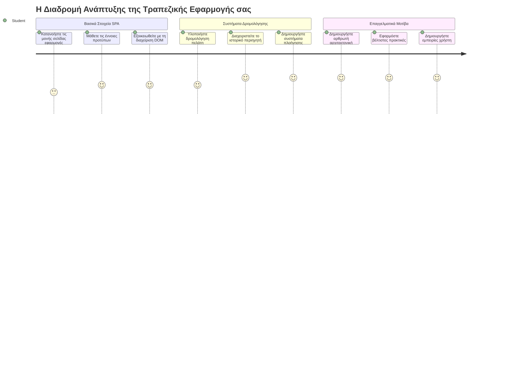
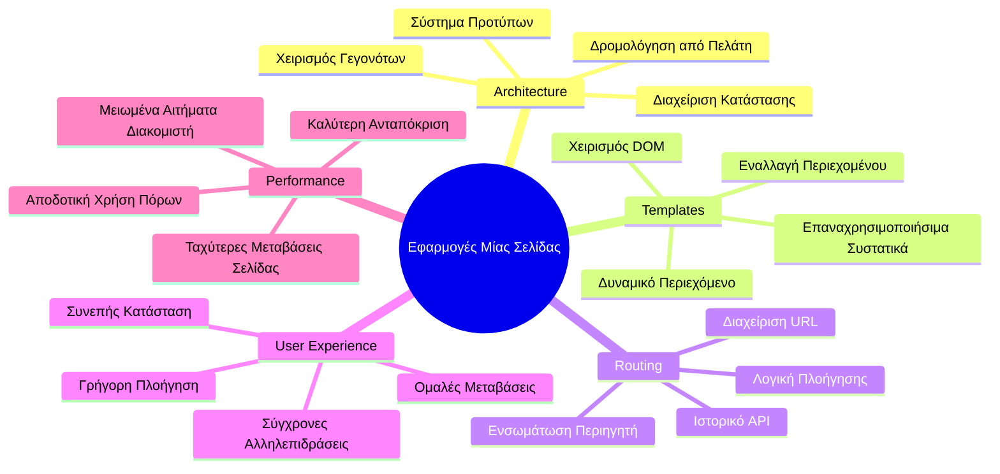
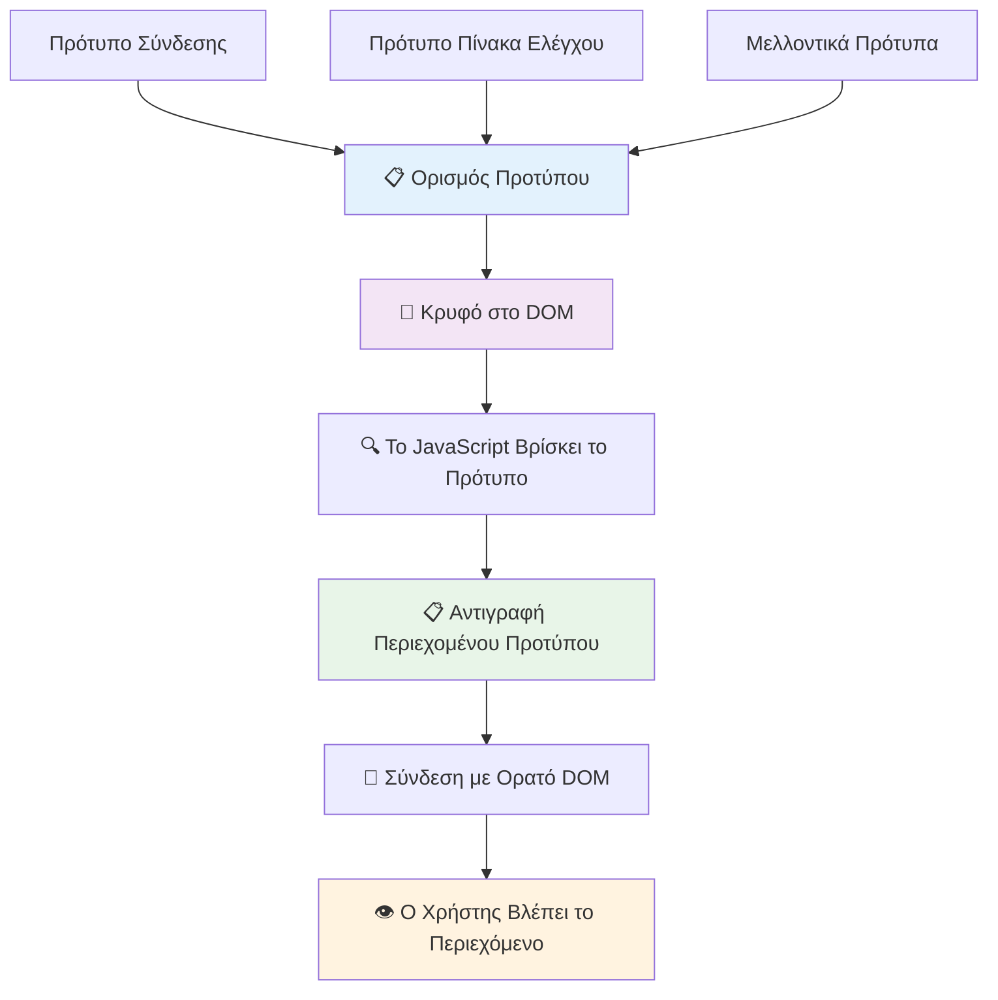
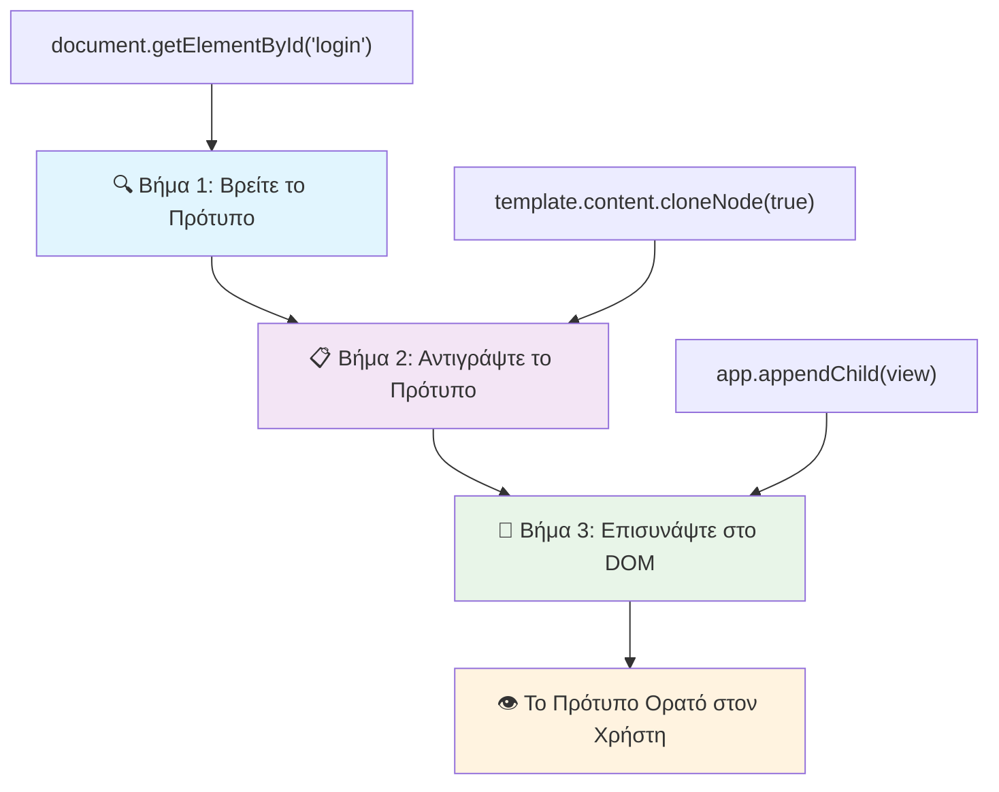
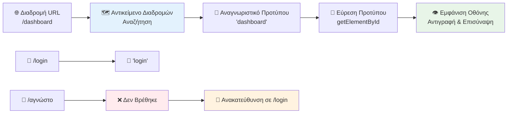
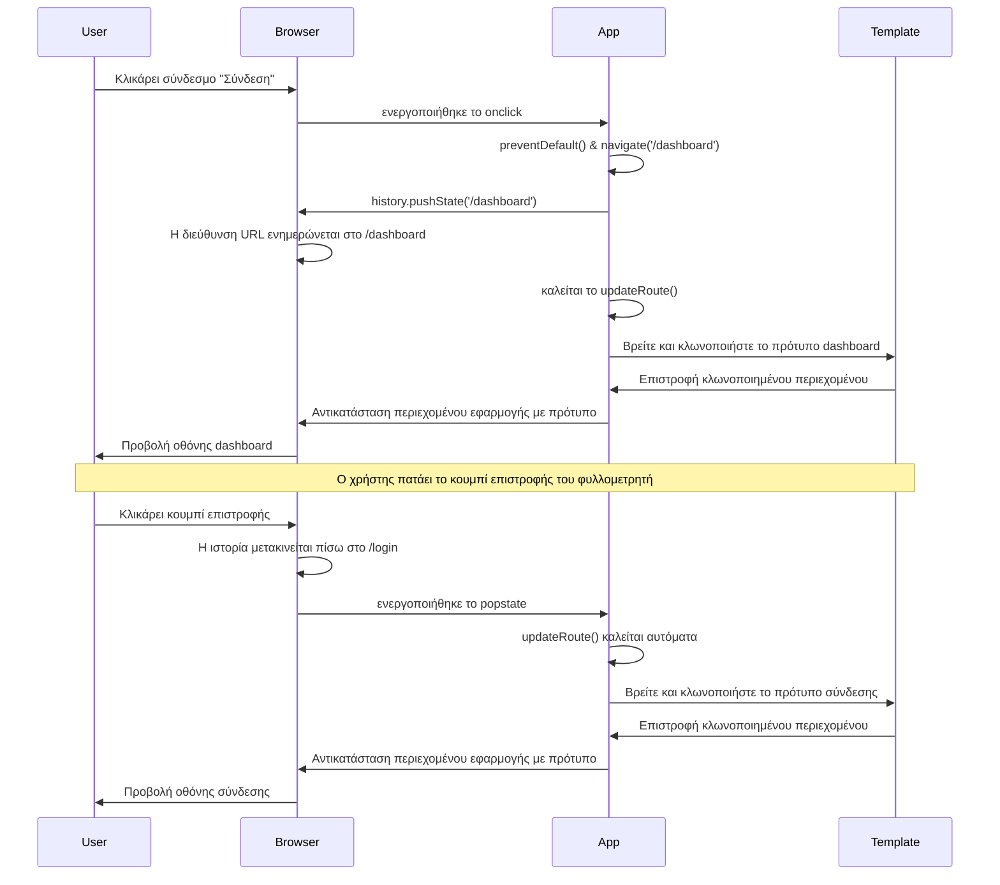
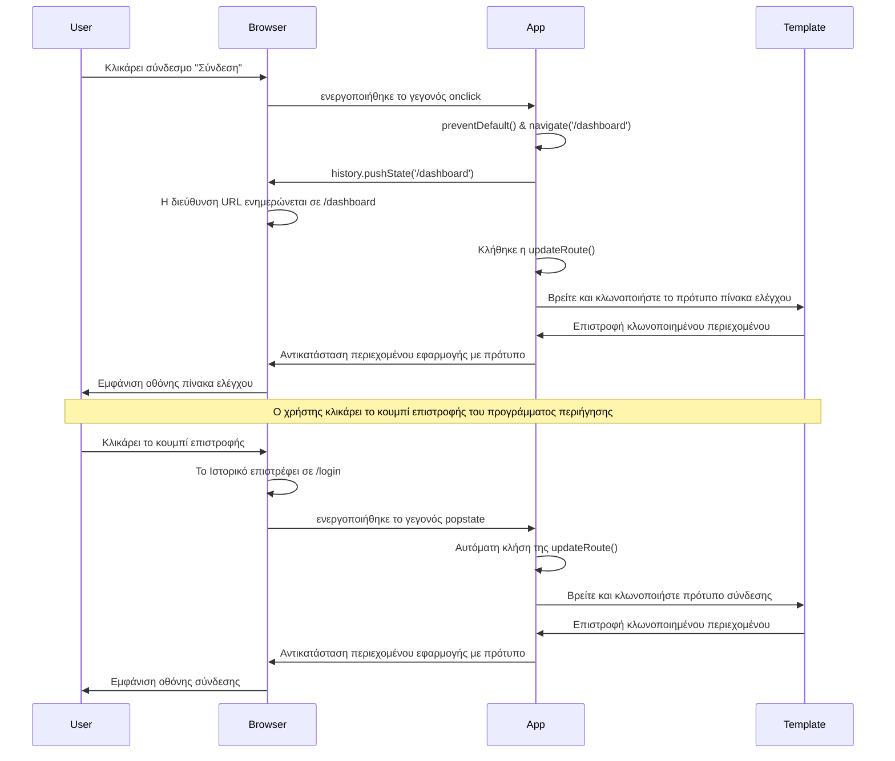
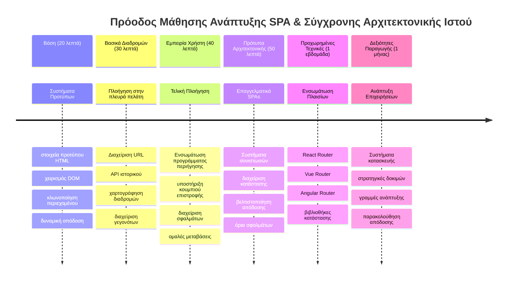

<!--
CO_OP_TRANSLATOR_METADATA:
{
  "original_hash": "351678bece18f07d9daa987a881fb062",
  "translation_date": "2026-01-06T20:55:02+00:00",
  "source_file": "7-bank-project/1-template-route/README.md",
  "language_code": "el"
}
-->
# Δημιουργία Εφαρμογής Τραπεζικής Μέρος 1: Πρότυπα HTML και Διαδρομές σε Μια Web Εφαρμογή


Όταν ο υπολογιστής καθοδήγησης του Apollo 11 πλοηγήθηκε προς τη σελήνη το 1969, έπρεπε να μεταβαίνει μεταξύ διαφορετικών προγραμμάτων χωρίς να επανεκκινεί ολόκληρο το σύστημα. Οι σύγχρονες web εφαρμογές λειτουργούν παρόμοια – αλλάζουν αυτό που βλέπετε χωρίς να φορτώνουν ξανά τα πάντα από την αρχή. Αυτό δημιουργεί την ομαλή, ανταποκρινόμενη εμπειρία που αναμένουν σήμερα οι χρήστες.

Σε αντίθεση με τους παραδοσιακούς ιστότοπους που ανανεώνουν ολόκληρες σελίδες για κάθε αλληλεπίδραση, οι σύγχρονες web εφαρμογές ενημερώνουν μόνο τα τμήματα που χρειάζονται αλλαγή. Αυτή η προσέγγιση, όπως και ο έλεγχος αποστολής που εναλλάσσει τις διάφορες οθόνες ενώ διατηρεί συνεχή επικοινωνία, δημιουργεί αυτή τη ρευστή εμπειρία που έχουμε συνηθίσει.

Αυτό που κάνει τη διαφορά τόσο δραματική είναι:

| Παραδοσιακές Εφαρμογές Πολλαπλών Σελίδων | Σύγχρονες Εφαρμογές Μίας Σελίδας |
|----------------------------|-------------------------|
| **Πλοήγηση** | Πλήρης φόρτωση σελίδας για κάθε οθόνη | Άμεση αλλαγή περιεχομένου |
| **Απόδοση** | Πιο αργή λόγω πλήρους λήψης HTML | Ταχύτερη με μερικές ενημερώσεις |
| **Εμπειρία Χρήστη** | Ενοχλητικές ανανεώσεις σελίδας | Ομαλές, εφαρμογές-σαν μεταβάσεις |
| **Κοινή χρήση δεδομένων** | Δύσκολη μεταξύ σελίδων | Εύκολος χειρισμός κατάστασης |
| **Ανάπτυξη** | Πολλαπλά αρχεία HTML προς διαχείριση | Ενιαίο HTML με δυναμικά πρότυπα |

**Κατανόηση της εξέλιξης:**
- **Παραδοσιακές εφαρμογές** απαιτούν αιτήματα προς τον εξυπηρετητή για κάθε πλοήγηση  
- **Σύγχρονες SPA** φορτώνουν μία φορά και ενημερώνουν δυναμικά το περιεχόμενο χρησιμοποιώντας JavaScript  
- **Οι προσδοκίες των χρηστών** πλέον ευνοούν άμεσες, ομαλές αλληλεπιδράσεις  
- **Οφέλη απόδοσης** περιλαμβάνουν μειωμένο εύρος ζώνης και ταχύτερες αποκρίσεις  

Σε αυτό το μάθημα, θα δημιουργήσουμε μια τραπεζική εφαρμογή με πολλαπλές οθόνες που ρέουν ομαλά η μία στην άλλη. Όπως οι επιστήμονες χρησιμοποιούν αρθρωτά όργανα που μπορούν να επαναδιαμορφωθούν για διάφορα πειράματα, θα χρησιμοποιήσουμε πρότυπα HTML ως επαναχρησιμοποιήσιμα στοιχεία που μπορούν να προβάλλονται όπως απαιτείται.

Θα εργαστείτε με πρότυπα HTML (επανχρησιμοποιήσιμα σχέδια για διαφορετικές οθόνες), δρομολόγηση με JavaScript (το σύστημα που αλλάζει μεταξύ των οθονών) και το API ιστορικού του προγράμματος περιήγησης (που διατηρεί το κουμπί επιστροφής λειτουργικό όπως αναμένεται). Αυτές είναι οι ίδιες βασικές τεχνικές που χρησιμοποιούν πλαίσια όπως React, Vue και Angular.

Στο τέλος, θα έχετε μια λειτουργική τραπεζική εφαρμογή που δείχνει επαγγελματικές αρχές εφαρμογής μίας σελίδας.


## Διαγώνισμα Προ Μαθήματος

[Διαγώνισμα προ μαθήματος](https://ff-quizzes.netlify.app/web/quiz/41)

### Τι Θα Χρειαστείτε

Θα χρειαστούμε έναν τοπικό διακομιστή web για να δοκιμάσουμε την τραπεζική μας εφαρμογή – μην ανησυχείτε, είναι πιο εύκολο από ό,τι ακούγεται! Αν δεν έχετε ήδη έτοιμο, απλά εγκαταστήστε το [Node.js](https://nodejs.org) και τρέξτε `npx lite-server` από το φάκελο του έργου σας. Αυτή η χρήσιμη εντολή δημιουργεί έναν τοπικό διακομιστή και ανοίγει αυτόματα την εφαρμογή στο πρόγραμμα περιήγησης.

### Προετοιμασία

Στον υπολογιστή σας, δημιουργήστε έναν φάκελο με όνομα `bank` και μέσα σε αυτόν ένα αρχείο με όνομα `index.html`. Θα ξεκινήσουμε από αυτό το [boilerplate](https://en.wikipedia.org/wiki/Boilerplate_code) HTML:

```html
<!DOCTYPE html>
<html lang="en">
  <head>
    <meta charset="UTF-8">
    <meta name="viewport" content="width=device-width, initial-scale=1.0">
    <title>Bank App</title>
  </head>
  <body>
    <!-- This is where you'll work -->
  </body>
</html>
```

**Αυτά παρέχει το boilerplate:**
- **Θέτει** τη δομή του εγγράφου HTML5 με τη σωστή δήλωση DOCTYPE  
- **Ρυθμίζει** την κωδικοποίηση χαρακτήρων ως UTF-8 για διεθνή υποστήριξη κειμένου  
- **Ενεργοποιεί** το σχεδιασμό ευαίσθητο (responsive) με το meta tag viewport για συμβατότητα με κινητές συσκευές  
- **Ορίζει** έναν περιγραφικό τίτλο που εμφανίζεται στην καρτέλα του προγράμματος περιήγησης  
- **Δημιουργεί** μια καθαρή ενότητα σώματος όπου θα χτίσουμε την εφαρμογή μας  

> 📁 **Προεπισκόπηση Δομής Έργου**  
>  
> **Μέχρι το τέλος αυτού του μαθήματος, το έργο σας θα περιλαμβάνει:**  
> ```
> bank/
> ├── index.html      <!-- Main HTML with templates -->
> ├── app.js          <!-- Routing and navigation logic -->
> └── style.css       <!-- (Optional for future lessons) -->
> ```
> 
> **Αρμοδιότητες αρχείων:**  
> - **index.html**: Περιέχει όλα τα πρότυπα και παρέχει τη δομή της εφαρμογής  
> - **app.js**: Διαχειρίζεται τη δρομολόγηση, την πλοήγηση και τη διαχείριση προτύπων  
> - **Πρότυπα**: Ορίζουν το UI για είσοδο, πίνακα ελέγχου και άλλες οθόνες  

---

## Πρότυπα HTML

Τα πρότυπα λύνουν ένα θεμελιώδες πρόβλημα στην ανάπτυξη web. Όταν ο Gutenberg εφηύρε την εκτύπωση με κινητά στοιχεία τη δεκαετία του 1440, κατάλαβε πως αντί να χαράσσει ολόκληρες σελίδες, μπορούσε να δημιουργεί επαναχρησιμοποιήσιμους χαρακτήρες και να τους τοποθετεί όπως χρειάζεται. Τα πρότυπα HTML λειτουργούν με την ίδια αρχή – αντί να δημιουργούμε ξεχωριστά αρχεία HTML για κάθε οθόνη, ορίζουμε επαναχρησιμοποιήσιμες δομές που μπορούν να προβάλλονται κατά περίπτωση.


Σκεφτείτε τα πρότυπα ως σχέδια για διάφορα μέρη της εφαρμογής σας. Όπως ένας αρχιτέκτονας δημιουργεί ένα σχέδιο και το χρησιμοποιεί πολλές φορές αντί να ξανασχεδιάζει τα ίδια δωμάτια, εμείς δημιουργούμε τα πρότυπα μία φορά και τα υλοποιούμε κατά περίπτωση. Ο περιηγητής κρατά αυτά τα πρότυπα κρυφά μέχρι να τα ενεργοποιήσει η JavaScript.

Αν θέλετε να δημιουργήσετε πολλαπλές οθόνες για μια ιστοσελίδα, μια λύση θα ήταν να δημιουργήσετε ένα αρχείο HTML για κάθε οθόνη που θέλετε να εμφανίσετε. Ωστόσο, αυτή η λύση έχει κάποια μειονεκτήματα:

- Πρέπει να ξαναφορτώνετε ολόκληρο το HTML όταν αλλάζει η οθόνη, κάτι που μπορεί να είναι αργό.  
- Είναι δύσκολο να μοιραστείτε δεδομένα μεταξύ των διαφορετικών οθονών.  

Μια άλλη προσέγγιση είναι να έχετε μόνο ένα αρχείο HTML και να ορίζετε πολλαπλά [πρότυπα HTML](https://developer.mozilla.org/docs/Web/HTML/Element/template) χρησιμοποιώντας το στοιχείο `<template>`. Ένα πρότυπο είναι ένα επαναχρησιμοποιήσιμο μπλοκ HTML που δεν εμφανίζεται από το πρόγραμμα περιήγησης και πρέπει να υλοποιηθεί κατά την εκτέλεση χρησιμοποιώντας JavaScript.

### Ας το Δημιουργήσουμε

Θα φτιάξουμε μια τραπεζική εφαρμογή με δύο βασικές οθόνες: μια σελίδα εισόδου και έναν πίνακα ελέγχου. Πρώτα, ας προσθέσουμε ένα στοιχείο-αντίγραφό (placeholder) στο σώμα του HTML μας – εδώ θα εμφανίζονται όλες οι οθόνες μας:

```html
<div id="app">Loading...</div>
```

**Κατανόηση αυτού του αντίγραφου:**
- **Δημιουργεί** ένα δοχείο με το ID "app" όπου θα εμφανίζονται όλες οι οθόνες  
- **Εμφανίζει** μήνυμα φόρτωσης μέχρι η JavaScript να αρχικοποιήσει την πρώτη οθόνη  
- **Παρέχει** ένα μοναδικό σημείο τοποθέτησης για το δυναμικό μας περιεχόμενο  
- **Επιτρέπει** εύκολο στόχευση από JavaScript χρησιμοποιώντας `document.getElementById()`  

> 💡 **Συμβουλή**: Επειδή το περιεχόμενο αυτού του στοιχείου θα αντικατασταθεί, μπορούμε να βάλουμε ένα μήνυμα ή κάποιο δείκτη φόρτωσης που θα φαίνεται ενώ φορτώνει η εφαρμογή.

Στη συνέχεια, ας προσθέσουμε κάτω από αυτό το HTML πρότυπο για τη σελίδα εισόδου. Για τώρα θα βάλουμε μόνο έναν τίτλο και μια ενότητα που περιέχει σύνδεσμο που θα χρησιμοποιήσουμε για την πλοήγηση.

```html
<template id="login">
  <h1>Bank App</h1>
  <section>
    <a href="/dashboard">Login</a>
  </section>
</template>
```

**Ανάλυση αυτού του προτύπου εισόδου:**
- **Ορίζει** ένα πρότυπο με το μοναδικό αναγνωριστικό "login" για στόχευση από JavaScript  
- **Περιλαμβάνει** έναν κύριο τίτλο που καθιερώνει το branding της εφαρμογής  
- **Περιέχει** ένα σημασιολογικό στοιχείο `<section>` για ομαδοποίηση σχετικού περιεχομένου  
- **Παρέχει** έναν σύνδεσμο πλοήγησης που δρομολογεί τους χρήστες στον πίνακα ελέγχου  

Έπειτα, θα προσθέσουμε άλλο ένα πρότυπο HTML για τη σελίδα του πίνακα ελέγχου. Αυτή η σελίδα περιέχει διαφορετικές ενότητες:

- Μια κεφαλίδα με τίτλο και σύνδεσμο αποσύνδεσης  
- Το τρέχον υπόλοιπο του τραπεζικού λογαριασμού  
- Μια λίστα συναλλαγών, που εμφανίζεται σε πίνακα  

```html
<template id="dashboard">
  <header>
    <h1>Bank App</h1>
    <a href="/login">Logout</a>
  </header>
  <section>
    Balance: 100$
  </section>
  <section>
    <h2>Transactions</h2>
    <table>
      <thead>
        <tr>
          <th>Date</th>
          <th>Object</th>
          <th>Amount</th>
        </tr>
      </thead>
      <tbody></tbody>
    </table>
  </section>
</template>
```

**Ας κατανοήσουμε κάθε μέρος αυτού του πίνακα ελέγχου:**
- **Δομεί** τη σελίδα με σημασιολογικό στοιχείο `<header>` που περιέχει πλοήγηση  
- **Εμφανίζει** συνεπή τίτλο της εφαρμογής για branding σε όλες τις οθόνες  
- **Παρέχει** σύνδεσμο αποσύνδεσης που πηγαίνει ξανά στην οθόνη εισόδου  
- **Δείχνει** το τρέχον υπόλοιπο λογαριασμού σε ξεχωριστή ενότητα  
- **Οργανώνει** τα δεδομένα συναλλαγών χρησιμοποιώντας έναν καλά δομημένο πίνακα HTML  
- **Ορίζει** κεφαλίδες πίνακα για τις στήλες Ημερομηνία, Αντικείμενο και Ποσό  
- **Αφήνει** το σώμα του πίνακα άδειο για δυναμική εισαγωγή περιεχομένου αργότερα  

> 💡 **Συμβουλή**: Όταν δημιουργείτε πρότυπα HTML, αν θέλετε να δείτε πώς θα φαίνονται, μπορείτε να σχολιάσετε τις γραμμές `<template>` και `</template>` βάζοντάς τες μέσα σε `<!-- -->`.

### 🔄 **Παιδαγωγικός Έλεγχος**
**Κατανόηση Συστήματος Προτύπων**: Πριν υλοποιήσετε JavaScript, βεβαιωθείτε ότι καταλαβαίνετε:  
- ✅ Πώς τα πρότυπα διαφέρουν από τα κανονικά στοιχεία HTML  
- ✅ Γιατί τα πρότυπα παραμένουν κρυφά μέχρι να ενεργοποιηθούν από JavaScript  
- ✅ Τη σημασία της σημασιολογικής HTML δομής στα πρότυπα  
- ✅ Πώς τα πρότυπα επιτρέπουν επαναχρησιμοποιήσιμα στοιχεία UI  

**Γρήγορος Αυτοέλεγχος**: Τι συμβαίνει αν αφαιρέσετε τις ετικέτες `<template>` γύρω από το HTML σας;  
*Απάντηση: Το περιεχόμενο γίνεται αμέσως ορατό και χάνει τη λειτουργικότητα προτύπου*

**Οφέλη Αρχιτεκτονικής**: Τα πρότυπα παρέχουν:  
- **Επαναχρησιμοποίηση**: Ένας ορισμός, πολλαπλές υλοποιήσεις  
- **Απόδοση**: Χωρίς περιττή ανάλυση HTML  
- **Ευκολία συντήρησης**: Κεντρική δομή UI  
- **Ευελιξία**: Δυναμική αλλαγή περιεχομένου  

✅ Γιατί νομίζετε ότι χρησιμοποιούμε τα `id` στα πρότυπα; Μπορούμε να χρησιμοποιήσουμε κάτι άλλο όπως κλάσεις;

## Ζωντανεύοντας τα Πρότυπα με JavaScript

Τώρα πρέπει να κάνουμε τα πρότυπά μας λειτουργικά. Όπως ένας 3D εκτυπωτής παίρνει ένα ψηφιακό σχέδιο και δημιουργεί ένα φυσικό αντικείμενο, έτσι και η JavaScript παίρνει τα κρυμμένα πρότυπά μας και φτιάχνει ορατά, διαδραστικά στοιχεία που μπορούν να δουν και να χρησιμοποιήσουν οι χρήστες.

Η διαδικασία ακολουθεί τρία σταθερά βήματα που αποτελούν το θεμέλιο της σύγχρονης ανάπτυξης web. Μόλις κατανοήσετε αυτό το μοτίβο, θα το αναγνωρίζετε σε πολλά πλαίσια και βιβλιοθήκες.

Αν δοκιμάσετε το τρέχον αρχείο HTML σε πρόγραμμα περιήγησης, θα δείτε ότι μένει κολλημένο στην εμφάνιση `Loading...`. Αυτό συμβαίνει γιατί πρέπει να προσθέσουμε κώδικα JavaScript για να υλοποιήσουμε και να εμφανίσουμε τα πρότυπα HTML.

Η υλοποίηση ενός προτύπου γίνεται συνήθως σε 3 βήματα:

1. Ανάκτηση του στοιχείου πρότυπου από το DOM, για παράδειγμα με [`document.getElementById`](https://developer.mozilla.org/docs/Web/API/Document/getElementById).  
2. Κλωνοποίηση του στοιχείου πρότυπου, χρησιμοποιώντας [`cloneNode`](https://developer.mozilla.org/docs/Web/API/Node/cloneNode).  
3. Επισύναψη του στο DOM κάτω από ένα ορατό στοιχείο, για παράδειγμα με [`appendChild`](https://developer.mozilla.org/docs/Web/API/Node/appendChild).  


**Οπτική ανασκόπηση της διαδικασίας:**
- **Βήμα 1** εντοπίζει το κρυμμένο πρότυπο στο DOM  
- **Βήμα 2** δημιουργεί ένα λειτουργικό αντίγραφο που μπορεί να τροποποιηθεί με ασφάλεια  
- **Βήμα 3** εισάγει το αντίγραφο στην ορατή περιοχή της σελίδας  
- **Αποτέλεσμα** είναι μια λειτουργική οθόνη με την οποία οι χρήστες μπορούν να αλληλεπιδράσουν  

✅ Γιατί πρέπει να κλωνοποιήσουμε το πρότυπο πριν το επισυνάψουμε στο DOM; Τι νομίζετε ότι θα συνέβαινε αν παραλείπαμε αυτό το βήμα;

### Εργασία

Δημιουργήστε ένα νέο αρχείο με όνομα `app.js` στο φάκελο του έργου σας και εισάγετε αυτό το αρχείο στην ενότητα `<head>` του HTML σας:

```html
<script src="app.js" defer></script>
```

**Κατανόηση της εισαγωγής σεναρίου:**
- **Συνδέει** το αρχείο JavaScript με το έγγραφο HTML  
- **Χρησιμοποιεί** το χαρακτηριστικό `defer` για να διασφαλίσει ότι το σενάριο θα τρέξει μετά την ανάλυση του HTML  
- **Επιτρέπει** πρόσβαση σε όλα τα στοιχεία DOM αφού έχουν φορτωθεί πλήρως πριν την εκτέλεση του σεναρίου  
- **Ακολουθεί** σύγχρονες βέλτιστες πρακτικές φόρτωσης σεναρίων και απόδοσης  

Τώρα στο `app.js`, θα δημιουργήσουμε μια νέα συνάρτηση `updateRoute`:

```js
function updateRoute(templateId) {
  const template = document.getElementById(templateId);
  const view = template.content.cloneNode(true);
  const app = document.getElementById('app');
  app.innerHTML = '';
  app.appendChild(view);
}
```

**Βήμα προς βήμα, αυτό συμβαίνει:**
- **Εντοπίζει** το στοιχείο προτύπου χρησιμοποιώντας το μοναδικό ID του  
- **Δημιουργεί** ένα βαθύ αντίγραφο του περιεχομένου του προτύπου χρησιμοποιώντας `cloneNode(true)`  
- **Βρίσκει** το κοντέινερ της εφαρμογής όπου θα εμφανιστεί το περιεχόμενο  
- **Καθαρίζει** οποιοδήποτε υπάρχον περιεχόμενο από το κοντέινερ της εφαρμογής  
- **Εισάγει** το κλωνοποιημένο περιεχόμενο του προτύπου στο ορατό DOM  

Τώρα καλέστε αυτή τη συνάρτηση με ένα από τα πρότυπα και δείτε το αποτέλεσμα.

```js
updateRoute('login');
```

**Τι πετυχαίνει αυτή η κλήση συνάρτησης:**
- **Ενεργοποιεί** το πρότυπο εισόδου περνώντας το ID του ως παράμετρο  
- **Δείχνει** πώς να μεταβαίνετε προγραμματιστικά μεταξύ διαφορετικών οθονών της εφαρμογής  
- **Εμφανίζει** την οθόνη εισόδου στη θέση του μηνύματος "Loading..."  

✅ Ποιος είναι ο σκοπός αυτού του κώδικα `app.innerHTML = '';`; Τι συμβαίνει χωρίς αυτό;

## Δημιουργία Διαδρομών

Η δρομολόγηση αφορά ουσιαστικά τη σύνδεση διευθύνσεων URL με το σωστό περιεχόμενο. Σκεφτείτε πως οι πρώιμοι τηλεφωνητές χρησιμοποιούσαν πίνακες εναλλαγής για να συνδέουν κλήσεις – έπαιρναν ένα εισερχόμενο αίτημα και το δρομολογούσαν στον σωστό προορισμό. Η δρομολόγηση web λειτουργεί παρόμοια, παίρνοντας αίτημα URL και καθορίζοντας ποιο περιεχόμενο θα εμφανιστεί.


Παραδοσιακά, οι web εξυπηρετητές διαχειρίζονταν αυτό σερβίροντας διαφορετικά αρχεία HTML για διαφορετικά URLs. Επειδή κατασκευάζουμε μια εφαρμογή μίας σελίδας, πρέπει να χειριστούμε μόνοι μας αυτή τη δρομολόγηση με JavaScript. Αυτή η προσέγγιση μας δίνει μεγαλύτερο έλεγχο της εμπειρίας χρήστη και της απόδοσης.


**Κατανόηση της ροής δρομολόγησης:**
- **Οι αλλαγές URL** ενεργοποιούν μια αναζήτηση στη ρύθμιση διαδρομών μας  
- **Έγκυρες διαδρομές** αντιστοιχούν σε συγκεκριμένα ID προτύπων για απόδοση  
- **Άκυρες διαδρομές** ενεργοποιούν fallback συμπεριφορά για αποφυγή σφαλμάτων  
- **Η απόδοση προτύπων** ακολουθεί τη διαδικασία τριών βημάτων που μάθαμε νωρίτερα  

Όταν μιλάμε για μια web εφαρμογή, ο *Routing* είναι η πρόθεση να αντιστοιχίσουμε **URLs** σε συγκεκριμένες οθόνες που πρέπει να εμφανιστούν. Σε έναν ιστότοπο με πολλαπλά αρχεία HTML, αυτό γίνεται αυτόματα καθώς οι διαδρομές φαίνονται στο URL. Για παράδειγμα, με αυτά τα αρχεία στον φάκελο του έργου σας:

```
mywebsite/index.html
mywebsite/login.html
mywebsite/admin/index.html
```

Αν δημιουργήσετε έναν web εξυπηρετητή με το `mywebsite` ως root, η αντιστοίχιση URL θα είναι:

```
https://site.com            --> mywebsite/index.html
https://site.com/login.html --> mywebsite/login.html
https://site.com/admin/     --> mywebsite/admin/index.html
```

Ωστόσο, για την εφαρμογή μας χρησιμοποιούμε ένα ενιαίο αρχείο HTML που περιέχει όλες τις οθόνες, οπότε αυτή η προεπιλεγμένη συμπεριφορά δεν μας βοηθά. Πρέπει να δημιουργήσουμε μόνοι μας αυτόν τον χάρτη και να ενημερώνουμε το εμφανιζόμενο πρότυπο χρησιμοποιώντας JavaScript.

### Εργασία

Θα χρησιμοποιήσουμε ένα απλό αντικείμενο για να υλοποιήσουμε μια [χαρτογράφηση](https://en.wikipedia.org/wiki/Associative_array) μεταξύ διαδρομών URL και των προτύπων μας. Προσθέστε αυτό το αντικείμενο στην κορυφή του αρχείου `app.js` σας.

```js
const routes = {
  '/login': { templateId: 'login' },
  '/dashboard': { templateId: 'dashboard' },
};
```

**Κατανόηση αυτής της ρύθμισης διαδρομών:**
- **Ορίζει** μια αντιστοίχιση μεταξύ διαδρομών URL και αναγνωριστικών προτύπων  
- **Χρησιμοποιεί** σύνταξη αντικειμένου όπου τα κλειδιά είναι διαδρομές URL και οι τιμές περιέχουν πληροφορίες προτύπων  
- **Επιτρέπει** εύκολη αναζήτηση ποιο πρότυπο να εμφανιστεί για κάθε URL  
- **Παρέχει** μια επεκτάσιμη δομή για προσθήκη νέων διαδρομών στο μέλλον  

Ας τροποποιήσουμε τώρα λίγο τη συνάρτηση `updateRoute`. Αντί να περνάμε απευθείας το `templateId` ως όρισμα, θέλουμε να το ανακτήσουμε κοιτάζοντας πρώτα το τρέχον URL, και μετά να χρησιμοποιήσουμε το χάρτη μας για να πάρουμε την αντίστοιχη τιμή template ID. Μπορούμε να χρησιμοποιήσουμε το [`window.location.pathname`](https://developer.mozilla.org/docs/Web/API/Location/pathname) για να πάρουμε μόνο το τμήμα διαδρομής (path) από το URL.

```js
function updateRoute() {
  const path = window.location.pathname;
  const route = routes[path];

  const template = document.getElementById(route.templateId);
  const view = template.content.cloneNode(true);
  const app = document.getElementById('app');
  app.innerHTML = '';
  app.appendChild(view);
}
```

**Ανάλυση του τι συμβαίνει εδώ:**
- **Αποσπά** την τρέχουσα διαδρομή από το URL του προγράμματος περιήγησης χρησιμοποιώντας το `window.location.pathname`
- **Αναζητά** τη σχετική διαμόρφωση διαδρομής (route configuration) στο αντικείμενο routes
- **Ανακτά** το template ID από τη διαμόρφωση της διαδρομής
- **Ακολουθεί** την ίδια διαδικασία απόδοσης προτύπου όπως πριν
- **Δημιουργεί** ένα δυναμικό σύστημα που ανταποκρίνεται στις αλλαγές του URL

Εδώ αντιστοιχήσαμε τις δηλωμένες διαδρομές στα αντίστοιχα πρότυπα. Μπορείτε να το δοκιμάσετε και να δείτε ότι λειτουργεί σωστά αλλάζοντας χειροκίνητα το URL στον περιηγητή σας.

✅ Τι συμβαίνει αν εισάγετε μια άγνωστη διαδρομή στο URL; Πώς θα μπορούσαμε να το λύσουμε αυτό;

## Προσθήκη Πλοήγησης

Με δεδομένη την εγκατάσταση της δρομολόγησης (routing), οι χρήστες χρειάζονται έναν τρόπο να περιηγηθούν μέσα στην εφαρμογή. Οι παραδοσιακοί ιστότοποι φορτώνουν ολόκληρες σελίδες όταν κάνετε κλικ σε συνδέσμους, αλλά εμείς θέλουμε να ενημερώνουμε τόσο το URL όσο και το περιεχόμενο χωρίς ανανέωση σελίδας. Αυτό δημιουργεί μια πιο ομαλή εμπειρία, παρόμοια με τον τρόπο που οι εφαρμογές σε υπολογιστή αλλάζουν μεταξύ διαφορετικών προβολών.

Πρέπει να συντονίσουμε δύο πράγματα: την ενημέρωση του URL στον περιηγητή έτσι ώστε οι χρήστες να μπορούν να φυλακίζουν σελιδοδείκτες και να μοιράζονται συνδέσμους, και την εμφάνιση του κατάλληλου περιεχομένου. Όταν υλοποιηθεί σωστά, δημιουργείται η ομαλή πλοήγηση που οι χρήστες περιμένουν από σύγχρονες εφαρμογές.


### 🔄 **Παιδαγωγικός Έλεγχος**
**Αρχιτεκτονική Single-Page Application**: Επιβεβαιώστε την κατανόησή σας για το πλήρες σύστημα:
- ✅ Πώς διαφέρει η πελάτης-πλευράς δρομολόγηση από την παραδοσιακή διακομιστή-πλευράς δρομολόγηση;
- ✅ Γιατί το History API είναι απαραίτητο για σωστή πλοήγηση SPA;
- ✅ Πώς τα πρότυπα (templates) επιτρέπουν δυναμικό περιεχόμενο χωρίς επαναφόρτωση σελίδας;
- ✅ Ποιος ρόλος παίζει η διαχείριση γεγονότων στο να παρεμποδίζει την πλοήγηση;

**Ενσωμάτωση Συστήματος**: Το SPA σας επιδεικνύει:
- **Διαχείριση Προτύπων**: Επαναχρησιμοποιήσιμα στοιχεία UI με δυναμικό περιεχόμενο
- **Δρομολόγηση Πελάτη-Πλευράς**: Διαχείριση URL χωρίς αιτήματα σε διακομιστή
- **Αρχιτεκτονική Γεγονότων**: Ανταποκρίσιμη πλοήγηση και αλληλεπιδράσεις χρήστη
- **Ενσωμάτωση Περιηγητή**: Σωστή υποστήριξη ιστορικού και κουμπιών πίσω/εμπρός
- **Βελτιστοποίηση Απόδοσης**: Γρήγορες μεταβάσεις και μειωμένο φόρτο διακομιστή

**Επαγγελματικά Πρότυπα**: Έχετε υλοποιήσει:
- **Διαχωρισμός Μοντέλου-Προβολής**: Τα πρότυπα χωρίζονται από τη λογική εφαρμογής
- **Διαχείριση Κατάστασης**: Συγχρονισμός κατάστασης URL με το εμφανιζόμενο περιεχόμενο
- **Προοδευτική Βελτίωση**: Το JavaScript ενισχύει τη βασική λειτουργικότητα HTML
- **Εμπειρία Χρήστη**: Ομαλή, εφαρμογών-όπως πλοήγηση χωρίς ανανέωση σελίδας

> � **Ενημέρωση Αρχιτεκτονικής**: Συστατικά Συστήματος Πλοήγησης
>
> **Τι κατασκευάζετε:**
> - **🔄 Διαχείριση URL**: Ενημερώνει τη γραμμή διεύθυνσης χωρίς ανανέωση σελίδας
> - **📋 Σύστημα Προτύπων**: Αντικαθιστά περιεχόμενο δυναμικά ανάλογα με τη διαδρομή  
> - **📚 Ενσωμάτωση Ιστορικού**: Διατηρεί τη λειτουργικότητα κουμπιών πίσω/εμπρός
> - **🛡️ Διαχείριση Σφαλμάτων**: Ομαλές εναλλακτικές για λάθος ή ανύπαρκτες διαδρομές
>
> **Πώς τα συστατικά συνεργάζονται:**
> - **Ακούει** για γεγονότα πλοήγησης (κλικ, αλλαγές ιστορικού)
> - **Ενημερώνει** το URL χρησιμοποιώντας το History API
> - **Αποδίδει** το κατάλληλο πρότυπο για τη νέα διαδρομή
> - **Διατηρεί** μια απρόσκοπτη εμπειρία χρήστη καθ' όλη τη διάρκεια

Το επόμενο βήμα για την εφαρμογή μας είναι να προσθέσουμε τη δυνατότητα να πλοηγηθούμε μεταξύ των σελίδων χωρίς να αλλάξουμε χειροκίνητα το URL. Αυτό συνεπάγεται δύο πράγματα:

  1. Ενημέρωση του τρέχοντος URL
  2. Ενημέρωση του εμφανιζόμενου προτύπου με βάση το νέο URL

Έχουμε ήδη φροντίσει το δεύτερο μέρος με τη συνάρτηση `updateRoute`, οπότε πρέπει να βρούμε πώς να ενημερώσουμε το τρέχον URL.

Θα πρέπει να χρησιμοποιήσουμε JavaScript και πιο συγκεκριμένα το [`history.pushState`](https://developer.mozilla.org/docs/Web/API/History/pushState), που επιτρέπει την ενημέρωση του URL και τη δημιουργία νέου καταχώρησης στο ιστορικό περιήγησης, χωρίς να ξαναφορτώνει το HTML.

> ⚠️ **Σημαντική Σημείωση**: Ενώ το στοιχείο anchor HTML [`<a href>`](https://developer.mozilla.org/docs/Web/HTML/Element/a) μπορεί να χρησιμοποιηθεί από μόνο του για τη δημιουργία υπερσυνδέσμων προς διαφορετικά URLs, αυτό θα κάνει τον περιηγητή να ξαναφορτώσει το HTML εξ ορισμού. Είναι απαραίτητο να αποτρέψουμε αυτή τη συμπεριφορά όταν χειριζόμαστε τη δρομολόγηση με προσαρμοσμένο JavaScript, χρησιμοποιώντας τη λειτουργία preventDefault() στο γεγονός του κλικ.

### Εργασία

Ας δημιουργήσουμε μια νέα συνάρτηση που μπορούμε να χρησιμοποιήσουμε για πλοήγηση στην εφαρμογή μας:

```js
function navigate(path) {
  window.history.pushState({}, path, path);
  updateRoute();
}
```

**Κατανόηση αυτής της συνάρτησης πλοήγησης:**
- **Ενημερώνει** το URL του προγράμματος περιήγησης στη νέα διαδρομή χρησιμοποιώντας το `history.pushState`
- **Προσθέτει** νέα καταχώρηση στο ιστορικό του προγράμματος περιήγησης για σωστή υποστήριξη κουμπιών πίσω/εμπρός
- **Εκκινεί** τη συνάρτηση `updateRoute()` για να εμφανίσει το αντίστοιχο πρότυπο
- **Διατηρεί** την εμπειρία single-page app χωρίς ανανέωση της σελίδας

Αυτή η μέθοδος πρώτα ενημερώνει το τρέχον URL βάσει της δοθείσας διαδρομής και μετά ενημερώνει το πρότυπο. Η ιδιότητα `window.location.origin` επιστρέφει τη ρίζα του URL, επιτρέποντάς μας να ανακατασκευάσουμε ένα πλήρες URL από μια δοθείσα διαδρομή.

Τώρα που έχουμε αυτή τη συνάρτηση, μπορούμε να φροντίσουμε το πρόβλημα που έχουμε αν μια διαδρομή δεν ταιριάζει με κάποια ορισμένη. Θα τροποποιήσουμε τη συνάρτηση `updateRoute` προσθέτοντας μια εναλλακτική διαδρομή σε μία από τις υπάρχουσες, αν δεν βρούμε αντιστοιχία.

```js
function updateRoute() {
  const path = window.location.pathname;
  const route = routes[path];

  if (!route) {
    return navigate('/login');
  }

  const template = document.getElementById(route.templateId);
  const view = template.content.cloneNode(true);
  const app = document.getElementById('app');
  app.innerHTML = '';
  app.appendChild(view);
}
```

**Βασικά σημεία που πρέπει να θυμάστε:**
- **Ελέγχει** αν υπάρχει διαδρομή για την τρέχουσα διαδρομή URL
- **Ανακατευθύνει** στη σελίδα σύνδεσης όταν προσπελαύνεται άκυρη διαδρομή
- **Παρέχει** μηχανισμό fallback που εμποδίζει την σπασμένη πλοήγηση
- **Διασφαλίζει** ότι οι χρήστες βλέπουν πάντα μια έγκυρη οθόνη, ακόμη και με λάθος URLs

Αν μια διαδρομή δεν μπορεί να βρεθεί, τώρα θα ανακατευθύνουμε στη σελίδα `login`.

Ας δημιουργήσουμε τώρα μια συνάρτηση για να πάρουμε το URL όταν γίνει κλικ σε σύνδεσμο και να αποτρέπουμε την προεπιλεγμένη συμπεριφορά του περιηγητή:

```js
function onLinkClick(event) {
  event.preventDefault();
  navigate(event.target.href);
}
```

**Ανάλυση αυτού του χειριστή κλικ:**
- **Αποτρέπει** την προεπιλεγμένη συμπεριφορά του περιηγητή με `preventDefault()`
- **Αποσπά** το προοριζόμενο URL από το κλικ στο στοιχείο συνδέσμου
- **Καλεί** τη δική μας προσαρμοσμένη συνάρτηση πλοήγησης αντί να φορτώσει ξανά τη σελίδα
- **Διατηρεί** την ομαλή εμπειρία single-page application

```html
<a href="/dashboard" onclick="onLinkClick(event)">Login</a>
...
<a href="/login" onclick="onLinkClick(event)">Logout</a>
```

**Τι επιτυγχάνει αυτός ο σύνδεσμος `onclick`:**
- **Συνδέει** κάθε σύνδεσμο με το δικό μας προσαρμοσμένο σύστημα πλοήγησης
- **Μεταβιβάζει** το γεγονός κλικ στη συνάρτηση `onLinkClick` για επεξεργασία
- **Ενεργοποιεί** ομαλή πλοήγηση χωρίς ανανέωση σελίδας
- **Διατηρεί** σωστή δομή URL που οι χρήστες μπορούν να φυλακίσουν ή να μοιραστούν

Το χαρακτηριστικό [`onclick`](https://developer.mozilla.org/docs/Web/API/GlobalEventHandlers/onclick) συνδέει το γεγονός `click` με κώδικα JavaScript, εδώ την κλήση της συνάρτησης `navigate()`.

Δοκιμάστε να κάνετε κλικ σε αυτούς τους συνδέσμους, τώρα θα πρέπει να μπορείτε να πλοηγηθείτε ανάμεσα στις διαφορετικές οθόνες της εφαρμογής σας.

✅ Η μέθοδος `history.pushState` είναι μέρος του προτύπου HTML5 και υλοποιείται σε [όλους τους σύγχρονους περιηγητές](https://caniuse.com/?search=pushState). Αν φτιάχνετε web app για παλαιότερους περιηγητές, υπάρχει ένα κόλπο που μπορείτε να χρησιμοποιήσετε αντί για αυτό το API: χρησιμοποιώντας ένα [hash (`#`)](https://en.wikipedia.org/wiki/URI_fragment) πριν από τη διαδρομή μπορείτε να υλοποιήσετε δρομολόγηση που λειτουργεί με κανονική πλοήγηση anchor και δεν ξαναφορτώνει τη σελίδα, καθώς ο σκοπός του ήταν η δημιουργία εσωτερικών συνδέσμων μέσα σε μια σελίδα.

## Κάνοντας Τα Κουμπιά Πίσω και Εμπρός Να Λειτουργούν

Τα κουμπιά πίσω και εμπρός είναι θεμελιώδη στην περιήγηση στο web, όπως ακριβώς οι χειριστές αποστολών της NASA μπορούν να ανασκοπήσουν προηγούμενες καταστάσεις συστήματος κατά τις διαστημικές αποστολές. Οι χρήστες περιμένουν αυτά τα κουμπιά να λειτουργούν και όταν δεν λειτουργούν, καταστρέφεται η αναμενόμενη εμπειρία περιήγησης.

Η single-page εφαρμογή μας χρειάζεται πρόσθετη διαμόρφωση ώστε να το υποστηρίξει αυτό. Ο περιηγητής διατηρεί ένα στοίβα ιστορικού (που έχουμε προσθέσει μέχρι τώρα με το `history.pushState`), αλλά όταν οι χρήστες πλοηγούνται μέσω αυτού του ιστορικού, η εφαρμογή πρέπει να ανταποκριθεί ενημερώνοντας το εμφανιζόμενο περιεχόμενο ανάλογα.


**Κύρια σημεία αλληλεπίδρασης:**
- **Ενέργειες χρήστη** πυροδοτούν πλοήγηση με κλικ ή κουμπιά περιηγητή
- **Η εφαρμογή παρεμβαίνει** σε κλικ συνδέσμων για να αποτρέψει ανανέωση σελίδας
- **Το History API** διαχειρίζεται αλλαγές URL και στοίβα ιστορικού περιηγητή
- **Τα πρότυπα** προσφέρουν τη δομή περιεχομένου για κάθε οθόνη
- **Οι ακροατές γεγονότων** εξασφαλίζουν ότι η εφαρμογή ανταποκρίνεται σε όλα τα είδη πλοήγησης

Η χρήση του `history.pushState` δημιουργεί νέες καταχωρήσεις στο ιστορικό πλοήγησης. Μπορείτε να το ελέγξετε κρατώντας πατημένο το *κουμπί πίσω* του προγράμματος περιήγησης, θα εμφανιστεί κάτι παρόμοιο με αυτό:


Αν δοκιμάσετε να πατήσετε το κουμπί πίσω μερικές φορές, θα δείτε ότι αλλάζει το τρέχον URL και το ιστορικό ενημερώνεται, αλλά το ίδιο πρότυπο συνεχίζει να εμφανίζεται.

Αυτό συμβαίνει επειδή η εφαρμογή δεν γνωρίζει ότι πρέπει να καλέσει `updateRoute()` κάθε φορά που αλλάζει το ιστορικό. Αν κοιτάξετε την [τεκμηρίωση του `history.pushState`](https://developer.mozilla.org/docs/Web/API/History/pushState), θα δείτε ότι όταν αλλάζει η κατάσταση - δηλαδή μεταφερόμαστε σε άλλο URL - πυροδοτείται το γεγονός [`popstate`](https://developer.mozilla.org/docs/Web/API/Window/popstate_event). Θα το χρησιμοποιήσουμε για να διορθώσουμε το πρόβλημα.

### Εργασία

Για να βεβαιωθούμε ότι το εμφανιζόμενο πρότυπο ενημερώνεται όταν αλλάζει το ιστορικό του περιηγητή, θα προσθέσουμε μια νέα συνάρτηση που θα καλεί την `updateRoute()`. Θα το κάνουμε στο τέλος του αρχείου `app.js`:

```js
window.onpopstate = () => updateRoute();
updateRoute();
```

**Κατανόηση αυτής της ενσωμάτωσης ιστορικού:**
- **Ακούει** για γεγονότα `popstate` που συμβαίνουν όταν οι χρήστες πλοηγούνται με τα κουμπιά του προγράμματος περιήγησης
- **Χρησιμοποιεί** συνάρτηση βέλους για σύντομη σύνταξη χειριστή γεγονότος
- **Καλεί** την `updateRoute()` αυτόματα κάθε φορά που αλλάζει η κατάσταση του ιστορικού
- **Αρχικοποιεί** την εφαρμογή καλώντας την `updateRoute()` όταν φορτώνει πρώτη φορά η σελίδα
- **Διασφαλίζει** ότι εμφανίζεται το σωστό πρότυπο ανεξάρτητα από τον τρόπο πλοήγησης

> 💡 **Έξυπνο Τρικ**: Χρησιμοποιήσαμε [συνάρτηση βέλους](https://developer.mozilla.org/docs/Web/JavaScript/Reference/Functions/Arrow_functions) εδώ για τη δηλώση του χειριστή `popstate` για λόγους συντομίας, αλλά μια κανονική συνάρτηση θα λειτουργούσε το ίδιο καλά.

Εδώ ένα φρεσκάρισμα βίντεο για τις συναρτήσεις βέλους:

[](https://youtube.com/watch?v=OP6eEbOj2sc "Arrow Functions")

> 🎥 Πατήστε την εικόνα παραπάνω για βίντεο σχετικά με τις συναρτήσεις βέλους.

Τώρα δοκιμάστε να χρησιμοποιήσετε τα κουμπιά πίσω και εμπρός του προγράμματος περιήγησής σας, και ελέγξτε ότι η εμφανιζόμενη διαδρομή ενημερώνεται σωστά αυτή τη φορά.

### ⚡ **Τι Μπορείτε Να Κάνετε Τους Επόμενους 5 Λεπτά**
- [ ] Δοκιμάστε την πλοήγηση της τραπεζικής σας εφαρμογής χρησιμοποιώντας τα κουμπιά πίσω/εμπρός του περιηγητή
- [ ] Δοκιμάστε να πληκτρολογήσετε χειροκίνητα διαφορετικά URLs στη γραμμή διεύθυνσης για να ελέγξετε τη δρομολόγηση
- [ ] Ανοίξτε τα DevTools του περιηγητή και ελέγξτε πώς κλωνοποιούνται τα πρότυπα στο DOM
- [ ] Πειραματιστείτε προσθέτοντας δηλώσεις console.log για να παρακολουθείτε τη ροή δρομολόγησης

### 🎯 **Τι Μπορείτε Να Επιτύχετε Αυτήν την Ώρα**
- [ ] Ολοκληρώστε το κουίζ μετά το μάθημα και κατανοήστε τις έννοιες αρχιτεκτονικής SPA
- [ ] Προσθέστε CSS στυλ για να κάνετε τα πρότυπα της τραπεζικής εφαρμογής σας επαγγελματικά
- [ ] Υλοποιήστε τη σελίδα σφάλματος 404 με σωστή διαχείριση σφαλμάτων
- [ ] Δημιουργήστε τη σελίδα credits με επιπρόσθετη λειτουργικότητα δρομολόγησης
- [ ] Προσθέστε καταστάσεις φόρτωσης και μεταβάσεις ανάμεσα στα πρότυπα

### 📅 **Η Εβδομαδιαία Πορεία Ανάπτυξης του SPA σας**
- [ ] Ολοκληρώστε την πλήρη τραπεζική εφαρμογή με φόρμες, διαχείριση δεδομένων και επιμονή
- [ ] Προσθέστε εξελιγμένα χαρακτηριστικά δρομολόγησης όπως παράμετροι διαδρομής και φωλιασμένες διαδρομές
- [ ] Υλοποιήστε φύλακες πλοήγησης και δρομολόγηση βασισμένη σε αυθεντικοποίηση
- [ ] Δημιουργήστε επαναχρησιμοποιήσιμα συστατικά προτύπου και βιβλιοθήκη συστατικών
- [ ] Προσθέστε animations και μεταβάσεις για ομαλότερη εμπειρία χρήστη
- [ ] Αναπτύξτε το SPA σας σε πλατφόρμα φιλοξενίας και διαμορφώστε σωστά τη δρομολόγηση

### 🌟 **Η Μηνιαία Αριστεία στην Αρχιτεκτονική Frontend σας**
- [ ] Δημιουργήστε πολύπλοκα SPAs με σύγχρονα πλαίσια όπως React, Vue, ή Angular
- [ ] Μάθετε προηγμένα μοτίβα και βιβλιοθήκες διαχείρισης κατάστασης
- [ ] Κυριαρχήστε στα εργαλεία build και ροές εργασίας ανάπτυξης SPA
- [ ] Υλοποιήστε χαρακτηριστικά Progressive Web App και λειτουργίες εκτός σύνδεσης
- [ ] Μελετήστε τεχνικές βελτιστοποίησης απόδοσης για μεγάλα SPA
- [ ] Συμβάλετε σε ανοιχτού κώδικα έργα SPA και μοιραστείτε τις γνώσεις σας

## 🎯 Το Χρονοδιάγραμμα Κατάκτησης της Single-Page Εφαρμογής σας


### 🛠️ Περίληψη Εργαλείων Ανάπτυξης SPA

Μετά την ολοκλήρωση αυτού του μαθήματος, έχετε κυριαρχήσει σε:
- **Αρχιτεκτονική Προτύπων**: Επαναχρησιμοποιήσιμα στοιχεία HTML με δυναμική απόδοση περιεχομένου
- **Δρομολόγηση Πελάτη-Πλευράς**: Διαχείριση URL και πλοήγηση χωρίς ανανέωση σελίδας
- **Ενσωμάτωση Περιηγητή**: Χρήση History API και υποστήριξη κουμπιών πίσω/εμπρός
- **Αρχιτεκτονική Βασισμένη σε Γεγονότα**: Διαχείριση πλοήγησης και αλληλεπίδρασης χρήστη
- **Διαχείριση DOM**: Κλωνοποίηση προτύπων, αλλαγή περιεχομένου και διαχείριση στοιχείων
- **Διαχείριση Σφαλμάτων**: Ομαλές εναλλακτικές σε περίπτωση άκυρων διαδρομών και ελλείποντος περιεχομένου
- **Πρότυπα Απόδοσης**: Αποδοτικές στρατηγικές φόρτωσης και απόδοσης περιεχομένου

**Εφαρμογές στον Πραγματικό Κόσμο**: Οι δεξιότητες SPA αφορούν άμεσα:
- **Σύγχρονες Ιστοσελίδες**: Ανάπτυξη με React, Vue, Angular και άλλα πλαίσια
- **Προοδευτικές Web Εφαρμογές**: Εφαρμογές με δυνατότητα offline και εμπειρίες εφαρμογής
- **Επιχειρησιακά Dashboards**: Πολύπλοκες επιχειρηματικές εφαρμογές με πολλαπλές προβολές
- **Πλατφόρμες Ηλεκτρονικού Εμπορίου**: Κατάλογοι προϊόντων, καλάθια και ροές πληρωμής
- **Διαχείριση Περιεχομένου**: Δυναμική δημιουργία και επεξεργασία περιεχομένου
- **Κινητή Ανάπτυξη**: Υβριδικές εφαρμογές με τεχνολογίες web

**Επαγγελματικές Δεξιότητες που Αποκτήσατε**: Τώρα μπορείτε να:
- **Αρχιτεκτονική** εφαρμογών μονής σελίδας με σωστό διαχωρισμό των ανησυχιών
- **Υλοποίηση** συστημάτων δρομολόγησης στην πλευρά του πελάτη που κλιμακώνονται με την πολυπλοκότητα της εφαρμογής
- **Εντοπισμός σφαλμάτων** σε περίπλοκα ροές πλοήγησης χρησιμοποιώντας τα εργαλεία ανάπτυξης του προγράμματος περιήγησης
- **Βελτιστοποίηση** της απόδοσης της εφαρμογής μέσω αποδοτικής διαχείρισης προτύπων
- **Σχεδιασμός** εμπειριών χρήστη που νιώθουν φυσικές και ανταποκρινόμενες

**Εννοιολογικά στοιχεία Ανάπτυξης Frontend που έχουν κατακτηθεί**:
- **Αρχιτεκτονική Συστατικών**: Επαναχρησιμοποιήσιμα μοτίβα UI και συστήματα προτύπων
- **Συγχρονισμός Κατάστασης**: Διαχείριση κατάστασης URL και ιστορικού προγράμματος περιήγησης
- **Προγραμματισμός με Γεγονότα**: Διαχείριση αλληλεπίδρασης χρήστη και πλοήγησης
- **Βελτιστοποίηση Απόδοσης**: Αποτελεσματικός χειρισμός DOM και φόρτωση περιεχομένου
- **Σχεδιασμός Εμπειρίας Χρήστη**: Ομαλές μεταβάσεις και διαισθητική πλοήγηση

**Επόμενο Επίπεδο**: Είσαι έτοιμος να εξερευνήσεις σύγχρονα frontend frameworks, προχωρημένη διαχείριση κατάστασης ή να φτιάξεις περίπλοκες επιχειρηματικές εφαρμογές!

🌟 **Επίτευγμα Ξεκλειδώθηκε**: Έχεις δημιουργήσει το θεμέλιο επαγγελματικής εφαρμογής μονής σελίδας με σύγχρονα πρότυπα αρχιτεκτονικής στο web!

---

## Πρόκληση GitHub Copilot Agent 🚀

Χρησιμοποίησε τη λειτουργία Agent για να ολοκληρώσεις την ακόλουθη πρόκληση:

**Περιγραφή:** Βελτίωσε την εφαρμογή τραπεζικής υλοποιώντας διαχείριση σφαλμάτων και ένα πρότυπο σελίδας 404 για άκυρες διαδρομές, βελτιώνοντας την εμπειρία χρήστη κατά την πλοήγηση σε ανύπαρκτες σελίδες.

**Προτροπή:** Δημιούργησε ένα νέο HTML πρότυπο με id "not-found" που εμφανίζει μια φιλική προς το χρήστη σελίδα σφάλματος 404 με στιλιστική μορφοποίηση. Έπειτα τροποποίησε τη λογική δρομολόγησης JavaScript ώστε να εμφανίζει αυτό το πρότυπο όταν οι χρήστες πλοηγούνται σε άκυρα URLs, και πρόσθεσε ένα κουμπί "Επιστροφή Αρχική" που πηγαίνει πίσω στη σελίδα σύνδεσης.

Μάθε περισσότερα για τη [λειτουργία agent](https://code.visualstudio.com/blogs/2025/02/24/introducing-copilot-agent-mode) εδώ.

## 🚀 Πρόκληση

Πρόσθεσε ένα νέο πρότυπο και διαδρομή για μια τρίτη σελίδα που εμφανίζει τα credits αυτής της εφαρμογής.

**Στόχοι πρόκλησης:**
- **Δημιουργία** νέου HTML προτύπου με κατάλληλη δομή περιεχομένου
- **Προσθήκη** της νέας διαδρομής στο αντικείμενο διαμόρφωσης διαδρομών σου
- **Συμπερίληψη** συνδέσμων πλοήγησης προς και από τη σελίδα credits
- **Δοκιμή** ώστε να λειτουργεί σωστά όλη η πλοήγηση με το ιστορικό του προγράμματος περιήγησης

## Quiz Μετά την Διάλεξη

[Quiz μετά τη διάλεξη](https://ff-quizzes.netlify.app/web/quiz/42)

## Επανεξέταση & Αυτομελέτη

Η δρομολόγηση είναι ένα από τα πιο απρόβλεπτα και δύσκολα μέρη της ανάπτυξης ιστού, ειδικά καθώς το web μεταβαίνει από συμπεριφορές ανανέωσης σελίδας σε ανανέωση της σελίδας με εφαρμογές μονής σελίδας. Διάβασε λίγα για το [πώς η υπηρεσία Azure Static Web App](https://docs.microsoft.com/azure/static-web-apps/routes/?WT.mc_id=academic-77807-sagibbon) χειρίζεται τη δρομολόγηση. Μπορείς να εξηγήσεις γιατί κάποιες από τις αποφάσεις που περιγράφονται σε αυτό το έγγραφο είναι απαραίτητες;

**Επιπλέον πόροι μάθησης:**
- **Εξερεύνηση** πώς δημοφιλή frameworks όπως τα React Router και Vue Router υλοποιούν δρομολόγηση στην πλευρά του πελάτη
- **Έρευνα** για τις διαφορές μεταξύ δρομολόγησης με βάση το hash και δρομολόγησης με το ιστορικό API
- **Μάθε** για το server-side rendering (SSR) και πώς επηρεάζει τις στρατηγικές δρομολόγησης
- **Διερεύνηση** πως οι Προοδευτικές Εφαρμογές Ιστού (PWAs) χειρίζονται τη δρομολόγηση και την πλοήγηση

## Ανάθεση

[Βελτίωσε τη δρομολόγηση](assignment.md)

---

<!-- CO-OP TRANSLATOR DISCLAIMER START -->
**Αποποίηση Ευθυνών**:
Αυτό το έγγραφο έχει μεταφραστεί χρησιμοποιώντας την υπηρεσία μετάφρασης με τεχνητή νοημοσύνη [Co-op Translator](https://github.com/Azure/co-op-translator). Παρόλο που προσπαθούμε για ακρίβεια, παρακαλούμε να έχετε υπόψη ότι οι αυτοματοποιημένες μεταφράσεις μπορεί να περιέχουν λάθη ή ανακρίβειες. Το πρωτότυπο έγγραφο στη μητρική του γλώσσα πρέπει να θεωρείται η αυθεντική πηγή. Για κρίσιμες πληροφορίες, συνιστάται επαγγελματική ανθρώπινη μετάφραση. Δεν φέρουμε ευθύνη για οποιεσδήποτε παρεξηγήσεις ή λανθασμένες ερμηνείες προκύψουν από τη χρήση αυτής της μετάφρασης.
<!-- CO-OP TRANSLATOR DISCLAIMER END -->