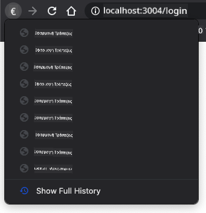

<!--
CO_OP_TRANSLATOR_METADATA:
{
  "original_hash": "8a07db14e75ac62f013b7de5df05981d",
  "translation_date": "2025-08-29T07:03:55+00:00",
  "source_file": "7-bank-project/1-template-route/README.md",
  "language_code": "el"
}
-->
# Δημιουργία Εφαρμογής Τραπεζικής Μέρος 1: HTML Πρότυπα και Διαδρομές σε Μια Εφαρμογή Ιστού

## Κουίζ Πριν το Μάθημα

[Κουίζ πριν το μάθημα](https://ff-quizzes.netlify.app/web/quiz/41)

### Εισαγωγή

Από την εμφάνιση της JavaScript στους περιηγητές, οι ιστοσελίδες γίνονται πιο διαδραστικές και πολύπλοκες από ποτέ. Οι τεχνολογίες ιστού χρησιμοποιούνται πλέον ευρέως για τη δημιουργία πλήρως λειτουργικών εφαρμογών που εκτελούνται απευθείας σε έναν περιηγητή, τις οποίες αποκαλούμε [εφαρμογές ιστού](https://en.wikipedia.org/wiki/Web_application). Καθώς οι εφαρμογές ιστού είναι ιδιαίτερα διαδραστικές, οι χρήστες δεν θέλουν να περιμένουν την πλήρη ανανέωση της σελίδας κάθε φορά που εκτελείται μια ενέργεια. Γι' αυτό η JavaScript χρησιμοποιείται για την άμεση ενημέρωση του HTML μέσω του DOM, προσφέροντας μια πιο ομαλή εμπειρία χρήστη.

Σε αυτό το μάθημα, θα θέσουμε τα θεμέλια για τη δημιουργία μιας τραπεζικής εφαρμογής ιστού, χρησιμοποιώντας HTML πρότυπα για τη δημιουργία πολλαπλών οθονών που μπορούν να εμφανίζονται και να ενημερώνονται χωρίς να χρειάζεται να ανανεωθεί ολόκληρη η HTML σελίδα.

### Προαπαιτούμενα

Χρειάζεστε έναν τοπικό διακομιστή ιστού για να δοκιμάσετε την εφαρμογή ιστού που θα δημιουργήσουμε σε αυτό το μάθημα. Αν δεν έχετε, μπορείτε να εγκαταστήσετε το [Node.js](https://nodejs.org) και να χρησιμοποιήσετε την εντολή `npx lite-server` από τον φάκελο του έργου σας. Αυτό θα δημιουργήσει έναν τοπικό διακομιστή ιστού και θα ανοίξει την εφαρμογή σας σε έναν περιηγητή.

### Προετοιμασία

Στον υπολογιστή σας, δημιουργήστε έναν φάκελο με όνομα `bank` και ένα αρχείο με όνομα `index.html` μέσα σε αυτόν. Θα ξεκινήσουμε από αυτό το [βασικό HTML πρότυπο](https://en.wikipedia.org/wiki/Boilerplate_code):

```html
<!DOCTYPE html>
<html lang="en">
  <head>
    <meta charset="UTF-8">
    <meta name="viewport" content="width=device-width, initial-scale=1.0">
    <title>Bank App</title>
  </head>
  <body>
    <!-- This is where you'll work -->
  </body>
</html>
```

---

## HTML Πρότυπα

Αν θέλετε να δημιουργήσετε πολλαπλές οθόνες για μια ιστοσελίδα, μια λύση θα ήταν να δημιουργήσετε ένα αρχείο HTML για κάθε οθόνη που θέλετε να εμφανίσετε. Ωστόσο, αυτή η λύση έχει κάποιες δυσκολίες:

- Πρέπει να ανανεώνετε ολόκληρη την HTML όταν αλλάζετε οθόνη, κάτι που μπορεί να είναι αργό.
- Είναι δύσκολο να μοιράζεστε δεδομένα μεταξύ των διαφορετικών οθονών.

Μια άλλη προσέγγιση είναι να έχετε μόνο ένα αρχείο HTML και να ορίσετε πολλαπλά [HTML πρότυπα](https://developer.mozilla.org/docs/Web/HTML/Element/template) χρησιμοποιώντας το στοιχείο `<template>`. Ένα πρότυπο είναι ένα επαναχρησιμοποιήσιμο μπλοκ HTML που δεν εμφανίζεται από τον περιηγητή και πρέπει να δημιουργηθεί κατά την εκτέλεση μέσω JavaScript.

### Εργασία

Θα δημιουργήσουμε μια τραπεζική εφαρμογή με δύο οθόνες: τη σελίδα σύνδεσης και τον πίνακα ελέγχου. Αρχικά, ας προσθέσουμε στο σώμα του HTML ένα στοιχείο κράτησης θέσης που θα χρησιμοποιήσουμε για να δημιουργήσουμε τις διαφορετικές οθόνες της εφαρμογής μας:

```html
<div id="app">Loading...</div>
```

Δίνουμε ένα `id` για να είναι πιο εύκολο να το εντοπίσουμε με τη JavaScript αργότερα.

> Συμβουλή: Επειδή το περιεχόμενο αυτού του στοιχείου θα αντικατασταθεί, μπορούμε να βάλουμε ένα μήνυμα ή δείκτη φόρτωσης που θα εμφανίζεται όσο η εφαρμογή φορτώνει.

Στη συνέχεια, ας προσθέσουμε κάτω από αυτό το HTML πρότυπο για τη σελίδα σύνδεσης. Προς το παρόν, θα βάλουμε μόνο έναν τίτλο και μια ενότητα που περιέχει έναν σύνδεσμο που θα χρησιμοποιήσουμε για την πλοήγηση.

```html
<template id="login">
  <h1>Bank App</h1>
  <section>
    <a href="/dashboard">Login</a>
  </section>
</template>
```

Έπειτα, θα προσθέσουμε ένα άλλο HTML πρότυπο για τη σελίδα του πίνακα ελέγχου. Αυτή η σελίδα θα περιέχει διαφορετικές ενότητες:

- Μια κεφαλίδα με έναν τίτλο και έναν σύνδεσμο αποσύνδεσης
- Το τρέχον υπόλοιπο του τραπεζικού λογαριασμού
- Μια λίστα συναλλαγών, που εμφανίζεται σε έναν πίνακα

```html
<template id="dashboard">
  <header>
    <h1>Bank App</h1>
    <a href="/login">Logout</a>
  </header>
  <section>
    Balance: 100$
  </section>
  <section>
    <h2>Transactions</h2>
    <table>
      <thead>
        <tr>
          <th>Date</th>
          <th>Object</th>
          <th>Amount</th>
        </tr>
      </thead>
      <tbody></tbody>
    </table>
  </section>
</template>
```

> Συμβουλή: Όταν δημιουργείτε HTML πρότυπα, αν θέλετε να δείτε πώς θα φαίνονται, μπορείτε να σχολιάσετε τις γραμμές `<template>` και `</template>` περικλείοντάς τις με `<!-- -->`.

✅ Γιατί πιστεύετε ότι χρησιμοποιούμε `id` χαρακτηριστικά στα πρότυπα; Θα μπορούσαμε να χρησιμοποιήσουμε κάτι άλλο, όπως κλάσεις;

## Εμφάνιση Προτύπων με JavaScript

Αν δοκιμάσετε το τρέχον αρχείο HTML σε έναν περιηγητή, θα δείτε ότι μένει κολλημένο στο μήνυμα `Loading...`. Αυτό συμβαίνει επειδή πρέπει να προσθέσουμε κάποιον κώδικα JavaScript για να δημιουργήσουμε και να εμφανίσουμε τα HTML πρότυπα.

Η δημιουργία ενός προτύπου γίνεται συνήθως σε 3 βήματα:

1. Εντοπισμός του στοιχείου προτύπου στο DOM, για παράδειγμα χρησιμοποιώντας [`document.getElementById`](https://developer.mozilla.org/docs/Web/API/Document/getElementById).
2. Κλωνοποίηση του στοιχείου προτύπου, χρησιμοποιώντας [`cloneNode`](https://developer.mozilla.org/docs/Web/API/Node/cloneNode).
3. Επισύναψη του στο DOM κάτω από ένα ορατό στοιχείο, για παράδειγμα χρησιμοποιώντας [`appendChild`](https://developer.mozilla.org/docs/Web/API/Node/appendChild).

✅ Γιατί πρέπει να κλωνοποιήσουμε το πρότυπο πριν το επισυνάψουμε στο DOM; Τι πιστεύετε ότι θα συνέβαινε αν παραλείπαμε αυτό το βήμα;

### Εργασία

Δημιουργήστε ένα νέο αρχείο με όνομα `app.js` στον φάκελο του έργου σας και εισάγετε αυτό το αρχείο στην ενότητα `<head>` του HTML:

```html
<script src="app.js" defer></script>
```

Τώρα, στο `app.js`, θα δημιουργήσουμε μια νέα συνάρτηση `updateRoute`:

```js
function updateRoute(templateId) {
  const template = document.getElementById(templateId);
  const view = template.content.cloneNode(true);
  const app = document.getElementById('app');
  app.innerHTML = '';
  app.appendChild(view);
}
```

Αυτό που κάνουμε εδώ είναι ακριβώς τα 3 βήματα που περιγράφηκαν παραπάνω. Δημιουργούμε το πρότυπο με το `id` `templateId` και τοποθετούμε το κλωνοποιημένο περιεχόμενό του μέσα στο στοιχείο κράτησης θέσης της εφαρμογής μας. Σημειώστε ότι πρέπει να χρησιμοποιήσουμε `cloneNode(true)` για να αντιγράψουμε ολόκληρο το υποδέντρο του προτύπου.

Τώρα καλέστε αυτή τη συνάρτηση με ένα από τα πρότυπα και δείτε το αποτέλεσμα.

```js
updateRoute('login');
```

✅ Ποιος είναι ο σκοπός αυτού του κώδικα `app.innerHTML = '';`; Τι συμβαίνει χωρίς αυτό;

## Δημιουργία Διαδρομών

Όταν μιλάμε για μια εφαρμογή ιστού, ονομάζουμε *Δρομολόγηση* την πρόθεση να αντιστοιχίσουμε **URLs** σε συγκεκριμένες οθόνες που πρέπει να εμφανιστούν. Σε έναν ιστότοπο με πολλαπλά αρχεία HTML, αυτό γίνεται αυτόματα καθώς τα μονοπάτια των αρχείων αντικατοπτρίζονται στο URL. Για παράδειγμα, με αυτά τα αρχεία στον φάκελο του έργου σας:

```
mywebsite/index.html
mywebsite/login.html
mywebsite/admin/index.html
```

Αν δημιουργήσετε έναν διακομιστή ιστού με ρίζα το `mywebsite`, η αντιστοίχιση URL θα είναι:

```
https://site.com            --> mywebsite/index.html
https://site.com/login.html --> mywebsite/login.html
https://site.com/admin/     --> mywebsite/admin/index.html
```

Ωστόσο, για την εφαρμογή ιστού μας χρησιμοποιούμε ένα μόνο αρχείο HTML που περιέχει όλες τις οθόνες, οπότε αυτή η προεπιλεγμένη συμπεριφορά δεν θα μας βοηθήσει. Πρέπει να δημιουργήσουμε αυτόν τον χάρτη χειροκίνητα και να ενημερώσουμε το εμφανιζόμενο πρότυπο χρησιμοποιώντας JavaScript.

### Εργασία

Θα χρησιμοποιήσουμε ένα απλό αντικείμενο για να υλοποιήσουμε έναν [χάρτη](https://en.wikipedia.org/wiki/Associative_array) μεταξύ μονοπατιών URL και των προτύπων μας. Προσθέστε αυτό το αντικείμενο στην κορυφή του αρχείου `app.js` σας.

```js
const routes = {
  '/login': { templateId: 'login' },
  '/dashboard': { templateId: 'dashboard' },
};
```

Τώρα ας τροποποιήσουμε λίγο τη συνάρτηση `updateRoute`. Αντί να περνάμε απευθείας το `templateId` ως όρισμα, θέλουμε να το ανακτήσουμε πρώτα κοιτάζοντας το τρέχον URL και στη συνέχεια να χρησιμοποιήσουμε τον χάρτη μας για να πάρουμε την αντίστοιχη τιμή `templateId`. Μπορούμε να χρησιμοποιήσουμε το [`window.location.pathname`](https://developer.mozilla.org/docs/Web/API/Location/pathname) για να πάρουμε μόνο το τμήμα της διαδρομής από το URL.

```js
function updateRoute() {
  const path = window.location.pathname;
  const route = routes[path];

  const template = document.getElementById(route.templateId);
  const view = template.content.cloneNode(true);
  const app = document.getElementById('app');
  app.innerHTML = '';
  app.appendChild(view);
}
```

Εδώ αντιστοιχίσαμε τις διαδρομές που δηλώσαμε στο αντίστοιχο πρότυπο. Μπορείτε να δοκιμάσετε ότι λειτουργεί σωστά αλλάζοντας το URL χειροκίνητα στον περιηγητή σας.

✅ Τι συμβαίνει αν εισάγετε μια άγνωστη διαδρομή στο URL; Πώς θα μπορούσαμε να λύσουμε αυτό το πρόβλημα;

## Προσθήκη Πλοήγησης

Το επόμενο βήμα για την εφαρμογή μας είναι να προσθέσουμε τη δυνατότητα πλοήγησης μεταξύ των σελίδων χωρίς να χρειάζεται να αλλάζουμε το URL χειροκίνητα. Αυτό συνεπάγεται δύο πράγματα:

1. Ενημέρωση του τρέχοντος URL
2. Ενημέρωση του εμφανιζόμενου προτύπου με βάση το νέο URL

Έχουμε ήδη φροντίσει το δεύτερο μέρος με τη συνάρτηση `updateRoute`, οπότε πρέπει να βρούμε πώς να ενημερώσουμε το τρέχον URL.

Θα χρειαστεί να χρησιμοποιήσουμε JavaScript και πιο συγκεκριμένα το [`history.pushState`](https://developer.mozilla.org/docs/Web/API/History/pushState), που επιτρέπει την ενημέρωση του URL και τη δημιουργία μιας νέας καταχώρησης στο ιστορικό περιήγησης, χωρίς να ανανεώνεται το HTML.

> Σημείωση: Ενώ το στοιχείο αγκύρωσης HTML [`<a href>`](https://developer.mozilla.org/docs/Web/HTML/Element/a) μπορεί να χρησιμοποιηθεί από μόνο του για τη δημιουργία υπερσυνδέσμων σε διαφορετικά URLs, θα κάνει τον περιηγητή να ανανεώσει το HTML από προεπιλογή. Είναι απαραίτητο να αποτρέψουμε αυτή τη συμπεριφορά όταν χειριζόμαστε τη δρομολόγηση με προσαρμοσμένη JavaScript, χρησιμοποιώντας τη συνάρτηση `preventDefault()` στο συμβάν κλικ.

### Εργασία

Ας δημιουργήσουμε μια νέα συνάρτηση που μπορούμε να χρησιμοποιήσουμε για την πλοήγηση στην εφαρμογή μας:

```js
function navigate(path) {
  window.history.pushState({}, path, path);
  updateRoute();
}
```

Αυτή η μέθοδος πρώτα ενημερώνει το τρέχον URL με βάση τη δοθείσα διαδρομή και στη συνέχεια ενημερώνει το πρότυπο. Η ιδιότητα `window.location.origin` επιστρέφει τη ρίζα του URL, επιτρέποντάς μας να ανακατασκευάσουμε ένα πλήρες URL από μια δοθείσα διαδρομή.

Τώρα που έχουμε αυτή τη συνάρτηση, μπορούμε να αντιμετωπίσουμε το πρόβλημα που έχουμε αν μια διαδρομή δεν αντιστοιχεί σε καμία καθορισμένη διαδρομή. Θα τροποποιήσουμε τη συνάρτηση `updateRoute` προσθέτοντας μια εναλλακτική λύση σε μία από τις υπάρχουσες διαδρομές αν δεν μπορούμε να βρούμε αντιστοιχία.

```js
function updateRoute() {
  const path = window.location.pathname;
  const route = routes[path];

  if (!route) {
    return navigate('/login');
  }

  ...
```

Αν δεν μπορεί να βρεθεί διαδρομή, τώρα θα ανακατευθυνθούμε στη σελίδα `login`.

Ας δημιουργήσουμε μια συνάρτηση για να πάρουμε το URL όταν γίνεται κλικ σε έναν σύνδεσμο και να αποτρέψουμε την προεπιλεγμένη συμπεριφορά του περιηγητή για τους συνδέσμους:

```js
function onLinkClick(event) {
  event.preventDefault();
  navigate(event.target.href);
}
```

Ας ολοκληρώσουμε το σύστημα πλοήγησης προσθέτοντας συνδέσεις στις συνδέσεις *Login* και *Logout* στο HTML.

```html
<a href="/dashboard" onclick="onLinkClick(event)">Login</a>
...
<a href="/login" onclick="onLinkClick(event)">Logout</a>
```

Το αντικείμενο `event` παραπάνω, καταγράφει το συμβάν `click` και το περνά στη συνάρτηση `onLinkClick`.

Χρησιμοποιώντας το χαρακτηριστικό [`onclick`](https://developer.mozilla.org/docs/Web/API/GlobalEventHandlers/onclick), συνδέστε το συμβάν `click` με κώδικα JavaScript, εδώ την κλήση της συνάρτησης `navigate()`.

Δοκιμάστε να κάνετε κλικ σε αυτούς τους συνδέσμους, τώρα θα πρέπει να μπορείτε να πλοηγηθείτε μεταξύ των διαφορετικών οθονών της εφαρμογής σας.

✅ Η μέθοδος `history.pushState` είναι μέρος του προτύπου HTML5 και υλοποιείται σε [όλους τους σύγχρονους περιηγητές](https://caniuse.com/?search=pushState). Αν δημιουργείτε μια εφαρμογή ιστού για παλαιότερους περιηγητές, υπάρχει ένα τέχνασμα που μπορείτε να χρησιμοποιήσετε αντί αυτής της API: χρησιμοποιώντας ένα [hash (`#`)](https://en.wikipedia.org/wiki/URI_fragment) πριν από τη διαδρομή, μπορείτε να υλοποιήσετε δρομολόγηση που λειτουργεί με κανονική πλοήγηση αγκύρωσης και δεν ανανεώνει τη σελίδα, καθώς ο σκοπός του ήταν να δημιουργήσει εσωτερικούς συνδέσμους μέσα σε μια σελίδα.

## Χειρισμός των Κουμπιών Πίσω και Εμπρός του Περιηγητή

Η χρήση του `history.pushState` δημιουργεί νέες καταχωρήσεις στο ιστορικό περιήγησης του περιηγητή. Μπορείτε να το ελέγξετε κρατώντας πατημένο το *κουμπί πίσω* του περιηγητή σας, θα πρέπει να εμφανίζει κάτι σαν αυτό:



Αν δοκιμάσετε να κάνετε κλικ στο κουμπί πίσω μερικές φορές, θα δείτε ότι το τρέχον URL αλλάζει και το ιστορικό ενημερώνεται, αλλά το ίδιο πρότυπο συνεχίζει να εμφανίζεται.

Αυτό συμβαίνει επειδή η εφαρμογή δεν γνωρίζει ότι πρέπει να καλέσουμε τη `updateRoute()` κάθε φορά που αλλάζει το ιστορικό. Αν κοιτάξετε την [τεκμηρίωση του `history.pushState`](https://developer.mozilla.org/docs/Web/API/History/pushState), μπορείτε να δείτε ότι αν αλλάξει η κατάσταση - που σημαίνει ότι μετακινηθήκαμε σε διαφορετικό URL - το συμβάν [`popstate`](https://developer.mozilla.org/docs/Web/API/Window/popstate_event) ενεργοποιείται. Θα το χρησιμοποιήσουμε για να διορθώσουμε αυτό το πρόβλημα.

### Εργασία

Για να διασφαλίσουμε ότι το εμφανιζόμενο πρότυπο ενημερώνεται όταν αλλάζει το ιστορικό του περιηγητή, θα επισυνάψουμε μια νέα συνάρτηση που καλεί τη `updateRoute()`. Θα το κάνουμε στο τέλος του αρχείου `app.js`:

```js
window.onpopstate = () => updateRoute();
updateRoute();
```

> Σημείωση: Χρησιμοποιήσαμε μια [συνάρτηση βέλους](https://developer.mozilla.org/docs/Web/JavaScript/Reference/Functions/Arrow_functions) εδώ για να δηλώσουμε τον χειριστή συμβάντων `popstate` για συντομία, αλλά μια κανονική συνάρτηση θα λειτουργούσε το ίδιο.

Εδώ είναι ένα βίντεο ανασκόπησης για τις συναρτήσεις βέλους:

[](https://youtube.com/watch?v=OP6eEbOj2sc "Συναρτήσεις Βέλους")

> 🎥 Κάντε κλικ στην εικόνα παραπάνω για ένα βίντεο σχετικά με τις συναρτήσεις βέλους.

Τώρα δοκιμάστε να χρησιμοποιήσετε τα κουμπιά πίσω και εμπρός του περιηγητή σας και ελέγξτε ότι η εμφανιζόμενη διαδρομή ενημερώνεται σωστά αυτή τη φορά.

---

## 🚀 Πρόκληση

Προσθέστε ένα νέο πρότυπο και διαδρομή για μια τρίτη σελίδα που εμφανίζει τα credits αυτής της εφαρμογής.

## Κουίζ Μετά το Μάθημα

[Κουίζ μετά το μάθημα](https://ff-quizzes.netlify.app/web/quiz/42)

## Ανασκόπηση & Αυτομελέτη

Η δρομολόγηση είναι ένα από τα εκπληκτικά δύσκολα μέρη της ανάπτυξης ιστού, ειδικά καθώς ο ιστός μετακινείται από συμπερι

---

**Αποποίηση Ευθύνης**:  
Αυτό το έγγραφο έχει μεταφραστεί χρησιμοποιώντας την υπηρεσία αυτόματης μετάφρασης [Co-op Translator](https://github.com/Azure/co-op-translator). Παρόλο που καταβάλλουμε προσπάθειες για ακρίβεια, παρακαλούμε να έχετε υπόψη ότι οι αυτόματες μεταφράσεις ενδέχεται να περιέχουν λάθη ή ανακρίβειες. Το πρωτότυπο έγγραφο στη μητρική του γλώσσα θα πρέπει να θεωρείται η αυθεντική πηγή. Για κρίσιμες πληροφορίες, συνιστάται επαγγελματική ανθρώπινη μετάφραση. Δεν φέρουμε ευθύνη για τυχόν παρεξηγήσεις ή εσφαλμένες ερμηνείες που προκύπτουν από τη χρήση αυτής της μετάφρασης.