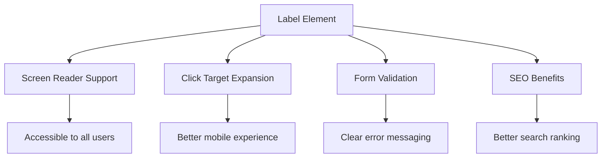
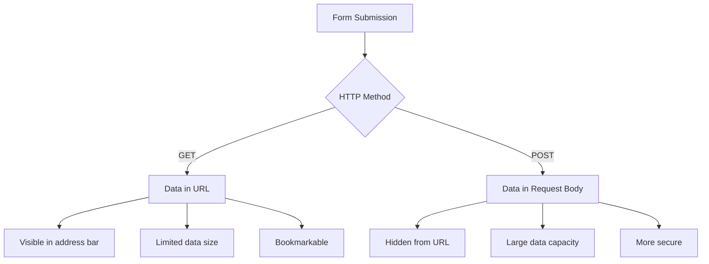
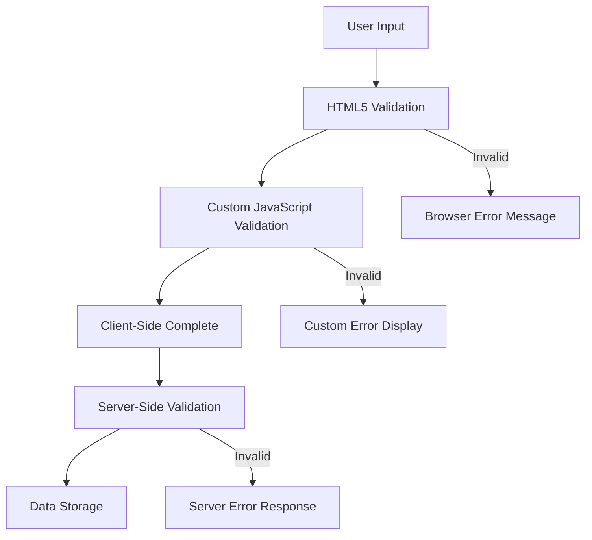
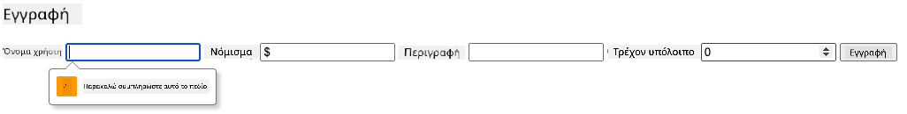
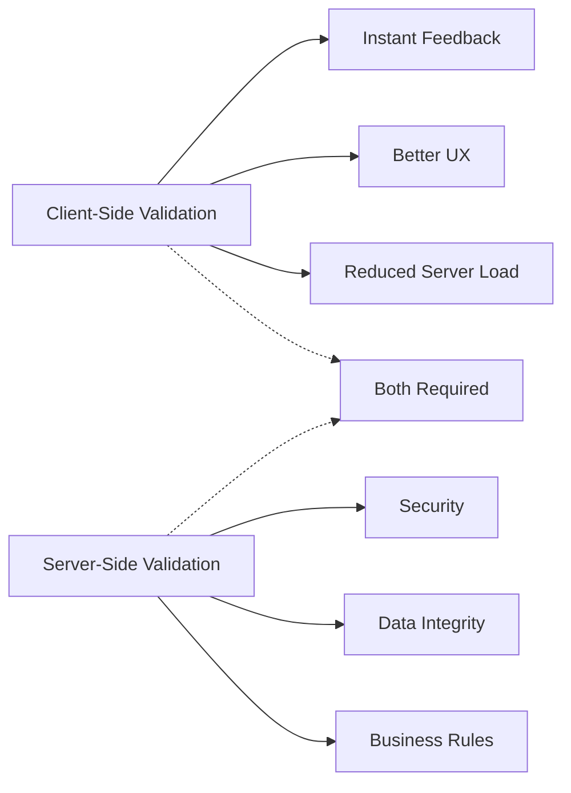
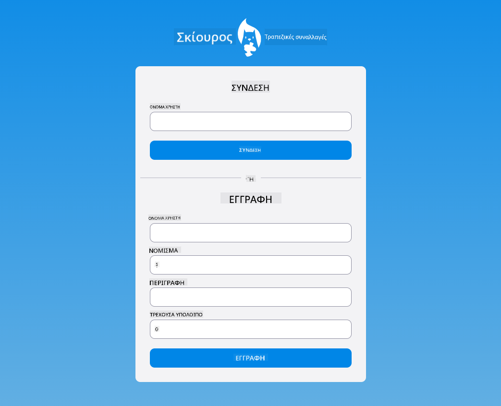

<!--
CO_OP_TRANSLATOR_METADATA:
{
  "original_hash": "b24f28fc46dd473aa9080f174182adde",
  "translation_date": "2025-10-23T20:27:22+00:00",
  "source_file": "7-bank-project/2-forms/README.md",
  "language_code": "el"
}
-->
# Δημιουργία Εφαρμογής Τραπεζικής Μέρος 2: Δημιουργία Φόρμας Εισόδου και Εγγραφής

## Ερωτηματολόγιο Πριν το Μάθημα

[Ερωτηματολόγιο πριν το μάθημα](https://ff-quizzes.netlify.app/web/quiz/43)

Έχετε συμπληρώσει ποτέ μια φόρμα online και σας έχει απορρίψει τη μορφή του email σας; Ή έχετε χάσει όλες τις πληροφορίες σας όταν πατήσατε υποβολή; Όλοι έχουμε αντιμετωπίσει αυτές τις απογοητευτικές εμπειρίες.

Οι φόρμες είναι η γέφυρα μεταξύ των χρηστών σας και της λειτουργικότητας της εφαρμογής σας. Όπως τα προσεκτικά πρωτόκολλα που χρησιμοποιούν οι ελεγκτές εναέριας κυκλοφορίας για να καθοδηγήσουν τα αεροπλάνα με ασφάλεια στον προορισμό τους, οι καλά σχεδιασμένες φόρμες παρέχουν σαφή ανατροφοδότηση και αποτρέπουν δαπανηρά λάθη. Κακές φόρμες, από την άλλη, μπορούν να διώξουν τους χρήστες πιο γρήγορα από μια παρεξήγηση σε ένα πολυσύχναστο αεροδρόμιο.

Σε αυτό το μάθημα, θα μετατρέψουμε την στατική τραπεζική σας εφαρμογή σε μια διαδραστική εφαρμογή. Θα μάθετε να δημιουργείτε φόρμες που επικυρώνουν την εισαγωγή δεδομένων από τους χρήστες, επικοινωνούν με τους διακομιστές και παρέχουν χρήσιμη ανατροφοδότηση. Σκεφτείτε το σαν να δημιουργείτε τη διεπαφή ελέγχου που επιτρέπει στους χρήστες να πλοηγούνται στις λειτουργίες της εφαρμογής σας.

Στο τέλος, θα έχετε ένα πλήρες σύστημα εισόδου και εγγραφής με επικύρωση που καθοδηγεί τους χρήστες προς την επιτυχία αντί για την απογοήτευση.

## Προαπαιτούμενα

Πριν ξεκινήσουμε να δημιουργούμε φόρμες, ας βεβαιωθούμε ότι έχετε όλα όσα χρειάζονται. Αυτό το μάθημα συνεχίζει από εκεί που σταματήσαμε στο προηγούμενο, οπότε αν το παραλείψατε, ίσως θέλετε να επιστρέψετε και να εξασφαλίσετε ότι έχετε ρυθμίσει τα βασικά πρώτα.

### Απαιτούμενη Ρύθμιση

| Συστατικό | Κατάσταση | Περιγραφή |
|-----------|-----------|-----------|
| [HTML Templates](../1-template-route/README.md) | ✅ Απαιτείται | Η βασική δομή της τραπεζικής σας εφαρμογής |
| [Node.js](https://nodejs.org) | ✅ Απαιτείται | Περιβάλλον εκτέλεσης JavaScript για τον διακομιστή |
| [Bank API Server](../api/README.md) | ✅ Απαιτείται | Υπηρεσία backend για αποθήκευση δεδομένων |

> 💡 **Συμβουλή Ανάπτυξης**: Θα εκτελείτε δύο ξεχωριστούς διακομιστές ταυτόχρονα – έναν για την τραπεζική εφαρμογή στο front-end και έναν για το backend API. Αυτή η ρύθμιση αντικατοπτρίζει την πραγματική ανάπτυξη όπου οι υπηρεσίες του front-end και του backend λειτουργούν ανεξάρτητα.

### Ρύθμιση Διακομιστή

**Το περιβάλλον ανάπτυξής σας θα περιλαμβάνει:**
- **Διακομιστή front-end**: Εξυπηρετεί την τραπεζική σας εφαρμογή (συνήθως στη θύρα `3000`)
- **Διακομιστή API backend**: Χειρίζεται την αποθήκευση και την ανάκτηση δεδομένων (θύρα `5000`)
- **Και οι δύο διακομιστές** μπορούν να λειτουργούν ταυτόχρονα χωρίς συγκρούσεις

**Δοκιμή της σύνδεσης με το API:**
```bash
curl http://localhost:5000/api
# Expected response: "Bank API v1.0.0"
```

**Αν δείτε την απάντηση της έκδοσης του API, είστε έτοιμοι να προχωρήσετε!**

---

## Κατανόηση των Φορμών και των Ελέγχων HTML

Οι φόρμες HTML είναι ο τρόπος με τον οποίο οι χρήστες επικοινωνούν με την εφαρμογή σας. Σκεφτείτε τις σαν το σύστημα τηλεγράφου που συνέδεε απομακρυσμένα μέρη τον 19ο αιώνα – είναι το πρωτόκολλο επικοινωνίας μεταξύ της πρόθεσης του χρήστη και της απόκρισης της εφαρμογής. Όταν σχεδιάζονται προσεκτικά, εντοπίζουν λάθη, καθοδηγούν τη μορφοποίηση εισόδου και παρέχουν χρήσιμες προτάσεις.

Οι σύγχρονες φόρμες είναι σημαντικά πιο εξελιγμένες από τις βασικές εισόδους κειμένου. Το HTML5 εισήγαγε εξειδικευμένους τύπους εισόδου που χειρίζονται αυτόματα την επικύρωση email, τη μορφοποίηση αριθμών και την επιλογή ημερομηνίας. Αυτές οι βελτιώσεις ωφελούν τόσο την προσβασιμότητα όσο και την εμπειρία των χρηστών κινητών.

### Βασικά Στοιχεία Φόρμας

**Βασικά στοιχεία που χρειάζεται κάθε φόρμα:**

```html
<!-- Basic form structure -->
<form id="userForm" method="POST">
  <label for="username">Username</label>
  <input id="username" name="username" type="text" required>
  
  <button type="submit">Submit</button>
</form>
```

**Τι κάνει αυτός ο κώδικας:**
- **Δημιουργεί** ένα κοντέινερ φόρμας με μοναδικό αναγνωριστικό
- **Καθορίζει** τη μέθοδο HTTP για την υποβολή δεδομένων
- **Συνδέει** ετικέτες με εισόδους για προσβασιμότητα
- **Ορίζει** ένα κουμπί υποβολής για την επεξεργασία της φόρμας

### Σύγχρονοι Τύποι Εισόδου και Ιδιότητες

| Τύπος Εισόδου | Σκοπός | Παράδειγμα Χρήσης |
|---------------|--------|-------------------|
| `text` | Γενική εισαγωγή κειμένου | `<input type="text" name="username">` |
| `email` | Επικύρωση email | `<input type="email" name="email">` |
| `password` | Κρυφή εισαγωγή κειμένου | `<input type="password" name="password">` |
| `number` | Εισαγωγή αριθμών | `<input type="number" name="balance" min="0">` |
| `tel` | Τηλεφωνικοί αριθμοί | `<input type="tel" name="phone">` |

> 💡 **Πλεονέκτημα Σύγχρονου HTML5**: Η χρήση συγκεκριμένων τύπων εισόδου παρέχει αυτόματη επικύρωση, κατάλληλα πληκτρολόγια για κινητά και καλύτερη υποστήριξη προσβασιμότητας χωρίς επιπλέον JavaScript!

### Τύποι Κουμπιών και Συμπεριφορά

```html
<!-- Different button behaviors -->
<button type="submit">Save Data</button>     <!-- Submits the form -->
<button type="reset">Clear Form</button>    <!-- Resets all fields -->
<button type="button">Custom Action</button> <!-- No default behavior -->
```

**Τι κάνει κάθε τύπος κουμπιού:**
- **Κουμπιά υποβολής**: Ενεργοποιούν την υποβολή της φόρμας και στέλνουν δεδομένα στο καθορισμένο endpoint
- **Κουμπιά επαναφοράς**: Επαναφέρουν όλα τα πεδία της φόρμας στην αρχική τους κατάσταση
- **Κανονικά κουμπιά**: Δεν παρέχουν προεπιλεγμένη συμπεριφορά, απαιτώντας προσαρμοσμένη λειτουργικότητα με JavaScript

> ⚠️ **Σημαντική Σημείωση**: Το στοιχείο `<input>` είναι αυτοκλειόμενο και δεν απαιτεί ετικέτα κλεισίματος. Η σύγχρονη βέλτιστη πρακτική είναι να γράφετε `<input>` χωρίς την κάθετο.

### Δημιουργία Φόρμας Εισόδου

Ας δημιουργήσουμε τώρα μια πρακτική φόρμα εισόδου που δείχνει τις σύγχρονες πρακτικές HTML φόρμας. Θα ξεκινήσουμε με μια βασική δομή και θα την βελτιώσουμε σταδιακά με χαρακτηριστικά προσβασιμότητας και επικύρωσης.

```html
<template id="login">
  <h1>Bank App</h1>
  <section>
    <h2>Login</h2>
    <form id="loginForm" novalidate>
      <div class="form-group">
        <label for="username">Username</label>
        <input id="username" name="user" type="text" required 
               autocomplete="username" placeholder="Enter your username">
      </div>
      <button type="submit">Login</button>
    </form>
  </section>
</template>
```

**Ανάλυση του τι συμβαίνει εδώ:**
- **Δομεί** τη φόρμα με σημασιολογικά στοιχεία HTML5
- **Ομαδοποιεί** σχετικά στοιχεία χρησιμοποιώντας κοντέινερ `div` με ουσιαστικές κλάσεις
- **Συνδέει** ετικέτες με εισόδους χρησιμοποιώντας τις ιδιότητες `for` και `id`
- **Περιλαμβάνει** σύγχρονες ιδιότητες όπως `autocomplete` και `placeholder` για καλύτερη εμπειρία χρήστη
- **Προσθέτει** `novalidate` για να χειριστεί την επικύρωση με JavaScript αντί για τις προεπιλογές του προγράμματος περιήγησης

### Η Δύναμη των Σωστών Ετικετών

**Γιατί οι ετικέτες είναι σημαντικές για τη σύγχρονη ανάπτυξη ιστού:**



**Τι επιτυγχάνουν οι σωστές ετικέτες:**
- **Επιτρέπουν** στους αναγνώστες οθόνης να ανακοινώνουν τα πεδία της φόρμας με σαφήνεια
- **Επεκτείνουν** την περιοχή κλικ (κλικ στην ετικέτα εστιάζει στην είσοδο)
- **Βελτιώνουν** τη χρηστικότητα σε κινητά με μεγαλύτερους στόχους αφής
- **Υποστηρίζουν** την επικύρωση της φόρμας με ουσιαστικά μηνύματα σφάλματος
- **Ενισχύουν** το SEO παρέχοντας σημασιολογική σημασία στα στοιχεία της φόρμας

> 🎯 **Στόχος Προσβασιμότητας**: Κάθε είσοδος φόρμας πρέπει να έχει μια συνδεδεμένη ετικέτα. Αυτή η απλή πρακτική κάνει τις φόρμες σας προσβάσιμες σε όλους, συμπεριλαμβανομένων των χρηστών με αναπηρίες, και βελτιώνει την εμπειρία για όλους τους χρήστες.

### Δημιουργία Φόρμας Εγγραφής

Η φόρμα εγγραφής απαιτεί πιο λεπτομερείς πληροφορίες για τη δημιουργία ενός πλήρους λογαριασμού χρήστη. Ας την κατασκευάσουμε με σύγχρονα χαρακτηριστικά HTML5 και βελτιωμένη προσβασιμότητα.

```html
<hr/>
<h2>Register</h2>
<form id="registerForm" novalidate>
  <div class="form-group">
    <label for="user">Username</label>
    <input id="user" name="user" type="text" required 
           autocomplete="username" placeholder="Choose a username">
  </div>
  
  <div class="form-group">
    <label for="currency">Currency</label>
    <input id="currency" name="currency" type="text" value="$" 
           required maxlength="3" placeholder="USD, EUR, etc.">
  </div>
  
  <div class="form-group">
    <label for="description">Account Description</label>
    <input id="description" name="description" type="text" 
           maxlength="100" placeholder="Personal savings, checking, etc.">
  </div>
  
  <div class="form-group">
    <label for="balance">Starting Balance</label>
    <input id="balance" name="balance" type="number" value="0" 
           min="0" step="0.01" placeholder="0.00">
  </div>
  
  <button type="submit">Create Account</button>
</form>
```

**Στο παραπάνω, έχουμε:**
- **Οργανώσει** κάθε πεδίο σε κοντέινερ div για καλύτερη μορφοποίηση και διάταξη
- **Προσθέσει** κατάλληλες ιδιότητες `autocomplete` για υποστήριξη αυτόματης συμπλήρωσης από το πρόγραμμα περιήγησης
- **Συμπεριλάβει** χρήσιμο κείμενο placeholder για καθοδήγηση της εισαγωγής από τον χρήστη
- **Ορίσει** λογικές προεπιλογές χρησιμοποιώντας την ιδιότητα `value`
- **Εφαρμόσει** ιδιότητες επικύρωσης όπως `required`, `maxlength` και `min`
- **Χρησιμοποιήσει** `type="number"` για το πεδίο ισοζυγίου με υποστήριξη δεκαδικών

### Εξερεύνηση Τύπων Εισόδου και Συμπεριφοράς

**Οι σύγχρονοι τύποι εισόδου παρέχουν βελτιωμένη λειτουργικότητα:**

| Χαρακτηριστικό | Όφελος | Παράδειγμα |
|----------------|--------|-----------|
| `type="number"` | Αριθμητικό πληκτρολόγιο σε κινητά | Εύκολη εισαγωγή ισοζυγίου |
| `step="0.01"` | Έλεγχος ακρίβειας δεκαδικών | Επιτρέπει λεπτομέρειες σε νομίσματα |
| `autocomplete` | Αυτόματη συμπλήρωση από το πρόγραμμα περιήγησης | Γρηγορότερη συμπλήρωση φόρμας |
| `placeholder` | Συμφραζόμενες υποδείξεις | Καθοδηγεί τις προσδοκίες του χρήστη |

> 🎯 **Πρόκληση Προσβασιμότητας**: Δοκιμάστε να πλοηγηθείτε στις φόρμες χρησιμοποιώντας μόνο το πληκτρολόγιό σας! Χρησιμοποιήστε το `Tab` για να μετακινηθείτε μεταξύ των πεδίων, το `Space` για να επιλέξετε κουτάκια και το `Enter` για να υποβάλετε. Αυτή η εμπειρία σας βοηθά να κατανοήσετε πώς οι χρήστες αναγνωστών οθόνης αλληλεπιδρούν με τις φόρμες σας.

## Κατανόηση Μεθόδων Υποβολής Φόρμας

Όταν κάποιος συμπληρώνει τη φόρμα σας και πατάει υποβολή, αυτά τα δεδομένα πρέπει να πάνε κάπου – συνήθως σε έναν διακομιστή που μπορεί να τα αποθηκεύσει. Υπάρχουν μερικοί διαφορετικοί τρόποι με τους οποίους αυτό μπορεί να συμβεί, και η γνώση του ποιον να χρησιμοποιήσετε μπορεί να σας γλιτώσει από κάποιους πονοκεφάλους αργότερα.

Ας δούμε τι πραγματικά συμβαίνει όταν κάποιος πατάει το κουμπί υποβολής.

### Προεπιλεγμένη Συμπεριφορά Φόρμας

Πρώτα, ας παρατηρήσουμε τι συμβαίνει με την βασική υποβολή φόρμας:

**Δοκιμάστε τις τρέχουσες φόρμες σας:**
1. Πατήστε το κουμπί *Εγγραφή* στη φόρμα σας
2. Παρατηρήστε τις αλλαγές στη γραμμή διεύθυνσης του προγράμματος περιήγησης
3. Δείτε πώς η σελίδα ανανεώνεται και τα δεδομένα εμφανίζονται στη διεύθυνση URL


### Σύγκριση Μεθόδων HTTP



**Κατανόηση των διαφορών:**

| Μέθοδος | Περίπτωση Χρήσης | Τοποθεσία Δεδομένων | Επίπεδο Ασφάλειας | Όριο Μεγέθους |
|---------|------------------|---------------------|-------------------|---------------|
| `GET` | Ερωτήματα αναζήτησης, φίλτρα | Παράμετροι URL | Χαμηλό (ορατό) | ~2000 χαρακτήρες |
| `POST` | Λογαριασμοί χρηστών, ευαίσθητα δεδομένα | Σώμα αιτήματος | Υψηλότερο (κρυφό) | Χωρίς πρακτικό όριο |

**Κατανόηση των θεμελιωδών διαφορών:**
- **GET**: Προσθέτει δεδομένα φόρμας στη διεύθυνση URL ως παραμέτρους ερωτήματος (κατάλληλο για λειτουργίες αναζήτησης)
- **POST**: Περιλαμβάνει δεδομένα στο σώμα του αιτήματος (απαραίτητο για ευαίσθητες πληροφορίες)
- **Περιορισμοί GET**: Περιορισμοί μεγέθους, ορατά δεδομένα, επίμονη ιστορία προγράμματος περιήγησης
- **Πλεονεκτήματα POST**: Μεγάλη χωρητικότητα δεδομένων, προστασία ιδιωτικότητας, υποστήριξη μεταφόρτωσης αρχείων

> 💡 **Βέλτιστη Πρακτική**: Χρησιμοποιήστε `GET` για φόρμες αναζήτησης και φίλτρα (ανάκτηση δεδομένων), χρησιμοποιήστε `POST` για εγγραφή χρηστών, είσοδο και δημιουργία δεδομένων.

### Ρύθμιση Υποβολής Φόρμας

Ας ρυθμίσουμε τη φόρμα εγγραφής σας ώστε να επικοινωνεί σωστά με το backend API χρησιμοποιώντας τη μέθοδο POST:

```html
<form id="registerForm" action="//localhost:5000/api/accounts" 
      method="POST" novalidate>
```

**Τι κάνει αυτή η ρύθμιση:**
- **Κατευθύνει** την υποβολή της φόρμας στο endpoint του API σας
- **Χρησιμοποιεί** τη μέθοδο POST για ασφαλή μετάδοση δεδομένων
- **Περιλαμβάνει** `novalidate` για να χειριστεί την επικύρωση με JavaScript

### Δοκιμή Υποβολής Φόρμας

**Ακολουθήστε αυτά τα βήματα για να δοκιμάσετε τη φόρμα σας:**
1. **Συμπληρώστε** τη φόρμα εγγραφής με τις πληροφορίες σας
2. **Πατήστε** το κουμπί "Δημιουργία Λογαριασμού"
3. **Παρατηρήστε** την απάντηση του διακομιστή στο πρόγραμμα περιήγησής σας


**Τι πρέπει να δείτε:**
- **Το πρόγραμμα περιήγησης ανακατευθύνεται** στη διεύθυνση URL του endpoint του API
- **Απάντηση JSON** που περιέχει τα δεδομένα του νέου σας λογαριασμού
- **Παρέχει** λεπτομερή μηνύματα σφάλματος για αποσφαλμάτωση  
- **Επιστρέφει** συνεπή δομή δεδομένων για περιπτώσεις επιτυχίας και σφάλματος  

### Η Δύναμη του Σύγχρονου Fetch API  

**Πλεονεκτήματα του Fetch API σε σχέση με παλαιότερες μεθόδους:**  

| Χαρακτηριστικό | Πλεονέκτημα | Υλοποίηση |  
|----------------|-------------|------------|  
| Βασισμένο σε Promise | Καθαρός ασύγχρονος κώδικας | `await fetch()` |  
| Προσαρμογή αιτήματος | Πλήρης έλεγχος HTTP | Headers, methods, body |  
| Διαχείριση απαντήσεων | Ευέλικτη ανάλυση δεδομένων | `.json()`, `.text()`, `.blob()` |  
| Διαχείριση σφαλμάτων | Πλήρης καταγραφή σφαλμάτων | Try/catch blocks |  

> 🎥 **Μάθετε Περισσότερα**: [Εκμάθηση Async/Await](https://youtube.com/watch?v=YwmlRkrxvkk) - Κατανόηση ασύγχρονων μοτίβων JavaScript για σύγχρονη ανάπτυξη ιστού.  

**Βασικές έννοιες για επικοινωνία με τον server:**  
- **Ασύγχρονες συναρτήσεις** επιτρέπουν την παύση της εκτέλεσης για αναμονή απαντήσεων από τον server  
- **Η λέξη-κλειδί await** κάνει τον ασύγχρονο κώδικα να διαβάζεται σαν συγχρονισμένος  
- **Το Fetch API** παρέχει σύγχρονες, βασισμένες σε promise αιτήσεις HTTP  
- **Η διαχείριση σφαλμάτων** εξασφαλίζει ότι η εφαρμογή σας ανταποκρίνεται ομαλά σε προβλήματα δικτύου  

### Ολοκλήρωση της Συνάρτησης Εγγραφής  

Ας συνδυάσουμε όλα τα στοιχεία με μια πλήρη, έτοιμη για παραγωγή συνάρτηση εγγραφής:  

```javascript
async function register() {
  const registerForm = document.getElementById('registerForm');
  const submitButton = registerForm.querySelector('button[type="submit"]');
  
  try {
    // Show loading state
    submitButton.disabled = true;
    submitButton.textContent = 'Creating Account...';
    
    // Process form data
    const formData = new FormData(registerForm);
    const jsonData = JSON.stringify(Object.fromEntries(formData));
    
    // Send to server
    const result = await createAccount(jsonData);
    
    if (result.error) {
      console.error('Registration failed:', result.error);
      alert(`Registration failed: ${result.error}`);
      return;
    }
    
    console.log('Account created successfully!', result);
    alert(`Welcome, ${result.user}! Your account has been created.`);
    
    // Reset form after successful registration
    registerForm.reset();
    
  } catch (error) {
    console.error('Unexpected error:', error);
    alert('An unexpected error occurred. Please try again.');
  } finally {
    // Restore button state
    submitButton.disabled = false;
    submitButton.textContent = 'Create Account';
  }
}
```
  
**Αυτή η βελτιωμένη υλοποίηση περιλαμβάνει:**  
- **Παρέχει** οπτική ανατροφοδότηση κατά την υποβολή της φόρμας  
- **Απενεργοποιεί** το κουμπί υποβολής για να αποτρέψει διπλές υποβολές  
- **Διαχειρίζεται** τόσο αναμενόμενα όσο και απρόβλεπτα σφάλματα με ευελιξία  
- **Εμφανίζει** φιλικά προς τον χρήστη μηνύματα επιτυχίας και σφάλματος  
- **Επαναφέρει** τη φόρμα μετά από επιτυχημένη εγγραφή  
- **Επαναφέρει** την κατάσταση του UI ανεξαρτήτως αποτελέσματος  

### Δοκιμή της Υλοποίησής σας  

**Ανοίξτε τα εργαλεία προγραμματιστή του προγράμματος περιήγησης και δοκιμάστε την εγγραφή:**  

1. **Ανοίξτε** την κονσόλα του προγράμματος περιήγησης (F12 → καρτέλα Console)  
2. **Συμπληρώστε** τη φόρμα εγγραφής  
3. **Κάντε κλικ** στο "Δημιουργία Λογαριασμού"  
4. **Παρατηρήστε** τα μηνύματα της κονσόλας και την ανατροφοδότηση του χρήστη  

  

**Τι πρέπει να δείτε:**  
- **Κατάσταση φόρτωσης** εμφανίζεται στο κουμπί υποβολής  
- **Καταγραφές κονσόλας** δείχνουν λεπτομερείς πληροφορίες για τη διαδικασία  
- **Μήνυμα επιτυχίας** εμφανίζεται όταν η δημιουργία λογαριασμού ολοκληρωθεί  
- **Η φόρμα επαναφέρεται** αυτόματα μετά από επιτυχημένη υποβολή  

> 🔒 **Σημαντική Σημείωση Ασφαλείας**: Προς το παρόν, τα δεδομένα μεταφέρονται μέσω HTTP, το οποίο δεν είναι ασφαλές για παραγωγή. Σε πραγματικές εφαρμογές, χρησιμοποιείτε πάντα HTTPS για κρυπτογράφηση της μετάδοσης δεδομένων. Μάθετε περισσότερα για την [ασφάλεια HTTPS](https://en.wikipedia.org/wiki/HTTPS) και γιατί είναι απαραίτητη για την προστασία των δεδομένων των χρηστών.  

## Ολοκληρωμένη Επικύρωση Φόρμας  

Η επικύρωση φόρμας αποτρέπει την απογοήτευση των χρηστών από την ανακάλυψη σφαλμάτων μόνο μετά την υποβολή. Όπως τα πολλαπλά συστήματα ασφαλείας στον Διεθνή Διαστημικό Σταθμό, η αποτελεσματική επικύρωση χρησιμοποιεί πολλαπλά επίπεδα ελέγχου.  

Η βέλτιστη προσέγγιση συνδυάζει την επικύρωση σε επίπεδο προγράμματος περιήγησης για άμεση ανατροφοδότηση, την επικύρωση μέσω JavaScript για βελτιωμένη εμπειρία χρήστη και την επικύρωση από τον server για ασφάλεια και ακεραιότητα δεδομένων. Αυτή η πολυεπίπεδη προσέγγιση εξασφαλίζει τόσο την ικανοποίηση του χρήστη όσο και την προστασία του συστήματος.  

### Κατανόηση των Επίπεδων Επικύρωσης  


  
**Στρατηγική πολυεπίπεδης επικύρωσης:**  
- **Επικύρωση HTML5**: Άμεσοι έλεγχοι από το πρόγραμμα περιήγησης  
- **Επικύρωση JavaScript**: Προσαρμοσμένη λογική και εμπειρία χρήστη  
- **Επικύρωση από τον server**: Τελικοί έλεγχοι ασφάλειας και ακεραιότητας δεδομένων  
- **Προοδευτική βελτίωση**: Λειτουργεί ακόμα και αν η JavaScript είναι απενεργοποιημένη  

### Χαρακτηριστικά Επικύρωσης HTML5  

**Σύγχρονα εργαλεία επικύρωσης στη διάθεσή σας:**  

| Χαρακτηριστικό | Σκοπός | Παράδειγμα Χρήσης | Συμπεριφορά Προγράμματος Περιήγησης |  
|----------------|--------|-------------------|-------------------------------------|  
| `required` | Υποχρεωτικά πεδία | `<input required>` | Αποτρέπει την υποβολή κενών πεδίων |  
| `minlength`/`maxlength` | Όρια μήκους κειμένου | `<input maxlength="20">` | Επιβάλλει όρια χαρακτήρων |  
| `min`/`max` | Αριθμητικά όρια | `<input min="0" max="1000">` | Ελέγχει αριθμητικά όρια |  
| `pattern` | Προσαρμοσμένοι κανόνες regex | `<input pattern="[A-Za-z]+">` | Ταιριάζει συγκεκριμένα μοτίβα |  
| `type` | Επικύρωση τύπου δεδομένων | `<input type="email">` | Επικύρωση συγκεκριμένου τύπου |  

### Στυλ Επικύρωσης με CSS  

**Δημιουργήστε οπτική ανατροφοδότηση για καταστάσεις επικύρωσης:**  

```css
/* Valid input styling */
input:valid {
  border-color: #28a745;
  background-color: #f8fff9;
}

/* Invalid input styling */
input:invalid {
  border-color: #dc3545;
  background-color: #fff5f5;
}

/* Focus states for better accessibility */
input:focus:valid {
  box-shadow: 0 0 0 0.2rem rgba(40, 167, 69, 0.25);
}

input:focus:invalid {
  box-shadow: 0 0 0 0.2rem rgba(220, 53, 69, 0.25);
}
```
  
**Τι επιτυγχάνουν αυτά τα οπτικά στοιχεία:**  
- **Πράσινα περιγράμματα**: Υποδεικνύουν επιτυχημένη επικύρωση, όπως πράσινα φώτα στον έλεγχο αποστολής  
- **Κόκκινα περιγράμματα**: Σηματοδοτούν σφάλματα επικύρωσης που χρειάζονται προσοχή  
- **Επισημάνσεις εστίασης**: Παρέχουν σαφές οπτικό πλαίσιο για την τρέχουσα θέση εισόδου  
- **Συνεπής στυλ**: Δημιουργεί προβλέψιμα μοτίβα διεπαφής που μπορούν να μάθουν οι χρήστες  

> 💡 **Χρήσιμη Συμβουλή**: Χρησιμοποιήστε τις ψευδο-κλάσεις CSS `:valid` και `:invalid` για να παρέχετε άμεση οπτική ανατροφοδότηση καθώς οι χρήστες πληκτρολογούν, δημιουργώντας μια ευαίσθητη και χρήσιμη διεπαφή.  

### Υλοποίηση Ολοκληρωμένης Επικύρωσης  

Ας βελτιώσουμε τη φόρμα εγγραφής σας με ισχυρή επικύρωση που προσφέρει εξαιρετική εμπειρία χρήστη και ποιότητα δεδομένων:  

```html
<form id="registerForm" method="POST" novalidate>
  <div class="form-group">
    <label for="user">Username <span class="required">*</span></label>
    <input id="user" name="user" type="text" required 
           minlength="3" maxlength="20" 
           pattern="[a-zA-Z0-9_]+" 
           autocomplete="username"
           title="Username must be 3-20 characters, letters, numbers, and underscores only">
    <small class="form-text">Choose a unique username (3-20 characters)</small>
  </div>
  
  <div class="form-group">
    <label for="currency">Currency <span class="required">*</span></label>
    <input id="currency" name="currency" type="text" required 
           value="$" maxlength="3" 
           pattern="[A-Z$€£¥₹]+" 
           title="Enter a valid currency symbol or code">
    <small class="form-text">Currency symbol (e.g., $, €, £)</small>
  </div>
  
  <div class="form-group">
    <label for="description">Account Description</label>
    <input id="description" name="description" type="text" 
           maxlength="100" 
           placeholder="Personal savings, checking, etc.">
    <small class="form-text">Optional description (up to 100 characters)</small>
  </div>
  
  <div class="form-group">
    <label for="balance">Starting Balance</label>
    <input id="balance" name="balance" type="number" 
           value="0" min="0" step="0.01" 
           title="Enter a positive number for your starting balance">
    <small class="form-text">Initial account balance (minimum $0.00)</small>
  </div>
  
  <button type="submit">Create Account</button>
</form>
```
  
**Κατανόηση της βελτιωμένης επικύρωσης:**  
- **Συνδυάζει** δείκτες υποχρεωτικών πεδίων με χρήσιμες περιγραφές  
- **Περιλαμβάνει** χαρακτηριστικά `pattern` για επικύρωση μορφής  
- **Παρέχει** χαρακτηριστικά `title` για προσβασιμότητα και συμβουλές  
- **Προσθέτει** βοηθητικό κείμενο για καθοδήγηση εισόδου χρήστη  
- **Χρησιμοποιεί** δομή HTML με νόημα για καλύτερη προσβασιμότητα  

### Προχωρημένοι Κανόνες Επικύρωσης  

**Τι επιτυγχάνει κάθε κανόνας επικύρωσης:**  

| Πεδίο | Κανόνες Επικύρωσης | Όφελος Χρήστη |  
|-------|--------------------|---------------|  
| Όνομα χρήστη | `required`, `minlength="3"`, `maxlength="20"`, `pattern="[a-zA-Z0-9_]+"` | Εξασφαλίζει έγκυρους, μοναδικούς αναγνωριστές |  
| Νόμισμα | `required`, `maxlength="3"`, `pattern="[A-Z$€£¥₹]+"` | Δέχεται κοινά σύμβολα νομισμάτων |  
| Υπόλοιπο | `min="0"`, `step="0.01"`, `type="number"` | Αποτρέπει αρνητικά υπόλοιπα |  
| Περιγραφή | `maxlength="100"` | Λογικά όρια μήκους |  

### Δοκιμή Συμπεριφοράς Επικύρωσης  

**Δοκιμάστε αυτά τα σενάρια επικύρωσης:**  
1. **Υποβάλετε** τη φόρμα με κενά υποχρεωτικά πεδία  
2. **Εισάγετε** ένα όνομα χρήστη μικρότερο από 3 χαρακτήρες  
3. **Δοκιμάστε** ειδικούς χαρακτήρες στο πεδίο ονόματος χρήστη  
4. **Εισάγετε** αρνητικό ποσό υπολοίπου  

  

**Τι θα παρατηρήσετε:**  
- **Το πρόγραμμα περιήγησης εμφανίζει** εγγενή μηνύματα επικύρωσης  
- **Οι αλλαγές στυλ** βασίζονται στις καταστάσεις `:valid` και `:invalid`  
- **Η υποβολή φόρμας** αποτρέπεται μέχρι να περάσουν όλες οι επικυρώσεις  
- **Η εστίαση μετακινείται αυτόματα** στο πρώτο μη έγκυρο πεδίο  

### Επικύρωση από Πελάτη vs Επικύρωση από Server  


  
**Γιατί χρειάζεστε και τα δύο επίπεδα:**  
- **Επικύρωση από πελάτη**: Παρέχει άμεση ανατροφοδότηση και βελτιώνει την εμπειρία χρήστη  
- **Επικύρωση από server**: Εξασφαλίζει ασφάλεια και χειρίζεται σύνθετους επιχειρηματικούς κανόνες  
- **Συνδυασμένη προσέγγιση**: Δημιουργεί εφαρμογές φιλικές προς τον χρήστη και ασφαλείς  
- **Προοδευτική βελτίωση**: Λειτουργεί ακόμα και όταν η JavaScript είναι απενεργοποιημένη  

> 🛡️ **Υπενθύμιση Ασφαλείας**: Μην βασίζεστε μόνο στην επικύρωση από πελάτη! Οι κακόβουλοι χρήστες μπορούν να παρακάμψουν τους ελέγχους από τον πελάτη, επομένως η επικύρωση από τον server είναι απαραίτητη για την ασφάλεια και την ακεραιότητα των δεδομένων.  

---  

---

## Πρόκληση GitHub Copilot Agent 🚀  

Χρησιμοποιήστε τη λειτουργία Agent για να ολοκληρώσετε την παρακάτω πρόκληση:  

**Περιγραφή:** Βελτιώστε τη φόρμα εγγραφής με ολοκληρωμένη επικύρωση από πελάτη και ανατροφοδότηση χρήστη. Αυτή η πρόκληση θα σας βοηθήσει να εξασκηθείτε στην επικύρωση φόρμας, τη διαχείριση σφαλμάτων και τη βελτίωση της εμπειρίας χρήστη με διαδραστική ανατροφοδότηση.  

**Εντολή:** Δημιουργήστε ένα πλήρες σύστημα επικύρωσης φόρμας για τη φόρμα εγγραφής που περιλαμβάνει: 1) Ανατροφοδότηση επικύρωσης σε πραγματικό χρόνο για κάθε πεδίο καθώς ο χρήστης πληκτρολογεί, 2) Προσαρμοσμένα μηνύματα επικύρωσης που εμφανίζονται κάτω από κάθε πεδίο εισόδου, 3) Ένα πεδίο επιβεβαίωσης κωδικού πρόσβασης με επικύρωση αντιστοίχισης, 4) Οπτικούς δείκτες (όπως πράσινα σημάδια ελέγχου για έγκυρα πεδία και κόκκινες προειδοποιήσεις για μη έγκυρα), 5) Ένα κουμπί υποβολής που ενεργοποιείται μόνο όταν περάσουν όλες οι επικυρώσεις. Χρησιμοποιήστε χαρακτηριστικά επικύρωσης HTML5, CSS για στυλ των καταστάσεων επικύρωσης και JavaScript για τη διαδραστική συμπεριφορά.  

Μάθετε περισσότερα για τη [λειτουργία agent](https://code.visualstudio.com/blogs/2025/02/24/introducing-copilot-agent-mode) εδώ.  

## 🚀 Πρόκληση  

Εμφανίστε ένα μήνυμα σφάλματος στο HTML αν ο χρήστης υπάρχει ήδη.  

Ακολουθεί ένα παράδειγμα του πώς μπορεί να φαίνεται η τελική σελίδα σύνδεσης μετά από λίγο στυλιζάρισμα:  

  

## Κουίζ μετά το μάθημα  

[Κουίζ μετά το μάθημα](https://ff-quizzes.netlify.app/web/quiz/44)  

## Ανασκόπηση & Αυτοδιδασκαλία  

Οι προγραμματιστές έχουν γίνει πολύ δημιουργικοί όσον αφορά τις προσπάθειες δημιουργίας φορμών, ειδικά σχετικά με στρατηγικές επικύρωσης. Μάθετε για διαφορετικές ροές φορμών κοιτάζοντας το [CodePen](https://codepen.com); μπορείτε να βρείτε ενδιαφέρουσες και εμπνευσμένες φόρμες;  

## Εργασία  

[Στυλιζάρετε την εφαρμογή της τράπεζάς σας](assignment.md)  

---

**Αποποίηση ευθύνης**:  
Αυτό το έγγραφο έχει μεταφραστεί χρησιμοποιώντας την υπηρεσία αυτόματης μετάφρασης [Co-op Translator](https://github.com/Azure/co-op-translator). Παρόλο που καταβάλλουμε προσπάθειες για ακρίβεια, παρακαλούμε να έχετε υπόψη ότι οι αυτόματες μεταφράσεις ενδέχεται να περιέχουν λάθη ή ανακρίβειες. Το πρωτότυπο έγγραφο στη μητρική του γλώσσα θα πρέπει να θεωρείται η αυθεντική πηγή. Για κρίσιμες πληροφορίες, συνιστάται επαγγελματική ανθρώπινη μετάφραση. Δεν φέρουμε ευθύνη για τυχόν παρεξηγήσεις ή εσφαλμένες ερμηνείες που προκύπτουν από τη χρήση αυτής της μετάφρασης.