<!--
CO_OP_TRANSLATOR_METADATA:
{
  "original_hash": "7cbdbd132d39a2bb493e85bc2a9387cc",
  "translation_date": "2026-01-06T20:51:07+00:00",
  "source_file": "7-bank-project/2-forms/README.md",
  "language_code": "el"
}
-->
# Δημιουργία Εφαρμογής Τραπεζικής Μέρους 2: Δημιουργία Φόρμας Σύνδεσης και Εγγραφής

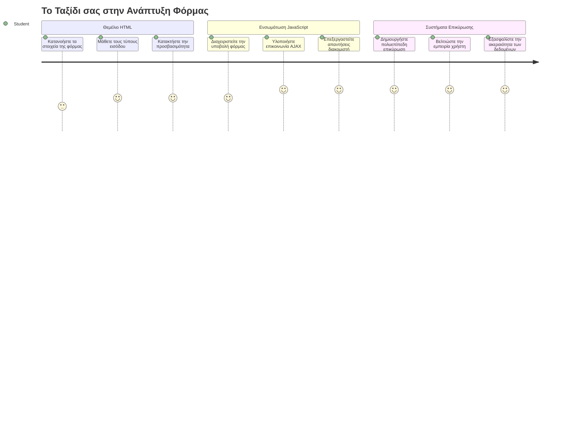
## Προ-Διάλεξη Κουίζ

[Προ-διάλεξη κουίζ](https://ff-quizzes.netlify.app/web/quiz/43)

Έχετε ποτέ συμπληρώσει μια φόρμα online και αυτή να απορρίψει τη μορφή του email σας; Ή να χάσετε όλες τις πληροφορίες σας όταν πατήσατε υποβολή; Όλοι έχουμε αντιμετωπίσει αυτές τις απογοητευτικές εμπειρίες.

Οι φόρμες είναι η γέφυρα ανάμεσα στους χρήστες σας και τη λειτουργικότητα της εφαρμογής σας. Όπως τα προσεκτικά πρωτόκολλα που χρησιμοποιούν οι ελεγκτές εναέριας κυκλοφορίας για να καθοδηγήσουν τα αεροπλάνα με ασφάλεια στους προορισμούς τους, οι σωστά σχεδιασμένες φόρμες παρέχουν σαφή ανατροφοδότηση και αποτρέπουν ακριβά λάθη. Οι κακές φόρμες, από την άλλη, μπορούν να διώξουν τους χρήστες πιο γρήγορα από μια παρερμηνεία σε ένα πολυσύχναστο αεροδρόμιο.

Σε αυτό το μάθημα, θα μετατρέψουμε την στατική σας τραπεζική εφαρμογή σε μια διαδραστική εφαρμογή. Θα μάθετε πώς να δημιουργείτε φόρμες που επικυρώνουν την είσοδο των χρηστών, επικοινωνούν με διακομιστές και παρέχουν χρήσιμη ανατροφοδότηση. Σκεφτείτε το σαν να κατασκευάζετε την διεπαφή ελέγχου που επιτρέπει στους χρήστες να περιηγούνται στα χαρακτηριστικά της εφαρμογής σας.

Μέχρι το τέλος, θα έχετε ένα πλήρες σύστημα σύνδεσης και εγγραφής με επικύρωση που καθοδηγεί τους χρήστες προς την επιτυχία αντί για απογοήτευση.

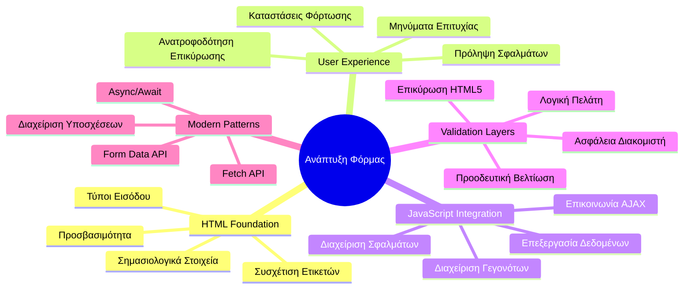
## Απαιτούμενες Προϋποθέσεις

Πριν αρχίσουμε να κατασκευάζουμε φόρμες, ας βεβαιωθούμε ότι έχετε ορίσει όλα σωστά. Αυτό το μάθημα συνεχίζει ακριβώς από εκεί που σταματήσαμε στο προηγούμενο, οπότε αν προχωρήσατε παρακάτω, μπορεί να θέλετε να επιστρέψετε και να δουλέψετε πρώτα τα βασικά.

### Απαιτούμενη Ρύθμιση

| Συνιστώσα | Κατάσταση | Περιγραφή |
|-----------|-----------|-------------|
| [HTML Templates](../1-template-route/README.md) | ✅ Απαραίτητο | Η βασική δομή της τραπεζικής εφαρμογής σας |
| [Node.js](https://nodejs.org) | ✅ Απαραίτητο | Εκτελεστικό περιβάλλον JavaScript για τον διακομιστή |
| [Bank API Server](../api/README.md) | ✅ Απαραίτητο | Υπηρεσία backend για αποθήκευση δεδομένων |

> 💡 **Συμβουλή Ανάπτυξης**: Θα τρέχετε δύο ξεχωριστούς διακομιστές ταυτόχρονα – έναν για το frontend της τραπεζικής εφαρμογής και έναν άλλο για το backend API. Αυτή η ρύθμιση αντικατοπτρίζει την πραγματική ανάπτυξη όπου οι υπηρεσίες frontend και backend λειτουργούν ανεξάρτητα.

### Διαμόρφωση Διακομιστή

**Το περιβάλλον ανάπτυξής σας θα περιλαμβάνει:**
- **Frontend server**: Εξυπηρετεί την τραπεζική εφαρμογή σας (συνήθως θύρα `3000`)
- **Backend API server**: Διαχειρίζεται αποθήκευση και ανάκτηση δεδομένων (θύρα `5000`)
- **Και οι δύο servers** μπορούν να τρέχουν ταυτόχρονα χωρίς συγκρούσεις

**Δοκιμή σύνδεσης API:**
```bash
curl http://localhost:5000/api
# Αναμενόμενη απάντηση: "Bank API v1.0.0"
```

**Αν δείτε την απάντηση έκδοσης API, είστε έτοιμοι να προχωρήσετε!**

---

## Κατανόηση Φορμών και Ελέγχων HTML

Οι φόρμες HTML είναι ο τρόπος που οι χρήστες επικοινωνούν με την εφαρμογή ιστού σας. Σκεφτείτε τις σαν το τηλεγραφικό σύστημα που συνέδεε απομακρυσμένα μέρη τον 19ο αιώνα – είναι το πρωτόκολλο επικοινωνίας ανάμεσα στην πρόθεση του χρήστη και την απόκριση της εφαρμογής. Όταν σχεδιάζονται με σκέψη, ανιχνεύουν λάθη, καθοδηγούν τη μορφοποίηση εισόδου και παρέχουν χρήσιμες υποδείξεις.

Οι σύγχρονες φόρμες είναι σημαντικά πιο προηγμένες από τις βασικές πεδία κειμένου. Το HTML5 εισήγαγε εξειδικευμένους τύπους εισόδου που χειρίζονται αυτόματα την επικύρωση email, τη μορφοποίηση αριθμών και την επιλογή ημερομηνίας. Αυτές οι βελτιώσεις ωφελούν τόσο την προσβασιμότητα όσο και την εμπειρία σε κινητές συσκευές.

### Βασικά Στοιχεία Φόρμας

**Τα δομικά στοιχεία που χρειάζεται κάθε φόρμα:**

```html
<!-- Basic form structure -->
<form id="userForm" method="POST">
  <label for="username">Username</label>
  <input id="username" name="username" type="text" required>
  
  <button type="submit">Submit</button>
</form>
```

**Τι κάνει αυτός ο κώδικας:**
- **Δημιουργεί** δοχείο φόρμας με μοναδικό αναγνωριστικό
- **Ορίζει** τη μέθοδο HTTP για την υποβολή δεδομένων
- **Συνδέει** τις ετικέτες (labels) με τα πεδία εισόδου για προσβασιμότητα
- **Ορίζει** κουμπί υποβολής για επεξεργασία της φόρμας

### Σύγχρονοι Τύποι Εισόδου και Χαρακτηριστικά

| Τύπος Εισόδου | Σκοπός | Παράδειγμα Χρήσης |
|--------------|---------|--------------|
| `text` | Γενική εισαγωγή κειμένου | `<input type="text" name="username">` |
| `email` | Επικύρωση email | `<input type="email" name="email">` |
| `password` | Εισαγωγή κρυφού κειμένου | `<input type="password" name="password">` |
| `number` | Αριθμητική είσοδος | `<input type="number" name="balance" min="0">` |
| `tel` | Τηλεφωνικοί αριθμοί | `<input type="tel" name="phone">` |

> 💡 **Πλεονέκτημα HTML5**: Η χρήση συγκεκριμένων τύπων εισόδου παρέχει αυτόματη επικύρωση, κατάλληλο πληκτρολόγιο κινητού και καλύτερη υποστήριξη προσβασιμότητας χωρίς επιπλέον JavaScript!

### Τύποι Κουμπιών και Συμπεριφορά

```html
<!-- Different button behaviors -->
<button type="submit">Save Data</button>     <!-- Submits the form -->
<button type="reset">Clear Form</button>    <!-- Resets all fields -->
<button type="button">Custom Action</button> <!-- No default behavior -->
```

**Τι κάνει ο κάθε τύπος κουμπιού:**
- **Submit**: Ενεργοποιεί την υποβολή της φόρμας και αποστέλλει δεδομένα στο προκαθορισμένο endpoint
- **Reset**: Επαναφέρει όλα τα πεδία της φόρμας στην αρχική τους κατάσταση
- **Κανονικά κουμπιά**: Δεν παρέχουν προεπιλεγμένη συμπεριφορά, απαιτώντας custom JavaScript για λειτουργία

> ⚠️ **Σημαντική Σημείωση**: Το στοιχείο `<input>` είναι αυτόκλητο (self-closing) και δεν χρειάζεται κλείσιμο. Η σύγχρονη πρακτική είναι να γράφετε `<input>` χωρίς κάθετο (/).

### Δημιουργώντας τη Φόρμα Σύνδεσης

Ας δημιουργήσουμε τώρα μια πρακτική φόρμα σύνδεσης που δείχνει τις σύγχρονες πρακτικές φόρμας HTML. Θα ξεκινήσουμε με μια βασική δομή και σταδιακά θα τη βελτιώσουμε με χαρακτηριστικά προσβασιμότητας και επικύρωσης.

```html
<template id="login">
  <h1>Bank App</h1>
  <section>
    <h2>Login</h2>
    <form id="loginForm" novalidate>
      <div class="form-group">
        <label for="username">Username</label>
        <input id="username" name="user" type="text" required 
               autocomplete="username" placeholder="Enter your username">
      </div>
      <button type="submit">Login</button>
    </form>
  </section>
</template>
```

**Ανάλυση αυτών που συμβαίνουν εδώ:**
- **Δομεί** τη φόρμα με σημασιολογικά στοιχεία HTML5
- **Ομαδοποιεί** σχετιζόμενα στοιχεία με `div` containers και ουσιαστικές κλάσεις
- **Συνδέει** ετικέτες με πεδία εισόδου με τις ιδιότητες `for` και `id`
- **Περιλαμβάνει** σύγχρονες ιδιότητες όπως `autocomplete` και `placeholder` για καλύτερη εμπειρία χρήστη
- **Προσθέτει** `novalidate` για διαχείριση επικύρωσης με JavaScript αντί των προεπιλογών του browser

### Η Δύναμη των Σωστών Ετικετών

**Γιατί οι ετικέτες είναι σημαντικές στη σύγχρονη ανάπτυξη διαδικτύου:**

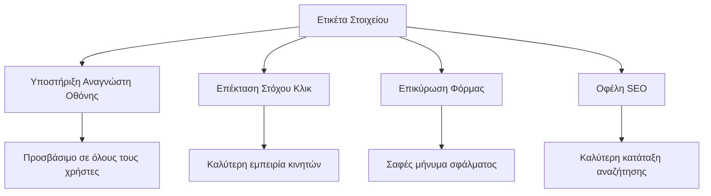
**Τι πετυχαίνουν οι σωστές ετικέτες:**
- **Ενεργοποιούν** την ανάγνωση από screen readers με σαφήνεια
- **Επεκτείνουν** την επιφάνεια κλικ (κλικάροντας την ετικέτα εστιάζει το πεδίο)
- **Βελτιώνουν** τη χρηστικότητα σε κινητά με μεγαλύτερους στόχους αφής
- **Υποστηρίζουν** επικύρωση φόρμας με ουσιαστικά μηνύματα σφάλματος
- **Ενισχύουν** το SEO παρέχοντας σημασιολογικό νόημα στα στοιχεία της φόρμας

> 🎯 **Στόχος Προσβασιμότητας**: Κάθε πεδίο φόρμας πρέπει να έχει συνδεδεμένη ετικέτα. Αυτή η απλή πρακτική κάνει τις φόρμες σας προσβάσιμες σε όλους, συμπεριλαμβανομένων ατόμων με αναπηρίες, και βελτιώνει την εμπειρία όλων των χρηστών.

### Δημιουργία της Φόρμας Εγγραφής

Η φόρμα εγγραφής απαιτεί πιο αναλυτικές πληροφορίες για να δημιουργήσει έναν ολοκληρωμένο λογαριασμό χρήστη. Ας την κατασκευάσουμε με σύγχρονα χαρακτηριστικά HTML5 και ενισχυμένη προσβασιμότητα.

```html
<hr/>
<h2>Register</h2>
<form id="registerForm" novalidate>
  <div class="form-group">
    <label for="user">Username</label>
    <input id="user" name="user" type="text" required 
           autocomplete="username" placeholder="Choose a username">
  </div>
  
  <div class="form-group">
    <label for="currency">Currency</label>
    <input id="currency" name="currency" type="text" value="$" 
           required maxlength="3" placeholder="USD, EUR, etc.">
  </div>
  
  <div class="form-group">
    <label for="description">Account Description</label>
    <input id="description" name="description" type="text" 
           maxlength="100" placeholder="Personal savings, checking, etc.">
  </div>
  
  <div class="form-group">
    <label for="balance">Starting Balance</label>
    <input id="balance" name="balance" type="number" value="0" 
           min="0" step="0.01" placeholder="0.00">
  </div>
  
  <button type="submit">Create Account</button>
</form>
```

**Στο παραπάνω έχουμε:**
- **Οργανώσει** κάθε πεδίο σε container divs για καλύτερο στυλ και διάταξη
- **Προσθέσει** κατάλληλες ιδιότητες `autocomplete` για υποστήριξη αυτόματης συμπλήρωσης browser
- **Συμπεριλάβει** χρήσιμο κείμενο placeholder για καθοδήγηση χρήστη
- **Ορίσει** λογικές προεπιλογές με την ιδιότητα `value`
- **Εφαρμόσει** χαρακτηριστικά επικύρωσης όπως `required`, `maxlength`, και `min`
- **Χρησιμοποιήσει** `type="number"` για το πεδίο balance με υποστήριξη δεκαδικών

### Εξερεύνηση Τύπων Εισόδου και Συμπεριφοράς

**Οι σύγχρονοι τύποι εισόδου παρέχουν βελτιωμένη λειτουργικότητα:**

| Χαρακτηριστικό | Όφελος | Παράδειγμα |
|---------------|---------|-------------|
| `type="number"` | Αριθμητικό πληκτρολόγιο σε κινητό | Ευκολότερη εισαγωγή υπολοίπου |
| `step="0.01"` | Έλεγχος δεκαδικών ψηφίων | Επιτρέπει λεπτά κέρματα |
| `autocomplete` | Αυτόματη συμπλήρωση browser | Ταχύτερη συμπλήρωση φόρμας |
| `placeholder` | Συμφραζόμενα υποδείξεων | Καθοδηγεί τις προσδοκίες χρήστη |

> 🎯 **Πρόκληση Προσβασιμότητας**: Δοκιμάστε να πλοηγηθείτε στις φόρμες χρησιμοποιώντας μόνο το πληκτρολόγιο! Χρησιμοποιήστε `Tab` για να πάτε μεταξύ πεδίων, `Space` για να επιλέξετε κουτάκια, και `Enter` για υποβολή. Αυτή η εμπειρία βοηθά να καταλάβετε πώς οι χρήστες οθόνης αλληλεπιδρούν με τις φόρμες σας.

### 🔄 **Παιδαγωγικός Έλεγχος**
**Κατανόηση Θεμελίων Φόρμας**: Πριν εφαρμόσετε JavaScript, βεβαιωθείτε ότι κατανοείτε:
- ✅ Πώς η σημασιολογική HTML δημιουργεί προσβάσιμες δομές φόρμας
- ✅ Γιατί οι τύποι εισόδου έχουν σημασία για πληκτρολόγια κινητών και επικύρωση
- ✅ Τη σχέση ετικετών και ελέγχων φόρμας
- ✅ Πώς οι ιδιότητες της φόρμας επηρεάζουν τη συμπεριφορά του browser από προεπιλογή

**Γρήγορο Αυτοτεστ**: Τι συμβαίνει αν υποβάλετε φόρμα χωρίς διαχείριση JavaScript;
*Απάντηση: Ο browser κάνει την προεπιλεγμένη υποβολή, συνήθως ανακατευθύνοντας στο URL δράσης*

**Οφέλη HTML5 Φόρμας**: Οι σύγχρονες φόρμες παρέχουν:
- **Ενσωματωμένη Επικύρωση**: Αυτόματος έλεγχος μορφής email και αριθμών
- **Βελτιστοποίηση για Κινητά**: Κατάλληλα πληκτρολόγια ανά τύπο εισόδου
- **Προσβασιμότητα**: Υποστήριξη screen reader και πλοήγηση με πληκτρολόγιο
- **Προοδευτική Βελτίωση**: Λειτουργεί ακόμα και με απενεργοποιημένη JavaScript

## Κατανόηση Μεθόδων Υποβολής Φόρμας

Όταν κάποιος συμπληρώνει τη φόρμα σας και πατά υποβολή, τα δεδομένα αυτά πρέπει να πάνε κάπου – συνήθως σε διακομιστή που μπορεί να τα αποθηκεύσει. Υπάρχουν μερικοί διαφορετικοί τρόποι που μπορεί να γίνει αυτό, και το να ξέρετε ποιος να χρησιμοποιήσετε μπορεί να σας γλιτώσει από πονοκεφάλους αργότερα.

Ας δούμε τι ακριβώς συμβαίνει όταν κάποιος πατάει το κουμπί υποβολής.

### Προεπιλεγμένη Συμπεριφορά Φόρμας

Πρώτα, ας παρατηρήσουμε τι συμβαίνει με την βασική υποβολή φόρμας:

**Δοκιμάστε τις τρέχουσες φόρμες σας:**
1. Κάντε κλικ στο κουμπί *Εγγραφή* στη φόρμα σας
2. Παρατηρήστε τις αλλαγές στη γραμμή διευθύνσεων του browser
3. Δείτε πώς η σελίδα φορτώνει ξανά και εμφανίζονται δεδομένα στο URL


### Σύγκριση Μεθόδων HTTP

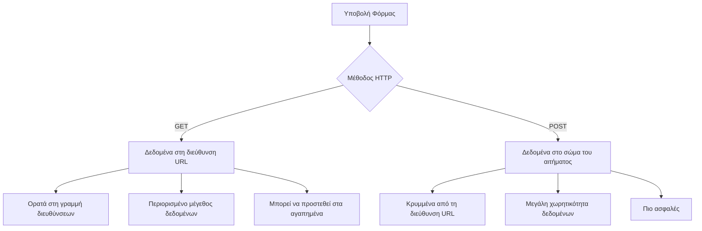
**Κατανόηση διαφορών:**

| Μέθοδος | Περίπτωση Χρήσης | Θέση Δεδομένων | Επίπεδο Ασφαλείας | Όριο Μεγέθους |
|---------|------------------|----------------|-------------------|--------------|
| `GET` | Αναζητήσεις, φίλτρα | Παράμετροι URL | Χαμηλό (Ορατό) | ~2000 χαρακτήρες |
| `POST` | Λογαριασμοί χρηστών, ευαίσθητα δεδομένα | Σώμα αιτήματος | Υψηλότερο (Κρυφό) | Χωρίς πρακτικό όριο |

**Κατανόηση θεμελιωδών διαφορών:**
- **GET**: Προσθέτει δεδομένα φόρμας στο URL ως παραμέτρους ερωτήματος (κατάλληλο για αναζητήσεις)
- **POST**: Περιλαμβάνει δεδομένα στο σώμα της αίτησης (απαραίτητο για ευαίσθητες πληροφορίες)
- **Περιορισμοί GET**: Όριο μεγέθους, ορατά δεδομένα, διατήρηση ιστορικού browser
- **Πλεονεκτήματα POST**: Μεγάλη χωρητικότητα δεδομένων, προστασία ιδιωτικότητας, υποστήριξη ανεβάσματος αρχείων

> 💡 **Καλύτερη Πρακτική**: Χρησιμοποιήστε `GET` για φόρμες αναζήτησης και φίλτρων (ανάκτηση δεδομένων), χρησιμοποιήστε `POST` για εγγραφή χρηστών, σύνδεση και δημιουργία δεδομένων.

### Διαμόρφωση Υποβολής Φόρμας

Ας ρυθμίσουμε τη φόρμα εγγραφής σας ώστε να επικοινωνεί σωστά με το backend API χρησιμοποιώντας τη μέθοδο POST:

```html
<form id="registerForm" action="//localhost:5000/api/accounts" 
      method="POST" novalidate>
```

**Τι κάνει αυτή η ρύθμιση:**
- **Κατευθύνει** την υποβολή της φόρμας στο API endpoint σας
- **Χρησιμοποιεί** τη μέθοδο POST για ασφαλή αποστολή δεδομένων
- **Περιλαμβάνει** `novalidate` για διαχείριση επικύρωσης με JavaScript

### Δοκιμή Υποβολής Φόρμας

**Ακολουθήστε αυτά τα βήματα για να δοκιμάσετε τη φόρμα:**
1. **Συμπληρώστε** τη φόρμα εγγραφής με τις πληροφορίες σας
2. **Κάντε κλικ** στο κουμπί "Δημιουργία Λογαριασμού"
3. **Παρατηρήστε** την απόκριση του διακομιστή στον browser σας

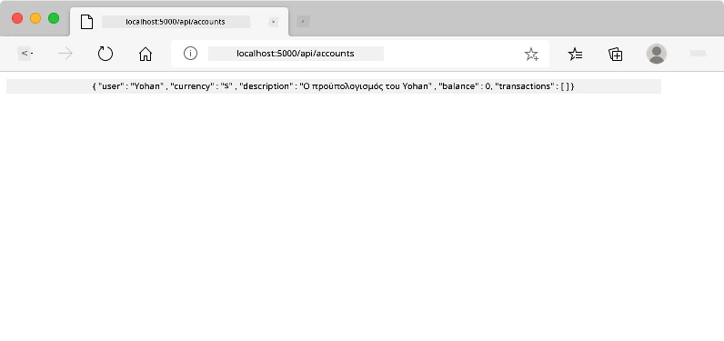

**Τι πρέπει να δείτε:**
- **Ο browser ανακατευθύνει** στη διεύθυνση endpoint του API
- **Απάντηση JSON** που περιέχει τα δεδομένα του νέου σας λογαριασμού
- **Επιβεβαίωση διακομιστή** ότι ο λογαριασμός δημιουργήθηκε επιτυχώς

> 🧪 **Πειραματισμός**: Δοκιμάστε να εγγραφείτε ξανά με το ίδιο όνομα χρήστη. Τι απάντηση λαμβάνετε; Αυτό σας βοηθά να καταλάβετε πώς ο διακομιστής χειρίζεται διπλότυπα δεδομένα και σφάλματα.

### Κατανόηση Απαντήσεων JSON

**Όταν ο διακομιστής επεξεργάζεται επιτυχώς τη φόρμα σας:**
```json
{
  "user": "john_doe",
  "currency": "$",
  "description": "Personal savings",
  "balance": 100,
  "id": "unique_account_id"
}
```

**Αυτή η απάντηση επιβεβαιώνει:**
- **Δημιουργία** νέου λογαριασμού με τα καθορισμένα δεδομένα
- **Ανάθεση** μοναδικού αναγνωριστικού για μελλοντική χρήση
- **Επιστροφή** όλων των πληροφοριών λογαριασμού για έλεγχο
- **Ένδειξη** επιτυχούς αποθήκευσης στη βάση δεδομένων

## Σύγχρονη Διαχείριση Φορμών με JavaScript

Οι παραδοσιακές υποβολές φόρμας προκαλούν πλήρη φόρτωση της σελίδας, όπως οι πρώιμες διαστημικές αποστολές που απαιτούσαν πλήρη επανεκκίνηση συστήματος για αλλαγή πορείας. Αυτή η προσέγγιση διακόπτει την εμπειρία χρήστη και χάνει την κατάσταση της εφαρμογής.

Η διαχείριση φόρμας με JavaScript λειτουργεί όπως τα συστήματα συνεχιζόμενης καθοδήγησης που χρησιμοποιούν τα σύγχρονα διαστημόπλοια – κάνοντας ρυθμίσεις σε πραγματικό χρόνο χωρίς να χάνεται το πλαίσιο πλοήγησης. Μπορούμε να αναχαιτίσουμε τις υποβολές φόρμας, να παρέχουμε άμεση ανατροφοδότηση, να χειριστούμε σφάλματα με χάρη, και να ενημερώσουμε τη διεπαφή βάσει απαντήσεων διακομιστή διατηρώντας τη θέση του χρήστη στην εφαρμογή.

### Γιατί να Αποφεύγουμε τις Επανφορτώσεις Σελίδας;

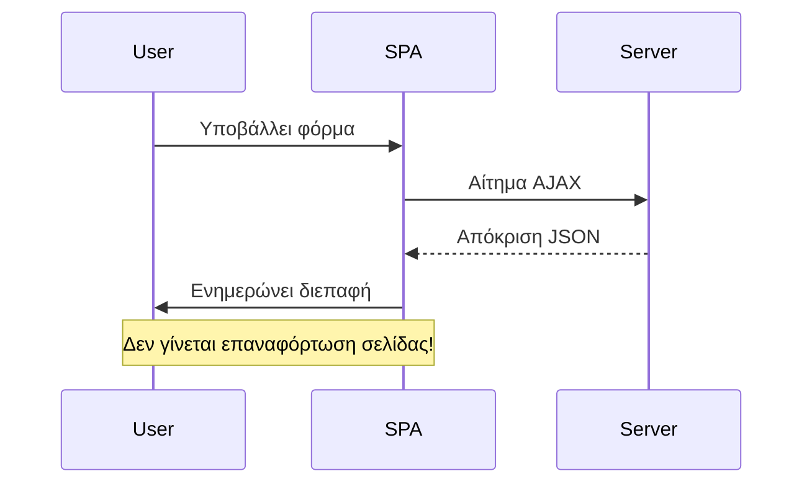
**Οφέλη διαχείρισης φόρμας με JavaScript:**
- **Διατηρεί** την κατάσταση της εφαρμογής και το πλαίσιο χρήστη
- **Παρέχει** άμεση ανατροφοδότηση και ενδείξεις φόρτωσης
- **Επιτρέπει** δυναμικό χειρισμό σφαλμάτων και επικύρωση
- **Δημιουργεί** ομαλές, εφαρμογές σαν εμπειρίες χρήστη
- **Επιτρέπει** λογική υπό όρους βάσει απαντήσεων διακομιστή

### Μετάβαση από Παραδοσιακές στις Σύγχρονες Φόρμες

**Προβλήματα παραδοσιακής προσέγγισης:**
- **Απομακρύνει** τους χρήστες από την εφαρμογή σας
- **Χάνει** την τρέχουσα κατάσταση και πλαίσιο εφαρμογής
- **Απαιτεί** πλήρη φόρτωση σελίδας για απλές ενέργειες
- **Προσφέρει** περιορισμένο έλεγχο στην ανατροφοδότηση χρήστη

**Πλεονεκτήματα σύγχρονης προσέγγισης JavaScript:**
- **Κρατάει** τους χρήστες μέσα στην εφαρμογή σας
- **Διατηρεί** όλη την κατάσταση και τα δεδομένα της εφαρμογής
- **Επιτρέπει** επικύρωση και ανατροφοδότηση σε πραγματικό χρόνο
- **Υποστηρίζει** προοδευτική βελτίωση και προσβασιμότητα

### Υλοποίηση Διαχείρισης Φόρμας με JavaScript

Ας αντικαταστήσουμε την παραδοσιακή υποβολή φόρμας με σύγχρονο χειρισμό γεγονότων JavaScript:

```html
<!-- Remove the action attribute and add event handling -->
<form id="registerForm" method="POST" novalidate>
```

**Προσθέστε τη λογική εγγραφής στο αρχείο `app.js`:**

```javascript
// Σύγχρονη διαχείριση φορμών με βάση τα συμβάντα
function register() {
  const registerForm = document.getElementById('registerForm');
  const formData = new FormData(registerForm);
  const data = Object.fromEntries(formData);
  const jsonData = JSON.stringify(data);
  
  console.log('Form data prepared:', data);
}

// Συνδέστε τον ακροατή συμβάντων όταν φορτώνει η σελίδα
document.addEventListener('DOMContentLoaded', () => {
  const registerForm = document.getElementById('registerForm');
  registerForm.addEventListener('submit', (event) => {
    event.preventDefault(); // Αποτροπή της προεπιλεγμένης υποβολής της φόρμας
    register();
  });
});
```

**Ανάλυση αυτών που συμβαίνουν εδώ:**
- **Αποτρέπει** την προεπιλεγμένη υποβολή φόρμας με `event.preventDefault()`
- **Ανακτά** το στοιχείο φόρμας με σύγχρονη επιλογή DOM
- **Εξάγει** δεδομένα φόρμας με το ισχυρό API `FormData`
- **Μετατρέπει** το FormData σε απλό αντικείμενο με `Object.fromEntries()`
- **Σειριοποιεί** τα δεδομένα σε μορφή JSON για επικοινωνία με διακομιστή
- **Καταγράφει** τα επεξεργασμένα δεδομένα για αποσφαλμάτωση και έλεγχο

### Κατανόηση του FormData API

**Το API FormData παρέχει ισχυρή διαχείριση φορμών:**
```javascript
// Παράδειγμα αυτού που καταγράφει το FormData
const formData = new FormData(registerForm);

// Το FormData καταγράφει αυτόματα:
// {
//   "user": "john_doe",
//   "currency": "$",
//   "description": "Προσωπικός λογαριασμός",
//   "balance": "100"
// }
```

**Πλεονεκτήματα του FormData API:**
- **Ολοκληρωμένη συλλογή**: Συγκεντρώνει όλα τα στοιχεία της φόρμας, συμπεριλαμβανομένου κειμένου, αρχείων και σύνθετων εισόδων
- **Ευαισθησία τύπου**: Διαχειρίζεται αυτόματα διαφορετικούς τύπους εισόδων χωρίς ειδική κωδικοποίηση
- **Αποδοτικότητα**: Αποφεύγει τη χειροκίνητη συλλογή πεδίων με μία μόνο κλήση API
- **Προσαρμοστικότητα**: Διατηρεί τη λειτουργικότητα όσο εξελίσσεται η δομή της φόρμας

### Δημιουργία της Συναρτησης Επικοινωνίας με τον Διακομιστή

Ας κατασκευάσουμε τώρα μια στιβαρή συνάρτηση για επικοινωνία με τον API server σας χρησιμοποιώντας σύγχρονα μοτίβα JavaScript:

```javascript
async function createAccount(account) {
  try {
    const response = await fetch('//localhost:5000/api/accounts', {
      method: 'POST',
      headers: { 
        'Content-Type': 'application/json',
        'Accept': 'application/json'
      },
      body: account
    });
    
    // Ελέγξτε αν η απάντηση ήταν επιτυχής
    if (!response.ok) {
      throw new Error(`HTTP error! status: ${response.status}`);
    }
    
    return await response.json();
  } catch (error) {
    console.error('Account creation failed:', error);
    return { error: error.message || 'Network error occurred' };
  }
}
```

**Κατανόηση του ασύγχρονου JavaScript:**

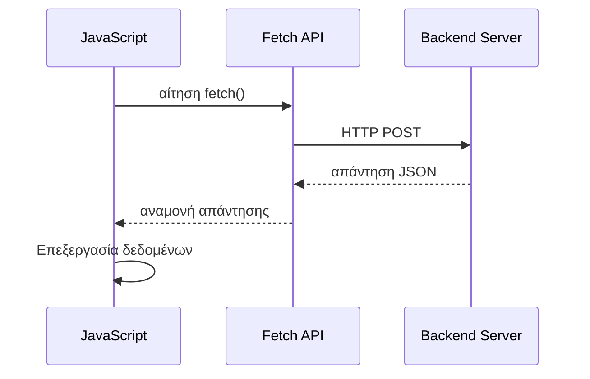
**Τι επιτυγχάνει αυτή η σύγχρονη υλοποίηση:**
- **Χρήση** `async/await` για ευανάγνωστο ασύγχρονο κώδικα
- **Περιλαμβάνει** σωστή διαχείριση σφαλμάτων με μπλοκ try/catch
- **Ελέγχει** την κατάσταση απόκρισης πριν την επεξεργασία δεδομένων
- **Ορίζει** κατάλληλους headers για επικοινωνία JSON
- **Παρέχει** λεπτομερή μηνύματα σφάλματος για αποσφαλμάτωση
- **Επιστρέφει** συνεπή δομή δεδομένων για περιπτώσεις επιτυχίας και σφάλματος

### Η Δύναμη του Σύγχρονου Fetch API

**Πλεονεκτήματα του Fetch API σε σχέση με παλαιότερες μεθόδους:**

| Χαρακτηριστικό | Όφελος | Υλοποίηση |
|---------|---------|----------------|
| Βασισμένο σε Promise | Καθαρός ασύγχρονος κώδικας | `await fetch()` |
| Προσαρμογή αιτήματος | Πλήρης έλεγχος HTTP | Headers, μέθοδοι, σώμα |
| Διαχείριση απόκρισης | Ευέλικτη ανάλυση δεδομένων | `.json()`, `.text()`, `.blob()` |
| Διαχείριση σφαλμάτων | Ολοκληρωμένη λήψη σφαλμάτων | Μπλοκ try/catch |

> 🎥 **Μάθετε περισσότερα**: [Async/Await Tutorial](https://youtube.com/watch?v=YwmlRkrxvkk) - Κατανόηση προτύπων ασύγχρονου JavaScript για σύγχρονη ανάπτυξη web.

**Βασικές έννοιες για την επικοινωνία με τον διακομιστή:**
- **Ασύγχρονες συναρτήσεις** επιτρέπουν παύση εκτέλεσης για αναμονή απαντήσεων από τον διακομιστή
- **Η λέξη-κλειδί await** κάνει τον ασύγχρονο κώδικα να διαβάζεται σαν συγχρονισμένος
- **Το Fetch API** παρέχει σύγχρονα αιτήματα HTTP βασισμένα σε Promise
- **Η διαχείριση σφαλμάτων** διασφαλίζει ότι η εφαρμογή ανταποκρίνεται ομαλά σε προβλήματα δικτύου

### Ολοκλήρωση της Συναρτησης Εγγραφής

Ας ενώσουμε όλα μαζί με μια πλήρη, έτοιμη για παραγωγή λειτουργία εγγραφής:

```javascript
async function register() {
  const registerForm = document.getElementById('registerForm');
  const submitButton = registerForm.querySelector('button[type="submit"]');
  
  try {
    // Εμφάνιση κατάστασης φόρτωσης
    submitButton.disabled = true;
    submitButton.textContent = 'Creating Account...';
    
    // Επεξεργασία δεδομένων φόρμας
    const formData = new FormData(registerForm);
    const jsonData = JSON.stringify(Object.fromEntries(formData));
    
    // Αποστολή στον διακομιστή
    const result = await createAccount(jsonData);
    
    if (result.error) {
      console.error('Registration failed:', result.error);
      alert(`Registration failed: ${result.error}`);
      return;
    }
    
    console.log('Account created successfully!', result);
    alert(`Welcome, ${result.user}! Your account has been created.`);
    
    // Επαναφορά φόρμας μετά από επιτυχημένη εγγραφή
    registerForm.reset();
    
  } catch (error) {
    console.error('Unexpected error:', error);
    alert('An unexpected error occurred. Please try again.');
  } finally {
    // Επαναφορά κατάστασης κουμπιού
    submitButton.disabled = false;
    submitButton.textContent = 'Create Account';
  }
}
```

**Αυτή η βελτιωμένη υλοποίηση περιλαμβάνει:**
- **Παρέχει** οπτικό feedback κατά την υποβολή της φόρμας
- **Απενεργοποιεί** το κουμπί υποβολής για αποτροπή διπλών εγγραφών
- **Διαχειρίζεται** τόσο αναμενόμενα όσο και απρόβλεπτα σφάλματα ομαλά
- **Εμφανίζει** φιλικά μηνύματα επιτυχίας και σφάλματος στο χρήστη
- **Επαναφέρει** τη φόρμα μετά από επιτυχή εγγραφή
- **Αποκαθιστά** την κατάσταση του UI ανεξαρτήτως αποτελέσματος

### Δοκιμή της Υλοποίησής Σας

**Ανοίξτε τα εργαλεία προγραμματιστή του browser σας και δοκιμάστε την εγγραφή:**

1. **Ανοίξτε** την κονσόλα του browser (F12 → καρτέλα Console)
2. **Συμπληρώστε** τη φόρμα εγγραφής
3. **Πατήστε** "Create Account"
4. **Παρατηρήστε** τα μηνύματα της κονσόλας και το feedback προς το χρήστη

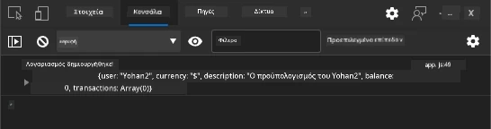

**Τι θα δείτε:**
- **Κατάσταση φόρτωσης** εμφανίζεται στο κουμπί υποβολής
- **Καταγραφές στην κονσόλα** δείχνουν λεπτομερείς πληροφορίες για τη διαδικασία
- **Μήνυμα επιτυχίας** εμφανίζεται όταν η δημιουργία λογαριασμού ολοκληρώνεται
- **Η φόρμα επαναφέρεται** αυτόματα μετά την επιτυχή υποβολή

> 🔒 **Σημείωση ασφάλειας**: Προς το παρόν, τα δεδομένα ταξιδεύουν μέσω HTTP, που δεν είναι ασφαλές για παραγωγή. Σε πραγματικές εφαρμογές, χρησιμοποιήστε πάντα HTTPS για κρυπτογράφηση μετάδοσης δεδομένων. Μάθετε περισσότερα για το [HTTPS security](https://en.wikipedia.org/wiki/HTTPS) και γιατί είναι απαραίτητο για την προστασία των δεδομένων των χρηστών.

### 🔄 **Παιδαγωγικός Έλεγχος**
**Ενσωμάτωση σύγχρονου JavaScript**: Επαληθεύστε την κατανόησή σας για την ασύγχρονη διαχείριση φόρμας:
- ✅ Πώς αλλάζει η συμπεριφορά της φόρμας η `event.preventDefault()`;
- ✅ Γιατί το FormData API είναι πιο αποδοτικό από τη χειροκίνητη συλλογή πεδίων;
- ✅ Πώς βελτιώνουν την αναγνωσιμότητα του κώδικα τα μοτίβα async/await;
- ✅ Ποιος ρόλος παίζει η διαχείριση σφαλμάτων στην εμπειρία χρήστη;

**Αρχιτεκτονική Συστήματος**: Η διαχείριση της φόρμας σας επιδεικνύει:
- **Προγραμματισμό κατ’ εκδήλωση**: Οι φόρμες ανταποκρίνονται σε ενέργειες χρήστη χωρίς ανανέωση σελίδας
- **Ασύγχρονη Επικοινωνία**: Τα αιτήματα προς τον διακομιστή δεν μπλοκάρουν το περιβάλλον χρήστη
- **Διαχείριση σφαλμάτων**: Ομαλή υποβάθμιση όταν αποτυγχάνουν τα αιτήματα δικτύου
- **Διαχείριση κατάστασης**: Οι ενημερώσεις UI αντανακλούν καταλλήλως τις απαντήσεις διακομιστή
- **Προοδευτική βελτίωση**: Η βασική λειτουργικότητα δουλεύει, το JavaScript την ενισχύει

**Επαγγελματικά μοτίβα**: Έχετε υλοποιήσει:
- **Μοναδική ευθύνη**: Σαφείς και συγκεκριμένοι σκοποί συναρτήσεων
- **Όρια σφαλμάτων**: Τα μπλοκ try/catch αποτρέπουν κρασαρίσματα εφαρμογής
- **Ανατροφοδότηση χρήστη**: Καταστάσεις φόρτωσης και μηνύματα επιτυχίας/σφάλματος
- **Μετασχηματισμό δεδομένων**: Μετατροπή FormData σε JSON για επικοινωνία με τον server

## Ολοκληρωμένη Επικύρωση Φόρμας

Η επικύρωση της φόρμας αποτρέπει την ενοχλητική εμπειρία των σφαλμάτων που ανακαλύπτονται μόνο μετά την υποβολή. Όπως τα πολλαπλά εφεδρικά συστήματα στον Διεθνή Διαστημικό Σταθμό, η αποτελεσματική επικύρωση εφαρμόζει πολλαπλά επίπεδα ελέγχου ασφαλείας.

Η βέλτιστη προσέγγιση συνδυάζει επικύρωση σε επίπεδο browser για άμεση ανατροφοδότηση, επικύρωση με JavaScript για καλύτερη εμπειρία χρήστη και επικύρωση από τον διακομιστή για ασφάλεια και ακεραιότητα δεδομένων. Αυτή η πλεονασματικότητα εξασφαλίζει την ικανοποίηση των χρηστών και την προστασία του συστήματος.

### Κατανόηση Επιπέδων Επικύρωσης

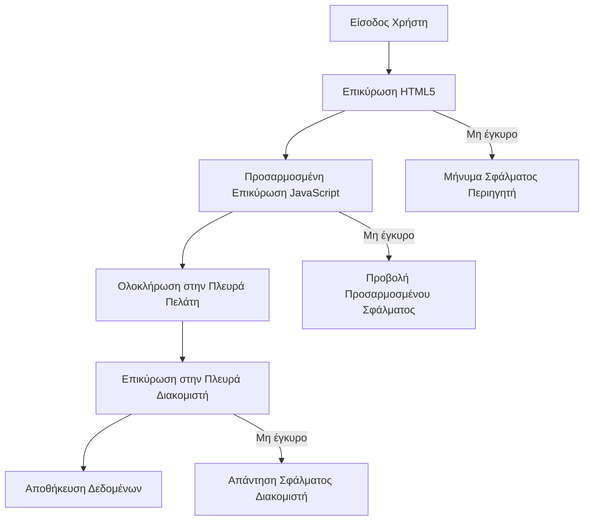
**Στρατηγική επικύρωσης πολλαπλών επιπέδων:**
- **HTML5 επικύρωση**: Άμεσοι έλεγχοι από το browser
- **JavaScript επικύρωση**: Προσαρμοσμένη λογική και εμπειρία χρήστη
- **Επικύρωση διακομιστή**: Τελικοί έλεγχοι ασφαλείας και ακεραιότητας δεδομένων
- **Προοδευτική βελτίωση**: Λειτουργεί ακόμα και αν το JavaScript είναι απενεργοποιημένο

### HTML5 Ιδιότητες Επικύρωσης

**Σύγχρονα εργαλεία επικύρωσης στη διάθεσή σας:**

| Ιδιότητα | Σκοπός | Παράδειγμα χρήσης | Συμπεριφορά browser |
|-----------|---------|---------------|------------------|
| `required` | Υποχρεωτικά πεδία | `<input required>` | Αποτρέπει κενή υποβολή |
| `minlength`/`maxlength` | Όρια μήκους κειμένου | `<input maxlength="20">` | Εφαρμόζει όρια χαρακτήρων |
| `min`/`max` | Αριθμητικά όρια | `<input min="0" max="1000">` | Επικυρώνει όρια αριθμού |
| `pattern` | Προσαρμοσμένοι κανόνες regex | `<input pattern="[A-Za-z]+">` | Ταιριάζει με συγκεκριμένες μορφές |
| `type` | Επικύρωση τύπου δεδομένων | `<input type="email">` | Επικύρωση συγκεκριμένης μορφής |

### Στυλισμός Επικύρωσης με CSS

**Δημιουργήστε οπτικό feedback για καταστάσεις επικύρωσης:**

```css
/* Valid input styling */
input:valid {
  border-color: #28a745;
  background-color: #f8fff9;
}

/* Invalid input styling */
input:invalid {
  border-color: #dc3545;
  background-color: #fff5f5;
}

/* Focus states for better accessibility */
input:focus:valid {
  box-shadow: 0 0 0 0.2rem rgba(40, 167, 69, 0.25);
}

input:focus:invalid {
  box-shadow: 0 0 0 0.2rem rgba(220, 53, 69, 0.25);
}
```

**Τι επιτυγχάνουν αυτές οι οπτικές ένδειξεις:**
- **Πράσινα περιγράμματα**: Δείχνουν επιτυχημένη επικύρωση, όπως τα πράσινα φώτα στον έλεγχο αποστολής
- **Κόκκινα περιγράμματα**: Δηλώνουν σφάλματα επικύρωσης που απαιτούν προσοχή
- **Αποχρώσεις εστίασης**: Παρέχουν σαφή οπτικό πλαίσιο στην τρέχουσα είσοδο
- **Συνεπής στυλισμός**: Εγκαθιδρύει προβλέψιμα πρότυπα διεπαφής που μπορούν να μάθουν οι χρήστες

> 💡 **Χρήσιμη συμβουλή**: Χρησιμοποιήστε τις CSS ψευδοκλάσεις `:valid` και `:invalid` για να δίνετε άμεση οπτική ανατροφοδότηση καθώς οι χρήστες πληκτρολογούν, δημιουργώντας μια ευαίσθητη και βοηθητική διεπαφή.

### Υλοποίηση Ολοκληρωμένης Επικύρωσης

Ας βελτιώσουμε τη φόρμα εγγραφής σας με ισχυρή επικύρωση που παρέχει εξαιρετική εμπειρία χρήστη και ποιότητα δεδομένων:

```html
<form id="registerForm" method="POST" novalidate>
  <div class="form-group">
    <label for="user">Username <span class="required">*</span></label>
    <input id="user" name="user" type="text" required 
           minlength="3" maxlength="20" 
           pattern="[a-zA-Z0-9_]+" 
           autocomplete="username"
           title="Username must be 3-20 characters, letters, numbers, and underscores only">
    <small class="form-text">Choose a unique username (3-20 characters)</small>
  </div>
  
  <div class="form-group">
    <label for="currency">Currency <span class="required">*</span></label>
    <input id="currency" name="currency" type="text" required 
           value="$" maxlength="3" 
           pattern="[A-Z$€£¥₹]+" 
           title="Enter a valid currency symbol or code">
    <small class="form-text">Currency symbol (e.g., $, €, £)</small>
  </div>
  
  <div class="form-group">
    <label for="description">Account Description</label>
    <input id="description" name="description" type="text" 
           maxlength="100" 
           placeholder="Personal savings, checking, etc.">
    <small class="form-text">Optional description (up to 100 characters)</small>
  </div>
  
  <div class="form-group">
    <label for="balance">Starting Balance</label>
    <input id="balance" name="balance" type="number" 
           value="0" min="0" step="0.01" 
           title="Enter a positive number for your starting balance">
    <small class="form-text">Initial account balance (minimum $0.00)</small>
  </div>
  
  <button type="submit">Create Account</button>
</form>
```

**Κατανόηση της βελτιωμένης επικύρωσης:**
- **Συνδυάζει** δείκτες υποχρεωτικών πεδίων με χρήσιμες περιγραφές
- **Περιλαμβάνει** ιδιότητες `pattern` για επικύρωση μορφής
- **Παρέχει** χαρακτηριστικά `title` για προσβασιμότητα και βοηθητικά μηνύματα
- **Προσθέτει** βοηθητικό κείμενο για καθοδήγηση χρήστη
- **Χρησιμοποιεί** σημασιολογική HTML δομή για καλύτερη προσβασιμότητα

### Προχωρημένοι Κανόνες Επικύρωσης

**Τι επιτυγχάνει ο κάθε κανόνας επικύρωσης:**

| Πεδίο | Κανόνες επικύρωσης | Όφελος για χρήστη |
|-------|------------------|--------------|
| Όνομα χρήστη | `required`, `minlength="3"`, `maxlength="20"`, `pattern="[a-zA-Z0-9_]+"` | Εξασφαλίζει έγκυρους, μοναδικούς αναγνωριστικούς |
| Νόμισμα | `required`, `maxlength="3"`, `pattern="[A-Z$€£¥₹]+"` | Αποδέχεται συνήθεις συμβολισμούς νομισμάτων |
| Υπόλοιπο | `min="0"`, `step="0.01"`, `type="number"` | Αποτρέπει αρνητικά υπόλοιπα |
| Περιγραφή | `maxlength="100"` | Λογικά όρια μήκους |

### Δοκιμή Συμπεριφοράς Επικύρωσης

**Δοκιμάστε αυτά τα σενάρια επικύρωσης:**
1. **Υποβάλετε** τη φόρμα με κενά υποχρεωτικά πεδία
2. **Εισάγετε** όνομα χρήστη με λιγότερους από 3 χαρακτήρες
3. **Δοκιμάστε** ειδικούς χαρακτήρες στο πεδίο ονόματος χρήστη
4. **Πληκτρολογήστε** αρνητικό ποσό υπολοίπου

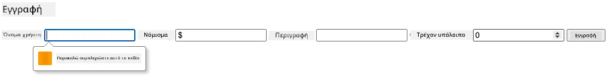

**Τι θα παρατηρήσετε:**
- **Ο browser εμφανίζει** ενσωματωμένα μηνύματα επικύρωσης
- **Οι αλλαγές styling** βασίζονται σε καταστάσεις `:valid` και `:invalid`
- **Η υποβολή της φόρμας** αποτρέπεται έως ότου περάσουν όλοι οι έλεγχοι
- **Η εστίαση μετακινείται αυτόματα** στο πρώτο μη έγκυρο πεδίο

### Επικύρωση Πελάτη vs Διακομιστή

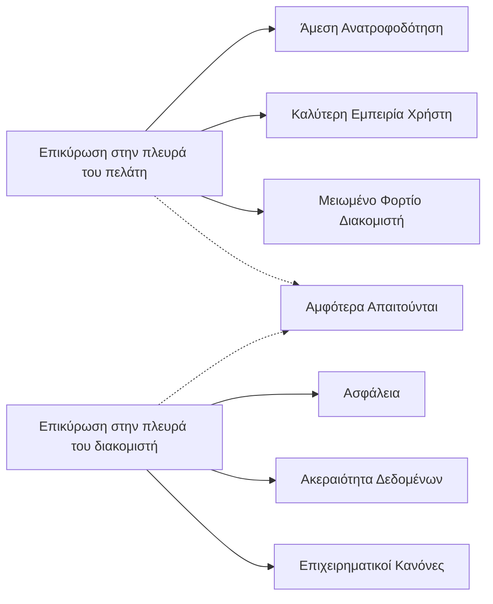
**Γιατί χρειάζεστε και τα δύο επίπεδα:**
- **Επικύρωση από την πλευρά του πελάτη**: Παρέχει άμεση ανατροφοδότηση και βελτιώνει την εμπειρία χρήστη
- **Επικύρωση από την πλευρά του διακομιστή**: Εξασφαλίζει ασφάλεια και χειρίζεται σύνθετους επιχειρησιακούς κανόνες
- **Συνδυασμένη προσέγγιση**: Δημιουργεί στιβαρές, φιλικές προς τον χρήστη και ασφαλείς εφαρμογές
- **Προοδευτική βελτίωση**: Λειτουργεί ακόμα και όταν το JavaScript είναι απενεργοποιημένο

> 🛡️ **Υπενθύμιση ασφαλείας**: Μην εμπιστεύεστε μόνο την επικύρωση από τον πελάτη! Κακόβουλοι χρήστες μπορούν να παρακάμψουν τους ελέγχους πελάτη, γι' αυτό η επικύρωση διακομιστή είναι απαραίτητη για ασφάλεια και ακεραιότητα δεδομένων.

### ⚡ **Τι Μπορείτε να Κάνετε στα Επόμενα 5 Λεπτά**
- [ ] Δοκιμάστε τη φόρμα σας με μη έγκυρα δεδομένα για να δείτε μήνυματα επικύρωσης
- [ ] Προσπαθήστε να υποβάλετε τη φόρμα με απενεργοποιημένο JavaScript για να δείτε την HTML5 επικύρωση
- [ ] Ανοίξτε τα DevTools του browser και ελέγξτε τα δεδομένα της φόρμας που αποστέλλονται στον server
- [ ] Πειραματιστείτε με διαφορετικούς τύπους εισόδων για να δείτε αλλαγές στο πληκτρολόγιο κινητού

### 🎯 **Τι Μπορείτε να Επιτύχετε Αυτή την Ώρα**
- [ ] Ολοκληρώστε το κουίζ μετά το μάθημα και κατανοήστε τις έννοιες διαχείρισης φόρμας
- [ ] Υλοποιήστε την πρόκληση πλήρους επικύρωσης με ανατροφοδότηση σε πραγματικό χρόνο
- [ ] Προσθέστε CSS στυλ για δημιουργία επαγγελματικών φορμών
- [ ] Δημιουργήστε χειρισμό σφαλμάτων για διπλότυπα ονόματα χρήστη και σφάλματα server
- [ ] Προσθέστε πεδία επιβεβαίωσης κωδικού με αντίστοιχη επικύρωση

### 📅 **Το Εβδομαδιαίο Σχέδιο Εμπέδωσης Φόρμας**
- [ ] Ολοκληρώστε την πλήρη εφαρμογή τράπεζας με προχωρημένα χαρακτηριστικά φόρμας
- [ ] Υλοποιήστε υποβολή αρχείων για φωτογραφίες προφίλ ή έγγραφα
- [ ] Προσθέστε φόρμες πολλαπλών βημάτων με ενδείξεις προόδου και διαχείριση κατάστασης
- [ ] Δημιουργήστε δυναμικές φόρμες που προσαρμόζονται ανάλογα με τις επιλογές χρήστη
- [ ] Υλοποιήστε αυτόματη αποθήκευση και ανάκτηση φόρμας για καλύτερη εμπειρία χρήστη
- [ ] Προσθέστε εξελιγμένη επικύρωση όπως επαλήθευση email και μορφοποίηση τηλεφώνου

### 🌟 **Το Μηνιαίο Σχέδιο Αριστείας Ανάπτυξης Frontend**
- [ ] Δημιουργήστε σύνθετες εφαρμογές φορμών με συνθήκες και ροές εργασίας
- [ ] Μάθετε βιβλιοθήκες και πλαίσια για γρήγορη ανάπτυξη φορμών
- [ ] Εξοικειωθείτε με οδηγίες προσβασιμότητας και αρχές συμμετοχικού σχεδιασμού
- [ ] Υλοποιήστε διεθνοποίηση και τοπικοποίηση για παγκόσμιες φόρμες
- [ ] Δημιουργήστε επαναχρησιμοποιούμενες βιβλιοθήκες εταιρικών φορμών και συστήματα σχεδίασης
- [ ] Συνεισφέρετε σε ανοιχτού κώδικα projects φορμών και μοιραστείτε βέλτιστες πρακτικές

## 🎯 Χρονοδιάγραμμα Δεξιοτήτων Ανάπτυξης Φόρμας

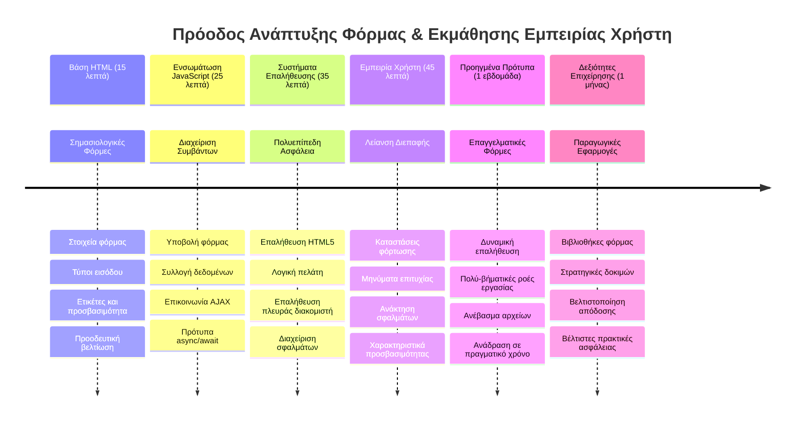
### 🛠️ Περίληψη Εργαλείων Ανάπτυξης Φόρμας

Μετά την ολοκλήρωση αυτού του μαθήματος, έχετε πλέον κατακτήσει:
- **Φόρμες HTML5**: Σημασιολογική δομή, τύπους εισόδου και χαρακτηριστικά προσβασιμότητας
- **Διαχείριση φορμών JavaScript**: Διαχείριση εκδηλώσεων, συλλογή δεδομένων και επικοινωνία AJAX
- **Αρχιτεκτονική επικύρωσης**: Πολύπλευρη επικύρωση για ασφάλεια και εμπειρία χρήστη
- **Ασύγχρονος προγραμματισμός**: Σύγχρονο Fetch API και μοτίβα async/await
- **Διαχείριση σφαλμάτων**: Ολοκληρωμένη διαχείριση σφαλμάτων και συστήματα ανατροφοδότησης
- **Σχεδιασμός εμπειρίας χρήστη**: Καταστάσεις φόρτωσης, μηνύματα επιτυχίας και ανάκαμψη σφαλμάτων
- **Προοδευτική βελτίωση**: Φόρμες που λειτουργούν σε όλους τους browsers και συσκευές

**Εφαρμογές στον πραγματικό κόσμο**: Οι δεξιότητές σας στην ανάπτυξη φορμών ισχύουν άμεσα σε:
- **Εφαρμογές ηλεκτρονικού εμπορίου**: Διαδικασίες ολοκλήρωσης αγοράς, εγγραφή λογαριασμών και φόρμες πληρωμών
- **Επιχειρησιακό λογισμικό**: Συστήματα εισόδου δεδομένων, διεπαφές αναφορών και εφαρμογές ροής εργασίας
- **Διαχείριση περιεχομένου**: Πλατφόρμες δημοσίευσης, περιεχόμενο που δημιουργείται από χρήστες και διοικητικές διεπαφές
- **Χρηματοοικονομικά συστήματα**: Διεπαφές τραπεζών, πλατφόρμες επενδύσεων και συστήματα συναλλαγών
- **Συστήματα υγείας**: Πύλες ασθενών, προγραμματισμός ραντεβού και ιατρικές φόρμες
- **Εκπαιδευτικές πλατφόρμες**: Εγγραφή σε μαθήματα, εργαλεία αξιολόγησης και διαχείρισης μάθησης

**Επαγγελματικές δεξιότητες που αποκτήσατε**: Μπορείτε πλέον να:
- **Σχεδιάζετε** προσβάσιμες φόρμες που λειτουργούν για όλους τους χρήστες, συμπεριλαμβανομένων ατόμων με αναπηρίες
- **Υλοποιείτε** ασφαλή επικύρωση φόρμας που αποτρέπει διαφθορά δεδομένων και ευπάθειες ασφάλειας
- **Δημιουργείτε** ευέλικτες διεπαφές που παρέχουν σαφές feedback και καθοδήγηση
- **Αποσφαλματώνετε** σύνθετες αλληλεπιδράσεις φόρμας χρησιμοποιώντας εργαλεία توسعه browser και ανάλυση δικτύου
- **Βελτιστοποιείτε** τις επιδόσεις φόρμας μέσω αποδοτικής διαχείρισης και στρατηγικών επικύρωσης

**Κατανοήσεις στην Ανάπτυξη Frontend**:
- **Αρχιτεκτονική κατ’ εκδήλωση**: Διαχείριση αλληλεπίδρασης χρήστη και συστήματα απόκρισης
- **Ασύγχρονος προγραμματισμός**: Μη αποκλειστική επικοινωνία με διακομιστή και διαχείριση σφαλμάτων
- **Επικύρωση δεδομένων**: Επαληθεύσεις πελάτη και διακομιστή για ασφάλεια και ακεραιότητα
- **Σχεδιασμός εμπειρίας χρήστη**: Ευφυείς διεπαφές που καθοδηγούν τους χρήστες προς την επιτυχία
- **Μηχανική προσβασιμότητας**: Συμμετοχικός σχεδιασμός που δουλεύει για ποικίλες ανάγκες χρηστών

**Επόμενο επίπεδο**: Είστε έτοιμοι να εξερευνήσετε προχωρημένες βιβλιοθήκες φορμών, να υλοποιήσετε σύνθετους κανόνες επικύρωσης ή να δημιουργήσετε εταιρικά συστήματα συλλογής δεδομένων!

🌟 **Επίτευγμα ξεκλείδωτο**: Έχετε φτιάξει ένα πλήρες σύστημα διαχείρισης φόρμας με επαγγελματική επικύρωση, διαχείριση σφαλμάτων και πρότυπα εμπειρίας χρήστη!

---


---

## Πρόκληση GitHub Copilot Agent 🚀

Χρησιμοποιήστε τη λειτουργία Agent για να ολοκληρώσετε την ακόλουθη πρόκληση:

**Περιγραφή:** Βελτιώστε τη φόρμα εγγραφής με ολοκληρωμένη επικύρωση από την πλευρά του πελάτη και ανατροφοδότηση προς το χρήστη. Αυτή η πρόκληση θα σας βοηθήσει να εξασκηθείτε στην επικύρωση φόρμας, τη διαχείριση σφαλμάτων και τη βελτίωση της εμπειρίας χρήστη με διαδραστικό feedback.
**Προτροπή:** Δημιουργήστε ένα ολοκληρωμένο σύστημα επικύρωσης φόρμας για τη φόρμα εγγραφής που περιλαμβάνει: 1) Άμεση ανατροφοδότηση επικύρωσης για κάθε πεδίο καθώς ο χρήστης πληκτρολογεί, 2) Προσαρμοσμένα μηνύματα επικύρωσης που εμφανίζονται κάτω από κάθε πεδίο εισαγωγής, 3) Πεδίο επιβεβαίωσης κωδικού με επικύρωση ταύτισης, 4) Οπτικούς δείκτες (όπως πράσινα σημάδια επιλογής για έγκυρα πεδία και κόκκινα προειδοποιητικά σύμβολα για μη έγκυρα), 5) Κουμπί υποβολής που ενεργοποιείται μόνο όταν όλες οι επικυρώσεις περάσουν. Χρησιμοποιήστε χαρακτηριστικά επικύρωσης HTML5, CSS για το στυλ των καταστάσεων επικύρωσης, και JavaScript για τη διαδραστική συμπεριφορά.

Μάθετε περισσότερα για το [agent mode](https://code.visualstudio.com/blogs/2025/02/24/introducing-copilot-agent-mode) εδώ.

## 🚀 Πρόκληση

Εμφανίστε μήνυμα λάθους στο HTML αν ο χρήστης υπάρχει ήδη.

Παρακάτω είναι ένα παράδειγμα για το πως μπορεί να μοιάζει η τελική σελίδα σύνδεσης μετά από λίγη διαμόρφωση στυλ:

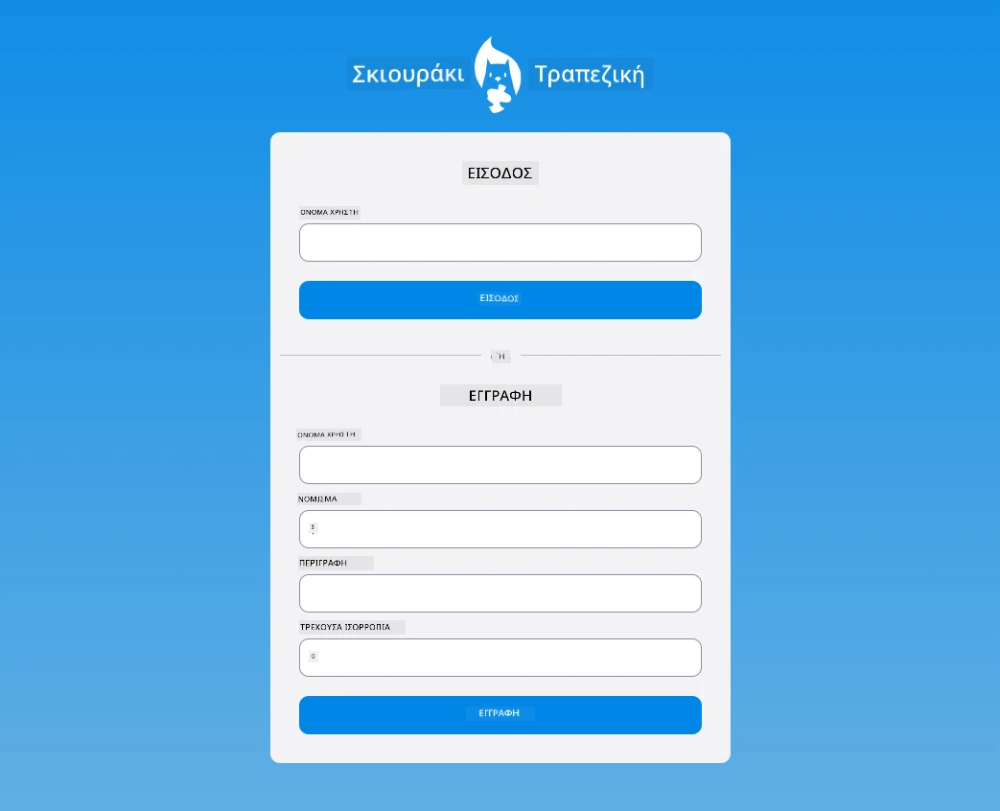

## Μετά την Διάλεξη Quiz

[Μετά την διάλεξη quiz](https://ff-quizzes.netlify.app/web/quiz/44)

## Ανασκόπηση & Αυτοδιδασκαλία

Οι προγραμματιστές έχουν γίνει πολύ δημιουργικοί στις προσπάθειές τους για την κατασκευή φορμών, ειδικά όσον αφορά τις στρατηγικές επικύρωσης. Μάθετε για διαφορετικές ροές φορμών περιηγούμενοι στο [CodePen](https://codepen.com); μπορείτε να βρείτε μερικές ενδιαφέρουσες και εμπνευστικές φόρμες;

## Ανάθεση

[Στυλιζάρετε την εφαρμογή τραπεζικής σας](assignment.md)

---

<!-- CO-OP TRANSLATOR DISCLAIMER START -->
**Αποποίηση Ευθυνών**:  
Αυτό το έγγραφο έχει μεταφραστεί χρησιμοποιώντας την υπηρεσία αυτόματης μετάφρασης AI [Co-op Translator](https://github.com/Azure/co-op-translator). Παρόλο που επιδιώκουμε την ακρίβεια, παρακαλούμε να λάβετε υπόψη ότι οι αυτοματοποιημένες μεταφράσεις ενδέχεται να περιέχουν σφάλματα ή ανακρίβειες. Το πρωτότυπο έγγραφο στη μητρική του γλώσσα πρέπει να θεωρείται η αυθεντική πηγή. Για κρίσιμες πληροφορίες συνιστάται η επαγγελματική μετάφραση από άνθρωπο. Δεν ευθυνόμαστε για τυχόν παρανοήσεις ή λανθασμένες ερμηνείες που προκύπτουν από τη χρήση αυτής της μετάφρασης.
<!-- CO-OP TRANSLATOR DISCLAIMER END -->