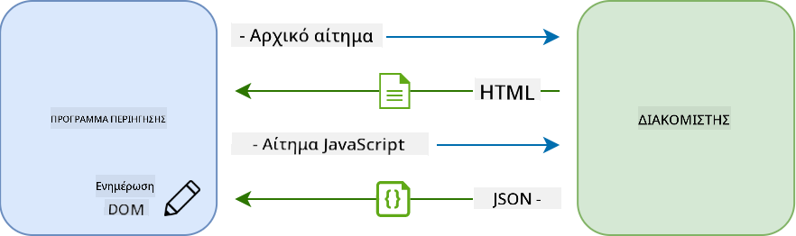
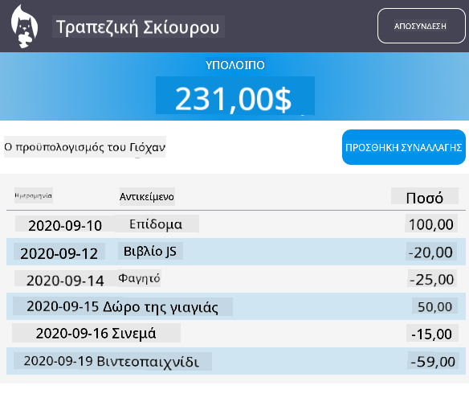

<!--
CO_OP_TRANSLATOR_METADATA:
{
  "original_hash": "89d0df9854ed020f155e94882ae88d4c",
  "translation_date": "2025-08-29T06:59:20+00:00",
  "source_file": "7-bank-project/3-data/README.md",
  "language_code": "el"
}
-->
# Δημιουργία Εφαρμογής Τραπεζικής Μέρος 3: Μέθοδοι Ανάκτησης και Χρήσης Δεδομένων

## Ερωτηματολόγιο Πριν το Μάθημα

[Pre-lecture quiz](https://ff-quizzes.netlify.app/web/quiz/45)

### Εισαγωγή

Στον πυρήνα κάθε διαδικτυακής εφαρμογής βρίσκονται τα *δεδομένα*. Τα δεδομένα μπορούν να έχουν πολλές μορφές, αλλά ο κύριος σκοπός τους είναι πάντα να εμφανίζουν πληροφορίες στον χρήστη. Με τις διαδικτυακές εφαρμογές να γίνονται όλο και πιο διαδραστικές και πολύπλοκες, ο τρόπος με τον οποίο ο χρήστης αποκτά πρόσβαση και αλληλεπιδρά με τις πληροφορίες αποτελεί πλέον βασικό μέρος της ανάπτυξης ιστοσελίδων.

Σε αυτό το μάθημα, θα δούμε πώς να ανακτούμε δεδομένα από έναν διακομιστή ασύγχρονα και να χρησιμοποιούμε αυτά τα δεδομένα για να εμφανίζουμε πληροφορίες σε μια ιστοσελίδα χωρίς να χρειάζεται να φορτώσουμε ξανά το HTML.

### Προαπαιτούμενα

Πρέπει να έχετε δημιουργήσει τη [Φόρμα Εισόδου και Εγγραφής](../2-forms/README.md) της διαδικτυακής εφαρμογής για αυτό το μάθημα. Επίσης, πρέπει να εγκαταστήσετε το [Node.js](https://nodejs.org) και να [εκτελέσετε το API του διακομιστή](../api/README.md) τοπικά ώστε να αποκτήσετε δεδομένα λογαριασμού.

Μπορείτε να δοκιμάσετε ότι ο διακομιστής λειτουργεί σωστά εκτελώντας αυτήν την εντολή σε ένα τερματικό:

```sh
curl http://localhost:5000/api
# -> should return "Bank API v1.0.0" as a result
```

---

## AJAX και ανάκτηση δεδομένων

Οι παραδοσιακές ιστοσελίδες ενημερώνουν το περιεχόμενο που εμφανίζεται όταν ο χρήστης επιλέγει έναν σύνδεσμο ή υποβάλλει δεδομένα μέσω μιας φόρμας, φορτώνοντας ξανά ολόκληρη τη σελίδα HTML. Κάθε φορά που χρειάζονται νέα δεδομένα, ο διακομιστής επιστρέφει μια ολοκαίνουργια σελίδα HTML που πρέπει να επεξεργαστεί ο περιηγητής, διακόπτοντας την τρέχουσα ενέργεια του χρήστη και περιορίζοντας τις αλληλεπιδράσεις κατά τη διάρκεια της φόρτωσης. Αυτή η ροή εργασίας ονομάζεται επίσης *Εφαρμογή Πολλαπλών Σελίδων* ή *MPA*.


Όταν οι διαδικτυακές εφαρμογές άρχισαν να γίνονται πιο πολύπλοκες και διαδραστικές, εμφανίστηκε μια νέα τεχνική που ονομάζεται [AJAX (Asynchronous JavaScript and XML)](https://en.wikipedia.org/wiki/Ajax_(programming)). Αυτή η τεχνική επιτρέπει στις διαδικτυακές εφαρμογές να στέλνουν και να ανακτούν δεδομένα από έναν διακομιστή ασύγχρονα χρησιμοποιώντας JavaScript, χωρίς να χρειάζεται να φορτώσουν ξανά τη σελίδα HTML, με αποτέλεσμα ταχύτερες ενημερώσεις και πιο ομαλές αλληλεπιδράσεις χρήστη. Όταν λαμβάνονται νέα δεδομένα από τον διακομιστή, η τρέχουσα σελίδα HTML μπορεί επίσης να ενημερωθεί με JavaScript χρησιμοποιώντας το [DOM](https://developer.mozilla.org/docs/Web/API/Document_Object_Model) API. Με την πάροδο του χρόνου, αυτή η προσέγγιση εξελίχθηκε σε αυτό που τώρα ονομάζεται [*Εφαρμογή Μίας Σελίδας* ή *SPA*](https://en.wikipedia.org/wiki/Single-page_application).



Όταν το AJAX πρωτοεμφανίστηκε, η μόνη διαθέσιμη API για ασύγχρονη ανάκτηση δεδομένων ήταν το [`XMLHttpRequest`](https://developer.mozilla.org/docs/Web/API/XMLHttpRequest/Using_XMLHttpRequest). Ωστόσο, οι σύγχρονοι περιηγητές πλέον υλοποιούν επίσης την πιο βολική και ισχυρή [`Fetch` API](https://developer.mozilla.org/docs/Web/API/Fetch_API), η οποία χρησιμοποιεί υποσχέσεις (promises) και είναι καλύτερα προσαρμοσμένη για χειρισμό δεδομένων JSON.

> Παρόλο που όλοι οι σύγχρονοι περιηγητές υποστηρίζουν το `Fetch API`, αν θέλετε η διαδικτυακή σας εφαρμογή να λειτουργεί σε παλαιότερους περιηγητές, είναι πάντα καλή ιδέα να ελέγξετε πρώτα τον [πίνακα συμβατότητας στο caniuse.com](https://caniuse.com/fetch).

### Εργασία

Στο [προηγούμενο μάθημα](../2-forms/README.md) υλοποιήσαμε τη φόρμα εγγραφής για τη δημιουργία λογαριασμού. Τώρα θα προσθέσουμε κώδικα για την είσοδο με έναν υπάρχοντα λογαριασμό και την ανάκτηση των δεδομένων του. Ανοίξτε το αρχείο `app.js` και προσθέστε μια νέα συνάρτηση `login`:

```js
async function login() {
  const loginForm = document.getElementById('loginForm')
  const user = loginForm.user.value;
}
```

Ξεκινάμε ανακτώντας το στοιχείο της φόρμας με το `getElementById()`, και στη συνέχεια παίρνουμε το όνομα χρήστη από την είσοδο με το `loginForm.user.value`. Κάθε στοιχείο φόρμας μπορεί να προσπελαστεί μέσω του ονόματός του (που ορίζεται στο HTML χρησιμοποιώντας το χαρακτηριστικό `name`) ως ιδιότητα της φόρμας.

Με παρόμοιο τρόπο όπως κάναμε για την εγγραφή, θα δημιουργήσουμε μια άλλη συνάρτηση για την εκτέλεση αιτήματος στον διακομιστή, αλλά αυτή τη φορά για την ανάκτηση των δεδομένων του λογαριασμού:

```js
async function getAccount(user) {
  try {
    const response = await fetch('//localhost:5000/api/accounts/' + encodeURIComponent(user));
    return await response.json();
  } catch (error) {
    return { error: error.message || 'Unknown error' };
  }
}
```

Χρησιμοποιούμε το `fetch` API για να ζητήσουμε δεδομένα ασύγχρονα από τον διακομιστή, αλλά αυτή τη φορά δεν χρειαζόμαστε επιπλέον παραμέτρους εκτός από το URL που θα καλέσουμε, καθώς απλώς ζητάμε δεδομένα. Από προεπιλογή, το `fetch` δημιουργεί ένα HTTP αίτημα [`GET`](https://developer.mozilla.org/docs/Web/HTTP/Methods/GET), το οποίο είναι αυτό που χρειαζόμαστε εδώ.

✅ Το `encodeURIComponent()` είναι μια συνάρτηση που διαφεύγει ειδικούς χαρακτήρες για το URL. Τι προβλήματα θα μπορούσαμε να έχουμε αν δεν καλέσουμε αυτή τη συνάρτηση και χρησιμοποιήσουμε απευθείας την τιμή `user` στο URL;

Ας ενημερώσουμε τώρα τη συνάρτηση `login` για να χρησιμοποιεί το `getAccount`:

```js
async function login() {
  const loginForm = document.getElementById('loginForm')
  const user = loginForm.user.value;
  const data = await getAccount(user);

  if (data.error) {
    return console.log('loginError', data.error);
  }

  account = data;
  navigate('/dashboard');
}
```

Πρώτα, καθώς το `getAccount` είναι μια ασύγχρονη συνάρτηση, πρέπει να το ταιριάξουμε με τη λέξη-κλειδί `await` για να περιμένουμε το αποτέλεσμα του διακομιστή. Όπως με κάθε αίτημα στον διακομιστή, πρέπει επίσης να χειριστούμε περιπτώσεις σφαλμάτων. Προς το παρόν, θα προσθέσουμε μόνο ένα μήνυμα καταγραφής για να εμφανίσουμε το σφάλμα και θα επιστρέψουμε σε αυτό αργότερα.

Στη συνέχεια, πρέπει να αποθηκεύσουμε τα δεδομένα κάπου ώστε να μπορούμε να τα χρησιμοποιήσουμε αργότερα για να εμφανίσουμε τις πληροφορίες του πίνακα ελέγχου. Επειδή η μεταβλητή `account` δεν υπάρχει ακόμα, θα δημιουργήσουμε μια καθολική μεταβλητή στην κορυφή του αρχείου μας:

```js
let account = null;
```

Αφού αποθηκευτούν τα δεδομένα του χρήστη σε μια μεταβλητή, μπορούμε να μεταβούμε από τη σελίδα *login* στη σελίδα *dashboard* χρησιμοποιώντας τη συνάρτηση `navigate()` που έχουμε ήδη.

Τέλος, πρέπει να καλέσουμε τη συνάρτηση `login` όταν υποβάλλεται η φόρμα εισόδου, τροποποιώντας το HTML:

```html
<form id="loginForm" action="javascript:login()">
```

Δοκιμάστε ότι όλα λειτουργούν σωστά εγγράφοντας έναν νέο λογαριασμό και προσπαθώντας να συνδεθείτε χρησιμοποιώντας τον ίδιο λογαριασμό.

Πριν προχωρήσουμε στο επόμενο μέρος, μπορούμε επίσης να ολοκληρώσουμε τη συνάρτηση `register` προσθέτοντας αυτό στο τέλος της συνάρτησης:

```js
account = result;
navigate('/dashboard');
```

✅ Γνωρίζατε ότι από προεπιλογή, μπορείτε να καλείτε APIs διακομιστή μόνο από τον *ίδιο τομέα και θύρα* με τη σελίδα που βλέπετε; Αυτός είναι ένας μηχανισμός ασφαλείας που επιβάλλεται από τους περιηγητές. Αλλά περιμένετε, η διαδικτυακή μας εφαρμογή εκτελείται στο `localhost:3000` ενώ το API του διακομιστή εκτελείται στο `localhost:5000`, γιατί λειτουργεί; Χρησιμοποιώντας μια τεχνική που ονομάζεται [Cross-Origin Resource Sharing (CORS)](https://developer.mozilla.org/docs/Web/HTTP/CORS), είναι δυνατόν να εκτελούνται αιτήματα HTTP μεταξύ διαφορετικών προελεύσεων αν ο διακομιστής προσθέσει ειδικές κεφαλίδες στην απάντηση, επιτρέποντας εξαιρέσεις για συγκεκριμένους τομείς.

> Μάθετε περισσότερα για τα APIs παρακολουθώντας αυτό το [μάθημα](https://docs.microsoft.com/learn/modules/use-apis-discover-museum-art/?WT.mc_id=academic-77807-sagibbon)

## Ενημέρωση HTML για εμφάνιση δεδομένων

Τώρα που έχουμε τα δεδομένα του χρήστη, πρέπει να ενημερώσουμε το υπάρχον HTML για να τα εμφανίσουμε. Ήδη γνωρίζουμε πώς να ανακτούμε ένα στοιχείο από το DOM χρησιμοποιώντας για παράδειγμα το `document.getElementById()`. Αφού έχετε ένα βασικό στοιχείο, εδώ είναι μερικά APIs που μπορείτε να χρησιμοποιήσετε για να το τροποποιήσετε ή να προσθέσετε παιδικά στοιχεία σε αυτό:

- Χρησιμοποιώντας την ιδιότητα [`textContent`](https://developer.mozilla.org/docs/Web/API/Node/textContent) μπορείτε να αλλάξετε το κείμενο ενός στοιχείου. Σημειώστε ότι η αλλαγή αυτής της τιμής αφαιρεί όλα τα παιδιά του στοιχείου (αν υπάρχουν) και τα αντικαθιστά με το παρεχόμενο κείμενο. Ως εκ τούτου, είναι επίσης μια αποτελεσματική μέθοδος για την αφαίρεση όλων των παιδιών ενός δεδομένου στοιχείου αναθέτοντας μια κενή συμβολοσειρά `''` σε αυτό.

- Χρησιμοποιώντας το [`document.createElement()`](https://developer.mozilla.org/docs/Web/API/Document/createElement) μαζί με τη μέθοδο [`append()`](https://developer.mozilla.org/docs/Web/API/ParentNode/append) μπορείτε να δημιουργήσετε και να επισυνάψετε ένα ή περισσότερα νέα παιδικά στοιχεία.

✅ Χρησιμοποιώντας την ιδιότητα [`innerHTML`](https://developer.mozilla.org/docs/Web/API/Element/innerHTML) ενός στοιχείου είναι επίσης δυνατό να αλλάξετε τα HTML περιεχόμενά του, αλλά αυτή πρέπει να αποφεύγεται καθώς είναι ευάλωτη σε επιθέσεις [cross-site scripting (XSS)](https://developer.mozilla.org/docs/Glossary/Cross-site_scripting).

### Εργασία

Πριν προχωρήσουμε στην οθόνη του πίνακα ελέγχου, υπάρχει κάτι ακόμα που πρέπει να κάνουμε στη σελίδα *login*. Προς το παρόν, αν προσπαθήσετε να συνδεθείτε με ένα όνομα χρήστη που δεν υπάρχει, εμφανίζεται ένα μήνυμα στην κονσόλα αλλά για έναν κανονικό χρήστη τίποτα δεν αλλάζει και δεν ξέρετε τι συμβαίνει.

Ας προσθέσουμε ένα στοιχείο κράτησης θέσης στη φόρμα εισόδου όπου μπορούμε να εμφανίσουμε ένα μήνυμα σφάλματος αν χρειαστεί. Ένα καλό μέρος θα ήταν ακριβώς πριν το κουμπί εισόδου `<button>`:

```html
...
<div id="loginError"></div>
<button>Login</button>
...
```

Αυτό το στοιχείο `<div>` είναι κενό, που σημαίνει ότι τίποτα δεν θα εμφανίζεται στην οθόνη μέχρι να προσθέσουμε κάποιο περιεχόμενο σε αυτό. Του δίνουμε επίσης ένα `id` ώστε να μπορούμε να το ανακτήσουμε εύκολα με JavaScript.

Επιστρέψτε στο αρχείο `app.js` και δημιουργήστε μια νέα βοηθητική συνάρτηση `updateElement`:

```js
function updateElement(id, text) {
  const element = document.getElementById(id);
  element.textContent = text;
}
```

Αυτή είναι αρκετά απλή: δεδομένου ενός *id* στοιχείου και *κειμένου*, θα ενημερώσει το περιεχόμενο κειμένου του στοιχείου DOM με το αντίστοιχο `id`. Ας χρησιμοποιήσουμε αυτή τη μέθοδο αντί για το προηγούμενο μήνυμα σφάλματος στη συνάρτηση `login`:

```js
if (data.error) {
  return updateElement('loginError', data.error);
}
```

Τώρα αν προσπαθήσετε να συνδεθείτε με έναν μη έγκυρο λογαριασμό, θα πρέπει να δείτε κάτι σαν αυτό:


Τώρα έχουμε κείμενο σφάλματος που εμφανίζεται οπτικά, αλλά αν το δοκιμάσετε με έναν αναγνώστη οθόνης θα παρατηρήσετε ότι τίποτα δεν ανακοινώνεται. Για να ανακοινωθεί το κείμενο που προστίθεται δυναμικά σε μια σελίδα από τους αναγνώστες οθόνης, θα χρειαστεί να χρησιμοποιήσει κάτι που ονομάζεται [Live Region](https://developer.mozilla.org/docs/Web/Accessibility/ARIA/ARIA_Live_Regions). Εδώ θα χρησιμοποιήσουμε έναν συγκεκριμένο τύπο live region που ονομάζεται alert:

```html
<div id="loginError" role="alert"></div>
```

Υλοποιήστε την ίδια συμπεριφορά για τα σφάλματα της συνάρτησης `register` (μην ξεχάσετε να ενημερώσετε το HTML).

## Εμφάνιση πληροφοριών στον πίνακα ελέγχου

Χρησιμοποιώντας τις ίδιες τεχνικές που μόλις είδαμε, θα φροντίσουμε επίσης να εμφανίσουμε τις πληροφορίες του λογαριασμού στη σελίδα του πίνακα ελέγχου.

Αυτό είναι το πώς μοιάζει ένα αντικείμενο λογαριασμού που λαμβάνεται από τον διακομιστή:

```json
{
  "user": "test",
  "currency": "$",
  "description": "Test account",
  "balance": 75,
  "transactions": [
    { "id": "1", "date": "2020-10-01", "object": "Pocket money", "amount": 50 },
    { "id": "2", "date": "2020-10-03", "object": "Book", "amount": -10 },
    { "id": "3", "date": "2020-10-04", "object": "Sandwich", "amount": -5 }
  ],
}
```

> Σημείωση: για να κάνετε τη ζωή σας ευκολότερη, μπορείτε να χρησιμοποιήσετε τον προϋπάρχοντα λογαριασμό `test` που είναι ήδη γεμάτος με δεδομένα.

### Εργασία

Ας ξεκινήσουμε αντικαθιστώντας την ενότητα "Balance" στο HTML για να προσθέσουμε στοιχεία κράτησης θέσης:

```html
<section>
  Balance: <span id="balance"></span><span id="currency"></span>
</section>
```

Θα προσθέσουμε επίσης μια νέα ενότητα ακριβώς κάτω για να εμφανίσουμε την περιγραφή του λογαριασμού:

```html
<h2 id="description"></h2>
```

✅ Επειδή η περιγραφή του λογαριασμού λειτουργεί ως τίτλος για το περιεχόμενο από κάτω, έχει μορφοποιηθεί σημασιολογικά ως επικεφαλίδα. Μάθετε περισσότερα για το πώς [η δομή των επικεφαλίδων](https://www.nomensa.com/blog/2017/how-structure-headings-web-accessibility) είναι σημαντική για την προσβασιμότητα και εξετάστε κριτικά τη σελίδα για να προσδιορίσετε τι άλλο θα μπορούσε να είναι επικεφαλίδα.

Στη συνέχεια, θα δημιουργήσουμε μια νέα συνάρτηση στο `app.js` για να γεμίσουμε τα στοιχεία κράτησης θέσης:

```js
function updateDashboard() {
  if (!account) {
    return navigate('/login');
  }

  updateElement('description', account.description);
  updateElement('balance', account.balance.toFixed(2));
  updateElement('currency', account.currency);
}
```

Πρώτα, ελέγχουμε ότι έχουμε τα δεδομένα του λογαριασμού που χρειαζόμαστε πριν προχωρήσουμε. Στη συνέχεια, χρησιμοποιούμε τη συνάρτηση `updateElement()` που δημιουργήσαμε νωρίτερα για να ενημερώσουμε το HTML.

> Για να κάνουμε την εμφάνιση του υπολοίπου πιο όμορφη, χρησιμοποιούμε τη μέθοδο [`toFixed(2)`](https://developer.mozilla.org/docs/Web/JavaScript/Reference/Global_Objects/Number/toFixed) για να εμφανίσουμε την τιμή με 2 δεκαδικά ψηφία.

Τώρα πρέπει να καλέσουμε τη συνάρτηση `updateDashboard()` κάθε φορά που φορτώνεται η σελίδα του πίνακα ελέγχου. Αν έχετε ήδη ολοκληρώσει την [εργασία του μαθήματος 1](../1-template-route/assignment.md) αυτό θα πρέπει να είναι απλό, διαφορετικά μπορείτε να χρησιμοποιήσετε την παρακάτω υλοποίηση.

Προσθέστε αυτόν τον κώδικα στο τέλος της συνάρτησης `updateRoute()`:

```js
if (typeof route.init === 'function') {
  route.init();
}
```

Και ενημερώστε τον ορισμό των διαδρομών με:

```js
const routes = {
  '/login': { templateId: 'login' },
  '/dashboard': { templateId: 'dashboard', init: updateDashboard }
};
```

Με αυτήν την αλλαγή, κάθε φορά που εμφανίζεται η σελίδα του πίνακα ελέγχου, καλείται η συνάρτηση `updateDashboard()`. Μετά από μια σύνδεση, θα πρέπει τότε να μπορείτε να δείτε το υπόλοιπο του λογαριασμού, το νόμισμα και την περιγραφή.

## Δημιουργία γραμμών πίνακα δυναμικά με
Αν προσπαθήσετε να συνδεθείτε χρησιμοποιώντας τον λογαριασμό `test`, θα πρέπει τώρα να δείτε μια λίστα συναλλαγών στον πίνακα ελέγχου 🎉.

---

## 🚀 Πρόκληση

Συνεργαστείτε για να κάνετε τη σελίδα του πίνακα ελέγχου να μοιάζει με μια πραγματική εφαρμογή τραπεζικής. Αν έχετε ήδη διαμορφώσει την εφαρμογή σας, δοκιμάστε να χρησιμοποιήσετε [media queries](https://developer.mozilla.org/docs/Web/CSS/Media_Queries) για να δημιουργήσετε έναν [responsive σχεδιασμό](https://developer.mozilla.org/docs/Web/Progressive_web_apps/Responsive/responsive_design_building_blocks) που να λειτουργεί καλά τόσο σε επιτραπέζιους υπολογιστές όσο και σε κινητές συσκευές.

Ακολουθεί ένα παράδειγμα μιας διαμορφωμένης σελίδας πίνακα ελέγχου:



## Κουίζ μετά το μάθημα

[Κουίζ μετά το μάθημα](https://ff-quizzes.netlify.app/web/quiz/46)

## Ανάθεση

[Αναδιαμορφώστε και σχολιάστε τον κώδικά σας](assignment.md)

---

**Αποποίηση Ευθύνης**:  
Αυτό το έγγραφο έχει μεταφραστεί χρησιμοποιώντας την υπηρεσία αυτόματης μετάφρασης [Co-op Translator](https://github.com/Azure/co-op-translator). Παρόλο που καταβάλλουμε προσπάθειες για ακρίβεια, παρακαλούμε να έχετε υπόψη ότι οι αυτόματες μεταφράσεις ενδέχεται να περιέχουν σφάλματα ή ανακρίβειες. Το πρωτότυπο έγγραφο στη μητρική του γλώσσα θα πρέπει να θεωρείται η αυθεντική πηγή. Για κρίσιμες πληροφορίες, συνιστάται επαγγελματική ανθρώπινη μετάφραση. Δεν φέρουμε ευθύνη για τυχόν παρεξηγήσεις ή εσφαλμένες ερμηνείες που προκύπτουν από τη χρήση αυτής της μετάφρασης.