<!--
CO_OP_TRANSLATOR_METADATA:
{
  "original_hash": "86ee5069f27ea3151389d8687c95fac9",
  "translation_date": "2026-01-06T20:58:24+00:00",
  "source_file": "7-bank-project/3-data/README.md",
  "language_code": "el"
}
-->
# Δημιουργία εφαρμογής τραπεζικής Μέρος 3: Μέθοδοι ανάκτησης και χρήσης δεδομένων

Σκεφτείτε τον υπολογιστή του Enterprise στο Star Trek - όταν ο Καπετάνιος Πικάρντ ζητά την κατάσταση του πλοίου, οι πληροφορίες εμφανίζονται αμέσως χωρίς ολόκληρο το περιβάλλον να κλείνει και να ξαναχτίζεται. Αυτή η αδιάλειπτη ροή πληροφοριών είναι ακριβώς αυτό που χτίζουμε εδώ με τη δυναμική ανάκτηση δεδομένων.

Προς το παρόν, η τραπεζική σας εφαρμογή μοιάζει με μια τυπωμένη εφημερίδα - ενημερωτική αλλά στατική. Θα την μετατρέψουμε σε κάτι περισσότερο σαν τον έλεγχο αποστολών της NASA, όπου τα δεδομένα ρέουν συνεχώς και ενημερώνονται σε πραγματικό χρόνο χωρίς να διακόπτουν τη ροή εργασίας του χρήστη.

Θα μάθετε πώς να επικοινωνείτε με διακομιστές ασύγχρονα, να χειρίζεστε δεδομένα που φτάνουν σε διαφορετικές στιγμές και να μετασχηματίζετε τις ακατέργαστες πληροφορίες σε κάτι ουσιαστικό για τους χρήστες σας. Αυτή είναι η διαφορά μεταξύ ενός demo και ενός λογισμικού έτοιμου για παραγωγή.

## ⚡ Τι μπορείτε να κάνετε στα επόμενα 5 λεπτά

**Γρήγορη Διαδρομή Εκκίνησης για Απασχολημένους Προγραμματιστές**

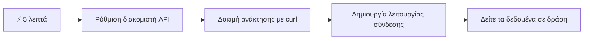
- **Λεπτό 1-2**: Ξεκινήστε τον API διακομιστή σας (`cd api && npm start`) και δοκιμάστε τη σύνδεση  
- **Λεπτό 3**: Δημιουργήστε μια βασική συνάρτηση `getAccount()` χρησιμοποιώντας fetch  
- **Λεπτό 4**: Συνδέστε τη φόρμα σύνδεσης με `action="javascript:login()"`  
- **Λεπτό 5**: Δοκιμάστε τη σύνδεση και δείτε τα δεδομένα του λογαριασμού να εμφανίζονται στην κονσόλα  

**Γρήγορες Δοκιμαστικές Εντολές**:  
```bash
# Επαλήθευση ότι το API λειτουργεί
curl http://localhost:5000/api

# Δοκιμή ανάκτησης δεδομένων λογαριασμού
curl http://localhost:5000/api/accounts/test
```
  
**Γιατί είναι σημαντικό**: Σε 5 λεπτά θα δείτε τη μαγεία της ασύγχρονης ανάκτησης δεδομένων που τροφοδοτεί κάθε σύγχρονη διαδικτυακή εφαρμογή. Αυτή είναι η βάση που κάνει τις εφαρμογές να φαίνονται γρήγορες και ζωντανές.

## 🗺️ Το ταξίδι μάθησής σας στις διαδικτυακές εφαρμογές που βασίζονται σε δεδομένα

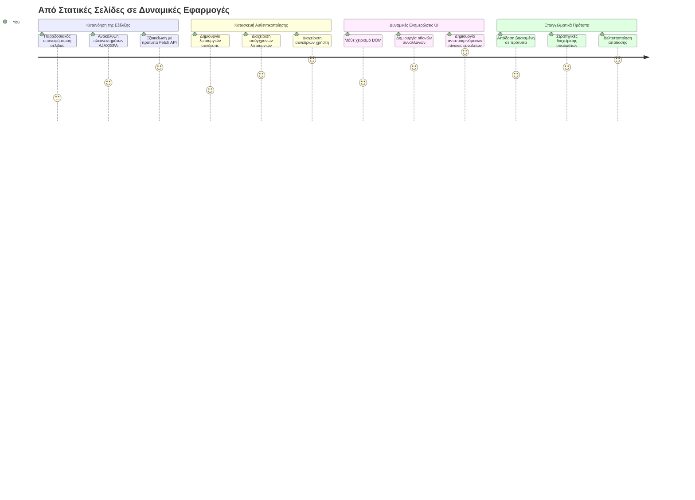
**Προορισμός του ταξιδιού σας**: Μέχρι το τέλος αυτού του μαθήματος, θα κατανοείτε πώς οι σύγχρονες διαδικτυακές εφαρμογές ανακτούν, επεξεργάζονται και εμφανίζουν δεδομένα δυναμικά, δημιουργώντας τις αδιάλειπτες εμπειρίες χρήστη που περιμένουμε από επαγγελματικές εφαρμογές.

## Προ-διάλεξη Quiz

[Quiz προ-διάλεξης](https://ff-quizzes.netlify.app/web/quiz/45)

### Προαπαιτούμενα

Πριν βουτήξετε στην ανάκτηση δεδομένων, βεβαιωθείτε ότι έχετε έτοιμα τα εξής:

- **Προηγούμενο μάθημα**: Ολοκληρώστε τη [φόρμα σύνδεσης και εγγραφής](../2-forms/README.md) - θα χτίσουμε πάνω σε αυτή τη βάση  
- **Τοπικός διακομιστής**: Εγκαταστήστε το [Node.js](https://nodejs.org) και [τρέξτε τον API διακομιστή](../api/README.md) για να παρέχεται δεδομένα λογαριασμού  
- **Σύνδεση API**: Δοκιμάστε τη σύνδεση του διακομιστή σας με αυτή την εντολή:

```bash
curl http://localhost:5000/api
# Αναμενόμενη απάντηση: "Τράπεζα API v1.0.0"
```
  
Αυτή η γρήγορη δοκιμή διασφαλίζει ότι όλα τα μέρη επικοινωνούν σωστά:  
- Επαληθεύει ότι το Node.js λειτουργεί σωστά στο σύστημά σας  
- Επιβεβαιώνει ότι ο API διακομιστής είναι ενεργός και ανταποκρίνεται  
- Βεβαιώνει ότι η εφαρμογή σας μπορεί να φτάσει τον διακομιστή (σαν να ελέγχετε το ραδιόφωνο πριν από μια αποστολή)

## 🧠 Επισκόπηση οικοσυστήματος διαχείρισης δεδομένων

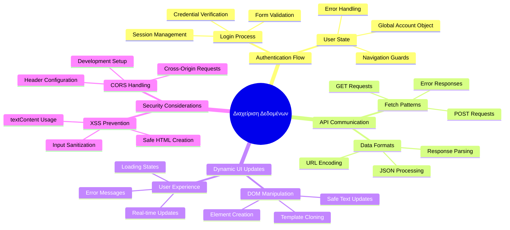
**Βασική Αρχή**: Οι σύγχρονες διαδικτυακές εφαρμογές είναι συστήματα ορχήστρωσης δεδομένων - συντονίζουν μεταξύ διεπαφών χρήστη, API διακομιστών και προγραμμάτων προστασίας του προγράμματος περιήγησης για να δημιουργήσουν αδιάλειπτες, ανταποκρινόμενες εμπειρίες.

---

## Κατανόηση της Ανάκτησης Δεδομένων στις Σύγχρονες Εφαρμογές Web

Ο τρόπος που οι διαδικτυακές εφαρμογές διαχειρίζονται τα δεδομένα έχει εξελιχθεί δραστικά τα τελευταία είκοσι χρόνια. Η κατανόηση αυτής της εξέλιξης θα σας βοηθήσει να εκτιμήσετε γιατί οι σύγχρονες τεχνικές όπως το AJAX και το Fetch API είναι τόσο ισχυρές και γιατί έχουν γίνει απαραίτητα εργαλεία για τους web προγραμματιστές.

Ας εξερευνήσουμε πώς λειτουργούσαν οι παραδοσιακές ιστοσελίδες σε σύγκριση με τις δυναμικές, ανταποκρινόμενες εφαρμογές που δημιουργούμε σήμερα.

### Παραδοσιακές Πολυσελίδες Εφαρμογές (MPA)

Στις πρώτες μέρες του διαδικτύου, κάθε κλικ ήταν σαν να αλλάζετε κανάλι σε μια παλιά τηλεόραση - η οθόνη έσβηνε, και μετά σιγά-σιγά φορτωνόταν το νέο περιεχόμενο. Αυτή ήταν η πραγματικότητα των πρώτων διαδικτυακών εφαρμογών, όπου κάθε αλληλεπίδραση σήμαινε πλήρη ανανέωση της σελίδας από την αρχή.

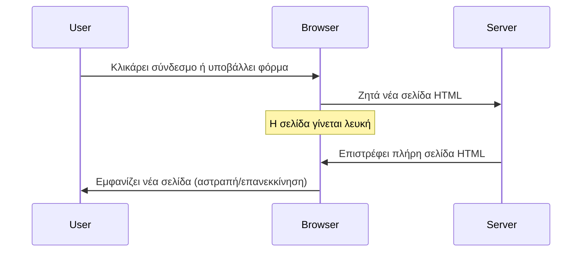


**Γιατί αυτή η προσέγγιση φαινόταν αδέξια:**  
- Κάθε κλικ σήμαινε ανακατασκευή ολόκληρης της σελίδας από την αρχή  
- Οι χρήστες διακόπτονταν στη σκέψη τους από αυτά τα ενοχλητικά αναβοσβήματα  
- Η σύνδεση στο ίντερνετ δούλευε υπερωρίες κατεβάζοντας το ίδιο header και footer ξανά και ξανά  
- Οι εφαρμογές έμοιαζαν περισσότερο με το να κάνεις κλικ σε μια κασέτα αρχείων παρά με τη χρήση λογισμικού  

### Σύγχρονες Μονές Σελίδες Εφαρμογές (SPA)

Το AJAX (Asynchronous JavaScript and XML) άλλαξε αυτό το μοντέλο ριζικά. Όπως ο αρθρωτός σχεδιασμός του Διεθνούς Διαστημικού Σταθμού, όπου οι αστροναύτες μπορούν να αντικαταστήσουν μεμονωμένα εξαρτήματα χωρίς να ξαναφτιάξουν ολόκληρη τη δομή, το AJAX μας επιτρέπει να ενημερώνουμε συγκεκριμένα μέρη μιας ιστοσελίδας χωρίς να φορτώνουμε τα πάντα. Παρόλο που το όνομα αναφέρεται σε XML, σήμερα χρησιμοποιούμε κατά κύριο λόγο JSON, αλλά η βασική αρχή παραμένει: ενημερώνουμε μόνο ό,τι πρέπει να αλλάξει.

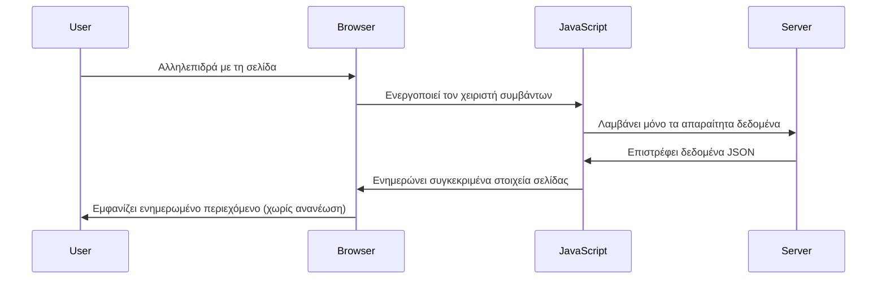


**Γιατί οι SPA φαίνονται πολύ καλύτερες:**  
- Ενημερώνει μόνο τα μέρη που πραγματικά άλλαξαν (έξυπνο, έτσι;)  
- Δεν υπάρχουν πια διακοπές που ενοχλούν - οι χρήστες παραμένουν στη ροή τους  
- Λιγότερα δεδομένα ταξιδεύουν στο δίκτυο, άρα γρηγορότερο φόρτωμα  
- Όλα φαίνονται γρήγορα και ανταποκρινόμενα, όπως οι εφαρμογές στο τηλέφωνό σας  

### Η Εξέλιξη στο Σύγχρονο Fetch API

Τα σύγχρονα προγράμματα περιήγησης παρέχουν το [`Fetch` API](https://developer.mozilla.org/docs/Web/API/Fetch_API), που αντικαθιστά το παλιότερο [`XMLHttpRequest`](https://developer.mozilla.org/docs/Web/API/XMLHttpRequest/Using_XMLHttpRequest). Όπως η διαφορά μεταξύ τηλεγράφου και ηλεκτρονικού ταχυδρομείου, το Fetch API χρησιμοποιεί υποσχέσεις για καθαρότερο ασύγχρονο κώδικα και διαχειρίζεται το JSON με φυσικό τρόπο.

| Feature | XMLHttpRequest | Fetch API |
|---------|----------------|----------|
| **Σύνταξη** | Πολύπλοκη, βασισμένη σε callbacks | Καθαρή, βασισμένη σε promises |
| **Διαχείριση JSON** | Χρειάζεται χειροκίνητη ανάλυση | Ενσωματωμένη μέθοδος `.json()` |
| **Διαχείριση Σφαλμάτων** | Περιορισμένες πληροφορίες σφάλματος | Αναλυτικές λεπτομέρειες σφαλμάτων |
| **Σύγχρονη Υποστήριξη** | Συμβατότητα με legacy | Υποστηρίζει ES6+ promises και async/await |

> 💡 **Συμβατότητα με φυλλομετρητές**: Καλά νέα - το Fetch API δουλεύει σε όλα τα σύγχρονα προγράμματα περιήγησης! Αν ενδιαφέρεστε για συγκεκριμένες εκδόσεις, το [caniuse.com](https://caniuse.com/fetch) έχει την πλήρη ιστορία συμβατότητας.  
>  
**Συμπέρασμα:**  
- Λειτουργεί άψογα σε Chrome, Firefox, Safari και Edge (βασικά όπου είναι οι χρήστες σας)  
- Μόνο ο Internet Explorer χρειάζεται επιπλέον υποστήριξη (και ειλικρινά, έχει έρθει η ώρα να τον αφήσουμε)  
- Σας προετοιμάζει τέλεια για τα κομψά μοτίβα async/await που θα χρησιμοποιήσουμε αργότερα  

### Υλοποίηση Συστήματος Σύνδεσης Χρήστη και Ανάκτησης Δεδομένων

Τώρα ας υλοποιήσουμε το σύστημα σύνδεσης που μετατρέπει την τραπεζική εφαρμογή σας από μια στατική εμφάνιση σε μια λειτουργική εφαρμογή. Όπως τα πρωτόκολλα αυθεντικοποίησης που χρησιμοποιούνται σε ασφαλείς στρατιωτικές εγκαταστάσεις, θα επαληθεύσουμε τα διαπιστευτήρια του χρήστη και μετά θα δώσουμε πρόσβαση σε συγκεκριμένα δεδομένα του.

Θα το χτίσουμε σταδιακά, ξεκινώντας με την βασική αυθεντικοποίηση και μετά προσθέτοντας τις δυνατότητες ανάκτησης δεδομένων.

#### Βήμα 1: Δημιουργία του Θεμελίου της Συνάρτησης Σύνδεσης

Ανοίξτε το αρχείο `app.js` και προσθέστε μια καινούρια συνάρτηση `login`. Αυτή θα χειρίζεται τη διαδικασία αυθεντικοποίησης χρήστη:

```javascript
async function login() {
  const loginForm = document.getElementById('loginForm');
  const user = loginForm.user.value;
}
```
  
**Ας το αναλύσουμε:**  
- Η λέξη-κλειδί `async`; Λέει στον JavaScript "ε, αυτή η συνάρτηση ίσως χρειαστεί να περιμένει"  
- Παίρνουμε τη φόρμα από τη σελίδα (τίποτα ιδιαίτερο, απλά την βρίσκουμε με το ID της)  
- Μετά παίρνουμε το όνομα χρήστη που έγραψε ο χρήστης  
- Ένα ωραίο κόλπο: μπορείς να προσπελάσεις οποιοδήποτε πεδίο φόρμας με το `name` του - χωρίς επιπλέον κλήσεις getElementById!

> 💡 **Πρότυπο πρόσβασης φόρμας**: Κάθε στοιχείο φόρμας είναι προσβάσιμο με το `name` του (ορίζεται στο HTML με το attribute `name`) ως ιδιότητα του στοιχείου φόρμας. Αυτό παρέχει έναν καθαρό, ευανάγνωστο τρόπο να πάρεις δεδομένα από τη φόρμα.

#### Βήμα 2: Δημιουργία της Συνάρτησης Ανάκτησης Δεδομένων Λογαριασμού

Στη συνέχεια, θα δημιουργήσουμε μια ξεχωριστή συνάρτηση για να ανακτούμε δεδομένα λογαριασμού από τον διακομιστή. Ακολουθεί το ίδιο μοτίβο με τη συνάρτηση εγγραφής αλλά επικεντρώνεται στην ανάκτηση δεδομένων:

```javascript
async function getAccount(user) {
  try {
    const response = await fetch('//localhost:5000/api/accounts/' + encodeURIComponent(user));
    return await response.json();
  } catch (error) {
    return { error: error.message || 'Unknown error' };
  }
}
```
  
**Τι πετυχαίνει αυτός ο κώδικας:**  
- **Χρησιμοποιεί** το σύγχρονο API `fetch` για ασύγχρονη ανάκτηση δεδομένων  
- **Κατασκευάζει** ένα URL αιτήματος GET με παράμετρο το όνομα χρήστη  
- **Εφαρμόζει** το `encodeURIComponent()` για ασφαλή διαχείριση ειδικών χαρακτήρων στα URLs  
- **Μετατρέπει** την απόκριση σε μορφή JSON για εύκολη διαχείριση δεδομένων  
- **Χειρίζεται** ευγενικά τα σφάλματα επιστρέφοντας ένα αντικείμενο λάθους αντί να καταρρεύσει  

> ⚠️ **Σημείωση Ασφαλείας**: Η λειτουργία `encodeURIComponent()` διαχειρίζεται ειδικούς χαρακτήρες στα URLs. Όπως τα συστήματα κωδικοποίησης στις ναυτικές επικοινωνίες, διασφαλίζει ότι το μήνυμά σας φτάνει ακριβώς όπως πρέπει, αποτρέποντας παρερμηνείες χαρακτήρων όπως το "#" ή "&".  
>  
**Γιατί αυτό είναι σημαντικό:**  
- Αποτρέπει τους ειδικούς χαρακτήρες από το να σπάσουν το URL  
- Προστατεύει από επιθέσεις χειρισμού URL  
- Εξασφαλίζει ότι ο διακομιστής λαμβάνει τα σωστά δεδομένα  
- Ακολουθεί πρακτικές ασφαλούς κώδικα  

#### Κατανόηση των HTTP GET Αιτήσεων

Κάτι που ίσως σας εκπλήξει: όταν χρησιμοποιείτε `fetch` χωρίς επιπλέον επιλογές, αυτόματα δημιουργεί μια αίτηση [`GET`](https://developer.mozilla.org/docs/Web/HTTP/Methods/GET). Αυτό είναι τέλειο για αυτό που κάνουμε - ζητώντας από τον διακομιστή "με ενημερώνεις για τα δεδομένα λογαριασμού αυτού του χρήστη;"

Να σκεφτείτε τις αιτήσεις GET σαν να ζητάτε ευγενικά να δανειστείτε ένα βιβλίο από τη βιβλιοθήκη - ζητάτε να δείτε κάτι που ήδη υπάρχει. Οι αιτήσεις POST (που χρησιμοποιήσαμε στην εγγραφή) είναι περισσότερο σαν να προσθέτετε ένα νέο βιβλίο στη συλλογή.

| Αίτηση GET | Αίτηση POST |
|-------------|-------------|
| **Σκοπός** | Ανάκτηση υπαρχόντων δεδομένων | Αποστολή νέων δεδομένων στον διακομιστή |
| **Παράμετροι** | Στο URL / query string | Στο σώμα του αιτήματος |
| **Caching** | Μπορεί να αποθηκεύεται στην προσωρινή μνήμη | Σπάνια αποθηκεύεται |
| **Ασφάλεια** | Ορατό στο URL / logs | Κρυμμένο στο σώμα του αιτήματος |

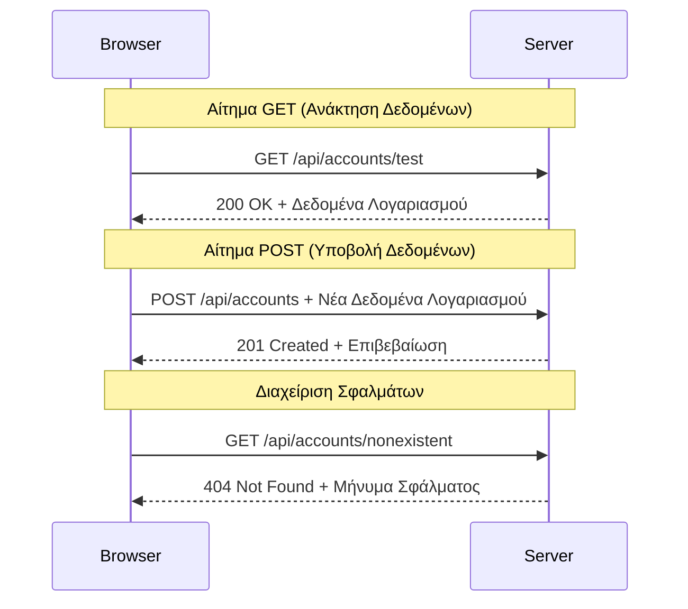
#### Βήμα 3: Ενσωμάτωση Όλων Μαζί

Τώρα στο πιο ικανοποιητικό σημείο - ας συνδέσουμε τη συνάρτηση ανάκτησης λογαριασμού με τη διαδικασία σύνδεσης. Εδώ όλα ενώνονται:

```javascript
async function login() {
  const loginForm = document.getElementById('loginForm');
  const user = loginForm.user.value;
  const data = await getAccount(user);

  if (data.error) {
    return console.log('loginError', data.error);
  }

  account = data;
  navigate('/dashboard');
}
```
  
Αυτή η συνάρτηση ακολουθεί μια ξεκάθαρη αλληλουχία:  
- Βγάζει το όνομα χρήστη από την εισαγωγή της φόρμας  
- Ζητάει τα δεδομένα λογαριασμού από τον διακομιστή  
- Διαχειρίζεται τυχόν σφάλματα που προκύπτουν στη διαδικασία  
- Αποθηκεύει τα δεδομένα του λογαριασμού και μεταβαίνει στον πίνακα ελέγχου μετά από επιτυχία  

> 🎯 **Μοτίβο Async/Await**: Επειδή η `getAccount` είναι ασύγχρονη, χρησιμοποιούμε το `await` για να σταματήσει η εκτέλεση μέχρι να απαντήσει ο διακομιστής. Αυτό αποτρέπει την εκτέλεση κώδικα με ασαφή δεδομένα.

#### Βήμα 4: Δημιουργώντας Χώρο για τα Δεδομένα σας

Η εφαρμογή σας χρειάζεται έναν χώρο για να θυμάται τα δεδομένα του λογαριασμού μόλις φορτωθούν. Σκεφτείτε το σαν τη βραχυπρόθεσμη μνήμη της εφαρμογής - ένα μέρος για να κρατάτε τα δεδομένα του τρέχοντος χρήστη στη διάθεση σας. Προσθέστε αυτή τη γραμμή στην αρχή του αρχείου `app.js`:

```javascript
// Αυτή περιέχει τα δεδομένα λογαριασμού του τρέχοντος χρήστη
let account = null;
```
  
**Γιατί το χρειαζόμαστε:**  
- Κρατά τα δεδομένα του λογαριασμού προσβάσιμα από οπουδήποτε στην εφαρμογή  
- Το ξεκίνημα με `null` σημαίνει "κανείς δεν έχει συνδεθεί ακόμα"  
- Ενημερώνεται όταν κάποιος συνδεθεί ή εγγραφεί επιτυχώς  
- Λειτουργεί σαν μια μεμονωμένη πηγή αλήθειας - χωρίς σύγχυση για το ποιος είναι συνδεδεμένος  

#### Βήμα 5: Συνδέστε τη Φόρμα σας

Τώρα ας συνδέσουμε τη νέα σας συνάρτηση σύνδεσης με τη φόρμα HTML. Ενημερώστε το tag της φόρμας έτσι:

```html
<form id="loginForm" action="javascript:login()">
  <!-- Your existing form inputs -->
</form>
```
  
**Τι κάνει αυτή η μικρή αλλαγή:**  
- Σταματάει τη φόρμα να κάνει την προεπιλεγμένη συμπεριφορά της "επαναφόρτωσης ολόκληρης της σελίδας"  
- Καλεί τη δική σας συνάρτηση JavaScript αντί γι’ αυτό  
- Κρατά όλα ομαλά και μοιάζει με εφαρμογή μονής σελίδας  
- Σας δίνει πλήρη έλεγχο για το τι συμβαίνει όταν ο χρήστης πατά "Σύνδεση"  

#### Βήμα 6: Ενισχύστε τη Συνάρτηση Εγγραφής σας

Για συνέπεια, ενημερώστε τη συνάρτηση `register` ώστε να αποθηκεύει επίσης τα δεδομένα λογαριασμού και να οδηγεί στον πίνακα ελέγχου:

```javascript
// Προσθέστε αυτές τις γραμμές στο τέλος της συνάρτησής σας εγγραφής
account = result;
navigate('/dashboard');
```
  
**Αυτή η βελτίωση παρέχει:**  
- **Αδιάλειπτη** μετάβαση από την εγγραφή στον πίνακα ελέγχου  
- **Συνεπή** εμπειρία χρήστη ανάμεσα στις ροές σύνδεσης και εγγραφής  
- **Άμεση** πρόσβαση στα δεδομένα λογαριασμού μετά την επιτυχή εγγραφή  

#### Δοκιμάστε την Υλοποίησή σας

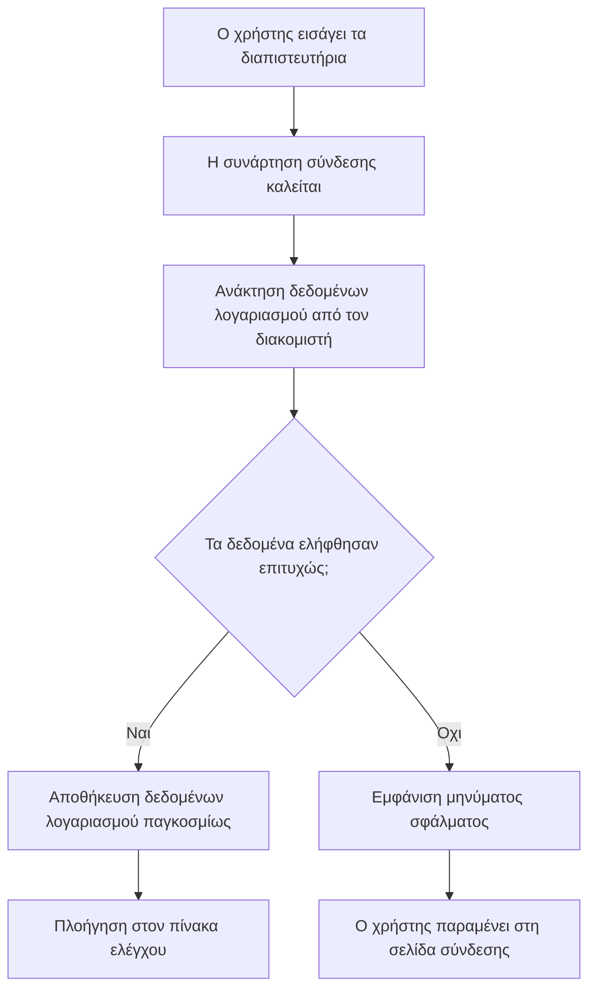
**Ώρα να τη δοκιμάσετε:**  
1. Δημιουργήστε έναν καινούριο λογαριασμό για να βεβαιωθείτε ότι όλα δουλεύουν  
2. Προσπαθήστε να συνδεθείτε με τα ίδια στοιχεία  
3. Ρίξτε μια ματιά στην κονσόλα του προγράμματος περιήγησής σας (F12) αν κάτι φαίνεται περίεργο  
4. Βεβαιωθείτε ότι προσγειώνεστε στον πίνακα ελέγχου μετά από επιτυχή σύνδεση  

Αν κάτι δεν δουλεύει, μην πανικοβάλλεστε! Οι περισσότερες δυσλειτουργίες είναι απλά λάθη πληκτρολόγησης ή παράλειψη εκκίνησης του API διακομιστή.

#### Μια Σύντομη Λέξη για το Μαγικό Cross-Origin

Μπορεί να αναρωτιέστε: "Πώς μιλάει η web εφαρμογή μου με αυτόν τον API διακομιστή όταν τρέχουν σε διαφορετικές θύρες;" Καλή ερώτηση! Αυτό είναι κάτι που όλοι οι web προγραμματιστές συναντούν αργά ή γρήγορα.

> 🔒 **Security Cross-Origin**: Τα προγράμματα περιήγησης επιβάλλουν μια "πολιτική ίδιας προέλευσης" για να αποτρέψουν μη εξουσιοδοτημένη επικοινωνία ανάμεσα σε διαφορετικά domains. Όπως το σύστημα ελέγχου στο Πεντάγωνο, ελέγχουν αν η επικοινωνία είναι εξουσιοδοτημένη πριν επιτρέψουν τη μεταφορά δεδομένων.  
>  
**Στη διάταξή μας:**  
- Η web εφαρμογή σου τρέχει στο `localhost:3000` (διακομιστής ανάπτυξης)  
- Ο API διακομιστής τρέχει στο `localhost:5000` (διακομιστής backend)  
- Ο API διακομιστής περιλαμβάνει [CORS headers](https://developer.mozilla.org/docs/Web/HTTP/CORS) που ρητά επιτρέπουν την επικοινωνία από την web εφαρμογή σου  

Αυτή η ρύθμιση μιμείται την πραγματική ανάπτυξη όπου frontend και backend εφαρμογές τυπικά τρέχουν σε ξεχωριστούς διακομιστές.

> 📚 **Μάθε περισσότερα**: Εμβαθύνετε στις APIs και την ανάκτηση δεδομένων με αυτό το αναλυτικό [Microsoft Learn module για APIs](https://docs.microsoft.com/learn/modules/use-apis-discover-museum-art/?WT.mc_id=academic-77807-sagibbon).

## Ζωντανεύοντας τα Δεδομένα σας στο HTML

Τώρα θα κάνουμε τα δεδομένα που ανακτήθηκαν ορατά στους χρήστες μέσω χειρισμού του DOM. Όπως η διαδικασία εμφάνισης φωτογραφιών σε ένα σκοτεινό θάλαμο, παίρνουμε αόρατα δεδομένα και τα αποδίδουμε σε κάτι που οι χρήστες μπορούν να δουν και να αλληλεπιδράσουν.
Η διαχείριση του DOM είναι η τεχνική που μετατρέπει τις στατικές ιστοσελίδες σε δυναμικές εφαρμογές που ενημερώνουν το περιεχόμενό τους βάσει των αλληλεπιδράσεων των χρηστών και των απαντήσεων του διακομιστή.

### Επιλογή του Κατάλληλου Εργαλείου για τη Δουλειά

Όταν πρόκειται να ενημερώσετε το HTML σας με JavaScript, έχετε πολλές επιλογές. Σκεφτείτε αυτές σαν διαφορετικά εργαλεία σε ένα κιτ εργαλείων - το καθένα ιδανικό για συγκεκριμένες δουλειές:

| Μέθοδος | Για τι είναι εξαιρετική | Πότε να τη χρησιμοποιήσετε | Επίπεδο ασφάλειας |
|--------|------------------------|----------------------------|-------------------|
| `textContent` | Εμφάνιση δεδομένων χρήστη με ασφάλεια | Οποιαδήποτε στιγμή προβάλλετε κείμενο | ✅ Ακλόνητη |
| `createElement()` + `append()` | Δημιουργία σύνθετων διατάξεων | Δημιουργία νέων τμημάτων/λίστες | ✅ Αλεξίσφαιρη |
| `innerHTML` | Ορισμός περιεχομένου HTML | ⚠️ Προσπαθήστε να το αποφεύγετε | ❌ Επικίνδυνη |

#### Ο Ασφαλής Τρόπος για Εμφάνιση Κειμένου: textContent

Η ιδιότητα [`textContent`](https://developer.mozilla.org/docs/Web/API/Node/textContent) είναι ο καλύτερός σας φίλος όταν εμφανίζετε δεδομένα χρήστη. Είναι σαν να έχετε έναν θυρωρό για την ιστοσελίδα σας - τίποτα επιβλαβές δεν περνάει:

```javascript
// Ο ασφαλής, αξιόπιστος τρόπος για να ενημερώνετε κείμενο
const balanceElement = document.getElementById('balance');
balanceElement.textContent = account.balance;
```

**Οφέλη του textContent:**
- Αντιμετωπίζει τα πάντα ως απλό κείμενο (αποτρέπει την εκτέλεση σκριπτ)
- Καθαρίζει αυτόματα το υπάρχον περιεχόμενο
- Αποτελεσματικό για απλές ενημερώσεις κειμένου
- Παρέχει ενσωματωμένη ασφάλεια ενάντια σε κακόβουλο περιεχόμενο

#### Δημιουργία Δυναμικών Στοιχείων HTML

Για πιο σύνθετο περιεχόμενο, συνδυάστε τη μέθοδο [`document.createElement()`](https://developer.mozilla.org/docs/Web/API/Document/createElement) με τη μέθοδο [`append()`](https://developer.mozilla.org/docs/Web/API/ParentNode/append):

```javascript
// Ασφαλής τρόπος για τη δημιουργία νέων στοιχείων
const transactionItem = document.createElement('div');
transactionItem.className = 'transaction-item';
transactionItem.textContent = `${transaction.date}: ${transaction.description}`;
container.append(transactionItem);
```

**Κατανόηση αυτής της προσέγγισης:**
- **Δημιουργεί** νέα στοιχεία DOM προγραμματιστικά
- **Διατηρεί** πλήρη έλεγχο στα χαρακτηριστικά και περιεχόμενο των στοιχείων
- **Επιτρέπει** σύνθετες, εμφωλευμένες δομές στοιχείων
- **Διατηρεί** την ασφάλεια αποχωρίζοντας τη δομή από το περιεχόμενο

> ⚠️ **Ασφαλιστική σκέψη**: Παρόλο που το [`innerHTML`](https://developer.mozilla.org/docs/Web/API/Element/innerHTML) εμφανίζεται σε πολλά tutorials, μπορεί να εκτελέσει ενσωματωμένα σκριπτ. Όπως τα πρωτόκολλα ασφαλείας στο CERN που αποτρέπουν μη εξουσιοδοτημένη εκτέλεση κώδικα, η χρήση των `textContent` και `createElement` παρέχει πιο ασφαλείς εναλλακτικές.
> 
**Κίνδυνοι του innerHTML:**
- Εκτελεί κάθε `<script>` ετικέτα σε δεδομένα χρήστη
- Ευάλωτο σε επιθέσεις ενέσιμου κώδικα (code injection)
- Δημιουργεί πιθανές τρύπες ασφάλειας
- Οι ασφαλέστερες εναλλακτικές που χρησιμοποιούμε παρέχουν αντίστοιχη λειτουργικότητα

### Κάνουμε τα Σφάλματα Φιλικά προς τον Χρήστη

Προς το παρόν, τα σφάλματα σύνδεσης εμφανίζονται μόνο στην κονσόλα του προγράμματος περιήγησης, που είναι αόρατη για τους χρήστες. Όπως η διαφορά ανάμεσα στη διάγνωση του πιλότου και το σύστημα ενημέρωσης επιβατών, πρέπει να επικοινωνούμε τις σημαντικές πληροφορίες μέσω του κατάλληλου καναλιού.

Η υλοποίηση ορατών μηνυμάτων σφάλματος παρέχει στους χρήστες άμεση ανατροφοδότηση σχετικά με το τι πήγε λάθος και πώς να προχωρήσουν.

#### Βήμα 1: Προσθήκη Χώρου για Μηνύματα Σφάλματος

Πρώτα, ας δώσουμε στα μηνύματα σφάλματος έναν χώρο στο HTML σας. Προσθέστε το αυτό ακριβώς πριν από το κουμπί σύνδεσης, ώστε οι χρήστες να το δουν φυσικά:

```html
<!-- This is where error messages will appear -->
<div id="loginError" role="alert"></div>
<button>Login</button>
```

**Τι συμβαίνει εδώ:**
- Δημιουργούμε ένα κενό δοχείο που μένει αόρατο μέχρι να χρειαστεί
- Βρίσκεται εκεί που οι χρήστες κοιτάζουν φυσικά μετά το κλικ στο "Σύνδεση"
- Το `role="alert"` είναι μια ωραία πινελιά για τους αναγνώστες οθόνης - τους λέει "κοίτα, αυτό είναι σημαντικό!"
- Το μοναδικό `id` δίνει εύκολο στόχο στην JavaScript μας

#### Βήμα 2: Δημιουργία Μιας Βοηθητικής Συνάρτησης

Ας φτιάξουμε μια μικρή βοηθητική συνάρτηση που μπορεί να ενημερώσει το κείμενο οποιουδήποτε στοιχείου. Αυτή είναι μία από εκείνες τις "γράψε μία φορά, χρησιμοποίησε παντού" συναρτήσεις που θα σας εξοικονομήσουν χρόνο:

```javascript
function updateElement(id, text) {
  const element = document.getElementById(id);
  element.textContent = text;
}
```

**Οφέλη της συνάρτησης:**
- Απλό interface που απαιτεί μόνο ένα ID στοιχείου και κείμενο
- Εντοπίζει και ενημερώνει με ασφάλεια στοιχεία DOM
- Επαναχρησιμοποιούμενο πρότυπο που μειώνει την επανάληψη κώδικα
- Διατηρεί συνεπή συμπεριφορά ενημέρωσης στην εφαρμογή

#### Βήμα 3: Εμφάνιση Σφαλμάτων εκεί που οι Χρήστες τα Βλέπουν

Τώρα ας αντικαταστήσουμε το κρυφό μήνυμα κονσόλας με κάτι που μπορούν πραγματικά να δουν οι χρήστες. Ενημερώστε τη συνάρτηση σύνδεσης:

```javascript
// Αντί να καταγράφετε μόνο στην κονσόλα, δείξτε στον χρήστη τι δεν πάει καλά
if (data.error) {
  return updateElement('loginError', data.error);
}
```

**Αυτή η μικρή αλλαγή κάνει μεγάλη διαφορά:**
- Τα μηνύματα σφάλματος εμφανίζονται ακριβώς εκεί που κοιτούν οι χρήστες
- Τέλος οι μυστηριώδεις αθόρυβες αποτυχίες
- Οι χρήστες λαμβάνουν άμεση, εφαρμόσιμη ανατροφοδότηση
- Η εφαρμογή σας αρχίζει να φαίνεται επαγγελματική και στοργική

Τώρα, όταν δοκιμάζετε με έναν άκυρο λογαριασμό, θα δείτε ένα χρήσιμο μήνυμα σφάλματος απευθείας στη σελίδα!


#### Βήμα 4: Να Είστε Περιεκτικοί με την Προσβασιμότητα

Κάτι ενδιαφέρον για το `role="alert"` που προσθέσαμε νωρίτερα - δεν είναι απλά διακοσμητικό! Αυτό το μικρό χαρακτηριστικό δημιουργεί αυτό που λέγεται [Live Region](https://developer.mozilla.org/docs/Web/Accessibility/ARIA/ARIA_Live_Regions) που ανακοινώνει αμέσως τις αλλαγές στους αναγνώστες οθόνης:

```html
<div id="loginError" role="alert"></div>
```

**Γιατί έχει σημασία:**
- Οι χρήστες που χρησιμοποιούν αναγνώστες οθόνης ακούν το μήνυμα σφάλματος αμέσως μόλις εμφανιστεί
- Όλοι λαμβάνουν τις ίδιες σημαντικές πληροφορίες, όποιος κι αν είναι ο τρόπος πλοήγησής τους
- Είναι ένας απλός τρόπος να κάνετε την εφαρμογή σας λειτουργική για περισσότερους ανθρώπους
- Δείχνει ότι νοιάζεστε για τη δημιουργία περιεκτικών εμπειριών

Οι μικρές πινελιές σαν κι αυτή ξεχωρίζουν τους καλούς προγραμματιστές από τους εξαιρετικούς!

### 🎯 Παιδαγωγικός Έλεγχος: Πρότυπα Πιστοποίησης

**Σταματήστε και Σκεφτείτε**: Μόλις υλοποιήσατε μια πλήρη ροή πιστοποίησης. Αυτό είναι ένα θεμελιώδες πρότυπο στην ανάπτυξη web.

**Σύντομη Αυτοαξιολόγηση**:
- Μπορείτε να εξηγήσετε γιατί χρησιμοποιούμε async/await για κλήσεις API;
- Τι θα συνέβαινε αν ξεχνούσαμε τη συνάρτηση `encodeURIComponent()`;
- Πώς βελτιώνει η διαχείριση σφαλμάτων την εμπειρία χρήστη;

**Σύνδεση με τον Πραγματικό Κόσμο**: Τα πρότυπα που μάθατε εδώ (ασύγχρονη ανάκτηση δεδομένων, διαχείριση σφαλμάτων, ανατροφοδότηση χρήστη) χρησιμοποιούνται σε κάθε μεγάλη διαδικτυακή εφαρμογή από πλατφόρμες κοινωνικής δικτύωσης έως ιστότοπους ηλεκτρονικού εμπορίου. Κατασκευάζετε δεξιότητες παραγωγής!

**Ερώτηση Πρόκλησης**: Πώς θα τροποποιούσατε αυτό το σύστημα πιστοποίησης για να χειρίζεται πολλούς ρόλους χρηστών (πελάτη, διαχειριστή, ταμία); Σκεφτείτε τη δομή δεδομένων και τις αλλαγές στο UI που θα απαιτούνταν.

#### Βήμα 5: Εφαρμόστε την Ίδια Λογική στη Φόρμα Εγγραφής

Για συνέπεια, υλοποιήστε την ίδια διαχείριση σφαλμάτων στην φόρμα εγγραφής σας:

1. **Προσθέστε** στοιχείο εμφάνισης σφάλματος στο HTML της εγγραφής:
```html
<div id="registerError" role="alert"></div>
```

2. **Ενημερώστε** τη συνάρτηση εγγραφής για να χρησιμοποιεί το ίδιο πρότυπο εμφάνισης σφάλματος:
```javascript
if (data.error) {
  return updateElement('registerError', data.error);
}
```

**Οφέλη της συνεπούς διαχείρισης σφαλμάτων:**
- **Παρέχει** ομοιόμορφη εμπειρία χρήστη σε όλες τις φόρμες
- **Μειώνει** το γνωστικό φορτίο χρησιμοποιώντας οικεία πρότυπα
- **Απλοποιεί** τη συντήρηση με επαναχρησιμοποιούμενο κώδικα
- **Εξασφαλίζει** ότι τα πρότυπα προσβασιμότητας τηρούνται σε ολόκληρη την εφαρμογή

## Δημιουργία του Δυναμικού Πίνακα Ελέγχου σας

Τώρα θα μετατρέψουμε τον στατικό σας πίνακα ελέγχου σε μια δυναμική διεπαφή που εμφανίζει πραγματικά δεδομένα λογαριασμού. Όπως η διαφορά ανάμεσα σε ένα εκτυπωμένο πρόγραμμα πτήσεων και τους ζωντανούς πίνακες αναχωρήσεων στα αεροδρόμια, προχωράμε από στατικές πληροφορίες σε ζωντανές, ανταποκρινόμενες εμφανίσεις.

Χρησιμοποιώντας τις τεχνικές διαχείρισης DOM που μάθατε, θα δημιουργήσουμε έναν πίνακα ελέγχου που ενημερώνεται αυτόματα με τρέχουσες πληροφορίες λογαριασμού.

### Εξοικείωση με τα Δεδομένα σας

Πριν ξεκινήσουμε να χτίζουμε, ας ρίξουμε μια ματιά στον τύπο δεδομένων που στέλνει πίσω ο διακομιστής σας. Όταν κάποιος συνδέεται με επιτυχία, εδώ είναι ο θησαυρός πληροφοριών που θα χρησιμοποιήσετε:

```json
{
  "user": "test",
  "currency": "$",
  "description": "Test account",
  "balance": 75,
  "transactions": [
    { "id": "1", "date": "2020-10-01", "object": "Pocket money", "amount": 50 },
    { "id": "2", "date": "2020-10-03", "object": "Book", "amount": -10 },
    { "id": "3", "date": "2020-10-04", "object": "Sandwich", "amount": -5 }
  ]
}
```

**Αυτή η δομή δεδομένων παρέχει:**
- **`user`**: τέλεια για προσωποποίηση της εμπειρίας ("Καλώς ήρθες ξανά, Σάρα!")
- **`currency`**: διασφαλίζει ότι εμφανίζουμε σωστά ποσά χρημάτων
- **`description`**: ένα φιλικό όνομα για το λογαριασμό
- **`balance`**: το πολύ σημαντικό τρέχον υπόλοιπο
- **`transactions`**: ο πλήρης ιστορικός συναλλαγών με όλες τις λεπτομέρειες

Όλα όσα χρειάζεστε για να δημιουργήσετε έναν επαγγελματικό πίνακα ελέγχου τραπεζικών συναλλαγών!

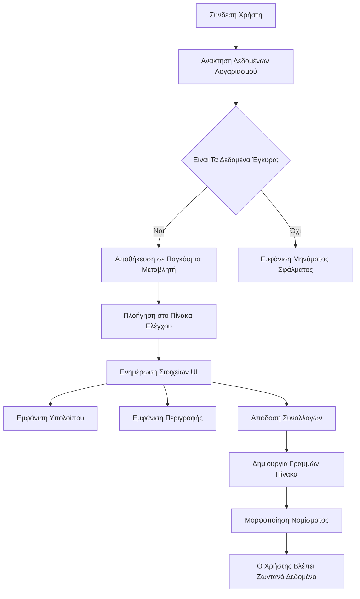
> 💡 **Συμβουλή Επαγγελματία**: Θέλετε να δείτε αμέσως τον πίνακα ελέγχου σας σε δράση; Χρησιμοποιήστε το όνομα χρήστη `test` κατά τη σύνδεση - έρχεται προφορτωμένο με δείγματα δεδομένων ώστε να μπορείτε να δείτε όλα να λειτουργούν χωρίς να χρειάζεται να δημιουργήσετε πρώτα συναλλαγές.
> 
**Γιατί ο δοκιμαστικός λογαριασμός είναι χρήσιμος:**
- Περιλαμβάνει ρεαλιστικά δείγματα δεδομένων ήδη φορτωμένα
- Ιδανικός για να δείτε πώς εμφανίζονται οι συναλλαγές
- Τέλειος για δοκιμές των δυνατοτήτων του πίνακα ελέγχου
- Σας απαλλάσσει από τη χειροκίνητη δημιουργία δοκιμαστικών δεδομένων

### Δημιουργία Στοιχείων Εμφάνισης Πίνακα Ελέγχου

Ας χτίσουμε τη διεπαφή του πίνακα ελέγχου σας βήμα-βήμα, ξεκινώντας με τις πληροφορίες περίληψης λογαριασμού και στη συνέχεια προχωρώντας σε πιο σύνθετα χαρακτηριστικά όπως οι λίστες συναλλαγών.

#### Βήμα 1: Ενημέρωση της Δομής του HTML

Πρώτα, αντικαταστήστε το στατικό τμήμα "Υπόλοιπο" με δυναμικά στοιχεία-θέσεις για τα οποία η JavaScript σας μπορεί να προσθέτει δεδομένα:

```html
<section>
  Balance: <span id="balance"></span><span id="currency"></span>
</section>
```

Στη συνέχεια, προσθέστε μια ενότητα για την περιγραφή του λογαριασμού. Εφόσον αυτή λειτουργεί ως τίτλος για το περιεχόμενο του πίνακα, χρησιμοποιήστε σημασιολογικό HTML:

```html
<h2 id="description"></h2>
```

**Κατανόηση της δομής HTML:**
- **Χρησιμοποιεί** ξεχωριστά στοιχεία `<span>` για το υπόλοιπο και το νόμισμα, για ατομικό έλεγχο
- **Εφαρμόζει** μοναδικά IDs σε κάθε στοιχείο για στόχευση από τη JavaScript
- **Ακολουθεί** σημασιολογικό HTML χρησιμοποιώντας `<h2>` για την περιγραφή του λογαριασμού
- **Δημιουργεί** λογική ιεραρχία για αναγνώστες οθόνης και SEO

> ✅ **Σημείωση Προσβασιμότητας**: Η περιγραφή του λογαριασμού λειτουργεί ως τίτλος για το περιεχόμενο του πίνακα ελέγχου, γι’ αυτό είναι σημασιολογικά επισημασμένη ως επικεφαλίδα. Μάθετε περισσότερα για το πώς η [δομή επικεφαλίδων](https://www.nomensa.com/blog/2017/how-structure-headings-web-accessibility) επηρεάζει την προσβασιμότητα. Μπορείτε να εντοπίσετε άλλα στοιχεία στη σελίδα σας που θα ωφελούνταν από ετικέτες τίτλων;

#### Βήμα 2: Δημιουργία της Συνάρτησης Ενημέρωσης Πίνακα Ελέγχου

Τώρα φτιάξτε μια συνάρτηση που γεμίζει τον πίνακα ελέγχου σας με πραγματικά δεδομένα λογαριασμού:

```javascript
function updateDashboard() {
  if (!account) {
    return navigate('/login');
  }

  updateElement('description', account.description);
  updateElement('balance', account.balance.toFixed(2));
  updateElement('currency', account.currency);
}
```

**Βήμα-βήμα, αυτά κάνει η συνάρτηση:**
- **Επιβεβαιώνει** ότι υπάρχουν δεδομένα λογαριασμού πριν προχωρήσει
- **Ανακατευθύνει** μη πιστοποιημένους χρήστες πίσω στη σελίδα σύνδεσης
- **Ενημερώνει** την περιγραφή λογαριασμού χρησιμοποιώντας τη γενικής χρήσης συνάρτηση `updateElement`
- **Μορφοποιεί** το υπόλοιπο ώστε να εμφανίζει πάντα δύο δεκαδικά ψηφία
- **Εμφανίζει** το κατάλληλο σύμβολο νομίσματος

> 💰 **Μορφοποίηση Χρημάτων**: Η μέθοδος [`toFixed(2)`](https://developer.mozilla.org/docs/Web/JavaScript/Reference/Global_Objects/Number/toFixed) είναι σωτήρας! Διασφαλίζει ότι το υπόλοιπο σας φαίνεται πάντα σαν πραγματικό ποσό - "75.00" αντί μόνο "75". Οι χρήστες σας θα εκτιμήσουν την οικεία μορφοποίηση νομίσματος.

#### Βήμα 3: Βεβαιωθείτε ότι ο Πίνακας Ενημερώνεται

Για να εξασφαλίσετε ότι ο πίνακας ελέγχου ανανεώνεται με τρέχοντα δεδομένα κάθε φορά που κάποιος τον επισκέπτεται, πρέπει να συνδέσουμε τον κώδικα με το σύστημα πλοήγησής σας. Αν ολοκληρώσατε την [ανάθεση του μαθήματος 1](../1-template-route/assignment.md), αυτό θα σας φανεί γνώριμο. Αν όχι, μην ανησυχείτε - εδώ είναι τι χρειάζεστε:

Προσθέστε αυτό στο τέλος της συνάρτησης `updateRoute()` σας:

```javascript
if (typeof route.init === 'function') {
  route.init();
}
```

Έπειτα ενημερώστε τις διαδρομές (routes) σας για να συμπεριλάβουν την αρχικοποίηση του πίνακα:

```javascript
const routes = {
  '/login': { templateId: 'login' },
  '/dashboard': { templateId: 'dashboard', init: updateDashboard }
};
```

**Τι κάνει αυτή η έξυπνη ρύθμιση:**
- Ελέγχει αν μια διαδρομή έχει ειδικό κώδικα αρχικοποίησης
- Εκτελεί αυτό τον κώδικα αυτόματα όταν φορτώνεται η διαδρομή
- Εξασφαλίζει ότι ο πίνακας ελέγχου πάντα εμφανίζει φρέσκα, τρέχοντα δεδομένα
- Κρατάει τον κώδικα δρομολόγησης καθαρό και οργανωμένο

#### Δοκιμή του Πίνακα Ελέγχου

Μετά την υλοποίηση αυτών των αλλαγών, δοκιμάστε τον πίνακα ελέγχου σας:

1. **Συνδεθείτε** με έναν δοκιμαστικό λογαριασμό
2. **Επιβεβαιώστε** ότι μεταφέρεστε στον πίνακα ελέγχου
3. **Ελέγξτε** ότι η περιγραφή λογαριασμού, το υπόλοιπο και το νόμισμα εμφανίζονται σωστά
4. **Δοκιμάστε να αποσυνδεθείτε και να συνδεθείτε ξανά** για να βεβαιωθείτε ότι τα δεδομένα ανανεώνονται σωστά

Ο πίνακας ελέγχου σας θα πρέπει τώρα να εμφανίζει δυναμικά στοιχεία λογαριασμού που ενημερώνονται βάσει των δεδομένων του συνδεδεμένου χρήστη!

## Δημιουργία Έξυπνων Λιστών Συναλλαγών με Πρότυπα

Αντί να δημιουργείτε χειροκίνητα HTML για κάθε συναλλαγή, θα χρησιμοποιήσουμε πρότυπα για να παράγουμε αυτόματα συνεπή μορφοποίηση. Όπως τα τυποποιημένα εξαρτήματα που χρησιμοποιούνται στην κατασκευή διαστημικών σκαφών, τα πρότυπα εξασφαλίζουν ότι κάθε γραμμή συναλλαγής ακολουθεί την ίδια δομή και εμφάνιση.

Αυτή η τεχνική κλιμακώνεται αποδοτικά από λίγες συναλλαγές μέχρι χιλιάδες, διατηρώντας συνεπή απόδοση και παρουσίαση.

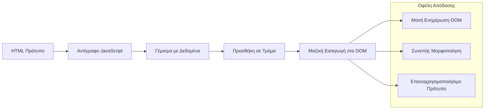
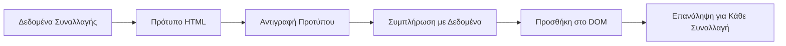
### Βήμα 1: Δημιουργία Προτύπου Συναλλαγών

Καταρχάς, προσθέστε ένα επαναχρησιμοποιούμενο πρότυπο για γραμμές συναλλαγών στο `<body>` του HTML σας:

```html
<template id="transaction">
  <tr>
    <td></td>
    <td></td>
    <td></td>
  </tr>
</template>
```

**Κατανόηση των προτύπων HTML:**
- **Ορίζει** τη δομή για μια μοναδική γραμμή πίνακα
- **Παραμένει** αόρατο μέχρι να κλωνοποιηθεί και να γεμίσει με JavaScript
- **Περιλαμβάνει** τρία κελιά για ημερομηνία, περιγραφή και ποσό
- **Παρέχει** επαναχρησιμοποιούμενο πρότυπο για συνεπή μορφοποίηση

### Βήμα 2: Προετοιμασία του Πίνακα για Δυναμικό Περιεχόμενο

Έπειτα, προσθέστε ένα `id` στο σώμα του πίνακα ώστε η JavaScript να μπορεί εύκολα να το στοχεύει:

```html
<tbody id="transactions"></tbody>
```

**Τι επιτυγχάνει αυτό:**
- **Δημιουργεί** σαφή στόχο για την εισαγωγή γραμμών συναλλαγών
- **Διαχωρίζει** τη δομή του πίνακα από το δυναμικό περιεχόμενο
- **Επιτρέπει** απλό καθάρισμα και επαναγέμισμα των δεδομένων συναλλαγών

### Βήμα 3: Δημιουργία της Συνάρτησης Κατασκευής Γραμμής Συναλλαγής

Τώρα, δημιουργήστε μια συνάρτηση που μετατρέπει δεδομένα συναλλαγής σε στοιχεία HTML:

```javascript
function createTransactionRow(transaction) {
  const template = document.getElementById('transaction');
  const transactionRow = template.content.cloneNode(true);
  const tr = transactionRow.querySelector('tr');
  tr.children[0].textContent = transaction.date;
  tr.children[1].textContent = transaction.object;
  tr.children[2].textContent = transaction.amount.toFixed(2);
  return transactionRow;
}
```

**Ανάλυση της συνάρτησης κατασκευής:**
- **Ανακτά** το στοιχείο προτύπου μέσω ID
- **Κλωνοποιεί** το περιεχόμενο του προτύπου για ασφαλή διαχείριση
- **Επιλέγει** τη γραμμή πίνακα μέσα στο κλωνοποιημένο περιεχόμενο
- **Γεμίζει** κάθε κελί με δεδομένα συναλλαγής
- **Μορφοποιεί** το ποσό για να εμφανίζει τα σωστά δεκαδικά ψηφία
- **Επιστρέφει** τη συμπληρωμένη γραμμή έτοιμη για εισαγωγή

### Βήμα 4: Αποτελεσματική Δημιουργία Πολλών Γραμμών Συναλλαγών

Προσθέστε αυτόν τον κώδικα στη συνάρτηση `updateDashboard()` σας για να εμφανιστούν όλες οι συναλλαγές:

```javascript
const transactionsRows = document.createDocumentFragment();
for (const transaction of account.transactions) {
  const transactionRow = createTransactionRow(transaction);
  transactionsRows.appendChild(transactionRow);
}
updateElement('transactions', transactionsRows);
```

**Κατανόηση αυτής της αποδοτικής προσέγγισης:**
- **Δημιουργεί** ένα τεκμηριωμένο τμήμα (document fragment) για ομαδικές λειτουργίες στο DOM
- **Επαναλαμβάνει** όλες τις συναλλαγές στα δεδομένα λογαριασμού
- **Δημιουργεί** μια γραμμή για κάθε συναλλαγή χρησιμοποιώντας τη συνάρτηση κατασκευής
- **Συγκεντρώνει** όλες τις γραμμές στο τμήμα πριν τις προσθέσει στο DOM
- **Εκτελεί** μια μόνο ενημέρωση DOM αντί για πολλές μεμονωμένες εισαγωγές
> ⚡ **Βελτιστοποίηση Απόδοσης**: [`document.createDocumentFragment()`](https://developer.mozilla.org/docs/Web/API/Document/createDocumentFragment) λειτουργεί σαν τη διαδικασία συναρμολόγησης στη Boeing - τα εξαρτήματα προετοιμάζονται εκτός της κύριας γραμμής και μετά εγκαθίστανται ως μια ολοκληρωμένη μονάδα. Αυτή η προσέγγιση ομαδοποίησης ελαχιστοποιεί τις επανεκτελέσεις του DOM πραγματοποιώντας μια μόνο εισαγωγή αντί για πολλές ατομικές λειτουργίες.

### Βήμα 5: Βελτίωση της Συνάρτησης Ενημέρωσης για Μικτό Περιεχόμενο

Η συνάρτηση `updateElement()` σας χειρίζεται προς το παρόν μόνο περιεχόμενο κειμένου. Ενημερώστε την ώστε να λειτουργεί με κείμενο και κόμβους DOM:

```javascript
function updateElement(id, textOrNode) {
  const element = document.getElementById(id);
  element.textContent = ''; // Αφαιρεί όλα τα παιδιά
  element.append(textOrNode);
}
```

**Βασικές βελτιώσεις σε αυτή την ενημέρωση:**
- **Καθαρίζει** το υπάρχον περιεχόμενο πριν προσθέσει νέο περιεχόμενο
- **Αποδέχεται** είτε συμβολοσειρές κειμένου είτε κόμβους DOM ως παραμέτρους
- **Χρησιμοποιεί** τη μέθοδο [`append()`](https://developer.mozilla.org/docs/Web/API/ParentNode/append) για μεγαλύτερη ευελιξία
- **Διατηρεί** την οπισθοσυμβατότητα με την υπάρχουσα χρήση βασισμένη σε κείμενο

### Δοκιμάζοντας το Dashboard σας

Ώρα για τη στιγμή της αλήθειας! Ας δούμε το δυναμικό σας dashboard σε δράση:

1. Συνδεθείτε χρησιμοποιώντας τον λογαριασμό `test` (έχει διαθέσιμα δείγματα δεδομένων)
2. Μεταβείτε στο dashboard σας
3. Ελέγξτε αν εμφανίζονται οι γραμμές συναλλαγών με σωστό φορμάρισμα
4. Βεβαιωθείτε ότι οι ημερομηνίες, οι περιγραφές και τα ποσά εμφανίζονται σωστά

Αν όλα λειτουργούν, θα δείτε μια πλήρως λειτουργική λίστα συναλλαγών στο dashboard σας! 🎉

**Τι έχετε επιτύχει:**
- Δημιουργήσατε ένα dashboard που κλιμακώνεται σε οποιαδήποτε ποσότητα δεδομένων
- Δημιουργήσατε επαναχρησιμοποιήσιμα πρότυπα για συνεπές φορμάρισμα
- Υλοποιήσατε αποτελεσματικές τεχνικές χειρισμού DOM
- Αναπτύξατε λειτουργικότητα συγκρίσιμη με παραγωγικές τραπεζικές εφαρμογές

Έχετε μετατρέψει επιτυχώς μια στατική ιστοσελίδα σε μια δυναμική διαδικτυακή εφαρμογή.

### 🎯 Παιδαγωγικός Έλεγχος: Δημιουργία Δυναμικού Περιεχομένου

**Κατανόηση Αρχιτεκτονικής**: Έχετε υλοποιήσει μια προηγμένη ροή δεδομένων προς UI που αντανακλά μοτίβα χρησιμοποιούμενα σε frameworks όπως React, Vue και Angular.

**Κύριες Έννοιες που Κατακτήθηκαν**:
- **Απόδοση βασισμένη σε πρότυπα**: Δημιουργία επαναχρησιμοποιήσιμων UI components
- **Τμήματα εγγράφου**: Βελτιστοποίηση της απόδοσης DOM
- **Ασφαλής χειρισμός DOM**: Πρόληψη ευπαθειών ασφαλείας
- **Μετατροπή δεδομένων**: Μετατροπή δεδομένων διακομιστή σε διεπαφές χρήστη

**Σύνδεση με τη Βιομηχανία**: Αυτές οι τεχνικές αποτελούν τη βάση των σύγχρονων frontend frameworks. Το virtual DOM του React, το πρότυπο template του Vue και η αρχιτεκτονική components του Angular βασίζονται σε αυτές τις βασικές αρχές.

**Ερώτηση προς Σκέψη**: Πώς θα επεκτείνατε αυτό το σύστημα ώστε να χειρίζεται ενημερώσεις σε πραγματικό χρόνο (π.χ. νέα transactions να εμφανίζονται αυτόματα); Σκεφτείτε WebSockets ή Server-Sent Events.

---

## 📈 Ο Χρονολόγιος Εμπειρίας στη Διαχείριση Δεδομένων σας

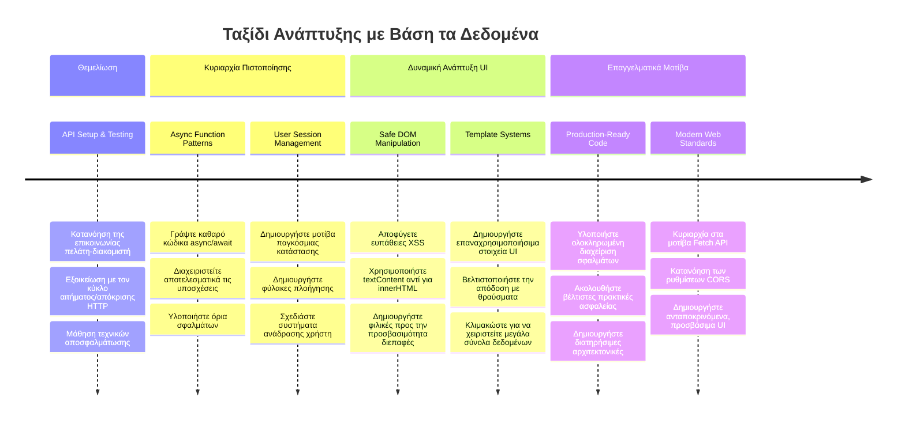
**🎓 Ορόσημο Αποφοίτησης**: Έχετε δημιουργήσει επιτυχώς μια ολοκληρωμένη διαδικτυακή εφαρμογή βασισμένη σε δεδομένα χρησιμοποιώντας μοντέρνα μοτίβα JavaScript. Αυτές οι δεξιότητες μεταφράζονται άμεσα σε frameworks όπως React, Vue ή Angular.

**🔄 Επόμενα Επίπεδα Δυνατοτήτων**:
- Έτοιμοι να εξερευνήσετε frontend frameworks που βασίζονται σε αυτές τις έννοιες
- Προετοιμασμένοι να υλοποιήσετε λειτουργίες σε πραγματικό χρόνο με WebSockets
- Εξοπλισμένοι για να δημιουργήσετε Progressive Web Apps με δυνατότητες offline
- Θέση για να μάθετε προηγμένα μοτίβα διαχείρισης κατάστασης

## Πρόκληση GitHub Copilot Agent 🚀

Χρησιμοποιήστε τη λειτουργία Agent για να ολοκληρώσετε την ακόλουθη πρόκληση:

**Περιγραφή:** Βελτιώστε την τραπεζική εφαρμογή υλοποιώντας λειτουργία αναζήτησης και φίλτρου συναλλαγών που επιτρέπει στους χρήστες να βρουν συγκεκριμένες συναλλαγές βάσει εύρους ημερομηνιών, ποσού ή περιγραφής.

**Προτροπή:** Δημιουργήστε λειτουργία αναζήτησης για την τραπεζική εφαρμογή που περιλαμβάνει: 1) Φόρμα αναζήτησης με πεδία εισόδου για εύρος ημερομηνιών (από/έως), ελάχιστο/μέγιστο ποσό και λέξεις-κλειδιά περιγραφής συναλλαγής, 2) Συνάρτηση `filterTransactions()` που φιλτράρει το array account.transactions βάσει των κριτηρίων αναζήτησης, 3) Ενημέρωση της `updateDashboard()` για εμφάνιση των φιλτραρισμένων αποτελεσμάτων, και 4) Προσθήκη κουμπιού "Clear Filters" για επαναφορά της προβολής. Χρησιμοποιήστε μοντέρνες μεθόδους array της JavaScript όπως `filter()` και χειριστείτε τις περιπτώσεις κενών κριτηρίων αναζήτησης.

Μάθετε περισσότερα για τη [λειτουργία agent](https://code.visualstudio.com/blogs/2025/02/24/introducing-copilot-agent-mode) εδώ.

## 🚀 Πρόκληση

Έτοιμοι να ανεβάσετε την τραπεζική σας εφαρμογή σε υψηλότερο επίπεδο; Ας την κάνουμε να φαίνεται και να αισθάνεται κάτι που θα θέλατε πραγματικά να χρησιμοποιήσετε. Ιδού μερικές ιδέες για να ανάψουν τη φαντασία σας:

**Κάντε την όμορφη**: Προσθέστε CSS στυλ για να μετατρέψετε το λειτουργικό dashboard σε κάτι οπτικά ευχάριστο. Σκεφτείτε καθαρές γραμμές, καλό διάστημα και ίσως ακόμη και διακριτικές κινήσεις.

**Κάντε το responsive**: Δοκιμάστε να χρησιμοποιήσετε [media queries](https://developer.mozilla.org/docs/Web/CSS/Media_Queries) για να δημιουργήσετε ένα [responsive design](https://developer.mozilla.org/docs/Web/Progressive_web_apps/Responsive/responsive_design_building_blocks) που δουλεύει άψογα σε τηλέφωνα, tablets και desktops. Οι χρήστες σας θα σας ευγνωμονούν!

**Προσθέστε λίγη ζωντάνια**: Σκεφτείτε να χρωματίσετε τις συναλλαγές με κώδικα (πράσινο για έσοδα, κόκκινο για έξοδα), να προσθέσετε εικονίδια ή να δημιουργήσετε εφέ hover που κάνουν τη διεπαφή διαδραστική.

 Να πώς θα μπορούσε να μοιάζει ένα τελειοποιημένο dashboard:


Μην νιώθετε ότι πρέπει να το αντιγράψετε ακριβώς - χρησιμοποιήστε το ως έμπνευση και κάντε το δικό σας!

## Quiz μετά το Lecture

[Quiz μετά το lecture](https://ff-quizzes.netlify.app/web/quiz/46)

## Ανάθεση

[Αναδιαρθρώστε και σχολιάστε τον κώδικά σας](assignment.md)

---

<!-- CO-OP TRANSLATOR DISCLAIMER START -->
**Αποποίηση ευθυνών**:  
Αυτό το έγγραφο έχει μεταφραστεί χρησιμοποιώντας την υπηρεσία αυτοματοποιημένης μετάφρασης AI [Co-op Translator](https://github.com/Azure/co-op-translator). Παρόλο που καταβάλλουμε προσπάθειες για ακρίβεια, παρακαλούμε να σημειώσετε ότι οι αυτοματοποιημένες μεταφράσεις μπορεί να περιέχουν σφάλματα ή ανακρίβειες. Το πρωτότυπο έγγραφο στη μητρική του γλώσσα θεωρείται η αυθεντική πηγή. Για κρίσιμες πληροφορίες, συνιστάται επαγγελματική μετάφραση από ανθρώπινο μεταφραστή. Δεν φέρουμε ευθύνη για τυχόν παρεξηγήσεις ή λανθασμένες ερμηνείες που προκύπτουν από τη χρήση αυτής της μετάφρασης.
<!-- CO-OP TRANSLATOR DISCLAIMER END -->