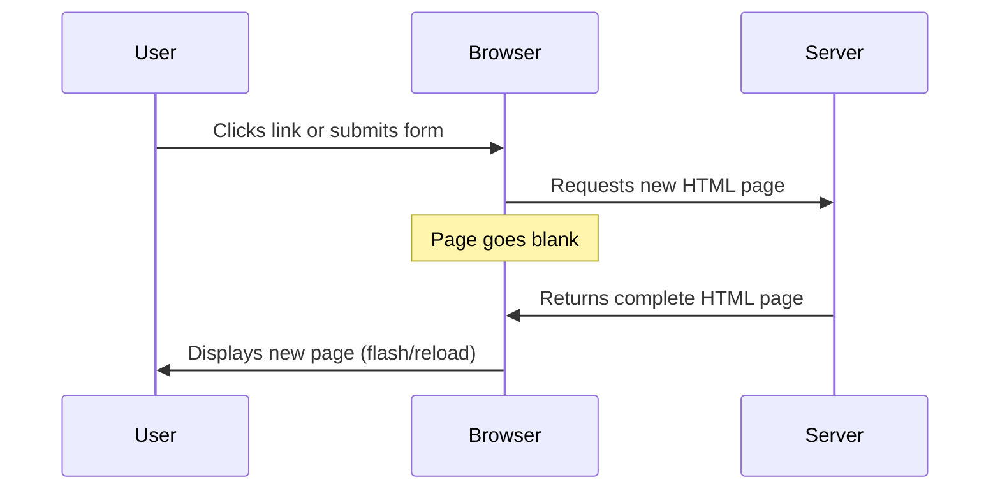
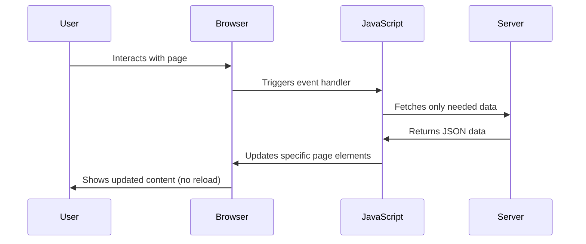
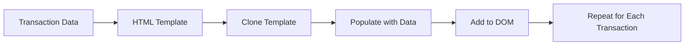

<!--
CO_OP_TRANSLATOR_METADATA:
{
  "original_hash": "2c1164912414820c8efd699b43f64954",
  "translation_date": "2025-10-23T20:23:05+00:00",
  "source_file": "7-bank-project/3-data/README.md",
  "language_code": "el"
}
-->
# Δημιουργία Εφαρμογής Τραπεζικής Πλατφόρμας Μέρος 3: Μέθοδοι Ανάκτησης και Χρήσης Δεδομένων

Σκεφτείτε τον υπολογιστή του Enterprise στο Star Trek - όταν ο Captain Picard ζητά την κατάσταση του πλοίου, οι πληροφορίες εμφανίζονται άμεσα χωρίς να διακόπτεται η λειτουργία της διεπαφής ή να χρειάζεται να ξαναχτιστεί. Αυτή η ομαλή ροή πληροφοριών είναι ακριβώς αυτό που χτίζουμε εδώ με δυναμική ανάκτηση δεδομένων.

Αυτή τη στιγμή, η τραπεζική σας εφαρμογή μοιάζει με μια τυπωμένη εφημερίδα - ενημερωτική αλλά στατική. Θα τη μεταμορφώσουμε σε κάτι που μοιάζει περισσότερο με το κέντρο ελέγχου της NASA, όπου τα δεδομένα ρέουν συνεχώς και ενημερώνονται σε πραγματικό χρόνο χωρίς να διακόπτεται η ροή εργασίας του χρήστη.

Θα μάθετε πώς να επικοινωνείτε ασύγχρονα με διακομιστές, να χειρίζεστε δεδομένα που φτάνουν σε διαφορετικές χρονικές στιγμές και να μετατρέπετε ακατέργαστες πληροφορίες σε κάτι ουσιαστικό για τους χρήστες σας. Αυτή είναι η διαφορά μεταξύ μιας επίδειξης και ενός λογισμικού έτοιμου για παραγωγή.

## Ερωτηματολόγιο πριν τη διάλεξη

[Ερωτηματολόγιο πριν τη διάλεξη](https://ff-quizzes.netlify.app/web/quiz/45)

### Προαπαιτούμενα

Πριν ξεκινήσετε με την ανάκτηση δεδομένων, βεβαιωθείτε ότι έχετε έτοιμα τα εξής:

- **Προηγούμενο μάθημα**: Ολοκληρώστε τη [Φόρμα Εισόδου και Εγγραφής](../2-forms/README.md) - θα βασιστούμε σε αυτήν
- **Τοπικός διακομιστής**: Εγκαταστήστε το [Node.js](https://nodejs.org) και [τρέξτε το API του διακομιστή](../api/README.md) για να παρέχετε δεδομένα λογαριασμού
- **Σύνδεση API**: Δοκιμάστε τη σύνδεση του διακομιστή σας με αυτήν την εντολή:

```bash
curl http://localhost:5000/api
# Expected response: "Bank API v1.0.0"
```

Αυτή η γρήγορη δοκιμή διασφαλίζει ότι όλα τα στοιχεία επικοινωνούν σωστά:
- Επαληθεύει ότι το Node.js λειτουργεί σωστά στο σύστημά σας
- Επιβεβαιώνει ότι ο διακομιστής API είναι ενεργός και ανταποκρίνεται
- Επικυρώνει ότι η εφαρμογή σας μπορεί να φτάσει στον διακομιστή (όπως ο έλεγχος επαφής μέσω ραδιοφώνου πριν από μια αποστολή)

---

## Κατανόηση της Ανάκτησης Δεδομένων στις Σύγχρονες Εφαρμογές Ιστού

Ο τρόπος με τον οποίο οι εφαρμογές ιστού χειρίζονται δεδομένα έχει εξελιχθεί δραματικά τις τελευταίες δύο δεκαετίες. Η κατανόηση αυτής της εξέλιξης θα σας βοηθήσει να εκτιμήσετε γιατί οι σύγχρονες τεχνικές όπως το AJAX και το Fetch API είναι τόσο ισχυρές και γιατί έχουν γίνει απαραίτητα εργαλεία για τους προγραμματιστές ιστού.

Ας εξερευνήσουμε πώς λειτουργούσαν οι παραδοσιακοί ιστότοποι σε σύγκριση με τις δυναμικές, ευέλικτες εφαρμογές που δημιουργούμε σήμερα.

### Παραδοσιακές Εφαρμογές Πολλαπλών Σελίδων (MPA)

Στις πρώτες μέρες του ιστού, κάθε κλικ ήταν σαν να αλλάζετε κανάλια σε μια παλιά τηλεόραση - η οθόνη γινόταν κενή και στη συνέχεια συντονιζόταν αργά στο νέο περιεχόμενο. Αυτή ήταν η πραγματικότητα των πρώτων εφαρμογών ιστού, όπου κάθε αλληλεπίδραση σήμαινε πλήρη ανακατασκευή ολόκληρης της σελίδας από την αρχή.




**Γιατί αυτή η προσέγγιση φαινόταν αδέξια:**
- Κάθε κλικ σήμαινε πλήρη ανακατασκευή της σελίδας από την αρχή
- Οι χρήστες διακόπτονταν από αυτές τις ενοχλητικές αναλαμπές σελίδας
- Η σύνδεσή σας στο διαδίκτυο δούλευε υπερωρίες κατεβάζοντας συνεχώς την ίδια κεφαλίδα και υποσέλιδο
- Οι εφαρμογές έμοιαζαν περισσότερο με το να ψάχνετε σε ένα ντουλάπι αρχείων παρά με τη χρήση λογισμικού

### Σύγχρονες Εφαρμογές Μίας Σελίδας (SPA)

Το AJAX (Asynchronous JavaScript and XML) άλλαξε εντελώς αυτό το παράδειγμα. Όπως ο αρθρωτός σχεδιασμός του Διεθνούς Διαστημικού Σταθμού, όπου οι αστροναύτες μπορούν να αντικαταστήσουν μεμονωμένα εξαρτήματα χωρίς να ξαναχτίσουν ολόκληρη τη δομή, το AJAX μας επιτρέπει να ενημερώνουμε συγκεκριμένα μέρη μιας ιστοσελίδας χωρίς να την επαναφορτώνουμε ολόκληρη. Παρόλο που το όνομα αναφέρει το XML, χρησιμοποιούμε κυρίως JSON σήμερα, αλλά η βασική αρχή παραμένει: ενημερώστε μόνο ό,τι χρειάζεται να αλλάξει.




**Γιατί οι SPA είναι τόσο καλύτερες:**
- Ενημερώνονται μόνο τα μέρη που πραγματικά άλλαξαν (έξυπνο, σωστά;)
- Δεν υπάρχουν πλέον ενοχλητικές διακοπές - οι χρήστες παραμένουν στη ροή τους
- Λιγότερα δεδομένα ταξιδεύουν μέσω του δικτύου, πράγμα που σημαίνει ταχύτερη φόρτωση
- Όλα φαίνονται γρήγορα και ευέλικτα, όπως οι εφαρμογές στο τηλέφωνό σας

### Η Εξέλιξη στο Σύγχρονο Fetch API

Οι σύγχρονοι περιηγητές παρέχουν το [`Fetch` API](https://developer.mozilla.org/docs/Web/API/Fetch_API), το οποίο αντικαθιστά το παλαιότερο [`XMLHttpRequest`](https://developer.mozilla.org/docs/Web/API/XMLHttpRequest/Using_XMLHttpRequest). Όπως η διαφορά μεταξύ της λειτουργίας ενός τηλεγράφου και της χρήσης email, το Fetch API χρησιμοποιεί υποσχέσεις για καθαρότερο ασύγχρονο κώδικα και χειρίζεται το JSON φυσικά.

| Χαρακτηριστικό | XMLHttpRequest | Fetch API |
|----------------|----------------|-----------|
| **Σύνταξη** | Πολύπλοκη με callbacks | Καθαρή με υποσχέσεις |
| **Χειρισμός JSON** | Απαιτεί χειροκίνητη ανάλυση | Ενσωματωμένη μέθοδος `.json()` |
| **Χειρισμός Σφαλμάτων** | Περιορισμένες πληροφορίες σφαλμάτων | Πλήρεις λεπτομέρειες σφαλμάτων |
| **Υποστήριξη** | Συμβατότητα με παλαιότερα | Υποσχέσεις ES6+ και async/await |

> 💡 **Συμβατότητα Περιηγητών**: Καλά νέα - το Fetch API λειτουργεί σε όλους τους σύγχρονους περιηγητές! Αν είστε περίεργοι για συγκεκριμένες εκδόσεις, το [caniuse.com](https://caniuse.com/fetch) έχει την πλήρη ιστορία συμβατότητας.
> 
**Συμπέρασμα:**
- Λειτουργεί εξαιρετικά σε Chrome, Firefox, Safari και Edge (ουσιαστικά παντού όπου βρίσκονται οι χρήστες σας)
- Μόνο ο Internet Explorer χρειάζεται επιπλέον βοήθεια (και ειλικρινά, ήρθε η ώρα να αφήσουμε τον IE πίσω)
- Σας προετοιμάζει τέλεια για τα κομψά μοτίβα async/await που θα χρησιμοποιήσουμε αργότερα

### Υλοποίηση Εισόδου Χρήστη και Ανάκτησης Δεδομένων

Τώρα ας υλοποιήσουμε το σύστημα εισόδου που μετατρέπει την τραπεζική σας εφαρμογή από μια στατική οθόνη σε μια λειτουργική εφαρμογή. Όπως τα πρωτόκολλα αυθεντικοποίησης που χρησιμοποιούνται σε ασφαλείς στρατιωτικές εγκαταστάσεις, θα επαληθεύσουμε τα διαπιστευτήρια του χρήστη και στη συνέχεια θα παρέχουμε πρόσβαση στα συγκεκριμένα δεδομένα του.

Θα το χτίσουμε σταδιακά, ξεκινώντας με τη βασική αυθεντικοποίηση και στη συνέχεια προσθέτοντας τις δυνατότητες ανάκτησης δεδομένων.

#### Βήμα 1: Δημιουργία Βάσης για τη Λειτουργία Εισόδου

Ανοίξτε το αρχείο `app.js` και προσθέστε μια νέα λειτουργία `login`. Αυτή θα χειρίζεται τη διαδικασία αυθεντικοποίησης του χρήστη:

```javascript
async function login() {
  const loginForm = document.getElementById('loginForm');
  const user = loginForm.user.value;
}
```

**Ας το αναλύσουμε:**
- Η λέξη-κλειδί `async` λέει στη JavaScript "αυτή η λειτουργία μπορεί να χρειαστεί να περιμένει για πράγματα"
- Παίρνουμε τη φόρμα από τη σελίδα (τίποτα φανταχτερό, απλά τη βρίσκουμε με το ID της)
- Στη συνέχεια, εξάγουμε ό,τι πληκτρολόγησε ο χρήστης ως όνομα χρήστη
- Ένα έξυπνο κόλπο: μπορείτε να αποκτήσετε πρόσβαση σε οποιοδήποτε στοιχείο φόρμας μέσω του `name` attribute - δεν χρειάζονται επιπλέον κλήσεις getElementById!

> 💡 **Μοτίβο Πρόσβασης Φόρμας**: Κάθε στοιχείο φόρμας μπορεί να προσπελαστεί μέσω του ονόματός του (ορισμένο στο HTML με το `name` attribute) ως ιδιότητα του στοιχείου φόρμας. Αυτό παρέχει έναν καθαρό, ευανάγνωστο τρόπο για την απόκτηση δεδομένων φόρμας.

#### Βήμα 2: Δημιουργία Λειτουργίας Ανάκτησης Δεδομένων Λογαριασμού

Στη συνέχεια, θα δημιουργήσουμε μια ειδική λειτουργία για την ανάκτηση δεδομένων λογαριασμού από τον διακομιστή. Αυτό ακολουθεί το ίδιο μοτίβο με τη λειτουργία εγγραφής σας, αλλά επικεντρώνεται στην ανάκτηση δεδομένων:

```javascript
async function getAccount(user) {
  try {
    const response = await fetch('//localhost:5000/api/accounts/' + encodeURIComponent(user));
    return await response.json();
  } catch (error) {
    return { error: error.message || 'Unknown error' };
  }
}
```

**Αυτός ο κώδικας επιτυγχάνει τα εξής:**
- **Χρησιμοποιεί** το σύγχρονο `fetch` API για ασύγχρονη ανάκτηση δεδομένων
- **Δημιουργεί** URL αιτήματος GET με την παράμετρο ονόματος χρήστη
- **Εφαρμόζει** `encodeURIComponent()` για ασφαλή χειρισμό ειδικών χαρακτήρων σε URLs
- **Μετατρέπει** την απάντηση σε μορφή JSON για εύκολη διαχείριση δεδομένων
- **Χειρίζεται** σφάλματα με χάρη επιστρέφοντας ένα αντικείμενο σφάλματος αντί να καταρρεύσει

> ⚠️ **Σημείωση Ασφαλείας**: Η λειτουργία `encodeURIComponent()` χειρίζεται ειδικούς χαρακτήρες σε URLs. Όπως τα συστήματα κωδικοποίησης στις ναυτικές επικοινωνίες, διασφαλίζει ότι το μήνυμά σας φτάνει ακριβώς όπως προοριζόταν, αποτρέποντας χαρακτήρες όπως "#" ή "&" από το να ερμηνευτούν λανθασμένα.
> 
**Γιατί έχει σημασία:**
- Αποτρέπει ειδικούς χαρακτήρες από το να σπάσουν τα URLs
- Προστατεύει από επιθέσεις χειραγώγησης URLs
- Διασφαλίζει ότι ο διακομιστής λαμβάνει τα δεδομένα όπως προοριζόταν
- Ακολουθεί ασφαλείς πρακτικές κωδικοποίησης

#### Κατανόηση Αιτήσεων HTTP GET

Μια έκπληξη: όταν χρησιμοποιείτε το `fetch` χωρίς επιπλέον επιλογές, δημιουργεί αυτόματα μια αίτηση [`GET`](https://developer.mozilla.org/docs/Web/HTTP/Methods/GET). Αυτό είναι τέλειο για αυτό που κάνουμε - ζητάμε από τον διακομιστή "μπορώ να δω τα δεδομένα λογαριασμού αυτού του χρήστη;"

Σκεφτείτε τις αιτήσεις GET σαν να ζητάτε ευγενικά να δανειστείτε ένα βιβλίο από τη βιβλιοθήκη - ζητάτε να δείτε κάτι που ήδη υπάρχει. Οι αιτήσεις POST (που χρησιμοποιήσαμε για την εγγραφή) μοιάζουν περισσότερο με την υποβολή ενός νέου βιβλίου για να προστεθεί στη συλλογή.

| Αίτηση GET | Αίτηση POST |
|------------|------------|
| **Σκοπός** | Ανάκτηση υπαρχόντων δεδομένων | Αποστολή νέων δεδομένων στον διακομιστή |
| **Παράμετροι** | Στο URL path/query string | Στο σώμα της αίτησης |
| **Caching** | Μπορεί να αποθηκευτεί από περιηγητές | Συνήθως δεν αποθηκεύεται |
| **Ασφάλεια** | Ορατό στο URL/αρχεία καταγραφής | Κρυμμένο στο σώμα της αίτησης |

#### Βήμα 3: Ενοποίηση Όλων

Τώρα για το ικανοποιητικό μέρος - ας συνδέσουμε τη λειτουργία ανάκτησης λογαριασμού με τη διαδικασία εισόδου. Εδώ όλα μπαίνουν στη θέση τους:

```javascript
async function login() {
  const loginForm = document.getElementById('loginForm');
  const user = loginForm.user.value;
  const data = await getAccount(user);

  if (data.error) {
    return console.log('loginError', data.error);
  }

  account = data;
  navigate('/dashboard');
}
```

Αυτή η λειτουργία ακολουθεί μια σαφή ακολουθία:
- Εξάγει το όνομα χρήστη από την είσοδο της φόρμας
- Ζητά τα δεδομένα λογαριασμού του χρήστη από τον διακομιστή
- Χειρίζεται τυχόν σφάλματα που προκύπτουν κατά τη διαδικασία
- Αποθηκεύει τα δεδομένα λογαριασμού και μεταβαίνει στον πίνακα ελέγχου μετά την επιτυχία

> 🎯 **Μοτίβο Async/Await**: Επειδή το `getAccount` είναι μια ασύγχρονη λειτουργία, χρησιμοποιούμε τη λέξη-κλειδί `await` για να σταματήσουμε την εκτέλεση μέχρι να απαντήσει ο διακομιστής. Αυτό αποτρέπει τον κώδικα από το να συνεχίσει με μη ορισμένα δεδομένα.

#### Βήμα 4: Δημιουργία Χώρου για τα Δεδομένα σας

Η εφαρμογή σας χρειάζεται κάπου να θυμάται τις πληροφορίες λογαριασμού μόλις φορτωθούν. Σκεφτείτε το σαν τη βραχυπρόθεσμη μνήμη της εφαρμογής σας - ένα μέρος για να κρατάτε τα δεδομένα του τρέχοντος χρήστη διαθέσιμα. Προσθέστε αυτή τη γραμμή στην κορυφή του αρχείου `app.js`:

```javascript
// This holds the current user's account data
let account = null;
```

**Γιατί το χρειαζόμαστε:**
- Κρατά τα δεδομένα λογαριασμού προσβάσιμα από οπουδήποτε στην εφαρμογή σας
- Ξεκινώντας με `null` σημαίνει "κανείς δεν έχει συνδεθεί ακόμα"
- Ενημερώνεται όταν κάποιος συνδέεται ή εγγράφεται με επιτυχία
- Λειτουργεί ως η μοναδική πηγή αλήθειας - χωρίς σύγχυση για το ποιος είναι συνδεδεμένος

#### Βήμα 5: Σύνδεση της Φόρμας σας

Τώρα ας συνδέσουμε τη νέα λειτουργία εισόδου σας με τη φόρμα HTML σας. Ενημερώστε την ετικέτα της φόρμας σας ως εξής:

```html
<form id="loginForm" action="javascript:login()">
  <!-- Your existing form inputs -->
</form>
```

**Τι κάνει αυτή η μικρή αλλαγή:**
- Σταματά τη φόρμα από το να εκτελεί την προεπιλεγμένη συμπεριφορά "επανεκκίνηση της σελίδας"
- Καλεί τη δική σας προσαρμοσμένη λειτουργία JavaScript
- Διατηρεί τα πάντα ομαλά και σαν εφαρμογή μίας σελίδας
- Σας δίνει πλήρη έλεγχο για το τι συμβαίνει όταν οι χρήστες πατούν "Είσοδος"

#### Βήμα 6: Βελτίωση της Λειτουργίας Εγγραφής σας

Για συνέπεια, ενημερώστε τη λειτουργία `register` ώστε να αποθηκεύει επίσης δεδομένα λογαριασμού και να μεταβαίνει στον πίνακα ελέγχου:

```javascript
// Add these lines at the end of your register function
account = result;
navigate('/dashboard');
```

**Αυτή η βελτίωση παρέχει:**
- **Ομαλή** μετάβαση από την εγγραφή στον πίνακα ελέγχου
- **Συνεπή** εμπειρία χρήστη μεταξύ των ροών εισόδου και εγγραφής
- **Άμεση** πρόσβαση στα δεδομένα λογαριασμού μετά από επιτυχή εγγραφή

#### Δοκιμή της Υλοποίησής σας

@@CODE_BLOCK
Για πιο σύνθετο περιεχόμενο, συνδυάστε τη μέθοδο [`document.createElement()`](https://developer.mozilla.org/docs/Web/API/Document/createElement) με τη μέθοδο [`append()`](https://developer.mozilla.org/docs/Web/API/ParentNode/append):

```javascript
// Safe way to create new elements
const transactionItem = document.createElement('div');
transactionItem.className = 'transaction-item';
transactionItem.textContent = `${transaction.date}: ${transaction.description}`;
container.append(transactionItem);
```

**Κατανόηση αυτής της προσέγγισης:**
- **Δημιουργεί** νέα στοιχεία DOM προγραμματιστικά
- **Παρέχει** πλήρη έλεγχο στις ιδιότητες και το περιεχόμενο των στοιχείων
- **Επιτρέπει** τη δημιουργία σύνθετων, δομημένων στοιχείων
- **Διατηρεί** την ασφάλεια διαχωρίζοντας τη δομή από το περιεχόμενο

> ⚠️ **Σκέψεις για την Ασφάλεια**: Παρόλο που το [`innerHTML`](https://developer.mozilla.org/docs/Web/API/Element/innerHTML) εμφανίζεται σε πολλά μαθήματα, μπορεί να εκτελέσει ενσωματωμένα scripts. Όπως τα πρωτόκολλα ασφαλείας στο CERN που αποτρέπουν την εκτέλεση μη εξουσιοδοτημένου κώδικα, η χρήση των `textContent` και `createElement` παρέχει ασφαλέστερες εναλλακτικές λύσεις.
> 
**Κίνδυνοι του innerHTML:**
- Εκτελεί οποιαδήποτε `<script>` tags στα δεδομένα χρήστη
- Ευάλωτο σε επιθέσεις εισαγωγής κώδικα
- Δημιουργεί πιθανά κενά ασφαλείας
- Οι ασφαλέστερες εναλλακτικές που χρησιμοποιούμε παρέχουν ισοδύναμη λειτουργικότητα

### Κάνοντας τα Σφάλματα Φιλικά προς τον Χρήστη

Αυτή τη στιγμή, τα σφάλματα σύνδεσης εμφανίζονται μόνο στην κονσόλα του browser, η οποία είναι αόρατη στους χρήστες. Όπως η διαφορά μεταξύ των εσωτερικών διαγνωστικών ενός πιλότου και του συστήματος πληροφοριών για τους επιβάτες, πρέπει να επικοινωνούμε σημαντικές πληροφορίες μέσω του κατάλληλου καναλιού.

Η υλοποίηση ορατών μηνυμάτων σφάλματος παρέχει στους χρήστες άμεση ενημέρωση για το τι πήγε στραβά και πώς να προχωρήσουν.

#### Βήμα 1: Προσθέστε Χώρο για Μηνύματα Σφάλματος

Αρχικά, ας δώσουμε στα μηνύματα σφάλματος ένα σημείο στο HTML σας. Προσθέστε το ακριβώς πριν από το κουμπί σύνδεσης, ώστε οι χρήστες να το βλέπουν φυσικά:

```html
<!-- This is where error messages will appear -->
<div id="loginError" role="alert"></div>
<button>Login</button>
```

**Τι συμβαίνει εδώ:**
- Δημιουργούμε ένα κενό container που παραμένει αόρατο μέχρι να χρειαστεί
- Το τοποθετούμε εκεί που οι χρήστες κοιτάζουν φυσικά μετά το πάτημα του "Σύνδεση"
- Το `role="alert"` είναι μια ωραία πινελιά για τους αναγνώστες οθόνης - λέει στην υποστηρικτική τεχνολογία "αυτό είναι σημαντικό!"
- Το μοναδικό `id` δίνει στον JavaScript μας έναν εύκολο στόχο

#### Βήμα 2: Δημιουργήστε μια Βοηθητική Συνάρτηση

Ας φτιάξουμε μια μικρή βοηθητική συνάρτηση που μπορεί να ενημερώσει το κείμενο οποιουδήποτε στοιχείου. Αυτή είναι μία από αυτές τις συναρτήσεις "γράψε μία φορά, χρησιμοποίησε παντού" που θα σας εξοικονομήσει χρόνο:

```javascript
function updateElement(id, text) {
  const element = document.getElementById(id);
  element.textContent = text;
}
```

**Οφέλη της συνάρτησης:**
- Απλή διεπαφή που απαιτεί μόνο ένα ID στοιχείου και περιεχόμενο κειμένου
- Εντοπίζει και ενημερώνει με ασφάλεια στοιχεία DOM
- Επαναχρησιμοποιήσιμο μοτίβο που μειώνει την επανάληψη κώδικα
- Διατηρεί συνεπή συμπεριφορά ενημέρωσης σε όλη την εφαρμογή

#### Βήμα 3: Εμφανίστε Σφάλματα Εκεί που Μπορούν να τα Δουν οι Χρήστες

Τώρα ας αντικαταστήσουμε αυτό το κρυφό μήνυμα κονσόλας με κάτι που οι χρήστες μπορούν πραγματικά να δουν. Ενημερώστε τη συνάρτηση σύνδεσης:

```javascript
// Instead of just logging to console, show the user what's wrong
if (data.error) {
  return updateElement('loginError', data.error);
}
```

**Αυτή η μικρή αλλαγή κάνει μεγάλη διαφορά:**
- Τα μηνύματα σφάλματος εμφανίζονται ακριβώς εκεί που κοιτάζουν οι χρήστες
- Τέλος στις μυστηριώδεις σιωπηλές αποτυχίες
- Οι χρήστες λαμβάνουν άμεση, εφαρμόσιμη ανατροφοδότηση
- Η εφαρμογή σας αρχίζει να φαίνεται επαγγελματική και προσεγμένη

Τώρα, όταν δοκιμάσετε με έναν μη έγκυρο λογαριασμό, θα δείτε ένα χρήσιμο μήνυμα σφάλματος απευθείας στη σελίδα!


#### Βήμα 4: Συμπερίληψη με Προσβασιμότητα

Κάτι ενδιαφέρον σχετικά με το `role="alert"` που προσθέσαμε νωρίτερα - δεν είναι απλώς διακόσμηση! Αυτή η μικρή ιδιότητα δημιουργεί αυτό που ονομάζεται [Live Region](https://developer.mozilla.org/docs/Web/Accessibility/ARIA/ARIA_Live_Regions) που ανακοινώνει αμέσως τις αλλαγές στους αναγνώστες οθόνης:

```html
<div id="loginError" role="alert"></div>
```

**Γιατί έχει σημασία:**
- Οι χρήστες αναγνωστών οθόνης ακούν το μήνυμα σφάλματος μόλις εμφανιστεί
- Όλοι λαμβάνουν τις ίδιες σημαντικές πληροφορίες, ανεξάρτητα από το πώς περιηγούνται
- Είναι ένας απλός τρόπος να κάνετε την εφαρμογή σας να λειτουργεί για περισσότερους ανθρώπους
- Δείχνει ότι νοιάζεστε για τη δημιουργία εμπειριών που περιλαμβάνουν όλους

Μικρές λεπτομέρειες σαν αυτή ξεχωρίζουν τους καλούς προγραμματιστές από τους εξαιρετικούς!

#### Βήμα 5: Εφαρμόστε το Ίδιο Μοτίβο στην Εγγραφή

Για συνέπεια, εφαρμόστε την ίδια διαχείριση σφαλμάτων στη φόρμα εγγραφής σας:

1. **Προσθέστε** ένα στοιχείο εμφάνισης σφαλμάτων στο HTML της εγγραφής:
```html
<div id="registerError" role="alert"></div>
```

2. **Ενημερώστε** τη συνάρτηση εγγραφής σας για να χρησιμοποιεί το ίδιο μοτίβο εμφάνισης σφαλμάτων:
```javascript
if (data.error) {
  return updateElement('registerError', data.error);
}
```

**Οφέλη της συνεπούς διαχείρισης σφαλμάτων:**
- **Παρέχει** ομοιόμορφη εμπειρία χρήστη σε όλες τις φόρμες
- **Μειώνει** το γνωστικό φορτίο χρησιμοποιώντας οικεία μοτίβα
- **Απλοποιεί** τη συντήρηση με επαναχρησιμοποιήσιμο κώδικα
- **Εξασφαλίζει** ότι πληρούνται τα πρότυπα προσβασιμότητας σε όλη την εφαρμογή

## Δημιουργία Δυναμικού Πίνακα Ελέγχου

Τώρα θα μετατρέψουμε τον στατικό πίνακα ελέγχου σας σε μια δυναμική διεπαφή που εμφανίζει πραγματικά δεδομένα λογαριασμού. Όπως η διαφορά μεταξύ ενός τυπωμένου προγράμματος πτήσεων και των ζωντανών πινάκων αναχωρήσεων στα αεροδρόμια, μεταβαίνουμε από στατικές πληροφορίες σε ζωντανές, δυναμικές εμφανίσεις.

Χρησιμοποιώντας τις τεχνικές χειρισμού DOM που μάθατε, θα δημιουργήσουμε έναν πίνακα ελέγχου που ενημερώνεται αυτόματα με τις τρέχουσες πληροφορίες λογαριασμού.

### Γνωρίζοντας τα Δεδομένα σας

Πριν ξεκινήσουμε την κατασκευή, ας ρίξουμε μια ματιά στο είδος των δεδομένων που στέλνει πίσω ο server σας. Όταν κάποιος συνδέεται επιτυχώς, εδώ είναι ο θησαυρός των πληροφοριών που έχετε στη διάθεσή σας:

```json
{
  "user": "test",
  "currency": "$",
  "description": "Test account",
  "balance": 75,
  "transactions": [
    { "id": "1", "date": "2020-10-01", "object": "Pocket money", "amount": 50 },
    { "id": "2", "date": "2020-10-03", "object": "Book", "amount": -10 },
    { "id": "3", "date": "2020-10-04", "object": "Sandwich", "amount": -5 }
  ]
}
```

**Αυτή η δομή δεδομένων παρέχει:**
- **`user`**: Ιδανικό για εξατομίκευση της εμπειρίας ("Καλώς ήρθες ξανά, Σάρα!")
- **`currency`**: Εξασφαλίζει ότι εμφανίζουμε σωστά τα ποσά χρημάτων
- **`description`**: Ένα φιλικό όνομα για τον λογαριασμό
- **`balance`**: Το σημαντικό τρέχον υπόλοιπο
- **`transactions`**: Το πλήρες ιστορικό συναλλαγών με όλες τις λεπτομέρειες

Όλα όσα χρειάζεστε για να δημιουργήσετε έναν επαγγελματικό πίνακα ελέγχου τραπεζικών λογαριασμών!

> 💡 **Χρήσιμη Συμβουλή**: Θέλετε να δείτε τον πίνακα ελέγχου σας να λειτουργεί αμέσως; Χρησιμοποιήστε το όνομα χρήστη `test` όταν συνδέεστε - είναι προφορτωμένο με δείγματα δεδομένων, ώστε να μπορείτε να δείτε τα πάντα να λειτουργούν χωρίς να χρειάζεται να δημιουργήσετε συναλλαγές πρώτα.
> 
**Γιατί ο λογαριασμός δοκιμής είναι χρήσιμος:**
- Περιέχει ρεαλιστικά δείγματα δεδομένων ήδη φορτωμένα
- Ιδανικό για να δείτε πώς εμφανίζονται οι συναλλαγές
- Εξαιρετικό για δοκιμή των χαρακτηριστικών του πίνακα ελέγχου
- Σας γλιτώνει από τη δημιουργία ψεύτικων δεδομένων χειροκίνητα

### Δημιουργία Στοιχείων Εμφάνισης Πίνακα Ελέγχου

Ας κατασκευάσουμε τη διεπαφή του πίνακα ελέγχου σας βήμα προς βήμα, ξεκινώντας από τις πληροφορίες περίληψης λογαριασμού και στη συνέχεια προχωρώντας σε πιο σύνθετα χαρακτηριστικά όπως λίστες συναλλαγών.

#### Βήμα 1: Ενημερώστε τη Δομή HTML σας

Αρχικά, αντικαταστήστε την στατική ενότητα "Υπόλοιπο" με δυναμικά στοιχεία placeholder που μπορεί να γεμίσει ο JavaScript σας:

```html
<section>
  Balance: <span id="balance"></span><span id="currency"></span>
</section>
```

Στη συνέχεια, προσθέστε μια ενότητα για την περιγραφή του λογαριασμού. Δεδομένου ότι λειτουργεί ως τίτλος για το περιεχόμενο του πίνακα ελέγχου, χρησιμοποιήστε semantic HTML:

```html
<h2 id="description"></h2>
```

**Κατανόηση της δομής HTML:**
- **Χρησιμοποιεί** ξεχωριστά `<span>` στοιχεία για το υπόλοιπο και το νόμισμα για ατομικό έλεγχο
- **Εφαρμόζει** μοναδικά IDs σε κάθε στοιχείο για στόχευση από τον JavaScript
- **Ακολουθεί** semantic HTML χρησιμοποιώντας `<h2>` για την περιγραφή του λογαριασμού
- **Δημιουργεί** μια λογική ιεραρχία για αναγνώστες οθόνης και SEO

> ✅ **Πληροφορία Προσβασιμότητας**: Η περιγραφή του λογαριασμού λειτουργεί ως τίτλος για το περιεχόμενο του πίνακα ελέγχου, γι' αυτό έχει μορφοποιηθεί ως επικεφαλίδα. Μάθετε περισσότερα για το πώς η [δομή των επικεφαλίδων](https://www.nomensa.com/blog/2017/how-structure-headings-web-accessibility) επηρεάζει την προσβασιμότητα. Μπορείτε να εντοπίσετε άλλα στοιχεία στη σελίδα σας που θα μπορούσαν να επωφεληθούν από tags επικεφαλίδας;

#### Βήμα 2: Δημιουργήστε τη Συνάρτηση Ενημέρωσης Πίνακα Ελέγχου

Τώρα δημιουργήστε μια συνάρτηση που γεμίζει τον πίνακα ελέγχου σας με πραγματικά δεδομένα λογαριασμού:

```javascript
function updateDashboard() {
  if (!account) {
    return navigate('/login');
  }

  updateElement('description', account.description);
  updateElement('balance', account.balance.toFixed(2));
  updateElement('currency', account.currency);
}
```

**Βήμα προς βήμα, τι κάνει αυτή η συνάρτηση:**
- **Επικυρώνει** ότι υπάρχουν δεδομένα λογαριασμού πριν προχωρήσει
- **Ανακατευθύνει** μη αυθεντικοποιημένους χρήστες πίσω στη σελίδα σύνδεσης
- **Ενημερώνει** την περιγραφή του λογαριασμού χρησιμοποιώντας τη επαναχρησιμοποιήσιμη συνάρτηση `updateElement`
- **Μορφοποιεί** το υπόλοιπο ώστε να εμφανίζει πάντα δύο δεκαδικά ψηφία
- **Εμφανίζει** το κατάλληλο σύμβολο νομίσματος

> 💰 **Μορφοποίηση Χρημάτων**: Η μέθοδος [`toFixed(2)`](https://developer.mozilla.org/docs/Web/JavaScript/Reference/Global_Objects/Number/toFixed) είναι σωτήρια! Εξασφαλίζει ότι το υπόλοιπό σας πάντα φαίνεται σαν πραγματικά χρήματα - "75.00" αντί για απλά "75". Οι χρήστες σας θα εκτιμήσουν τη γνώριμη μορφοποίηση νομίσματος.

#### Βήμα 3: Βεβαιωθείτε ότι ο Πίνακας Ελέγχου Ενημερώνεται

Για να εξασφαλίσουμε ότι ο πίνακας ελέγχου σας ανανεώνεται με τρέχοντα δεδομένα κάθε φορά που κάποιος τον επισκέπτεται, πρέπει να συνδεθούμε στο σύστημα πλοήγησής σας. Αν ολοκληρώσατε την [εργασία του μαθήματος 1](../1-template-route/assignment.md), αυτό θα σας φανεί οικείο. Αν όχι, μην ανησυχείτε - εδώ είναι τι χρειάζεστε:

Προσθέστε αυτό στο τέλος της συνάρτησης `updateRoute()`:

```javascript
if (typeof route.init === 'function') {
  route.init();
}
```

Στη συνέχεια, ενημερώστε τις διαδρομές σας για να συμπεριλάβετε την αρχικοποίηση του πίνακα ελέγχου:

```javascript
const routes = {
  '/login': { templateId: 'login' },
  '/dashboard': { templateId: 'dashboard', init: updateDashboard }
};
```

**Τι κάνει αυτή η έξυπνη ρύθμιση:**
- Ελέγχει αν μια διαδρομή έχει ειδικό κώδικα αρχικοποίησης
- Εκτελεί αυτόν τον κώδικα αυτόματα όταν φορτώνεται η διαδρομή
- Εξασφαλίζει ότι ο πίνακας ελέγχου σας δείχνει πάντα φρέσκα, τρέχοντα δεδομένα
- Διατηρεί τη λογική πλοήγησης καθαρή και οργανωμένη

#### Δοκιμή του Πίνακα Ελέγχου σας

Μετά την υλοποίηση αυτών των αλλαγών, δοκιμάστε τον πίνακα ελέγχου σας:

1. **Συνδεθείτε** με έναν λογαριασμό δοκιμής
2. **Επαληθεύστε** ότι ανακατευθύνεστε στον πίνακα ελέγχου
3. **Ελέγξτε** ότι η περιγραφή του λογαριασμού, το υπόλοιπο και το νόμισμα εμφανίζονται σωστά
4. **Δοκιμάστε να αποσυνδεθείτε και να συνδεθείτε ξανά** για να βεβαιωθείτε ότι τα δεδομένα ανανεώνονται σωστά

Ο πίνακας ελέγχου σας θα πρέπει τώρα να εμφανίζει δυναμικές πληροφορίες λογαριασμού που ενημερώνονται με βάση τα δεδομένα του συνδεδεμένου χρήστη!

## Δημιουργία Έξυπνων Λιστών Συναλλαγών με Templates

Αντί να δημιουργούμε χειροκίνητα HTML για κάθε συναλλαγή, θα χρησιμοποιήσουμε templates για να δημιουργούμε αυτόματα συνεπή μορφοποίηση. Όπως τα τυποποιημένα εξαρτήματα που χρησιμοποιούνται στην κατασκευή διαστημοπλοίων, τα templates εξασφαλίζουν ότι κάθε γραμμή συναλλαγής ακολουθεί την ίδια δομή και εμφάνιση.

Αυτή η τεχνική κλιμακώνεται αποτελεσματικά από λίγες συναλλαγές σε χιλιάδες, διατηρώντας συνεπή απόδοση και παρουσίαση.



### Βήμα 1: Δημιουργία του Template Συναλλαγών

Αρχικά, προσθέστε ένα επαναχρησιμοποιήσιμο template για γραμμές συναλλαγών στο HTML `<body>` σας:

```html
<template id="transaction">
  <tr>
    <td></td>
    <td></td>
    <td></td>
  </tr>
</template>
```

**Κατανόηση των HTML templates:**
- **Ορίζει** τη δομή για μια μόνο γραμμή πίνακα
- **Παραμένει** αόρατο μέχρι να αντιγραφεί και να συμπληρωθεί με JavaScript
- **Περιλαμβάνει** τρία κελιά για ημερομηνία, περιγραφή και ποσό
- **Παρέχει** ένα επαναχρησιμοποιήσιμο μοτίβο για συνεπή μορφοποίηση

### Βήμα 2: Προετοιμάστε τον Πίνακα σας για Δυναμικό Περιεχόμενο

Στη συνέχεια, προσθέστε ένα `id` στο σώμα του πίνακα σας ώστε ο JavaScript να μπορεί εύκολα να το στοχεύσει:

```html
<tbody id="transactions"></tbody>
```

**
**Προτροπή:** Δημιουργήστε μια λειτουργία αναζήτησης για την εφαρμογή τραπεζικής που περιλαμβάνει: 1) Μια φόρμα αναζήτησης με πεδία εισαγωγής για εύρος ημερομηνιών (από/έως), ελάχιστο/μέγιστο ποσό και λέξεις-κλειδιά περιγραφής συναλλαγών, 2) Μια συνάρτηση `filterTransactions()` που φιλτράρει τον πίνακα account.transactions με βάση τα κριτήρια αναζήτησης, 3) Ενημέρωση της συνάρτησης `updateDashboard()` για να εμφανίζει τα φιλτραρισμένα αποτελέσματα, και 4) Προσθήκη ενός κουμπιού "Καθαρισμός Φίλτρων" για επαναφορά της προβολής. Χρησιμοποιήστε σύγχρονες μεθόδους πίνακα JavaScript όπως `filter()` και διαχειριστείτε ειδικές περιπτώσεις για κενά κριτήρια αναζήτησης.

Μάθετε περισσότερα για το [agent mode](https://code.visualstudio.com/blogs/2025/02/24/introducing-copilot-agent-mode) εδώ.

## 🚀 Πρόκληση

Έτοιμοι να πάτε την τραπεζική σας εφαρμογή στο επόμενο επίπεδο; Ας την κάνουμε να φαίνεται και να λειτουργεί σαν κάτι που πραγματικά θα θέλατε να χρησιμοποιήσετε. Εδώ είναι μερικές ιδέες για να εμπνευστείτε:

**Κάντε την όμορφη**: Προσθέστε CSS styling για να μετατρέψετε τον λειτουργικό σας πίνακα ελέγχου σε κάτι οπτικά ελκυστικό. Σκεφτείτε καθαρές γραμμές, καλές αποστάσεις και ίσως ακόμη και κάποιες διακριτικές κινήσεις.

**Κάντε την προσαρμοστική**: Δοκιμάστε να χρησιμοποιήσετε [media queries](https://developer.mozilla.org/docs/Web/CSS/Media_Queries) για να δημιουργήσετε έναν [προσαρμοστικό σχεδιασμό](https://developer.mozilla.org/docs/Web/Progressive_web_apps/Responsive/responsive_design_building_blocks) που λειτουργεί τέλεια σε τηλέφωνα, tablet και επιτραπέζιους υπολογιστές. Οι χρήστες σας θα σας ευχαριστήσουν!

**Προσθέστε λίγη ζωντάνια**: Σκεφτείτε να χρωματίσετε τις συναλλαγές (πράσινο για έσοδα, κόκκινο για έξοδα), να προσθέσετε εικονίδια ή να δημιουργήσετε εφέ hover που κάνουν τη διεπαφή να φαίνεται διαδραστική.

Να πώς θα μπορούσε να μοιάζει ένας καλοσχεδιασμένος πίνακας ελέγχου:


Μην αισθάνεστε ότι πρέπει να το αντιγράψετε ακριβώς - χρησιμοποιήστε το ως έμπνευση και κάντε το δικό σας!

## Κουίζ μετά το μάθημα

[Κουίζ μετά το μάθημα](https://ff-quizzes.netlify.app/web/quiz/46)

## Ανάθεση

[Αναδιαμορφώστε και σχολιάστε τον κώδικά σας](assignment.md)

---

**Αποποίηση ευθύνης**:  
Αυτό το έγγραφο έχει μεταφραστεί χρησιμοποιώντας την υπηρεσία μετάφρασης AI [Co-op Translator](https://github.com/Azure/co-op-translator). Παρόλο που καταβάλλουμε προσπάθειες για ακρίβεια, παρακαλούμε να έχετε υπόψη ότι οι αυτοματοποιημένες μεταφράσεις ενδέχεται να περιέχουν λάθη ή ανακρίβειες. Το πρωτότυπο έγγραφο στη μητρική του γλώσσα θα πρέπει να θεωρείται η αυθεντική πηγή. Για κρίσιμες πληροφορίες, συνιστάται επαγγελματική ανθρώπινη μετάφραση. Δεν φέρουμε ευθύνη για τυχόν παρεξηγήσεις ή εσφαλμένες ερμηνείες που προκύπτουν από τη χρήση αυτής της μετάφρασης.