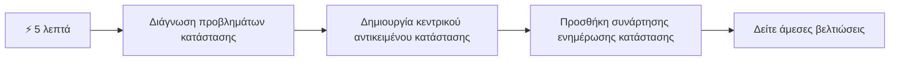
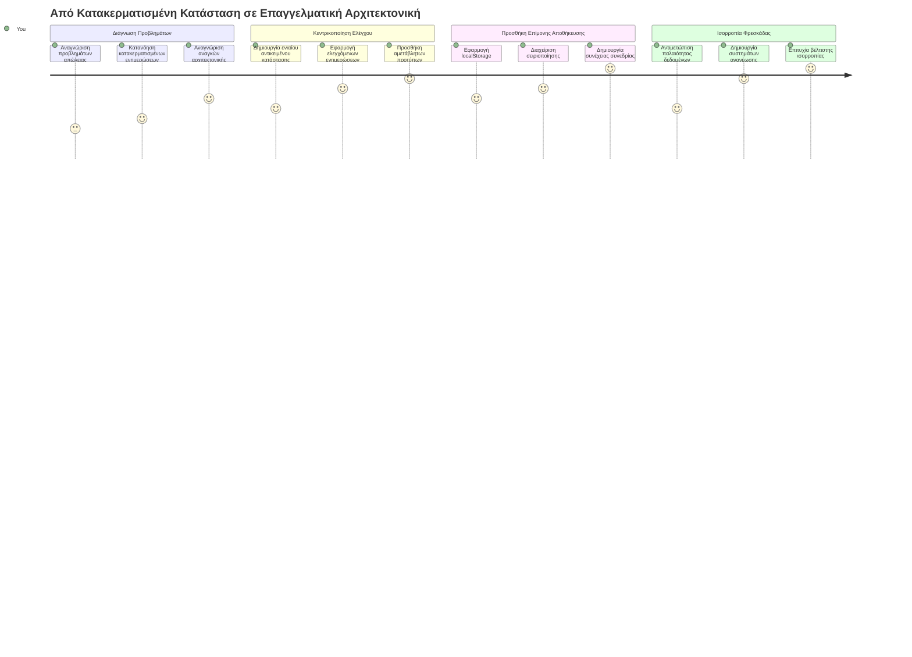
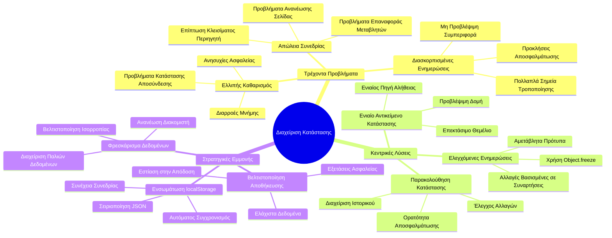
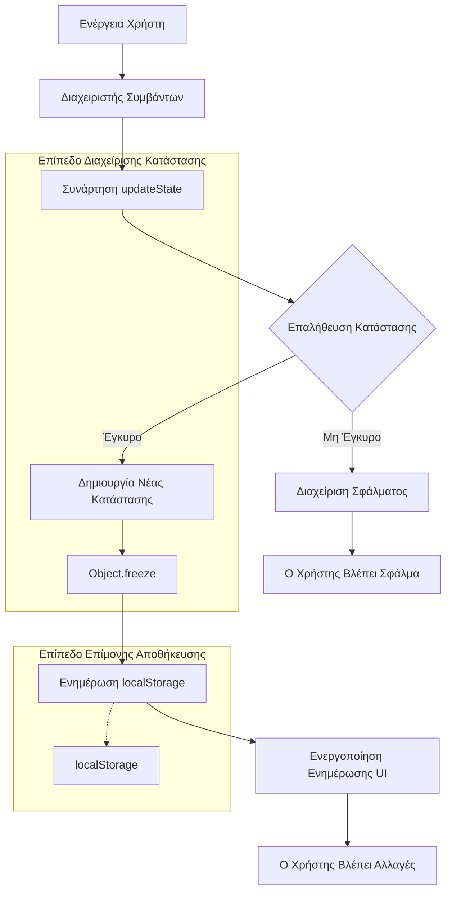
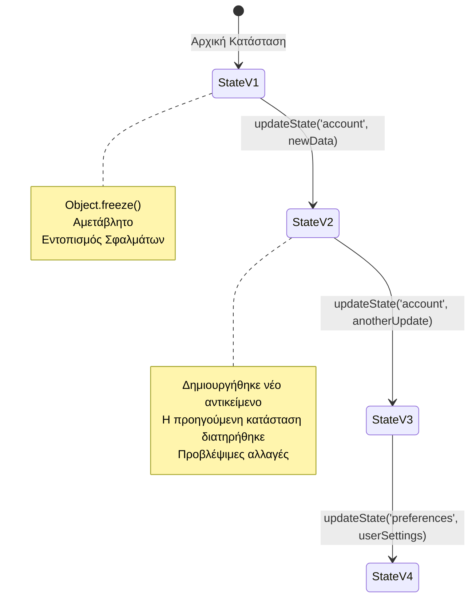
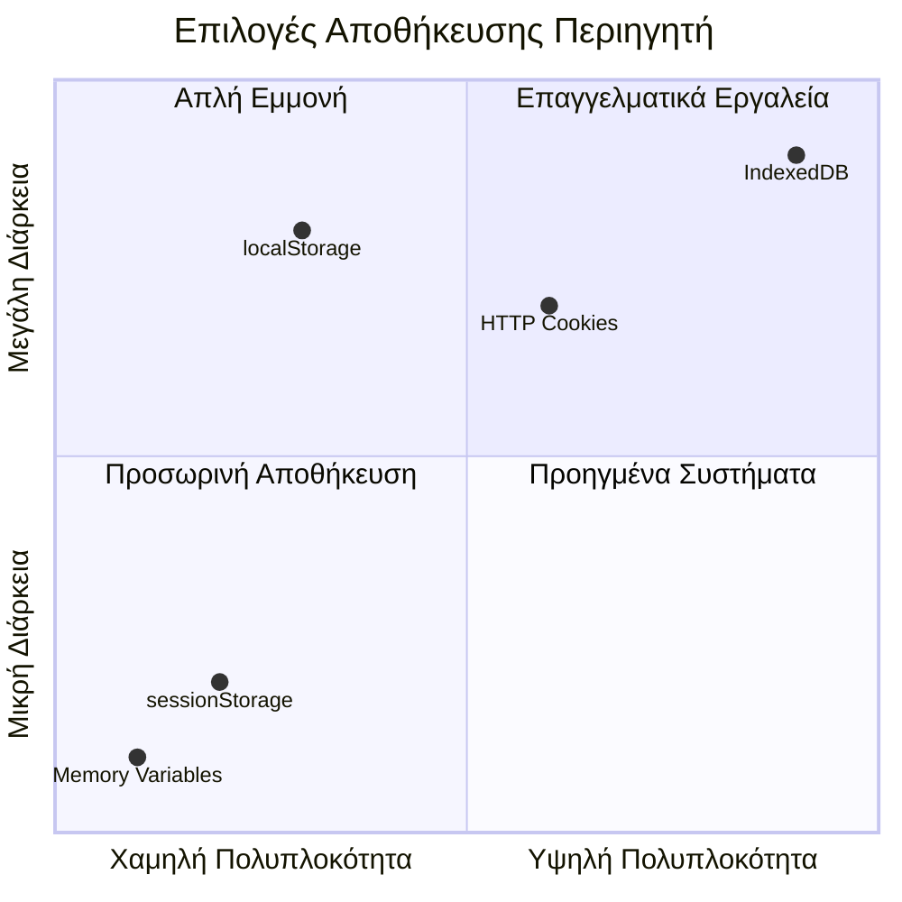
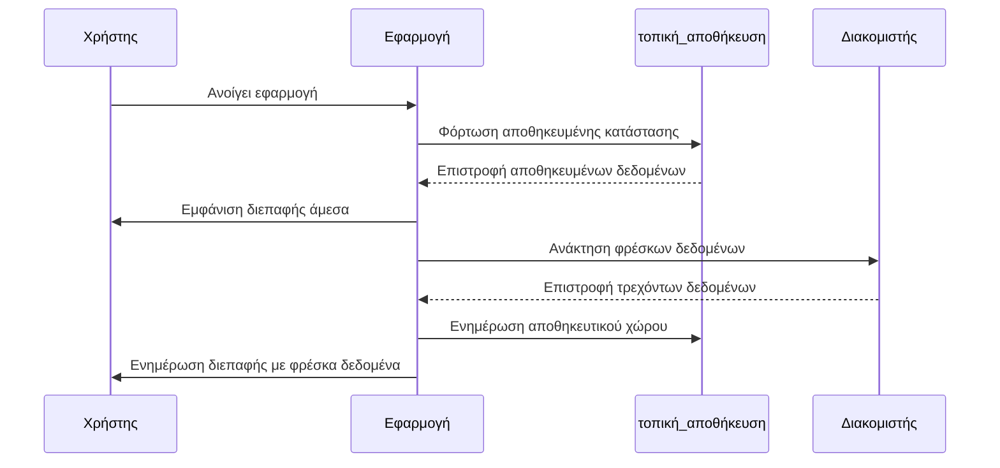
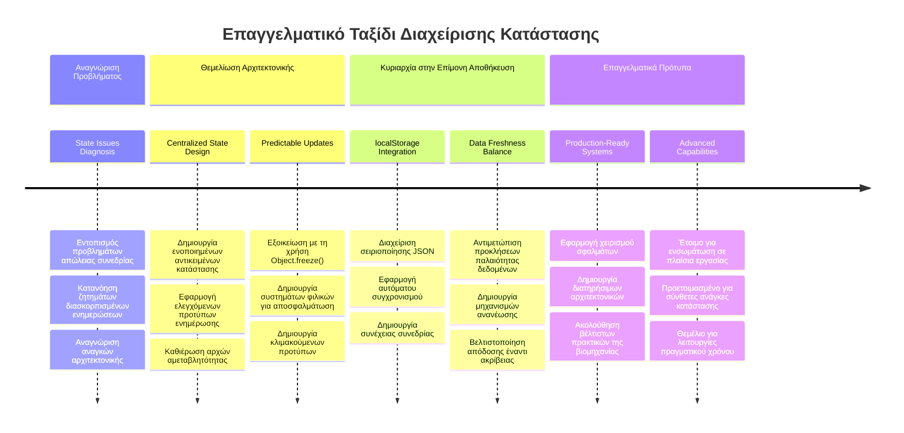

<!--
CO_OP_TRANSLATOR_METADATA:
{
  "original_hash": "b807b09df716dc48a2b750835bf8e933",
  "translation_date": "2026-01-06T21:01:36+00:00",
  "source_file": "7-bank-project/4-state-management/README.md",
  "language_code": "el"
}
-->
# Δημιουργία Εφαρμογής Τραπεζικής Μέρος 4: Έννοιες Διαχείρισης Κατάστασης

## ⚡ Τι Μπορείτε να Κάνετε στα Επόμενα 5 Λεπτά

**Γρήγορη Διαδρομή για Απασχολημένους Προγραμματιστές**


- **Λεπτό 1**: Δοκιμάστε το τρέχον πρόβλημα κατάστασης - συνδεθείτε, ανανεώστε τη σελίδα, παρατηρήστε την αποσύνδεση
- **Λεπτό 2**: Αντικαταστήστε το `let account = null` με `let state = { account: null }`
- **Λεπτό 3**: Δημιουργήστε μια απλή συνάρτηση `updateState()` για ελεγχόμενες ενημερώσεις
- **Λεπτό 4**: Ενημερώστε μια συνάρτηση να χρησιμοποιεί το νέο μοτίβο
- **Λεπτό 5**: Δοκιμάστε τη βελτιωμένη προβλεψιμότητα και τη δυνατότητα αποσφαλμάτωσης

**Γρήγορος Διαγνωστικός Έλεγχος**:
```javascript
// Πριν: Κατανεμημένη κατάσταση
let account = null; // Χάνεται κατά την ανανέωση!

// Μετά: Κεντρικοποιημένη κατάσταση
let state = Object.freeze({ account: null }); // Ελεγχόμενη και ιχνηλατούμενη!
```

**Γιατί αυτό έχει σημασία**: Σε 5 λεπτά, θα βιώσετε τη μετάβαση από χαοτική διαχείριση κατάστασης σε προβλέψιμα, αποσφαλματώσιμα μοτίβα. Αυτή η βάση καθιστά τις σύνθετες εφαρμογές διαχειρίσιμες.

## 🗺️ Το Ταξίδι Μάθησής Σας Μέσα από την Εμπειρία της Διαχείρισης Κατάστασης


**Προορισμός του Ταξιδιού σας**: Μέχρι το τέλος αυτού του μαθήματος, θα έχετε δημιουργήσει ένα επαγγελματικού επιπέδου σύστημα διαχείρισης κατάστασης που διαχειρίζεται την επιμονή, την ανανέωση δεδομένων και τις προβλέψιμες ενημερώσεις - τα ίδια μοτίβα που χρησιμοποιούνται σε εφαρμογές παραγωγής.

## Προ-Μαθηματικό Quiz

[Προ-μαθηματικό quiz](https://ff-quizzes.netlify.app/web/quiz/47)

## Εισαγωγή

Η διαχείριση κατάστασης είναι σαν το σύστημα πλοήγησης στο διαστημόπλοιο Voyager – όταν όλα λειτουργούν ομαλά, σχεδόν δεν το προσέχετε. Αλλά όταν τα πράγματα πάνε στραβά, γίνεται η διαφορά μεταξύ επίτευξης διαστρικού χώρου και απώλειας στη διαστημική κενότητα. Στον ιστό, η κατάσταση αντιπροσωπεύει ό,τι πρέπει η εφαρμογή σας να θυμάται: κατάσταση σύνδεσης χρήστη, δεδομένα φόρμας, ιστορικό περιήγησης και προσωρινές καταστάσεις διεπαφής.

Καθώς η εφαρμογή σας για τραπεζικές συναλλαγές έχει εξελιχθεί από μια απλή φόρμα σύνδεσης σε μια πιο σύνθετη εφαρμογή, πιθανόν να έχετε αντιμετωπίσει κάποιες κοινές προκλήσεις. Ανανεώστε τη σελίδα και οι χρήστες αποσυνδέονται απροσδόκητα. Κλείστε το πρόγραμμα περιήγησης και όλη η πρόοδος χάνεται. Εντοπίστε ένα πρόβλημα και ψάχνετε μέσα από πολλές συναρτήσεις που τροποποιούν τα ίδια δεδομένα με διαφορετικούς τρόπους.

Αυτά δεν είναι σημάδια κακού κώδικα – είναι οι φυσιολογικοί πόνοι της ανάπτυξης όταν οι εφαρμογές φτάνουν ένα συγκεκριμένο επίπεδο πολυπλοκότητας. Κάθε προγραμματιστής αντιμετωπίζει αυτές τις προκλήσεις καθώς οι εφαρμογές του μεταβαίνουν από "απόδειξη έννοιας" σε "έτοιμες για παραγωγή".

Σε αυτό το μάθημα, θα υλοποιήσουμε ένα κεντρικό σύστημα διαχείρισης κατάστασης που θα μετατρέψει την τραπεζική σας εφαρμογή σε μια αξιόπιστη, επαγγελματική εφαρμογή. Θα μάθετε πώς να διαχειρίζεστε ροές δεδομένων με προβλεψιμότητα, να διατηρείτε τις συνεδρίες χρηστών κατάλληλα και να δημιουργείτε την ομαλή εμπειρία χρήστη που απαιτούν οι σύγχρονες εφαρμογές στον ιστό.

## Προαπαιτούμενα

Πριν βουτήξετε στις έννοιες διαχείρισης κατάστασης, πρέπει να έχετε ρυθμίσει σωστά το περιβάλλον ανάπτυξής σας και να έχετε τη βάση της τραπεζικής εφαρμογής. Αυτό το μάθημα βασίζεται άμεσα στις έννοιες και τον κώδικα από προηγούμενα μέρη αυτής της σειράς.

Βεβαιωθείτε ότι έχετε τα ακόλουθα έτοιμα πριν συνεχίσετε:

**Απαιτούμενη Ρύθμιση:**
- Ολοκληρώστε το [μάθημα ανάκτησης δεδομένων](../3-data/README.md) - η εφαρμογή σας θα πρέπει να φορτώνει και να εμφανίζει επιτυχώς δεδομένα λογαριασμού
- Εγκαταστήστε [Node.js](https://nodejs.org) στο σύστημά σας για να τρέχετε το backend API
- Εκκινήστε το [API διακομιστή](../api/README.md) τοπικά για τις λειτουργίες των δεδομένων λογαριασμού

**Δοκιμάζοντας το Περιβάλλον σας:**

Επιβεβαιώστε ότι ο διακομιστής API λειτουργεί σωστά εκτελώντας την παρακάτω εντολή σε τερματικό:

```sh
curl http://localhost:5000/api
# -> θα πρέπει να επιστρέφει "Bank API v1.0.0" ως αποτέλεσμα
```

**Τι κάνει αυτή η εντολή:**
- **Στέλνει** ένα αίτημα GET στον τοπικό σας API διακομιστή
- **Ελέγχει** τη σύνδεση και επιβεβαιώνει ότι ο διακομιστής ανταποκρίνεται
- **Επιστρέφει** πληροφορίες για την έκδοση του API αν όλα λειτουργούν σωστά

## 🧠 Επισκόπηση Αρχιτεκτονικής Διαχείρισης Κατάστασης


**Βασική Αρχή**: Η επαγγελματική διαχείριση κατάστασης ισορροπεί την προβλεψιμότητα, την επιμονή και την απόδοση για να δημιουργήσει αξιόπιστες εμπειρίες χρήστη που κλιμακώνονται από απλές αλληλεπιδράσεις μέχρι σύνθετες ροές εργασίας εφαρμογών.

---

## Διάγνωση των Τρεχουσών Προβλημάτων Κατάστασης

Όπως ο Sherlock Holmes εξετάζει μια σκηνή εγκλήματος, πρέπει να κατανοήσουμε ακριβώς τι συμβαίνει στην τρέχουσα υλοποίηση πριν λύσουμε το μυστήριο των εξαφανιζόμενων συνεδριών χρηστών.

Ας κάνουμε ένα απλό πείραμα που αποκαλύπτει τις υποκείμενες προκλήσεις διαχείρισης κατάστασης:

**🧪 Δοκιμάστε αυτόν τον Διαγνωστικό Έλεγχο:**
1. Συνδεθείτε στην τραπεζική σας εφαρμογή και μεταβείτε στον πίνακα ελέγχου
2. Ανανέώστε τη σελίδα του περιηγητή
3. Παρατηρήστε τι συμβαίνει με την κατάσταση σύνδεσής σας

Αν σας ανακατευθύνει ξανά στην οθόνη σύνδεσης, έχετε ανακαλύψει το κλασικό πρόβλημα επιμονής κατάστασης. Αυτή η συμπεριφορά συμβαίνει επειδή η τρέχουσα υλοποίηση αποθηκεύει τα δεδομένα χρήστη σε μεταβλητές JavaScript που μηδενίζονται με κάθε φόρτωση σελίδας.

**Τρέχουσες Προβληματικές Υλοποιήσεις:**

Η απλή μεταβλητή `account` από το [προηγούμενο μάθημα](../3-data/README.md) δημιουργεί τρία σημαντικά προβλήματα που επηρεάζουν τόσο την εμπειρία χρήστη όσο και τη διατηρησιμότητα του κώδικα:

| Πρόβλημα | Τεχνική Αιτία | Επιπτώσεις στον Χρήστη |
|---------|---------------|------------------------|
| **Απώλεια Συνεδρίας** | Η ανανέωση της σελίδας καθαρίζει τις μεταβλητές JavaScript | Οι χρήστες πρέπει να συνδέονται ξανά συχνά |
| **Διάσπαρτες Ενημερώσεις** | Πολλαπλές συναρτήσεις τροποποιούν το state απευθείας | Η αποσφαλμάτωση γίνεται όλο και πιο δύσκολη |
| **Ελλιπής Καθαρισμός** | Η αποσύνδεση δεν καθαρίζει όλες τις αναφορές κατάστασης | Πιθανές ανησυχίες για ασφάλεια και ιδιωτικότητα |

**Η Αρχιτεκτονική Πρόκληση:**

Όπως ο διαμερισμένος σχεδιασμός του Τιτανικού που φαινόταν ανθεκτικός μέχρι να πλημμυρίσουν ταυτόχρονα πολλοί διαμερισμοί, η διόρθωση αυτών των ζητημάτων ξεχωριστά δεν θα επιλύσει το υποκείμενο αρχιτεκτονικό πρόβλημα. Χρειαζόμαστε μια ολοκληρωμένη λύση διαχείρισης κατάστασης.

> 💡 **Τι προσπαθούμε πραγματικά να επιτύχουμε εδώ;**

Η [διαχείριση κατάστασης](https://en.wikipedia.org/wiki/State_management) αφορά δύο βασικούς γρίφους:

1. **Πού Είναι τα Δεδομένα Μου;**: Παρακολούθηση του τι πληροφορία έχουμε και από πού προέρχεται
2. **Είναι Όλοι στην Ίδια Σελίδα;**: Βεβαιωθείτε ότι αυτό που βλέπουν οι χρήστες ταιριάζει με αυτό που πραγματικά συμβαίνει

**Το Σχέδιό μας:**

Αντί να κυνηγάμε την ουρά μας, θα δημιουργήσουμε ένα **κεντρικό σύστημα διαχείρισης κατάστασης**. Σκεφτείτε το σαν να έχετε ένα πραγματικά οργανωμένο άτομο υπεύθυνο για όλα τα σημαντικά:



**Κατανόηση αυτής της ροής δεδομένων:**
- **Κεντροποιεί** όλη την κατάσταση της εφαρμογής σε ένα σημείο
- **Δρομολογεί** όλες τις αλλαγές κατάστασης μέσω ελεγχόμενων συναρτήσεων
- **Εξασφαλίζει** πως το UI παραμένει συγχρονισμένο με την τρέχουσα κατάσταση
- **Παρέχει** ένα σαφές, προβλέψιμο μοτίβο για τη διαχείριση δεδομένων

> 💡 **Επαγγελματική Επισήμανση**: Αυτό το μάθημα εστιάζει στις βασικές έννοιες. Για πολύπλοκες εφαρμογές, βιβλιοθήκες όπως το [Redux](https://redux.js.org) προσφέρουν πιο προηγμένες λειτουργίες διαχείρισης κατάστασης. Η κατανόηση αυτών των βασικών αρχών θα σας βοηθήσει να κυριαρχήσετε σε οποιαδήποτε βιβλιοθήκη διαχείρισης κατάστασης.

> ⚠️ **Προχωρημένο Θέμα**: Δεν θα καλύψουμε αυτόματες ενημερώσεις UI που ενεργοποιούνται από αλλαγές κατάστασης, καθώς αυτό περιλαμβάνει έννοιες [Αντιδραστικού Προγραμματισμού](https://en.wikipedia.org/wiki/Reactive_programming). Θεωρήστε το αυτό ένα εξαιρετικό επομένη βήμα στην πορεία μάθησης σας!

### Εργασία: Κεντροποίηση της Δομής Κατάστασης

Ας ξεκινήσουμε τη μετατροπή της διάσπαρτης διαχείρισης κατάστασης σε ένα κεντρικό σύστημα. Αυτό το πρώτο βήμα δημιουργεί το θεμέλιο για όλες τις βελτιώσεις που ακολουθούν.

**Βήμα 1: Δημιουργία ενός Κεντρικού Αντικειμένου Κατάστασης**

Αντικαταστήστε την απλή δήλωση `account`:

```js
let account = null;
```

Με ένα δομημένο αντικείμενο κατάστασης:

```js
let state = {
  account: null
};
```

**Γιατί αυτή η αλλαγή έχει σημασία:**
- **Κεντροποιεί** όλα τα δεδομένα εφαρμογής σε ένα σημείο
- **Προετοιμάζει** τη δομή για προσθήκη περισσότερων ιδιοτήτων κατάστασης αργότερα
- **Δημιουργεί** ένα σαφές όριο μεταξύ της κατάστασης και άλλων μεταβλητών
- **Καθιερώνει** ένα μοτίβο που κλιμακώνεται καθώς η εφαρμογή σας μεγαλώνει

**Βήμα 2: Ενημέρωση των Προτύπων Πρόσβασης στην Κατάσταση**

Ενημερώστε τις συναρτήσεις σας για να χρησιμοποιούν τη νέα δομή κατάστασης:

**Στις συναρτήσεις `register()` και `login()`**, αντικαταστήστε:
```js
account = ...
```

Με:
```js
state.account = ...
```

**Στη συνάρτηση `updateDashboard()`**, προσθέστε αυτή τη γραμμή στην κορυφή:
```js
const account = state.account;
```

**Τι πετυχαίνουν αυτές οι ενημερώσεις:**
- **Διατηρούν** τη λειτουργικότητα ενώ βελτιώνουν τη δομή
- **Προετοιμάζουν** τον κώδικά σας για πιο εξελιγμένη διαχείριση κατάστασης
- **Δημιουργούν** συνεπή μοτίβα για πρόσβαση στα δεδομένα κατάστασης
- **Θεμελιώνουν** τη βάση για κεντρικές ενημερώσεις κατάστασης

> 💡 **Σημείωση**: Αυτή η αναδιάρθρωση δεν λύνει αμέσως τα προβλήματά μας, αλλά δημιουργεί το απαραίτητο θεμέλιο για τις ισχυρές βελτιώσεις που ακολουθούν!

### 🎯 Παιδαγωγικός Έλεγχος: Αρχές Κεντροποίησης

**Παύση και Σκέψη**: Μόλις εφαρμόσατε τα θεμέλια της κεντρικής διαχείρισης κατάστασης. Αυτή είναι μια κρίσιμη αρχιτεκτονική απόφαση.

**Γρήγορη Αυτοαξιολόγηση**:
- Μπορείτε να εξηγήσετε γιατί η κεντροποίηση της κατάστασης σε ένα αντικείμενο είναι καλύτερη από τις διάσπαρτες μεταβλητές;
- Τι θα συμβεί αν ξεχάσετε να ενημερώσετε μια συνάρτηση να χρησιμοποιεί `state.account`;
- Πώς αυτό το μοτίβο προετοιμάζει τον κώδικά σας για πιο προχωρημένα χαρακτηριστικά;

**Σύνδεση με τον Πραγματικό Κόσμο**: Το μοτίβο κεντροποίησης που μάθατε είναι η βάση σύγχρονων πλαισίων όπως Redux, Vuex και React Context. Δημιουργείτε την ίδια αρχιτεκτονική σκέψη που χρησιμοποιείται σε μεγάλες εφαρμογές.

**Ερώτηση Πρόκλησης**: Αν χρειαστεί να προσθέσετε προτιμήσεις χρήστη (θέμα, γλώσσα) στην εφαρμογή σας, πού θα τις προσθέσετε στη δομή κατάστασης; Πώς θα κλιμακωνόταν αυτό;

## Υλοποίηση Ελεγχόμενων Ενημερώσεων Κατάστασης

Με την κεντρική κατάσταση στη θέση της, το επόμενο βήμα αφορά την καθιέρωση ελεγχόμενων μηχανισμών για τροποποιήσεις δεδομένων. Αυτή η προσέγγιση εξασφαλίζει προβλέψιμες αλλαγές κατάστασης και ευκολότερη αποσφαλμάτωση.

Η βασική αρχή μοιάζει με τον έλεγχο εναέριας κυκλοφορίας: αντί να επιτρέπουμε σε πολλές συναρτήσεις να τροποποιούν την κατάσταση ανεξάρτητα, θα περνάμε όλες τις αλλαγές μέσα από μία ελεγχόμενη συνάρτηση. Αυτό το μοτίβο παρέχει ξεκάθαρη εποπτεία πότε και πώς συμβαίνουν οι αλλαγές δεδομένων.

**Διαχείριση Αμετάβλητης Κατάστασης:**

Θα θεωρούμε το αντικείμενο `state` ως [*αμετάβλητο*](https://en.wikipedia.org/wiki/Immutable_object), που σημαίνει ότι δεν το τροποποιούμε απευθείας. Αντίθετα, κάθε αλλαγή δημιουργεί ένα νέο αντικείμενο κατάστασης με τα ενημερωμένα δεδομένα.

Αν και αυτή η προσέγγιση ίσως φαίνεται αρχικά λιγότερο αποδοτική σε σχέση με απευθείας τροποποιήσεις, παρέχει σημαντικά πλεονεκτήματα για την αποσφαλμάτωση, τη δοκιμή και τη διατήρηση της προβλεψιμότητας της εφαρμογής.

**Οφέλη διαχείρισης αμετάβλητης κατάστασης:**

| Όφελος | Περιγραφή | Επίδραση |
|--------|-----------|----------|
| **Προβλεψιμότητα** | Οι αλλαγές γίνονται μόνο μέσω ελεγχόμενων συναρτήσεων | Εύκολη αποσφαλμάτωση και δοκιμές |
| **Παρακολούθηση Ιστορικού** | Κάθε αλλαγή δημιουργεί νέο αντικείμενο | Δυνατότητα αναίρεσης/επανάληψης |
| **Πρόληψη Παρενεργειών** | Απουσία τυχαίων αλλαγών | Αποφυγή μυστηριωδών σφαλμάτων |
| **Βελτιστοποίηση Απόδοσης** | Εύκολη ανίχνευση πραγματικών αλλαγών κατάστασης | Αποδοτικές ενημερώσεις UI |

**Αμεταβλητότητα JavaScript με `Object.freeze()`:**

Η JavaScript παρέχει το [`Object.freeze()`](https://developer.mozilla.org/docs/Web/JavaScript/Reference/Global_Objects/Object/freeze) για την αποφυγή τροποποιήσεων αντικειμένων:

```js
const immutableState = Object.freeze({ account: userData });
// Οποιαδήποτε προσπάθεια τροποποίησης του immutableState θα προκαλέσει σφάλμα
```

**Ανάλυση αυτών που συμβαίνουν εδώ:**
- **Αποτρέπει** απευθείας αναθέσεις ή διαγραφές ιδιοτήτων
- **Προκαλεί** εξαιρέσεις αν γίνουν προσπάθειες τροποποίησης
- **Εξασφαλίζει** ότι οι αλλαγές κατάστασης πρέπει να περνούν μέσα από ελεγχόμενες συναρτήσεις
- **Δημιουργεί** μια σαφή συμφωνία για το πώς μπορεί να ενημερωθεί η κατάσταση

> 💡 **Εμβάθυνση**: Μάθετε για τη διαφορά μεταξύ *ρηχών* και *βαθιών* αμετάβλητων αντικειμένων στο [ντοκουμέντο MDN](https://developer.mozilla.org/docs/Web/JavaScript/Reference/Global_Objects/Object/freeze#What_is_shallow_freeze). Η κατανόηση αυτής της διάκρισης είναι κρίσιμη για πολύπλοκες δομές κατάστασης.


### Εργασία

Ας δημιουργήσουμε μια νέα συνάρτηση `updateState()`:

```js
function updateState(property, newData) {
  state = Object.freeze({
    ...state,
    [property]: newData
  });
}
```

Σε αυτή τη συνάρτηση, δημιουργούμε ένα νέο αντικείμενο κατάστασης και αντιγράφουμε τα δεδομένα από την προηγούμενη κατάσταση χρησιμοποιώντας τον [*τελεστή διάδοσης (`...`)*](https://developer.mozilla.org/docs/Web/JavaScript/Reference/Operators/Spread_syntax#Spread_in_object_literals). Στη συνέχεια, αντικαθιστούμε μια συγκεκριμένη ιδιότητα του αντικειμένου κατάστασης με τα νέα δεδομένα χρησιμοποιώντας τη [σύνταξη αγκύλων](https://developer.mozilla.org/docs/Web/JavaScript/Guide/Working_with_Objects#Objects_and_properties) `[property]` για ανάθεση. Τέλος, κλειδώνουμε το αντικείμενο για να αποτρέψουμε τροποποιήσεις χρησιμοποιώντας `Object.freeze()`. Αποθηκεύουμε προς το παρόν μόνο την ιδιότητα `account` στην κατάσταση, αλλά με αυτή την προσέγγιση μπορείτε να προσθέσετε όσες ιδιότητες χρειάζεστε στην κατάσταση.

Επίσης θα ενημερώσουμε την αρχικοποίηση της `state` για να διασφαλίσουμε ότι και η αρχική κατάσταση είναι κλειδωμένη:

```js
let state = Object.freeze({
  account: null
});
```

Έπειτα, ενημερώστε τη συνάρτηση `register` αντικαθιστώντας την ανάθεση `state.account = result;` με:

```js
updateState('account', result);
```

Κάντε το ίδιο και με τη συνάρτηση `login`, αντικαθιστώντας το `state.account = data;` με:

```js
updateState('account', data);
```

Τώρα θα εκμεταλλευτούμε την ευκαιρία να διορθώσουμε το ζήτημα όπου τα δεδομένα λογαριασμού δεν καθαρίζονται όταν ο χρήστης κάνει κλικ στο *Αποσύνδεση*.

Δημιουργήστε μια νέα συνάρτηση `logout()`:

```js
function logout() {
  updateState('account', null);
  navigate('/login');
}
```

Στη `updateDashboard()`, αντικαταστήστε την ανακατεύθυνση `return navigate('/login');` με `return logout()`.

Δοκιμάστε να εγγραφείτε σε νέο λογαριασμό, να αποσυνδεθείτε και να συνδεθείτε ξανά για να ελέγξετε ότι όλα λειτουργούν σωστά.

> Συμβουλή: μπορείτε να δείτε όλες τις αλλαγές κατάστασης προσθέτοντας `console.log(state)` στο τέλος της `updateState()` και ανοίγοντας την κονσόλα στα εργαλεία ανάπτυξης του περιηγητή σας.

## Υλοποίηση Επιμονής Δεδομένων

Το πρόβλημα απώλειας συνεδρίας που εντοπίσαμε νωρίτερα απαιτεί μια λύση επιμονής που διατηρεί την κατάσταση χρήστη μεταξύ των συνεδριών του περιηγητή. Αυτό μετατρέπει την εφαρμογή από προσωρινή εμπειρία σε αξιόπιστο, επαγγελματικό εργαλείο.

Σκεφτείτε πως τα ατομικά ρολόγια διατηρούν ακριβή χρόνο ακόμα και κατά τη διάρκεια διακοπής ρεύματος αποθηκεύοντας την κρίσιμη κατάσταση σε μη πτητική μνήμη. Παρομοίως, οι εφαρμογές ιστού χρειάζονται μηχανισμούς μόνιμης αποθήκευσης για τη διατήρηση κρίσιμων δεδομένων χρήστη ανάμεσα σε συνεδρίες περιηγητή και ανανεώσεις σελίδας.

**Στρατηγικές Ερωτήσεις για Επιμονή Δεδομένων:**

Πριν υλοποιήσετε επιμονή, σκεφτείτε αυτούς τους κρίσιμους παράγοντες:

| Ερώτηση | Πλαίσιο Τραπεζικής Εφαρμογής | Επιπτώσεις Απόφασης |
|----------|-----------------------------|---------------------|
| **Τα δεδομένα είναι ευαίσθητα;** | Υπόλοιπο λογαριασμού, ιστορικό συναλλαγών | Επιλογή ασφαλών μεθόδων αποθήκευσης |
| **Πόσο πρέπει να διαρκεί;** | Κατάσταση σύνδεσης έναντι προσωρινών προτιμήσεων UI | Επιλογή κατάλληλης διάρκειας αποθήκευσης |
| **Χρειάζεται ο διακομιστής τα δεδομένα;** | Διακριτικά αυθεντικοποίησης έναντι ρυθμίσεων UI | Καθορισμός απαιτήσεων κοινής χρήσης |

**Επιλογές αποθήκευσης στον περιηγητή:**

Οι σύγχρονοι περιηγητές παρέχουν πολλούς μηχανισμούς αποθήκευσης, σχεδιασμένους για διαφορετικές περιπτώσεις χρήσης:

**Βασικά API αποθήκευσης:**

1. **[`localStorage`](https://developer.mozilla.org/docs/Web/API/Window/localStorage)**: Μόνιμη [Αποθήκευση Κλειδιού/Τιμής](https://en.wikipedia.org/wiki/Key%E2%80%93value_database)
   - **Διατηρεί** τα δεδομένα διαδοχικά μεταξύ των συνεδριών περιηγητή επ' αόριστον  
   - **Επιβιώνει** από επανεκκινήσεις περιηγητή και υπολογιστή
   - **Περιορίζεται** στον συγκεκριμένο τομέα της ιστοσελίδας
   - **Ιδανικό** για προτιμήσεις χρήστη και καταστάσεις σύνδεσης

2. **[`sessionStorage`](https://developer.mozilla.org/docs/Web/API/Window/sessionStorage)**: Προσωρινή αποθήκευση συνεδρίας
   - **Λειτουργεί** πανομοιότυπα με το localStorage κατά τη διάρκεια ενεργών συνεδριών
   - **Καθαρίζεται** αυτόματα όταν κλείνει η καρτέλα του περιηγητή
   - **Ιδανικό** για προσωρινά δεδομένα που δεν πρέπει να διαρκούν

3. **[HTTP Cookies](https://developer.mozilla.org/docs/Web/HTTP/Cookies)**: Αποθήκευση κοινοχρήστων με τον διακομιστή
   - **Αποστέλλονται** αυτόματα με κάθε αίτημα προς τον διακομιστή
   - **Ιδανικά** για διακριτικά [αυθεντικοποίησης](https://en.wikipedia.org/wiki/Authentication)
   - **Περιορισμένα** σε μέγεθος και μπορούν να επηρεάσουν την απόδοση

**Απαίτηση Σειριοποίησης Δεδομένων:**

Τanto το `localStorage` όσο και το `sessionStorage` αποθηκεύουν μόνο [αλφαριθμητικά](https://developer.mozilla.org/docs/Web/JavaScript/Reference/Global_Objects/String):

```js
// Μετατροπή αντικειμένων σε συμβολοσειρές JSON για αποθήκευση
const accountData = { user: 'john', balance: 150 };
localStorage.setItem('account', JSON.stringify(accountData));

// Ανάλυση συμβολοσειρών JSON πίσω σε αντικείμενα κατά την ανάκτηση
const savedAccount = JSON.parse(localStorage.getItem('account'));
```

**Κατανόηση σειριοποίησης:**
- **Μετατρέπει** αντικείμενα JavaScript σε JSON συμβολοσειρές χρησιμοποιώντας [`JSON.stringify()`](https://developer.mozilla.org/docs/Web/JavaScript/Reference/Global_Objects/JSON/stringify)
- **Ανακατασκευάζει** αντικείμενα από JSON χρησιμοποιώντας [`JSON.parse()`](https://developer.mozilla.org/docs/Web/JavaScript/Reference/Global_Objects/JSON/parse)
- **Διαχειρίζεται** πολύπλοκα εμφωλευμένα αντικείμενα και πίνακες αυτόματα
- **Αποτυγχάνει** σε συναρτήσεις, απροσδιόριστες τιμές και κυκλικές αναφορές

> 💡 **Προχωρημένη επιλογή**: Για πολύπλοκες εφαρμογές εκτός σύνδεσης με μεγάλα σύνολα δεδομένων, σκεφτείτε το API [`IndexedDB`](https://developer.mozilla.org/docs/Web/API/IndexedDB_API). Παρέχει πλήρη βάση δεδομένων στο πελάτη αλλά απαιτεί πιο σύνθετη υλοποίηση.


### Εργασία: Υλοποίηση Διατήρησης localStorage

Ας υλοποιήσουμε μόνιμη αποθήκευση ώστε οι χρήστες να παραμένουν συνδεδεμένοι μέχρι να αποσυνδεθούν ρητά. Θα χρησιμοποιήσουμε το `localStorage` για την αποθήκευση δεδομένων λογαριασμού μεταξύ συνεδριών περιηγητή.

**Βήμα 1: Ορισμός Διαμόρφωσης Αποθήκευσης**

```js
const storageKey = 'savedAccount';
```

**Τι παρέχει αυτή η σταθερά:**
- **Δημιουργεί** έναν συνεπή αναγνωριστικό για τα αποθηκευμένα δεδομένα μας
- **Αποτρέπει** τυπογραφικά λάθη στις αναφορές κλειδιών αποθήκευσης
- **Κάνει** εύκολη την αλλαγή του κλειδιού αποθήκευσης αν χρειαστεί
- **Ακολουθεί** βέλτιστες πρακτικές για διαχειρίσιμο κώδικα

**Βήμα 2: Προσθήκη Αυτόματης Διατήρησης**

Προσθέστε αυτή τη γραμμή στο τέλος της συνάρτησης `updateState()`:

```js
localStorage.setItem(storageKey, JSON.stringify(state.account));
```

**Ανάλυση όσων συμβαίνουν εδώ:**
- **Μετατρέπει** το αντικείμενο λογαριασμού σε συμβολοσειρά JSON για αποθήκευση
- **Αποθηκεύει** τα δεδομένα χρησιμοποιώντας το συνεπές κλειδί μας
- **Εκτελείται** αυτόματα κάθε φορά που αλλάζει η κατάσταση
- **Εξασφαλίζει** ότι τα αποθηκευμένα δεδομένα είναι πάντα συγχρονισμένα με την τρέχουσα κατάσταση

> 💡 **Όφελος Αρχιτεκτονικής**: Επειδή κεντρωθήκαμε όλες τις ενημερώσεις καταστάσεων μέσω της `updateState()`, η προσθήκη μόνιμης αποθήκευσης απαιτούσε μόνο μια γραμμή κώδικα. Αυτό δείχνει τη δύναμη των καλών αρχιτεκτονικών αποφάσεων!

**Βήμα 3: Επαναφορά Κατάστασης κατά τη Φόρτωση της Εφαρμογής**

Δημιουργήστε μια συνάρτηση αρχικοποίησης για να επαναφέρετε αποθηκευμένα δεδομένα:

```js
function init() {
  const savedAccount = localStorage.getItem(storageKey);
  if (savedAccount) {
    updateState('account', JSON.parse(savedAccount));
  }

  // Ο προηγούμενος κώδικας αρχικοποίησής μας
  window.onpopstate = () => updateRoute();
  updateRoute();
}

init();
```

**Κατανόηση της διαδικασίας αρχικοποίησης:**
- **Ανακτά** τα όποια προηγουμένως αποθηκευμένα δεδομένα λογαριασμού από το localStorage
- **Αναλύει** τη συμβολοσειρά JSON ξανά σε αντικείμενο JavaScript
- **Ενημερώνει** την κατάσταση χρησιμοποιώντας τη λειτουργία ελεγχόμενης ενημέρωσης
- **Επαναφέρει** αυτόματα τη συνεδρία του χρήστη κατά τη φόρτωση της σελίδας
- **Εκτελείται** πριν από ενημερώσεις διαδρομής για να διασφαλιστεί η διαθεσιμότητα κατάστασης

**Βήμα 4: Βελτιστοποίηση Προεπιλεγμένης Διαδρομής**

Ενημερώστε την προεπιλεγμένη διαδρομή για να εκμεταλλευτείτε τη διατήρηση:

Στη `updateRoute()`, αντικαταστήστε:
```js
// Αντικαταστήστε: return navigate('/login');
return navigate('/dashboard');
```

**Γιατί αυτή η αλλαγή έχει νόημα:**
- **Αξιοποιεί** αποτελεσματικά το νέο μας σύστημα διατήρησης
- **Επιτρέπει** στον πίνακα ελέγχου να χειρίζεται ελέγχους αυθεντικοποίησης
- **Ανακατευθύνει** αυτόματα στη σύνδεση αν δεν υπάρχει αποθηκευμένη συνεδρία
- **Δημιουργεί** πιο ομαλή εμπειρία χρήστη

**Δοκιμή της Υλοποίησής σας:**

1. Συνδεθείτε στην τραπεζική εφαρμογή σας
2. Φορτώστε ξανά τη σελίδα του περιηγητή
3. Επιβεβαιώστε ότι παραμένετε συνδεδεμένοι και στο Dashboard
4. Κλείστε και ανοίξτε ξανά τον περιηγητή σας
5. Πλοηγηθείτε ξανά στην εφαρμογή και επαληθεύστε ότι είστε ακόμα συνδεδεμένοι

🎉 **Επιτυχής Υλοποίηση**: Υλοποιήσατε επιτυχώς τη διαχείριση μόνιμης κατάστασης! Τώρα η εφαρμογή σας συμπεριφέρεται σαν επαγγελματική διαδικτυακή εφαρμογή.

### 🎯 Εκπαιδευτικός Έλεγχος: Αρχιτεκτονική Διατήρησης

**Κατανόηση Αρχιτεκτονικής**: Υλοποιήσατε ένα εξελιγμένο επίπεδο διατήρησης που ισορροπεί μεταξύ εμπειρίας χρήστη και πολυπλοκότητας διαχείρισης δεδομένων.

**Βασικές Έννοιες που Κατανοήσατε**:
- **Σειριοποίηση JSON**: Μετατροπή πολύπλοκων αντικειμένων σε αποθηκεύσιμες συμβολοσειρές
- **Αυτόματος Συγχρονισμός**: Οι αλλαγές κατάστασης πυροδοτούν μόνιμη αποθήκευση
- **Ανάκτηση Συνεδρίας**: Οι εφαρμογές μπορούν να επαναφέρουν το πλαίσιο χρήστη μετά από διακοπές
- **Κεντρικοποιημένη Διατήρηση**: Μια συνάρτηση ενημέρωσης χειρίζεται όλη την αποθήκευση

**Σύνδεση με τη Βιομηχανία**: Αυτό το μοτίβο διατήρησης είναι θεμελιώδες για τις Προοδευτικές Εφαρμογές Ιστού (PWAs), εφαρμογές offline-first και σύγχρονες εμπειρίες κινητού web. Δημιουργείτε λειτουργίες παραγωγικού επιπέδου.

**Ερώτηση Αντανακλαστικής Σκέψης**: Πώς θα τροποποιούσατε αυτό το σύστημα για να χειριστεί πολλούς λογαριασμούς χρηστών στην ίδια συσκευή; Σκεφτείτε τις επιπτώσεις στην ιδιωτικότητα και ασφάλεια.

## Ισορροπία Διατήρησης με Φρεσκάδα Δεδομένων

Το σύστημα διατήρησής μας διατηρεί επιτυχώς τις συνεδρίες χρηστών, αλλά εισάγει μια νέα πρόκληση: την παλαιότητα δεδομένων. Όταν πολλοί χρήστες ή εφαρμογές τροποποιούν τα ίδια δεδομένα του διακομιστή, η τοπική προσωρινή μνήμη γίνεται ξεπερασμένη.

Αυτή η κατάσταση θυμίζει τους ναυτίλους Βίκινγκ που βασίζονταν και σε αποθηκευμένους χάρτες αστέρων και σε τρέχουσες ουράνιες παρατηρήσεις. Οι χάρτες παρείχαν συνέπεια, αλλά οι ναυτίλοι χρειάζονταν φρέσκες παρατηρήσεις για να λαμβάνουν υπόψη τις μεταβαλλόμενες συνθήκες. Ομοίως, η εφαρμογή μας χρειάζεται τόσο μόνιμη κατάσταση χρήστη όσο και τρέχοντα δεδομένα διακομιστή.

**🧪 Ανακάλυψη του Προβλήματος Παλαιότητας Δεδομένων:**

1. Συνδεθείτε στο dashboard με τον λογαριασμό `test`
2. Εκτελέστε την εντολή αυτή σε τερματικό για να προσομοιώσετε μια συναλλαγή από άλλη πηγή:

```sh
curl --request POST \
     --header "Content-Type: application/json" \
     --data "{ \"date\": \"2020-07-24\", \"object\": \"Bought book\", \"amount\": -20 }" \
     http://localhost:5000/api/accounts/test/transactions
```

3. Φορτώστε ξανά το dashboard σας στον περιηγητή
4. Παρατηρήστε αν εμφανίζεται η νέα συναλλαγή

**Τι δείχνει αυτή η δοκιμή:**
- **Εμφανίζει** πώς η τοπική αποθήκευση μπορεί να γίνει "ξεπερασμένη"
- **Προσομοιώνει** πραγματικά σενάρια όπου τα δεδομένα αλλάζουν εκτός της εφαρμογής σας
- **Αποκαλύπτει** την ένταση μεταξύ διατήρησης και φρεσκάδας δεδομένων

**Η Πρόκληση της Παλαιότητας Δεδομένων:**

| Πρόβλημα | Αιτία | Επίπτωση στον Χρήστη |
|---------|-------|----------------------|
| **Παλαιά δεδομένα** | Το localStorage δεν λήγει αυτόματα | Οι χρήστες βλέπουν ξεπερασμένες πληροφορίες |
| **Αλλαγές διακομιστή** | Άλλες εφαρμογές/χρήστες τροποποιούν τα ίδια δεδομένα | Ασυνεπείς προβολές σε πλατφόρμες |
| **Cache vs Πραγματικότητα** | Η τοπική cache δεν αντιστοιχεί στην κατάσταση του διακομιστή | Κακή εμπειρία χρήστη και σύγχυση |

**Στρατηγική Λύση:**

Θα υλοποιήσουμε πρότυπο "ανανέωση κατά τη φόρτωση" που ισορροπεί τα οφέλη της διατήρησης με την ανάγκη για φρέσκα δεδομένα. Αυτή η προσέγγιση διατηρεί ομαλή εμπειρία χρήστη διασφαλίζοντας την ακρίβεια των δεδομένων.


### Εργασία: Υλοποίηση Συστήματος Ανανέωσης Δεδομένων

Θα δημιουργήσουμε σύστημα που ανακτά αυτόματα φρέσκα δεδομένα από τον διακομιστή ενώ διατηρεί τα οφέλη της μόνιμης διαχείρισης κατάστασης.

**Βήμα 1: Δημιουργία Συνάρτησης Ενημέρωσης Δεδομένων Λογαριασμού**

```js
async function updateAccountData() {
  const account = state.account;
  if (!account) {
    return logout();
  }

  const data = await getAccount(account.user);
  if (data.error) {
    return logout();
  }

  updateState('account', data);
}
```

**Κατανόηση της λογικής αυτής της συνάρτησης:**
- **Ελέγχει** αν κάποιος χρήστης είναι συνδεδεμένος (υπάρχει state.account)
- **Ανακατευθύνει** στην αποσύνδεση αν δεν βρεθεί έγκυρη συνεδρία
- **Ανακτά** φρέσκα δεδομένα λογαριασμού από τον διακομιστή με τη χρήση της υπάρχουσας `getAccount()` συνάρτησης
- **Χειρίζεται** τα σφάλματα διακομιστή εξυπηρετικά αποσυνδέοντας άκυρες συνεδρίες
- **Ενημερώνει** την κατάσταση με φρέσκα δεδομένα μέσω του ελεγχόμενου συστήματος ενημέρωσης
- **Ενεργοποιεί** αυτόματη μόνιμη αποθήκευση στο localStorage μέσω `updateState()`

**Βήμα 2: Δημιουργία Διαχειριστή Ανανέωσης Dashboard**

```js
async function refresh() {
  await updateAccountData();
  updateDashboard();
}
```

**Τι επιτυγχάνει αυτή η συνάρτηση ανανέωσης:**
- **Συντονίζει** τη διαδικασία ανανέωσης δεδομένων και ενημέρωσης UI
- **Περιμένει** να φορτωθούν τα φρέσκα δεδομένα πριν ενημερώσει την οθόνη
- **Εξασφαλίζει** ότι το dashboard εμφανίζει τις πλέον πρόσφατες πληροφορίες
- **Διατηρεί** καθαρό διαχωρισμό μεταξύ διαχείρισης δεδομένων και ενημερώσεων UI

**Βήμα 3: Ενσωμάτωση στο Σύστημα Διαδρομής**

Ενημερώστε τη διαμόρφωση διαδρομών σας για να εκτελεί την ανανέωση αυτόματα:

```js
const routes = {
  '/login': { templateId: 'login' },
  '/dashboard': { templateId: 'dashboard', init: refresh }
};
```

**Πώς λειτουργεί αυτή η ενσωμάτωση:**
- **Εκτελεί** τη λειτουργία ανανέωσης κάθε φορά που φορτώνει η διαδρομή του dashboard
- **Εξασφαλίζει** φρέσκα δεδομένα σε κάθε πλοήγηση στο dashboard
- **Διατηρεί** την υπάρχουσα δομή διαδρομής προσθέτοντας μόνο φρεσκάδα δεδομένων
- **Παρέχει** συνεπή μοτίβο για αρχικοποίηση συγκεκριμένων διαδρομών

**Δοκιμή του Συστήματος Ανανέωσης Δεδομένων σας:**

1. Συνδεθείτε στην τραπεζική εφαρμογή σας
2. Εκτελέστε ξανά την εντολή curl προηγουμένως για να δημιουργήσετε νέα συναλλαγή
3. Φορτώστε ξανά τη σελίδα του dashboard ή μεταβείτε σε άλλη σελίδα και επιστρέψτε
4. Επιβεβαιώστε ότι η νέα συναλλαγή εμφανίζεται αμέσως

🎉 **Άριστη Ισορροπία Επιτεύχθηκε**: Η εφαρμογή σας τώρα συνδυάζει την ομαλή εμπειρία μόνιμης κατάστασης με την ακρίβεια φρέσκων δεδομένων διακομιστή!

## 📈 Χρονικό Πλάνο Καταξίωσης στη Διαχείριση Κατάστασης


**🎓 Ορόσημο Αποφοίτησης**: Δημιουργήσατε πλήρες σύστημα διαχείρισης κατάστασης με τις ίδιες αρχές που χρησιμοποιούν βιβλιοθήκες όπως Redux, Vuex και άλλες επαγγελματικές βιβλιοθήκες. Αυτά τα μοτίβα κλιμακώνονται από απλές εφαρμογές σε επιχειρηματικές εφαρμογές.

**🔄 Επόμενο Επίπεδο Δυνατοτήτων**:
- Έτοιμοι να μάθετε πλαίσια διαχείρισης κατάστασης (Redux, Zustand, Pinia)
- Προετοιμασμένοι για υλοποίηση σε πραγματικό χρόνο με WebSockets
- Εξοπλισμένοι για κατασκευή offline-first Προοδευτικών Εφαρμογών Ιστού
- Θεμέλια για προχωρημένα μοτίβα όπως μηχανές κατάστασης και παρατηρητές

## Πρόκληση GitHub Copilot Agent 🚀

Χρησιμοποιήστε τη λειτουργία Agent για να ολοκληρώσετε την παρακάτω πρόκληση:

**Περιγραφή:** Υλοποιήστε ένα πλήρες σύστημα διαχείρισης κατάστασης με λειτουργικότητα αναίρεσης/επανάληψης για την τραπεζική εφαρμογή. Αυτή η πρόκληση θα σας βοηθήσει να εξασκηθείτε σε προχωρημένες έννοιες διαχείρισης κατάστασης συμπεριλαμβανομένης της παρακολούθησης ιστορικού κατάστασης, αμετάβλητων ενημερώσεων και συγχρονισμού με το περιβάλλον χρήστη.

**Πρόταση:** Δημιουργήστε ένα βελτιωμένο σύστημα διαχείρισης κατάστασης που περιλαμβάνει: 1) Πίνακα ιστορικού κατάστασης που παρακολουθεί όλες τις προηγούμενες καταστάσεις, 2) συναρτήσεις αναίρεσης και επανάληψης που μπορούν να επανέλθουν σε προηγούμενες καταστάσεις, 3) κουμπιά UI για λειτουργίες αναίρεσης/επανάληψης στον πίνακα ελέγχου, 4) μέγιστο όριο ιστορικού 10 καταστάσεων για αποφυγή προβλημάτων μνήμης, και 5) κατάλληλο καθαρισμό ιστορικού όταν ο χρήστης αποσυνδεθεί. Διασφαλίστε ότι η λειτουργικότητα αναίρεσης/επανάληψης λειτουργεί με αλλαγές υπολοίπου λογαριασμού και διατηρείται σε ανανέωση περιηγητή.

Μάθετε περισσότερα για τη [λειτουργία agent](https://code.visualstudio.com/blogs/2025/02/24/introducing-copilot-agent-mode) εδώ.

## 🚀 Πρόκληση: Βελτιστοποίηση Αποθήκευσης

Η υλοποίηση σας τώρα διαχειρίζεται αποτελεσματικά συνεδρίες χρηστών, ανανέωση δεδομένων και διαχείριση κατάστασης. Ωστόσο, σκεφτείτε αν η τρέχουσα προσέγγιση ισορροπεί βέλτιστα αποδοτικότητα αποθήκευσης και λειτουργικότητα.

Όπως οι μεγαλομάστορες του σκακιού που διακρίνουν ανάμεσα σε απαραίτητα κομμάτια και αναλώσιμους στρατιώτες, η αποτελεσματική διαχείριση κατάστασης απαιτεί να προσδιορίσετε ποια δεδομένα πρέπει να διατηρούνται και ποια να είναι πάντα φρέσκα από τον διακομιστή.

**Ανάλυση Βελτιστοποίησης:**

Αξιολογήστε την τρέχουσα υλοποίηση localStorage και σκεφτείτε αυτές τις στρατηγικές ερωτήσεις:
- Ποιες είναι οι ελάχιστες πληροφορίες που απαιτούνται για τη διατήρηση της αυθεντικοποίησης χρήστη;
- Ποια δεδομένα αλλάζουν τόσο συχνά που η τοπική προσωρινή μνήμη προσφέρει ελάχιστο όφελος;
- Πώς μπορεί η βελτιστοποίηση αποθήκευσης να βελτιώσει την απόδοση χωρίς να μειώσει την εμπειρία χρήστη;

Αυτού του είδους η αρχιτεκτονική ανάλυση διακρίνει έμπειρους προγραμματιστές που λαμβάνουν υπόψη λειτουργικότητα και αποδοτικότητα στις λύσεις τους.

**Στρατηγική Εφαρμογής:**
- **Προσδιορίστε** τα βασικά δεδομένα που πρέπει να διατηρηθούν (πιθανόν μόνο τα στοιχεία ταυτοποίησης χρήστη)
- **Τροποποιήστε** την υλοποίηση localStorage ώστε να αποθηκεύει μόνο κρίσιμα δεδομένα συνεδρίας
- **Διασφαλίστε** ότι τα φρέσκα δεδομένα φορτώνονται πάντα από τον διακομιστή κατά την επίσκεψη στο dashboard
- **Ελέγξτε** ότι η βελτιστοποιημένη προσέγγιση διατηρεί την ίδια εμπειρία χρήστη

**Προχωρημένη Σκέψη:**
- **Συγκρίνετε** τα πλεονεκτήματα και μειονεκτήματα της αποθήκευσης πλήρων δεδομένων λογαριασμού έναντι μόνο διακριτικών αυθεντικοποίησης
- **Τεκμηριώστε** τις αποφάσεις και τα επιχειρήματά σας για μελλοντικούς συνεργάτες της ομάδας

Αυτή η πρόκληση θα σας βοηθήσει να σκεφτείτε ως επαγγελματίας προγραμματιστής που λαμβάνει υπόψη και την εμπειρία χρήστη και την απόδοση της εφαρμογής. Πάρτε το χρόνο σας να πειραματιστείτε με διαφορετικές προσεγγίσεις!

## Τεστ Μετά το Μάθημα

[Τεστ μετά το μάθημα](https://ff-quizzes.netlify.app/web/quiz/48)

## Ανάθεση

[Υλοποίηση διαλόγου "Προσθήκη συναλλαγής"](assignment.md)

Εδώ ένα παράδειγμα αποτελέσματος μετά την ολοκλήρωση της ανάθεσης:


---

<!-- CO-OP TRANSLATOR DISCLAIMER START -->
**Αποποίηση Ευθυνών**:  
Αυτό το έγγραφο έχει μεταφραστεί χρησιμοποιώντας την υπηρεσία αυτόματης μετάφρασης AI [Co-op Translator](https://github.com/Azure/co-op-translator). Παρότι προσπαθούμε για ακρίβεια, παρακαλούμε να γνωρίζετε ότι οι αυτοματοποιημένες μεταφράσεις μπορεί να περιέχουν σφάλματα ή ανακρίβειες. Το πρωτότυπο έγγραφο στη γλώσσα του θεωρείται η έγκυρη πηγή. Για κρίσιμες πληροφορίες, συνιστάται επαγγελματική μετάφραση από άνθρωπο. Δεν ευθυνόμαστε για τυχόν παρεξηγήσεις ή λάθη που προκύπτουν από τη χρήση αυτής της μετάφρασης.
<!-- CO-OP TRANSLATOR DISCLAIMER END -->