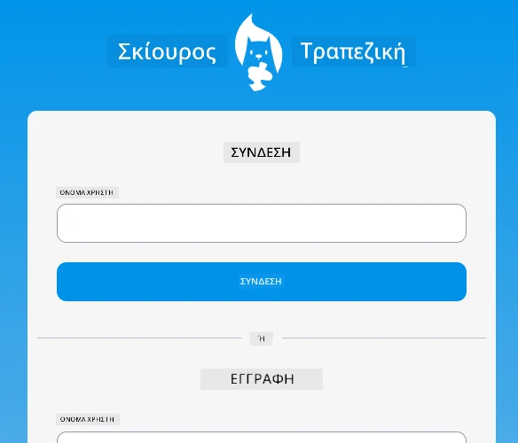
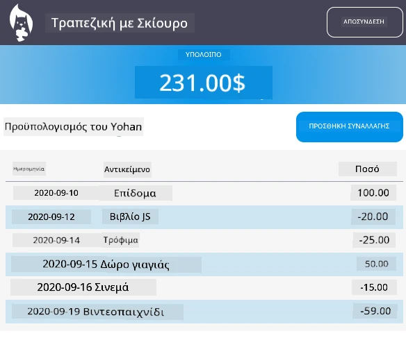

# :dollar: Δημιουργία μιας Τράπεζας

Σε αυτό το έργο, θα μάθετε πώς να δημιουργήσετε μια φανταστική τράπεζα. Αυτά τα μαθήματα περιλαμβάνουν οδηγίες για το πώς να σχεδιάσετε μια web εφαρμογή και να παρέχετε διαδρομές, να δημιουργήσετε φόρμες, να διαχειριστείτε την κατάσταση (state) και να ανακτήσετε δεδομένα από ένα API από το οποίο μπορείτε να αντλήσετε τα δεδομένα της τράπεζας.

|  |  |
|--------------------------------|--------------------------------|

## Μαθήματα

1. [HTML Templates και Διαδρομές σε μια Web Εφαρμογή](1-template-route/README.md)
2. [Δημιουργία Φόρμας Σύνδεσης και Εγγραφής](2-forms/README.md)
3. [Μέθοδοι Ανάκτησης και Χρήσης Δεδομένων](3-data/README.md)
4. [Έννοιες Διαχείρισης Κατάστασης (State Management)](4-state-management/README.md)

### Ευχαριστίες

Αυτά τα μαθήματα γράφτηκαν με :hearts: από τον [Yohan Lasorsa](https://twitter.com/sinedied).

Αν σας ενδιαφέρει να μάθετε πώς να δημιουργήσετε το [server API](/7-bank-project/api/README.md) που χρησιμοποιείται σε αυτά τα μαθήματα, μπορείτε να ακολουθήσετε [αυτή τη σειρά βίντεο](https://aka.ms/NodeBeginner) (ειδικά τα βίντεο 17 έως 21).

Μπορείτε επίσης να ρίξετε μια ματιά σε [αυτό το διαδραστικό μάθημα στο Learn](https://aka.ms/learn/express-api).

---

**Αποποίηση ευθύνης**:  
Αυτό το έγγραφο έχει μεταφραστεί χρησιμοποιώντας την υπηρεσία αυτόματης μετάφρασης [Co-op Translator](https://github.com/Azure/co-op-translator). Παρόλο που καταβάλλουμε προσπάθειες για ακρίβεια, παρακαλούμε να έχετε υπόψη ότι οι αυτοματοποιημένες μεταφράσεις ενδέχεται να περιέχουν λάθη ή ανακρίβειες. Το πρωτότυπο έγγραφο στη μητρική του γλώσσα θα πρέπει να θεωρείται η αυθεντική πηγή. Για κρίσιμες πληροφορίες, συνιστάται επαγγελματική ανθρώπινη μετάφραση. Δεν φέρουμε ευθύνη για τυχόν παρεξηγήσεις ή εσφαλμένες ερμηνείες που προκύπτουν από τη χρήση αυτής της μετάφρασης.