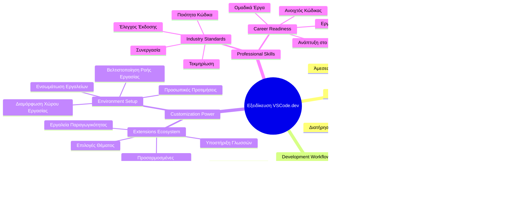

<!--
CO_OP_TRANSLATOR_METADATA:
{
  "original_hash": "a9a3bcc037a447e2d8994d99e871cd9f",
  "translation_date": "2026-01-06T20:28:18+00:00",
  "source_file": "8-code-editor/1-using-a-code-editor/README.md",
  "language_code": "el"
}
-->
# Χρήση Επεξεργαστή Κώδικα: Κυριαρχώντας στο VSCode.dev

Θυμάστε στο *The Matrix* όταν ο Neo έπρεπε να συνδεθεί σε έναν τεράστιο τερματικό υπολογιστή για να έχει πρόσβαση στον ψηφιακό κόσμο; Τα σημερινά εργαλεία ανάπτυξης ιστού είναι η αντίθετη ιστορία – απίστευτα ισχυρές δυνατότητες προσβάσιμες από οπουδήποτε. Το VSCode.dev είναι ένας επεξεργαστής κώδικα που βασίζεται σε πρόγραμμα περιήγησης και φέρνει επαγγελματικά εργαλεία ανάπτυξης σε οποιαδήποτε συσκευή με σύνδεση στο διαδίκτυο.

Όπως ο τυπογραφικός μηχανισμός έκανε τα βιβλία προσιτά σε όλους, όχι μόνο στους γραφείς στα μοναστήρια, έτσι και το VSCode.dev δημοκρατικοποιεί την κωδικοποίηση. Μπορείτε να εργαστείτε σε έργα από έναν υπολογιστή βιβλιοθήκης, ένα εργαστήριο σχολείου ή οπουδήποτε έχετε πρόσβαση μέσω προγράμματος περιήγησης. Χωρίς εγκαταστάσεις, χωρίς περιορισμούς του τύπου «χρειάζομαι το συγκεκριμένο περιβάλλον μου».

Μέχρι το τέλος αυτού του μαθήματος, θα καταλάβετε πώς να περιηγείστε στο VSCode.dev, να ανοίγετε αποθετήρια GitHub απευθείας στο πρόγραμμα περιήγησής σας και να χρησιμοποιείτε το Git για έλεγχο εκδόσεων – όλες δεξιότητες που βασίζονται καθημερινά οι επαγγελματίες προγραμματιστές.

## ⚡ Τι Μπορείτε να Κάνετε στα Επόμενα 5 Λεπτά

**Γρήγορος Οδηγός Εκκίνησης για Πολυάσχολους Προγραμματιστές**


- **Λεπτό 1**: Πλοηγηθείτε στο [vscode.dev](https://vscode.dev) - χωρίς εγκατάσταση
- **Λεπτό 2**: Συνδεθείτε με το GitHub για να συνδέσετε τα αποθετήριά σας
- **Λεπτό 3**: Δοκιμάστε το κόλπο με το URL: αλλάξτε το `github.com` σε `vscode.dev/github` σε οποιοδήποτε URL αποθετηρίου
- **Λεπτό 4**: Δημιουργήστε ένα νέο αρχείο και δείτε τον αυτόματο χρωματισμό σύνταξης να λειτουργεί
- **Λεπτό 5**: Κάντε μια αλλαγή και κάντε commit μέσω του πίνακα Ελέγχου Πηγής

**Γρήγορο URL δοκιμής**:  
```
# Transform this:
github.com/microsoft/Web-Dev-For-Beginners

# Into this:
vscode.dev/github/microsoft/Web-Dev-For-Beginners
```
  
**Γιατί έχει σημασία**: Σε 5 λεπτά, θα ζήσετε την ελευθερία να κωδικοποιείτε οπουδήποτε με επαγγελματικά εργαλεία. Αυτό αντιπροσωπεύει το μέλλον της ανάπτυξης – προσβάσιμο, ισχυρό και άμεσο.

## 🗺️ Το Ταξίδι Μάθησής Σας Μέσα από την Ανάπτυξη που Βασίζεται στο Νέφος


**Προορισμός του Ταξιδιού Σας**: Μέχρι το τέλος αυτού του μαθήματος, θα έχετε κυριαρχήσει σε ένα επαγγελματικό περιβάλλον ανάπτυξης στο νέφος που λειτουργεί από οποιαδήποτε συσκευή, επιτρέποντάς σας να κωδικοποιείτε με τα ίδια εργαλεία που χρησιμοποιούν οι προγραμματιστές σε μεγάλες τεχνολογικές εταιρείες.

## Τι Θα Μάθετε

Μετά από αυτό το μάθημα, θα μπορείτε να:

- Περιηγείστε στο VSCode.dev σαν το δεύτερό σας σπίτι — βρίσκοντας ό,τι χρειάζεστε χωρίς να χάσετε τον προσανατολισμό σας  
- Ανοίγετε οποιοδήποτε αποθετήριο GitHub στο πρόγραμμα περιήγησής σας και να ξεκινάτε επεξεργασία αμέσως (αυτό είναι αρκετά μαγικό!)  
- Χρησιμοποιείτε το Git για να παρακολουθείτε τις αλλαγές σας και να αποθηκεύετε την πρόοδο σας σαν επαγγελματίας  
- Ενισχύετε τον επεξεργαστή σας με επεκτάσεις που κάνουν την κωδικοποίηση πιο γρήγορη και διασκεδαστική  
- Δημιουργείτε και οργανώνετε αρχεία έργων με αυτοπεποίθηση

## Τι Θα Χρειαστείτε

Οι προϋποθέσεις είναι απλές:

- Έναν δωρεάν [λογαριασμό GitHub](https://github.com) (θα σας καθοδηγήσουμε στη δημιουργία αν χρειαστεί)  
- Βασική εξοικείωση με προγράμματα περιήγησης ιστού  
- Το μάθημα GitHub Basics παρέχει χρήσιμο υπόβαθρο, αν και δεν είναι απαραίτητο

> 💡 **Νέος στο GitHub;** Η δημιουργία λογαριασμού είναι δωρεάν και διαρκεί λίγα λεπτά. Όπως μια κάρτα βιβλιοθήκης σας δίνει πρόσβαση σε βιβλία παγκοσμίως, έτσι και ο λογαριασμός GitHub σας ανοίγει πόρτες σε αποθετήρια κώδικα σε όλο το διαδίκτυο.

## 🧠 Επισκόπηση του Οικοσυστήματος Ανάπτυξης στο Νέφος


**Βασική Αρχή**: Τα περιβάλλοντα ανάπτυξης που βασίζονται στο νέφος αντιπροσωπεύουν το μέλλον της κωδικοποίησης – παρέχοντας επαγγελματικά εργαλεία προσβάσιμα, συνεργατικά και ανεξάρτητα από πλατφόρμες.

## Γιατί οι Επεξεργαστές Κώδικα Βασισμένοι στον Ιστό Έχουν Σημασία

Πριν από το διαδίκτυο, οι επιστήμονες σε διαφορετικά πανεπιστήμια δεν μπορούσαν εύκολα να μοιραστούν έρευνα. Τότε ήρθε το ARPANET τη δεκαετία του 1960, συνδέοντας υπολογιστές σε μεγάλες αποστάσεις. Οι επεξεργαστές κώδικα βασισμένοι στον ιστό ακολουθούν αυτήν την ίδια αρχή — κάνοντας δυνατά εργαλεία προσβάσιμα ανεξαρτήτως φυσικής θέσης ή συσκευής.

Ένας επεξεργαστής κώδικα λειτουργεί ως ο χώρος εργασίας ανάπτυξης σας, όπου γράφετε, επεξεργάζεστε και οργανώνετε τα αρχεία κώδικα. Σε αντίθεση με απλούς επεξεργαστές κειμένου, οι επαγγελματικοί επεξεργαστές κώδικα παρέχουν χρωματισμό σύνταξης, ανίχνευση σφαλμάτων και λειτουργίες διαχείρισης έργου.

Το VSCode.dev φέρνει αυτές τις δυνατότητες στο πρόγραμμα περιήγησής σας:

**Πλεονεκτήματα επεξεργασίας βασισμένης στον ιστό:**

| Χαρακτηριστικό | Περιγραφή | Πρακτικό Όφελος |
|---------|-------------|----------|
| **Ανεξαρτησία Πλατφόρμας** | Λειτουργεί σε οποιαδήποτε συσκευή με πρόγραμμα περιήγησης | Εργασία απρόσκοπτα από διάφορους υπολογιστές |
| **Δεν Απαιτεί Εγκατάσταση** | Πρόσβαση μέσω URL ιστού | Παράκαμψη περιορισμών εγκατάστασης λογισμικού |
| **Αυτόματες Ενημερώσεις** | Εφαρμόζει πάντα την πιο πρόσφατη έκδοση | Πρόσβαση σε νέες λειτουργίες χωρίς χειροκίνητες ενημερώσεις |
| **Ενσωμάτωση Αποθετηρίων** | Άμεση σύνδεση με το GitHub | Επεξεργασία κώδικα χωρίς τοπική διαχείριση αρχείων |

**Πρακτικές επιπτώσεις:**  
- Συνέχεια εργασίας σε διαφορετικά περιβάλλοντα  
- Συνεπές περιβάλλον χρήσης ανεξαρτήτως λειτουργικού  
- Άμεσες δυνατότητες συνεργασίας  
- Μειωμένες απαιτήσεις τοπικής αποθήκευσης  

## Εξερευνώντας το VSCode.dev

Όπως το εργαστήριο της Marie Curie περιείχε προηγμένο εξοπλισμό σε έναν σχετικά απλό χώρο, έτσι και το VSCode.dev συγκεντρώνει επαγγελματικά εργαλεία ανάπτυξης μέσα σε ένα περιβάλλον προγράμματος περιήγησης. Αυτή η διαδικτυακή εφαρμογή παρέχει την ίδια βασική λειτουργικότητα με τους επιτραπέζιους επεξεργαστές κώδικα.

Ξεκινήστε πλοηγούμενοι στο [vscode.dev](https://vscode.dev) στο πρόγραμμα περιήγησής σας. Το περιβάλλον φορτώνει χωρίς λήψεις ή εγκαταστάσεις συστήματος – μια άμεση εφαρμογή των αρχών του cloud computing.

### Σύνδεση του Λογαριασμού σας GitHub

Όπως το τηλέφωνο του Alexander Graham Bell συνέδεσε απομακρυσμένες τοποθεσίες, η σύνδεση του λογαριασμού GitHub σας γεφυρώνει το VSCode.dev με τα αποθετήρια κώδικα σας. Όταν σας ζητηθεί να συνδεθείτε με GitHub, συνιστάται να το αποδεχτείτε.

**Η ενσωμάτωση GitHub παρέχει:**  
- Άμεση πρόσβαση στα αποθετήριά σας μέσα στον επεξεργαστή  
- Συγχρονισμένες ρυθμίσεις και επεκτάσεις σε όλες τις συσκευές  
- Εύκολη ροή αποθήκευσης στο GitHub  
- Προσωποποιημένο περιβάλλον ανάπτυξης  

### Γνωρίζοντας τον Νέο Χώρο Εργασίας Σας

Μόλις φορτώσει όλα, θα δείτε έναν καθαρό χώρο εργασίας σχεδιασμένο να σας κρατάει συγκεντρωμένους σε αυτό που έχει σημασία – τον κώδικά σας!


**Ας κάνουμε μια βόλτα στη γειτονιά:**  
- **Μπάρα Δραστηριοτήτων** (η γραμμή αριστερά): Η κύρια πλοήγησή σας με τον Εξερευνητή 📁, Αναζήτηση 🔍, Έλεγχο Πηγής 🌿, Επεκτάσεις 🧩, και Ρυθμίσεις ⚙️  
- **Πλαϊνή Στήλη** (το πάνελ δίπλα της): Αλλάζει για να σας δείχνει σχετικές πληροφορίες ανάλογα με την επιλογή σας  
- **Περιοχή Επεξεργασίας** (ο μεγάλος χώρος στο κέντρο): Εκεί συμβαίνει η μαγεία – ο κύριος χώρος για κωδικοποίηση  

**Πάρτε μια στιγμή να εξερευνήσετε:**  
- Κάντε κλικ στα εικονίδια της Μπάρας Δραστηριοτήτων και δείτε τι κάνει το καθένα  
- Παρατηρήστε πώς η πλαϊνή στήλη ενημερώνεται με διαφορετικές πληροφορίες – αρκετά εντυπωσιακό, έτσι;  
- Η προβολή Εξερευνητή (📁) μάλλον είναι όπου θα περνάτε τον περισσότερο χρόνο, οπότε εξοικειωθείτε με αυτήν  


## Άνοιγμα Αποθετηρίων GitHub

Πριν από το διαδίκτυο, οι ερευνητές έπρεπε να μετακινηθούν φυσικά σε βιβλιοθήκες για να έχουν πρόσβαση σε έγγραφα. Τα αποθετήρια GitHub λειτουργούν παρόμοια – είναι συλλογές κώδικα αποθηκευμένες απομακρυσμένα. Το VSCode.dev καταργεί το παραδοσιακό βήμα του να κατεβάζετε αποθετήρια στη τοπική σας μηχανή πριν την επεξεργασία.

Αυτή η δυνατότητα επιτρέπει άμεση πρόσβαση σε οποιοδήποτε δημόσιο αποθετήριο για προβολή, επεξεργασία ή συνεισφορά. Εδώ είναι δύο μέθοδοι για το άνοιγμα αποθετηρίων:

### Μέθοδος 1: Ο Τρόπος με Κλικ-Κλικ

Ιδανικό όταν ξεκινάτε φρέσκος στο VSCode.dev και θέλετε να ανοίξετε ένα συγκεκριμένο αποθετήριο. Είναι απλός και φιλικός για αρχάριους:

**Πώς το κάνετε:**

1. Πλοηγηθείτε στο [vscode.dev](https://vscode.dev) αν δεν είστε ήδη εκεί  
2. Βρείτε το κουμπί "Άνοιγμα Αποθετηρίου Απομακρυσμένα" στην οθόνη υποδοχής και κάντε κλικ  

   

3. Επικολλήστε οποιοδήποτε URL αποθετηρίου GitHub (δοκιμάστε αυτό: `https://github.com/microsoft/Web-Dev-For-Beginners`)  
4. Πατήστε Enter και δείτε τη μαγεία να συμβαίνει!

**Επαγγελματική συμβουλή - Συντόμευση Command Palette:**  

Θέλετε να νιώσετε σαν μάγος της κωδικοποίησης; Δοκιμάστε αυτήν τη συντόμευση πληκτρολογίου: Ctrl+Shift+P (ή Cmd+Shift+P στο Mac) για να ανοίξετε το Command Palette:


**Το Command Palette είναι σαν μια μηχανή αναζήτησης για οτιδήποτε μπορείτε να κάνετε:**  
- Πληκτρολογήστε "open remote" και θα βρει το εργαλείο ανοίγματος αποθετηρίου για εσάς  
- Θυμάται τα αποθετήρια που ανοίξατε πρόσφατα (πολύ χρήσιμο!)  
- Μόλις το συνηθίσετε, θα νιώσετε σαν να κάνετε κωδικοποίηση με αστραπιαία ταχύτητα  
- Είναι ουσιαστικά η έκδοση του VSCode.dev για «Hey Siri, αλλά για κώδικα»

### Μέθοδος 2: Τεχνική Τροποποίησης URL

Όπως το HTTP και το HTTPS χρησιμοποιούν διαφορετικά πρωτόκολλα διατηρώντας την ίδια δομή τομέα, έτσι και το VSCode.dev χρησιμοποιεί ένα μοτίβο URL που αντικατοπτρίζει το σύστημα διευθύνσεων του GitHub. Κάθε URL αποθετηρίου GitHub μπορεί να τροποποιηθεί για να ανοίξει απευθείας στο VSCode.dev.

**Μοτίβο μετατροπής URL:**

| Τύπος Αποθετηρίου | URL GitHub | URL VSCode.dev |
|----------------|---------------------|----------------|
| **Δημόσιο Αποθετήριο** | `github.com/microsoft/Web-Dev-For-Beginners` | `vscode.dev/github/microsoft/Web-Dev-For-Beginners` |
| **Προσωπικό Έργο** | `github.com/your-username/my-project` | `vscode.dev/github/your-username/my-project` |
| **Οποιοδήποτε Προσιτό Repo** | `github.com/their-username/awesome-repo` | `vscode.dev/github/their-username/awesome-repo` |

**Εφαρμογή:**  
- Αντικαταστήστε το `github.com` με `vscode.dev/github`  
- Διατηρήστε όλα τα άλλα στοιχεία URL ανέπαφα  
- Λειτουργεί με οποιοδήποτε δημόσια προσβάσιμο αποθετήριο  
- Παρέχει άμεση πρόσβαση για επεξεργασία  

> 💡 **Συμβουλή που αλλάζει τη ζωή**: Αποθηκεύστε σελιδοδείκτες τις εκδόσεις VSCode.dev των αγαπημένων σας αποθετηρίων. Έχω σελιδοδείκτες όπως "Επεξεργασία του Portfolio μου" και "Διόρθωση Τεκμηρίωσης" που με πάνε κατευθείαν στη λειτουργία επεξεργασίας!

**Ποια μέθοδο να χρησιμοποιήσετε;**  
- **Ο τρόπος διεπαφής**: Ιδανικός όταν εξερευνάτε ή δεν θυμάστε ακριβή ονόματα αποθετηρίων  
- **Το κόλπο με το URL**: Τέλειο για αστραπιαία πρόσβαση όταν ξέρετε ακριβώς πού πηγαίνετε

### 🎯 Παιδαγωγικός Έλεγχος: Πρόσβαση σε Ανάπτυξη στο Νέφος

**Σταματήστε και Σκεφτείτε**: Μόλις μάθατε δύο μεθόδους για πρόσβαση σε αποθετήρια κώδικα μέσω προγράμματος περιήγησης. Αυτό αντιπροσωπεύει μια θεμελιώδη αλλαγή στον τρόπο που λειτουργεί η ανάπτυξη.

**Γρήγορη Αυτοαξιολόγηση**:  
- Μπορείτε να εξηγήσετε γιατί η επεξεργασία στον ιστό καταργεί την παραδοσιακή «εγκατάσταση περιβάλλοντος ανάπτυξης»;  
- Ποια πλεονεκτήματα έχει η τεχνική τροποποίησης URL έναντι του τοπικού κλωνοποιήματος Git;  
- Πώς αλλάζει αυτή η προσέγγιση τον τρόπο με τον οποίο μπορεί να συμβάλλετε σε έργα ανοιχτού κώδικα;

**Σύνδεση με τον Πραγματικό Κόσμο**: Μεγάλες εταιρείες όπως οι GitHub, GitLab και Replit έχουν χτίσει τις πλατφόρμες ανάπτυξής τους γύρω από αυτές τις αρχές πρώτα-το-νέφος. Μαθαίνετε τις ίδιες ροές εργασίας που χρησιμοποιούν επαγγελματικές ομάδες ανάπτυξης σε όλο τον κόσμο.

**Ερώτηση Πρόκλησης**: Πώς μπορεί η ανάπτυξη που βασίζεται στο νέφος να αλλάξει τον τρόπο που διδάσκεται η κωδικοποίηση στα σχολεία; Σκεφτείτε τις απαιτήσεις συσκευών, τη διαχείριση λογισμικού και τις δυνατότητες συνεργασίας.

## Εργασία με Αρχεία και Έργα

Τώρα που έχετε ανοίξει ένα αποθετήριο, ας ξεκινήσουμε να χτίζουμε! Το VSCode.dev σας παρέχει ό,τι χρειάζεστε για να δημιουργήσετε, να επεξεργαστείτε και να οργανώσετε τα αρχεία κώδικάς σας. Σκεφτείτε το σαν το ψηφιακό σας εργαστήριο – κάθε εργαλείο είναι ακριβώς εκεί που το χρειάζεστε.

Ας δούμε τις καθημερινές εργασίες που θα αποτελέσουν το μεγαλύτερο μέρος της ροής εργασίας σας.

### Δημιουργία Νέων Αρχείων

Όπως η οργάνωση σχεδίων στο γραφείο ενός αρχιτέκτονα, η δημιουργία αρχείων στο VSCode.dev ακολουθεί μια δομημένη προσέγγιση. Το σύστημα υποστηρίζει όλους τους τυπικούς τύπους αρχείων ανάπτυξης ιστού.

**Διαδικασία δημιουργίας αρχείου:**

1. Πλοηγηθείτε στον φάκελο-στόχο στην πλαϊνή στήλη του Εξερευνητή  
2. Περάστε το ποντίκι πάνω από το όνομα φακέλου για να αποκαλυφθεί το εικονίδιο "Νέο Αρχείο" (📄+)  
3. Εισάγετε το όνομα αρχείου μαζί με την κατάλληλη επέκταση (`style.css`, `script.js`, `index.html`)  
4. Πατήστε Enter για να δημιουργήσετε το αρχείο  


**Συμβουλές ονοματοδοσίας:**  
- Χρησιμοποιήστε περιγραφικά ονόματα που δείχνουν τον σκοπό του αρχείου  
- Συμπεριλάβετε επεκτάσεις αρχείων για σωστό χρωματισμό σύνταξης  
- Ακολουθείτε συνεπή μοτίβα ονοματοδοσίας σε όλα τα έργα  
- Χρησιμοποιείτε πεζά γράμματα και παύλες αντί για κενά

### Επεξεργασία και Αποθήκευση Αρχείων

 Εδώ αρχίζει η πραγματική διασκέδαση! Ο επεξεργαστής του VSCode.dev είναι γεμάτος χρήσιμες λειτουργίες που κάνουν την κωδικοποίηση ομαλή και διαισθητική. Είναι σαν να έχετε έναν πολύ έξυπνο βοηθό γραφής, αλλά για κώδικα.

**Η ροή εργασίας σας κατά την επεξεργασία:**

1. Κάντε κλικ σε οποιοδήποτε αρχείο στον Εξερευνητή για να το ανοίξετε στην κύρια περιοχή  
2. Ξεκινήστε να πληκτρολογείτε και δείτε τον VSCode.dev να σας βοηθάει με χρώματα, προτάσεις και ανίχνευση σφαλμάτων  
3. Αποθηκεύστε τη δουλειά σας με Ctrl+S (Windows/Linux) ή Cmd+S (Mac) – παρόλο που αποθηκεύει αυτόματα!


**Τα ωραία πράγματα που συμβαίνουν ενώ γράφετε κώδικα:**  
- Ο κώδικάς σας χρωματίζεται όμορφα και είναι εύκολος στην ανάγνωση  
- Το VSCode.dev προτείνει συμπληρώσεις καθώς πληκτρολογείτε (σαν autocorrect, αλλά πολύ πιο έξυπνο)  
- Εντοπίζει τυπογραφικά λάθη και σφάλματα πριν καν αποθηκεύσετε  
- Μπορείτε να έχετε ανοιχτά πολλά αρχεία σε καρτέλες, όπως σε πρόγραμμα περιήγησης  
- Όλα αποθηκεύονται αυτόματα στο παρασκήνιο

> ⚠️ **Γρήγορη συμβουλή**: Ακόμη κι αν η αυτόματη αποθήκευση σας υποστηρίζει, το να πατάτε Ctrl+S ή Cmd+S είναι καλή συνήθεια. Αποθηκεύει άμεσα τα πάντα και ενεργοποιεί επιπλέον χρήσιμες λειτουργίες όπως ο έλεγχος σφαλμάτων.

### Έλεγχος Εκδόσεων με Git

Όπως οι αρχαιολόγοι δημιουργούν λεπτομερή αρχεία των στρωμάτων ανασκαφών, έτσι και το Git παρακολουθεί τις αλλαγές στον κώδικά σας με το χρόνο. Αυτό το σύστημα διατηρεί την ιστορία του έργου και σας επιτρέπει να επανέλθετε σε προηγούμενες εκδόσεις όποτε χρειαστεί. Το VSCode.dev περιλαμβάνει ενσωματωμένες λειτουργίες Git.

**Διεπαφή Ελέγχου Πηγής:**

1. Πλοηγηθείτε στον πίνακα Ελέγχου Πηγής μέσω του εικονιδίου 🌿 στη Μπάρα Δραστηριοτήτων  
2. Τα τροποποιημένα αρχεία εμφανίζονται στην ενότητα "Αλλαγές"  
3. Ο χρωματισμός δείχνει το είδος των αλλαγών: πράσινο για προσθήκες, κόκκινο για διαγραφές  


**Αποθήκευση της δουλειάς σας (η ροή commit):**


**Η διαδικασία βήμα-βήμα:**  
- Κάντε κλικ στο εικονίδιο "+" δίπλα στα αρχεία που θέλετε να αποθηκεύσετε (αυτό τα "προετοιμάζει")
- Επαναέλεγχος ότι είστε ικανοποιημένοι με όλες τις αλλαγές που έχετε στο staging
- Γράψτε ένα σύντομο σημείωμα που εξηγεί τι κάνατε (αυτό είναι το "commit message" σας)
- Κάντε κλικ στο κουμπί με το σημάδι επιλογής για να αποθηκεύσετε όλα στο GitHub
- Αν αλλάξετε γνώμη για κάτι, το εικονίδιο αναίρεσης σάς επιτρέπει να απορρίψετε τις αλλαγές

**Συγγραφή καλών μηνυμάτων commit (είναι πιο εύκολο απ’ όσο νομίζετε!):**
- Απλώς περιγράψτε τι κάνατε, π.χ. "Προσθήκη φόρμας επικοινωνίας" ή "Διόρθωση σπασμένης πλοήγησης"
- Κρατήστε το σύντομο και περιεκτικό – σαν μήνυμα στο Twitter, όχι έκθεση
- Ξεκινήστε με ρήματα δράσης όπως "Προσθήκη", "Διόρθωση", "Ενημέρωση" ή "Αφαίρεση"
- **Καλές παραδείγματα**: "Προσθήκη responsive μενού πλοήγησης", "Διόρθωση προβλημάτων διάταξης σε κινητά", "Ενημέρωση χρωμάτων για καλύτερη προσβασιμότητα"

> 💡 **Γρήγορη συμβουλή πλοήγησης**: Χρησιμοποιήστε το μενού hamburger (☰) επάνω αριστερά για να επιστρέψετε στο αποθετήριο GitHub και να δείτε τις δεσμευμένες αλλαγές σας online. Είναι σαν πύλη ανάμεσα στο περιβάλλον επεξεργασίας και το σπίτι του έργου σας στο GitHub!

## Ενίσχυση λειτουργικότητας με επεκτάσεις

Όπως το εργαστήριο ενός τεχνίτη περιέχει εξειδικευμένα εργαλεία για διάφορες εργασίες, το VSCode.dev μπορεί να προσαρμοστεί με επεκτάσεις που προσθέτουν συγκεκριμένες δυνατότητες. Αυτά τα πρόσθετα που αναπτύσσονται από την κοινότητα αντιμετωπίζουν κοινές ανάγκες ανάπτυξης όπως μορφοποίηση κώδικα, ζωντανή προεπισκόπηση και βελτιωμένη ενσωμάτωση με το Git.

Η αγορά επεκτάσεων φιλοξενεί χιλιάδες δωρεάν εργαλεία δημιουργημένα από προγραμματιστές από όλο τον κόσμο. Κάθε επέκταση λύνει συγκεκριμένες προκλήσεις ροής εργασίας, επιτρέποντάς σας να δημιουργήσετε ένα προσωπικό περιβάλλον ανάπτυξης προσαρμοσμένο στις δικές σας ανάγκες και προτιμήσεις.


### Βρίσκοντας τις ιδανικές επεκτάσεις σας

Η αγορά επεκτάσεων είναι πολύ καλά οργανωμένη, οπότε δεν θα χαθείτε προσπαθώντας να βρείτε αυτό που χρειάζεστε. Έχει σχεδιαστεί για να σας βοηθήσει να ανακαλύψετε τόσο συγκεκριμένα εργαλεία όσο και ωραία πράγματα που ίσως δεν ξέρατε καν ότι υπάρχουν!

**Πώς να μπείτε στην αγορά:**

1. Κάντε κλικ στο εικονίδιο Επεκτάσεις (🧩) στη γραμμή δραστηριοτήτων
2. Περιηγηθείτε ή αναζητήστε κάτι συγκεκριμένο
3. Κάντε κλικ σε οτιδήποτε σας φαίνεται ενδιαφέρον για να μάθετε περισσότερα


**Τι θα δείτε εκεί μέσα:**

| Τμήμα | Τι Περιέχει | Γιατί Είναι Χρήσιμο |
|----------|---------|----------|
| **Εγκατεστημένες** | Επεκτάσεις που έχετε ήδη προσθέσει | Το προσωπικό σας εργαλείο κωδικοποίησης |
| **Δημοφιλείς** | Οι αγαπημένες της κοινότητας | Σε αυτές βασίζονται οι περισσότεροι προγραμματιστές |
| **Προτεινόμενες** | Έξυπνες προτάσεις για το έργο σας | Χρήσιμες συστάσεις από το VSCode.dev |

**Τι κάνει εύκολη την περιήγηση:**
- Κάθε επέκταση εμφανίζει βαθμολογίες, αριθμό λήψεων και κριτικές πραγματικών χρηστών
- Παρέχονται screenshots και καθαρές περιγραφές για το τι κάνει η κάθε μία
- Όλα σημειώνονται με πληροφορίες συμβατότητας
- Προτείνονται παρόμοιες επεκτάσεις για να συγκρίνετε επιλογές

### Εγκατάσταση επεκτάσεων (Είναι πολύ εύκολη!)

Η προσθήκη νέων δυνατοτήτων στον επεξεργαστή σας γίνεται με το πάτημα ενός κουμπιού. Οι επεκτάσεις εγκαθίστανται σε δευτερόλεπτα και αρχίζουν να λειτουργούν αμέσως – χωρίς επανεκκινήσεις ή αναμονές.

**Αυτό χρειάζεται να κάνετε:**

1. Αναζητήστε αυτό που θέλετε (δοκιμάστε π.χ. "live server" ή "prettier")
2. Κάντε κλικ σε μια που φαίνεται καλή για να δείτε λεπτομέρειες
3. Διαβάστε τι κάνει και δείτε τις βαθμολογίες
4. Πατήστε το μπλε κουμπί "Install" και τελειώσατε!


**Τι συμβαίνει πίσω από τις κουρτίνες:**
- Η επέκταση κατεβαίνει και ρυθμίζεται αυτόματα
- Νέες λειτουργίες εμφανίζονται αμέσως στην διεπαφή σας
- Όλα λειτουργούν αμέσως (σοβαρά, τόσο γρήγορα!)
- Αν είστε συνδεδεμένοι, η επέκταση συγχρονίζεται σε όλες τις συσκευές σας

**Κάποιες επεκτάσεις που προτείνω να ξεκινήσετε:**
- **Live Server**: Δείτε την ιστοσελίδα σας να ενημερώνεται σε πραγματικό χρόνο όπως γράφετε τον κώδικα (είναι μαγικό!)
- **Prettier**: Κάνει τον κώδικά σας καθαρό και επαγγελματικό αυτόματα
- **Auto Rename Tag**: Αλλάξτε μια ετικέτα HTML και η συνδεδεμένη ενημερώνεται κι αυτή
- **Bracket Pair Colorizer**: Χρωματίζει τις αγκύλες σας ώστε να μη χάνεστε
- **GitLens**: Ενισχύει τις λειτουργίες Git με πολύτιμες πληροφορίες

### Παραμετροποίηση των επεκτάσεών σας

Οι περισσότερες επεκτάσεις συνοδεύονται από ρυθμίσεις που μπορείτε να προσαρμόσετε ώστε να λειτουργούν ακριβώς όπως θέλετε. Σκεφτείτε το σαν να ρυθμίζετε το κάθισμα και τους καθρέφτες σε ένα αυτοκίνητο – ο καθένας έχει τις δικές του προτιμήσεις!

**Προσαρμογή ρυθμίσεων επέκτασης:**

1. Εντοπίστε την εγκατεστημένη επέκταση στο πάνελ Επεκτάσεων
2. Ψάξτε το μικρό εικονίδιο γραναζιού (⚙️) δίπλα στο όνομά της και κάντε κλικ
3. Επιλέξτε "Extension Settings" από το αναδυόμενο μενού
4. Τροποποιήστε ό,τι θέλετε μέχρι να είναι όπως προτιμάτε


**Συνηθισμένα πράγματα που μπορεί να θέλετε να ρυθμίσετε:**
- Πώς μορφοποιείται ο κώδικάς σας (tabs ή κενά, μήκος γραμμής κ.λπ.)
- Ποιοι συνδυασμοί πλήκτρων ενεργοποιούν διάφορες ενέργειες
- Τι είδους αρχεία να δουλεύει η επέκταση
- Να ενεργοποιήσετε ή απενεργοποιήσετε συγκεκριμένες λειτουργίες για καθαρότερο περιβάλλον

### Διατήρηση των επεκτάσεων οργανωμένων

Καθώς ανακαλύπτετε περισσότερες ωραίες επεκτάσεις, θα θέλετε να κρατάτε τη συλλογή σας τακτοποιημένη και λειτουργική. Το VSCode.dev το καθιστά πολύ εύκολο.

**Επιλογές διαχείρισης επεκτάσεων:**

| Τι Μπορείτε να Κάνετε | Πότε Είναι Χρήσιμο | Επαγγελματική Συμβουλή |
|--------|---------|----------|
| **Απενεργοποίηση** | Δοκιμάζετε αν μια επέκταση προκαλεί προβλήματα | Καλύτερο από την απεγκατάσταση αν θέλετε να την επαναφέρετε αργότερα |
| **Απεγκατάσταση** | Απομάκρυνση επεκτάσεων που δεν χρειάζεστε | Κρατά το περιβάλλον σας καθαρό και γρήγορο |
| **Ενημέρωση** | Λήψη των τελευταίων χαρακτηριστικών και διορθώσεων | Συνήθως αυτόματα, αλλά καλό να ελέγχετε |

**Πώς διαχειρίζομαι εγώ τις επεκτάσεις:**
- Κάθε λίγους μήνες επανεξετάζω τι έχω εγκαταστήσει και αφαιρώ ό,τι δεν χρησιμοποιώ
- Κρατώ τις επεκτάσεις ενημερωμένες ώστε να έχω τις τελευταίες βελτιώσεις και διορθώσεις ασφαλείας
- Αν κάτι πάει αργά, απενεργοποιώ προσωρινά επεκτάσεις για να δω αν φταίει κάποια από αυτές
- Διαβάζω τις σημειώσεις ενημερώσεων όταν έρχονται σημαντικές αλλαγές – κάποιες φορές προστίθενται ωραίες νέες λειτουργίες!

> ⚠️ **Συμβουλή απόδοσης**: Οι επεκτάσεις είναι υπέροχες, αλλά πολλές μαζί μπορεί να επιβραδύνουν. Επικεντρωθείτε σε αυτές που πραγματικά κάνουν την ζωή σας ευκολότερη και μην φοβάστε να απεγκαταστήσετε όσες δεν χρησιμοποιείτε ποτέ.

### 🎯 Εκπαιδευτικός Έλεγχος: Προσαρμογή Περιβάλλοντος Ανάπτυξης

**Κατανόηση Αρχιτεκτονικής**: Έχετε μάθει να προσαρμόζετε ένα επαγγελματικό περιβάλλον ανάπτυξης με επεκτάσεις που δημιουργεί η κοινότητα. Αυτό αντανακλά πώς οι ομάδες ανάπτυξης επιχειρήσεων δημιουργούν τυποποιημένα εργαλεία.

**Κύριες Έννοιες που Κατακτήσατε**:
- **Ανακάλυψη Επεκτάσεων**: Εύρεση εργαλείων που λύνουν συγκεκριμένες προκλήσεις ανάπτυξης
- **Διαμόρφωση Περιβάλλοντος**: Προσαρμογή εργαλείων στις προσωπικές ή ομαδικές προτιμήσεις
- **Βελτιστοποίηση Απόδοσης**: Ισορροπία λειτουργικότητας με απόδοση συστήματος
- **Συνεργασία Κοινότητας**: Αξιοποίηση εργαλείων από παγκόσμια κοινότητα προγραμματιστών

**Σύνδεση με τη Βιομηχανία**: Οικοσυστήματα επεκτάσεων τροφοδοτούν σημαντικές πλατφόρμες ανάπτυξης όπως το VS Code, το Chrome DevTools και μοντέρνα IDEs. Η κατανόηση της αξιολόγησης, εγκατάστασης και διαμόρφωσης επεκτάσεων είναι απαραίτητη για επαγγελματικές διαδικασίες ανάπτυξης.

**Ερώτηση Αναστοχασμού**: Πώς θα προσέγγιζες τη δημιουργία ενός τυποποιημένου περιβάλλοντος ανάπτυξης για μια ομάδα 10 προγραμματιστών; Σκέψου θέματα όπως συνέπεια, απόδοση και ατομικές προτιμήσεις.

## 📈 Το Χρονοδιάγραμμα της Κυριαρχίας σας στην Ανάπτυξη στο Cloud


**🎓 Ορόσημο Αποφοίτησης**: Έχετε επιτυχώς κυριαρχήσει στην ανάπτυξη στο σύννεφο χρησιμοποιώντας τα ίδια εργαλεία και ροές εργασίας που χρησιμοποιούν οι επαγγελματίες προγραμματιστές στις μεγάλες τεχνολογικές εταιρείες. Αυτές οι δεξιότητες αντιπροσωπεύουν το μέλλον της ανάπτυξης λογισμικού.

**🔄 Δυνατότητες Επόμενου Επιπέδου**:
- Έτοιμοι να εξερευνήσετε προηγμένες πλατφόρμες ανάπτυξης στο cloud (Codespaces, GitPod)
- Προετοιμασμένοι να δουλέψετε σε διανεμημένες ομάδες ανάπτυξης
- Εξοπλισμένοι για συνεισφορά σε έργα ανοιχτού κώδικα παγκοσμίως
- Θεμέλια για σύγχρονες πρακτικές DevOps και συνεχή ολοκλήρωση

## Πρόκληση GitHub Copilot Agent 🚀

Όπως η δομημένη προσέγγιση που χρησιμοποιεί η NASA για διαστημικές αποστολές, αυτή η πρόκληση περιλαμβάνει συστηματική εφαρμογή δεξιοτήτων VSCode.dev σε ένα πλήρες σενάριο ροής εργασίας.

**Στόχος:** Δείξτε επάρκεια με το VSCode.dev δημιουργώντας μια ολοκληρωμένη ροή εργασίας ανάπτυξης ιστοσελίδας.

**Απαιτήσεις έργου:** Χρησιμοποιώντας τη βοήθεια λειτουργίας Agent, ολοκληρώστε τα εξής:
1. Κλωνοποιήστε ένα υπάρχον αποθετήριο ή δημιουργήστε ένα νέο
2. Οργανώστε μια λειτουργική δομή έργου με αρχεία HTML, CSS και JavaScript
3. Εγκαταστήστε και ρυθμίστε τρεις επεκτάσεις που βελτιώνουν την ανάπτυξη
4. Εξασκηθείτε στον έλεγχο εκδόσεων με περιγραφικά μηνύματα commit
5. Πειραματιστείτε με τη δημιουργία και τροποποίηση κλαδιών λειτουργιών (feature branches)
6. Τεκμηριώστε τη διαδικασία και τα μαθήματα σε αρχείο README.md

Αυτή η άσκηση συγκεντρώνει όλες τις έννοιες του VSCode.dev σε μια πρακτική ροή εργασίας που μπορείτε να εφαρμόσετε σε μελλοντικά έργα ανάπτυξης.

Μάθετε περισσότερα για τη [λειτουργία agent](https://code.visualstudio.com/blogs/2025/02/24/introducing-copilot-agent-mode) εδώ.

## Εργασία

Ήρθε η ώρα να δοκιμάσετε αυτές τις δεξιότητες σε μια πραγματική εφαρμογή! Έχω ένα πρακτικό έργο που θα σας επιτρέψει να εξασκηθείτε σε όλα όσα καλύψαμε: [Δημιουργήστε μια ιστοσελίδα βιογραφικού χρησιμοποιώντας VSCode.dev](./assignment.md)

Αυτή η εργασία σας καθοδηγεί στο να χτίσετε μια επαγγελματική ιστοσελίδα βιογραφικού ολοκληρωτικά στον browser σας. Θα χρησιμοποιήσετε όλες τις δυνατότητες του VSCode.dev που εξερευνήσαμε και στο τέλος θα έχετε μια όμορφη ιστοσελίδα και σίγουρη αυτοπεποίθηση στην νέα σας ροή εργασίας.

## Συνεχίστε να Εξερευνάτε και να Αναπτύσσετε τις Δεξιότητές σας

Έχετε πια μια στέρεη βάση, αλλά υπάρχουν τόσα πολλά ακόμα ωραία πράγματα να ανακαλύψετε! Εδώ είναι μερικοί πόροι και ιδέες για να ανεβάσετε τις δεξιότητές σας στο VSCode.dev σε επόμενο επίπεδο:

**Επίσημα έγγραφα που αξίζει να αποθηκεύσετε:**
- [Τεκμηρίωση VSCode Web](https://code.visualstudio.com/docs/editor/vscode-web?WT.mc_id=academic-0000-alfredodeza) – Ο πλήρης οδηγός για επεξεργασία σε browser
- [GitHub Codespaces](https://docs.github.com/en/codespaces) – Όταν θέλετε ακόμα περισσότερη ισχύ στο cloud

**Ωραίες λειτουργίες για επόμενο πείραμα:**
- **Συντομεύσεις πληκτρολογίου**: Μάθετε τους συνδυασμούς που θα σας κάνουν να νιώθετε σαν νίντζα κωδικοποίησης
- **Ρυθμίσεις Workspace**: Δημιουργήστε διαφορετικά περιβάλλοντα για διάφορα είδη έργων
- **Multi-root Workspaces**: Δουλέψτε σε πολλαπλά αποθετήρια ταυτόχρονα (πολύ βολικό!)
- **Ενσωμάτωση Τερματικού**: Πρόσβαση σε εργαλεία γραμμής εντολών μέσα από τον browser

**Ιδέες για πρακτική:**
- Εμπλακείτε σε έργα ανοιχτού κώδικα και συνεισφέρετε χρησιμοποιώντας VSCode.dev – είναι τρόπος να προσφέρετε πίσω!
- Δοκιμάστε διαφορετικές επεκτάσεις για να βρείτε την ιδανική διαμόρφωση
- Δημιουργήστε πρότυπα έργων για τα είδη ιστοσελίδων που φτιάχνετε πιο συχνά
- Εξασκηθείτε σε ροές εργασίας Git όπως branching και merging – αυτά είναι χρυσά σε ομαδικά έργα

---

**Έχετε κυριαρχήσει στην ανάπτυξη μέσω browser!** 🎉 Όπως η επινόηση φορητών οργάνων επέτρεψε στους επιστήμονες να διεξάγουν έρευνα σε απομακρυσμένα σημεία, το VSCode.dev επιτρέπει επαγγελματική κωδικοποίηση από οποιαδήποτε συσκευή με σύνδεση στο διαδίκτυο.

Αυτές οι δεξιότητες αντικατοπτρίζουν τις τρέχουσες βιομηχανικές πρακτικές – πολλοί επαγγελματίες προγραμματιστές χρησιμοποιούν περιβάλλοντα ανάπτυξης βασισμένα στο cloud για την ευελιξία και προσβασιμότητά τους. Έχετε μάθει μια ροή εργασίας που κλιμακώνεται από ατομικά έργα έως μεγάλες ομαδικές συνεργασίες.

Εφαρμόστε αυτές τις τεχνικές στο επόμενο αναπτυξιακό έργο σας! 🚀

---

<!-- CO-OP TRANSLATOR DISCLAIMER START -->
**Αποποίηση ευθυνών**:  
Αυτό το έγγραφο έχει μεταφραστεί χρησιμοποιώντας την υπηρεσία μετάφρασης AI [Co-op Translator](https://github.com/Azure/co-op-translator). Παρόλο που επιδιώκουμε την ακρίβεια, παρακαλούμε να λάβετε υπόψη ότι οι αυτοματοποιημένες μεταφράσεις μπορεί να περιέχουν λάθη ή ανακρίβειες. Το πρωτότυπο έγγραφο στη γλώσσα του θα πρέπει να θεωρείται η αυθεντική πηγή. Για κρίσιμες πληροφορίες, συνιστάται επαγγελματική ανθρώπινη μετάφραση. Δεν φέρουμε ευθύνη για τυχόν παρεξηγήσεις ή λανθασμένες ερμηνείες που προκύπτουν από τη χρήση αυτής της μετάφρασης.
<!-- CO-OP TRANSLATOR DISCLAIMER END -->