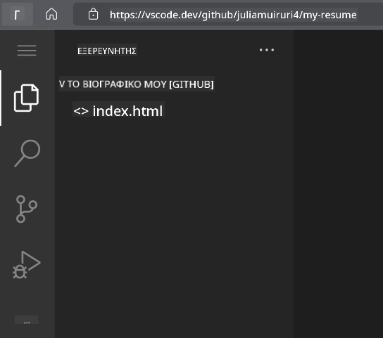
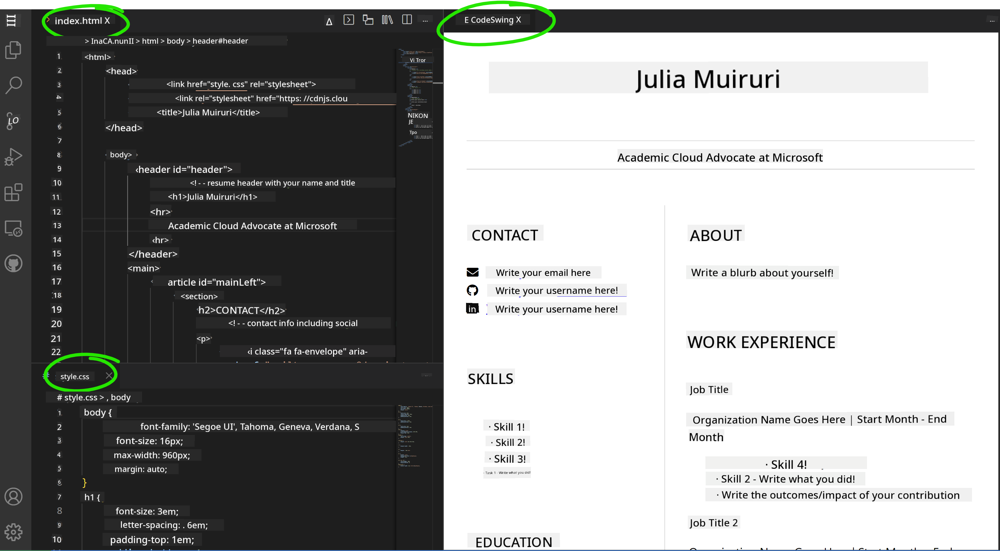

<!--
CO_OP_TRANSLATOR_METADATA:
{
  "original_hash": "effe56ba51c38d7bdfad1ea38288666b",
  "translation_date": "2025-10-23T19:59:07+00:00",
  "source_file": "8-code-editor/1-using-a-code-editor/assignment.md",
  "language_code": "el"
}
-->
# Δημιουργία Ιστοσελίδας Βιογραφικού με το VSCode.dev

Αναβαθμίστε τις επαγγελματικές σας προοπτικές δημιουργώντας μια ιστοσελίδα βιογραφικού που παρουσιάζει τις δεξιότητες και την εμπειρία σας σε ένα διαδραστικό, μοντέρνο format. Αντί να στέλνετε παραδοσιακά PDF, φανταστείτε να παρέχετε στους υπεύθυνους προσλήψεων μια κομψή, ευέλικτη ιστοσελίδα που αναδεικνύει τόσο τα προσόντα σας όσο και τις ικανότητές σας στον προγραμματισμό ιστοσελίδων.

Αυτή η πρακτική εργασία σας δίνει την ευκαιρία να εφαρμόσετε όλες τις δεξιότητες που έχετε αποκτήσει στο VSCode.dev, δημιουργώντας κάτι πραγματικά χρήσιμο για την καριέρα σας. Θα βιώσετε ολόκληρη τη διαδικασία ανάπτυξης ιστοσελίδων – από τη δημιουργία του αποθετηρίου μέχρι την ανάπτυξη – όλα μέσα από τον browser σας.

Ολοκληρώνοντας αυτό το project, θα έχετε μια επαγγελματική online παρουσία που μπορεί να μοιραστεί εύκολα με πιθανούς εργοδότες, να ενημερωθεί καθώς εξελίσσονται οι δεξιότητές σας και να προσαρμοστεί ώστε να ταιριάζει με το προσωπικό σας brand. Αυτό είναι ακριβώς το είδος του πρακτικού project που δείχνει πραγματικές δεξιότητες ανάπτυξης ιστοσελίδων.

## Στόχοι Μάθησης

Μετά την ολοκλήρωση αυτής της εργασίας, θα μπορείτε να:

- **Δημιουργήσετε** και να διαχειριστείτε ένα πλήρες project ανάπτυξης ιστοσελίδας χρησιμοποιώντας το VSCode.dev
- **Δομήσετε** μια επαγγελματική ιστοσελίδα με χρήση στοιχείων HTML με νόημα
- **Στυλιζάρετε** ευέλικτες διατάξεις με σύγχρονες τεχνικές CSS
- **Εφαρμόσετε** διαδραστικά χαρακτηριστικά χρησιμοποιώντας βασικές τεχνολογίες web
- **Αναπτύξετε** μια ζωντανή ιστοσελίδα προσβάσιμη μέσω ενός κοινόχρηστου URL
- **Δείξετε** βέλτιστες πρακτικές ελέγχου εκδόσεων καθ' όλη τη διάρκεια της διαδικασίας ανάπτυξης

## Προαπαιτούμενα

Πριν ξεκινήσετε αυτή την εργασία, βεβαιωθείτε ότι έχετε:

- Λογαριασμό στο GitHub (δημιουργήστε έναν στο [github.com](https://github.com/) αν χρειάζεται)
- Ολοκληρώσει το μάθημα του VSCode.dev που καλύπτει την πλοήγηση στη διεπαφή και τις βασικές λειτουργίες
- Βασική κατανόηση της δομής HTML και των εννοιών στυλιζαρίσματος CSS

## Ρύθμιση Project και Δημιουργία Αποθετηρίου

Ας ξεκινήσουμε δημιουργώντας τη βάση του project σας. Αυτή η διαδικασία αντικατοπτρίζει τις πραγματικές ροές εργασίας ανάπτυξης, όπου τα projects ξεκινούν με σωστή αρχικοποίηση αποθετηρίου και σχεδιασμό δομής.

### Βήμα 1: Δημιουργία Αποθετηρίου στο GitHub

Η δημιουργία ενός αφιερωμένου αποθετηρίου εξασφαλίζει ότι το project σας είναι σωστά οργανωμένο και ελέγχεται από την αρχή.

1. **Μεταβείτε** στο [GitHub.com](https://github.com) και συνδεθείτε στον λογαριασμό σας
2. **Κάντε κλικ** στο πράσινο κουμπί "New" ή στο εικονίδιο "+" στην επάνω δεξιά γωνία
3. **Ονομάστε** το αποθετήριο σας `my-resume` (ή επιλέξτε ένα προσωπικό όνομα όπως `john-smith-resume`)
4. **Προσθέστε** μια σύντομη περιγραφή: "Επαγγελματική ιστοσελίδα βιογραφικού φτιαγμένη με HTML και CSS"
5. **Επιλέξτε** "Public" για να κάνετε το βιογραφικό σας προσβάσιμο σε πιθανούς εργοδότες
6. **Επιλέξτε** "Add a README file" για να δημιουργήσετε μια αρχική περιγραφή project
7. **Κάντε κλικ** στο "Create repository" για να ολοκληρώσετε τη ρύθμιση

> 💡 **Συμβουλή για Ονομασία Αποθετηρίου**: Χρησιμοποιήστε περιγραφικά, επαγγελματικά ονόματα που δείχνουν ξεκάθαρα τον σκοπό του project. Αυτό βοηθά όταν το μοιράζεστε με εργοδότες ή κατά την αξιολόγηση του portfolio σας.

### Βήμα 2: Αρχικοποίηση Δομής Project

Επειδή το VSCode.dev απαιτεί τουλάχιστον ένα αρχείο για να ανοίξει ένα αποθετήριο, θα δημιουργήσουμε το κύριο αρχείο HTML απευθείας στο GitHub πριν μεταβούμε στον web editor.

1. **Κάντε κλικ** στον σύνδεσμο "creating a new file" στο νέο σας αποθετήριο
2. **Πληκτρολογήστε** `index.html` ως όνομα αρχείου
3. **Προσθέστε** την αρχική δομή HTML:

```html
<!DOCTYPE html>
<html lang="en">
<head>
    <meta charset="UTF-8">
    <meta name="viewport" content="width=device-width, initial-scale=1.0">
    <title>Your Name - Professional Resume</title>
</head>
<body>
    <h1>Your Name</h1>
    <p>Professional Resume Website</p>
</body>
</html>
```

4. **Γράψτε** ένα μήνυμα commit: "Προσθήκη αρχικής δομής HTML"
5. **Κάντε κλικ** στο "Commit new file" για να αποθηκεύσετε τις αλλαγές σας


**Τι επιτυγχάνει αυτή η αρχική ρύθμιση:**
- **Καθιερώνει** σωστή δομή εγγράφου HTML5 με στοιχεία με νόημα
- **Περιλαμβάνει** meta tag για συμβατότητα με ευέλικτο σχεδιασμό
- **Ορίζει** έναν περιγραφικό τίτλο σελίδας που εμφανίζεται στις καρτέλες του browser
- **Δημιουργεί** τη βάση για επαγγελματική οργάνωση περιεχομένου

## Εργασία στο VSCode.dev

Τώρα που η βάση του αποθετηρίου σας έχει δημιουργηθεί, ας μεταβούμε στο VSCode.dev για την κύρια εργασία ανάπτυξης. Αυτός ο web-based editor παρέχει όλα τα εργαλεία που χρειάζονται για επαγγελματική ανάπτυξη ιστοσελίδων.

### Βήμα 3: Άνοιγμα του Project στο VSCode.dev

1. **Μεταβείτε** στο [vscode.dev](https://vscode.dev) σε μια νέα καρτέλα του browser
2. **Κάντε κλικ** στο "Open Remote Repository" στην οθόνη υποδοχής
3. **Αντιγράψτε** το URL του αποθετηρίου σας από το GitHub και επικολλήστε το στο πεδίο εισαγωγής

   Μορφή: `https://github.com/your-username/my-resume`
   
   *Αντικαταστήστε το `your-username` με το πραγματικό σας όνομα χρήστη στο GitHub*

4. **Πατήστε** Enter για να φορτώσετε το project σας

✅ **Δείκτης επιτυχίας**: Θα πρέπει να δείτε τα αρχεία του project σας στην πλαϊνή μπάρα του Explorer και το `index.html` διαθέσιμο για επεξεργασία στην κύρια περιοχή του editor.



**Τι θα δείτε στη διεπαφή:**
- **Πλαϊνή μπάρα Explorer**: **Εμφανίζει** τα αρχεία και τη δομή φακέλων του αποθετηρίου σας
- **Περιοχή επεξεργασίας**: **Δείχνει** το περιεχόμενο των επιλεγμένων αρχείων για επεξεργασία
- **Μπάρα δραστηριοτήτων**: **Παρέχει** πρόσβαση σε λειτουργίες όπως Source Control και Extensions
- **Μπάρα κατάστασης**: **Δείχνει** την κατάσταση σύνδεσης και πληροφορίες για το τρέχον branch

### Βήμα 4: Δημιουργία Περιεχομένου Βιογραφικού

Αντικαταστήστε το περιεχόμενο placeholder στο `index.html` με μια ολοκληρωμένη δομή βιογραφικού. Αυτή η HTML παρέχει τη βάση για μια επαγγελματική παρουσίαση των προσόντων σας.

<details>
<summary><b>Πλήρης Δομή HTML Βιογραφικού</b></summary>

```html
<!DOCTYPE html>
<html lang="en">
<head>
    <meta charset="UTF-8">
    <meta name="viewport" content="width=device-width, initial-scale=1.0">
    <link href="style.css" rel="stylesheet">
    <link rel="stylesheet" href="https://cdnjs.cloudflare.com/ajax/libs/font-awesome/5.15.4/css/all.min.css">
    <title>Your Name - Professional Resume</title>
</head>
<body>
    <header id="header">
        <h1>Your Full Name</h1>
        <hr>
        <p class="role">Your Professional Title</p>
        <hr>
    </header>
    
    <main>
        <article id="mainLeft">
            <section>
                <h2>CONTACT</h2>
                <p>
                    <i class="fa fa-envelope" aria-hidden="true"></i>
                    <a href="mailto:your.email@domain.com">your.email@domain.com</a>
                </p>
                <p>
                    <i class="fab fa-github" aria-hidden="true"></i>
                    <a href="https://github.com/your-username">github.com/your-username</a>
                </p>
                <p>
                    <i class="fab fa-linkedin" aria-hidden="true"></i>
                    <a href="https://linkedin.com/in/your-profile">linkedin.com/in/your-profile</a>
                </p>
            </section>
            
            <section>
                <h2>SKILLS</h2>
                <ul>
                    <li>HTML5 & CSS3</li>
                    <li>JavaScript (ES6+)</li>
                    <li>Responsive Web Design</li>
                    <li>Version Control (Git)</li>
                    <li>Problem Solving</li>
                </ul>
            </section>
            
            <section>
                <h2>EDUCATION</h2>
                <h3>Your Degree or Certification</h3>
                <p>Institution Name</p>
                <p>Start Date - End Date</p>
            </section>
        </article>
        
        <article id="mainRight">
            <section>
                <h2>ABOUT</h2>
                <p>Write a compelling summary that highlights your passion for web development, key achievements, and career goals. This section should give employers insight into your personality and professional approach.</p>
            </section>
            
            <section>
                <h2>WORK EXPERIENCE</h2>
                <div class="job">
                    <h3>Job Title</h3>
                    <p class="company">Company Name | Start Date – End Date</p>
                    <ul>
                        <li>Describe a key accomplishment or responsibility</li>
                        <li>Highlight specific skills or technologies used</li>
                        <li>Quantify impact where possible (e.g., "Improved efficiency by 25%")</li>
                    </ul>
                </div>
                
                <div class="job">
                    <h3>Previous Job Title</h3>
                    <p class="company">Previous Company | Start Date – End Date</p>
                    <ul>
                        <li>Focus on transferable skills and achievements</li>
                        <li>Demonstrate growth and learning progression</li>
                        <li>Include any leadership or collaboration experiences</li>
                    </ul>
                </div>
            </section>
            
            <section>
                <h2>PROJECTS</h2>
                <div class="project">
                    <h3>Project Name</h3>
                    <p>Brief description of what the project accomplishes and technologies used.</p>
                    <a href="#" target="_blank">View Project</a>
                </div>
            </section>
        </article>
    </main>
</body>
</html>
```
</details>

**Οδηγίες προσαρμογής:**
- **Αντικαταστήστε** όλο το placeholder κείμενο με τις πραγματικές σας πληροφορίες
- **Προσαρμόστε** τις ενότητες ανάλογα με το επίπεδο εμπειρίας και την εστίαση της καριέρας σας
- **Προσθέστε** ή αφαιρέστε ενότητες όπως απαιτείται (π.χ., Πιστοποιήσεις, Εθελοντική Εργασία, Γλώσσες)
- **Συμπεριλάβετε** συνδέσμους στα πραγματικά σας προφίλ και projects

### Βήμα 5: Δημιουργία Υποστηρικτικών Αρχείων

Οι επαγγελματικές ιστοσελίδες απαιτούν οργανωμένες δομές αρχείων. Δημιουργήστε το CSS stylesheet και τα αρχεία ρυθμίσεων που χρειάζονται για ένα πλήρες project.

1. **Περάστε το ποντίκι** πάνω από το όνομα του φακέλου του project σας στην πλαϊνή μπάρα Explorer
2. **Κάντε κλικ** στο εικονίδιο "New File" (📄+) που εμφανίζεται
3. **Δημιουργήστε** αυτά τα αρχεία ένα προς ένα:
   - `style.css` (για στυλιζάρισμα και διάταξη)
   - `codeswing.json` (για τη ρύθμιση της επέκτασης προεπισκόπησης)

**Δημιουργία του αρχείου CSS (`style.css`):**

<details>
<summary><b>Επαγγελματικό Στυλιζάρισμα CSS</b></summary>

```css
/* Modern Resume Styling */
body {
    font-family: 'Segoe UI', Tahoma, Geneva, Verdana, sans-serif;
    font-size: 16px;
    line-height: 1.6;
    max-width: 960px;
    margin: 0 auto;
    padding: 20px;
    color: #333;
    background-color: #f9f9f9;
}

/* Header Styling */
header {
    text-align: center;
    margin-bottom: 3em;
    padding: 2em;
    background: linear-gradient(135deg, #667eea 0%, #764ba2 100%);
    color: white;
    border-radius: 10px;
    box-shadow: 0 4px 6px rgba(0, 0, 0, 0.1);
}

h1 {
    font-size: 3em;
    letter-spacing: 0.1em;
    margin-bottom: 0.2em;
    font-weight: 300;
}

.role {
    font-size: 1.3em;
    font-weight: 300;
    margin: 1em 0;
}

/* Main Content Layout */
main {
    display: grid;
    grid-template-columns: 35% 65%;
    gap: 3em;
    margin-top: 3em;
    background: white;
    padding: 2em;
    border-radius: 10px;
    box-shadow: 0 2px 10px rgba(0, 0, 0, 0.1);
}

/* Typography */
h2 {
    font-size: 1.4em;
    font-weight: 600;
    margin-bottom: 1em;
    color: #667eea;
    border-bottom: 2px solid #667eea;
    padding-bottom: 0.3em;
}

h3 {
    font-size: 1.1em;
    font-weight: 600;
    margin-bottom: 0.5em;
    color: #444;
}

/* Section Styling */
section {
    margin-bottom: 2.5em;
}

#mainLeft {
    border-right: 1px solid #e0e0e0;
    padding-right: 2em;
}

/* Contact Links */
section a {
    color: #667eea;
    text-decoration: none;
    transition: color 0.3s ease;
}

section a:hover {
    color: #764ba2;
    text-decoration: underline;
}

/* Icons */
i {
    margin-right: 0.8em;
    width: 20px;
    text-align: center;
    color: #667eea;
}

/* Lists */
ul {
    list-style: none;
    padding-left: 0;
}

li {
    margin: 0.5em 0;
    padding: 0.3em 0;
    position: relative;
}

li:before {
    content: "▸";
    color: #667eea;
    margin-right: 0.5em;
}

/* Work Experience */
.job, .project {
    margin-bottom: 2em;
    padding-bottom: 1.5em;
    border-bottom: 1px solid #f0f0f0;
}

.company {
    font-style: italic;
    color: #666;
    margin-bottom: 0.5em;
}

/* Responsive Design */
@media (max-width: 768px) {
    main {
        grid-template-columns: 1fr;
        gap: 2em;
    }
    
    #mainLeft {
        border-right: none;
        border-bottom: 1px solid #e0e0e0;
        padding-right: 0;
        padding-bottom: 2em;
    }
    
    h1 {
        font-size: 2.2em;
    }
    
    body {
        padding: 10px;
    }
}

/* Print Styles */
@media print {
    body {
        background: white;
        color: black;
        font-size: 12pt;
    }
    
    header {
        background: none;
        color: black;
        box-shadow: none;
    }
    
    main {
        box-shadow: none;
    }
}
```
</details>

**Δημιουργία του αρχείου ρυθμίσεων (`codeswing.json`):**

```json
{
    "scripts": [],
    "styles": []
}
```

**Κατανόηση των χαρακτηριστικών CSS:**
- **Χρησιμοποιεί** CSS Grid για ευέλικτη, επαγγελματική διάταξη
- **Εφαρμόζει** σύγχρονα χρωματικά σχήματα με κεφαλίδες gradient
- **Περιλαμβάνει** εφέ hover και ομαλές μεταβάσεις για διαδραστικότητα
- **Παρέχει** ευέλικτο σχεδιασμό που λειτουργεί σε όλες τις συσκευές
- **Προσθέτει** στυλ φιλικά προς την εκτύπωση για δημιουργία PDF

### Βήμα 6: Εγκατάσταση και Ρύθμιση Επεκτάσεων

Οι επεκτάσεις βελτιώνουν την εμπειρία ανάπτυξης παρέχοντας δυνατότητες ζωντανής προεπισκόπησης και εργαλεία για καλύτερη ροή εργασίας. Η επέκταση CodeSwing είναι ιδιαίτερα χρήσιμη για projects ανάπτυξης ιστοσελίδων.

**Εγκατάσταση της Επέκτασης CodeSwing:**

1. **Κάντε κλικ** στο εικονίδιο Extensions (🧩) στη Μπάρα Δραστηριοτήτων
2. **Αναζητήστε** "CodeSwing" στο πλαίσιο αναζήτησης της αγοράς
3. **Επιλέξτε** την επέκταση CodeSwing από τα αποτελέσματα αναζήτησης
4. **Κάντε κλικ** στο μπλε κουμπί "Install"


**Τι παρέχει το CodeSwing:**
- **Ενεργοποιεί** ζωντανή προεπισκόπηση της ιστοσελίδας σας καθώς την επεξεργάζεστε
- **Εμφανίζει** αλλαγές σε πραγματικό χρόνο χωρίς χειροκίνητη ανανέωση
- **Υποστηρίζει** πολλαπλούς τύπους αρχείων, όπως HTML, CSS και JavaScript
- **Παρέχει** μια ολοκληρωμένη εμπειρία περιβάλλοντος ανάπτυξης

**Άμεσα αποτελέσματα μετά την εγκατάσταση:**
Μόλις εγκατασταθεί το CodeSwing, θα δείτε μια ζωντανή προεπισκόπηση της ιστοσελίδας βιογραφικού σας να εμφανίζεται στον editor. Αυτό σας επιτρέπει να δείτε ακριβώς πώς φαίνεται η ιστοσελίδα σας καθώς κάνετε αλλαγές.



**Κατανόηση της βελτιωμένης διεπαφής:**
- **Διαχωρισμένη προβολή**: **Δείχνει** τον κώδικα στη μία πλευρά και τη ζωντανή προεπισκόπηση στην άλλη
- **Ενημερώσεις σε πραγματικό χρόνο**: **Αντικατοπτρίζει** τις αλλαγές άμεσα καθώς πληκτρολογείτε
- **Διαδραστική προεπισκόπηση**: **Επιτρέπει** να δοκιμάσετε συνδέσμους και αλληλεπιδράσεις
- **Προσομοίωση κινητών**: **Παρέχει** δυνατότητες δοκιμής ευέλικτου σχεδιασμού

### Βήμα 7: Έλεγχος Εκδόσεων και Δημοσίευση

Τώρα που η ιστοσελίδα βιογραφικού σας είναι έτοιμη, χρησιμοποιήστε το Git για να αποθηκεύσετε τη δουλειά σας και να την κάνετε διαθέσιμη online.

**Commit των αλλαγών σας:**

1. **Κάντε κλικ** στο εικονίδιο Source Control (🌿) στη Μπάρα Δραστηριοτήτων
2. **Ελέγξτε** όλα τα αρχεία που έχετε δημιουργήσει και τροποποιήσει στην ενότητα "Changes"
3. **Προσθέστε** τις αλλαγές σας κάνοντας κλικ στο εικονίδιο "+" δίπλα σε κάθε αρχείο
4. **Γράψτε** ένα περιγραφικό μήνυμα commit, όπως:
   - "Προσθήκη πλήρους ιστοσελίδας βιογραφικού με ευέλικτο σχεδιασμό"
   - "Εφαρμογή επαγγελματικού στυλιζαρίσματος και δομής περιεχομένου"
5. **Κάντε κλικ** στο σύμβολο ✓ για να κάνετε commit και να προωθήσετε τις αλλαγές σας

**Παραδείγματα αποτελεσματικών μηνυμάτων commit:**
- "Προσθήκη επαγγελματικού περιεχομένου και στυλιζαρίσματος βιογραφικού"
- "Εφαρμογή ευέλικτου σχεδιασμού για συμβατότητα με κινητές συσκευές"
- "Ενημέρωση στοιχείων επικοινωνίας και συνδέσμων project"

> 💡 **Επαγγελματική Συμβουλή**: Τα καλά μηνύματα commit βοηθούν στην παρακολούθηση της εξέλιξης του project σας και δείχνουν προσοχή στη λεπτομέρεια – χαρακτηριστικά που εκτιμούν οι εργοδότες.

**Πρόσβαση στη δημοσιευμένη ιστοσελίδα σας:**
Μόλις ολοκληρωθεί το commit, μπορείτε να επιστρέψετε στο αποθετήριο σας στο GitHub χρησιμοποιώντας το μενού hamburger (☰) στην επάνω αριστερή γωνία. Η ιστοσελίδα βιογραφικού σας είναι πλέον ελεγχόμενη από εκδόσεις και έτοιμη για ανάπτυξη ή κοινή χρήση.

## Αποτελέσματα και Επόμενα Βήματα

**Συγχαρητήρια! 🎉** Έχετε δημιουργήσει με επιτυχία μια επαγγελματική ιστοσελίδα βιογραφικού χρησιμοποιώντας το VSCode.dev. Το project σας δείχνει:
**Τεχνικές δεξιότητες που επιδείχθηκαν:**
- **Διαχείριση αποθετηρίου**: Δημιουργία και οργάνωση πλήρους δομής project
- **Ανάπτυξη ιστοσελίδας**: Δημιουργία ευέλικτης ιστοσελίδας με σύγχρονη HTML5 και CSS3
- **Έλεγχος εκδόσεων**: Εφαρμογή σωστής ροής εργασίας Git με ουσιαστικά commits
- **Επάρκεια εργαλείων**: Αποτελεσματική χρήση της διεπαφής και του συστήματος επεκτάσεων του VSCode.dev

**Επαγγελματικά αποτελέσματα που επιτεύχθηκαν:**
- **Online παρουσία**: Ένα κοινόχρηστο URL που παρουσιάζει τα προσόντα σας
- **Μοντέρνο format**: Μια διαδραστική εναλλακτική στα παραδοσιακά βιογραφικά PDF
- **Αποδεικτικές δεξιότητες**: Συγκεκριμένα παραδείγματα των ικανοτήτων σας στην ανάπτυξη ιστοσελίδων
- **Εύκολες ενημερώσεις**: Μια βάση που μπορείτε να βελτιώνετε και να προσαρμόζετε συνεχώς

### Επιλογές Ανάπτυξης

Για να κάνετε το βιογραφικό σας προσβάσιμο σε εργοδότες, εξετάστε αυτές τις επιλογές φιλοξενίας:

**GitHub Pages (Συνιστάται):**
1. Με
- **Προσβασιμότητα**: Μάθετε τις οδηγίες WCAG για συμπεριληπτικό σχεδιασμό ιστοσελίδων
- **Απόδοση**: Εξερευνήστε εργαλεία όπως το Lighthouse για βελτιστοποίηση
- **SEO**: Κατανοήστε τα βασικά της βελτιστοποίησης μηχανών αναζήτησης

**Επαγγελματική Ανάπτυξη:**
- **Δημιουργία Portfolio**: Δημιουργήστε επιπλέον έργα για να παρουσιάσετε ποικίλες δεξιότητες
- **Ανοιχτός Κώδικας**: Συμμετέχετε σε υπάρχοντα έργα για να αποκτήσετε εμπειρία συνεργασίας
- **Δικτύωση**: Μοιραστείτε την ιστοσελίδα του βιογραφικού σας σε κοινότητες προγραμματιστών για σχόλια
- **Συνεχής Μάθηση**: Μείνετε ενημερωμένοι με τις τάσεις και τις τεχνολογίες ανάπτυξης ιστοσελίδων

---

**Τα επόμενα βήματά σας:** Μοιραστείτε την ιστοσελίδα του βιογραφικού σας με φίλους, οικογένεια ή μέντορες για σχόλια. Χρησιμοποιήστε τις προτάσεις τους για να επαναλάβετε και να βελτιώσετε το σχεδιασμό σας. Θυμηθείτε, αυτό το έργο δεν είναι απλώς ένα βιογραφικό – είναι μια επίδειξη της εξέλιξής σας ως προγραμματιστής ιστοσελίδων!

---

**Αποποίηση ευθύνης**:  
Αυτό το έγγραφο έχει μεταφραστεί χρησιμοποιώντας την υπηρεσία αυτόματης μετάφρασης [Co-op Translator](https://github.com/Azure/co-op-translator). Παρόλο που καταβάλλουμε προσπάθειες για ακρίβεια, παρακαλούμε να έχετε υπόψη ότι οι αυτόματες μεταφράσεις ενδέχεται να περιέχουν λάθη ή ανακρίβειες. Το πρωτότυπο έγγραφο στη μητρική του γλώσσα θα πρέπει να θεωρείται η αυθεντική πηγή. Για κρίσιμες πληροφορίες, συνιστάται επαγγελματική ανθρώπινη μετάφραση. Δεν φέρουμε ευθύνη για τυχόν παρεξηγήσεις ή εσφαλμένες ερμηνείες που προκύπτουν από τη χρήση αυτής της μετάφρασης.