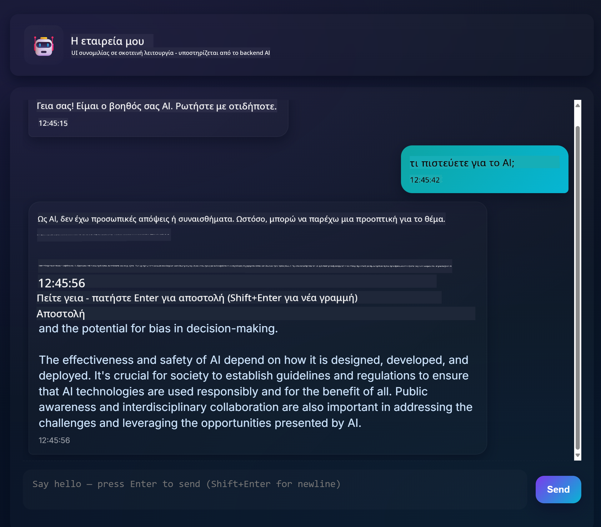

<!--
CO_OP_TRANSLATOR_METADATA:
{
  "original_hash": "11cf36165c243947b6cd85b88cf6faa6",
  "translation_date": "2025-09-01T16:55:19+00:00",
  "source_file": "9-chat-project/README.md",
  "language_code": "el"
}
-->
# Chat project

Αυτό το έργο συνομιλίας δείχνει πώς να δημιουργήσετε έναν Βοηθό Συνομιλίας χρησιμοποιώντας τα GitHub Models.

Δείτε πώς φαίνεται το τελικό έργο:



Λίγο πλαίσιο, η δημιουργία βοηθών συνομιλίας χρησιμοποιώντας γενετική AI είναι ένας εξαιρετικός τρόπος για να ξεκινήσετε να μαθαίνετε για την AI. Αυτό που θα μάθετε είναι πώς να ενσωματώσετε γενετική AI σε μια εφαρμογή ιστού κατά τη διάρκεια αυτού του μαθήματος. Ας ξεκινήσουμε.

## Σύνδεση με γενετική AI

Για το backend, χρησιμοποιούμε τα GitHub Models. Είναι μια εξαιρετική υπηρεσία που σας επιτρέπει να χρησιμοποιείτε AI δωρεάν. Μεταβείτε στο playground και πάρτε τον κώδικα που αντιστοιχεί στη γλώσσα backend που έχετε επιλέξει. Δείτε πώς φαίνεται στο [GitHub Models Playground](https://github.com/marketplace/models/azure-openai/gpt-4o-mini/playground)


Όπως είπαμε, επιλέξτε την καρτέλα "Code" και το runtime που έχετε επιλέξει.


### Χρήση Python

Σε αυτή την περίπτωση επιλέγουμε Python, που σημαίνει ότι παίρνουμε αυτόν τον κώδικα:

```python
"""Run this model in Python

> pip install openai
"""
import os
from openai import OpenAI

# To authenticate with the model you will need to generate a personal access token (PAT) in your GitHub settings. 
# Create your PAT token by following instructions here: https://docs.github.com/en/authentication/keeping-your-account-and-data-secure/managing-your-personal-access-tokens
client = OpenAI(
    base_url="https://models.github.ai/inference",
    api_key=os.environ["GITHUB_TOKEN"],
)

response = client.chat.completions.create(
    messages=[
        {
            "role": "system",
            "content": "",
        },
        {
            "role": "user",
            "content": "What is the capital of France?",
        }
    ],
    model="openai/gpt-4o-mini",
    temperature=1,
    max_tokens=4096,
    top_p=1
)

print(response.choices[0].message.content)
```

Ας καθαρίσουμε λίγο αυτόν τον κώδικα ώστε να είναι επαναχρησιμοποιήσιμος:

```python
def call_llm(prompt: str, system_message: str):
    response = client.chat.completions.create(
        messages=[
            {
                "role": "system",
                "content": system_message,
            },
            {
                "role": "user",
                "content": prompt,
            }
        ],
        model="openai/gpt-4o-mini",
        temperature=1,
        max_tokens=4096,
        top_p=1
    )

    return response.choices[0].message.content
```

Με αυτή τη συνάρτηση `call_llm` μπορούμε τώρα να πάρουμε ένα prompt και ένα system prompt και η συνάρτηση επιστρέφει το αποτέλεσμα.

### Προσαρμογή του Βοηθού AI

Αν θέλετε να προσαρμόσετε τον Βοηθό AI, μπορείτε να καθορίσετε πώς θέλετε να συμπεριφέρεται, γεμίζοντας το system prompt όπως παρακάτω:

```python
call_llm("Tell me about you", "You're Albert Einstein, you only know of things in the time you were alive")
```

## Έκθεση μέσω Web API

Τέλεια, έχουμε ολοκληρώσει το μέρος της AI, ας δούμε πώς μπορούμε να το ενσωματώσουμε σε ένα Web API. Για το Web API, επιλέγουμε να χρησιμοποιήσουμε Flask, αλλά οποιοδήποτε web framework θα ήταν καλό. Ας δούμε τον κώδικα:

### Χρήση Python

```python
# api.py
from flask import Flask, request, jsonify
from llm import call_llm
from flask_cors import CORS

app = Flask(__name__)
CORS(app)   # *   example.com

@app.route("/", methods=["GET"])
def index():
    return "Welcome to this API. Call POST /hello with 'message': 'my message' as JSON payload"


@app.route("/hello", methods=["POST"])
def hello():
    # get message from request body  { "message": "do this taks for me" }
    data = request.get_json()
    message = data.get("message", "")

    response = call_llm(message, "You are a helpful assistant.")
    return jsonify({
        "response": response
    })

if __name__ == "__main__":
    app.run(host="0.0.0.0", port=5000)
```

Εδώ, δημιουργούμε ένα API με Flask και ορίζουμε μια προεπιλεγμένη διαδρομή "/" και "/chat". Η τελευταία προορίζεται να χρησιμοποιηθεί από το frontend μας για να στείλει ερωτήσεις.

Για να ενσωματώσουμε το *llm.py*, εδώ είναι τι πρέπει να κάνουμε:

- Εισαγωγή της συνάρτησης `call_llm`:

   ```python
   from llm import call_llm
   from flask import Flask, request
   ```

- Κλήση της από τη διαδρομή "/chat":

   ```python
   @app.route("/hello", methods=["POST"])
   def hello():
      # get message from request body  { "message": "do this taks for me" }
      data = request.get_json()
      message = data.get("message", "")

      response = call_llm(message, "You are a helpful assistant.")
      return jsonify({
         "response": response
      })
   ```

   Εδώ αναλύουμε το εισερχόμενο αίτημα για να ανακτήσουμε την ιδιότητα `message` από το JSON σώμα. Στη συνέχεια, καλούμε το LLM με αυτή την κλήση:

   ```python
   response = call_llm(message, "You are a helpful assistant")

   # return the response as JSON
   return jsonify({
      "response": response 
   })
   ```

Τέλεια, τώρα έχουμε ολοκληρώσει ό,τι χρειαζόμαστε.

## Ρύθμιση Cors

Πρέπει να αναφέρουμε ότι ρυθμίζουμε κάτι σαν CORS, cross-origin resource sharing. Αυτό σημαίνει ότι επειδή το backend και το frontend μας θα τρέχουν σε διαφορετικές θύρες, πρέπει να επιτρέψουμε στο frontend να καλεί το backend.

### Χρήση Python

Υπάρχει ένα κομμάτι κώδικα στο *api.py* που το ρυθμίζει:

```python
from flask_cors import CORS

app = Flask(__name__)
CORS(app)   # *   example.com
```

Αυτή τη στιγμή έχει ρυθμιστεί να επιτρέπει "*" που είναι όλες οι προελεύσεις και αυτό είναι λίγο ανασφαλές. Πρέπει να το περιορίσουμε όταν πάμε σε παραγωγή.

## Εκτέλεση του έργου σας

Για να εκτελέσετε το έργο σας, πρέπει πρώτα να ξεκινήσετε το backend και μετά το frontend.

### Χρήση Python

Εντάξει, έχουμε *llm.py* και *api.py*, πώς μπορούμε να τα κάνουμε να λειτουργήσουν με ένα backend; Λοιπόν, υπάρχουν δύο πράγματα που πρέπει να κάνουμε:

- Εγκατάσταση εξαρτήσεων:

   ```sh
   cd backend
   python -m venv venv
   source ./venv/bin/activate

   pip install openai flask flask-cors openai
   ```

- Εκκίνηση του API

   ```sh
   python api.py
   ```

   Αν βρίσκεστε σε Codespaces, πρέπει να μεταβείτε στις Θύρες στο κάτω μέρος του επεξεργαστή, να κάνετε δεξί κλικ πάνω τους και να επιλέξετε "Port Visibility" και να επιλέξετε "Public".

### Εργασία σε frontend

Τώρα που έχουμε ένα API που λειτουργεί, ας δημιουργήσουμε ένα frontend για αυτό. Ένα ελάχιστο frontend που θα βελτιώσουμε βήμα προς βήμα. Σε έναν φάκελο *frontend*, δημιουργήστε τα εξής:

```text
backend/
frontend/
index.html
app.js
styles.css
```

Ας ξεκινήσουμε με το **index.html**:

```html
<html>
    <head>
        <link rel="stylesheet" href="styles.css">
    </head>
    <body>
      <form>
        <textarea id="messages"></textarea>
        <input id="input" type="text" />
        <button type="submit" id="sendBtn">Send</button>  
      </form>  
      <script src="app.js" />
    </body>
</html>    
```

Αυτό είναι το απόλυτο ελάχιστο που χρειάζεστε για να υποστηρίξετε ένα παράθυρο συνομιλίας, καθώς αποτελείται από ένα textarea όπου θα εμφανίζονται τα μηνύματα, ένα input για να πληκτρολογείτε το μήνυμα και ένα κουμπί για να στέλνετε το μήνυμα στο backend. Ας δούμε τον JavaScript κώδικα στο *app.js*

**app.js**

```js
// app.js

(function(){
  // 1. set up elements  
  const messages = document.getElementById("messages");
  const form = document.getElementById("form");
  const input = document.getElementById("input");

  const BASE_URL = "change this";
  const API_ENDPOINT = `${BASE_URL}/hello`;

  // 2. create a function that talks to our backend
  async function callApi(text) {
    const response = await fetch(API_ENDPOINT, {
      method: "POST",
      headers: { "Content-Type": "application/json" },
      body: JSON.stringify({ message: text })
    });
    let json = await response.json();
    return json.response;
  }

  // 3. add response to our textarea
  function appendMessage(text, role) {
    const el = document.createElement("div");
    el.className = `message ${role}`;
    el.innerHTML = text;
    messages.appendChild(el);
  }

  // 4. listen to submit events
  form.addEventListener("submit", async(e) => {
    e.preventDefault();
   // someone clicked the button in the form
   
   // get input
   const text = input.value.trim();

   appendMessage(text, "user")

   // reset it
   input.value = '';

   const reply = await callApi(text);

   // add to messages
   appendMessage(reply, "assistant");

  })
})();
```

Ας δούμε τον κώδικα ανά τμήμα:

- 1) Εδώ παίρνουμε μια αναφορά σε όλα τα στοιχεία που θα αναφερόμαστε αργότερα στον κώδικα.
- 2) Σε αυτό το τμήμα, δημιουργούμε μια συνάρτηση που χρησιμοποιεί τη μέθοδο `fetch` για να καλεί το backend μας.
- 3) Η `appendMessage` βοηθά να προσθέσετε απαντήσεις καθώς και ό,τι πληκτρολογείτε ως χρήστης.
- 4) Εδώ ακούμε το συμβάν υποβολής και τελικά διαβάζουμε το πεδίο εισόδου, τοποθετούμε το μήνυμα του χρήστη στο textarea, καλούμε το API και εμφανίζουμε την απάντηση στο textarea.

Ας δούμε το styling στη συνέχεια, εδώ μπορείτε να γίνετε πολύ δημιουργικοί και να το κάνετε να φαίνεται όπως θέλετε, αλλά εδώ είναι μερικές προτάσεις:

**styles.css**

```
.message {
    background: #222;
    box-shadow: 0 0 0 10px orange;
    padding: 10px:
    margin: 5px;
}

.message.user {
    background: blue;
}

.message.assistant {
    background: grey;
} 
```

Με αυτές τις τρεις κλάσεις, θα στυλιζάρετε τα μηνύματα διαφορετικά ανάλογα με το αν προέρχονται από τον βοηθό ή από εσάς ως χρήστη. Αν θέλετε έμπνευση, δείτε τον φάκελο `solution/frontend/styles.css`.

### Αλλαγή Base Url

Υπήρχε κάτι εδώ που δεν ρυθμίσαμε και αυτό ήταν το `BASE_URL`, το οποίο δεν είναι γνωστό μέχρι να ξεκινήσει το backend σας. Για να το ρυθμίσετε:

- Αν εκτελείτε το API τοπικά, θα πρέπει να ρυθμιστεί σε κάτι σαν `http://localhost:5000`.
- Αν εκτελείται σε Codespaces, θα πρέπει να μοιάζει με "[name]app.github.dev".

## Εργασία

Δημιουργήστε τον δικό σας φάκελο *project* με περιεχόμενο όπως παρακάτω:

```text
project/
  frontend/
    index.html
    app.js
    styles.css
  backend/
    ...
```

Αντιγράψτε το περιεχόμενο από ό,τι σας δόθηκε παραπάνω, αλλά μη διστάσετε να το προσαρμόσετε όπως θέλετε.

## Λύση

[Solution](./solution/README.md)

## Bonus

Δοκιμάστε να αλλάξετε την προσωπικότητα του Βοηθού AI.

### Για Python

Όταν καλείτε τη `call_llm` στο *api.py*, μπορείτε να αλλάξετε το δεύτερο όρισμα σε ό,τι θέλετε, για παράδειγμα:

```python
call_llm(message, "You are Captain Picard")
```

### Frontend

Αλλάξτε επίσης το CSS και το κείμενο όπως θέλετε, κάνοντας αλλαγές στο *index.html* και *styles.css*.

## Περίληψη

Τέλεια, μάθατε από την αρχή πώς να δημιουργήσετε έναν προσωπικό βοηθό χρησιμοποιώντας AI. Το κάναμε χρησιμοποιώντας τα GitHub Models, ένα backend σε Python και ένα frontend σε HTML, CSS και JavaScript.

## Ρύθμιση με Codespaces

- Μεταβείτε στο: [Web Dev For Beginners repo](https://github.com/microsoft/Web-Dev-For-Beginners)
- Δημιουργήστε από ένα πρότυπο (βεβαιωθείτε ότι έχετε συνδεθεί στο GitHub) στην επάνω δεξιά γωνία:

    

- Μόλις βρεθείτε στο repo σας, δημιουργήστε ένα Codespace:

    

    Αυτό θα ξεκινήσει ένα περιβάλλον με το οποίο μπορείτε τώρα να εργαστείτε.

---

**Αποποίηση ευθύνης**:  
Αυτό το έγγραφο έχει μεταφραστεί χρησιμοποιώντας την υπηρεσία αυτόματης μετάφρασης [Co-op Translator](https://github.com/Azure/co-op-translator). Παρόλο που καταβάλλουμε προσπάθειες για ακρίβεια, παρακαλούμε να έχετε υπόψη ότι οι αυτοματοποιημένες μεταφράσεις ενδέχεται να περιέχουν σφάλματα ή ανακρίβειες. Το πρωτότυπο έγγραφο στη μητρική του γλώσσα θα πρέπει να θεωρείται η αυθεντική πηγή. Για κρίσιμες πληροφορίες, συνιστάται επαγγελματική ανθρώπινη μετάφραση. Δεν φέρουμε ευθύνη για τυχόν παρεξηγήσεις ή εσφαλμένες ερμηνείες που προκύπτουν από τη χρήση αυτής της μετάφρασης.