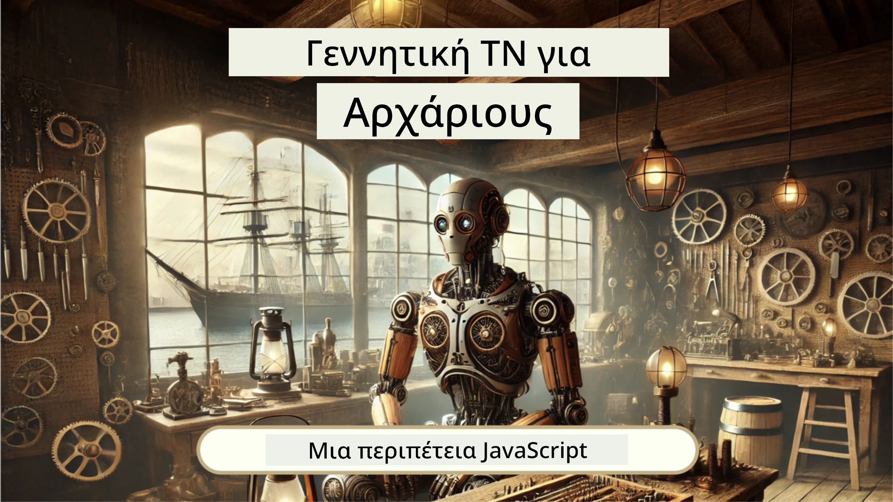
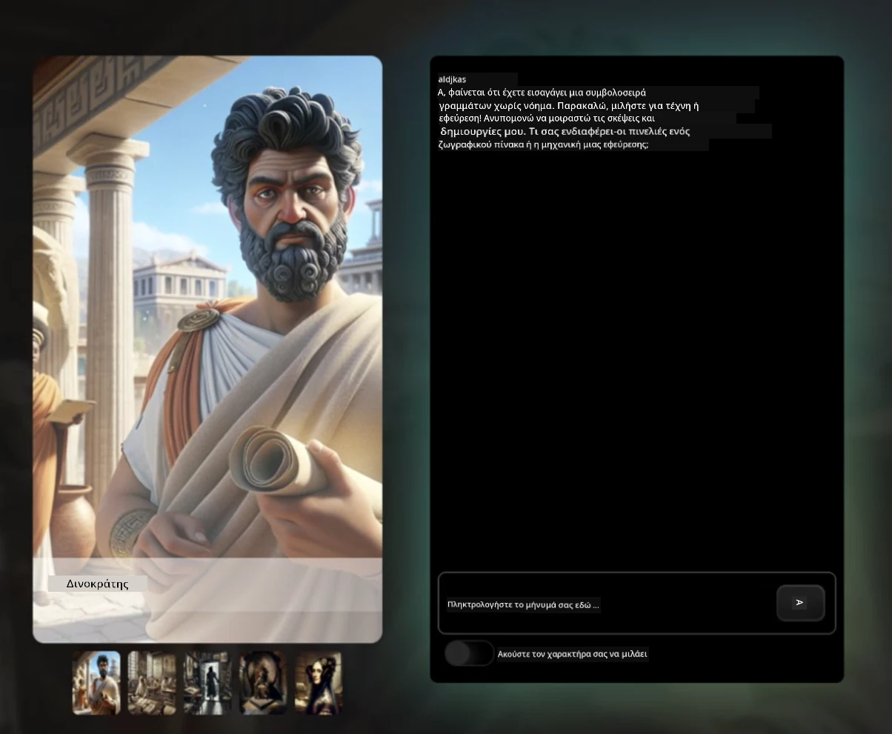

[](https://github.com/microsoft/Web-Dev-For-Beginners/blob/master/LICENSE)
[](https://GitHub.com/microsoft/Web-Dev-For-Beginners/graphs/contributors/)
[](https://GitHub.com/microsoft/Web-Dev-For-Beginners/issues/)
[](https://GitHub.com/microsoft/Web-Dev-For-Beginners/pulls/)
[](http://makeapullrequest.com)

[](https://GitHub.com/microsoft/Web-Dev-For-Beginners/watchers/)
[](https://GitHub.com/microsoft/Web-Dev-For-Beginners/network/)
[](https://GitHub.com/microsoft/Web-Dev-For-Beginners/stargazers/)

[](https://discord.gg/nTYy5BXMWG)

# Ανάπτυξη Ιστού για Αρχάριους - Ένα Αναλυτικό Πρόγραμμα Σπουδών

Μάθετε τα βασικά της ανάπτυξης ιστού με το ολοκληρωμένο 12-εβδομάδων μάθημά μας από τους Microsoft Cloud Advocates. Κάθε ένα από τα 24 μαθήματα διερευνά JavaScript, CSS και HTML μέσω πρακτικών έργων όπως τεράρια, επεκτάσεις προγράμματος περιήγησης και διαστημικά παιχνίδια. Εμπλακείτε με κουίζ, συζητήσεις και πρακτικές εργασίες. Ενισχύστε τις δεξιότητές σας και βελτιστοποιήστε την απομνημόνευση γνώσεων με τη αποτελεσματική παιδαγωγική μας βάσει έργων. Ξεκινήστε το ταξίδι σας στον προγραμματισμό σήμερα!

Εγγραφείτε στην Κοινότητα Azure AI Foundry Discord

[](https://discord.gg/nTYy5BXMWG)

Ακολουθήστε αυτά τα βήματα για να ξεκινήσετε να χρησιμοποιείτε αυτούς τους πόρους:
1. **Κλωνοποιήστε το Αποθετήριο**: Κάντε κλικ στο [](https://GitHub.com/microsoft/Web-Dev-For-Beginners/fork)
2. **Κλωνοποιήστε το Αποθετήριο**:   `git clone https://github.com/microsoft/Web-Dev-For-Beginners.git`
3. [**Εγγραφείτε στο Azure AI Foundry Discord και γνωρίστε ειδικούς και συναδέλφους προγραμματιστές**](https://discord.com/invite/ByRwuEEgH4)

### 🌐 Υποστήριξη Πολλαπλών Γλωσσών

#### Υποστηρίζεται μέσω GitHub Action (Αυτόματο & Πάντα Ενημερωμένο)

<!-- CO-OP TRANSLATOR LANGUAGES TABLE START -->
[Arabic](../ar/README.md) | [Bengali](../bn/README.md) | [Bulgarian](../bg/README.md) | [Burmese (Myanmar)](../my/README.md) | [Chinese (Simplified)](../zh-CN/README.md) | [Chinese (Traditional, Hong Kong)](../zh-HK/README.md) | [Chinese (Traditional, Macau)](../zh-MO/README.md) | [Chinese (Traditional, Taiwan)](../zh-TW/README.md) | [Croatian](../hr/README.md) | [Czech](../cs/README.md) | [Danish](../da/README.md) | [Dutch](../nl/README.md) | [Estonian](../et/README.md) | [Finnish](../fi/README.md) | [French](../fr/README.md) | [German](../de/README.md) | [Greek](./README.md) | [Hebrew](../he/README.md) | [Hindi](../hi/README.md) | [Hungarian](../hu/README.md) | [Indonesian](../id/README.md) | [Italian](../it/README.md) | [Japanese](../ja/README.md) | [Kannada](../kn/README.md) | [Korean](../ko/README.md) | [Lithuanian](../lt/README.md) | [Malay](../ms/README.md) | [Malayalam](../ml/README.md) | [Marathi](../mr/README.md) | [Nepali](../ne/README.md) | [Nigerian Pidgin](../pcm/README.md) | [Norwegian](../no/README.md) | [Persian (Farsi)](../fa/README.md) | [Polish](../pl/README.md) | [Portuguese (Brazil)](../pt-BR/README.md) | [Portuguese (Portugal)](../pt-PT/README.md) | [Punjabi (Gurmukhi)](../pa/README.md) | [Romanian](../ro/README.md) | [Russian](../ru/README.md) | [Serbian (Cyrillic)](../sr/README.md) | [Slovak](../sk/README.md) | [Slovenian](../sl/README.md) | [Spanish](../es/README.md) | [Swahili](../sw/README.md) | [Swedish](../sv/README.md) | [Tagalog (Filipino)](../tl/README.md) | [Tamil](../ta/README.md) | [Telugu](../te/README.md) | [Thai](../th/README.md) | [Turkish](../tr/README.md) | [Ukrainian](../uk/README.md) | [Urdu](../ur/README.md) | [Vietnamese](../vi/README.md)

> **Προτιμάτε να Κλωνοποιήσετε τοπικά;**

> Αυτό το αποθετήριο περιλαμβάνει πάνω από 50 μεταφράσεις που αυξάνουν σημαντικά το μέγεθος λήψης. Για να κλωνοποιήσετε χωρίς μεταφράσεις, χρησιμοποιήστε sparse checkout:
> ```bash
> git clone --filter=blob:none --sparse https://github.com/microsoft/Web-Dev-For-Beginners.git
> cd Web-Dev-For-Beginners
> git sparse-checkout set --no-cone '/*' '!translations' '!translated_images'
> ```
> Αυτό σας δίνει όλα όσα χρειάζεστε για να ολοκληρώσετε το μάθημα με πολύ πιο γρήγορη λήψη.
<!-- CO-OP TRANSLATOR LANGUAGES TABLE END -->

**Εάν θέλετε να υποστηρίζονται επιπρόσθετες μεταφράσεις, οι υποστηριζόμενες γλώσσες αναφέρονται [εδώ](https://github.com/Azure/co-op-translator/blob/main/getting_started/supported-languages.md)**

[](https://open.vscode.dev/microsoft/Web-Dev-For-Beginners)

#### 🧑‍🎓 _Είσαι φοιτητής;_

Επισκεφτείτε τη σελίδα [**Student Hub**](https://docs.microsoft.com/learn/student-hub/?WT.mc_id=academic-77807-sagibbon) όπου θα βρείτε πόρους για αρχάριους, πακέτα για φοιτητές και ακόμα τρόπους για να αποκτήσετε δωρεάν κουπόνι πιστοποιητικού. Αυτή είναι η σελίδα που θέλετε να προσθέσετε στα αγαπημένα σας και να ελέγχετε περιοδικά καθώς ενημερώνουμε το περιεχόμενο μηνιαίως.

### 📣 Ανακοίνωση - Νέες προκλήσεις λειτουργίας GitHub Copilot Agent για ολοκλήρωση!

Προστέθηκε νέα πρόκληση, αναζητήστε "GitHub Copilot Agent Challenge 🚀" στα περισσότερα κεφάλαια. Πρόκειται για μια νέα πρόκληση για να ολοκληρώσετε χρησιμοποιώντας το GitHub Copilot και τη λειτουργία Agent. Εάν δεν έχετε χρησιμοποιήσει τη λειτουργία Agent πριν, μπορεί όχι μόνο να παράγει κείμενο αλλά και να δημιουργεί και να επεξεργάζεται αρχεία, να εκτελεί εντολές και άλλα.

### 📣 Ανακοίνωση - _Νέο Έργο προς κατασκευή με τη Χρήση Generative AI_ 

Πρόσφατα προστέθηκε νέο έργο βοηθού AI, ελέγξτε το [έργο](./9-chat-project/README.md)

### 📣 Ανακοίνωση - _Νέο Πρόγραμμα Σπουδών_ για Generative AI σε JavaScript μόλις κυκλοφόρησε

Μην χάσετε το νέο μας πρόγραμμα σπουδών για Generative AI!

Επισκεφτείτε το [https://aka.ms/genai-js-course](https://aka.ms/genai-js-course) για να ξεκινήσετε!



- Μαθήματα που καλύπτουν από τα βασικά έως RAG.
- Αλληλεπιδράστε με ιστορικούς χαρακτήρες χρησιμοποιώντας GenAI και την εφαρμογή συντρόφου μας.
- Διασκεδαστική και καθηλωτική αφήγηση, θα ταξιδεύετε στο χρόνο!




Κάθε μάθημα περιλαμβάνει μία εργασία για ολοκλήρωση, έναν έλεγχο γνώσεων και μια πρόκληση για να σας καθοδηγήσει σε θέματα όπως:
- Προτροπή και σχεδιασμός προτροπής (prompting και prompt engineering)
- Δημιουργία εφαρμογών κειμένου και εικόνας
- Εφαρμογές αναζήτησης

Επισκεφτείτε [https://aka.ms/genai-js-course](../../[https:/aka.ms/genai-js-course) για να ξεκινήσετε!


## 🌱 Ξεκινώντας

> **Καθηγητές**, περιλαμβάνουμε [κάποιες προτάσεις](for-teachers.md) για το πώς να χρησιμοποιήσετε αυτό το πρόγραμμα σπουδών. Θα θέλαμε το σχόλιό σας [στο φόρουμ συζητήσεων](https://github.com/microsoft/Web-Dev-For-Beginners/discussions/categories/teacher-corner)!

**[Μαθητές](https://aka.ms/student-page/?WT.mc_id=academic-77807-sagibbon)**, για κάθε μάθημα, ξεκινήστε με ένα προ-παρουσίασης κουίζ και ακολουθήστε με την ανάγνωση του διδακτικού υλικού, ολοκληρώνοντας τις διάφορες δραστηριότητες και ελέγχοντας την κατανόηση σας με το μετά-παρουσίασης κουίζ.

Για να βελτιώσετε την εμπειρία μάθησής σας, συνδεθείτε με τους συμμαθητές σας για να εργαστείτε από κοινού στα έργα! Ενθαρρύνονται οι συζητήσεις στο [φόρουμ συζητήσεων](https://github.com/microsoft/Web-Dev-For-Beginners/discussions) όπου η ομάδα των συντονιστών μας θα είναι διαθέσιμη για να απαντήσει στις ερωτήσεις σας.

Για να προχωρήσετε περαιτέρω στην εκπαίδευσή σας, σας προτείνουμε έντονα να εξερευνήσετε το [Microsoft Learn](https://learn.microsoft.com/users/wirelesslife/collections/p1ddcy5jwy0jkm?WT.mc_id=academic-77807-sagibbon) για επιπλέον υλικό μελέτης.

### 📋 Ρύθμιση του περιβάλλοντός σας

Αυτό το πρόγραμμα σπουδών έχει έτοιμο περιβάλλον ανάπτυξης! Καθώς ξεκινάτε μπορείτε να επιλέξετε να εκτελέσετε το πρόγραμμα σε [Codespace](https://github.com/features/codespaces/) (_ένα περιβάλλον βασισμένο σε πρόγραμμα περιήγησης, χωρίς ανάγκη εγκαταστάσεων_), ή τοπικά στον υπολογιστή σας χρησιμοποιώντας έναν επεξεργαστή κειμένου όπως το [Visual Studio Code](https://code.visualstudio.com/?WT.mc_id=academic-77807-sagibbon).

#### Δημιουργία αποθετηρίου
Για να αποθηκεύετε εύκολα τη δουλειά σας, συνιστάται να δημιουργήσετε δικό σας αντίγραφο αυτού του αποθετηρίου. Μπορείτε να το κάνετε κάνοντας κλικ στο κουμπί **Use this template** στο επάνω μέρος της σελίδας. Αυτό θα δημιουργήσει ένα νέο αποθετήριο στον λογαριασμό σας στο GitHub με ένα αντίγραφο του προγράμματος σπουδών.

Ακολουθήστε αυτά τα βήματα:
1. **Fork το Αποθετήριο**: Κάντε κλικ στο κουμπί "Fork" στην πάνω δεξιά γωνία αυτής της σελίδας.
2. **Κλωνοποιήστε το Αποθετήριο**:   `git clone https://github.com/microsoft/Web-Dev-For-Beginners.git`

#### Εκτέλεση του προγράμματος σε Codespace

Στο αντίγραφο του αποθετηρίου που δημιουργήσατε, κάντε κλικ στο κουμπί **Code** και επιλέξτε **Open with Codespaces**. Αυτό θα δημιουργήσει ένα νέο Codespace για να εργαστείτε.


#### Εκτέλεση του προγράμματος τοπικά στον υπολογιστή σας

Για να εκτελέσετε αυτό το πρόγραμμα τοπικά στον υπολογιστή σας, θα χρειαστείτε έναν επεξεργαστή κειμένου, ένα πρόγραμμα περιήγησης και ένα εργαλείο γραμμής εντολών. Το πρώτο μας μάθημα, [Εισαγωγή στις Γλώσσες Προγραμματισμού και τα Εργαλεία του Εμπορίου](../../1-getting-started-lessons/1-intro-to-programming-languages), θα σας καθοδηγήσει σε διάφορες επιλογές για κάθε ένα από αυτά τα εργαλεία για να επιλέξετε αυτό που σας ταιριάζει καλύτερα.

Η σύστασή μας είναι να χρησιμοποιείτε το [Visual Studio Code](https://code.visualstudio.com/?WT.mc_id=academic-77807-sagibbon) ως επεξεργαστή σας, που έχει επίσης ενσωματωμένο [Τερματικό](https://code.visualstudio.com/docs/terminal/basics/?WT.mc_id=academic-77807-sagibbon). Μπορείτε να κατεβάσετε το Visual Studio Code [εδώ](https://code.visualstudio.com/?WT.mc_id=academic-77807-sagibbon).


1. Κλωνοποιήστε το αποθετήριό σας στον υπολογιστή σας. Μπορείτε να το κάνετε κάνοντας κλικ στο κουμπί **Code** και αντιγράφοντας το URL:

    [CodeSpace](./images/createcodespace.png)
    Στη συνέχεια, ανοίξτε το [Τερματικό](https://code.visualstudio.com/docs/terminal/basics/?WT.mc_id=academic-77807-sagibbon) μέσα στο [Visual Studio Code](https://code.visualstudio.com/?WT.mc_id=academic-77807-sagibbon) και εκτελέστε την παρακάτω εντολή, αντικαθιστώντας το `<your-repository-url>` με το URL που μόλις αντιγράψατε:

    ```bash 
    git clone <your-repository-url>
    ```

2. Ανοίξτε το φάκελο στο Visual Studio Code. Μπορείτε να το κάνετε πατώντας **Αρχείο** > **Άνοιγμα Φακέλου** και επιλέγοντας το φάκελο που μόλις κλωνοποιήσατε.


>  Συνιστώμενες επεκτάσεις Visual Studio Code:
>
> * [Live Server](https://marketplace.visualstudio.com/items?itemName=ritwickdey.LiveServer&WT.mc_id=academic-77807-sagibbon) - για προεπισκόπηση σελίδων HTML μέσα στο Visual Studio Code
> * [Copilot](https://marketplace.visualstudio.com/items?itemName=GitHub.copilot&WT.mc_id=academic-77807-sagibbon) - για να σας βοηθήσει να γράφετε κώδικα γρηγορότερα

## 📂 Κάθε μάθημα περιλαμβάνει:

- προαιρετικό σκετς
- προαιρετικό συμπληρωματικό βίντεο
- προ-μάθημα ζέσταμα quiz
- γραπτό μάθημα
- για μαθήματα βασισμένα σε έργα, βήμα προς βήμα οδηγούς για το πώς να κατασκευάσετε το έργο
- έλεγχοι γνώσης
- μια πρόκληση
- συμπληρωματική ανάγνωση
- ανάθεση εργασίας
- [μετα-μάθημα quiz](https://ff-quizzes.netlify.app/web/)

> **Σημείωση για τα quiz**: Όλα τα quiz περιέχονται στο φάκελο Quiz-app, συνολικά 48 quiz με τρεις ερωτήσεις το καθένα. Είναι διαθέσιμα [εδώ](https://ff-quizzes.netlify.app/web/) και η εφαρμογή quiz μπορεί να τρέξει τοπικά ή να αναπτυχθεί στο Azure· ακολουθήστε τις οδηγίες στο φάκελο `quiz-app`.

## 🗃️ Μαθήματα

|     |                       Όνομα Έργου                       |                      Διδασκόμενες Έννοιες                       | Εκπαιδευτικοί Στόχοι                                                                                                                            |                                                         Σχετικό Μάθημα                                                          |         Συγγραφέας         |
| :-: | :------------------------------------------------------: | :--------------------------------------------------------------: | ----------------------------------------------------------------------------------------------------------------------------------------------- | :----------------------------------------------------------------------------------------------------------------------------: | :------------------------: |
| 01  |                     Ξεκινώντας                          |           Εισαγωγή στον Προγραμματισμό και Εργαλεία της Τέχνης  | Μάθετε τα βασικά στοιχεία που βασίζονται οι περισσότερες γλώσσες προγραμματισμού και σχετικά με το λογισμικό που βοηθά τους επαγγελματίες          | [Εισαγωγή σε Γλώσσες Προγραμματισμού και Εργαλεία της Τέχνης](./1-getting-started-lessons/1-intro-to-programming-languages/README.md) |         Jasmine            |
| 02  |                     Ξεκινώντας                          |             Βασικά του GitHub, συμπεριλαμβανομένης της συνεργασίας  | Πώς να χρησιμοποιείτε το GitHub στο έργο σας, πώς να συνεργάζεστε με άλλους σε βάση κώδικα                                                     |                            [Εισαγωγή στο GitHub](./1-getting-started-lessons/2-github-basics/README.md)                             |          Floor             |
| 03  |                     Ξεκινώντας                          |                             Προσβασιμότητα                       | Μάθετε τα βασικά της διαδικτυακής προσβασιμότητας                                                                                              |                       [Θεμελιώδης Προσβασιμότητας](./1-getting-started-lessons/3-accessibility/README.md)                       |       Christopher          |
| 04  |                        JS Basics                         |                         Τύποι Δεδομένων JavaScript               | Τα βασικά των τύπων δεδομένων στην JavaScript                                                                                                 |                                       [Τύποι Δεδομένων](./2-js-basics/1-data-types/README.md)                                        |         Jasmine            |
| 05  |                        JS Basics                         |                         Συναρτήσεις και Μέθοδοι                  | Μάθετε για τις συναρτήσεις και τις μεθόδους για τη διαχείριση της ροής λογικής μιας εφαρμογής                                                  |                              [Συναρτήσεις και Μέθοδοι](./2-js-basics/2-functions-methods/README.md)                               | Jasmine and Christopher    |
| 06  |                        JS Basics                         |                        Λήψη Αποφάσεων με JS                      | Μάθετε πώς να δημιουργείτε συνθήκες στον κώδικά σας χρησιμοποιώντας μεθόδους λήψης αποφάσεων                                                    |                                 [Λήψη Αποφάσεων](./2-js-basics/3-making-decisions/README.md)                                  |         Jasmine            |
| 07  |                        JS Basics                         |                            Πίνακες και Βρόχοι                     | Εργαστείτε με δεδομένα χρησιμοποιώντας πίνακες και βρόχους στην JavaScript                                                                      |                                   [Πίνακες και Βρόχοι](./2-js-basics/4-arrays-loops/README.md)                                    |         Jasmine            |
| 08  |       [Terrarium](./3-terrarium/solution/README.md)       |                            HTML στην Πράξη                         | Κατασκευάστε το HTML για να δημιουργήσετε ένα διαδικτυακό τεράριουμ, εστιάζοντας στη δημιουργία διάταξης                                        |                                 [Εισαγωγή στο HTML](./3-terrarium/1-intro-to-html/README.md)                                 |           Jen              |
| 09  |       [Terrarium](./3-terrarium/solution/README.md)       |                            CSS στην Πράξη                          | Κατασκευάστε το CSS για να μορφοποιήσετε το διαδικτυακό τεράριουμ, εστιάζοντας στα βασικά του CSS, συμπεριλαμβανομένου του responsive design     |                                  [Εισαγωγή στο CSS](./3-terrarium/2-intro-to-css/README.md)                                  |           Jen              |
| 10  |            [Terrarium](./3-terrarium/solution/README.md)            |                 Κλεισίματα JavaScript, χειρισμός DOM              | Δημιουργήστε τον JavaScript κώδικα που θα κάνει το τεράριουμ να λειτουργεί ως διεπαφή drag/drop, εστιάζοντας στα closures και στον χειρισμό DOM |                  [Κλεισίματα JavaScript, χειρισμός DOM](./3-terrarium/3-intro-to-DOM-and-closures/README.md)                   |           Jen              |
| 11  |          [Typing Game](./4-typing-game/solution/README.md)          |                          Δημιουργία Παιχνιδιού Πληκτρολόγησης     | Μάθετε πώς να χρησιμοποιείτε συμβάντα πληκτρολογίου για να καθοδηγήσετε τη λογική της εφαρμογής σας σε JavaScript                              |                                [Προγραμματισμός Βασισμένος σε Συμβάντα](./4-typing-game/typing-game/README.md)                                |       Christopher          |
| 12  | [Green Browser Extension](./5-browser-extension/solution/README.md) |                         Εργασία με Browsers                      | Μάθετε πώς λειτουργούν οι browsers, την ιστορία τους και πώς να δημιουργήσετε τα πρώτα στοιχεία μιας επέκτασης browser                        |                               [Σχετικά με Browsers](./5-browser-extension/1-about-browsers/README.md)                                |           Jen              |
| 13  | [Green Browser Extension](./5-browser-extension/solution/README.md) | Δημιουργία φόρμας, κλήση API και αποθήκευση μεταβλητών στη τοπική αποθήκευση | Δημιουργήστε τα στοιχεία JavaScript της επέκτασης browser σας για κλήση API χρησιμοποιώντας μεταβλητές αποθηκευμένες στην τοπική αποθήκευση    |                [APIs, Φόρμες και Τοπική Αποθήκευση](./5-browser-extension/2-forms-browsers-local-storage/README.md)                 |           Jen              |
| 14  | [Green Browser Extension](./5-browser-extension/solution/README.md) |          Διαδικασίες υπόβαθρου στον browser, απόδοση ιστού        | Χρησιμοποιήστε τις διαδικασίες στο παρασκήνιο του browser για να διαχειριστείτε το εικονίδιο της επέκτασης· μάθετε για την απόδοση διαδικτύου και ορισμένες βελτιστοποιήσεις |             [Εργασίες Υπόβαθρου και Απόδοση](./5-browser-extension/3-background-tasks-and-performance/README.md)              |           Jen              |
| 15  |           [Space Game](./6-space-game/solution/README.md)           |             Προχωρημένη Ανάπτυξη Παιχνιδιών με JavaScript        | Μάθετε για την κληρονομικότητα χρησιμοποιώντας τόσο τις Κλάσεις όσο και τη Σύνθεση και το μοτίβο Pub/Sub, προετοιμασία για τη δημιουργία παιχνιδιού |                      [Εισαγωγή στην Προχωρημένη Ανάπτυξη Παιχνιδιών](./6-space-game/1-introduction/README.md)                       |          Chris             |
| 16  |           [Space Game](./6-space-game/solution/README.md)           |                           Σχεδίαση σε καμβά                        | Μάθετε για το API Canvas, που χρησιμοποιείται για τη σχεδίαση στοιχείων σε οθόνη                                                         |                                [Σχεδίαση σε Καμβά](./6-space-game/2-drawing-to-canvas/README.md)                                |          Chris             |
| 17  |           [Space Game](./6-space-game/solution/README.md)           |                   Μετακίνηση στοιχείων στην οθόνη                  | Ανακαλύψτε πώς τα στοιχεία μπορούν να αποκτήσουν κίνηση χρησιμοποιώντας τις καρτεσιανές συντεταγμένες και το API Canvas                      |                           [Μετακίνηση Στοιχείων](./6-space-game/3-moving-elements-around/README.md)                           |          Chris             |
| 18  |           [Space Game](./6-space-game/solution/README.md)           |                          Ανίχνευση συγκρούσεων                     | Κάντε τα στοιχεία να συγκρούονται και να αντιδρούν το ένα στο άλλο χρησιμοποιώντας πατήματα πλήκτρων και παρέχετε λειτουργία cooldown για να διασφαλιστεί η απόδοση του παιχνιδιού |                              [Ανίχνευση Συγκρούσεων](./6-space-game/4-collision-detection/README.md)                              |          Chris             |
| 19  |           [Space Game](./6-space-game/solution/README.md)           |                             Παρακολούθηση σκορ                      | Εκτελέστε μαθηματικούς υπολογισμούς βασισμένους στην κατάσταση και απόδοση του παιχνιδιού                                                  |                                    [Παρακολούθηση Σκορ](./6-space-game/5-keeping-score/README.md)                                    |          Chris             |
| 20  |           [Space Game](./6-space-game/solution/README.md)           |                     Τερματισμός και επανεκκίνηση παιχνιδιού       | Μάθετε για τον τερματισμό και την επανεκκίνηση του παιχνιδιού, συμπεριλαμβανομένου του καθαρισμού πόρων και της επαναφοράς τιμών μεταβλητών |                                [Ο Όρος Τερματισμού](./6-space-game/6-end-condition/README.md)                                 |          Chris             |
| 21  |         [Banking App](./7-bank-project/solution/README.md)          |                 HTML Πρότυπα και Διαδρομές σε Web App              | Μάθετε πώς να δημιουργήσετε τη δομή πολλαπλών σελίδων ιστοσελίδας χρησιμοποιώντας διαδρομές και πρότυπα HTML                               |                            [HTML Πρότυπα και Διαδρομές](./7-bank-project/1-template-route/README.md)                             |          Yohan             |
| 22  |         [Banking App](./7-bank-project/solution/README.md)          |                  Δημιουργία Φόρμας Σύνδεσης και Εγγραφής          | Μάθετε για τη δημιουργία φορμών και τη διαχείριση διαδικασιών επικύρωσης                                                                       |                                           [Φόρμες](./7-bank-project/2-forms/README.md)                                           |          Yohan             |
| 23  |         [Banking App](./7-bank-project/solution/README.md)          |                   Μέθοδοι Ανάκτησης και Χρήσης Δεδομένων          | Πώς ρέουν τα δεδομένα μέσα και έξω από την εφαρμογή σας, πώς να τα ανακτήσετε, αποθηκεύσετε και αποδεσμεύσετε                                 |                                            [Δεδομένα](./7-bank-project/3-data/README.md)                                            |          Yohan             |
| 24  |         [Banking App](./7-bank-project/solution/README.md)          |                      Έννοιες Διαχείρισης Κατάστασης               | Μάθετε πώς η εφαρμογή σας διατηρεί κατάσταση και πώς να τη διαχειρίζεστε προγραμματιστικά                                                   |                                [Διαχείριση Κατάστασης](./7-bank-project/4-state-management/README.md)                                |          Yohan             |
| 25 | [Browser/VScode Code](../../8-code-editor) | Εργασία με το VScode | Μάθετε πώς να χρησιμοποιείτε έναν κειμενογράφο κώδικα| [Χρήση Επεξεργαστή Κώδικα VScode](./8-code-editor/1-using-a-code-editor/README.md) | Chris |
| 26 | [AI Assistants](./9-chat-project/README.md) | Εργασία με AI | Μάθετε πώς να δημιουργήσετε τον δικό σας βοηθό AI | [Έργο Βοηθού AI](./9-chat-project/README.md) | Chris |

## 🏫 Παιδαγωγική

Το πρόγραμμα σπουδών μας σχεδιάστηκε με δύο βασικές παιδαγωγικές αρχές κατά νου:
* μάθηση μέσω έργων
* συχνά quiz

Το πρόγραμμα διδάσκει τα βασικά της JavaScript, HTML και CSS, καθώς και τα νεότερα εργαλεία και τεχνικές που χρησιμοποιούν οι σημερινοί προγραμματιστές ιστού. Οι φοιτητές θα έχουν την ευκαιρία να αποκτήσουν πρακτική εμπειρία δημιουργώντας ένα παιχνίδι πληκτρολόγησης, ένα εικονικό τεράριουμ, μια οικολογική επέκταση browser, ένα παιχνίδι τύπου space-invader και μια τραπεζική εφαρμογή για επιχειρήσεις. Στο τέλος της σειράς, οι φοιτητές θα έχουν αποκτήσει στέρεη κατανόηση της ανάπτυξης ιστού.

> 🎓 Μπορείτε να παρακολουθήσετε τα πρώτα μαθήματα αυτού του προγράμματος ως [Μονοπάτι Μάθησης](https://docs.microsoft.com/learn/paths/web-development-101/?WT.mc_id=academic-77807-sagibbon) στο Microsoft Learn!

Εξασφαλίζοντας ότι το περιεχόμενο ευθυγραμμίζεται με τα έργα, η διαδικασία γίνεται πιο ελκυστική για τους φοιτητές και η διατήρηση των εννοιών αυξάνεται. Επίσης, γράψαμε αρκετά εισαγωγικά μαθήματα στα βασικά της JavaScript για την εισαγωγή των εννοιών, σε συνδυασμό με ένα βίντεο από τη συλλογή "[Beginners Series to: JavaScript](https://channel9.msdn.com/Series/Beginners-Series-to-JavaScript/?WT.mc_id=academic-77807-sagibbon)", των οποίων ορισμένοι συγγραφείς συνέβαλαν σε αυτό το πρόγραμμα.

Επιπλέον, ένα quiz χαμηλού βαθμού δυσκολίας πριν από το μάθημα θέτει την πρόθεση του φοιτητή για εκμάθηση ενός θέματος, ενώ ένα δεύτερο quiz μετά το μάθημα εξασφαλίζει περαιτέρω διατήρηση. Αυτό το πρόγραμμα σχεδιάστηκε να είναι ευέλικτο και διασκεδαστικό και μπορεί να παρακολουθηθεί ολόκληρο ή μερικώς. Τα έργα ξεκινούν μικρά και γίνονται ολοένα πιο σύνθετα μέχρι το τέλος του 12-εβδομαδιαίου κύκλου.

Ενώ έχουμε αποφύγει σκόπιμα την εισαγωγή πλαισίων JavaScript για να επικεντρωθούμε στις βασικές δεξιότητες που χρειάζεται ένας προγραμματιστής ιστού πριν από την υιοθέτηση ενός πλαισίου, ένα καλό επόμενο βήμα για την ολοκλήρωση αυτού του προγράμματος θα ήταν η εκμάθηση για το Node.js μέσω μιας άλλης συλλογής βίντεο: "[Beginner Series to: Node.js](https://channel9.msdn.com/Series/Beginners-Series-to-Nodejs/?WT.mc_id=academic-77807-sagibbon)".

> Επισκεφθείτε τις οδηγίες μας [Κώδικας Συμπεριφοράς](CODE_OF_CONDUCT.md) και [Συμβολή](CONTRIBUTING.md). Καλωσορίζουμε τα εποικοδομητικά σας σχόλια!


## 🧭 Πρόσβαση εκτός σύνδεσης

Μπορείτε να εκτελέσετε αυτή την τεκμηρίωση εκτός σύνδεσης χρησιμοποιώντας [Docsify](https://docsify.js.org/#/). Κλωνοποιήστε αυτό το αποθετήριο, [εγκαταστήστε το Docsify](https://docsify.js.org/#/quickstart) στον τοπικό σας υπολογιστή και μετά στον ριζικό φάκελο αυτού του αποθετηρίου, πληκτρολογήστε `docsify serve`. Ο ιστότοπος θα διατεθεί στην πόρτα 3000 στον localhost σας: `localhost:3000`.

## 📘 PDF

Ένα PDF με όλα τα μαθήματα μπορεί να βρεθεί [εδώ](https://microsoft.github.io/Web-Dev-For-Beginners/pdf/readme.pdf).


## 🎒 Άλλα Μαθήματα
Η ομάδα μας παράγει και άλλα μαθήματα! Δείτε:

<!-- CO-OP TRANSLATOR OTHER COURSES START -->
### LangChain
[](https://aka.ms/langchain4j-for-beginners)
[](https://aka.ms/langchainjs-for-beginners?WT.mc_id=m365-94501-dwahlin)
[](https://github.com/microsoft/langchain-for-beginners?WT.mc_id=m365-94501-dwahlin)
---

### Azure / Edge / MCP / Agents
[](https://github.com/microsoft/AZD-for-beginners?WT.mc_id=academic-105485-koreyst)
[](https://github.com/microsoft/edgeai-for-beginners?WT.mc_id=academic-105485-koreyst)
[](https://github.com/microsoft/mcp-for-beginners?WT.mc_id=academic-105485-koreyst)
[](https://github.com/microsoft/ai-agents-for-beginners?WT.mc_id=academic-105485-koreyst)

---
 
### Generative AI Series
[](https://github.com/microsoft/generative-ai-for-beginners?WT.mc_id=academic-105485-koreyst)
[-9333EA?style=for-the-badge&labelColor=E5E7EB&color=9333EA)](https://github.com/microsoft/Generative-AI-for-beginners-dotnet?WT.mc_id=academic-105485-koreyst)
[-C084FC?style=for-the-badge&labelColor=E5E7EB&color=C084FC)](https://github.com/microsoft/generative-ai-for-beginners-java?WT.mc_id=academic-105485-koreyst)
[-E879F9?style=for-the-badge&labelColor=E5E7EB&color=E879F9)](https://github.com/microsoft/generative-ai-with-javascript?WT.mc_id=academic-105485-koreyst)

---
 
### Core Learning
[](https://aka.ms/ml-beginners?WT.mc_id=academic-105485-koreyst)
[](https://aka.ms/datascience-beginners?WT.mc_id=academic-105485-koreyst)
[](https://aka.ms/ai-beginners?WT.mc_id=academic-105485-koreyst)
[](https://github.com/microsoft/Security-101?WT.mc_id=academic-96948-sayoung)
[](https://aka.ms/webdev-beginners?WT.mc_id=academic-105485-koreyst)
[](https://aka.ms/iot-beginners?WT.mc_id=academic-105485-koreyst)
[](https://github.com/microsoft/xr-development-for-beginners?WT.mc_id=academic-105485-koreyst)

---
 
### Copilot Series
[](https://aka.ms/GitHubCopilotAI?WT.mc_id=academic-105485-koreyst)
[](https://github.com/microsoft/mastering-github-copilot-for-dotnet-csharp-developers?WT.mc_id=academic-105485-koreyst)
[](https://github.com/microsoft/CopilotAdventures?WT.mc_id=academic-105485-koreyst)
<!-- CO-OP TRANSLATOR OTHER COURSES END -->

## Λήψη Βοήθειας

Αν κολλήσετε ή έχετε απορίες σχετικά με την ανάπτυξη εφαρμογών AI, ενταχθείτε με άλλους μαθητές και έμπειρους προγραμματιστές σε συζητήσεις για το MCP. Είναι μια υποστηρικτική κοινότητα όπου οι ερωτήσεις είναι ευπρόσδεκτες και η γνώση μοιράζεται ελεύθερα.

[](https://discord.gg/nTYy5BXMWG)

Αν έχετε σχόλια για το προϊόν ή σφάλματα κατά την ανάπτυξη, επισκεφθείτε:

[](https://aka.ms/foundry/forum)

## Άδεια

Αυτό το αποθετήριο έχει άδεια υπό τους όρους της άδειας MIT. Δείτε το αρχείο [LICENSE](../../LICENSE) για περισσότερες πληροφορίες.

---

<!-- CO-OP TRANSLATOR DISCLAIMER START -->
**Αποποίηση Ευθυνών**:
Αυτό το έγγραφο έχει μεταφραστεί χρησιμοποιώντας την υπηρεσία μετάφρασης με Τεχνητή Νοημοσύνη [Co-op Translator](https://github.com/Azure/co-op-translator). Παρόλο που προσπαθούμε για ακρίβεια, παρακαλούμε να γνωρίζετε ότι οι αυτόματες μεταφράσεις ενδέχεται να περιέχουν λάθη ή ανακρίβειες. Το πρωτότυπο έγγραφο στη γλώσσα του θεωρείται η αυθεντική πηγή. Για κρίσιμες πληροφορίες, συνιστάται επαγγελματική ανθρώπινη μετάφραση. Δεν φέρουμε ευθύνη για τυχόν παρεξηγήσεις ή λανθασμένες ερμηνείες που προκύπτουν από τη χρήση αυτής της μετάφρασης.
<!-- CO-OP TRANSLATOR DISCLAIMER END -->