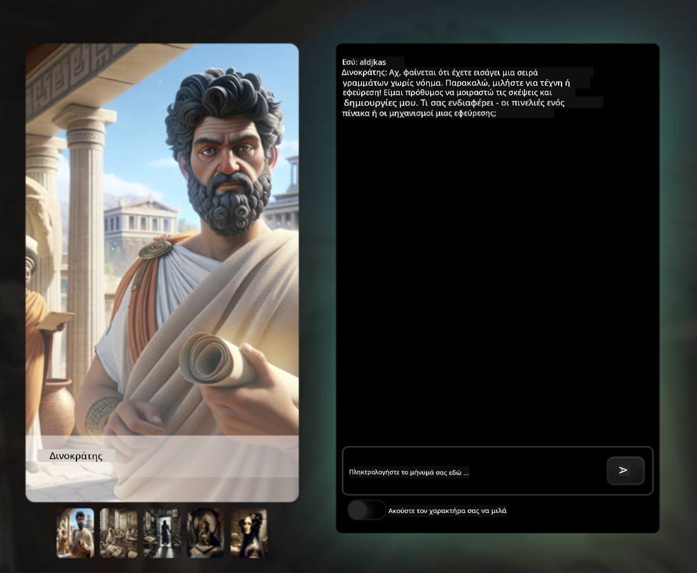
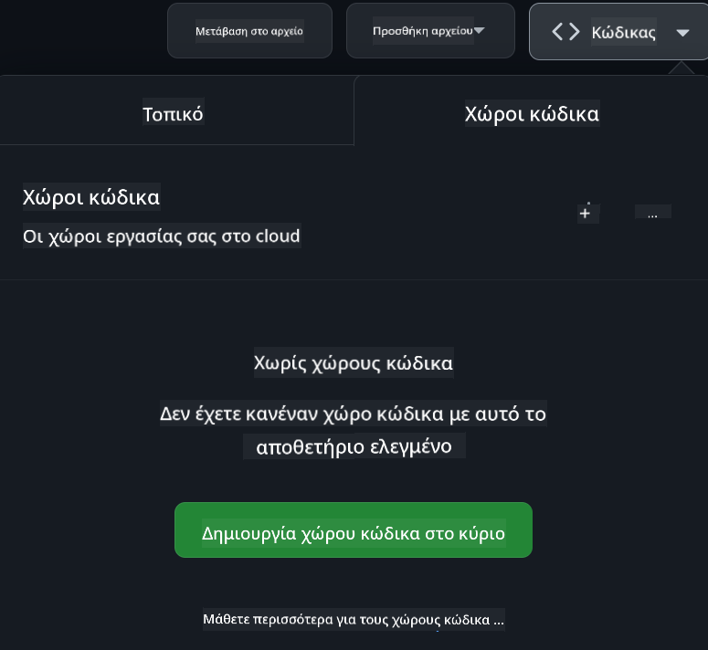

<!--
CO_OP_TRANSLATOR_METADATA:
{
  "original_hash": "fea3a0fceb8ad86fd640c09cf63a2aac",
  "translation_date": "2026-01-06T20:07:02+00:00",
  "source_file": "README.md",
  "language_code": "el"
}
-->
[](https://github.com/microsoft/Web-Dev-For-Beginners/blob/master/LICENSE)
[](https://GitHub.com/microsoft/Web-Dev-For-Beginners/graphs/contributors/)
[](https://GitHub.com/microsoft/Web-Dev-For-Beginners/issues/)
[](https://GitHub.com/microsoft/Web-Dev-For-Beginners/pulls/)
[](http://makeapullrequest.com)

[](https://GitHub.com/microsoft/Web-Dev-For-Beginners/watchers/)
[](https://GitHub.com/microsoft/Web-Dev-For-Beginners/network/)
[](https://GitHub.com/microsoft/Web-Dev-For-Beginners/stargazers/)

[](https://discord.gg/nTYy5BXMWG)

# Ανάπτυξη Ιστότοπων για Αρχάριους - Ένα Πρόγραμμα Σπουδών

Μάθετε τα βασικά της ανάπτυξης ιστοτόπων με το ολοκληρωμένο μας μάθημα διάρκειας 12 εβδομάδων, από τους Microsoft Cloud Advocates. Κάθε ένα από τα 24 μαθήματα εμβαθύνει σε JavaScript, CSS, και HTML μέσω πρακτικών έργων όπως τεραρίων, επεκτάσεις φυλλομετρητή και διαστημικά παιχνίδια. Ασχοληθείτε με κουίζ, συζητήσεις και πρακτικές εργασίες. Ενισχύστε τις δεξιότητές σας και βελτιώστε τη διατήρηση γνώσης με τη αποτελεσματική παιδαγωγική μας βασισμένη σε έργα. Ξεκινήστε το ταξίδι σας στον κώδικα σήμερα!

Γίνετε μέλος της κοινότητας Discord του Azure AI Foundry

[](https://discord.gg/nTYy5BXMWG)

Ακολουθήστε αυτά τα βήματα για να ξεκινήσετε με αυτούς τους πόρους:
1. **Κλωνοποίηση του Αποθετηρίου**: Κάντε κλικ στο [](https://GitHub.com/microsoft/Web-Dev-For-Beginners/fork)
2. **Αντιγραφή του Αποθετηρίου**:   `git clone https://github.com/microsoft/Web-Dev-For-Beginners.git`
3. [**Γίνετε μέλος στο Azure AI Foundry Discord και γνωρίστε ειδικούς και συναδέλφους προγραμματιστές**](https://discord.com/invite/ByRwuEEgH4)

### 🌐 Υποστήριξη Πολύγλωσσων

#### Υποστηρίζεται μέσω GitHub Action (Αυτοματοποιημένο & Πάντα Ενημερωμένο)

<!-- CO-OP TRANSLATOR LANGUAGES TABLE START -->
[Αραβικά](../ar/README.md) | [Μπενγκάλι](../bn/README.md) | [Βουλγαρικά](../bg/README.md) | [Βιρμανικά (Μιανμάρ)](../my/README.md) | [Κινέζικα (Απλοποιημένα)](../zh/README.md) | [Κινέζικα (Παραδοσιακά, Χονγκ Κονγκ)](../hk/README.md) | [Κινέζικα (Παραδοσιακά, Μακάο)](../mo/README.md) | [Κινέζικα (Παραδοσιακά, Ταϊβάν)](../tw/README.md) | [Κροατικά](../hr/README.md) | [Τσέχικα](../cs/README.md) | [Δανέζικα](../da/README.md) | [Ολλανδικά](../nl/README.md) | [Εσθονικά](../et/README.md) | [Φινλανδικά](../fi/README.md) | [Γαλλικά](../fr/README.md) | [Γερμανικά](../de/README.md) | [Ελληνικά](./README.md) | [Εβραϊκά](../he/README.md) | [Χίντι](../hi/README.md) | [Ουγγρικά](../hu/README.md) | [Ινδονησιακά](../id/README.md) | [Ιταλικά](../it/README.md) | [Ιαπωνικά](../ja/README.md) | [Καννάδα](../kn/README.md) | [Κορεατικά](../ko/README.md) | [Λιθουανικά](../lt/README.md) | [Μαλαισιανά](../ms/README.md) | [Μαλαγιαλάμ](../ml/README.md) | [Μαράτι](../mr/README.md) | [Νεπάλι](../ne/README.md) | [Νιγηριανά Πίνγκιν](../pcm/README.md) | [Νορβηγικά](../no/README.md) | [Περσικά (Φαρσί)](../fa/README.md) | [Πολωνικά](../pl/README.md) | [Πορτογαλικά (Βραζιλία)](../br/README.md) | [Πορτογαλικά (Πορτογαλία)](../pt/README.md) | [Πουντζάμπι (Γκουρμουχί)](../pa/README.md) | [Ρουμανικά](../ro/README.md) | [Ρωσικά](../ru/README.md) | [Σερβικά (Κυριλλικά)](../sr/README.md) | [Σλοβακικά](../sk/README.md) | [Σλοβενικά](../sl/README.md) | [Ισπανικά](../es/README.md) | [Σουαχίλι](../sw/README.md) | [Σουηδικά](../sv/README.md) | [Ταγκάλογκ (Φιλιππινέζικα)](../tl/README.md) | [Ταμίλ](../ta/README.md) | [Τελούγκου](../te/README.md) | [Ταϊλανδικά](../th/README.md) | [Τουρκικά](../tr/README.md) | [Ουκρανικά](../uk/README.md) | [Ούρντου](../ur/README.md) | [Βιετναμέζικα](../vi/README.md)

> **Προτιμάτε να Αντιγράψετε τοπικά;**

> Αυτό το αποθετήριο περιλαμβάνει πάνω από 50 μεταφράσεις γλωσσών που αυξάνουν σημαντικά το μέγεθος λήψης. Για αντιγραφή χωρίς μεταφράσεις, χρησιμοποιήστε sparse checkout:
> ```bash
> git clone --filter=blob:none --sparse https://github.com/microsoft/Web-Dev-For-Beginners.git
> cd Web-Dev-For-Beginners
> git sparse-checkout set --no-cone '/*' '!translations' '!translated_images'
> ```
> Αυτό σας δίνει όλα όσα χρειάζεστε για να ολοκληρώσετε το μάθημα με πολύ πιο γρήγορη λήψη.
<!-- CO-OP TRANSLATOR LANGUAGES TABLE END -->

**Αν θέλετε να υποστηριχθούν πρόσθετες γλώσσες μετάφρασης, αυτές αναφέρονται [εδώ](https://github.com/Azure/co-op-translator/blob/main/getting_started/supported-languages.md)**

[](https://open.vscode.dev/microsoft/Web-Dev-For-Beginners)

#### 🧑‍🎓 _Είσαι φοιτητής;_

Επισκεφθείτε τη [**Σελίδα Φοιτητών**](https://docs.microsoft.com/learn/student-hub/?WT.mc_id=academic-77807-sagibbon) όπου θα βρείτε πόρους για αρχάριους, πακέτα φοιτητών και ακόμη τρόπους για να αποκτήσετε δωρεάν κουπόνι πιστοποίησης. Αυτή είναι η σελίδα που θέλετε να αποθηκεύσετε στους σελιδοδείκτες σας και να ελέγχετε κατά διαστήματα καθώς αλλάζουμε το περιεχόμενο μηνιαίως.

### 📣 Ανακοίνωση - Νέες προκλήσεις λειτουργίας GitHub Copilot Agent για ολοκλήρωση!

Προστέθηκε νέα πρόκληση, αναζητήστε το "GitHub Copilot Agent Challenge 🚀" στα περισσότερα κεφάλαια. Πρόκειται για νέα πρόκληση για να ολοκληρώσετε χρησιμοποιώντας το GitHub Copilot και τη λειτουργία Agent. Αν δεν έχετε χρησιμοποιήσει τη λειτουργία Agent πριν, είναι ικανή όχι μόνο να δημιουργεί κείμενο αλλά και να δημιουργεί και να επεξεργάζεται αρχεία, να τρέχει εντολές και άλλα.

### 📣 Ανακοίνωση - _Νέο Έργο για κατασκευή με τη χρήση Γενετικής Τεχνητής Νοημοσύνης_

Πρόσφατα προστέθηκε το νέο έργο Βοηθού AI, δείτε το [έργο](./9-chat-project/README.md)

### 📣 Ανακοίνωση - _Νέο Πρόγραμμα Σπουδών_ για Γενετική Τεχνητή Νοημοσύνη στη JavaScript μόλις κυκλοφόρησε

Μην χάσετε το νέο μας πρόγραμμα σπουδών για τη Γενετική Τεχνητή Νοημοσύνη!

Επισκεφθείτε [https://aka.ms/genai-js-course](https://aka.ms/genai-js-course) για να ξεκινήσετε!


- Μαθήματα που καλύπτουν από βασικά μέχρι RAG.
- Αλληλεπιδράστε με ιστορικούς χαρακτήρες χρησιμοποιώντας GenAI και την εφαρμογή συνοδού μας.
- Διασκεδαστικό και συναρπαστικό αφήγημα, θα ταξιδεύετε στο χρόνο!




Κάθε μάθημα περιλαμβάνει μια εργασία για ολοκλήρωση, έναν έλεγχο γνώσεων και μια πρόκληση για να σας καθοδηγήσει στη μάθηση θεμάτων όπως:
- Prompting και μηχανική μηνυμάτων
- Δημιουργία εφαρμογών κειμένου και εικόνας
- Εφαρμογές αναζήτησης

Επισκεφθείτε [https://aka.ms/genai-js-course](../../[https:/aka.ms/genai-js-course) για να ξεκινήσετε!


## 🌱 Ξεκινώντας

> **Δάσκαλοι**, έχουμε [συμπεριλάβει κάποιες προτάσεις](for-teachers.md) για το πώς να χρησιμοποιήσετε αυτό το πρόγραμμα σπουδών. Θα θέλαμε την ανατροφοδότησή σας [στο φόρουμ συζητήσεων](https://github.com/microsoft/Web-Dev-For-Beginners/discussions/categories/teacher-corner)!

**[Μαθητές](https://aka.ms/student-page/?WT.mc_id=academic-77807-sagibbon)**, για κάθε μάθημα, ξεκινήστε με ένα προ-διάλεξη κουίζ και συνεχίστε διαβάζοντας το υλικό της διάλεξης, ολοκληρώνοντας τις διάφορες δραστηριότητες και ελέγχοντας την κατανόησή σας με το μετά-διάλεξη κουίζ.

Για να ενισχύσετε την εμπειρία μάθησής σας, συνδεθείτε με τους συνομηλίκους σας για να εργαστείτε μαζί στα έργα! Οι συζητήσεις ενθαρρύνονται στο [φόρουμ συζητήσεων](https://github.com/microsoft/Web-Dev-For-Beginners/discussions) όπου η ομάδα των μεσαζόντων μας θα είναι διαθέσιμη να απαντήσει στις ερωτήσεις σας.

Για περαιτέρω εκπαίδευση, συνιστούμε ανεπιφύλακτα να εξερευνήσετε το [Microsoft Learn](https://learn.microsoft.com/users/wirelesslife/collections/p1ddcy5jwy0jkm?WT.mc_id=academic-77807-sagibbon) για επιπλέον υλικό μελέτης.

### 📋 Ρύθμιση του περιβάλλοντός σας

Αυτό το πρόγραμμα σπουδών διαθέτει περιβάλλον ανάπτυξης έτοιμο για χρήση! Καθώς ξεκινάτε, μπορείτε να επιλέξετε να εκτελέσετε το πρόγραμμα σπουδών σε [Codespace](https://github.com/features/codespaces/) (_ένα περιβάλλον που βασίζεται στον φυλλομετρητή, χωρίς ανάγκη εγκαταστάσεων_), ή τοπικά στον υπολογιστή σας χρησιμοποιώντας έναν επεξεργαστή κειμένου όπως το [Visual Studio Code](https://code.visualstudio.com/?WT.mc_id=academic-77807-sagibbon).

#### Δημιουργήστε το αποθετήριό σας
Για να αποθηκεύετε εύκολα τη δουλειά σας, συνιστάται να δημιουργήσετε το δικό σας αντίγραφο αυτού του αποθετηρίου. Μπορείτε να το κάνετε κάνοντας κλικ στο κουμπί **Use this template** στην κορυφή της σελίδας. Αυτό θα δημιουργήσει ένα νέο αποθετήριο στο λογαριασμό GitHub σας με αντίγραφο του προγράμματος σπουδών.

Ακολουθήστε αυτά τα βήματα:
1. **Fork το Αποθετήριο**: Κάντε κλικ στο κουμπί "Fork" στην πάνω δεξιά γωνία αυτής της σελίδας.
2. **Κλωνοποιήστε το Αποθετήριο**:   `git clone https://github.com/microsoft/Web-Dev-For-Beginners.git`

#### Εκτέλεση του προγράμματος σπουδών σε Codespace

Στο αντίγραφό σας αυτού του αποθετηρίου που δημιουργήσατε, κάντε κλικ στο κουμπί **Code** και επιλέξτε **Open with Codespaces**. Αυτό θα δημιουργήσει ένα νέο Codespace για να εργαστείτε μέσα.



#### Εκτέλεση του προγράμματος σπουδών τοπικά στον υπολογιστή σας

Για να εκτελέσετε αυτό το πρόγραμμα σπουδών τοπικά στον υπολογιστή σας, θα χρειαστείτε έναν επεξεργαστή κειμένου, έναν φυλλομετρητή και ένα εργαλείο γραμμής εντολών. Το πρώτο μας μάθημα, [Εισαγωγή στις Γλώσσες Προγραμματισμού και τα Εργαλεία του Επαγγέλματος](../../1-getting-started-lessons/1-intro-to-programming-languages), θα σας καθοδηγήσει μέσα από διάφορες επιλογές για το καθένα από αυτά τα εργαλεία για να επιλέξετε τι λειτουργεί καλύτερα για εσάς.

Η σύστασή μας είναι να χρησιμοποιήσετε το [Visual Studio Code](https://code.visualstudio.com/?WT.mc_id=academic-77807-sagibbon) ως τον επεξεργαστή σας, που διαθέτει επίσης ενσωματωμένο [Τερματικό](https://code.visualstudio.com/docs/terminal/basics/?WT.mc_id=academic-77807-sagibbon). Μπορείτε να κατεβάσετε το Visual Studio Code [εδώ](https://code.visualstudio.com/?WT.mc_id=academic-77807-sagibbon).


1. Κλωνοποιήστε το αποθετήριό σας στον υπολογιστή σας. Μπορείτε να το κάνετε κάνοντας κλικ στο κουμπί **Code** και αντιγράφοντας το URL:

    [CodeSpace](./images/createcodespace.png)
    Στη συνέχεια, ανοίξτε το [Τερματικό](https://code.visualstudio.com/docs/terminal/basics/?WT.mc_id=academic-77807-sagibbon) μέσα στο [Visual Studio Code](https://code.visualstudio.com/?WT.mc_id=academic-77807-sagibbon) και εκτελέστε την ακόλουθη εντολή, αντικαθιστώντας το `<your-repository-url>` με τη διεύθυνση URL που μόλις αντιγράψατε:

    ```bash 
    git clone <your-repository-url>
    ```

2. Ανοίξτε το φάκελο στο Visual Studio Code. Μπορείτε να το κάνετε κάνοντας κλικ στο **Αρχείο** > **Άνοιγμα Φακέλου** και επιλέγοντας το φάκελο που μόλις κλωνοποιήσατε.


>  Συνιστώμενες Επεκτάσεις για το Visual Studio Code:
>
> * [Live Server](https://marketplace.visualstudio.com/items?itemName=ritwickdey.LiveServer&WT.mc_id=academic-77807-sagibbon) - για προεπισκόπηση σελίδων HTML μέσα στο Visual Studio Code
> * [Copilot](https://marketplace.visualstudio.com/items?itemName=GitHub.copilot&WT.mc_id=academic-77807-sagibbon) - για να σας βοηθήσει να γράφετε κώδικα πιο γρήγορα

## 📂 Κάθε μάθημα περιλαμβάνει:

- προαιρετικό σχεδιάγραμμα (sketchnote)
- προαιρετικό συμπληρωματικό βίντεο
- προθέρμανση πριν το μάθημα με quiz
- γραπτό μάθημα
- για μαθήματα που βασίζονται σε έργα, οδηγίες βήμα προς βήμα για το πώς να δημιουργήσετε το έργο
- ελέγχους γνώσεων
- μια πρόκληση
- συμπληρωματική ανάγνωση
- ανάθεση εργασίας
- [quiz μετά το μάθημα](https://ff-quizzes.netlify.app/web/)

> **Σημείωση για τα κουίζ**: Όλα τα κουίζ περιλαμβάνονται στον φάκελο Quiz-app, συνολικά 48 κουίζ με τρεις ερωτήσεις το καθένα. Είναι διαθέσιμα [εδώ](https://ff-quizzes.netlify.app/web/) η εφαρμογή κουίζ μπορεί να τρέξει τοπικά ή να αναπτυχθεί στο Azure· ακολουθήστε τις οδηγίες στον φάκελο `quiz-app`.

## 🗃️ Μαθήματα

|     |                       Όνομα Έργου                       |                            Διδακτικές Έννοιες                             | Μαθησιακοί Στόχοι                                                                                                                 |                                                         Συνδεδεμένο Μάθημα                                                          |         Συγγραφέας          |
| :-: | :------------------------------------------------------: | :--------------------------------------------------------------------: | ----------------------------------------------------------------------------------------------------------------------------------- | :----------------------------------------------------------------------------------------------------------------------------: | :---------------------: |
| 01  |                     Ξεκινώντας                      |           Εισαγωγή στον Προγραμματισμό και τα Εργαλεία της Εμπορικής Τέχνης           | Μάθετε τις βασικές αρχές που βρίσκονται πίσω από τις περισσότερες γλώσσες προγραμματισμού και για το λογισμικό που βοηθά τους επαγγελματίες προγραμματιστές να κάνουν τη δουλειά τους | [Εισαγωγή στις Γλώσσες Προγραμματισμού και στα Εργαλεία της Εμπορικής Τέχνης](./1-getting-started-lessons/1-intro-to-programming-languages/README.md) |         Jasmine         |
| 02  |                     Ξεκινώντας                      |             Βασικά του GitHub, περιλαμβάνει εργασία με ομάδα             | Πώς να χρησιμοποιήσετε το GitHub στο έργο σας, πώς να συνεργαστείτε με άλλους σε μια βάση κώδικα                                                    |                            [Εισαγωγή στο GitHub](./1-getting-started-lessons/2-github-basics/README.md)                             |          Floor          |
| 03  |                     Ξεκινώντας                      |                             Προσβασιμότητα                              | Μάθετε τα βασικά της προσβασιμότητας στον ιστό                                                                                               |                       [Βασικά της Προσβασιμότητας](./1-getting-started-lessons/3-accessibility/README.md)                       |       Christopher       |
| 04  |                        Βασικά JS                         |                         Τύποι Δεδομένων JavaScript                          | Τα βασικά των τύπων δεδομένων JavaScript                                                                                                 |                                       [Τύποι Δεδομένων](./2-js-basics/1-data-types/README.md)                                        |         Jasmine         |
| 05  |                        Βασικά JS                         |                         Συναρτήσεις και Μέθοδοι                          | Μάθετε για τις συναρτήσεις και τις μεθόδους για τη διαχείριση της ροής λογικής μιας εφαρμογής                                                             |                              [Συναρτήσεις και Μέθοδοι](./2-js-basics/2-functions-methods/README.md)                               | Jasmine and Christopher |
| 06  |                        Βασικά JS                         |                        Λήψη Αποφάσεων με JS                        | Μάθετε πώς να δημιουργείτε συνθήκες στον κώδικά σας χρησιμοποιώντας μεθόδους λήψης αποφάσεων                                                           |                                 [Λήψη Αποφάσεων](./2-js-basics/3-making-decisions/README.md)                                  |         Jasmine         |
| 07  |                        Βασικά JS                         |                            Πίνακες και Βρόχοι                            | Εργαστείτε με δεδομένα χρησιμοποιώντας πίνακες και βρόχους στη JavaScript                                                                                 |                                   [Πίνακες και Βρόχοι](./2-js-basics/4-arrays-loops/README.md)                                    |         Jasmine         |
| 08  |       [Terrarium](./3-terrarium/solution/README.md)       |                            HTML στην Πράξη                            | Δημιουργήστε το HTML για να φτιάξετε ένα διαδικτυακό terrarium, με εστίαση στην κατασκευή διάταξης                                                         |                                 [Εισαγωγή στο HTML](./3-terrarium/1-intro-to-html/README.md)                                 |           Jen           |
| 09  |       [Terrarium](./3-terrarium/solution/README.md)       |                            CSS στην Πράξη                             | Δημιουργήστε το CSS για να στυλιζάρετε το διαδικτυακό terrarium, εστιάζοντας στα βασικά του CSS και στο να κάνετε τη σελίδα ανταποκρινόμενη                     |                                  [Εισαγωγή στο CSS](./3-terrarium/2-intro-to-css/README.md)                                  |           Jen           |
| 10  |            [Terrarium](./3-terrarium/solution/README.md)            |                 Κλεισίματα JavaScript, χειρισμός DOM                  | Δημιουργήστε τον JavaScript κώδικα για να λειτουργεί το terrarium ως διεπαφή drag/drop, εστιάζοντας στα κλεισίματα και το χειρισμό DOM             |                  [Κλεισίματα JavaScript, χειρισμός DOM](./3-terrarium/3-intro-to-DOM-and-closures/README.md)                   |           Jen           |
| 11  |          [Typing Game](./4-typing-game/solution/README.md)          |                          Δημιουργία Παιχνιδιού Πληκτρολόγησης                           | Μάθετε πώς να χρησιμοποιείτε τα συμβάντα πληκτρολογίου για να οδηγήσετε τη λογική της εφαρμογής JavaScript                                                          |                                [Προγραμματισμός με Βάση τα Συμβάντα](./4-typing-game/typing-game/README.md)                                |       Christopher       |
| 12  | [Green Browser Extension](./5-browser-extension/solution/README.md) |                         Εργασία με Περιηγητές                          | Μάθετε πώς λειτουργούν οι περιηγητές, την ιστορία τους και πώς να δομήσετε τα πρώτα στοιχεία μιας επέκτασης περιηγητή                               |                               [Σχετικά με τους Περιηγητές](./5-browser-extension/1-about-browsers/README.md)                                |           Jen           |
| 13  | [Green Browser Extension](./5-browser-extension/solution/README.md) | Δημιουργία φόρμας, κλήση API και αποθήκευση μεταβλητών στο τοπικό αποθετήριο | Δημιουργήστε τα στοιχεία JavaScript της επέκτασης περιηγητή σας για να καλείτε ένα API χρησιμοποιώντας μεταβλητές αποθηκευμένες στο τοπικό αποθετήριο                      |                [API, Φόρμες και Τοπικό Αποθετήριο](./5-browser-extension/2-forms-browsers-local-storage/README.md)                 |           Jen           |
| 14  | [Green Browser Extension](./5-browser-extension/solution/README.md) |          Διαδικασίες παρασκηνίου στον περιηγητή, απόδοση ιστού          | Χρησιμοποιήστε τις διαδικασίες παρασκηνίου του περιηγητή για να διαχειριστείτε το εικονίδιο της επέκτασης. Μάθετε για την απόδοση του ιστού και ορισμένες βελτιστοποιήσεις για να κάνετε   |             [Εργασίες Παρασκηνίου και Απόδοση](./5-browser-extension/3-background-tasks-and-performance/README.md)              |           Jen           |
| 15  |           [Space Game](./6-space-game/solution/README.md)           |             Πιο προχωρημένη ανάπτυξη παιχνιδιών με JavaScript             | Μάθετε για την κληρονομιά χρησιμοποιώντας τόσο Κλάσεις όσο και Σύνθεση και το πρότυπο Pub/Sub, σε προετοιμασία για τη δημιουργία ενός παιχνιδιού              |                      [Εισαγωγή στην Προχωρημένη Ανάπτυξη Παιχνιδιών](./6-space-game/1-introduction/README.md)                       |          Chris          |
| 16  |           [Space Game](./6-space-game/solution/README.md)           |                           Σχεδίαση στο καμβά                            | Μάθετε για το Canvas API, που χρησιμοποιείται για να σχεδιάζει στοιχεία σε μια οθόνη                                                                       |                                [Σχεδίαση στον Καμβά](./6-space-game/2-drawing-to-canvas/README.md)                                |          Chris          |
| 17  |           [Space Game](./6-space-game/solution/README.md)           |                   Μετακίνηση στοιχείων στην οθόνη                    | Ανακαλύψτε πώς τα στοιχεία μπορούν να αποκτήσουν κίνηση χρησιμοποιώντας τις καρτεσιανές συντεταγμένες και το Canvas API                                            |                           [Μετακίνηση Στοιχείων](./6-space-game/3-moving-elements-around/README.md)                           |          Chris          |
| 18  |           [Space Game](./6-space-game/solution/README.md)           |                          Ανίχνευση συγκρούσεων                           | Κάντε τα στοιχεία να συγκρουστούν και να αντιδρούν το ένα στο άλλο χρησιμοποιώντας πατήματα πλήκτρων και παρέχετε μια λειτουργία cooldown για να εξασφαλίσετε την απόδοση του παιχνιδιού    |                              [Ανίχνευση Συγκρούσεων](./6-space-game/4-collision-detection/README.md)                              |          Chris          |
| 19  |           [Space Game](./6-space-game/solution/README.md)           |                             Κρατώντας το σκορ                              | Εκτελέστε μαθηματικούς υπολογισμούς βάσει της κατάστασης και της απόδοσης του παιχνιδιού                                                                |                                    [Κρατώντας το Σκορ](./6-space-game/5-keeping-score/README.md)                                    |          Chris          |
| 20  |           [Space Game](./6-space-game/solution/README.md)           |                     Λήξη και επανεκκίνηση του παιχνιδιού                     | Μάθετε για τη λήξη και την επανεκκίνηση του παιχνιδιού, συμπεριλαμβανομένου καθαρισμού πόρων και επαναφοράς τιμών μεταβλητών                              |                                [Η Συνθήκη Λήξης](./6-space-game/6-end-condition/README.md)                                 |          Chris          |
| 21  |         [Banking App](./7-bank-project/solution/README.md)          |                 Πρότυπα HTML και Διαδρομές σε μια Web Εφαρμογή                 | Μάθετε πώς να δημιουργήσετε τη δομή μιας ιστοσελίδας πολλαπλών σελίδων χρησιμοποιώντας διαδρομές και πρότυπα HTML                             |                            [Πρότυπα HTML και Διαδρομές](./7-bank-project/1-template-route/README.md)                             |          Yohan          |
| 22  |         [Banking App](./7-bank-project/solution/README.md)          |                  Δημιουργία φορμας σύνδεσης και εγγραφής                   | Μάθετε για τη δημιουργία φορμών και τη διαχείριση διαδικασιών επικύρωσης                                                                          |                                           [Φόρμες](./7-bank-project/2-forms/README.md)                                           |          Yohan          |
| 23  |         [Banking App](./7-bank-project/solution/README.md)          |                   Μέθοδοι ανάκτησης και χρήσης δεδομένων                   | Πώς ρέουν τα δεδομένα μέσα και έξω από την εφαρμογή σας, πώς να τα αντλήσετε, να τα αποθηκεύσετε και να τα απορρίψετε                                                 |                                            [Δεδομένα](./7-bank-project/3-data/README.md)                                            |          Yohan          |
| 24  |         [Banking App](./7-bank-project/solution/README.md)          |                      Έννοιες διαχείρισης κατάστασης                      | Μάθετε πώς η εφαρμογή σας διατηρεί την κατάσταση και πώς να την διαχειριστείτε προγραμματιστικά                                                              |                                [Διαχείριση Κατάστασης](./7-bank-project/4-state-management/README.md)                                |          Yohan          |
| 25 | [Browser/VScode Code](../../8-code-editor) | Εργασία με το VScode | Μάθετε πώς να χρησιμοποιείτε έναν επεξεργαστή κώδικα| [Χρήση του Επεξεργαστή Κώδικα VScode](./8-code-editor/1-using-a-code-editor/README.md) | Chris |
| 26 | [AI Assistants](./9-chat-project/README.md) | Εργασία με Τεχνητή Νοημοσύνη | Μάθετε πώς να δημιουργήσετε τον δικό σας βοηθό τεχνητής νοημοσύνης | [Έργο Βοηθού Τεχνητής Νοημοσύνης](./9-chat-project/README.md) | Chris |

## 🏫 Παιδαγωγική

Το πρόγραμμα σπουδών μας έχει σχεδιαστεί με δύο βασικές παιδαγωγικές αρχές κατά νου:
* εκμάθηση με βάση τα έργα
* συχνά κουίζ

Το πρόγραμμα διδάσκει τα βασικά του JavaScript, HTML και CSS, καθώς και τα πιο πρόσφατα εργαλεία και τεχνικές που χρησιμοποιούνται από τους σημερινούς προγραμματιστές ιστού. Οι μαθητές θα έχουν την ευκαιρία να αποκτήσουν πρακτική εμπειρία δημιουργώντας παιχνίδι πληκτρολόγησης, εικονικό terrarium, φιλική προς το περιβάλλον επέκταση προγράμματος περιήγησης, παιχνίδι τύπου space-invader και μια τραπεζική εφαρμογή για επιχειρήσεις. Μέχρι το τέλος της σειράς, οι μαθητές θα έχουν αποκτήσει μια σταθερή κατανόηση της ανάπτυξης ιστού.

> 🎓 Μπορείτε να παρακολουθήσετε τα πρώτα λίγα μαθήματα αυτού του προγράμματος ως [Μονοπάτι Μάθησης](https://docs.microsoft.com/learn/paths/web-development-101/?WT.mc_id=academic-77807-sagibbon) στο Microsoft Learn!

Διασφαλίζοντας ότι το περιεχόμενο ευθυγραμμίζεται με τα έργα, η διαδικασία γίνεται πιο ενδιαφέρουσα για τους μαθητές και η διατήρηση των εννοιών θα ενισχυθεί. Επίσης, γράψαμε αρκετά εισαγωγικά μαθήματα στις βασικές έννοιες της JavaScript για να εισάγουμε έννοιες, σε συνδυασμό με ένα βίντεο από τη συλλογή βίντεο "[Beginners Series to: JavaScript](https://channel9.msdn.com/Series/Beginners-Series-to-JavaScript/?WT.mc_id=academic-77807-sagibbon)", με κάποιους από τους συγγραφείς του να συμβάλλουν σε αυτό το πρόγραμμα σπουδών.

Επιπλέον, ένα κουίζ χαμηλού κόστους πριν το μάθημα θέτει την πρόθεση του μαθητή για τη μάθηση ενός θέματος, ενώ ένα δεύτερο κουίζ μετά το μάθημα εξασφαλίζει περαιτέρω διατήρηση. Αυτό το πρόγραμμα σπουδών σχεδιάστηκε να είναι ευέλικτο και διασκεδαστικό και μπορεί να παρακολουθηθεί ολόκληρο ή εν μέρει. Τα έργα ξεκινούν μικρά και γίνονται όλο και πιο πολύπλοκα μέχρι το τέλος του δωδεκαβδομαδιαίου κύκλου.

Παρόλο που αποφεύξαμε σκόπιμα την εισαγωγή πλαισίων εργασίας JavaScript για να επικεντρωθούμε στις βασικές δεξιότητες που χρειάζονται ως προγραμματιστής ιστού πριν υιοθετήσουμε ένα πλαίσιο, ένα καλό επόμενο βήμα για την ολοκλήρωση αυτού του προγράμματος θα ήταν η εκμάθηση του Node.js μέσω μιας άλλης συλλογής βίντεο: "[Beginner Series to: Node.js](https://channel9.msdn.com/Series/Beginners-Series-to-Nodejs/?WT.mc_id=academic-77807-sagibbon)".

> Επισκεφθείτε τις οδηγίες μας [Κώδικας Συμπεριφοράς](CODE_OF_CONDUCT.md) και [Συνεισφοράς](CONTRIBUTING.md). Καλωσορίζουμε τα εποικοδομητικά σας σχόλια!


## 🧭 Πρόσβαση εκτός σύνδεσης

Μπορείτε να τρέξετε αυτήν την τεκμηρίωση εκτός σύνδεσης χρησιμοποιώντας το [Docsify](https://docsify.js.org/#/). Φτιάξτε ένα αντίγραφο αυτού του αποθετηρίου, [εγκαταστήστε το Docsify](https://docsify.js.org/#/quickstart) στον τοπικό σας υπολογιστή και μετά στον ριζικό φάκελο αυτού του αποθετηρίου, πληκτρολογήστε `docsify serve`. Η ιστοσελίδα θα φιλοξενείται στην πόρτα 3000 στο τοπικό σας μηχάνημα: `localhost:3000`.

## 📘 PDF

Ένα αρχείο PDF με όλα τα μαθήματα μπορεί να βρεθεί [εδώ](https://microsoft.github.io/Web-Dev-For-Beginners/pdf/readme.pdf).


## 🎒 Άλλα Μαθήματα
Η ομάδα μας παράγει και άλλα μαθήματα! Δείτε:

<!-- CO-OP TRANSLATOR OTHER COURSES START -->
### LangChain
[](https://aka.ms/langchain4j-for-beginners)
[](https://aka.ms/langchainjs-for-beginners?WT.mc_id=m365-94501-dwahlin)

---

### Azure / Edge / MCP / Agents
[](https://github.com/microsoft/AZD-for-beginners?WT.mc_id=academic-105485-koreyst)
[](https://github.com/microsoft/edgeai-for-beginners?WT.mc_id=academic-105485-koreyst)
[](https://github.com/microsoft/mcp-for-beginners?WT.mc_id=academic-105485-koreyst)
[](https://github.com/microsoft/ai-agents-for-beginners?WT.mc_id=academic-105485-koreyst)

---
 
### Generative AI Series
[](https://github.com/microsoft/generative-ai-for-beginners?WT.mc_id=academic-105485-koreyst)
[-9333EA?style=for-the-badge&labelColor=E5E7EB&color=9333EA)](https://github.com/microsoft/Generative-AI-for-beginners-dotnet?WT.mc_id=academic-105485-koreyst)
[-C084FC?style=for-the-badge&labelColor=E5E7EB&color=C084FC)](https://github.com/microsoft/generative-ai-for-beginners-java?WT.mc_id=academic-105485-koreyst)
[-E879F9?style=for-the-badge&labelColor=E5E7EB&color=E879F9)](https://github.com/microsoft/generative-ai-with-javascript?WT.mc_id=academic-105485-koreyst)

---
 
### Core Learning
[](https://aka.ms/ml-beginners?WT.mc_id=academic-105485-koreyst)
[](https://aka.ms/datascience-beginners?WT.mc_id=academic-105485-koreyst)
[](https://aka.ms/ai-beginners?WT.mc_id=academic-105485-koreyst)
[](https://github.com/microsoft/Security-101?WT.mc_id=academic-96948-sayoung)
[](https://aka.ms/webdev-beginners?WT.mc_id=academic-105485-koreyst)
[](https://aka.ms/iot-beginners?WT.mc_id=academic-105485-koreyst)
[](https://github.com/microsoft/xr-development-for-beginners?WT.mc_id=academic-105485-koreyst)

---
 
### Copilot Series
[](https://aka.ms/GitHubCopilotAI?WT.mc_id=academic-105485-koreyst)
[](https://github.com/microsoft/mastering-github-copilot-for-dotnet-csharp-developers?WT.mc_id=academic-105485-koreyst)
[](https://github.com/microsoft/CopilotAdventures?WT.mc_id=academic-105485-koreyst)
<!-- CO-OP TRANSLATOR OTHER COURSES END -->

## Λήψη Βοήθειας

Αν κολλήσετε ή έχετε οποιεσδήποτε ερωτήσεις σχετικά με τη δημιουργία εφαρμογών AI. Συμμετάσχετε με άλλους μαθητές και έμπειρους προγραμματιστές σε συζητήσεις για το MCP. Είναι μια υποστηρικτική κοινότητα όπου οι ερωτήσεις είναι ευπρόσδεκτες και η γνώση μοιράζεται ελεύθερα.

[](https://discord.gg/nTYy5BXMWG)

Αν έχετε σχόλια για το προϊόν ή σφάλματα κατά την κατασκευή επισκεφτείτε:

[](https://aka.ms/foundry/forum)

## Άδεια

Αυτό το αποθετήριο έχει άδεια υπό την άδεια MIT. Δείτε το αρχείο [LICENSE](../../LICENSE) για περισσότερες πληροφορίες.

---

<!-- CO-OP TRANSLATOR DISCLAIMER START -->
**Απόρριψη ευθυνών**:  
Αυτό το έγγραφο έχει μεταφραστεί με τη χρήση της υπηρεσίας αυτόματης μετάφρασης AI [Co-op Translator](https://github.com/Azure/co-op-translator). Παρόλο που επιδιώκουμε την ακρίβεια, παρακαλούμε να είστε ενήμεροι ότι οι αυτόματες μεταφράσεις μπορεί να περιέχουν σφάλματα ή ανακρίβειες. Το πρωτότυπο έγγραφο στην μητρική του γλώσσα θα πρέπει να θεωρείται η αυθεντική πηγή. Για κρίσιμες πληροφορίες, συνιστάται επαγγελματική ανθρώπινη μετάφραση. Δεν φέρουμε ευθύνη για τυχόν παρεξηγήσεις ή λανθασμένες ερμηνείες που προκύπτουν από τη χρήση αυτής της μετάφρασης.
<!-- CO-OP TRANSLATOR DISCLAIMER END -->