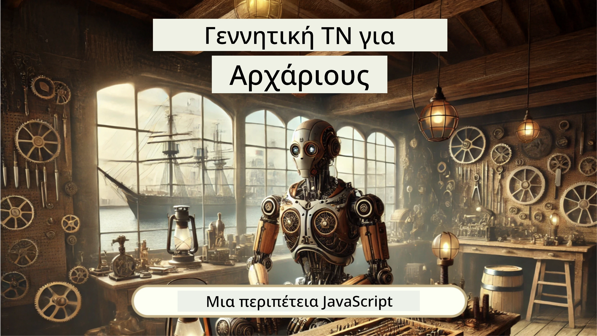
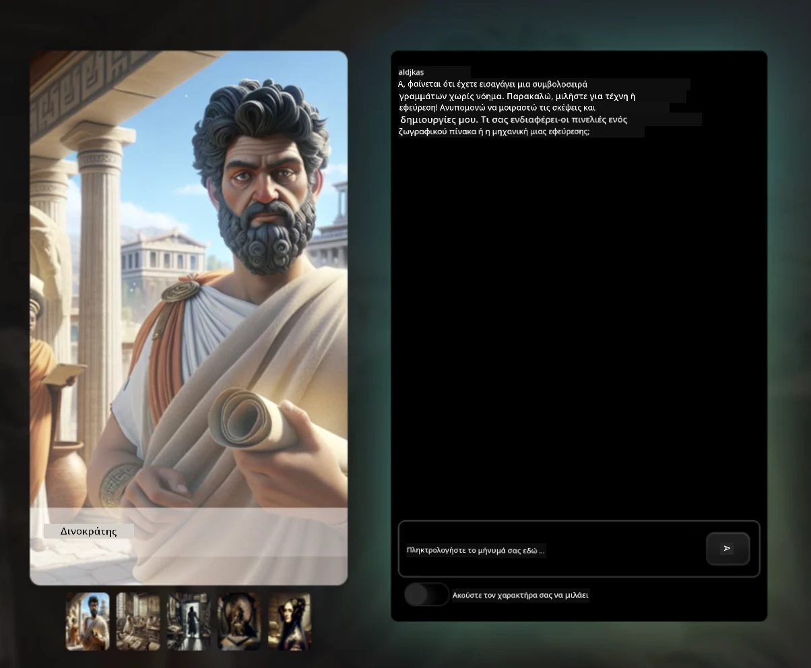
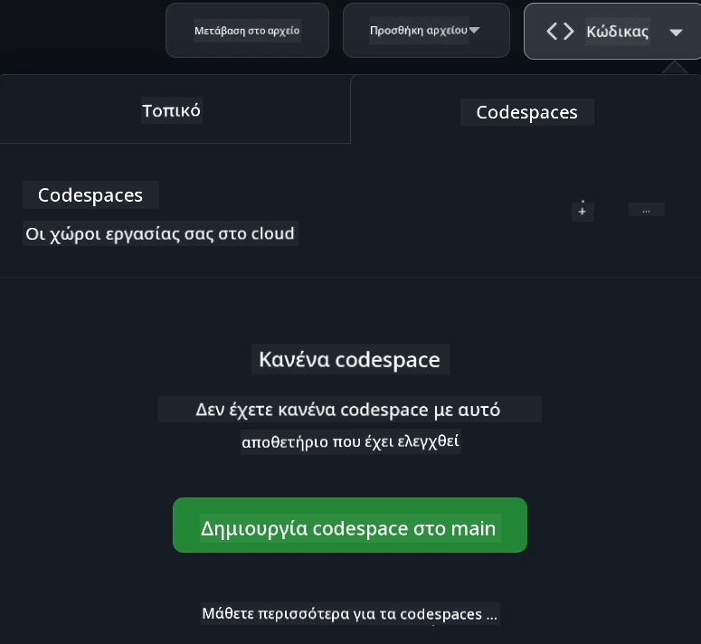

[](https://github.com/microsoft/Web-Dev-For-Beginners/blob/master/LICENSE)
[](https://GitHub.com/microsoft/Web-Dev-For-Beginners/graphs/contributors/)
[](https://GitHub.com/microsoft/Web-Dev-For-Beginners/issues/)
[](https://GitHub.com/microsoft/Web-Dev-For-Beginners/pulls/)
[](http://makeapullrequest.com) 

[](https://GitHub.com/microsoft/Web-Dev-For-Beginners/watchers/)
[](https://GitHub.com/microsoft/Web-Dev-For-Beginners/network/)
[](https://GitHub.com/microsoft/Web-Dev-For-Beginners/stargazers/)

[](https://discord.gg/nTYy5BXMWG)

# Ανάπτυξη Ιστοσελίδων για Αρχάριους - Ένα Πρόγραμμα Σπουδών

Μάθετε τα βασικά της ανάπτυξης ιστοσελίδων με το ολοκληρωμένο μας μάθημα διάρκειας 12 εβδομάδων από τους Microsoft Cloud Advocates. Κάθε ένα από τα 24 μαθήματα εμβαθύνει σε JavaScript, CSS και HTML μέσα από πρακτικά έργα όπως τεράριουμ, επεκτάσεις προγράμματος περιήγησης και διαστημικά παιχνίδια. Ασχοληθείτε με κουίζ, συζητήσεις και πρακτικές εργασίες. Βελτιώστε τις δεξιότητές σας και βελτιστοποιήστε την απορρόφηση γνώσεων με τη στοχευμένη μας παιδαγωγική βασισμένη σε έργα. Ξεκινήστε το ταξίδι σας στον κώδικα σήμερα!

Γίνετε μέλος της κοινότητας Azure AI Foundry στο Discord

[](https://discord.gg/nTYy5BXMWG)

Ακολουθήστε αυτά τα βήματα για να ξεκινήσετε με αυτούς τους πόρους:
1. **Δημιουργήστε Fork στο Αποθετήριο**: Πατήστε [](https://GitHub.com/microsoft/Web-Dev-For-Beginners/fork)
2. **Κλωνοποιήστε το Αποθετήριο**:   `git clone https://github.com/microsoft/Web-Dev-For-Beginners.git`
3. [**Γίνετε μέλος του Azure AI Foundry Discord και γνωρίστε ειδικούς και άλλους προγραμματιστές**](https://discord.com/invite/ByRwuEEgH4)

### 🌐 Υποστήριξη Πολλών Γλωσσών

#### Υποστηρίζεται μέσω GitHub Action (Αυτοματοποιημένο & Πάντα Ενημερωμένο)

<!-- CO-OP TRANSLATOR LANGUAGES TABLE START -->
[Arabic](../ar/README.md) | [Bengali](../bn/README.md) | [Bulgarian](../bg/README.md) | [Burmese (Myanmar)](../my/README.md) | [Chinese (Simplified)](../zh-CN/README.md) | [Chinese (Traditional, Hong Kong)](../zh-HK/README.md) | [Chinese (Traditional, Macau)](../zh-MO/README.md) | [Chinese (Traditional, Taiwan)](../zh-TW/README.md) | [Croatian](../hr/README.md) | [Czech](../cs/README.md) | [Danish](../da/README.md) | [Dutch](../nl/README.md) | [Estonian](../et/README.md) | [Finnish](../fi/README.md) | [French](../fr/README.md) | [German](../de/README.md) | [Greek](./README.md) | [Hebrew](../he/README.md) | [Hindi](../hi/README.md) | [Hungarian](../hu/README.md) | [Indonesian](../id/README.md) | [Italian](../it/README.md) | [Japanese](../ja/README.md) | [Kannada](../kn/README.md) | [Khmer](../km/README.md) | [Korean](../ko/README.md) | [Lithuanian](../lt/README.md) | [Malay](../ms/README.md) | [Malayalam](../ml/README.md) | [Marathi](../mr/README.md) | [Nepali](../ne/README.md) | [Nigerian Pidgin](../pcm/README.md) | [Norwegian](../no/README.md) | [Persian (Farsi)](../fa/README.md) | [Polish](../pl/README.md) | [Portuguese (Brazil)](../pt-BR/README.md) | [Portuguese (Portugal)](../pt-PT/README.md) | [Punjabi (Gurmukhi)](../pa/README.md) | [Romanian](../ro/README.md) | [Russian](../ru/README.md) | [Serbian (Cyrillic)](../sr/README.md) | [Slovak](../sk/README.md) | [Slovenian](../sl/README.md) | [Spanish](../es/README.md) | [Swahili](../sw/README.md) | [Swedish](../sv/README.md) | [Tagalog (Filipino)](../tl/README.md) | [Tamil](../ta/README.md) | [Telugu](../te/README.md) | [Thai](../th/README.md) | [Turkish](../tr/README.md) | [Ukrainian](../uk/README.md) | [Urdu](../ur/README.md) | [Vietnamese](../vi/README.md)

> **Προτιμάτε να Κλωνοποιήσετε τοπικά;**
>
> Αυτό το αποθετήριο περιλαμβάνει πάνω από 50 μεταφράσεις που αυξάνουν σημαντικά το μέγεθος λήψης. Για κλωνοποίηση χωρίς μεταφράσεις, χρησιμοποιήστε sparse checkout:
>
> **Bash / macOS / Linux:**
> ```bash
> git clone --filter=blob:none --sparse https://github.com/microsoft/Web-Dev-For-Beginners.git
> cd Web-Dev-For-Beginners
> git sparse-checkout set --no-cone '/*' '!translations' '!translated_images'
> ```
>
> **CMD (Windows):**
> ```cmd
> git clone --filter=blob:none --sparse https://github.com/microsoft/Web-Dev-For-Beginners.git
> cd Web-Dev-For-Beginners
> git sparse-checkout set --no-cone "/*" "!translations" "!translated_images"
> ```
>
> Αυτό σας δίνει όλα όσα χρειάζεστε για να ολοκληρώσετε το μάθημα με πολύ πιο γρήγορη λήψη.
<!-- CO-OP TRANSLATOR LANGUAGES TABLE END -->

**Εάν επιθυμείτε να προστεθούν επιπλέον γλώσσες μετάφρασης, οι υποστηριζόμενες γλώσσες αναφέρονται [εδώ](https://github.com/Azure/co-op-translator/blob/main/getting_started/supported-languages.md)**

[](https://open.vscode.dev/microsoft/Web-Dev-For-Beginners)

#### 🧑‍🎓 _Είσαι φοιτητής;_

Επισκεφθείτε τη σελίδα [**Student Hub**](https://docs.microsoft.com/learn/student-hub/?WT.mc_id=academic-77807-sagibbon) όπου θα βρείτε πόρους για αρχάριους, πακέτα για φοιτητές και ακόμη τρόπους να αποκτήσετε δωρεάν κουπόνι πιστοποίησης. Αυτή είναι η σελίδα που αξίζει να αποθηκεύσετε στα αγαπημένα και να ελέγχετε τακτικά καθώς ανανεώνουμε το περιεχόμενο κάθε μήνα.

### 📣 Ανακοίνωση - Νέες Προκλήσεις λειτουργίας GitHub Copilot Agent για ολοκλήρωση!

Προστέθηκε νέα Πρόκληση, αναζητήστε "GitHub Copilot Agent Challenge 🚀" στις περισσότερες ενότητες. Πρόκειται για νέα πρόκληση για να ολοκληρώσετε χρησιμοποιώντας το GitHub Copilot και τη λειτουργία Agent. Αν δεν έχετε χρησιμοποιήσει τη λειτουργία Agent πριν, αυτή μπορεί όχι μόνο να δημιουργεί κείμενο αλλά και να δημιουργεί και να επεξεργάζεται αρχεία, να εκτελεί εντολές και άλλα.

### 📣 Ανακοίνωση - _Νέο Έργο για δημιουργία με τη χρήση Γενετικής Τεχνητής Νοημοσύνης_

Μόλις προστέθηκε νέο έργο AI Assistant, ρίξτε μια ματιά στο [έργο](./9-chat-project/README.md)

### 📣 Ανακοίνωση - _Νέο Πρόγραμμα Σπουδών_ για Γενετική Τεχνητή Νοημοσύνη για JavaScript μόλις κυκλοφόρησε

Μην χάσετε το νέο μας πρόγραμμα Γενετικής Τεχνητής Νοημοσύνης!

Επισκεφθείτε [https://aka.ms/genai-js-course](https://aka.ms/genai-js-course) για να ξεκινήσετε!



- Μαθήματα που καλύπτουν τα πάντα από τα βασικά έως RAG.
- Αλληλεπιδράστε με ιστορικούς χαρακτήρες χρησιμοποιώντας το GenAI και την εφαρμογή συνοδός μας.
- Διασκεδαστική και συναρπαστική αφήγηση, θα ταξιδεύετε στο χρόνο!




Κάθε μάθημα περιλαμβάνει μια εργασία για ολοκλήρωση, έναν έλεγχο γνώσεων και μια πρόκληση που θα σας καθοδηγήσει στην εκμάθηση θεμάτων όπως:
- Δημιουργία προτροπών και τεχνική prompt engineering
- Δημιουργία εφαρμογών κειμένου και εικόνας
- Εφαρμογές αναζήτησης

Επισκεφθείτε [https://aka.ms/genai-js-course](https://aka.ms/genai-js-course) για να ξεκινήσετε!


## 🌱 Ξεκινώντας

> **Καθηγητές**, έχουμε [συμπεριλάβει κάποιες προτάσεις](for-teachers.md) για το πώς να χρησιμοποιήσετε αυτό το πρόγραμμα σπουδών. Θα εκτιμούσαμε τα σχόλιά σας [στο φόρουμ συζητήσεων](https://github.com/microsoft/Web-Dev-For-Beginners/discussions/categories/teacher-corner)!

**[Μαθητές](https://aka.ms/student-page/?WT.mc_id=academic-77807-sagibbon)**, για κάθε μάθημα, ξεκινήστε με ένα προ-μάθημα κουίζ και συνεχίστε διαβάζοντας το υλικό, ολοκληρώνοντας τις διάφορες δραστηριότητες και ελέγχοντας την κατανόησή σας με το κουίζ μετά το μάθημα.

Για να βελτιώσετε την εκπαιδευτική σας εμπειρία, συνδεθείτε με τους συναδέλφους σας για να δουλέψετε μαζί στα έργα! Οι συζητήσεις ενθαρρύνονται στο [φόρουμ συζητήσεών μας](https://github.com/microsoft/Web-Dev-For-Beginners/discussions) όπου η ομάδα των συντονιστών μας θα είναι διαθέσιμη να απαντήσει στις ερωτήσεις σας.

Για περαιτέρω εκπαίδευση, προτείνουμε ανεπιφύλακτα να εξερευνήσετε το [Microsoft Learn](https://learn.microsoft.com/users/wirelesslife/collections/p1ddcy5jwy0jkm?WT.mc_id=academic-77807-sagibbon) για επιπλέον εκπαιδευτικό υλικό.

### 📋 Ρύθμιση του περιβάλλοντος εργασίας σας

Αυτό το πρόγραμμα έχει ένα έτοιμο περιβάλλον ανάπτυξης! Καθώς ξεκινάτε, μπορείτε να επιλέξετε να τρέξετε το πρόγραμμα σε ένα [Codespace](https://github.com/features/codespaces/) (_ένα περιβάλλον βασισμένο σε πρόγραμμα περιήγησης, χωρίς να χρειάζεται εγκατάσταση_), ή τοπικά στον υπολογιστή σας χρησιμοποιώντας ένα επεξεργαστή κειμένου όπως το [Visual Studio Code](https://code.visualstudio.com/?WT.mc_id=academic-77807-sagibbon).

#### Δημιουργήστε το αποθετήριό σας
Για να αποθηκεύετε εύκολα τη δουλειά σας, συνιστάται να δημιουργήσετε το δικό σας αντίγραφο αυτού του αποθετηρίου. Μπορείτε να το κάνετε πατώντας το κουμπί **Use this template** στην κορυφή της σελίδας. Αυτό θα δημιουργήσει ένα νέο αποθετήριο στον λογαριασμό σας GitHub με ένα αντίγραφο του προγράμματος σπουδών.

Ακολουθήστε αυτά τα βήματα:
1. **Δημιουργήστε Fork στο Αποθετήριο**: Πατήστε το κουμπί "Fork" στην πάνω δεξιά γωνία αυτής της σελίδας.
2. **Κλωνοποιήστε το Αποθετήριο**:   `git clone https://github.com/microsoft/Web-Dev-For-Beginners.git`

#### Εκτέλεση του προγράμματος σε Codespace

Στο αντίγραφό σας αυτού του αποθετηρίου που δημιουργήσατε, πατήστε το κουμπί **Code** και επιλέξτε **Open with Codespaces**. Αυτό θα δημιουργήσει ένα νέο Codespace για να δουλέψετε μέσα.



#### Εκτέλεση του προγράμματος τοπικά στον υπολογιστή σας

Για να τρέξετε το πρόγραμμα τοπικά στον υπολογιστή σας, θα χρειαστείτε έναν επεξεργαστή κειμένου, ένα πρόγραμμα περιήγησης και ένα εργαλείο γραμμής εντολών. Το πρώτο μας μάθημα, [Εισαγωγή στις Γλώσσες Προγραμματισμού και Εργαλεία του Επαγγέλματος](../../1-getting-started-lessons/1-intro-to-programming-languages), θα σας καθοδηγήσει μέσα από τις διάφορες επιλογές κάθε εργαλείου ώστε να επιλέξετε τι ταιριάζει καλύτερα σε εσάς.

Η πρότασή μας είναι να χρησιμοποιήσετε το [Visual Studio Code](https://code.visualstudio.com/?WT.mc_id=academic-77807-sagibbon) ως τον επεξεργαστή σας, που διαθέτει επίσης ενσωματωμένο [Τερματικό](https://code.visualstudio.com/docs/terminal/basics/?WT.mc_id=academic-77807-sagibbon). Μπορείτε να κατεβάσετε το Visual Studio Code [εδώ](https://code.visualstudio.com/?WT.mc_id=academic-77807-sagibbon).
1. Αντιγράψτε το αποθετήριο σας στον υπολογιστή σας. Μπορείτε να το κάνετε αυτό πατώντας το κουμπί **Code** και αντιγράφοντας το URL:

    [CodeSpace](./images/createcodespace.png)

    Στη συνέχεια, ανοίξτε το [Τερματικό](https://code.visualstudio.com/docs/terminal/basics/?WT.mc_id=academic-77807-sagibbon) μέσα στο [Visual Studio Code](https://code.visualstudio.com/?WT.mc_id=academic-77807-sagibbon) και εκτελέστε την παρακάτω εντολή, αντικαθιστώντας το `<your-repository-url>` με το URL που μόλις αντιγράψατε:

    ```bash 
    git clone <your-repository-url>
    ```

2. Ανοίξτε το φάκελο στο Visual Studio Code. Μπορείτε να το κάνετε αυτό πατώντας **File** > **Open Folder** και επιλέγοντας το φάκελο που μόλις αντιγράψατε.


>  Προτεινόμενες επεκτάσεις για το Visual Studio Code:
>
> * [Live Server](https://marketplace.visualstudio.com/items?itemName=ritwickdey.LiveServer&WT.mc_id=academic-77807-sagibbon) - για προεπισκόπηση σελίδων HTML μέσα στο Visual Studio Code
> * [Copilot](https://marketplace.visualstudio.com/items?itemName=GitHub.copilot&WT.mc_id=academic-77807-sagibbon) - για να σας βοηθά να γράφετε κώδικα πιο γρήγορα

## 📂 Κάθε μάθημα περιλαμβάνει:

- προαιρετικό σκίτσο
- προαιρετικό συμπληρωματικό βίντεο
- προθέρμανση με quiz πριν το μάθημα
- γραπτό μάθημα
- για μαθήματα με έργα, οδηγούς βήμα-βήμα για το πώς να φτιάξετε το έργο
- ελέγχους γνώσης
- μια πρόκληση
- συμπληρωματική ανάγνωση
- ανάθεση εργασίας
- [quiz μετά το μάθημα](https://ff-quizzes.netlify.app/web/)

> **Μια σημείωση για τα quiz**: Όλα τα quiz περιέχονται στον φάκελο Quiz-app, συνολικά 48 quiz με τρεις ερωτήσεις το καθένα. Είναι διαθέσιμα [εδώ](https://ff-quizzes.netlify.app/web/) και η εφαρμογή quiz μπορεί να τρέξει τοπικά ή να αναπτυχθεί στο Azure· ακολουθήστε τις οδηγίες στον φάκελο `quiz-app`.

## 🗃️ Μαθήματα

|     |                       Όνομα Έργου                       |                            Διδακτικές Έννοιες                             | Στόχοι Μάθησης                                                                                                                    |                                                         Συνδεδεμένο Μάθημα                                                          |         Συγγραφέας          |
| :-: | :------------------------------------------------------: | :--------------------------------------------------------------------: | ----------------------------------------------------------------------------------------------------------------------------------- | :----------------------------------------------------------------------------------------------------------------------------: | :---------------------: |
| 01  |                     Ξεκινώντας                         |           Εισαγωγή στον Προγραμματισμό και τα Εργαλεία της Επαγγελματίας           | Μάθετε τις βασικές αρχές που διέπουν τις περισσότερες γλώσσες προγραμματισμού και για το λογισμικό που βοηθά τους επαγγελματίες προγραμματιστές να κάνουν τη δουλειά τους | [Εισαγωγή στις Γλώσσες Προγραμματισμού και Εργαλεία](./1-getting-started-lessons/1-intro-to-programming-languages/README.md) |         Jasmine         |
| 02  |                     Ξεκινώντας                         |             Βασικά του GitHub, περιλαμβάνει συνεργασία με ομάδα             | Πώς να χρησιμοποιείτε το GitHub στο έργο σας και πώς να συνεργάζεστε με άλλους σε μια βάση κώδικα                                  |                            [Εισαγωγή στο GitHub](./1-getting-started-lessons/2-github-basics/README.md)                             |          Floor          |
| 03  |                     Ξεκινώντας                         |                             Προσβασιμότητα                              | Μάθετε τα βασικά της προσβασιμότητας στο διαδίκτυο                                                                                |                       [Βασικά Προσβασιμότητας](./1-getting-started-lessons/3-accessibility/README.md)                       |       Christopher       |
| 04  |                        Βασικά JS                       |                         Τύποι Δεδομένων JavaScript                          | Τα βασικά για τους τύπους δεδομένων στη JavaScript                                                                                 |                                       [Τύποι Δεδομένων](./2-js-basics/1-data-types/README.md)                                        |         Jasmine         |
| 05  |                        Βασικά JS                       |                         Συναρτήσεις και Μέθοδοι                          | Μάθετε για συναρτήσεις και μεθόδους για τη διαχείριση της ροής λογικής μιας εφαρμογής                                              |                              [Συναρτήσεις και Μέθοδοι](./2-js-basics/2-functions-methods/README.md)                               | Jasmine και Christopher |
| 06  |                        Βασικά JS                       |                        Λήψη Αποφάσεων με JS                        | Μάθετε πώς να δημιουργείτε συνθήκες στον κώδικα σας χρησιμοποιώντας μεθόδους λήψης αποφάσεων                                        |                                 [Λήψη Αποφάσεων](./2-js-basics/3-making-decisions/README.md)                                  |         Jasmine         |
| 07  |                        Βασικά JS                       |                            Πίνακες και Βρόχοι                            | Εργαστείτε με δεδομένα χρησιμοποιώντας πίνακες και βρόχους στη JavaScript                                                          |                                   [Πίνακες και Βρόχοι](./2-js-basics/4-arrays-loops/README.md)                                    |         Jasmine         |
| 08  |       [Terrarium](./3-terrarium/solution/README.md)       |                            HTML στην Πράξη                            | Δημιουργήστε το HTML για να φτιάξετε ένα διαδικτυακό terrarium, εστιάζοντας στη δημιουργία διάταξης                                |                                 [Εισαγωγή στο HTML](./3-terrarium/1-intro-to-html/README.md)                                 |           Jen           |
| 09  |       [Terrarium](./3-terrarium/solution/README.md)       |                            CSS στην Πράξη                             | Δημιουργήστε το CSS για να στυλιζάρετε το διαδικτυακό terrarium, εστιάζοντας στα βασικά του CSS και το responsive design          |                                  [Εισαγωγή στο CSS](./3-terrarium/2-intro-to-css/README.md)                                  |           Jen           |
| 10  |            [Terrarium](./3-terrarium/solution/README.md)            |                 Κλεισίματα JavaScript, χειρισμός DOM                  | Δημιουργήστε το JavaScript ώστε το terrarium να λειτουργεί με drag/drop interface, εστιάζοντας στα closures και χειρισμό DOM       |                  [Κλεισίματα JavaScript, χειρισμός DOM](./3-terrarium/3-intro-to-DOM-and-closures/README.md)                   |           Jen           |
| 11  |          [Παιχνίδι Πληκτρολόγησης](./4-typing-game/solution/README.md)          |                          Δημιουργία Παιχνιδιού Πληκτρολόγησης                           | Μάθετε πώς να χρησιμοποιείτε συμβάντα πληκτρολογίου για να καθοδηγήσετε τη λογική της εφαρμογής JavaScript σας                   |                                [Προγραμματισμός με συμβάντα](./4-typing-game/typing-game/README.md)                                |       Christopher       |
| 12  | [Πράσινη Επέκταση Περιηγητή](./5-browser-extension/solution/README.md) |                         Εργασία με Περιηγητές                          | Μάθετε πώς λειτουργούν οι περιηγητές, την ιστορία τους, και πώς να στήσετε τα πρώτα στοιχεία μιας επέκτασης περιηγητή             |                               [Σχετικά με τους Περιηγητές](./5-browser-extension/1-about-browsers/README.md)                                |           Jen           |
| 13  | [Πράσινη Επέκταση Περιηγητή](./5-browser-extension/solution/README.md) | Δημιουργία φόρμας, κλήση API και αποθήκευση μεταβλητών τοπικά | Δημιουργήστε τα JavaScript στοιχεία της επέκτασης περιηγητή σας για να καλέσετε ένα API χρησιμοποιώντας μεταβλητές αποθηκευμένες τοπικά |                [APIs, Φόρμες και Τοπική Αποθήκευση](./5-browser-extension/2-forms-browsers-local-storage/README.md)                 |           Jen           |
| 14  | [Πράσινη Επέκταση Περιηγητή](./5-browser-extension/solution/README.md) |          Παρασκηνιακές διεργασίες στον περιηγητή, απόδοση στο web          | Χρησιμοποιήστε τις παρασκηνιακές διεργασίες του περιηγητή για να διαχειριστείτε το εικονίδιο της επέκτασης· μάθετε για την απόδοση και βελτιστοποιήσεις |             [Παρασκηνιακές Εργασίες και Απόδοση](./5-browser-extension/3-background-tasks-and-performance/README.md)              |           Jen           |
| 15  |           [Παιχνίδι Διαστήματος](./6-space-game/solution/README.md)           |             Προχωρημένη Ανάπτυξη Παιχνιδιού με JavaScript             | Μάθετε για την κληρονομικότητα μέσω Κλάσεων και Σύνθεσης καθώς και το μοτίβο Pub/Sub, προετοιμαζόμενοι για ανάπτυξη παιχνιδιού     |                      [Εισαγωγή στην Προχωρημένη Ανάπτυξη Παιχνιδιού](./6-space-game/1-introduction/README.md)                       |          Chris          |
| 16  |           [Παιχνίδι Διαστήματος](./6-space-game/solution/README.md)           |                           Σχεδίαση σε καμβά                            | Μάθετε για το Canvas API, που χρησιμοποιείται για τη σχεδίαση στοιχείων σε οθόνη                                             |                                [Σχεδίαση σε Καμβά](./6-space-game/2-drawing-to-canvas/README.md)                                |          Chris          |
| 17  |           [Παιχνίδι Διαστήματος](./6-space-game/solution/README.md)           |                   Μετακίνηση στοιχείων στην οθόνη                    | Ανακαλύψτε πώς τα στοιχεία μπορούν να κινηθούν χρησιμοποιώντας καρτεσιανές συντεταγμένες και το Canvas API                       |                           [Μετακίνηση Στοιχείων](./6-space-game/3-moving-elements-around/README.md)                           |          Chris          |
| 18  |           [Παιχνίδι Διαστήματος](./6-space-game/solution/README.md)           |                          Ανίχνευση Σύγκρουσης                           | Κάντε τα στοιχεία να συγκρούονται και να αντιδρούν μεταξύ τους χρησιμοποιώντας πατήματα πλήκτρων και παρέχετε συνάρτηση cooldown για την απόδοση του παιχνιδιού |                              [Ανίχνευση Σύγκρουσης](./6-space-game/4-collision-detection/README.md)                              |          Chris          |
| 19  |           [Παιχνίδι Διαστήματος](./6-space-game/solution/README.md)           |                             Καταμέτρηση Βαθμολογίας                              | Πραγματοποιήστε μαθηματικούς υπολογισμούς βάσει της κατάστασης και της απόδοσης του παιχνιδιού                                     |                                    [Καταμέτρηση Βαθμολογίας](./6-space-game/5-keeping-score/README.md)                                    |          Chris          |
| 20  |           [Παιχνίδι Διαστήματος](./6-space-game/solution/README.md)           |                     Τερματισμός και επανεκκίνηση του παιχνιδιού                     | Μάθετε για τον τερματισμό και την επανεκκίνηση του παιχνιδιού, συμπεριλαμβανομένου του καθαρισμού πόρων και της επαναφοράς μεταβλητών |                                [Ο Όρος Τερματισμού](./6-space-game/6-end-condition/README.md)                                 |          Chris          |
| 21  |         [Εφαρμογή Τραπεζικής](./7-bank-project/solution/README.md)          |                 Πρότυπα HTML και Διαδρομές σε Web Εφαρμογή                 | Μάθετε πώς να δημιουργήσετε τη δομή μιας πολυσέλιδης ιστοσελίδας χρησιμοποιώντας διαδρομές και πρότυπα HTML                        |                            [Πρότυπα HTML και Διαδρομές](./7-bank-project/1-template-route/README.md)                             |          Yohan          |
| 22  |         [Εφαρμογή Τραπεζικής](./7-bank-project/solution/README.md)          |                  Δημιουργία Φόρμας Εισόδου και Εγγραφής                   | Μάθετε για τη δημιουργία φορμών και διαχείριση ελέγχων εγκυρότητας                                                                 |                                           [Φόρμες](./7-bank-project/2-forms/README.md)                                           |          Yohan          |
| 23  |         [Εφαρμογή Τραπεζικής](./7-bank-project/solution/README.md)          |                   Μέθοδοι Ανάκτησης και Χρήσης Δεδομένων                   | Πώς ρέουν τα δεδομένα μέσα και έξω από την εφαρμογή σας, πώς να τα ανακτάτε, αποθηκεύετε και απορρίπτετε                          |                                            [Δεδομένα](./7-bank-project/3-data/README.md)                                            |          Yohan          |
| 24  |         [Εφαρμογή Τραπεζικής](./7-bank-project/solution/README.md)          |                      Έννοιες Διαχείρισης Κατάστασης                      | Μάθετε πώς η εφαρμογή σας διατηρεί την κατάσταση και πώς να τη διαχειρίζεστε προγραμματιστικά                                      |                                [Διαχείριση Κατάστασης](./7-bank-project/4-state-management/README.md)                                |          Yohan          |
| 25 | [Κώδικας Browser/VScode](../../8-code-editor) | Εργασία με VScode | Μάθετε πώς να χρησιμοποιείτε έναν κειμενογράφο κώδικα| [Χρήση του Visual Studio Code](./8-code-editor/1-using-a-code-editor/README.md) | Chris |
| 26 | [Βοηθοί Τεχνητής Νοημοσύνης](./9-chat-project/README.md) | Εργασία με Τεχνητή Νοημοσύνη | Μάθετε πώς να δημιουργήσετε τον δικό σας βοηθό AI | [Έργο Βοηθού AI](./9-chat-project/README.md) | Chris |

## 🏫 Παιδαγωγική

Το πρόγραμμα σπουδών μας έχει σχεδιαστεί με δύο βασικές παιδαγωγικές αρχές κατά νου:
* μάθηση βασισμένη σε έργα
* συχνά quiz

Το πρόγραμμα διδάσκει τα θεμέλια της JavaScript, HTML και CSS, καθώς και τα πιο σύγχρονα εργαλεία και τεχνικές που χρησιμοποιούν οι σύγχρονοι προγραμματιστές ιστοσελίδων. Οι μαθητές θα έχουν την ευκαιρία να αναπτύξουν πρακτική εμπειρία δημιουργώντας ένα παιχνίδι πληκτρολόγησης, ένα εικονικό terrarium, μια οικολογική επέκταση περιηγητή, ένα παιχνίδι τύπου space-invader και μια εφαρμογή τραπεζικής για επιχειρήσεις. Μέχρι το τέλος της σειράς, οι μαθητές θα έχουν αποκτήσει μια στέρεη κατανόηση της ανάπτυξης ιστού.

> 🎓 Μπορείτε να παρακολουθήσετε τα πρώτα μαθήματα αυτής της ύλης ως [Μονοπάτι Μάθησης](https://docs.microsoft.com/learn/paths/web-development-101/?WT.mc_id=academic-77807-sagibbon) στο Microsoft Learn!

Με τη διασφάλιση ότι το περιεχόμενο ευθυγραμμίζεται με τα έργα, η διαδικασία γίνεται πιο ελκυστική για τους μαθητές και η διατήρηση των εννοιών ενισχύεται. Επίσης, γράψαμε αρκετά αρχικά μαθήματα στα βασικά της JavaScript για να εισαγάγουμε έννοιες, σε συνδυασμό με ένα βίντεο από τη συλλογή βιντεομαθημάτων "[Beginners Series to: JavaScript](https://channel9.msdn.com/Series/Beginners-Series-to-JavaScript/?WT.mc_id=academic-77807-sagibbon)", με ορισμένους από τους συγγραφείς της να συμβάλλουν σ' αυτό το πρόγραμμα σπουδών.

Επιπλέον, ένα quiz χαμηλής έντασης πριν από το μάθημα θέτει την πρόθεση του μαθητή για τη μάθηση ενός θέματος, ενώ ένα δεύτερο quiz μετά το μάθημα εξασφαλίζει περαιτέρω διατήρηση γνώσεων. Το πρόγραμμα σπουδών έχει σχεδιαστεί να είναι ευέλικτο και διασκεδαστικό και μπορεί να παρακολουθηθεί ολόκληρο ή μερικώς. Τα έργα ξεκινούν μικρά και γίνονται ολοένα και πιο σύνθετα μέχρι το τέλος του 12-εβδομάδων κύκλου.

Ενώ αποφεύξαμε σκόπιμα την εισαγωγή πλαισίων JavaScript για να εστιάσουμε στις βασικές δεξιότητες που χρειάζεται ένας προγραμματιστής ιστού πριν υιοθετήσει ένα πλαίσιο, το επόμενο βήμα για την ολοκλήρωση αυτού του προγράμματος θα ήταν η εκμάθηση του Node.js μέσω μιας άλλης συλλογής βίντεο: "[Beginner Series to: Node.js](https://channel9.msdn.com/Series/Beginners-Series-to-Nodejs/?WT.mc_id=academic-77807-sagibbon)".

> Επισκεφτείτε τους [Κανόνες Συμπεριφοράς](CODE_OF_CONDUCT.md) και τις οδηγίες [Συμμετοχής](CONTRIBUTING.md). Καλωσορίζουμε τα εποικοδομητικά σας σχόλια!


## 🧭 Πρόσβαση εκτός σύνδεσης

Μπορείτε να εκτελέσετε αυτή την τεκμηρίωση χωρίς σύνδεση χρησιμοποιώντας το [Docsify](https://docsify.js.org/#/). Κάντε fork αυτό το αποθετήριο, [εγκαταστήστε το Docsify](https://docsify.js.org/#/quickstart) στον τοπικό σας υπολογιστή και στη συνέχεια στον ριζικό φάκελο αυτού του αποθετηρίου πληκτρολογήστε `docsify serve`. Η ιστοσελίδα θα σερβιριστεί στη θύρα 3000 στο localhost σας: `localhost:3000`.

## 📘 PDF
Ένα PDF με όλα τα μαθήματα μπορείτε να βρείτε [εδώ](https://microsoft.github.io/Web-Dev-For-Beginners/pdf/readme.pdf).


## 🎒 Άλλα Μαθήματα

Η ομάδα μας δημιουργεί και άλλα μαθήματα! Ρίξτε μια ματιά:

<!-- CO-OP TRANSLATOR OTHER COURSES START -->
### LangChain
[](https://aka.ms/langchain4j-for-beginners)
[](https://aka.ms/langchainjs-for-beginners?WT.mc_id=m365-94501-dwahlin)
[](https://github.com/microsoft/langchain-for-beginners?WT.mc_id=m365-94501-dwahlin)
---

### Azure / Edge / MCP / Agents
[](https://github.com/microsoft/AZD-for-beginners?WT.mc_id=academic-105485-koreyst)
[](https://github.com/microsoft/edgeai-for-beginners?WT.mc_id=academic-105485-koreyst)
[](https://github.com/microsoft/mcp-for-beginners?WT.mc_id=academic-105485-koreyst)
[](https://github.com/microsoft/ai-agents-for-beginners?WT.mc_id=academic-105485-koreyst)

---
 
### Generative AI Series
[](https://github.com/microsoft/generative-ai-for-beginners?WT.mc_id=academic-105485-koreyst)
[-9333EA?style=for-the-badge&labelColor=E5E7EB&color=9333EA)](https://github.com/microsoft/Generative-AI-for-beginners-dotnet?WT.mc_id=academic-105485-koreyst)
[-C084FC?style=for-the-badge&labelColor=E5E7EB&color=C084FC)](https://github.com/microsoft/generative-ai-for-beginners-java?WT.mc_id=academic-105485-koreyst)
[-E879F9?style=for-the-badge&labelColor=E5E7EB&color=E879F9)](https://github.com/microsoft/generative-ai-with-javascript?WT.mc_id=academic-105485-koreyst)

---
 
### Core Learning
[](https://aka.ms/ml-beginners?WT.mc_id=academic-105485-koreyst)
[](https://aka.ms/datascience-beginners?WT.mc_id=academic-105485-koreyst)
[](https://aka.ms/ai-beginners?WT.mc_id=academic-105485-koreyst)
[](https://github.com/microsoft/Security-101?WT.mc_id=academic-96948-sayoung)
[](https://aka.ms/webdev-beginners?WT.mc_id=academic-105485-koreyst)
[](https://aka.ms/iot-beginners?WT.mc_id=academic-105485-koreyst)
[](https://github.com/microsoft/xr-development-for-beginners?WT.mc_id=academic-105485-koreyst)

---
 
### Copilot Series
[](https://aka.ms/GitHubCopilotAI?WT.mc_id=academic-105485-koreyst)
[](https://github.com/microsoft/mastering-github-copilot-for-dotnet-csharp-developers?WT.mc_id=academic-105485-koreyst)
[](https://github.com/microsoft/CopilotAdventures?WT.mc_id=academic-105485-koreyst)
<!-- CO-OP TRANSLATOR OTHER COURSES END -->

## Λήψη Βοήθειας

Αν κολλήσετε ή έχετε οποιεσδήποτε ερωτήσεις σχετικά με την ανάπτυξη εφαρμογών AI. Ενταχθείτε σε άλλους μαθητές και έμπειρους προγραμματιστές σε συζητήσεις για το MCP. Είναι μια υποστηρικτική κοινότητα όπου οι ερωτήσεις είναι ευπρόσδεκτες και η γνώση μοιράζεται ελεύθερα.

[](https://discord.gg/nTYy5BXMWG)

Αν έχετε σχόλια για το προϊόν ή σφάλματα κατά την ανάπτυξη επισκεφθείτε:

[](https://aka.ms/foundry/forum)

## Άδεια Χρήσης

Αυτό το αποθετήριο έχει αδειοδοτηθεί υπό την άδεια MIT. Δείτε το αρχείο [LICENSE](../../LICENSE) για περισσότερες πληροφορίες.

---

<!-- CO-OP TRANSLATOR DISCLAIMER START -->
**Αποποίηση ευθυνών**:  
Αυτό το έγγραφο έχει μεταφραστεί χρησιμοποιώντας την υπηρεσία μετάφρασης AI [Co-op Translator](https://github.com/Azure/co-op-translator). Παρόλο που επιδιώκουμε την ακρίβεια, παρακαλούμε σημειώστε ότι οι αυτόματες μεταφράσεις ενδέχεται να περιέχουν λάθη ή ανακρίβειες. Το πρωτότυπο έγγραφο στη μητρική του γλώσσα θα πρέπει να θεωρείται η αυθεντική πηγή. Για κρίσιμες πληροφορίες, συνιστάται επαγγελματική ανθρώπινη μετάφραση. Δεν φέρουμε καμία ευθύνη για τυχόν παρεξηγήσεις ή λανθασμένες ερμηνείες που προκύπτουν από τη χρήση αυτής της μετάφρασης.
<!-- CO-OP TRANSLATOR DISCLAIMER END -->