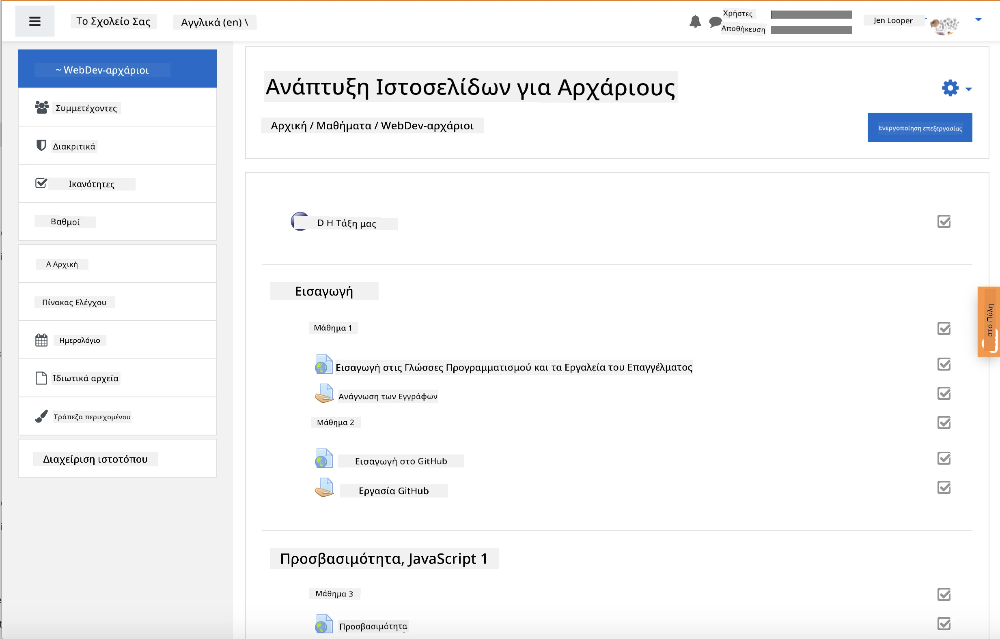
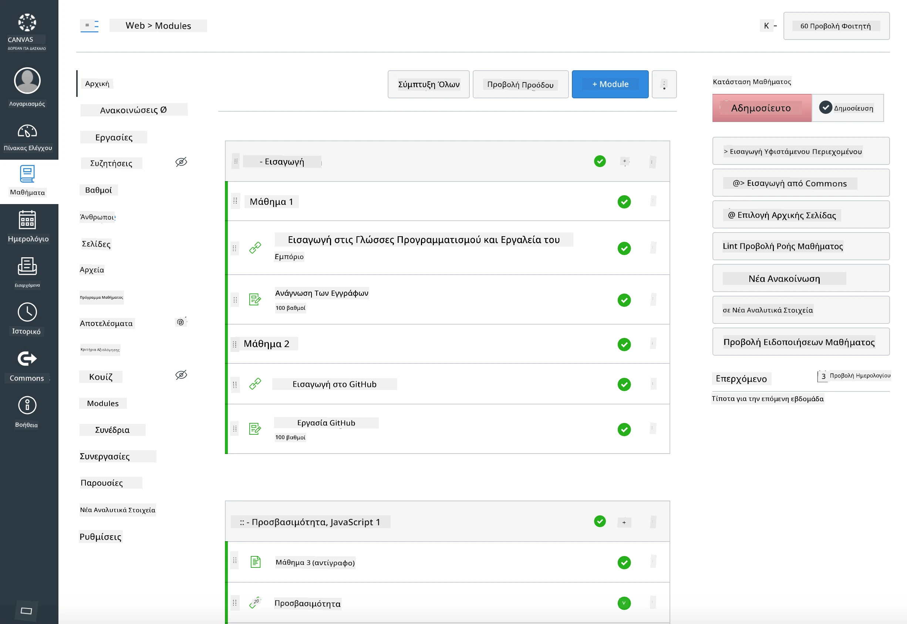

<!--
CO_OP_TRANSLATOR_METADATA:
{
  "original_hash": "71009af209f81cc01a1f2d324200375f",
  "translation_date": "2025-10-03T09:45:08+00:00",
  "source_file": "for-teachers.md",
  "language_code": "el"
}
-->
### Για Εκπαιδευτικούς

Είστε ευπρόσδεκτοι να χρησιμοποιήσετε αυτό το πρόγραμμα σπουδών στην τάξη σας. Λειτουργεί άψογα με το GitHub Classroom και κορυφαίες πλατφόρμες LMS, ενώ μπορεί επίσης να χρησιμοποιηθεί ως ανεξάρτητο αποθετήριο με τους μαθητές σας.

### Χρήση με το GitHub Classroom

Για να διαχειριστείτε μαθήματα και εργασίες ανά ομάδα, δημιουργήστε ένα αποθετήριο ανά μάθημα ώστε το GitHub Classroom να μπορεί να συνδέσει κάθε εργασία ανεξάρτητα.

- Κάντε fork αυτό το αποθετήριο στον οργανισμό σας.
- Δημιουργήστε ξεχωριστό αποθετήριο για κάθε μάθημα εξάγοντας κάθε φάκελο μαθήματος σε δικό του αποθετήριο.
  - Επιλογή Α: Δημιουργήστε κενά αποθετήρια (ένα για κάθε μάθημα) και αντιγράψτε τα περιεχόμενα του φακέλου μαθήματος σε καθένα.
  - Επιλογή Β: Χρησιμοποιήστε μια μέθοδο που διατηρεί το ιστορικό του Git (π.χ., διαχωρισμός φακέλου σε νέο αποθετήριο) αν χρειάζεστε προέλευση.
- Στο GitHub Classroom, δημιουργήστε μια εργασία ανά μάθημα και συνδέστε την με το αντίστοιχο αποθετήριο μαθήματος.
- Συνιστώμενες ρυθμίσεις:
  - Ορατότητα αποθετηρίου: ιδιωτική για τη δουλειά των μαθητών.
  - Χρησιμοποιήστε αρχικό κώδικα από το προεπιλεγμένο branch του αποθετηρίου μαθήματος.
  - Προσθέστε πρότυπα για θέματα και pull requests για κουίζ και υποβολές.
  - Προαιρετικά, ρυθμίστε αυτόματη βαθμολόγηση και τεστ αν τα μαθήματά σας τα περιλαμβάνουν.
- Συμβάσεις που βοηθούν:
  - Ονόματα αποθετηρίων όπως lesson-01-intro, lesson-02-html, κ.λπ.
  - Ετικέτες: quiz, assignment, needs-review, late, resubmission.
  - Tags/releases ανά ομάδα (π.χ., v2025-term1).

Συμβουλή: Αποφύγετε την αποθήκευση αποθετηρίων μέσα σε συγχρονισμένους φακέλους (π.χ., OneDrive/Google Drive) για να αποτρέψετε συγκρούσεις Git στα Windows.

### Χρήση με Moodle, Canvas ή Blackboard

Αυτό το πρόγραμμα σπουδών περιλαμβάνει πακέτα εισαγωγής για κοινές ροές εργασίας LMS.

- Moodle: Χρησιμοποιήστε το αρχείο μεταφόρτωσης Moodle [Moodle upload file](../../../../../../../teaching-files/webdev-moodle.mbz) για να φορτώσετε ολόκληρο το μάθημα.
- Common Cartridge: Χρησιμοποιήστε το αρχείο Common Cartridge [Common Cartridge file](../../../../../../../teaching-files/webdev-common-cartridge.imscc) για ευρύτερη συμβατότητα LMS.
- Σημειώσεις:
  - Το Moodle Cloud έχει περιορισμένη υποστήριξη Common Cartridge. Προτιμήστε το αρχείο Moodle παραπάνω, το οποίο μπορεί επίσης να μεταφορτωθεί στο Canvas.
  - Μετά την εισαγωγή, ελέγξτε τα modules, τις ημερομηνίες λήξης και τις ρυθμίσεις κουίζ ώστε να ταιριάζουν με το πρόγραμμα του εξαμήνου σας.

> Το πρόγραμμα σπουδών σε μια τάξη Moodle

> Το πρόγραμμα σπουδών στο Canvas

### Χρήση του αποθετηρίου απευθείας (χωρίς Classroom)

Αν προτιμάτε να μην χρησιμοποιήσετε το GitHub Classroom, μπορείτε να τρέξετε το μάθημα απευθείας από αυτό το αποθετήριο.

- Συγχρονισμένες/διαδικτυακές μορφές (Zoom/Teams):
  - Διεξάγετε σύντομες εισαγωγές με καθοδήγηση από μέντορα· χρησιμοποιήστε breakout rooms για κουίζ.
  - Ανακοινώστε ένα χρονικό παράθυρο για κουίζ· οι μαθητές υποβάλλουν απαντήσεις ως GitHub Issues.
  - Για συνεργατικές εργασίες, οι μαθητές δουλεύουν σε δημόσια αποθετήρια μαθημάτων και ανοίγουν pull requests.
- Ιδιωτικές/ασύγχρονες μορφές:
  - Οι μαθητές κάνουν fork κάθε μάθημα στα δικά τους **ιδιωτικά** αποθετήρια και σας προσθέτουν ως συνεργάτη.
  - Υποβάλλουν μέσω Issues (κουίζ) και Pull Requests (εργασίες) στο αποθετήριο της τάξης σας ή στα ιδιωτικά τους forks.

### Καλές πρακτικές

- Παρέχετε ένα εισαγωγικό μάθημα για βασικά του Git/GitHub, Issues και PRs.
- Χρησιμοποιήστε λίστες ελέγχου στα Issues για κουίζ/εργασίες πολλών βημάτων.
- Προσθέστε CONTRIBUTING.md και CODE_OF_CONDUCT.md για να ορίσετε κανόνες της τάξης.
- Προσθέστε σημειώσεις προσβασιμότητας (alt text, λεζάντες) και προσφέρετε εκτυπώσιμα PDFs.
- Δημιουργήστε εκδόσεις του περιεχομένου σας ανά εξάμηνο και "παγώστε" τα αποθετήρια μαθημάτων μετά τη δημοσίευση.

### Ανατροφοδότηση και υποστήριξη

Θέλουμε αυτό το πρόγραμμα σπουδών να λειτουργεί για εσάς και τους μαθητές σας. Ανοίξτε ένα νέο Issue σε αυτό το αποθετήριο για σφάλματα, αιτήματα ή βελτιώσεις, ή ξεκινήστε μια συζήτηση στο Teacher Corner.

---

**Αποποίηση ευθύνης**:  
Αυτό το έγγραφο έχει μεταφραστεί χρησιμοποιώντας την υπηρεσία αυτόματης μετάφρασης [Co-op Translator](https://github.com/Azure/co-op-translator). Παρόλο που καταβάλλουμε προσπάθειες για ακρίβεια, παρακαλούμε να έχετε υπόψη ότι οι αυτόματες μεταφράσεις ενδέχεται να περιέχουν σφάλματα ή ανακρίβειες. Το πρωτότυπο έγγραφο στη γλώσσα του θα πρέπει να θεωρείται η αυθεντική πηγή. Για κρίσιμες πληροφορίες, συνιστάται επαγγελματική ανθρώπινη μετάφραση. Δεν φέρουμε ευθύνη για τυχόν παρεξηγήσεις ή εσφαλμένες ερμηνείες που προκύπτουν από τη χρήση αυτής της μετάφρασης.