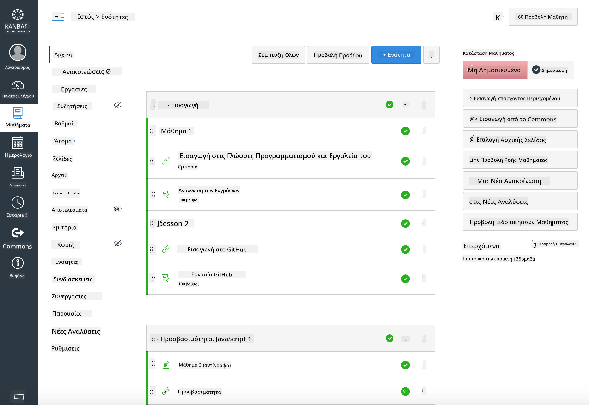

<!--
CO_OP_TRANSLATOR_METADATA:
{
  "original_hash": "75cb51f7ca9ea0b097ef4a1287e9290c",
  "translation_date": "2025-08-26T21:24:13+00:00",
  "source_file": "for-teachers.md",
  "language_code": "el"
}
-->
## Για Εκπαιδευτικούς

Θέλετε να χρησιμοποιήσετε αυτό το πρόγραμμα σπουδών στην τάξη σας; Μη διστάσετε να το κάνετε!

Στην πραγματικότητα, μπορείτε να το χρησιμοποιήσετε απευθείας στο GitHub μέσω του GitHub Classroom.

Για να το κάνετε αυτό, κάντε fork αυτό το αποθετήριο. Θα χρειαστεί να δημιουργήσετε ένα αποθετήριο για κάθε μάθημα, οπότε θα πρέπει να εξαγάγετε κάθε φάκελο σε ξεχωριστό αποθετήριο. Με αυτόν τον τρόπο, το [GitHub Classroom](https://classroom.github.com/classrooms) μπορεί να αναγνωρίσει κάθε μάθημα ξεχωριστά.

Αυτές οι [πλήρεις οδηγίες](https://github.blog/2020-03-18-set-up-your-digital-classroom-with-github-classroom/) θα σας δώσουν μια ιδέα για το πώς να οργανώσετε την τάξη σας.

## Χρήση σε Moodle, Canvas ή Blackboard

Αυτό το πρόγραμμα σπουδών λειτουργεί καλά σε αυτά τα Συστήματα Διαχείρισης Μάθησης! Χρησιμοποιήστε το [αρχείο μεταφόρτωσης Moodle](../../../../../../../teaching-files/webdev-moodle.mbz) για το πλήρες περιεχόμενο ή δοκιμάστε το [αρχείο Common Cartridge](../../../../../../../teaching-files/webdev-common-cartridge.imscc), το οποίο περιέχει μέρος του περιεχομένου. Το Moodle Cloud δεν υποστηρίζει πλήρεις εξαγωγές Common Cartridge, οπότε είναι προτιμότερο να χρησιμοποιήσετε το αρχείο λήψης Moodle, το οποίο μπορεί να μεταφορτωθεί στο Canvas. Ενημερώστε μας πώς μπορούμε να βελτιώσουμε αυτήν την εμπειρία.

> Το πρόγραμμα σπουδών σε τάξη Moodle

> Το πρόγραμμα σπουδών στο Canvas

## Χρήση του αποθετηρίου όπως είναι

Αν θέλετε να χρησιμοποιήσετε αυτό το αποθετήριο όπως είναι, χωρίς τη χρήση του GitHub Classroom, αυτό είναι επίσης εφικτό. Θα χρειαστεί να επικοινωνήσετε με τους μαθητές σας για να τους ενημερώσετε ποιο μάθημα να δουλέψουν μαζί.

Σε μια διαδικτυακή μορφή (Zoom, Teams ή άλλο), μπορείτε να δημιουργήσετε ομάδες εργασίας για τα κουίζ και να καθοδηγήσετε τους μαθητές ώστε να είναι έτοιμοι να μάθουν. Στη συνέχεια, προσκαλέστε τους μαθητές στα κουίζ και ζητήστε τους να υποβάλουν τις απαντήσεις τους ως 'issues' σε συγκεκριμένη χρονική στιγμή. Μπορείτε να κάνετε το ίδιο και με τις εργασίες, αν θέλετε οι μαθητές να δουλέψουν συνεργατικά σε δημόσιο περιβάλλον.

Αν προτιμάτε μια πιο ιδιωτική μορφή, ζητήστε από τους μαθητές σας να κάνουν fork το πρόγραμμα σπουδών, μάθημα προς μάθημα, στα δικά τους ιδιωτικά αποθετήρια GitHub και να σας δώσουν πρόσβαση. Έπειτα, μπορούν να ολοκληρώσουν τα κουίζ και τις εργασίες ιδιωτικά και να σας τα υποβάλουν μέσω issues στο αποθετήριο της τάξης σας.

Υπάρχουν πολλοί τρόποι να κάνετε αυτό να λειτουργήσει σε μια διαδικτυακή τάξη. Ενημερώστε μας τι λειτουργεί καλύτερα για εσάς!

## Παρακαλούμε δώστε μας τη γνώμη σας!

Θέλουμε να κάνουμε αυτό το πρόγραμμα σπουδών να λειτουργεί για εσάς και τους μαθητές σας. Συνδεθείτε μαζί μας στη [Γωνιά Εκπαιδευτικών](https://github.com/microsoft/Web-Dev-For-Beginners/discussions/categories/teacher-corner) και ανοίξτε ένα [**νέο θέμα**](https://github.com/microsoft/Web-Dev-For-Beginners/issues/new/choose) για οποιαδήποτε αιτήματα, σφάλματα και σχόλια.

---

**Αποποίηση Ευθύνης**:  
Αυτό το έγγραφο έχει μεταφραστεί χρησιμοποιώντας την υπηρεσία αυτόματης μετάφρασης [Co-op Translator](https://github.com/Azure/co-op-translator). Παρόλο που καταβάλλουμε προσπάθειες για ακρίβεια, παρακαλούμε να έχετε υπόψη ότι οι αυτόματες μεταφράσεις ενδέχεται να περιέχουν λάθη ή ανακρίβειες. Το πρωτότυπο έγγραφο στη μητρική του γλώσσα θα πρέπει να θεωρείται η αυθεντική πηγή. Για κρίσιμες πληροφορίες, συνιστάται επαγγελματική ανθρώπινη μετάφραση. Δεν φέρουμε ευθύνη για τυχόν παρεξηγήσεις ή εσφαλμένες ερμηνείες που προκύπτουν από τη χρήση αυτής της μετάφρασης.