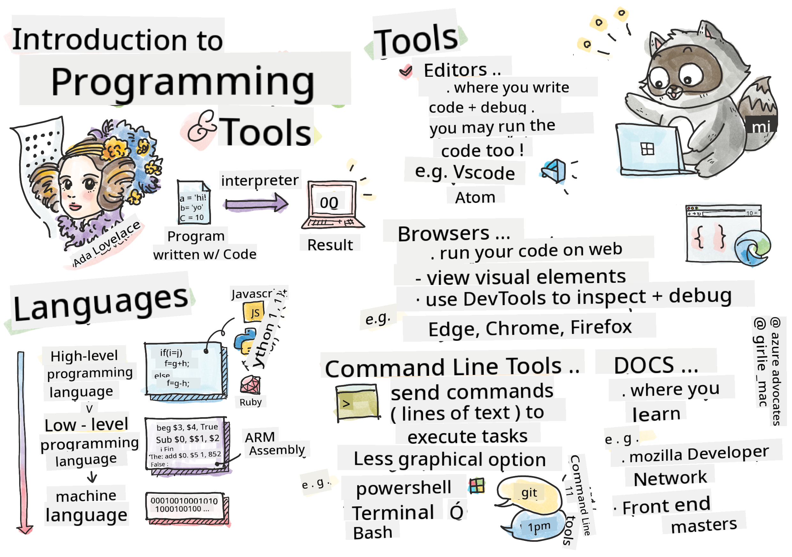

<!--
CO_OP_TRANSLATOR_METADATA:
{
  "original_hash": "2dcbb9259dee4f20a4f08d9a1aa2bd4c",
  "translation_date": "2025-08-29T13:27:32+00:00",
  "source_file": "1-getting-started-lessons/1-intro-to-programming-languages/README.md",
  "language_code": "en"
}
-->
# Introduction to Programming Languages and Tools of the Trade

This lesson introduces the fundamentals of programming languages. The topics discussed here are relevant to most modern programming languages. In the 'Tools of the Trade' section, you'll explore software that can assist you as a developer.


> Sketchnote by [Tomomi Imura](https://twitter.com/girlie_mac)

## Pre-Lecture Quiz
[Pre-lecture quiz](https://forms.office.com/r/dru4TE0U9n?origin=lprLink)

## Introduction

In this lesson, you'll learn about:

- What programming is
- Different types of programming languages
- Basic components of a program
- Software and tools that are useful for professional developers

> You can access this lesson on [Microsoft Learn](https://docs.microsoft.com/learn/modules/web-development-101/introduction-programming/?WT.mc_id=academic-77807-sagibbon)!

## What is Programming?

Programming, often called coding, is the act of writing instructions for devices like computers or mobile phones. These instructions are written using a programming language, which the device interprets. These instructions can be referred to by various names, such as *program*, *computer program*, *application (app)*, or *executable*.

A *program* is essentially anything created using code—websites, games, and mobile apps are all examples of programs. While some programs can be created without directly writing code, the underlying logic is still interpreted by the device, and that logic is typically written in code. A program that is *running* or *executing* is actively performing the instructions it contains. The device you're using to read this lesson is running a program to display it on your screen.

✅ Research task: Who is considered the world's first computer programmer?

## Programming Languages

Programming languages allow developers to write instructions for devices. Since devices only understand binary (1s and 0s), programming languages serve as a more efficient way for humans to communicate with computers.

Programming languages come in various formats and are designed for different purposes. For instance, JavaScript is primarily used for web applications, while Bash is mainly used for operating systems.

*Low-level languages* require fewer steps for a device to interpret instructions compared to *high-level languages*. However, high-level languages are popular because they are easier to read and have better support. JavaScript is an example of a high-level language.

The following code demonstrates the difference between a high-level language (JavaScript) and a low-level language (ARM assembly code).

```javascript
let number = 10
let n1 = 0, n2 = 1, nextTerm;

for (let i = 1; i <= number; i++) {
    console.log(n1);
    nextTerm = n1 + n2;
    n1 = n2;
    n2 = nextTerm;
}
```

```c
 area ascen,code,readonly
 entry
 code32
 adr r0,thumb+1
 bx r0
 code16
thumb
 mov r0,#00
 sub r0,r0,#01
 mov r1,#01
 mov r4,#10
 ldr r2,=0x40000000
back add r0,r1
 str r0,[r2]
 add r2,#04
 mov r3,r0
 mov r0,r1
 mov r1,r3
 sub r4,#01
 cmp r4,#00
 bne back
 end
```

Believe it or not, *both codes perform the same task*: printing a Fibonacci sequence up to 10.

✅ A Fibonacci sequence is [defined](https://en.wikipedia.org/wiki/Fibonacci_number) as a series of numbers where each number is the sum of the two preceding ones, starting from 0 and 1. The first 10 numbers in the Fibonacci sequence are 0, 1, 1, 2, 3, 5, 8, 13, 21, and 34.

## Elements of a Program

A single instruction in a program is called a *statement*. Statements usually have a specific character or spacing that marks where the instruction ends, or *terminates*. The way a program terminates depends on the programming language.

Statements in a program often rely on data provided by a user or other sources to execute instructions. Since data can influence how a program behaves, programming languages include ways to temporarily store data for later use. These are called *variables*. Variables are instructions that tell a device to save data in its memory. In programming, variables are similar to those in algebra—they have unique names and their values can change over time.

Not all statements in a program will necessarily be executed. This can happen intentionally, as designed by the developer, or accidentally due to unexpected errors. Controlling how a program runs makes it more robust and easier to maintain. Typically, these changes in control occur when certain conditions are met. A common statement used in modern programming to manage program flow is the `if..else` statement.

✅ You'll learn more about this type of statement in future lessons.

## Tools of the Trade

[](https://youtube.com/watch?v=69WJeXGBdxg "Tools of the Trade")

> 🎥 Click the image above to watch a video about development tools.

In this section, you'll explore software that can be helpful as you begin your journey as a professional developer.

A **development environment** is a personalized set of tools and features that developers use frequently when writing software. These tools are often tailored to meet a developer's specific needs and may evolve over time as priorities shift, personal projects change, or new programming languages are adopted. Development environments are as unique as the developers who use them.

### Editors

One of the most essential tools for software development is the editor. Editors are where developers write and sometimes run their code.

Editors are valuable for several reasons:

- *Debugging* helps identify bugs and errors by allowing developers to step through their code line by line. Some editors include debugging features that can be customized for specific programming languages.
- *Syntax highlighting* uses colors and text formatting to make code easier to read. Most editors allow developers to customize syntax highlighting.
- *Extensions and integrations* are additional tools created by developers for developers. These tools are not part of the base editor. For example, developers often document their code to explain how it works. A spell-check extension can help identify typos in the documentation. Most extensions are designed for specific editors, and editors typically include a way to search for available extensions.
- *Customization* allows developers to create a unique development environment tailored to their needs. Most editors are highly customizable and may even allow developers to create their own extensions.

#### Popular Editors and Web Development Extensions

- [Visual Studio Code](https://code.visualstudio.com/?WT.mc_id=academic-77807-sagibbon)
  - [Code Spell Checker](https://marketplace.visualstudio.com/items?itemName=streetsidesoftware.code-spell-checker)
  - [Live Share](https://marketplace.visualstudio.com/items?itemName=MS-vsliveshare.vsliveshare)
  - [Prettier - Code formatter](https://marketplace.visualstudio.com/items?itemName=esbenp.prettier-vscode)
- [Atom](https://atom.io/)
  - [spell-check](https://atom.io/packages/spell-check)
  - [teletype](https://atom.io/packages/teletype)
  - [atom-beautify](https://atom.io/packages/atom-beautify)
- [Sublimetext](https://www.sublimetext.com/)
  - [emmet](https://emmet.io/)
  - [SublimeLinter](http://www.sublimelinter.com/en/stable/)

### Browsers

Another essential tool is the browser. Web developers use browsers to test how their code runs on the web. Browsers also display the visual elements of a web page written in the editor, such as HTML.

Many browsers include *developer tools* (DevTools), which provide features and information to help developers gather and analyze important details about their applications. For example, if a web page encounters errors, DevTools can be configured to capture information about when and why the errors occurred.

#### Popular Browsers and DevTools

- [Edge](https://docs.microsoft.com/microsoft-edge/devtools-guide-chromium/?WT.mc_id=academic-77807-sagibbon)
- [Chrome](https://developers.google.com/web/tools/chrome-devtools/)
- [Firefox](https://developer.mozilla.org/docs/Tools)

### Command Line Tools

Some developers prefer a less graphical interface for their daily tasks and rely on the command line. Writing code involves a lot of typing, and some developers prefer not to interrupt their workflow by switching between the keyboard and mouse. Using keyboard shortcuts, they can navigate between windows, work on different files, and use tools efficiently. While most tasks can be completed with a mouse, the command line allows developers to perform many actions without switching between input devices. Additionally, command line tools are highly configurable, enabling developers to save custom configurations, modify them later, and transfer them to other machines. Since development environments are highly personal, some developers avoid the command line, others rely on it entirely, and some use a mix of both.

### Popular Command Line Options

Command line options vary depending on the operating system.

*💻 = preinstalled on the operating system.*

#### Windows

- [Powershell](https://docs.microsoft.com/powershell/scripting/overview?view=powershell-7/?WT.mc_id=academic-77807-sagibbon) 💻
- [Command Line](https://docs.microsoft.com/windows-server/administration/windows-commands/windows-commands/?WT.mc_id=academic-77807-sagibbon) (also known as CMD) 💻
- [Windows Terminal](https://docs.microsoft.com/windows/terminal/?WT.mc_id=academic-77807-sagibbon)
- [mintty](https://mintty.github.io/)

#### MacOS

- [Terminal](https://support.apple.com/guide/terminal/open-or-quit-terminal-apd5265185d-f365-44cb-8b09-71a064a42125/mac) 💻
- [iTerm](https://iterm2.com/)
- [Powershell](https://docs.microsoft.com/powershell/scripting/install/installing-powershell-core-on-macos?view=powershell-7/?WT.mc_id=academic-77807-sagibbon)

#### Linux

- [Bash](https://www.gnu.org/software/bash/manual/html_node/index.html) 💻
- [KDE Konsole](https://docs.kde.org/trunk5/en/konsole/konsole/index.html)
- [Powershell](https://docs.microsoft.com/powershell/scripting/install/installing-powershell-core-on-linux?view=powershell-7/?WT.mc_id=academic-77807-sagibbon)

#### Popular Command Line Tools

- [Git](https://git-scm.com/) (💻 on most operating systems)
- [NPM](https://www.npmjs.com/)
- [Yarn](https://classic.yarnpkg.com/en/docs/cli/)

### Documentation

When developers want to learn something new, they often turn to documentation for guidance. Documentation helps developers understand how to use tools and languages effectively and provides deeper insights into their functionality.

#### Popular Documentation on Web Development

- [Mozilla Developer Network (MDN)](https://developer.mozilla.org/docs/Web), created by Mozilla, the publishers of the [Firefox](https://www.mozilla.org/firefox/) browser
- [Frontend Masters](https://frontendmasters.com/learn/)
- [Web.dev](https://web.dev), created by Google, the publishers of [Chrome](https://www.google.com/chrome/)
- [Microsoft's developer documentation](https://docs.microsoft.com/microsoft-edge/#microsoft-edge-for-developers), for [Microsoft Edge](https://www.microsoft.com/edge)
- [W3 Schools](https://www.w3schools.com/where_to_start.asp)

✅ Research task: Now that you understand the basics of a web developer's environment, compare it with a web designer's environment.

---

## 🚀 Challenge

Compare some programming languages. What are the unique characteristics of JavaScript compared to Java? How about COBOL versus Go?

## Post-Lecture Quiz
[Post-lecture quiz](https://ff-quizzes.netlify.app/web/)

## Review & Self Study

Explore the different programming languages available. Try writing a line of code in one language, then rewrite it in two others. What did you learn?

## Assignment

[Reading the Docs](assignment.md)

---

**Disclaimer**:  
This document has been translated using the AI translation service [Co-op Translator](https://github.com/Azure/co-op-translator). While we strive for accuracy, please note that automated translations may contain errors or inaccuracies. The original document in its native language should be regarded as the authoritative source. For critical information, professional human translation is recommended. We are not responsible for any misunderstandings or misinterpretations resulting from the use of this translation.