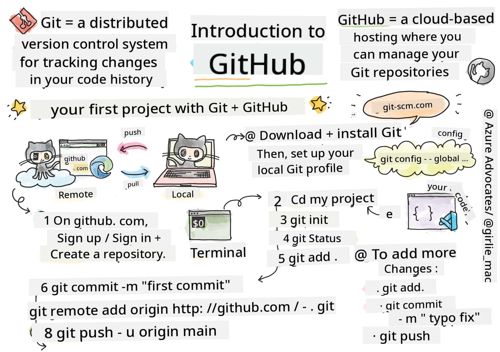
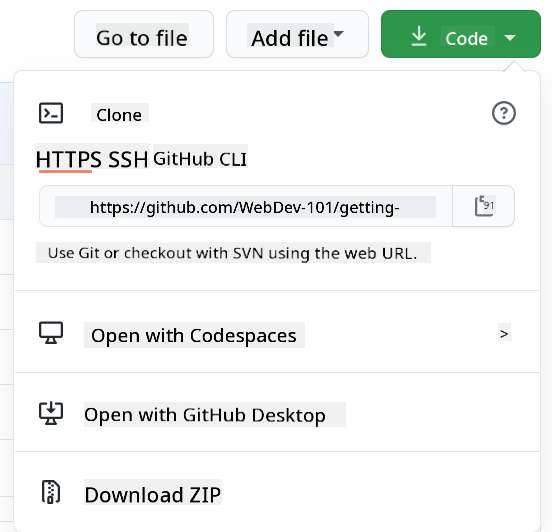

<!--
CO_OP_TRANSLATOR_METADATA:
{
  "original_hash": "361249da70432ddfd4741c917d1a6f50",
  "translation_date": "2025-08-29T13:28:45+00:00",
  "source_file": "1-getting-started-lessons/2-github-basics/README.md",
  "language_code": "en"
}
-->
# Introduction to GitHub

This lesson introduces the basics of GitHub, a platform for hosting and managing changes to your code.


> Sketchnote by [Tomomi Imura](https://twitter.com/girlie_mac)

## Pre-Lecture Quiz
[Pre-lecture quiz](https://ff-quizzes.netlify.app)

## Introduction

In this lesson, we’ll cover:

- Tracking the work you do on your computer
- Collaborating on projects with others
- How to contribute to open-source software

### Prerequisites

Before starting, check if Git is installed. In the terminal, type:  
`git --version`

If Git is not installed, [download Git](https://git-scm.com/downloads). Then, set up your local Git profile in the terminal:
* `git config --global user.name "your-name"`
* `git config --global user.email "your-email"`

To verify if Git is already configured, type:  
`git config --list`

You’ll also need a GitHub account, a code editor (like Visual Studio Code), and access to your terminal (or command prompt).

Go to [github.com](https://github.com/), create an account if you don’t have one, or log in and complete your profile.

✅ GitHub isn’t the only code repository platform out there, but it’s the most well-known.

### Preparation

You’ll need a folder with a code project on your local machine (laptop or PC) and a public repository on GitHub. This will serve as an example for contributing to others’ projects.

---

## Code Management

Let’s say you have a folder on your computer with a code project, and you want to start tracking your progress using Git, the version control system. Some people compare using Git to writing a love letter to your future self. By reading your commit messages days, weeks, or months later, you’ll remember why you made certain decisions or be able to "roll back" changes—if you write good commit messages.

### Task: Create a Repository and Commit Code  

> Watch the video  
> 
> [](https://www.youtube.com/watch?v=9R31OUPpxU4)

1. **Create a repository on GitHub**. On GitHub.com, go to the repositories tab or use the navigation bar in the top-right corner to find the **new repo** button.

   1. Give your repository (folder) a name.
   1. Select **create repository**.

1. **Navigate to your working folder**. In your terminal, switch to the folder (also called a directory) you want to start tracking. Type:

   ```bash
   cd [name of your folder]
   ```

1. **Initialize a Git repository**. In your project, type:

   ```bash
   git init
   ```

1. **Check the status**. To check the status of your repository, type:

   ```bash
   git status
   ```

   The output might look something like this:

   ```output
   Changes not staged for commit:
   (use "git add <file>..." to update what will be committed)
   (use "git checkout -- <file>..." to discard changes in working directory)

        modified:   file.txt
        modified:   file2.txt
   ```

   The `git status` command typically tells you things like which files are ready to be _saved_ to the repository or have changes you might want to keep.

1. **Add all files for tracking**.  
   This is also called staging files or adding files to the staging area.

   ```bash
   git add .
   ```

   The `git add` command with the `.` argument indicates that all your files and changes are being tracked.

1. **Add selected files for tracking**.  

   ```bash
   git add [file or folder name]
   ```

   This allows you to add only specific files to the staging area when you don’t want to commit all files at once.

1. **Unstage all files**.  

   ```bash
   git reset
   ```

   This command unstages all files at once.

1. **Unstage a specific file**.  

   ```bash
   git reset [file or folder name]
   ```

   This command unstages only a specific file that you don’t want to include in the next commit.

1. **Save your work**. At this point, you’ve added the files to a _staging area_, where Git is tracking your files. To make the changes permanent, you need to _commit_ the files. A _commit_ represents a save point in your repository’s history. Type the following to create a _commit_:

   ```bash
   git commit -m "first commit"
   ```

   This commits all your files with the message "first commit." For future commit messages, be more descriptive to explain the type of change you’ve made.

1. **Connect your local Git repository with GitHub**. While a Git repository is useful on your computer, you’ll eventually want to back up your files and collaborate with others. GitHub is a great place for this. Since we’ve already created a repository on GitHub, we just need to connect it to our local Git repository. Use the `git remote add` command. Type:

   > Note: Before typing the command, go to your GitHub repository page to find the repository URL. Replace ```https://github.com/username/repository_name.git``` with your GitHub URL.

   ```bash
   git remote add origin https://github.com/username/repository_name.git
   ```

   This creates a _remote_ connection named "origin" pointing to the GitHub repository you created earlier.

1. **Push local files to GitHub**. Now that you’ve created a connection between your local repository and GitHub, send the files to GitHub using the `git push` command:

   > Note: Your branch name may differ from ```main```.

   ```bash
   git push -u origin main
   ```

   This sends your commits in the "main" branch to GitHub.

2. **Add more changes**. If you want to continue making changes and pushing them to GitHub, use the following three commands:

   ```bash
   git add .
   git commit -m "type your commit message here"
   git push
   ```

   > Tip: Consider using a `.gitignore` file to prevent certain files from being tracked on GitHub, such as personal notes or sensitive data. You can find templates for `.gitignore` files at [.gitignore templates](https://github.com/github/gitignore).

#### Commit Messages

A great Git commit subject line completes the sentence:  
If applied, this commit will <your subject line here>.

For the subject, use the imperative, present tense: "change" instead of "changed" or "changes."  
In the optional body, also use the imperative, present tense. The body should explain the motivation for the change and contrast it with previous behavior. Focus on the `why`, not the `how`.

✅ Take a few minutes to explore GitHub. Can you find an excellent commit message? How about a very minimal one? What information do you think is most important to include in a commit message?

### Task: Collaborate

The main reason for using GitHub is to collaborate with other developers.

## Working on Projects with Others

> Watch the video  
>
> [](https://www.youtube.com/watch?v=bFCM-PC3cu8)

In your repository, go to `Insights > Community` to see how your project compares to recommended community standards.

Here are some ways to improve your GitHub repository:
- **Description**: Did you add a description for your project?
- **README**: Did you include a README? GitHub provides guidance for writing a [README](https://docs.github.com/articles/about-readmes/?WT.mc_id=academic-77807-sagibbon).
- **Contributing Guidelines**: Does your project have [contributing guidelines](https://docs.github.com/articles/setting-guidelines-for-repository-contributors/?WT.mc_id=academic-77807-sagibbon)?
- **Code of Conduct**: Does it include a [Code of Conduct](https://docs.github.com/articles/adding-a-code-of-conduct-to-your-project/)?
- **License**: Perhaps most importantly, does it have a [license](https://docs.github.com/articles/adding-a-license-to-a-repository/)?

These resources help onboard new team members. They’re often the first things new contributors look at before even reviewing your code to decide if your project is worth their time.

✅ README files, though time-consuming to prepare, are often overlooked by busy maintainers. Can you find an example of a particularly detailed one? Note: There are [tools to help create good READMEs](https://www.makeareadme.com/) that you might want to try.

### Task: Merge Some Code

Contributing documentation helps people contribute to your project. It explains what types of contributions you’re looking for and how the process works. Contributors will need to follow these steps to contribute to your GitHub repository:

1. **Fork your repository**. Contributors will likely _fork_ your project, creating a copy of your repository on their GitHub profile.
1. **Clone**. They’ll then clone the project to their local machine.
1. **Create a branch**. Ask them to create a _branch_ for their work.
1. **Focus on one area**. Encourage contributors to focus on one change at a time. This increases the likelihood of successfully merging their work. For example, if they fix a bug, add a feature, and update tests all at once, it might be harder to merge only part of their work.

✅ Think of situations where branches are essential for writing and shipping good code. What use cases come to mind?

> Note: Be the change you want to see in the world—create branches for your own work too. Any commits you make will be on the branch you’re currently “checked out” to. Use `git status` to see which branch you’re on.

Let’s go through a contributor workflow. Assume the contributor has already _forked_ and _cloned_ the repository, so they have a Git repository ready to work on locally:

1. **Create a branch**. Use the `git branch` command to create a branch for the changes they want to contribute:

   ```bash
   git branch [branch-name]
   ```

1. **Switch to the working branch**. Switch to the specified branch and update the working directory with `git switch`:

   ```bash
   git switch [branch-name]
   ```

1. **Do the work**. Add your changes. Don’t forget to tell Git about them using the following commands:

   ```bash
   git add .
   git commit -m "my changes"
   ```

   Make sure to give your commit a meaningful name for your benefit and the repository maintainer.

1. **Merge your work with the `main` branch**. When you’re done working, you’ll want to merge your changes with the `main` branch. Since the `main` branch might have changed in the meantime, update it first with the following commands:

   ```bash
   git switch main
   git pull
   ```

   To ensure any _conflicts_ (situations where Git can’t easily combine changes) are resolved in your working branch, run the following commands:

   ```bash
   git switch [branch_name]
   git merge main
   ```

   This brings all changes from `main` into your branch. If there are conflicts, VS Code will highlight them so you can resolve them.

1. **Push your work to GitHub**. Pushing your work to GitHub involves two steps: pushing your branch to your repository and opening a Pull Request (PR).

   ```bash
   git push --set-upstream origin [branch-name]
   ```

   The above command creates the branch on your forked repository.

1. **Open a PR**. Navigate to your forked repository on GitHub. You’ll see an option to create a new PR. Click it, and you’ll be taken to an interface where you can edit the commit message title and add a description. The maintainer of the original repository will review your PR and, hopefully, merge it. Congratulations, you’re now a contributor!

1. **Clean up**. After successfully merging a PR, it’s good practice to clean up. Delete the local branch with the following command:

   ```bash
   git branch -d [branch-name]
   ```

   Then, go to the GitHub page for your forked repository and delete the remote branch you pushed.
`Pull request` might sound like a strange term since what you're actually doing is pushing your changes to the project. However, the maintainer (project owner) or core team needs to review your changes before merging them into the project's "main" branch. Essentially, you're requesting the maintainer's approval for your changes.

A pull request is where you can compare and discuss the differences introduced in a branch, with reviews, comments, integrated tests, and more. A good pull request follows similar principles to a well-written commit message. You can also reference an issue in the issue tracker, for example, if your work resolves a specific issue. To do this, use a `#` followed by the issue number, like `#97`.

🤞Here’s hoping all checks pass and the project owner(s) merge your changes into the project!🤞

Update your current local working branch with all the latest commits from the corresponding remote branch on GitHub:

`git pull`

## How to contribute to open source

First, find a repository (or **repo**) on GitHub that interests you and to which you'd like to contribute. You'll need to copy its contents to your local machine.

✅ A great way to find 'beginner-friendly' repositories is to [search for the tag 'good-first-issue'](https://github.blog/2020-01-22-browse-good-first-issues-to-start-contributing-to-open-source/).



There are several ways to copy code. One common method is to "clone" the repository using HTTPS, SSH, or the GitHub CLI (Command Line Interface).

Open your terminal and clone the repository like this:
`git clone https://github.com/ProjectURL`

To start working on the project, navigate to the correct folder:
`cd ProjectURL`

You can also open the entire project using [Codespaces](https://github.com/features/codespaces), GitHub's built-in code editor and cloud development environment, or [GitHub Desktop](https://desktop.github.com/).

Alternatively, you can download the code as a zipped folder.

### A few more interesting things about GitHub

You can star, watch, and/or "fork" any public repository on GitHub. Your starred repositories can be found in the drop-down menu in the top-right corner. Think of it as bookmarking, but for code.

Projects typically have an issue tracker, usually found in the "Issues" tab on GitHub unless stated otherwise. This is where people discuss problems or ideas related to the project. The Pull Requests tab is where discussions and reviews of ongoing changes take place.

Some projects may also have forums, mailing lists, or chat channels like Slack, Discord, or IRC for discussions.

✅ Explore your new GitHub repository and try out a few features, like editing settings, adding information to your repo, or creating a project (such as a Kanban board). There's a lot to discover!

---

## 🚀 Challenge 

Team up with a friend to work on each other's code. Create a project together, fork code, create branches, and merge changes.

## Post-Lecture Quiz
[Post-lecture quiz](https://ff-quizzes.netlify.app/web/en/)

## Review & Self Study

Read more about [contributing to open source software](https://opensource.guide/how-to-contribute/#how-to-submit-a-contribution).

[Git cheatsheet](https://training.github.com/downloads/github-git-cheat-sheet/).

Practice makes perfect! GitHub offers excellent learning paths at [skills.github.com](https://skills.github.com):

- [First Week on GitHub](https://skills.github.com/#first-week-on-github)

You can also find more advanced courses there.

## Assignment 

Complete [the First Week on GitHub course](https://skills.github.com/#first-week-on-github)

---

**Disclaimer**:  
This document has been translated using the AI translation service [Co-op Translator](https://github.com/Azure/co-op-translator). While we strive for accuracy, please note that automated translations may contain errors or inaccuracies. The original document in its native language should be regarded as the authoritative source. For critical information, professional human translation is recommended. We are not responsible for any misunderstandings or misinterpretations resulting from the use of this translation.