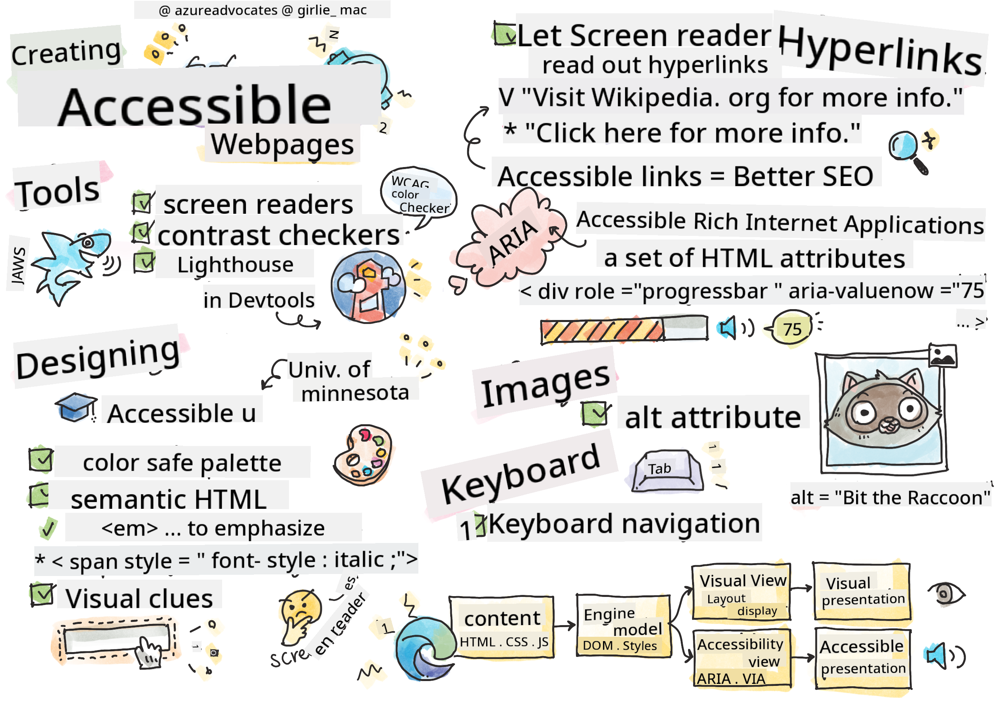

<!--
CO_OP_TRANSLATOR_METADATA:
{
  "original_hash": "e4cd5b1faed4adab5acf720f82798003",
  "translation_date": "2025-08-28T12:01:07+00:00",
  "source_file": "1-getting-started-lessons/3-accessibility/README.md",
  "language_code": "en"
}
-->
# Creating Accessible Webpages


> Sketchnote by [Tomomi Imura](https://twitter.com/girlie_mac)

## Pre-Lecture Quiz
[Pre-lecture quiz](https://ff-quizzes.netlify.app/web/quiz/5)

> The power of the Web is in its universality. Access by everyone regardless of disability is an essential aspect.
>
> \- Sir Timothy Berners-Lee, W3C Director and inventor of the World Wide Web

This quote perfectly captures the importance of building accessible websites. An application that excludes certain users is inherently discriminatory. As web developers, we should always prioritize accessibility. By focusing on it from the start, you'll be well on your way to ensuring everyone can access the pages you create. In this lesson, you'll learn about tools that can help you ensure your web assets are accessible and how to design with accessibility in mind.

> You can take this lesson on [Microsoft Learn](https://docs.microsoft.com/learn/modules/web-development-101/accessibility/?WT.mc_id=academic-77807-sagibbon)!

## Tools to use

### Screen readers

Screen readers are one of the most widely known accessibility tools.

[Screen readers](https://en.wikipedia.org/wiki/Screen_reader) are commonly used by individuals with vision impairments. While we spend time ensuring browsers display information correctly, we must also ensure screen readers convey the same information effectively.

At their core, screen readers audibly read a page from top to bottom. If your page is entirely text, the reader will present the information similarly to a browser. However, web pages often include links, images, colors, and other visual elements. Care must be taken to ensure this information is interpreted correctly by a screen reader.

Every web developer should familiarize themselves with screen readers. Just as you understand how browsers work, you should learn how screen readers operate. Fortunately, most operating systems come with built-in screen readers.

Some browsers also offer built-in tools and extensions that can read text aloud or provide basic navigation features, such as [these accessibility-focused Edge browser tools](https://support.microsoft.com/help/4000734/microsoft-edge-accessibility-features). While these tools are useful, they function differently from screen readers and should not be mistaken for screen reader testing tools.

✅ Try a screen reader and browser text reader. On Windows, [Narrator](https://support.microsoft.com/windows/complete-guide-to-narrator-e4397a0d-ef4f-b386-d8ae-c172f109bdb1/?WT.mc_id=academic-77807-sagibbon) is included by default, and [JAWS](https://webaim.org/articles/jaws/) and [NVDA](https://www.nvaccess.org/about-nvda/) can also be installed. On macOS and iOS, [VoiceOver](https://support.apple.com/guide/voiceover/welcome/10) is installed by default.

### Zoom

Zooming is another tool frequently used by individuals with vision impairments. The simplest form of zooming is static zoom, controlled via `Control + plus sign (+)` or by lowering screen resolution. This type of zoom resizes the entire page, so using [responsive design](https://developer.mozilla.org/docs/Learn/CSS/CSS_layout/Responsive_Design) is crucial for providing a good user experience at higher zoom levels.

Another type of zoom uses specialized software to magnify specific areas of the screen and pan, similar to using a physical magnifying glass. On Windows, [Magnifier](https://support.microsoft.com/windows/use-magnifier-to-make-things-on-the-screen-easier-to-see-414948ba-8b1c-d3bd-8615-0e5e32204198) is built in, while [ZoomText](https://www.freedomscientific.com/training/zoomtext/getting-started/) is a third-party magnification tool with more features and a larger user base. Both macOS and iOS include built-in magnification software called [Zoom](https://www.apple.com/accessibility/mac/vision/).

### Contrast checkers

Colors on websites must be chosen carefully to accommodate users with color blindness or difficulty seeing low-contrast colors.

✅ Test a website you enjoy using for its color choices with a browser extension like [WCAG's color checker](https://microsoftedge.microsoft.com/addons/detail/wcag-color-contrast-check/idahaggnlnekelhgplklhfpchbfdmkjp?hl=en-US&WT.mc_id=academic-77807-sagibbon). What do you learn?

### Lighthouse

Your browser's developer tools include the Lighthouse tool, which provides an initial analysis of a website's accessibility (along with other metrics). While you shouldn't rely solely on Lighthouse, achieving a 100% score is a helpful starting point.

✅ Locate Lighthouse in your browser's developer tools and run an analysis on any site. What do you discover?

## Designing for accessibility

Accessibility is a broad topic, but there are many resources available to help you.

- [Accessible U - University of Minnesota](https://accessibility.umn.edu/your-role/web-developers)

While we can't cover every aspect of creating accessible sites, here are some key principles to implement. Designing an accessible page from the beginning is **always** easier than retrofitting an existing page.

## Good display principles

### Color safe palettes

People perceive colors differently. When choosing a color scheme for your site, ensure it's accessible to all. A great [tool for generating color palettes is Color Safe](http://colorsafe.co/).

✅ Identify a website with problematic color usage. Why is it problematic?

### Use the correct HTML

CSS and JavaScript can make any element look like any type of control. For example, `<span>` could be styled to resemble a `<button>`, and `<b>` could mimic a hyperlink. While this might seem convenient for styling, it provides no context to screen readers. Always use the appropriate HTML for controls. If you need a hyperlink, use `<a>`. Using the correct HTML for each control is called Semantic HTML.

✅ Visit a website and check if the designers and developers are using HTML correctly. Can you find a button that should be a link? Hint: Right-click and select 'View Page Source' in your browser to examine the underlying code.

### Create a descriptive heading hierarchy

Screen reader users [rely heavily on headings](https://webaim.org/projects/screenreadersurvey8/#finding) to locate information and navigate pages. Writing descriptive headings and using semantic heading tags are essential for creating a site that's easy to navigate for screen reader users.

### Use good visual clues

CSS allows complete control over the appearance of elements on a page. You can create text boxes without outlines or hyperlinks without underlines. However, removing these visual cues can make it harder for users who depend on them to identify controls.

## The importance of link text

Hyperlinks are fundamental to web navigation. Ensuring screen readers can interpret links properly allows all users to navigate your site.

### Screen readers and links

Screen readers read link text just like any other text on the page. At first glance, the examples below might seem acceptable:

> The little penguin, sometimes known as the fairy penguin, is the smallest penguin in the world. [Click here](https://en.wikipedia.org/wiki/Little_penguin) for more information.

> The little penguin, sometimes known as the fairy penguin, is the smallest penguin in the world. Visit https://en.wikipedia.org/wiki/Little_penguin for more information.

> **NOTE** As you'll see, you should **never** create links like the examples above.

Screen readers are a different interface from browsers, with unique features.

### The problem with using the URL

Screen readers read text aloud. If a URL appears in the text, the screen reader will read the URL, which often doesn't convey meaningful information and can sound unpleasant. You may have experienced this if your phone has ever read a text message with a URL.

### The problem with "click here"

Screen readers can read only the hyperlinks on a page, similar to how sighted users scan for links. If all link text is "click here," the user will hear "click here, click here, click here..." making the links indistinguishable.

### Good link text

Good link text briefly describes the destination of the link. In the example about little penguins, the link leads to the Wikipedia page about the species. The phrase *little penguins* would be ideal link text, as it clearly indicates what the user will learn by clicking.

> The [little penguin](https://en.wikipedia.org/wiki/Little_penguin), sometimes known as the fairy penguin, is the smallest penguin in the world.

✅ Browse the web for a few minutes to find pages with unclear link strategies. Compare them to sites with better link practices. What do you learn?

#### Search engine notes

Using accessible link text also benefits search engines, as they use link text to understand page topics. Good link text helps everyone!

### ARIA

Consider the following page:

| Product      | Description        | Order        |
| ------------ | ------------------ | ------------ |
| Widget       | [Description](../../../../1-getting-started-lessons/3-accessibility/') | [Order](../../../../1-getting-started-lessons/3-accessibility/') |
| Super widget | [Description](../../../../1-getting-started-lessons/3-accessibility/') | [Order](../../../../1-getting-started-lessons/3-accessibility/') |

For browser users, repeating "description" and "order" makes sense. However, screen reader users would only hear "description" and "order" repeatedly without context.

To address this, HTML includes [Accessible Rich Internet Applications (ARIA)](https://developer.mozilla.org/docs/Web/Accessibility/ARIA) attributes, which provide additional information to screen readers.

> **NOTE**: Browser and screen reader support for ARIA may vary, but most mainstream clients support ARIA attributes.

You can use `aria-label` to describe links when the page format doesn't allow for clear text. For example, the description for "widget" could be set as:

``` html
<a href="#" aria-label="Widget description">description</a>
```

✅ Generally, using Semantic HTML as described earlier is preferable to ARIA, but ARIA is useful when no semantic equivalent exists (e.g., for a tree structure). The [MDN documentation on ARIA](https://developer.mozilla.org/docs/Web/Accessibility/ARIA) offers more details.

```html
<h2 id="tree-label">File Viewer</h2>
<div role="tree" aria-labelledby="tree-label">
  <div role="treeitem" aria-expanded="false" tabindex="0">Uploads</div>
</div>
```

## Images

Screen readers cannot automatically interpret images. Making images accessible is simple—use the `alt` attribute to describe them. All meaningful images should have an `alt` attribute. Decorative images should have an empty `alt` attribute: `alt=""`. This prevents screen readers from announcing unnecessary decorative images.

✅ Search engines also rely on alt text to understand images. Once again, making your page accessible has additional benefits!

## The keyboard

Some users cannot use a mouse or trackpad and rely on keyboard navigation to move between elements. Your website should present content in a logical order so keyboard users can access interactive elements sequentially. Building pages with semantic markup and styling them with CSS should make your site keyboard-navigable, but it's important to test this manually. Learn more about [keyboard navigation strategies](https://webaim.org/techniques/keyboard/).

✅ Visit a website and try navigating it using only your keyboard. What works? What doesn't? Why?

## Summary

A web that's accessible to only some is not truly a "world-wide web." The best way to ensure your sites are accessible is to incorporate accessibility best practices from the start. While it requires extra effort, adopting these practices now will ensure all your future pages are accessible.

---

## 🚀 Challenge

Take this HTML and rewrite it to be as accessible as possible, using the strategies you've learned.

```html
<!DOCTYPE html>
<html>
  <head>
    <title>
      Example
    </title>
    <link href='../assets/style.css' rel='stylesheet' type='text/css'>
  </head>
  <body>
    <div class="site-header">
      <p class="site-title">Turtle Ipsum</p>
      <p class="site-subtitle">The World's Premier Turtle Fan Club</p>
    </div>
    <div class="main-nav">
      <p class="nav-header">Resources</p>
      <div class="nav-list">
        <p class="nav-item nav-item-bull"><a href="https://www.youtube.com/watch?v=CMNry4PE93Y">"I like turtles"</a></p>
        <p class="nav-item nav-item-bull"><a href="https://en.wikipedia.org/wiki/Turtle">Basic Turtle Info</a></p>
        <p class="nav-item nav-item-bull"><a href="https://en.wikipedia.org/wiki/Turtles_(chocolate)">Chocolate Turtles</a></p>
      </div>
    </div>
    <div class="main-content">
      <div>
        <p class="page-title">Welcome to Turtle Ipsum. 
            <a href="">Click here</a> to learn more.
        </p>
        <p class="article-text">
          Turtle ipsum dolor sit amet, consectetur adipiscing elit, sed do eiusmod tempor incididunt ut labore et dolore magna aliqua. Ut enim ad minim veniam, quis nostrud exercitation ullamco laboris nisi ut aliquip ex ea commodo consequat. Duis aute irure dolor in reprehenderit in voluptate velit esse cillum dolore eu fugiat nulla pariatur. Excepteur sint occaecat cupidatat non proident, sunt in culpa qui officia deserunt mollit anim id est laborum
        </p>
      </div>
    </div>
    <div class="footer">
      <div class="footer-section">
        <span class="button">Sign up for turtle news</span>
      </div><div class="footer-section">
        <p class="nav-header footer-title">
          Internal Pages
        </p>
        <div class="nav-list">
          <p class="nav-item nav-item-bull"><a href="../">Index</a></p>
          <p class="nav-item nav-item-bull"><a href="../semantic">Semantic Example</a></p>
        </div>
      </div>
      <p class="footer-copyright">&copy; 2016 Instrument</span>
    </div>
  </body>
</html>
```

## Post-Lecture Quiz
[Post-lecture quiz](https://ff-quizzes.netlify.app/web/quiz/6)

## Review & Self Study
Many governments have laws regarding accessibility requirements. Familiarize yourself with the accessibility laws in your country. What aspects are included, and what are not? An example is [this government web site](https://accessibility.blog.gov.uk/).

## Assignment

[Analyze a non-accessible web site](assignment.md)

Credits: [Turtle Ipsum](https://github.com/Instrument/semantic-html-sample) by Instrument

---

**Disclaimer**:  
This document has been translated using the AI translation service [Co-op Translator](https://github.com/Azure/co-op-translator). While we aim for accuracy, please note that automated translations may include errors or inaccuracies. The original document in its native language should be regarded as the authoritative source. For critical information, professional human translation is advised. We are not responsible for any misunderstandings or misinterpretations resulting from the use of this translation.