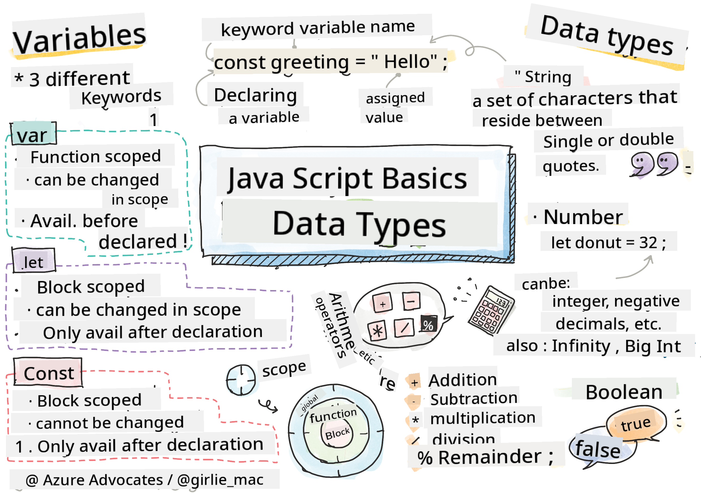

<!--
CO_OP_TRANSLATOR_METADATA:
{
  "original_hash": "b95fdd8310ef467305015ece1b0f9411",
  "translation_date": "2025-08-29T13:23:20+00:00",
  "source_file": "2-js-basics/1-data-types/README.md",
  "language_code": "en"
}
-->
# JavaScript Basics: Data Types


> Sketchnote by [Tomomi Imura](https://twitter.com/girlie_mac)

## Pre-Lecture Quiz
[Pre-lecture quiz](https://ff-quizzes.netlify.app/web/)

This lesson introduces the basics of JavaScript, the language that makes websites interactive.

> You can follow this lesson on [Microsoft Learn](https://docs.microsoft.com/learn/modules/web-development-101-variables/?WT.mc_id=academic-77807-sagibbon)!

[](https://youtube.com/watch?v=JNIXfGiDWM8 "Variables in JavaScript")

[](https://youtube.com/watch?v=AWfA95eLdq8 "Data Types in JavaScript")

> 🎥 Click the images above to watch videos about variables and data types.

Let’s dive into variables and the data types they can hold!

## Variables

Variables are used to store values that can be accessed and modified throughout your code.

To **declare** a variable, use the syntax **[keyword] [name]**. This consists of two parts:

- **Keyword**. The keywords `let` or `var` can be used.  

✅ The `let` keyword, introduced in ES6, provides _block scope_ for your variable. It’s recommended to use `let` instead of `var`. We’ll explore block scopes in more detail later.
- **Variable name**, which is a name you choose.

### Task - Working with Variables

1. **Declare a variable**. Use the `let` keyword to declare a variable:

    ```javascript
    let myVariable;
    ```

   Here, `myVariable` is declared using the `let` keyword but doesn’t yet have a value.

1. **Assign a value**. Use the `=` operator to assign a value to the variable:

    ```javascript
    myVariable = 123;
    ```

   > Note: In this lesson, the `=` operator is used as an "assignment operator" to assign a value to a variable. It does not represent equality.

   Now, `myVariable` is *initialized* with the value 123.

1. **Refactor**. Replace your code with the following statement:

    ```javascript
    let myVariable = 123;
    ```

    This is called _explicit initialization_, where a variable is declared and assigned a value at the same time.

1. **Change the variable value**. Update the variable’s value like this:

   ```javascript
   myVariable = 321;
   ```

   Once a variable is declared, you can change its value at any point in your code using the `=` operator and the new value.

   ✅ Try it! You can write JavaScript directly in your browser. Open Developer Tools, go to the console, and type `let myVariable = 123`. Press Enter, then type `myVariable`. What happens? You’ll learn more about these concepts in upcoming lessons.

## Constants

Declaring and initializing a constant is similar to a variable, but you use the `const` keyword. Constants are often written in uppercase letters.

```javascript
const MY_VARIABLE = 123;
```

Constants are like variables, but with two key differences:

- **Must have a value**. A constant must be initialized, or an error will occur when the code runs.
- **Reference cannot be changed**. Once initialized, the reference of a constant cannot be changed, or an error will occur. Let’s look at some examples:
   - **Simple value**. The following is NOT allowed:
   
      ```javascript
      const PI = 3;
      PI = 4; // not allowed
      ```
 
   - **Object reference is protected**. The following is NOT allowed:
   
      ```javascript
      const obj = { a: 3 };
      obj = { b: 5 } // not allowed
      ```

    - **Object value is not protected**. The following IS allowed:
    
      ```javascript
      const obj = { a: 3 };
      obj.a = 5;  // allowed
      ```

      In this case, you’re changing the object’s value, not its reference, so it’s allowed.

   > Note: A `const` protects the reference from reassignment. However, the value itself is not _immutable_ and can change, especially for complex constructs like objects.

## Data Types

Variables can hold different types of values, such as numbers or text. These types of values are called **data types**. Understanding data types is crucial in software development because it helps determine how code should be written and how the program should behave. Additionally, some data types have unique features that allow you to manipulate or extract information from a value.

✅ Data types are also known as JavaScript data primitives, as they are the most basic data types provided by the language. There are 7 primitive data types: string, number, bigint, boolean, undefined, null, and symbol. Take a moment to think about what each of these represents. What is a `zebra`? How about `0`? `true`?

### Numbers

In the earlier example, the value of `myVariable` was a number data type.

`let myVariable = 123;`

Variables can store all kinds of numbers, including decimals and negative numbers. Numbers can also be used with arithmetic operators, which we’ll cover in the [next section](../../../../2-js-basics/1-data-types).

### Arithmetic Operators

JavaScript provides several operators for performing arithmetic operations. Here are some examples:

| Symbol | Description                                                              | Example                          |
| ------ | ------------------------------------------------------------------------ | -------------------------------- |
| `+`    | **Addition**: Adds two numbers                                           | `1 + 2 //expected answer is 3`   |
| `-`    | **Subtraction**: Subtracts one number from another                       | `1 - 2 //expected answer is -1`  |
| `*`    | **Multiplication**: Multiplies two numbers                               | `1 * 2 //expected answer is 2`   |
| `/`    | **Division**: Divides one number by another                              | `1 / 2 //expected answer is 0.5` |
| `%`    | **Remainder**: Finds the remainder of a division                         | `1 % 2 //expected answer is 1`   |

✅ Try it! Test an arithmetic operation in your browser’s console. Were the results what you expected?

### Strings

Strings are sequences of characters enclosed in single or double quotes.

- `'This is a string'`
- `"This is also a string"`
- `let myString = 'This is a string value stored in a variable';`

Always use quotes when writing a string; otherwise, JavaScript will interpret it as a variable name.

### Formatting Strings

Strings are textual and often need formatting.

To **concatenate** (join) two or more strings, use the `+` operator.

```javascript
let myString1 = "Hello";
let myString2 = "World";

myString1 + myString2 + "!"; //HelloWorld!
myString1 + " " + myString2 + "!"; //Hello World!
myString1 + ", " + myString2 + "!"; //Hello, World!

```

✅ Why does `1 + 1 = 2` in JavaScript, but `'1' + '1' = 11`? Think about it. What about `'1' + 1`?

**Template literals** offer another way to format strings. Instead of quotes, use backticks. Place anything that isn’t plain text inside `${ }`, including variables.

```javascript
let myString1 = "Hello";
let myString2 = "World";

`${myString1} ${myString2}!` //Hello World!
`${myString1}, ${myString2}!` //Hello, World!
```

Both methods work, but template literals preserve spaces and line breaks.

✅ When would you use a template literal instead of a plain string?

### Booleans

Booleans have only two possible values: `true` or `false`. They are useful for making decisions about which parts of the code should execute under certain conditions. Often, [operators](../../../../2-js-basics/1-data-types) are used to set Boolean values, and you’ll frequently see variables being initialized or updated with an operator.

- `let myTrueBool = true`
- `let myFalseBool = false`

✅ A variable is considered 'truthy' if it evaluates to `true`. Interestingly, in JavaScript, [all values are truthy unless explicitly defined as falsy](https://developer.mozilla.org/docs/Glossary/Truthy).

---

## 🚀 Challenge

JavaScript is known for its quirky behavior with data types. Research some of these 'gotchas'. For example: case sensitivity can be tricky! Try this in your console: `let age = 1; let Age = 2; age == Age` (it resolves to `false`—why?). What other surprises can you find?

## Post-Lecture Quiz
[Post-lecture quiz](https://ff-quizzes.netlify.app)

## Review & Self Study

Check out [this list of JavaScript exercises](https://css-tricks.com/snippets/javascript/) and try one. What did you learn?

## Assignment

[Data Types Practice](assignment.md)

---

**Disclaimer**:  
This document has been translated using the AI translation service [Co-op Translator](https://github.com/Azure/co-op-translator). While we strive for accuracy, please note that automated translations may contain errors or inaccuracies. The original document in its native language should be regarded as the authoritative source. For critical information, professional human translation is recommended. We are not responsible for any misunderstandings or misinterpretations resulting from the use of this translation.