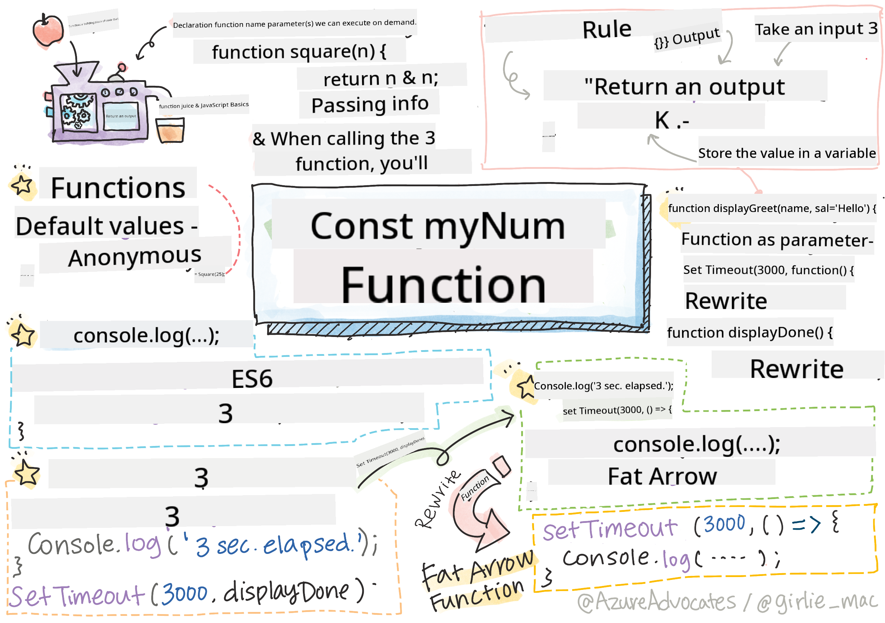

<!--
CO_OP_TRANSLATOR_METADATA:
{
  "original_hash": "b4612bbb9ace984f374fcc80e3e035ad",
  "translation_date": "2025-08-28T11:39:31+00:00",
  "source_file": "2-js-basics/2-functions-methods/README.md",
  "language_code": "en"
}
-->
# JavaScript Basics: Methods and Functions


> Sketchnote by [Tomomi Imura](https://twitter.com/girlie_mac)

## Pre-Lecture Quiz
[Pre-lecture quiz](https://ashy-river-0debb7803.1.azurestaticapps.net/quiz/9)

When writing code, it's important to prioritize readability. While it may seem counterintuitive, code is read far more often than it is written. One essential tool in a developer's toolkit for creating maintainable code is the **function**.

[](https://youtube.com/watch?v=XgKsD6Zwvlc "Methods and Functions")

> 🎥 Click the image above for a video about methods and functions.

> You can take this lesson on [Microsoft Learn](https://docs.microsoft.com/learn/modules/web-development-101-functions/?WT.mc_id=academic-77807-sagibbon)!

## Functions

At its core, a function is a block of code that can be executed whenever needed. This is especially useful when you need to perform the same task multiple times. Instead of duplicating the logic in several places (which would make updates difficult), you can centralize it in one location and call it whenever necessary. You can even call functions from within other functions!

Equally important is the ability to name a function. While this might seem minor, the name serves as a quick way to document what the code does. Think of it like a label on a button. If you see a button labeled "Cancel timer," you immediately know it will stop the clock.

## Creating and Calling a Function

The syntax for creating a function looks like this:

```javascript
function nameOfFunction() { // function definition
 // function definition/body
}
```

For example, if you wanted to create a function to display a greeting, it might look like this:

```javascript
function displayGreeting() {
  console.log('Hello, world!');
}
```

To call (or invoke) the function, you use its name followed by `()`. It's worth noting that the function can be defined either before or after you call it; the JavaScript compiler will locate it for you.

```javascript
// calling our function
displayGreeting();
```

> **NOTE:** There is a special type of function called a **method**, which you've already been using! For instance, in the example above, we used `console.log`. The difference between a method and a function is that a method is attached to an object (like `console` in this case), while a function is standalone. However, many developers use these terms interchangeably.

### Best Practices for Functions

Here are some best practices to keep in mind when creating functions:

- Always use descriptive names so it's clear what the function does.
- Use **camelCasing** to combine words.
- Keep your functions focused on a specific task.

## Passing Information to a Function

To make a function more versatile, you can pass information into it. For example, the `displayGreeting` function above only displays **Hello, world!**, which isn't very flexible. To make it more useful, you can allow the user to specify the name of the person being greeted by adding a **parameter**. A parameter (sometimes called an **argument**) is additional information passed to a function.

Parameters are listed in the function definition inside parentheses and are separated by commas, like this:

```javascript
function name(param, param2, param3) {

}
```

We can update the `displayGreeting` function to accept a name and display it.

```javascript
function displayGreeting(name) {
  const message = `Hello, ${name}!`;
  console.log(message);
}
```

When calling the function, you pass the parameter inside the parentheses.

```javascript
displayGreeting('Christopher');
// displays "Hello, Christopher!" when run
```

## Default Values

You can make a function even more flexible by adding additional parameters. But what if you don't want to require every parameter to be specified? For example, in the greeting function, you might want the name to be required (since you need to know who you're greeting), but allow the greeting itself to be optional. If no custom greeting is provided, you can use a default value. To set a default value for a parameter, you assign it just like you would a variable: `parameterName = 'defaultValue'`. Here's a complete example:

```javascript
function displayGreeting(name, salutation='Hello') {
  console.log(`${salutation}, ${name}`);
}
```

When calling the function, you can decide whether or not to provide a value for `salutation`.

```javascript
displayGreeting('Christopher');
// displays "Hello, Christopher"

displayGreeting('Christopher', 'Hi');
// displays "Hi, Christopher"
```

## Return Values

So far, the functions we've created always output to the [console](https://developer.mozilla.org/docs/Web/API/console). This is fine for some cases, especially when calling other services. But what if you want a function to perform a calculation and return the result so you can use it elsewhere?

This is where **return values** come in. A return value is sent back by the function and can be stored in a variable, just like a string or number.

If a function returns something, the `return` keyword is used. The `return` keyword expects a value or reference to return, like this:

```javascript
return myVariable;
```  

For example, you could create a function that generates a greeting message and returns it to the caller:

```javascript
function createGreetingMessage(name) {
  const message = `Hello, ${name}`;
  return message;
}
```

When calling this function, you can store the returned value in a variable, just like assigning a static value (e.g., `const name = 'Christopher'`).

```javascript
const greetingMessage = createGreetingMessage('Christopher');
```

## Functions as Parameters for Functions

As you advance in programming, you'll encounter functions that accept other functions as parameters. This is especially useful when you don't know exactly when something will happen, but you know you need to perform an action in response.

For example, consider [setTimeout](https://developer.mozilla.org/docs/Web/API/WindowOrWorkerGlobalScope/setTimeout), which starts a timer and executes code when the timer ends. You need to specify what code to execute, which is a perfect use case for a function!

If you run the code below, you'll see the message **3 seconds has elapsed** after 3 seconds.

```javascript
function displayDone() {
  console.log('3 seconds has elapsed');
}
// timer value is in milliseconds
setTimeout(displayDone, 3000);
```

### Anonymous Functions

Take another look at the example above. We're creating a function with a name that will only be used once. As applications grow more complex, you might find yourself creating many one-time-use functions. This isn't ideal. Fortunately, you don't always need to give a function a name!

When passing a function as a parameter, you can create it directly within the parameter. This is called an anonymous function. You use the `function` keyword, but you don't assign a name.

Here's the previous example rewritten with an anonymous function:

```javascript
setTimeout(function() {
  console.log('3 seconds has elapsed');
}, 3000);
```

If you run this code, you'll get the same result. The function is created without a name!

### Fat Arrow Functions

Many programming languages, including JavaScript, offer a shortcut called **arrow functions** or **fat arrow functions**. These use the `=>` symbol, which looks like an arrow. By using `=>`, you can skip the `function` keyword.

Let's rewrite the example one more time using a fat arrow function:

```javascript
setTimeout(() => {
  console.log('3 seconds has elapsed');
}, 3000);
```

### When to Use Each Approach

Now that you've seen three ways to pass a function as a parameter, you might wonder when to use each. If you plan to reuse the function, define it normally. If it's only needed in one place, an anonymous function is usually best. Whether you use a fat arrow function or the traditional `function` syntax is up to you, but most modern developers prefer `=>`.

---

## 🚀 Challenge

Can you explain the difference between functions and methods in one sentence? Give it a try!

## Post-Lecture Quiz
[Post-lecture quiz](https://ashy-river-0debb7803.1.azurestaticapps.net/quiz/10)

## Review & Self Study

It's a good idea to [read more about arrow functions](https://developer.mozilla.org/docs/Web/JavaScript/Reference/Functions/Arrow_functions), as they are increasingly common in modern codebases. Practice writing a function and then rewriting it using this syntax.

## Assignment

[Fun with Functions](assignment.md)

---

**Disclaimer**:  
This document has been translated using the AI translation service [Co-op Translator](https://github.com/Azure/co-op-translator). While we aim for accuracy, please note that automated translations may include errors or inaccuracies. The original document in its native language should be regarded as the authoritative source. For critical information, professional human translation is advised. We are not responsible for any misunderstandings or misinterpretations resulting from the use of this translation.