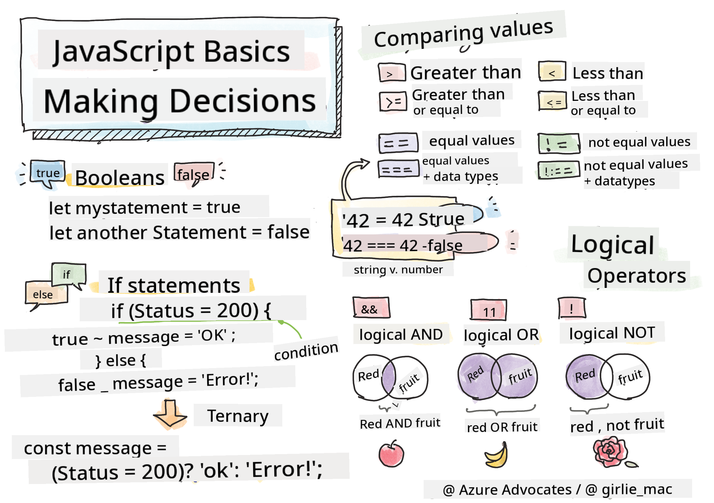

<!--
CO_OP_TRANSLATOR_METADATA:
{
  "original_hash": "888609c48329c280ca2477d2df40f2e5",
  "translation_date": "2025-08-28T11:40:43+00:00",
  "source_file": "2-js-basics/3-making-decisions/README.md",
  "language_code": "en"
}
-->
# JavaScript Basics: Making Decisions



> Sketchnote by [Tomomi Imura](https://twitter.com/girlie_mac)

## Pre-Lecture Quiz

[Pre-lecture quiz](https://ashy-river-0debb7803.1.azurestaticapps.net/quiz/11)

Making decisions and controlling the flow of your code makes it reusable and reliable. This section explains the syntax for managing data flow in JavaScript and its importance when working with Boolean data types.

[](https://youtube.com/watch?v=SxTp8j-fMMY "Making Decisions")

> 🎥 Click the image above to watch a video about making decisions.

> You can explore this lesson on [Microsoft Learn](https://docs.microsoft.com/learn/modules/web-development-101-if-else/?WT.mc_id=academic-77807-sagibbon)!

## A Brief Recap on Booleans

Booleans can only have two values: `true` or `false`. They are used to decide which lines of code should execute when certain conditions are met.

You can set a Boolean value like this:

`let myTrueBool = true`  
`let myFalseBool = false`

✅ Booleans are named after George Boole, an English mathematician, philosopher, and logician (1815–1864).

## Comparison Operators and Booleans

Operators are used to evaluate conditions by comparing values, resulting in a Boolean value. Below is a list of commonly used operators:

| Symbol | Description                                                                                                                                                   | Example            |
| ------ | ------------------------------------------------------------------------------------------------------------------------------------------------------------- | ------------------ |
| `<`    | **Less than**: Compares two values and returns `true` if the value on the left is smaller than the value on the right                                         | `5 < 6 // true`    |
| `<=`   | **Less than or equal to**: Compares two values and returns `true` if the value on the left is smaller than or equal to the value on the right                 | `5 <= 6 // true`   |
| `>`    | **Greater than**: Compares two values and returns `true` if the value on the left is larger than the value on the right                                       | `5 > 6 // false`   |
| `>=`   | **Greater than or equal to**: Compares two values and returns `true` if the value on the left is larger than or equal to the value on the right               | `5 >= 6 // false`  |
| `===`  | **Strict equality**: Compares two values and returns `true` if the values are equal and of the same data type                                                 | `5 === 6 // false` |
| `!==`  | **Inequality**: Compares two values and returns the opposite Boolean value of what a strict equality operator would return                                    | `5 !== 6 // true`  |

✅ Test your understanding by writing some comparisons in your browser's console. Were any results unexpected?

## If Statement

An `if` statement runs the code inside its block if the condition evaluates to `true`.

```javascript
if (condition) {
  //Condition is true. Code in this block will run.
}
```

Logical operators are often used to create the condition.

```javascript
let currentMoney;
let laptopPrice;

if (currentMoney >= laptopPrice) {
  //Condition is true. Code in this block will run.
  console.log("Getting a new laptop!");
}
```

## If..Else Statement

The `else` statement runs the code inside its block when the condition is `false`. It is optional when using an `if` statement.

```javascript
let currentMoney;
let laptopPrice;

if (currentMoney >= laptopPrice) {
  //Condition is true. Code in this block will run.
  console.log("Getting a new laptop!");
} else {
  //Condition is false. Code in this block will run.
  console.log("Can't afford a new laptop, yet!");
}
```

✅ Test your understanding of this code and the next example by running them in a browser console. Change the values of the `currentMoney` and `laptopPrice` variables to see how the `console.log()` output changes.

## Switch Statement

The `switch` statement is used to execute different actions based on different conditions. It allows you to select one of many code blocks to run.

```javascript
switch (expression) {
  case x:
    // code block
    break;
  case y:
    // code block
    break;
  default:
  // code block
}
```

```javascript
// program using switch statement
let a = 2;

switch (a) {
  case 1:
    a = "one";
    break;
  case 2:
    a = "two";
    break;
  default:
    a = "not found";
    break;
}
console.log(`The value is ${a}`);
```

✅ Test your understanding of this code and the next example by running them in a browser console. Change the value of the variable `a` to see how the `console.log()` output changes.

## Logical Operators and Booleans

Sometimes decisions require multiple comparisons, which can be combined using logical operators to produce a Boolean value.

| Symbol | Description                                                                                     | Example                                                                 |
| ------ | ----------------------------------------------------------------------------------------------- | ----------------------------------------------------------------------- |
| `&&`   | **Logical AND**: Compares two Boolean expressions. Returns `true` **only** if both sides are true | `(5 > 6) && (5 < 6) // One side is false, the other is true. Returns false` |
| `\|\|` | **Logical OR**: Compares two Boolean expressions. Returns `true` if at least one side is true     | `(5 > 6) \|\| (5 < 6) // One side is false, the other is true. Returns true` |
| `!`    | **Logical NOT**: Returns the opposite value of a Boolean expression                             | `!(5 > 6) // 5 is not greater than 6, but "!" will return true`         |

## Conditions and Decisions with Logical Operators

Logical operators can be used to create conditions in `if..else` statements.

```javascript
let currentMoney;
let laptopPrice;
let laptopDiscountPrice = laptopPrice - laptopPrice * 0.2; //Laptop price at 20 percent off

if (currentMoney >= laptopPrice || currentMoney >= laptopDiscountPrice) {
  //Condition is true. Code in this block will run.
  console.log("Getting a new laptop!");
} else {
  //Condition is true. Code in this block will run.
  console.log("Can't afford a new laptop, yet!");
}
```

### Negation Operator

You've seen how `if...else` statements can be used to create conditional logic. Anything inside an `if` must evaluate to `true` or `false`. Using the `!` operator, you can _negate_ an expression. Here's an example:

```javascript
if (!condition) {
  // runs if condition is false
} else {
  // runs if condition is true
}
```

### Ternary Expressions

`if...else` isn't the only way to write decision logic. You can also use a ternary operator, which has the following syntax:

```javascript
let variable = condition ? <return this if true> : <return this if false>
```

Here's a more practical example:

```javascript
let firstNumber = 20;
let secondNumber = 10;
let biggestNumber = firstNumber > secondNumber ? firstNumber : secondNumber;
```

✅ Take a moment to read this code carefully. Do you understand how these operators work?

The example above states:

- If `firstNumber` is greater than `secondNumber`, assign `firstNumber` to `biggestNumber`.
- Otherwise, assign `secondNumber`.

The ternary expression is simply a compact way of writing the following code:

```javascript
let biggestNumber;
if (firstNumber > secondNumber) {
  biggestNumber = firstNumber;
} else {
  biggestNumber = secondNumber;
}
```

---

## 🚀 Challenge

Write a program using logical operators, then rewrite it using a ternary expression. Which syntax do you prefer?

---

## Post-Lecture Quiz

[Post-lecture quiz](https://ashy-river-0debb7803.1.azurestaticapps.net/quiz/12)

## Review & Self Study

Learn more about the various operators available [on MDN](https://developer.mozilla.org/docs/Web/JavaScript/Reference/Operators).

Check out Josh Comeau's excellent [operator lookup](https://joshwcomeau.com/operator-lookup/)!

## Assignment

[Operators](assignment.md)

---

**Disclaimer**:  
This document has been translated using the AI translation service [Co-op Translator](https://github.com/Azure/co-op-translator). While we aim for accuracy, please note that automated translations may include errors or inaccuracies. The original document in its native language should be regarded as the authoritative source. For critical information, professional human translation is advised. We are not responsible for any misunderstandings or misinterpretations resulting from the use of this translation.