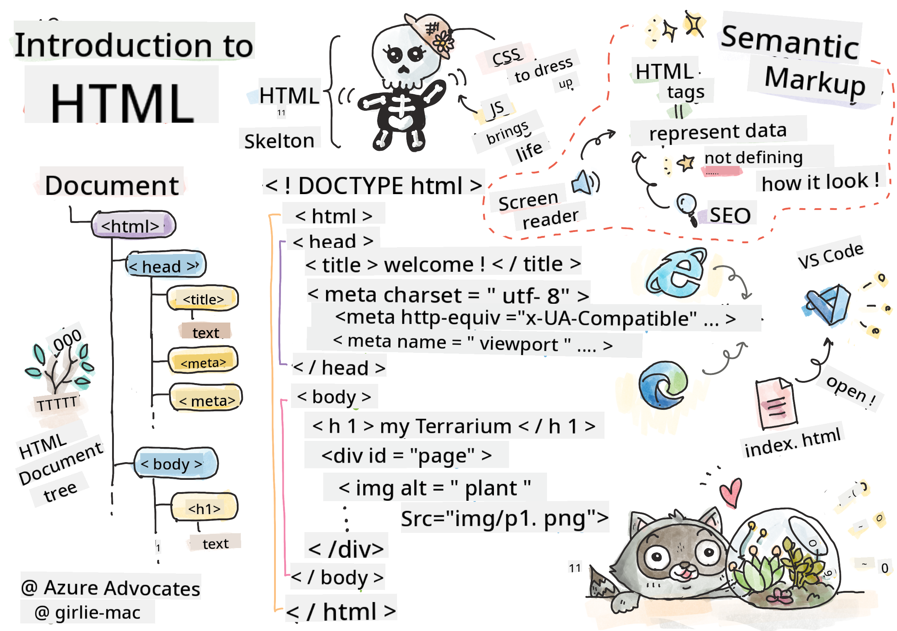
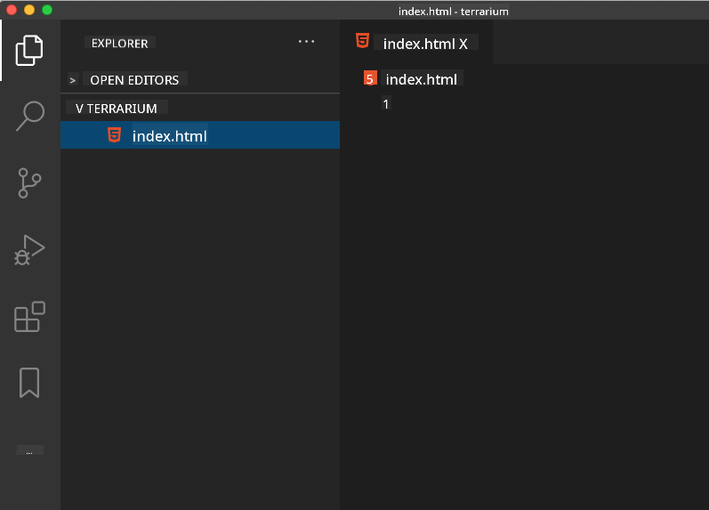

<!--
CO_OP_TRANSLATOR_METADATA:
{
  "original_hash": "89f7f9f800ce7c9f149e98baaae8491a",
  "translation_date": "2025-08-29T13:24:06+00:00",
  "source_file": "3-terrarium/1-intro-to-html/README.md",
  "language_code": "en"
}
-->
# Terrarium Project Part 1: Introduction to HTML


> Sketchnote by [Tomomi Imura](https://twitter.com/girlie_mac)

## Pre-Lecture Quiz

[Pre-lecture quiz](https://ff-quizzes.netlify.app/web/quiz/15)


> Check out video

> 
> [](https://www.youtube.com/watch?v=1TvxJKBzhyQ)

### Introduction

HTML, or HyperText Markup Language, is the 'framework' of the web. If CSS 'styles' your HTML and JavaScript adds functionality, HTML is the foundation of your web application. HTML's syntax even reflects this concept, with tags like "head", "body", and "footer".

In this lesson, we'll use HTML to structure the 'framework' of our virtual terrarium's interface. It will include a title and three columns: a left and right column for draggable plants, and a center area that will represent the terrarium itself. By the end of this lesson, you'll see the plants in the columns, but the interface will look a bit plain. Don't worry—next, you'll use CSS to enhance its appearance.

### Task

On your computer, create a folder named 'terrarium' and inside it, a file called 'index.html'. You can do this in Visual Studio Code by opening a new VS Code window, clicking 'open folder', and navigating to your new folder. Then, click the small 'file' button in the Explorer pane to create the new file:



Alternatively, you can use these commands in Git Bash:
* `mkdir terrarium`
* `cd terrarium`
* `touch index.html`
* `code index.html` or `nano index.html`

> The `index.html` file tells the browser it's the default file in a folder. URLs like `https://anysite.com/test` might correspond to a folder named `test` containing an `index.html` file. The `index.html` file doesn't need to appear in the URL.

---

## The DocType and html tags

The first line of an HTML file is its doctype declaration. While it might seem odd to include this line at the very top, it informs older browsers to render the page in standard mode, adhering to the current HTML specification.

> Tip: In VS Code, you can hover over a tag to access information about its usage from the MDN Reference guides.

The second line should be the opening `<html>` tag, followed by its closing tag `</html>`. These tags serve as the root elements of your interface.

### Task

Add these lines at the top of your `index.html` file:

```HTML
<!DOCTYPE html>
<html></html>
```

✅ There are different modes that can be set using the DocType declaration, such as [Quirks Mode and Standards Mode](https://developer.mozilla.org/docs/Web/HTML/Quirks_Mode_and_Standards_Mode). These modes were designed to support very old browsers (like Netscape Navigator 4 and Internet Explorer 5), which are rarely used today. Stick to the standard doctype declaration.

---

## The document's 'head'

The 'head' section of an HTML document contains essential information about your web page, known as [metadata](https://developer.mozilla.org/docs/Web/HTML/Element/meta). In this case, it provides the web server with the following details:

-   The page's title
-   Metadata, including:
    -   The 'character set', specifying the character encoding used on the page
    -   Browser compatibility information, such as `x-ua-compatible` indicating support for IE=edge
    -   Instructions for how the viewport should behave when loaded, such as setting the initial scale to 1 to control the zoom level.

### Task

Add a 'head' section to your document between the opening and closing `<html>` tags.

```html
<head>
	<title>Welcome to my Virtual Terrarium</title>
	<meta charset="utf-8" />
	<meta http-equiv="X-UA-Compatible" content="IE=edge" />
	<meta name="viewport" content="width=device-width, initial-scale=1" />
</head>
```

✅ What happens if you set a viewport meta tag like this: `<meta name="viewport" content="width=600">`? Learn more about the [viewport](https://developer.mozilla.org/docs/Web/HTML/Viewport_meta_tag).

---

## The document's `body`

### HTML Tags

In HTML, you use tags in your `.html` file to create elements on a web page. Most tags have an opening and closing tag, like `<p>hello</p>` for a paragraph. Create the body of your interface by adding `<body>` tags inside the `<html>` tag pair. Your markup should now look like this:

### Task

```html
<!DOCTYPE html>
<html>
	<head>
		<title>Welcome to my Virtual Terrarium</title>
		<meta charset="utf-8" />
		<meta http-equiv="X-UA-Compatible" content="IE=edge" />
		<meta name="viewport" content="width=device-width, initial-scale=1" />
	</head>
	<body></body>
</html>
```

Now, you can start building your page. Typically, `<div>` tags are used to create separate elements on a page. We'll use a series of `<div>` elements to contain images.

### Images

The `` tag is unique because it doesn't require a closing tag. It includes a `src` attribute that provides all the information needed to render the image.

Create a folder in your app called `images` and add all the images from the [source code folder](../../../../3-terrarium/solution/images) into it. (There are 14 plant images.)

### Task

Add these plant images into two columns between the `<body></body>` tags:

```html
<div id="page">
	<div id="left-container" class="container">
		<div class="plant-holder">
			
		</div>
		<div class="plant-holder">
			
		</div>
		<div class="plant-holder">
			
		</div>
		<div class="plant-holder">
			
		</div>
		<div class="plant-holder">
			
		</div>
		<div class="plant-holder">
			
		</div>
		<div class="plant-holder">
			
		</div>
	</div>
	<div id="right-container" class="container">
		<div class="plant-holder">
			
		</div>
		<div class="plant-holder">
			
		</div>
		<div class="plant-holder">
			
		</div>
		<div class="plant-holder">
			
		</div>
		<div class="plant-holder">
			
		</div>
		<div class="plant-holder">
			
		</div>
		<div class="plant-holder">
			
		</div>
	</div>
</div>
```

> Note: Divs vs. Spans. Divs are 'block' elements, while Spans are 'inline'. What happens if you change these divs to spans?

With this markup, the plants will now appear on the screen. It won't look great yet because the CSS styling hasn't been applied. We'll address that in the next lesson.

Each image includes alt text, which appears if the image can't be displayed. This is an important attribute for accessibility. You'll learn more about accessibility in future lessons, but for now, remember that the alt attribute provides alternative information for an image if a user can't view it (due to a slow connection, an error in the `src` attribute, or if the user relies on a screen reader).

✅ Did you notice that each image has the same alt tag? Is this good practice? Why or why not? Can you improve this code?

---

## Semantic markup

Using meaningful 'semantics' in HTML means employing tags that represent the type of data or interaction they were designed for. For example, the main title text on a page should use an `<h1>` tag.

Add the following line right below your opening `<body>` tag:

```html
<h1>My Terrarium</h1>
```

Using semantic markup, such as headers with `<h1>` and unordered lists with `<ul>`, helps screen readers navigate a page. Buttons should be written as `<button>` and lists as `<li>`. While you can use styled `<span>` elements with click handlers to mimic buttons, it's better for accessibility to use actual button elements. This allows assistive technologies to identify and interact with buttons more effectively.

✅ Watch a screen reader in action and [see how it interacts with a web page](https://www.youtube.com/watch?v=OUDV1gqs9GA). Can you understand why non-semantic markup might frustrate users?

## The terrarium

The final part of this interface involves adding markup that will later be styled to create a terrarium.

### Task:

Add this markup above the last `</div>` tag:

```html
<div id="terrarium">
	<div class="jar-top"></div>
	<div class="jar-walls">
		<div class="jar-glossy-long"></div>
		<div class="jar-glossy-short"></div>
	</div>
	<div class="dirt"></div>
	<div class="jar-bottom"></div>
</div>
```

✅ Even though you've added this markup, nothing appears on the screen yet. Why?

---

## 🚀Challenge

HTML includes some quirky 'older' tags that are fun to experiment with, even though you shouldn't use deprecated tags like [these tags](https://developer.mozilla.org/docs/Web/HTML/Element#Obsolete_and_deprecated_elements) in your markup. Can you use the old `<marquee>` tag to make the `<h1>` title scroll horizontally? (Remember to remove it afterward!)

## Post-Lecture Quiz

[Post-lecture quiz](https://ff-quizzes.netlify.app/web/quiz/16)

## Review & Self Study

HTML is the foundational system that has shaped the web into what it is today. Explore its history by studying old and new tags. Can you figure out why some tags were deprecated and others introduced? What tags might be added in the future?

Learn more about building websites for the web and mobile devices at [Microsoft Learn](https://docs.microsoft.com/learn/modules/build-simple-website/?WT.mc_id=academic-77807-sagibbon).


## Assignment

[Practice your HTML: Build a blog mockup](assignment.md)

---

**Disclaimer**:  
This document has been translated using the AI translation service [Co-op Translator](https://github.com/Azure/co-op-translator). While we strive for accuracy, please note that automated translations may contain errors or inaccuracies. The original document in its native language should be regarded as the authoritative source. For critical information, professional human translation is recommended. We are not responsible for any misunderstandings or misinterpretations resulting from the use of this translation.