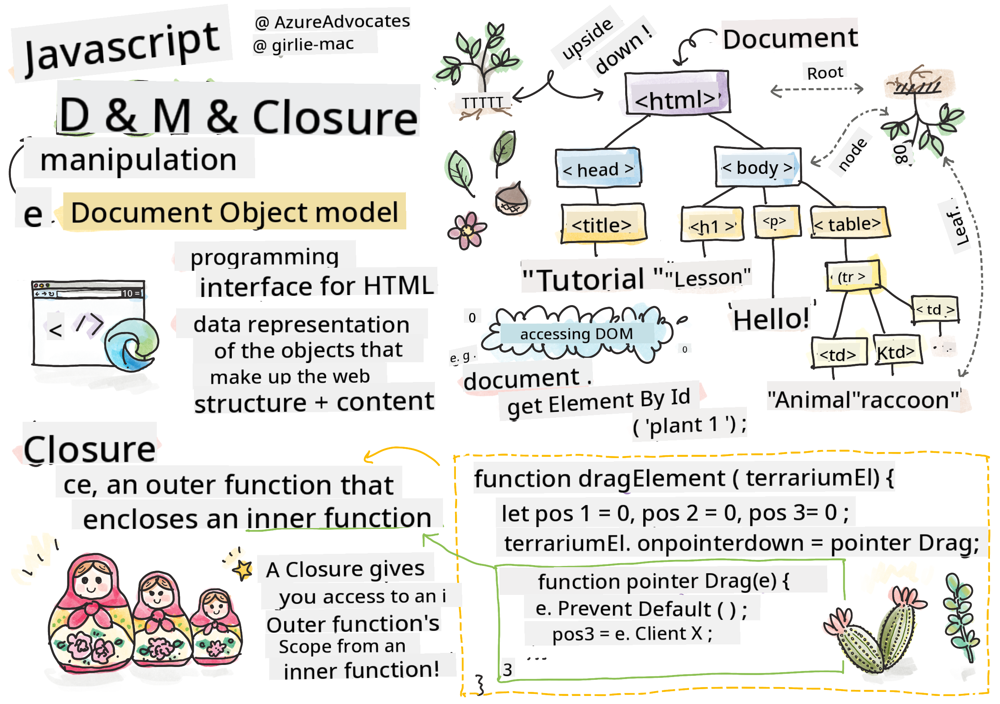
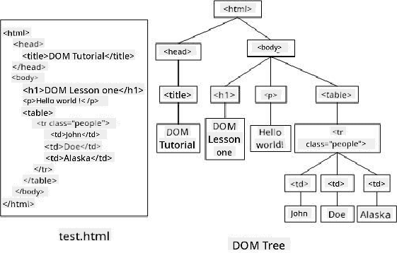

<!--
CO_OP_TRANSLATOR_METADATA:
{
  "original_hash": "30f8903a1f290e3d438dc2c70fe60259",
  "translation_date": "2025-08-28T11:52:32+00:00",
  "source_file": "3-terrarium/3-intro-to-DOM-and-closures/README.md",
  "language_code": "en"
}
-->
# Terrarium Project Part 3: DOM Manipulation and a Closure


> Sketchnote by [Tomomi Imura](https://twitter.com/girlie_mac)

## Pre-Lecture Quiz

[Pre-lecture quiz](https://ashy-river-0debb7803.1.azurestaticapps.net/quiz/19)

### Introduction

Manipulating the DOM, or the "Document Object Model," is a fundamental part of web development. According to [MDN](https://developer.mozilla.org/docs/Web/API/Document_Object_Model/Introduction), "The Document Object Model (DOM) is the data representation of the objects that comprise the structure and content of a document on the web." The challenges of DOM manipulation have often led developers to use JavaScript frameworks instead of plain JavaScript to manage the DOM, but here, we'll tackle it ourselves!

Additionally, this lesson introduces the concept of a [JavaScript closure](https://developer.mozilla.org/docs/Web/JavaScript/Closures), which can be thought of as a function enclosed within another function, allowing the inner function to access the outer function's scope.

> JavaScript closures are a broad and complex topic. This lesson covers the basic idea that in the terrarium's code, you'll encounter a closure: an inner function and an outer function structured in a way that lets the inner function access the outer function's scope. For more detailed information, check out the [comprehensive documentation](https://developer.mozilla.org/docs/Web/JavaScript/Closures).

We'll use a closure to manipulate the DOM.

Think of the DOM as a tree that represents all the ways a web page document can be manipulated. Various APIs (Application Program Interfaces) have been created to allow programmers, using their preferred programming language, to access the DOM and edit, rearrange, or otherwise manage it.



> A representation of the DOM and the HTML markup that references it. From [Olfa Nasraoui](https://www.researchgate.net/publication/221417012_Profile-Based_Focused_Crawler_for_Social_Media-Sharing_Websites)

In this lesson, we'll complete our interactive terrarium project by writing JavaScript that lets users move plants on the page.

### Prerequisite

You should already have the HTML and CSS for your terrarium set up. By the end of this lesson, you'll be able to drag plants into and out of the terrarium.

### Task

In your terrarium folder, create a new file called `script.js`. Import this file in the `<head>` section:

```html
	<script src="./script.js" defer></script>
```

> Note: Use `defer` when importing an external JavaScript file into the HTML file to ensure the JavaScript runs only after the HTML file has fully loaded. Alternatively, you could use the `async` attribute, which allows the script to execute while the HTML file is still parsing. However, in this case, it's important for the HTML elements to be fully available for dragging before the drag script executes.

---

## The DOM elements

The first step is to create references to the elements you want to manipulate in the DOM. In this case, these are the 14 plants currently located in the sidebars.

### Task

```html
dragElement(document.getElementById('plant1'));
dragElement(document.getElementById('plant2'));
dragElement(document.getElementById('plant3'));
dragElement(document.getElementById('plant4'));
dragElement(document.getElementById('plant5'));
dragElement(document.getElementById('plant6'));
dragElement(document.getElementById('plant7'));
dragElement(document.getElementById('plant8'));
dragElement(document.getElementById('plant9'));
dragElement(document.getElementById('plant10'));
dragElement(document.getElementById('plant11'));
dragElement(document.getElementById('plant12'));
dragElement(document.getElementById('plant13'));
dragElement(document.getElementById('plant14'));
```

What's happening here? You're referencing the document and searching its DOM for an element with a specific Id. Recall from the first HTML lesson that you assigned unique Ids to each plant image (`id="plant1"`). Now, you'll use those Ids. After identifying each element, you pass it to a function called `dragElement`, which you'll create shortly. This makes the element draggable—or it will soon.

✅ Why do we reference elements by Id instead of their CSS class? Refer back to the CSS lesson for the answer.

---

## The Closure

Now you're ready to create the `dragElement` closure, which is an outer function that encloses one or more inner functions (in this case, three).

Closures are useful when multiple functions need access to the scope of an outer function. Here's an example:

```javascript
function displayCandy(){
	let candy = ['jellybeans'];
	function addCandy(candyType) {
		candy.push(candyType)
	}
	addCandy('gumdrops');
}
displayCandy();
console.log(candy)
```

In this example, the `displayCandy` function surrounds a function that adds a new candy type to an array already defined within the function. If you run this code, the `candy` array will be undefined because it's a local variable (local to the closure).

✅ How can you make the `candy` array accessible? Try moving it outside the closure. This way, the array becomes global instead of being limited to the closure's local scope.

### Task

Under the element declarations in `script.js`, create a function:

```javascript
function dragElement(terrariumElement) {
	//set 4 positions for positioning on the screen
	let pos1 = 0,
		pos2 = 0,
		pos3 = 0,
		pos4 = 0;
	terrariumElement.onpointerdown = pointerDrag;
}
```

`dragElement` receives its `terrariumElement` object from the declarations at the top of the script. Then, you set some local positions to `0` for the object passed into the function. These local variables will be manipulated for each element as you add drag-and-drop functionality within the closure. The terrarium will be populated by these dragged elements, so the application needs to track their placement.

Additionally, the `terrariumElement` passed to this function is assigned a `pointerdown` event, which is part of the [web APIs](https://developer.mozilla.org/docs/Web/API) designed to assist with DOM management. `onpointerdown` triggers when a button is pressed or, in this case, when a draggable element is touched. This event handler works on both [web and mobile browsers](https://caniuse.com/?search=onpointerdown), with a few exceptions.

✅ The [event handler `onclick`](https://developer.mozilla.org/docs/Web/API/GlobalEventHandlers/onclick) has broader cross-browser support. Why wouldn't you use it here? Consider the specific type of screen interaction you're aiming for.

---

## The Pointerdrag function

The `terrariumElement` is now ready to be dragged. When the `onpointerdown` event is triggered, the `pointerDrag` function is called. Add this function right below the line `terrariumElement.onpointerdown = pointerDrag;`:

### Task 

```javascript
function pointerDrag(e) {
	e.preventDefault();
	console.log(e);
	pos3 = e.clientX;
	pos4 = e.clientY;
}
```

Several things happen here. First, you prevent the default events that typically occur on pointerdown by using `e.preventDefault();`. This gives you more control over the interface's behavior.

> After completing the script file, revisit this line and try removing `e.preventDefault()`. What changes?

Next, open `index.html` in a browser and inspect the interface. When you click a plant, you'll see how the 'e' event is captured. Explore the event to see the wealth of information gathered from a single pointerdown event!

Then, note how the local variables `pos3` and `pos4` are set to `e.clientX`. You can find the `e` values in the inspection pane. These values capture the x and y coordinates of the plant at the moment you click or touch it. You'll need precise control over the plants' behavior as you drag them, so you track their coordinates.

✅ Is it becoming clearer why this app is built with one large closure? Without it, how would you maintain scope for each of the 14 draggable plants?

Complete the initial function by adding two more pointer event manipulations under `pos4 = e.clientY`:

```html
document.onpointermove = elementDrag;
document.onpointerup = stopElementDrag;
```

Here, you're specifying that the plant should move with the pointer as you drag it and stop moving when you release it. `onpointermove` and `onpointerup` are part of the same API as `onpointerdown`. The interface will throw errors now because you haven't defined the `elementDrag` and `stopElementDrag` functions yet, so let's build those next.

---

## The elementDrag and stopElementDrag functions

Complete the closure by adding two more internal functions to handle what happens when you drag a plant and when you stop dragging it. The goal is to allow users to drag any plant at any time and place it anywhere on the screen. This interface is intentionally flexible (there's no drop zone, for example) to let users design their terrarium freely by adding, removing, and repositioning plants.

### Task

Add the `elementDrag` function right after the closing curly bracket of `pointerDrag`:

```javascript
function elementDrag(e) {
	pos1 = pos3 - e.clientX;
	pos2 = pos4 - e.clientY;
	pos3 = e.clientX;
	pos4 = e.clientY;
	console.log(pos1, pos2, pos3, pos4);
	terrariumElement.style.top = terrariumElement.offsetTop - pos2 + 'px';
	terrariumElement.style.left = terrariumElement.offsetLeft - pos1 + 'px';
}
```

In this function, you perform several updates to the initial positions (`pos1` through `pos4`) that were set as local variables in the outer function. Here's what's happening:

As you drag, you update `pos1` by setting it equal to `pos3` (which was previously set to `e.clientX`) minus the current `e.clientX` value. You perform a similar operation for `pos2`. Then, you update `pos3` and `pos4` to the new x and y coordinates of the element. You can observe these changes in the console as you drag. Finally, you adjust the plant's CSS style to set its new position based on the updated values of `pos1` and `pos2`, calculating the plant's top and left x and y coordinates by comparing its offset with these new positions.

> `offsetTop` and `offsetLeft` are CSS properties that set an element's position relative to its parent, as long as the parent isn't positioned as `static`.

These position recalculations allow you to fine-tune the terrarium's behavior.

### Task 

The final step is to add the `stopElementDrag` function after the closing curly bracket of `elementDrag`:

```javascript
function stopElementDrag() {
	document.onpointerup = null;
	document.onpointermove = null;
}
```

This small function resets the `onpointerup` and `onpointermove` events, enabling you to either restart the plant's movement by dragging it again or start dragging a different plant.

✅ What happens if you don't set these events to null?

Now your project is complete!

🥇Congratulations! You've finished your beautiful terrarium. 

---

## 🚀Challenge

Add a new event handler to your closure to add more functionality to the plants. For example, double-click a plant to bring it to the front. Get creative!

## Post-Lecture Quiz

[Post-lecture quiz](https://ashy-river-0debb7803.1.azurestaticapps.net/quiz/20)

## Review & Self Study

While dragging elements around the screen may seem simple, there are many ways to achieve this and various challenges depending on the desired effect. In fact, there's a dedicated [drag and drop API](https://developer.mozilla.org/docs/Web/API/HTML_Drag_and_Drop_API) you can explore. We didn't use it in this module because the effect we wanted was slightly different, but try it out in your own project to see what you can create.

Learn more about pointer events in the [W3C docs](https://www.w3.org/TR/pointerevents1/) and on [MDN web docs](https://developer.mozilla.org/docs/Web/API/Pointer_events).

Always check browser compatibility using [CanIUse.com](https://caniuse.com/).

## Assignment

[Work a bit more with the DOM](assignment.md)

---

**Disclaimer**:  
This document has been translated using the AI translation service [Co-op Translator](https://github.com/Azure/co-op-translator). While we strive for accuracy, please note that automated translations may contain errors or inaccuracies. The original document in its native language should be regarded as the authoritative source. For critical information, professional human translation is recommended. We are not responsible for any misunderstandings or misinterpretations resulting from the use of this translation.