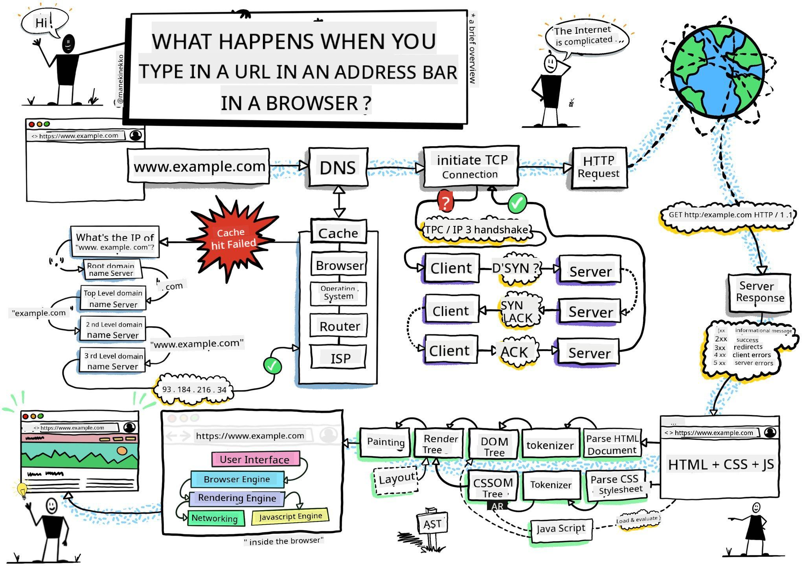
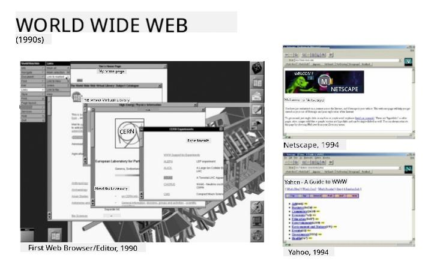
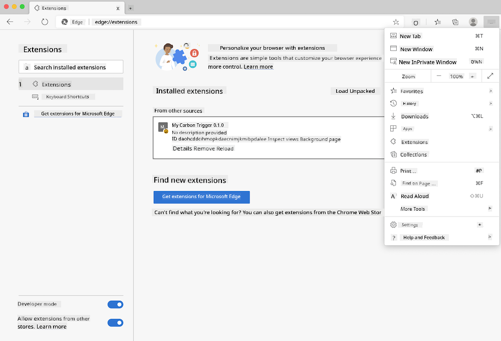
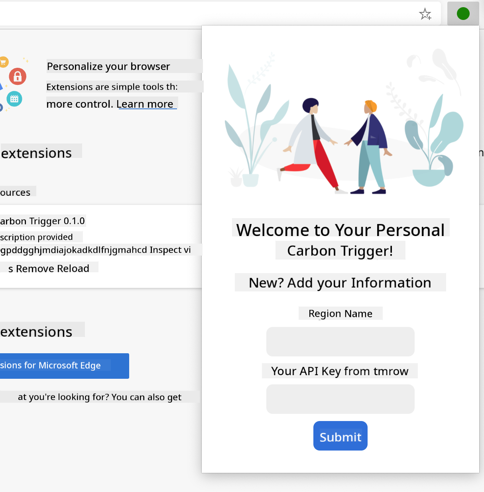
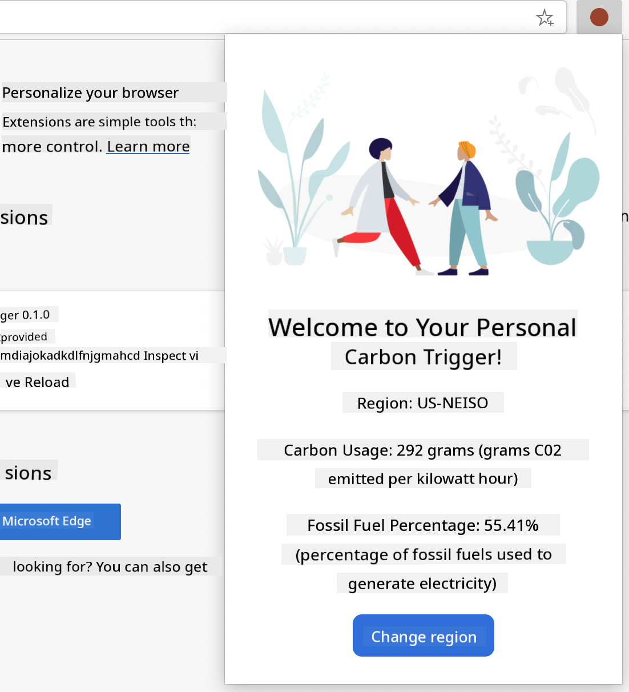

<!--
CO_OP_TRANSLATOR_METADATA:
{
  "original_hash": "0bb55e0b98600afab801eea115228873",
  "translation_date": "2025-08-28T11:23:17+00:00",
  "source_file": "5-browser-extension/1-about-browsers/README.md",
  "language_code": "en"
}
-->
# Browser Extension Project Part 1: All about Browsers


> Sketchnote by [Wassim Chegham](https://dev.to/wassimchegham/ever-wondered-what-happens-when-you-type-in-a-url-in-an-address-bar-in-a-browser-3dob)

## Pre-Lecture Quiz

[Pre-lecture quiz](https://ff-quizzes.netlify.app/web/quiz/23)

### Introduction

Browser extensions enhance a browser's functionality. Before creating one, it's important to understand how browsers operate.

### About the browser

In this lesson series, you'll learn how to create a browser extension compatible with Chrome, Firefox, and Edge. In this part, you'll explore how browsers work and set up the foundation for your browser extension.

But what exactly is a browser? It's a software application that enables users to access content from a server and display it on web pages.

✅ A bit of history: The first browser, called 'WorldWideWeb,' was created by Sir Timothy Berners-Lee in 1990.


> Some early browsers, via [Karen McGrane](https://www.slideshare.net/KMcGrane/week-4-ixd-history-personal-computing)

When a user connects to the internet using a URL (Uniform Resource Locator), typically through an `http` or `https` address, the browser communicates with a web server to retrieve a web page.

The browser's rendering engine then displays the page on the user's device, whether it's a mobile phone, desktop, or laptop.

Browsers can also cache content to avoid fetching it from the server repeatedly. They can record browsing history, store 'cookies' (small data files containing user activity information), and more.

It's important to note that not all browsers are the same! Each has its own strengths and weaknesses. A professional web developer must ensure web pages perform well across different browsers, including handling small screens like mobile phones and offline users.

A very useful website to bookmark in your preferred browser is [caniuse.com](https://www.caniuse.com). It provides lists of supported technologies, helping you build web pages that cater to your users effectively.

✅ How can you determine which browsers are most popular among your website's users? Check your analytics. You can integrate various analytics tools into your web development process to identify the most-used browsers.

## Browser extensions

Why create a browser extension? Extensions are convenient tools for quick access to repetitive tasks. For instance, you might use a color-picker extension to check colors on web pages or a password manager extension to store and retrieve passwords.

Developing browser extensions is also enjoyable. They focus on a limited set of tasks and perform them efficiently.

✅ What are your favorite browser extensions? What tasks do they help you with?

### Installing extensions

Before building your own extension, familiarize yourself with the process of creating and deploying one. While the steps vary slightly between browsers, the process is similar for Chrome and Firefox, as shown in this Edge example:



> Note: Make sure to toggle on developer mode and allow extensions from other stores.

The general process is as follows:

- Build your extension using `npm run build`.
- Open the browser's extensions pane via the "Settings and more" button (the `...` icon) in the top-right corner.
- For a new installation, select `load unpacked` to upload the extension from its build folder (in this case, `/dist`).
- If you're updating an existing extension, click `reload`.

✅ These instructions apply to extensions you create yourself. To install extensions from a browser's extension store, visit the respective [stores](https://microsoftedge.microsoft.com/addons/Microsoft-Edge-Extensions-Home) and install your desired extension.

### Get Started

You'll create a browser extension that displays your region's carbon footprint, including energy usage and energy sources. The extension will feature a form to collect an API key for accessing CO2 Signal's API.

**What you'll need:**

- [An API key](https://www.co2signal.com/): Enter your email on this page to receive one.
- The [code for your region](http://api.electricitymap.org/v3/zones) from the [Electricity Map](https://www.electricitymap.org/map) (e.g., 'US-NEISO' for Boston).
- The [starter code](../../../../5-browser-extension/start): Download the `start` folder to complete the code.
- [NPM](https://www.npmjs.com): Install NPM locally to manage the packages listed in your `package.json` file.

✅ Learn more about package management in this [excellent Learn module](https://docs.microsoft.com/learn/modules/create-nodejs-project-dependencies/?WT.mc_id=academic-77807-sagibbon).

Take a moment to review the codebase:

dist
    -|manifest.json (default settings)
    -|index.html (front-end HTML markup)
    -|background.js (background JavaScript)
    -|main.js (compiled JavaScript)
src
    -|index.js (your JavaScript code)

✅ Once you have your API key and region code, save them in a note for future reference.

### Build the HTML for the extension

This extension will have two views: one for collecting the API key and region code:



And another for displaying the region's carbon usage:



Start by creating the HTML for the form and styling it with CSS.

In the `/dist` folder, build a form and a results area. In the `index.html` file, populate the designated form area:

```HTML
<form class="form-data" autocomplete="on">
	<div>
		<h2>New? Add your Information</h2>
	</div>
	<div>
		<label for="region">Region Name</label>
		<input type="text" id="region" required class="region-name" />
	</div>
	<div>
		<label for="api">Your API Key from tmrow</label>
		<input type="text" id="api" required class="api-key" />
	</div>
	<button class="search-btn">Submit</button>
</form>	
```
This form will save the input information to local storage.

Next, create the results area. Add some divs below the closing form tag:

```HTML
<div class="result">
	<div class="loading">loading...</div>
	<div class="errors"></div>
	<div class="data"></div>
	<div class="result-container">
		<p><strong>Region: </strong><span class="my-region"></span></p>
		<p><strong>Carbon Usage: </strong><span class="carbon-usage"></span></p>
		<p><strong>Fossil Fuel Percentage: </strong><span class="fossil-fuel"></span></p>
	</div>
	<button class="clear-btn">Change region</button>
</div>
```
Now, try building the extension. Install the package dependencies:

```
npm install
```

This command uses npm (Node Package Manager) to install webpack for the build process. Webpack bundles the code, and you can see the output in `/dist/main.js`.

At this stage, the extension should build successfully. If you deploy it in Edge, you'll see a neatly displayed form.

Congratulations! You've taken the first steps toward building a browser extension. In the next lessons, you'll add more functionality and features.

---

## 🚀 Challenge

Visit a browser extension store and install an extension. Explore its files to uncover interesting details. What do you find?

## Post-Lecture Quiz

[Post-lecture quiz](https://ff-quizzes.netlify.app/web/quiz/24)

## Review & Self Study

In this lesson, you learned about the history of web browsers. Take some time to explore how the inventors of the World Wide Web envisioned its use. Here are some useful resources:

[The History of Web Browsers](https://www.mozilla.org/firefox/browsers/browser-history/)

[History of the Web](https://webfoundation.org/about/vision/history-of-the-web/)

[An interview with Tim Berners-Lee](https://www.theguardian.com/technology/2019/mar/12/tim-berners-lee-on-30-years-of-the-web-if-we-dream-a-little-we-can-get-the-web-we-want)

## Assignment 

[Restyle your extension](assignment.md)

---

**Disclaimer**:  
This document has been translated using the AI translation service [Co-op Translator](https://github.com/Azure/co-op-translator). While we aim for accuracy, please note that automated translations may include errors or inaccuracies. The original document in its native language should be regarded as the authoritative source. For critical information, professional human translation is advised. We are not responsible for any misunderstandings or misinterpretations resulting from the use of this translation.