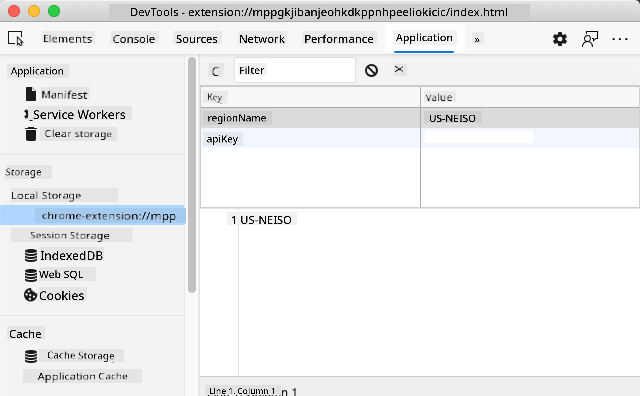

<!--
CO_OP_TRANSLATOR_METADATA:
{
  "original_hash": "e10f168beac4e7b05e30e0eb5c92bf11",
  "translation_date": "2025-08-28T11:29:49+00:00",
  "source_file": "5-browser-extension/2-forms-browsers-local-storage/README.md",
  "language_code": "en"
}
-->
# Browser Extension Project Part 2: Call an API, use Local Storage

## Pre-Lecture Quiz

[Pre-lecture quiz](https://ashy-river-0debb7803.1.azurestaticapps.net/quiz/25)

### Introduction

In this lesson, you'll learn how to call an API by submitting the form in your browser extension and displaying the results within the extension. Additionally, you'll explore how to store data in your browser's local storage for future use and reference.

✅ Follow the numbered segments in the relevant files to know where to place your code.

### Set up the elements to manipulate in the extension:

By now, you should have created the HTML for the form and the results `<div>` in your browser extension. From this point forward, you'll work in the `/src/index.js` file to build your extension step by step. Refer to the [previous lesson](../1-about-browsers/README.md) for instructions on setting up your project and the build process.

In your `index.js` file, start by creating some `const` variables to hold the values associated with different fields:

```JavaScript
// form fields
const form = document.querySelector('.form-data');
const region = document.querySelector('.region-name');
const apiKey = document.querySelector('.api-key');

// results
const errors = document.querySelector('.errors');
const loading = document.querySelector('.loading');
const results = document.querySelector('.result-container');
const usage = document.querySelector('.carbon-usage');
const fossilfuel = document.querySelector('.fossil-fuel');
const myregion = document.querySelector('.my-region');
const clearBtn = document.querySelector('.clear-btn');
```

All of these fields are referenced by their CSS class, as you set them up in the HTML during the previous lesson.

### Add listeners

Next, add event listeners to the form and the clear button that resets the form. This ensures that when a user submits the form or clicks the reset button, an action is triggered. Also, add the call to initialize the app at the bottom of the file:

```JavaScript
form.addEventListener('submit', (e) => handleSubmit(e));
clearBtn.addEventListener('click', (e) => reset(e));
init();
```

✅ Notice the shorthand used to listen for a submit or click event, and how the event is passed to the handleSubmit or reset functions. Can you write the equivalent of this shorthand in a longer format? Which approach do you prefer?

### Build out the init() function and the reset() function:

Now, you'll create the function that initializes the extension, called `init()`:

```JavaScript
function init() {
	//if anything is in localStorage, pick it up
	const storedApiKey = localStorage.getItem('apiKey');
	const storedRegion = localStorage.getItem('regionName');

	//set icon to be generic green
	//todo

	if (storedApiKey === null || storedRegion === null) {
		//if we don't have the keys, show the form
		form.style.display = 'block';
		results.style.display = 'none';
		loading.style.display = 'none';
		clearBtn.style.display = 'none';
		errors.textContent = '';
	} else {
        //if we have saved keys/regions in localStorage, show results when they load
        displayCarbonUsage(storedApiKey, storedRegion);
		results.style.display = 'none';
		form.style.display = 'none';
		clearBtn.style.display = 'block';
	}
};

function reset(e) {
	e.preventDefault();
	//clear local storage for region only
	localStorage.removeItem('regionName');
	init();
}

```

This function contains some interesting logic. As you read through it, can you understand what happens?

- Two `const` variables are set up to check if the user has stored an APIKey and region code in local storage.
- If either of these is null, the form is displayed by changing its style to 'block.'
- The results, loading indicator, and clear button are hidden, and any error text is cleared.
- If both the key and region exist, a routine is started to:
  - Call the API to retrieve carbon usage data.
  - Hide the results area.
  - Hide the form.
  - Display the reset button.

Before proceeding, it's helpful to learn about an important browser feature: [LocalStorage](https://developer.mozilla.org/docs/Web/API/Window/localStorage). LocalStorage is a convenient way to store strings in the browser as `key-value` pairs. This type of web storage can be managed using JavaScript to handle data within the browser. LocalStorage does not expire, whereas SessionStorage, another type of web storage, is cleared when the browser is closed. Each type of storage has its own advantages and disadvantages.

> Note: Your browser extension has its own local storage, separate from the main browser window, which behaves independently.

You can set your APIKey to have a string value, for example, and view it in Edge by "inspecting" a web page (right-click to inspect) and navigating to the Applications tab to see the storage.



✅ Consider situations where you would NOT want to store certain data in LocalStorage. Generally, storing API Keys in LocalStorage is a bad idea! Can you understand why? In this case, since the app is purely for learning purposes and won't be deployed to an app store, this method is acceptable.

Notice that you use the Web API to manipulate LocalStorage, either with `getItem()`, `setItem()`, or `removeItem()`. It's widely supported across browsers.

Before building the `displayCarbonUsage()` function called in `init()`, let's implement the functionality to handle the initial form submission.

### Handle the form submission

Create a function called `handleSubmit` that accepts an event argument `(e)`. Prevent the event from propagating (in this case, stop the browser from refreshing) and call a new function, `setUpUser`, passing in the arguments `apiKey.value` and `region.value`. This way, you use the two values provided via the initial form when the relevant fields are populated.

```JavaScript
function handleSubmit(e) {
	e.preventDefault();
	setUpUser(apiKey.value, region.value);
}
```

✅ Refresh your memory: The HTML you created in the previous lesson includes two input fields whose `values` are captured via the `const` variables set up at the top of the file. Both fields are marked as `required`, so the browser prevents users from submitting null values.

### Set up the user

Next, create the `setUpUser` function, where you'll set local storage values for `apiKey` and `regionName`. Add the following function:

```JavaScript
function setUpUser(apiKey, regionName) {
	localStorage.setItem('apiKey', apiKey);
	localStorage.setItem('regionName', regionName);
	loading.style.display = 'block';
	errors.textContent = '';
	clearBtn.style.display = 'block';
	//make initial call
	displayCarbonUsage(apiKey, regionName);
}
```

This function displays a loading message while the API is being called. At this point, you've reached the stage of creating the most important function for this browser extension!

### Display Carbon Usage

Now it's time to query the API!

Before proceeding, let's discuss APIs. APIs, or [Application Programming Interfaces](https://www.webopedia.com/TERM/A/API.html), are essential tools for web developers. They provide standardized ways for programs to interact and communicate with each other. For example, if you're building a website that needs to query a database, someone might have created an API for you to use. While there are many types of APIs, one of the most popular is a [REST API](https://www.smashingmagazine.com/2018/01/understanding-using-rest-api/).

✅ The term 'REST' stands for 'Representational State Transfer' and involves using variously-configured URLs to fetch data. Research the different types of APIs available to developers. Which format appeals to you?

There are some key points to note about this function. First, observe the [`async` keyword](https://developer.mozilla.org/docs/Web/JavaScript/Reference/Statements/async_function). Writing functions to run asynchronously ensures they wait for certain actions, such as data being returned, to complete before continuing.

Here's a quick video about `async`:

[](https://youtube.com/watch?v=YwmlRkrxvkk "Async and Await for managing promises")

> 🎥 Click the image above for a video about async/await.

Create a new function to query the CO2Signal API:

```JavaScript
import axios from '../node_modules/axios';

async function displayCarbonUsage(apiKey, region) {
	try {
		await axios
			.get('https://api.co2signal.com/v1/latest', {
				params: {
					countryCode: region,
				},
				headers: {
					'auth-token': apiKey,
				},
			})
			.then((response) => {
				let CO2 = Math.floor(response.data.data.carbonIntensity);

				//calculateColor(CO2);

				loading.style.display = 'none';
				form.style.display = 'none';
				myregion.textContent = region;
				usage.textContent =
					Math.round(response.data.data.carbonIntensity) + ' grams (grams C02 emitted per kilowatt hour)';
				fossilfuel.textContent =
					response.data.data.fossilFuelPercentage.toFixed(2) +
					'% (percentage of fossil fuels used to generate electricity)';
				results.style.display = 'block';
			});
	} catch (error) {
		console.log(error);
		loading.style.display = 'none';
		results.style.display = 'none';
		errors.textContent = 'Sorry, we have no data for the region you have requested.';
	}
}
```

This is a large function. Here's what's happening:

- Following best practices, the `async` keyword is used to make the function behave asynchronously. The function includes a `try/catch` block because it will return a promise when the API provides data. Since you can't control the speed of the API's response (or whether it responds at all), you need to handle this uncertainty by calling it asynchronously.
- The function queries the CO2Signal API to retrieve data for your region using your API Key. To use the key, authentication is required in the header parameters.
- Once the API responds, various elements of its response data are assigned to the parts of your screen set up to display this information.
- If there's an error or no result, an error message is displayed.

✅ Asynchronous programming patterns are another valuable tool in your developer toolkit. Read [about the different ways](https://developer.mozilla.org/docs/Web/JavaScript/Reference/Statements/async_function) you can configure this type of code.

Congratulations! If you build your extension (`npm run build`) and refresh it in your extensions pane, you now have a working extension! The only thing left to fix is the icon, which you'll address in the next lesson.

---

## 🚀 Challenge

We've discussed several types of APIs in these lessons. Choose a web API and research in depth what it offers. For example, explore APIs available within browsers, such as the [HTML Drag and Drop API](https://developer.mozilla.org/docs/Web/API/HTML_Drag_and_Drop_API). In your opinion, what makes an API great?

## Post-Lecture Quiz

[Post-lecture quiz](https://ashy-river-0debb7803.1.azurestaticapps.net/quiz/26)

## Review & Self Study

In this lesson, you learned about LocalStorage and APIs, both of which are highly useful for professional web developers. Can you think about how these two concepts work together? Consider how you would design a website that stores items to be used by an API.

## Assignment

[Adopt an API](assignment.md)

---

**Disclaimer**:  
This document has been translated using the AI translation service [Co-op Translator](https://github.com/Azure/co-op-translator). While we aim for accuracy, please note that automated translations may include errors or inaccuracies. The original document in its native language should be regarded as the authoritative source. For critical information, professional human translation is advised. We are not responsible for any misunderstandings or misinterpretations resulting from the use of this translation.