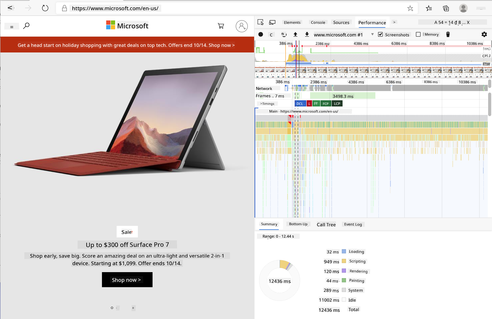
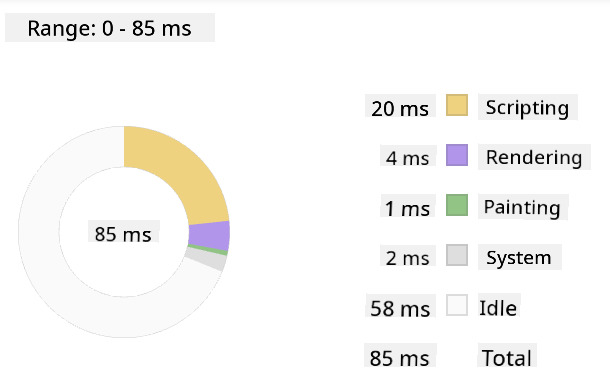
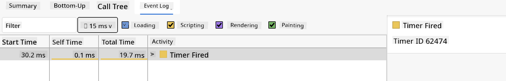

<!--
CO_OP_TRANSLATOR_METADATA:
{
  "original_hash": "b91cbf14240ee59411b96448b994ace1",
  "translation_date": "2025-10-03T12:12:24+00:00",
  "source_file": "5-browser-extension/3-background-tasks-and-performance/README.md",
  "language_code": "en"
}
-->
# Browser Extension Project Part 3: Learn about Background Tasks and Performance

## Pre-Lecture Quiz

[Pre-lecture quiz](https://ff-quizzes.netlify.app/web/quiz/27)

### Introduction

In the last two lessons of this module, you learned how to create a form and a display area for data fetched from an API. This is a very common way to establish a web presence. You even learned how to handle asynchronous data fetching. Your browser extension is almost complete.

The remaining tasks involve managing background processes, such as refreshing the color of the extension's icon. This is a great opportunity to discuss how the browser handles these types of tasks. Let's consider these browser tasks in the context of optimizing the performance of your web assets as you develop them.

## Web Performance Basics

> "Website performance is about two things: how fast the page loads, and how fast the code on it runs." -- [Zack Grossbart](https://www.smashingmagazine.com/2012/06/javascript-profiling-chrome-developer-tools/)

The topic of making websites lightning-fast across all devices, for all users, and in all situations is understandably vast. Here are some key points to keep in mind when building either a standard web project or a browser extension.

The first step to ensuring your site runs efficiently is to gather data about its performance. The best place to start is the developer tools in your web browser. In Edge, click the "Settings and more" button (the three dots icon in the top-right corner of the browser), then navigate to More Tools > Developer Tools and open the Performance tab. You can also use the keyboard shortcuts `Ctrl` + `Shift` + `I` on Windows or `Option` + `Command` + `I` on Mac to open developer tools.

The Performance tab includes a Profiling tool. Open a website (for example, [https://www.microsoft.com](https://www.microsoft.com/?WT.mc_id=academic-77807-sagibbon)) and click the 'Record' button, then refresh the site. Stop the recording at any time, and you'll see routines generated for 'script', 'render', and 'paint' processes:



✅ Visit the [Microsoft Documentation](https://docs.microsoft.com/microsoft-edge/devtools-guide/performance/?WT.mc_id=academic-77807-sagibbon) on the Performance panel in Edge.

> Tip: To get an accurate reading of your website's startup time, clear your browser's cache.

Select elements of the profile timeline to zoom in on events that occur while your page loads.

Get a snapshot of your page's performance by selecting a part of the profile timeline and reviewing the summary pane:



Check the Event Log pane to see if any event took longer than 15 ms:



✅ Familiarize yourself with the profiler! Open the developer tools on this site and check for bottlenecks. What is the slowest-loading asset? The fastest?

## Profiling checks

In general, there are some "problem areas" every web developer should monitor when building a site to avoid unpleasant surprises during production deployment.

**Asset sizes**: The web has become 'heavier' and slower over the years, partly due to the use of images.

✅ Explore the [Internet Archive](https://httparchive.org/reports/page-weight) for a historical view of page weight and more.

A good practice is to ensure your images are optimized and delivered at the appropriate size and resolution for your users.

**DOM traversals**: The browser builds its Document Object Model based on the code you write, so good page performance depends on keeping your tags minimal and only using and styling what the page requires. For example, excess CSS associated with a page can be optimized; styles needed for only one page don't need to be included in the main stylesheet.

**JavaScript**: Every JavaScript developer should watch for 'render-blocking' scripts that must load before the rest of the DOM can be traversed and painted in the browser. Consider using `defer` with your inline scripts (as demonstrated in the Terrarium module).

✅ Test some sites on a [Site Speed Test website](https://www.webpagetest.org/) to learn more about common checks for site performance.

Now that you understand how the browser renders the assets you send to it, let's look at the final steps to complete your extension:

### Create a function to calculate color

In `/src/index.js`, add a function called `calculateColor()` after the series of `const` variables you set to access the DOM:

```JavaScript
function calculateColor(value) {
	let co2Scale = [0, 150, 600, 750, 800];
	let colors = ['#2AA364', '#F5EB4D', '#9E4229', '#381D02', '#381D02'];

	let closestNum = co2Scale.sort((a, b) => {
		return Math.abs(a - value) - Math.abs(b - value);
	})[0];
	console.log(value + ' is closest to ' + closestNum);
	let num = (element) => element > closestNum;
	let scaleIndex = co2Scale.findIndex(num);

	let closestColor = colors[scaleIndex];
	console.log(scaleIndex, closestColor);

	chrome.runtime.sendMessage({ action: 'updateIcon', value: { color: closestColor } });
}
```

What happens here? You pass a value (the carbon intensity) from the API call you completed in the last lesson, then calculate how close its value is to the index in the colors array. You then send the closest color value to the chrome runtime.

The chrome.runtime has [an API](https://developer.chrome.com/extensions/runtime) that handles various background tasks, which your extension utilizes:

> "Use the chrome.runtime API to retrieve the background page, return details about the manifest, and listen for and respond to events in the app or extension lifecycle. You can also use this API to convert the relative path of URLs to fully-qualified URLs."

✅ If you're developing this browser extension for Edge, you might be surprised to use a chrome API. The newer Edge browser versions run on the Chromium browser engine, allowing you to leverage these tools.

> Note: If you want to profile a browser extension, launch the dev tools from within the extension itself, as it operates as a separate browser instance.

### Set a default icon color

Now, in the `init()` function, set the icon to a generic green color initially by calling chrome's `updateIcon` action:

```JavaScript
chrome.runtime.sendMessage({
	action: 'updateIcon',
		value: {
			color: 'green',
		},
});
```
### Call the function, execute the call

Next, call the function you just created by adding it to the promise returned by the CO2Signal API:

```JavaScript
//let CO2...
calculateColor(CO2);
```

Finally, in `/dist/background.js`, add the listener for these background action calls:

```JavaScript
chrome.runtime.onMessage.addListener(function (msg, sender, sendResponse) {
	if (msg.action === 'updateIcon') {
		chrome.action.setIcon({ imageData: drawIcon(msg.value) });
	}
});
//borrowed from energy lollipop extension, nice feature!
function drawIcon(value) {
	let canvas = new OffscreenCanvas(200, 200);
	let context = canvas.getContext('2d');

	context.beginPath();
	context.fillStyle = value.color;
	context.arc(100, 100, 50, 0, 2 * Math.PI);
	context.fill();

	return context.getImageData(50, 50, 100, 100);
}
```
In this code, you add a listener for any messages sent to the backend task manager. If the message is called 'updateIcon', the subsequent code runs to draw an icon of the appropriate color using the Canvas API.

✅ You'll learn more about the Canvas API in the [Space Game lessons](../../6-space-game/2-drawing-to-canvas/README.md).

Now, rebuild your extension (`npm run build`), refresh and launch your extension, and watch the color change. Is it time to run an errand or wash the dishes? Now you know!

Congratulations, you've built a functional browser extension and gained insights into how the browser works and how to profile its performance.

---

## 🚀 Challenge

Explore some open-source websites that have been around for a long time. Based on their GitHub history, try to determine how they were optimized for performance over the years, if at all. What is the most common pain point?

## Post-Lecture Quiz

[Post-lecture quiz](https://ff-quizzes.netlify.app/web/quiz/28)

## Review & Self Study

Consider subscribing to a [performance newsletter](https://perf.email/).

Investigate how browsers measure web performance by exploring the performance tabs in their developer tools. Do you notice any significant differences?

## Assignment

[Analyze a site for performance](assignment.md)

---

**Disclaimer**:  
This document has been translated using the AI translation service [Co-op Translator](https://github.com/Azure/co-op-translator). While we aim for accuracy, please note that automated translations may contain errors or inaccuracies. The original document in its native language should be regarded as the authoritative source. For critical information, professional human translation is recommended. We are not responsible for any misunderstandings or misinterpretations resulting from the use of this translation.