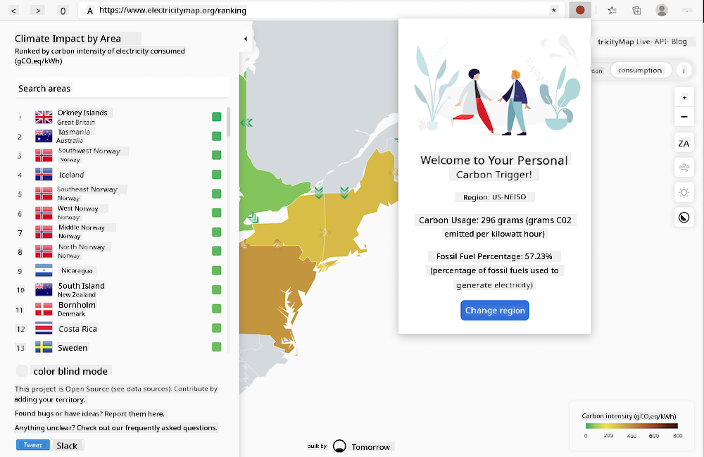

<!--
CO_OP_TRANSLATOR_METADATA:
{
  "original_hash": "dd58ae1b7707034f055718c1b68bc8de",
  "translation_date": "2025-08-28T11:27:20+00:00",
  "source_file": "5-browser-extension/solution/translation/README.hi.md",
  "language_code": "en"
}
-->
# Carbon Trigger Browser Extension: Completed Code

Using tmrow's CO2 Signal API to track electricity usage, this browser extension provides a reminder about how carbon-intensive the electricity in your area is while you're browsing. By using this extension, you can make informed decisions about your activities based on this information.



## Getting Started

You will need to have [npm](https://npmjs.com) installed. Download a copy of this code into a folder on your computer.

Install all the required packages:

```
npm install
```

Build the extension using Webpack:

```
npm run build
```

To install on Edge, use the 'three dots' menu in the top-right corner of the browser to find the Extensions panel. From there, select 'Load unpacked' to load a new extension. When prompted, open the 'dist' folder, and the extension will load. To use it, you will need an API key for CO2 Signal ([get it here via email](https://www.co2signal.com/) by entering your email in the box on that page) and [the code for your region](http://api.electricitymap.org/v3/zones) from [Electricity Map](https://www.electricitymap.org/map) (for example, in Boston, I use 'US-NEISO').


Once the API key and region are entered into the extension interface, the colored dot in the browser extension bar should change to reflect the energy usage in your area and provide an indicator of whether energy-intensive activities are appropriate for your performance. The concept behind this 'dot' system was inspired by the [Energy Lollipop Extension](https://energylollipop.com/) for California emissions.

---

**Disclaimer**:  
This document has been translated using the AI translation service [Co-op Translator](https://github.com/Azure/co-op-translator). While we aim for accuracy, please note that automated translations may include errors or inaccuracies. The original document in its native language should be regarded as the authoritative source. For critical information, professional human translation is advised. We are not responsible for any misunderstandings or misinterpretations resulting from the use of this translation.