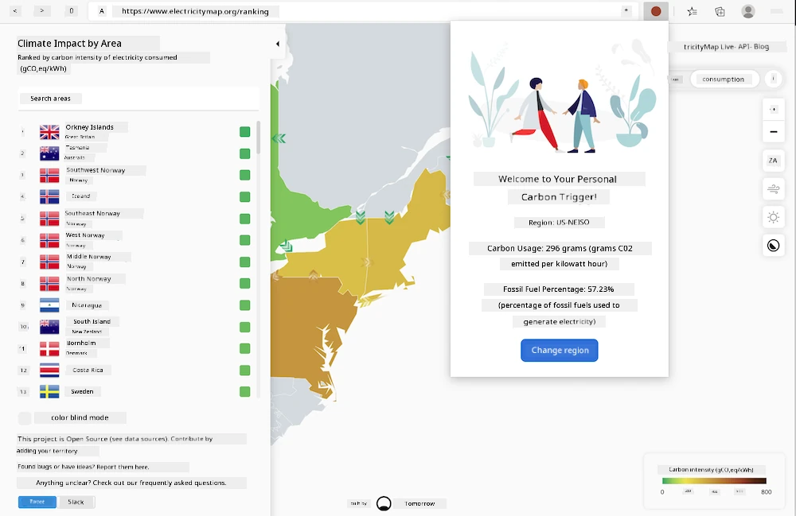
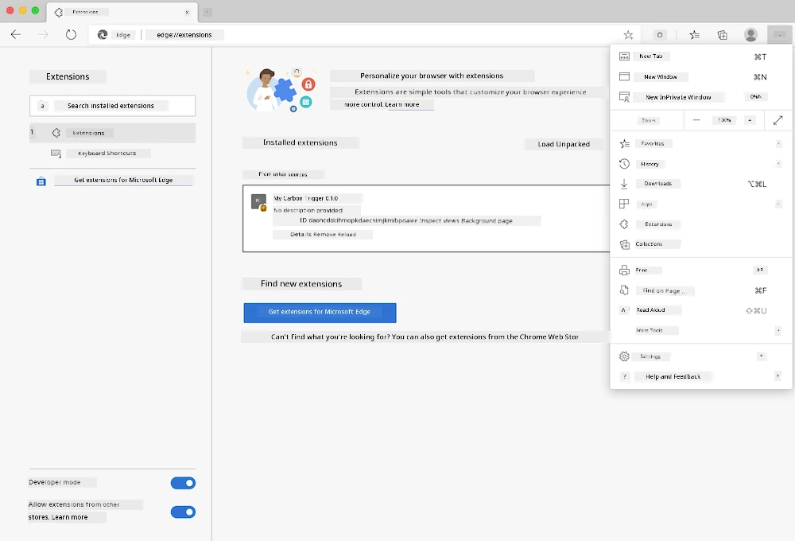

# Carbon Trigger Browser Extension: Complete Code

Using the CO2 Signal API from tmrow to monitor electricity usage, build a browser extension that alerts you in your browser about the intensity of electricity consumption in your region. This extension can help you make informed decisions about your activities based on this information.



## Getting Started

You need to install [npm](https://npmjs.com). Download a copy of this code to a folder on your computer.

Install all required packages:

```
npm install
```

Build the extension using webpack:

```
npm run build
```

To install it on Edge, use the 'three dots' menu in the top-right corner of the browser to find the Extensions panel. From there, select 'Load Unpacked' to load a new extension. Open the 'dist' folder when prompted, and the extension will be loaded. To use it, you’ll need an API key for the CO2 Signal API ([get one here via email](https://www.co2signal.com/) - enter your email in the box on this page) and [the code for your region](http://api.electricitymap.org/v3/zones) corresponding to the [Electricity Map](https://www.electricitymap.org/map) (in Boston, for example, I use 'US-NEISO').



Once the API key and region are entered into the extension interface, the colored dot in the browser extension bar will change to reflect your region's energy usage and provide guidance on heavy activities that are appropriate for you to undertake. The concept behind this 'dot' system was inspired by [the Energy Lollipop browser extension](https://energylollipop.com/) for California emissions.

---

**Disclaimer**:  
This document has been translated using the AI translation service [Co-op Translator](https://github.com/Azure/co-op-translator). While we aim for accuracy, please note that automated translations may include errors or inaccuracies. The original document in its native language should be regarded as the authoritative source. For critical information, professional human translation is advised. We are not responsible for any misunderstandings or misinterpretations resulting from the use of this translation.