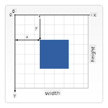

<!--
CO_OP_TRANSLATOR_METADATA:
{
  "original_hash": "41be8d35e7f30aa9dad10773c35e89c4",
  "translation_date": "2025-08-28T11:36:04+00:00",
  "source_file": "6-space-game/2-drawing-to-canvas/README.md",
  "language_code": "en"
}
-->
# Build a Space Game Part 2: Draw Hero and Monsters to Canvas

## Pre-Lecture Quiz

[Pre-lecture quiz](https://ashy-river-0debb7803.1.azurestaticapps.net/quiz/31)

## The Canvas

The canvas is an HTML element that starts off empty; it's essentially a blank space. You can add content to it by drawing on it.

✅ Read [more about the Canvas API](https://developer.mozilla.org/docs/Web/API/Canvas_API) on MDN.

Here's how it's typically defined as part of the page's body:

```html
<canvas id="myCanvas" width="200" height="100"></canvas>
```

In the code above, we are setting the `id`, `width`, and `height`.

- `id`: This allows you to reference the canvas when you need to interact with it.
- `width`: Specifies the width of the canvas element.
- `height`: Specifies the height of the canvas element.

## Drawing simple geometry

The canvas uses a Cartesian coordinate system for drawing. This means it uses an x-axis and y-axis to determine the position of elements. The point `0,0` is located at the top-left corner, while the bottom-right corner corresponds to the WIDTH and HEIGHT you set for the canvas.


> Image from [MDN](https://developer.mozilla.org/docs/Web/API/Canvas_API/Tutorial/Drawing_shapes)

To draw on the canvas, follow these steps:

1. **Get a reference** to the canvas element.
2. **Get a reference** to the context object associated with the canvas.
3. **Perform drawing operations** using the context object.

The code for these steps typically looks like this:

```javascript
// draws a red rectangle
//1. get the canvas reference
canvas = document.getElementById("myCanvas");

//2. set the context to 2D to draw basic shapes
ctx = canvas.getContext("2d");

//3. fill it with the color red
ctx.fillStyle = 'red';

//4. and draw a rectangle with these parameters, setting location and size
ctx.fillRect(0,0, 200, 200) // x,y,width, height
```

✅ The Canvas API is primarily designed for 2D shapes, but you can also create 3D elements on a webpage using the [WebGL API](https://developer.mozilla.org/docs/Web/API/WebGL_API).

With the Canvas API, you can draw various elements, such as:

- **Geometric shapes**: We've already shown how to draw a rectangle, but there are many other shapes you can create.
- **Text**: You can draw text in any font and color you choose.
- **Images**: You can display images from assets like .jpg or .png files.

✅ Try it! Now that you know how to draw a rectangle, can you draw a circle on the page? Check out some creative Canvas drawings on CodePen. Here's a [particularly impressive example](https://codepen.io/dissimulate/pen/KrAwx).

## Load and draw an image asset

To load an image asset, create an `Image` object and set its `src` property. Then, listen for the `load` event to know when the image is ready to use. Here's the code:

### Load asset

```javascript
const img = new Image();
img.src = 'path/to/my/image.png';
img.onload = () => {
  // image loaded and ready to be used
}
```

### Load asset pattern

It's a good idea to wrap the above code in a structure like this, making it easier to use and ensuring you only manipulate the image once it's fully loaded:

```javascript
function loadAsset(path) {
  return new Promise((resolve) => {
    const img = new Image();
    img.src = path;
    img.onload = () => {
      // image loaded and ready to be used
      resolve(img);
    }
  })
}

// use like so

async function run() {
  const heroImg = await loadAsset('hero.png')
  const monsterImg = await loadAsset('monster.png')
}

```

To draw game assets on the screen, your code might look like this:

```javascript
async function run() {
  const heroImg = await loadAsset('hero.png')
  const monsterImg = await loadAsset('monster.png')

  canvas = document.getElementById("myCanvas");
  ctx = canvas.getContext("2d");
  ctx.drawImage(heroImg, canvas.width/2,canvas.height/2);
  ctx.drawImage(monsterImg, 0,0);
}
```

## Now it's time to start building your game

### What to build

You will create a webpage with a canvas element that displays a black screen with dimensions `1024*768`. We've provided two images for you:

- Hero ship

   

- 5x5 monster grid

   

### Recommended steps to start development

Locate the files provided for you in the `your-work` subfolder. It should contain the following:

```bash
-| assets
  -| enemyShip.png
  -| player.png
-| index.html
-| app.js
-| package.json
```

Open this folder in Visual Studio Code. Make sure you have a local development environment set up, preferably with Visual Studio Code, NPM, and Node installed. If you don't have `npm` installed, [here's how to set it up](https://www.npmjs.com/get-npm).

Start your project by navigating to the `your_work` folder:

```bash
cd your-work
npm start
```

This will start an HTTP server at `http://localhost:5000`. Open a browser and enter that address. You'll see a blank page for now, but that will change.

> Note: Refresh your browser to see updates on the screen.

### Add code

Add the necessary code to `your-work/app.js` to complete the following tasks:

1. **Draw** a canvas with a black background.
   > Tip: Add two lines under the appropriate TODO in `/app.js`, setting the `ctx` element to black and positioning the top-left corner at `0,0` with the height and width matching the canvas dimensions.
2. **Load** textures.
   > Tip: Use `await loadTexture` to load the player and enemy images by passing their file paths. You won't see them on the screen yet!
3. **Draw** the hero in the center of the screen's bottom half.
   > Tip: Use the `drawImage` API to display `heroImg` on the screen, positioning it at `canvas.width / 2 - 45` and `canvas.height - canvas.height / 4`.
4. **Draw** a 5x5 grid of monsters.
   > Tip: Uncomment the code to draw enemies on the screen. Then, complete the `createEnemies` function.

   Start by defining some constants:

    ```javascript
    const MONSTER_TOTAL = 5;
    const MONSTER_WIDTH = MONSTER_TOTAL * 98;
    const START_X = (canvas.width - MONSTER_WIDTH) / 2;
    const STOP_X = START_X + MONSTER_WIDTH;
    ```

    Next, create a loop to draw the array of monsters on the screen:

    ```javascript
    for (let x = START_X; x < STOP_X; x += 98) {
        for (let y = 0; y < 50 * 5; y += 50) {
          ctx.drawImage(enemyImg, x, y);
        }
      }
    ```

## Result

The final result should look like this:


## Solution

Try solving it yourself first, but if you get stuck, check out the [solution](../../../../6-space-game/2-drawing-to-canvas/solution/app.js).

---

## 🚀 Challenge

Now that you've learned about drawing with the 2D-focused Canvas API, explore the [WebGL API](https://developer.mozilla.org/docs/Web/API/WebGL_API) and try creating a 3D object.

## Post-Lecture Quiz

[Post-lecture quiz](https://ashy-river-0debb7803.1.azurestaticapps.net/quiz/32)

## Review & Self Study

Learn more about the Canvas API by [reading about it](https://developer.mozilla.org/docs/Web/API/Canvas_API).

## Assignment

[Play with the Canvas API](assignment.md)

---

**Disclaimer**:  
This document has been translated using the AI translation service [Co-op Translator](https://github.com/Azure/co-op-translator). While we aim for accuracy, please note that automated translations may include errors or inaccuracies. The original document in its native language should be regarded as the authoritative source. For critical information, professional human translation is advised. We are not responsible for any misunderstandings or misinterpretations resulting from the use of this translation.