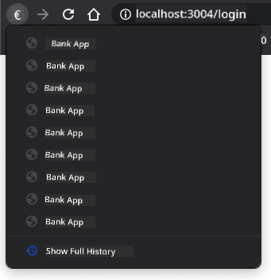

<!--
CO_OP_TRANSLATOR_METADATA:
{
  "original_hash": "8da1b5e2c63f749808858c53f37b8ce7",
  "translation_date": "2025-08-28T11:21:18+00:00",
  "source_file": "7-bank-project/1-template-route/README.md",
  "language_code": "en"
}
-->
# Build a Banking App Part 1: HTML Templates and Routes in a Web App

## Pre-Lecture Quiz

[Pre-lecture quiz](https://ff-quizzes.netlify.app/web/quiz/41)

### Introduction

Since JavaScript was introduced in browsers, websites have become more interactive and complex than ever before. Web technologies are now commonly used to create fully functional applications that run directly in a browser, known as [web applications](https://en.wikipedia.org/wiki/Web_application). Because web apps are highly interactive, users don't want to wait for a full page reload every time they perform an action. This is why JavaScript is used to update the HTML directly via the DOM, providing a smoother user experience.

In this lesson, we'll lay the groundwork for creating a banking web app. We'll use HTML templates to create multiple screens that can be displayed and updated without reloading the entire HTML page.

### Prerequisite

You need a local web server to test the web app we'll build in this lesson. If you don't already have one, you can install [Node.js](https://nodejs.org) and use the command `npx lite-server` from your project folder. This will create a local web server and open your app in a browser.

### Preparation

On your computer, create a folder named `bank` with a file named `index.html` inside it. We'll start with this HTML [boilerplate](https://en.wikipedia.org/wiki/Boilerplate_code):

```html
<!DOCTYPE html>
<html lang="en">
  <head>
    <meta charset="UTF-8">
    <meta name="viewport" content="width=device-width, initial-scale=1.0">
    <title>Bank App</title>
  </head>
  <body>
    <!-- This is where you'll work -->
  </body>
</html>
```

---

## HTML templates

If you want to create multiple screens for a web page, one option is to create a separate HTML file for each screen you want to display. However, this approach has some drawbacks:

- The entire HTML page has to reload when switching screens, which can be slow.
- Sharing data between different screens becomes more difficult.

An alternative approach is to use a single HTML file and define multiple [HTML templates](https://developer.mozilla.org/docs/Web/HTML/Element/template) using the `<template>` element. A template is a reusable block of HTML that isn't displayed by the browser until it's instantiated at runtime using JavaScript.

### Task

We'll create a banking app with two screens: a login page and a dashboard. First, let's add a placeholder element in the HTML body that we'll use to instantiate the different screens of our app:

```html
<div id="app">Loading...</div>
```

We're assigning it an `id` to make it easier to locate with JavaScript later.

> Tip: Since the content of this element will be replaced, you can add a loading message or indicator that will be displayed while the app is loading.

Next, let's add an HTML template for the login page below the placeholder. For now, we'll include only a title and a section containing a link for navigation.

```html
<template id="login">
  <h1>Bank App</h1>
  <section>
    <a href="/dashboard">Login</a>
  </section>
</template>
```

Then, we'll add another HTML template for the dashboard page. This page will include several sections:

- A header with a title and a logout link
- The current balance of the bank account
- A list of transactions displayed in a table

```html
<template id="dashboard">
  <header>
    <h1>Bank App</h1>
    <a href="/login">Logout</a>
  </header>
  <section>
    Balance: 100$
  </section>
  <section>
    <h2>Transactions</h2>
    <table>
      <thead>
        <tr>
          <th>Date</th>
          <th>Object</th>
          <th>Amount</th>
        </tr>
      </thead>
      <tbody></tbody>
    </table>
  </section>
</template>
```

> Tip: When creating HTML templates, if you want to preview how they will look, you can comment out the `<template>` and `</template>` lines by enclosing them with `<!-- -->`.

✅ Why do you think we use `id` attributes on the templates? Could we use something else, like classes?

## Displaying templates with JavaScript

If you try opening your current HTML file in a browser, you'll see that it gets stuck displaying `Loading...`. This happens because we need to add JavaScript code to instantiate and display the HTML templates.

Instantiating a template typically involves three steps:

1. Retrieve the template element from the DOM, for example using [`document.getElementById`](https://developer.mozilla.org/docs/Web/API/Document/getElementById).
2. Clone the template element using [`cloneNode`](https://developer.mozilla.org/docs/Web/API/Node/cloneNode).
3. Attach it to the DOM under a visible element, for example using [`appendChild`](https://developer.mozilla.org/docs/Web/API/Node/appendChild).

✅ Why do we need to clone the template before attaching it to the DOM? What do you think would happen if we skipped this step?

### Task

Create a new file named `app.js` in your project folder and import it in the `<head>` section of your HTML:

```html
<script src="app.js" defer></script>
```

Now, in `app.js`, we'll create a new function called `updateRoute`:

```js
function updateRoute(templateId) {
  const template = document.getElementById(templateId);
  const view = template.content.cloneNode(true);
  const app = document.getElementById('app');
  app.innerHTML = '';
  app.appendChild(view);
}
```

Here, we follow the three steps described above. We instantiate the template with the `id` `templateId` and place its cloned content within our app placeholder. Note that we use `cloneNode(true)` to copy the entire subtree of the template.

Now call this function with one of the templates and observe the result.

```js
updateRoute('login');
```

✅ What's the purpose of this code `app.innerHTML = '';`? What happens if we omit it?

## Creating routes

In the context of a web app, *Routing* refers to mapping **URLs** to specific screens that should be displayed. On a website with multiple HTML files, this happens automatically because the file paths are reflected in the URL. For example, with these files in your project folder:

```
mywebsite/index.html
mywebsite/login.html
mywebsite/admin/index.html
```

If you create a web server with `mywebsite` as the root, the URL mapping will be:

```
https://site.com            --> mywebsite/index.html
https://site.com/login.html --> mywebsite/login.html
https://site.com/admin/     --> mywebsite/admin/index.html
```

However, since our web app uses a single HTML file containing all the screens, this default behavior won't help us. We'll need to create this mapping manually and update the displayed template using JavaScript.

### Task

We'll use a simple object to implement a [map](https://en.wikipedia.org/wiki/Associative_array) between URL paths and our templates. Add this object at the top of your `app.js` file:

```js
const routes = {
  '/login': { templateId: 'login' },
  '/dashboard': { templateId: 'dashboard' },
};
```

Next, let's modify the `updateRoute` function slightly. Instead of passing the `templateId` directly as an argument, we'll retrieve it by first checking the current URL and then using our map to get the corresponding template ID. We can use [`window.location.pathname`](https://developer.mozilla.org/docs/Web/API/Location/pathname) to extract the path section from the URL.

```js
function updateRoute() {
  const path = window.location.pathname;
  const route = routes[path];

  const template = document.getElementById(route.templateId);
  const view = template.content.cloneNode(true);
  const app = document.getElementById('app');
  app.innerHTML = '';
  app.appendChild(view);
}
```

Here, we map the routes we defined to their corresponding templates. You can test this by manually changing the URL in your browser.

✅ What happens if you enter an unknown path in the URL? How could we address this?

## Adding navigation

The next step for our app is to enable navigation between pages without manually changing the URL. This involves two things:

1. Updating the current URL
2. Updating the displayed template based on the new URL

We've already handled the second part with the `updateRoute` function, so now we need to figure out how to update the current URL.

We'll use JavaScript, specifically the [`history.pushState`](https://developer.mozilla.org/docs/Web/API/History/pushState) method, which allows us to update the URL and create a new entry in the browsing history without reloading the HTML.

> Note: While the HTML anchor element [`<a href>`](https://developer.mozilla.org/docs/Web/HTML/Element/a) can create hyperlinks to different URLs, it will cause the browser to reload the HTML by default. To prevent this behavior when handling routing with custom JavaScript, use the `preventDefault()` function on the click event.

### Task

Let's create a new function for navigating within our app:

```js
function navigate(path) {
  window.history.pushState({}, path, path);
  updateRoute();
}
```

This method first updates the current URL based on the given path, then updates the template. The property `window.location.origin` returns the URL root, allowing us to construct a complete URL from a given path.

Now that we have this function, we can address the issue of undefined paths. We'll modify the `updateRoute` function to add a fallback to one of the existing routes if no match is found.

```js
function updateRoute() {
  const path = window.location.pathname;
  const route = routes[path];

  if (!route) {
    return navigate('/login');
  }

  ...
```

If a route cannot be found, we'll now redirect to the `login` page.

Next, let's create a function to handle URL retrieval when a link is clicked and prevent the browser's default link behavior:

```js
function onLinkClick(event) {
  event.preventDefault();
  navigate(event.target.href);
}
```

Finally, let's complete the navigation system by adding bindings to our *Login* and *Logout* links in the HTML.

```html
<a href="/dashboard" onclick="onLinkClick(event)">Login</a>
...
<a href="/login" onclick="onLinkClick(event)">Logout</a>
```

The `event` object captures the `click` event and passes it to our `onLinkClick` function.

Using the [`onclick`](https://developer.mozilla.org/docs/Web/API/GlobalEventHandlers/onclick) attribute, bind the `click` event to JavaScript code, specifically the `navigate()` function.

Try clicking on these links—you should now be able to navigate between the different screens of your app.

✅ The `history.pushState` method is part of the HTML5 standard and supported by [all modern browsers](https://caniuse.com/?search=pushState). If you're building a web app for older browsers, you can use a [hash (`#`)](https://en.wikipedia.org/wiki/URI_fragment) before the path to implement routing that works with regular anchor navigation and doesn't reload the page. This was originally intended for creating internal links within a page.

## Handling the browser's back and forward buttons

Using `history.pushState` creates new entries in the browser's navigation history. You can check this by holding the *back button* of your browser—it should display something like this:



If you try clicking the back button a few times, you'll notice that the current URL changes and the history is updated, but the same template remains displayed.

This happens because the app doesn't know it needs to call `updateRoute()` whenever the history changes. According to the [`history.pushState` documentation](https://developer.mozilla.org/docs/Web/API/History/pushState), the [`popstate`](https://developer.mozilla.org/docs/Web/API/Window/popstate_event) event is triggered when the state changes (i.e., when we navigate to a different URL). We'll use this event to fix the issue.

### Task

To ensure the displayed template updates when the browser history changes, we'll attach a new function that calls `updateRoute()`. Add this at the bottom of your `app.js` file:

```js
window.onpopstate = () => updateRoute();
updateRoute();
```

> Note: We used an [arrow function](https://developer.mozilla.org/docs/Web/JavaScript/Reference/Functions/Arrow_functions) to declare our `popstate` event handler for brevity, but a regular function would work just as well.

Here's a refresher video on arrow functions:

[](https://youtube.com/watch?v=OP6eEbOj2sc "Arrow Functions")

> 🎥 Click the image above for a video about arrow functions.

Now try using your browser's back and forward buttons. The displayed route should update correctly this time.

---

## 🚀 Challenge

Add a new template and route for a third page that displays the credits for this app.

## Post-Lecture Quiz

[Post-lecture quiz](https://ff-quizzes.netlify.app/web/quiz/42)

## Review & Self Study

Routing is one of the surprisingly tricky parts of web development, especially as the web transitions from page refresh behaviors to Single Page Application page refreshes. Read about [how the Azure Static Web App service](https://docs.microsoft.com/azure/static-web-apps/routes/?WT.mc_id=academic-77807-sagibbon) handles routing. Can you explain why some of the decisions described in that document are necessary?

## Assignment

[Improve the routing](assignment.md)

---

**Disclaimer**:  
This document has been translated using the AI translation service [Co-op Translator](https://github.com/Azure/co-op-translator). While we aim for accuracy, please note that automated translations may include errors or inaccuracies. The original document in its native language should be regarded as the authoritative source. For critical information, professional human translation is advised. We are not responsible for any misunderstandings or misinterpretations resulting from the use of this translation.