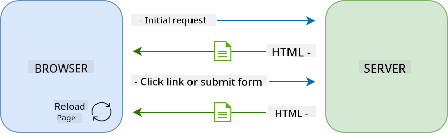
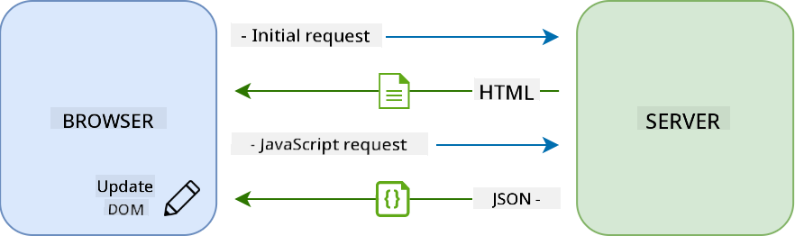

<!--
CO_OP_TRANSLATOR_METADATA:
{
  "original_hash": "89d0df9854ed020f155e94882ae88d4c",
  "translation_date": "2025-08-29T13:15:47+00:00",
  "source_file": "7-bank-project/3-data/README.md",
  "language_code": "en"
}
-->
# Build a Banking App Part 3: Methods of Fetching and Using Data

## Pre-Lecture Quiz

[Pre-lecture quiz](https://ff-quizzes.netlify.app/web/quiz/45)

### Introduction

Data is the backbone of every web application. It comes in various forms, but its primary purpose is to present information to users. As web apps grow more interactive and complex, how users access and interact with this information has become a crucial aspect of web development.

In this lesson, we'll explore how to fetch data asynchronously from a server and use it to display information on a web page without reloading the HTML.

### Prerequisite

Before starting this lesson, you should have completed the [Login and Registration Form](../2-forms/README.md) section of the web app. Additionally, ensure you have installed [Node.js](https://nodejs.org) and [run the server API](../api/README.md) locally to access account data.

You can verify that the server is running correctly by executing the following command in a terminal:

```sh
curl http://localhost:5000/api
# -> should return "Bank API v1.0.0" as a result
```

---

## AJAX and data fetching

Traditional websites update their content when users click a link or submit a form by reloading the entire HTML page. Each time new data is needed, the web server sends back a fresh HTML page, which the browser processes. This interrupts the user's current action and limits interactions during the reload. This approach is known as a *Multi-Page Application* or *MPA*.



As web applications became more interactive and complex, a technique called [AJAX (Asynchronous JavaScript and XML)](https://en.wikipedia.org/wiki/Ajax_(programming)) was introduced. AJAX allows web apps to send and retrieve data from a server asynchronously using JavaScript, without reloading the HTML page. This results in faster updates and smoother user experiences. Once new data is received, JavaScript can update the current HTML page using the [DOM](https://developer.mozilla.org/docs/Web/API/Document_Object_Model) API. Over time, this approach evolved into what is now known as a [*Single-Page Application* or *SPA*](https://en.wikipedia.org/wiki/Single-page_application).



Initially, the only API available for asynchronous data fetching was [`XMLHttpRequest`](https://developer.mozilla.org/docs/Web/API/XMLHttpRequest/Using_XMLHttpRequest). However, modern browsers now support the more convenient and powerful [`Fetch` API](https://developer.mozilla.org/docs/Web/API/Fetch_API), which uses promises and is better suited for handling JSON data.

> While all modern browsers support the `Fetch API`, if you want your web application to work on older browsers, it's a good idea to check the [compatibility table on caniuse.com](https://caniuse.com/fetch) first.

### Task

In [the previous lesson](../2-forms/README.md), we implemented the registration form to create an account. Now, we'll add code to log in using an existing account and fetch its data. Open the `app.js` file and add a new `login` function:

```js
async function login() {
  const loginForm = document.getElementById('loginForm')
  const user = loginForm.user.value;
}
```

Here, we start by retrieving the form element using `getElementById()`. Then, we get the username from the input field using `loginForm.user.value`. Each form control can be accessed by its name (defined in the HTML using the `name` attribute) as a property of the form.

Similar to the registration process, we'll create another function to send a server request, but this time to retrieve account data:

```js
async function getAccount(user) {
  try {
    const response = await fetch('//localhost:5000/api/accounts/' + encodeURIComponent(user));
    return await response.json();
  } catch (error) {
    return { error: error.message || 'Unknown error' };
  }
}
```

We use the `fetch` API to request data asynchronously from the server. This time, we don't need any extra parameters other than the URL, as we're only querying data. By default, `fetch` creates a [`GET`](https://developer.mozilla.org/docs/Web/HTTP/Methods/GET) HTTP request, which is exactly what we need here.

✅ `encodeURIComponent()` is a function that escapes special characters for URLs. What problems might arise if we don't use this function and directly include the `user` value in the URL?

Next, we'll update our `login` function to use `getAccount`:

```js
async function login() {
  const loginForm = document.getElementById('loginForm')
  const user = loginForm.user.value;
  const data = await getAccount(user);

  if (data.error) {
    return console.log('loginError', data.error);
  }

  account = data;
  navigate('/dashboard');
}
```

Since `getAccount` is an asynchronous function, we use the `await` keyword to wait for the server's response. As with any server request, we need to handle errors. For now, we'll simply log the error message and revisit this later.

After retrieving the user data, we need to store it somewhere for later use in displaying dashboard information. Since the `account` variable doesn't exist yet, we'll create a global variable for it at the top of our file:

```js
let account = null;
```

Once the user data is saved in a variable, we can navigate from the *login* page to the *dashboard* using the `navigate()` function we already have.

Finally, we need to call our `login` function when the login form is submitted. Update the HTML as follows:

```html
<form id="loginForm" action="javascript:login()">
```

Test the functionality by registering a new account and logging in with the same account.

Before moving on to the next section, let's complete the `register` function by adding this at the end of the function:

```js
account = result;
navigate('/dashboard');
```

✅ Did you know that by default, server APIs can only be called from the *same domain and port* as the web page you're viewing? This is a security mechanism enforced by browsers. But wait—our web app runs on `localhost:3000`, while the server API runs on `localhost:5000`. Why does it work? By using a technique called [Cross-Origin Resource Sharing (CORS)](https://developer.mozilla.org/docs/Web/HTTP/CORS), servers can add special headers to responses, allowing exceptions for specific domains.

> Learn more about APIs by taking this [lesson](https://docs.microsoft.com/learn/modules/use-apis-discover-museum-art/?WT.mc_id=academic-77807-sagibbon)

## Update HTML to display data

Now that we have the user data, we need to update the existing HTML to display it. We already know how to retrieve an element from the DOM using methods like `document.getElementById()`. Once you have a base element, here are some APIs you can use to modify it or add child elements:

- Use the [`textContent`](https://developer.mozilla.org/docs/Web/API/Node/textContent) property to change an element's text. Note that changing this value removes all the element's children (if any) and replaces them with the provided text. This makes it an efficient way to remove all children of an element by assigning an empty string `''`.

- Use [`document.createElement()`](https://developer.mozilla.org/docs/Web/API/Document/createElement) along with the [`append()`](https://developer.mozilla.org/docs/Web/API/ParentNode/append) method to create and attach new child elements.

✅ The [`innerHTML`](https://developer.mozilla.org/docs/Web/API/Element/innerHTML) property can also be used to change an element's HTML content, but it should be avoided as it is vulnerable to [cross-site scripting (XSS)](https://developer.mozilla.org/docs/Glossary/Cross-site_scripting) attacks.

### Task

Before moving on to the dashboard screen, let's address an issue on the *login* page. Currently, if you try to log in with a username that doesn't exist, an error message appears in the console, but the user doesn't see anything on the screen.

Let's add a placeholder element in the login form to display error messages. A good spot would be just before the login `<button>`:

```html
...
<div id="loginError"></div>
<button>Login</button>
...
```

This `<div>` element is empty, meaning nothing will be displayed until we add content to it. We also assign it an `id` for easy retrieval with JavaScript.

Next, go to the `app.js` file and create a helper function `updateElement`:

```js
function updateElement(id, text) {
  const element = document.getElementById(id);
  element.textContent = text;
}
```

This function is simple: given an element *id* and *text*, it updates the text content of the DOM element with the matching `id`. Replace the previous error message in the `login` function with this method:

```js
if (data.error) {
  return updateElement('loginError', data.error);
}
```

Now, if you try to log in with an invalid account, you'll see something like this:


While the error text is visually displayed, screen readers won't announce it. To ensure dynamically added text is accessible to screen readers, we need to use a [Live Region](https://developer.mozilla.org/docs/Web/Accessibility/ARIA/ARIA_Live_Regions). We'll use a specific type of live region called an alert:

```html
<div id="loginError" role="alert"></div>
```

Apply the same behavior for error messages in the `register` function (don't forget to update the HTML).

## Display information on the dashboard

Using the techniques we've just learned, we'll display the account information on the dashboard page.

Here's an example of an account object received from the server:

```json
{
  "user": "test",
  "currency": "$",
  "description": "Test account",
  "balance": 75,
  "transactions": [
    { "id": "1", "date": "2020-10-01", "object": "Pocket money", "amount": 50 },
    { "id": "2", "date": "2020-10-03", "object": "Book", "amount": -10 },
    { "id": "3", "date": "2020-10-04", "object": "Sandwich", "amount": -5 }
  ],
}
```

> Note: To simplify testing, you can use the pre-existing `test` account, which already contains data.

### Task

Start by replacing the "Balance" section in the HTML with placeholder elements:

```html
<section>
  Balance: <span id="balance"></span><span id="currency"></span>
</section>
```

Next, add a new section below to display the account description:

```html
<h2 id="description"></h2>
```

✅ Since the account description serves as a title for the content below it, it is marked up semantically as a heading. Learn more about the importance of [heading structure](https://www.nomensa.com/blog/2017/how-structure-headings-web-accessibility) for accessibility, and review the page to identify other potential headings.

Now, create a new function in `app.js` to populate the placeholders:

```js
function updateDashboard() {
  if (!account) {
    return navigate('/login');
  }

  updateElement('description', account.description);
  updateElement('balance', account.balance.toFixed(2));
  updateElement('currency', account.currency);
}
```

First, ensure the account data is available before proceeding. Then, use the `updateElement()` function to update the HTML.

> To make the balance display more user-friendly, we use the [`toFixed(2)`](https://developer.mozilla.org/docs/Web/JavaScript/Reference/Global_Objects/Number/toFixed) method to format the value with two decimal places.

Call the `updateDashboard()` function every time the dashboard is loaded. If you've completed the [lesson 1 assignment](../1-template-route/assignment.md), this should be straightforward. Otherwise, use the following implementation.

Add this code to the end of the `updateRoute()` function:

```js
if (typeof route.init === 'function') {
  route.init();
}
```

Update the route definitions with:

```js
const routes = {
  '/login': { templateId: 'login' },
  '/dashboard': { templateId: 'dashboard', init: updateDashboard }
};
```

With this change, the `updateDashboard()` function will be called whenever the dashboard page is displayed. After logging in, you should see the account balance, currency, and description.

## Create table rows dynamically with HTML templates

In the [first lesson](../1-template-route/README.md), we used HTML templates along with the [`appendChild()`](https://developer.mozilla.org/docs/Web/API/Node/appendChild) method to implement navigation in our app. Templates can also be smaller and used to dynamically populate repetitive parts of a page.

We'll use a similar approach to display the list of transactions in the HTML table.

### Task

Add a new template to the HTML `<body>`:

```html
<template id="transaction">
  <tr>
    <td></td>
    <td></td>
    <td></td>
  </tr>
</template>
```

This template represents a single table row with three columns: *date*, *object*, and *amount* of a transaction.

Next, add an `id` property to the `<tbody>` element of the table within the dashboard template for easier JavaScript access:

```html
<tbody id="transactions"></tbody>
```

Now that the HTML is ready, switch to JavaScript and create a new function `createTransactionRow`:

```js
function createTransactionRow(transaction) {
  const template = document.getElementById('transaction');
  const transactionRow = template.content.cloneNode(true);
  const tr = transactionRow.querySelector('tr');
  tr.children[0].textContent = transaction.date;
  tr.children[1].textContent = transaction.object;
  tr.children[2].textContent = transaction.amount.toFixed(2);
  return transactionRow;
}
```

This function uses the template to create a new table row and fills its contents with transaction data. Use this function in `updateDashboard()` to populate the table:

```js
const transactionsRows = document.createDocumentFragment();
for (const transaction of account.transactions) {
  const transactionRow = createTransactionRow(transaction);
  transactionsRows.appendChild(transactionRow);
}
updateElement('transactions', transactionsRows);
```

Here, we use [`document.createDocumentFragment()`](https://developer.mozilla.org/docs/Web/API/Document/createDocumentFragment) to create a new DOM fragment for working on before attaching it to the HTML table.

Finally, update the `updateElement()` function to support both text and DOM Nodes:

```js
function updateElement(id, textOrNode) {
  const element = document.getElementById(id);
  element.textContent = ''; // Removes all children
  element.append(textOrNode);
}
```

The [`append()`](https://developer.mozilla.org/docs/Web/API/ParentNode/append) method allows us to attach either text or [DOM Nodes](https://developer.mozilla.org/docs/Web/API/Node) to a parent element, making it versatile for all our use cases.
If you try using the `test` account to log in, you should now see a transaction list on the dashboard 🎉.

---

## 🚀 Challenge

Work together to make the dashboard page resemble a real banking app. If you've already styled your app, try using [media queries](https://developer.mozilla.org/docs/Web/CSS/Media_Queries) to create a [responsive design](https://developer.mozilla.org/docs/Web/Progressive_web_apps/Responsive/responsive_design_building_blocks) that works well on both desktop and mobile devices.

Here's an example of a styled dashboard page:


## Post-Lecture Quiz

[Post-lecture quiz](https://ff-quizzes.netlify.app/web/quiz/46)

## Assignment

[Refactor and comment your code](assignment.md)

---

**Disclaimer**:  
This document has been translated using the AI translation service [Co-op Translator](https://github.com/Azure/co-op-translator). While we strive for accuracy, please note that automated translations may contain errors or inaccuracies. The original document in its native language should be regarded as the authoritative source. For critical information, professional human translation is recommended. We are not responsible for any misunderstandings or misinterpretations resulting from the use of this translation.