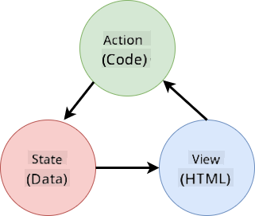
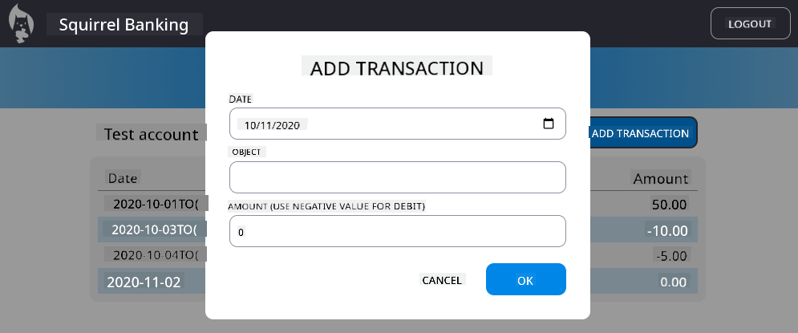

<!--
CO_OP_TRANSLATOR_METADATA:
{
  "original_hash": "4fa20c513e367e9cdd401bf49ae16e33",
  "translation_date": "2025-08-28T11:19:15+00:00",
  "source_file": "7-bank-project/4-state-management/README.md",
  "language_code": "en"
}
-->
# Build a Banking App Part 4: Concepts of State Management

## Pre-Lecture Quiz

[Pre-lecture quiz](https://ashy-river-0debb7803.1.azurestaticapps.net/quiz/47)

### Introduction

As a web application grows, managing data flows becomes increasingly challenging. Which code retrieves the data, which page uses it, where and when it needs to be updated...it’s easy to end up with messy code that’s hard to maintain. This is especially true when you need to share data across different pages of your app, such as user information. The concept of *state management* has always been present in all types of programs, but as web apps grow in complexity, it has become a critical aspect to consider during development.

In this final part, we’ll revisit the app we built to improve how the state is managed, enabling browser refresh support at any point and ensuring data persists across user sessions.

### Prerequisite

You need to have completed the [data fetching](../3-data/README.md) section of the web app for this lesson. Additionally, you need to install [Node.js](https://nodejs.org) and [run the server API](../api/README.md) locally to manage account data.

You can verify that the server is running correctly by executing this command in a terminal:

```sh
curl http://localhost:5000/api
# -> should return "Bank API v1.0.0" as a result
```

---

## Rethink state management

In the [previous lesson](../3-data/README.md), we introduced a basic concept of state in our app using the global `account` variable, which holds the bank data for the currently logged-in user. However, our current implementation has some shortcomings. Try refreshing the page while on the dashboard. What happens?

There are three issues with the current code:

- The state is not persistent, so refreshing the browser takes you back to the login page.
- Multiple functions modify the state, which can make tracking changes difficult as the app grows. It’s easy to forget to update one.
- The state is not cleared properly, meaning that when you click *Logout*, the account data remains even though you’re on the login page.

We could address these issues one by one, but that would lead to more code duplication and make the app harder to maintain. Alternatively, we could pause for a moment and rethink our approach.

> What problems are we really trying to solve here?

[State management](https://en.wikipedia.org/wiki/State_management) is about finding a good strategy to address these two key challenges:

- How to keep the data flows in an app easy to understand?
- How to ensure the state data is always synchronized with the user interface (and vice versa)?

Once these challenges are addressed, other issues may either be resolved or become easier to tackle. There are many ways to approach these problems, but we’ll use a common solution that involves **centralizing the data and the methods to modify it**. The data flows would look like this:



> We won’t cover the part where data automatically triggers view updates here, as it involves more advanced concepts of [Reactive Programming](https://en.wikipedia.org/wiki/Reactive_programming). It’s a great topic for a deeper dive if you’re interested.

✅ There are many libraries with different approaches to state management, [Redux](https://redux.js.org) being a popular choice. Exploring its concepts and patterns can help you understand potential issues in large web apps and how to solve them.

### Task

Let’s start with some refactoring. Replace the `account` declaration:

```js
let account = null;
```

With:

```js
let state = {
  account: null
};
```

The idea is to *centralize* all app data into a single state object. For now, we only have `account` in the state, so this change doesn’t make a big difference, but it sets the stage for future enhancements.

We also need to update the functions that use it. In the `register()` and `login()` functions, replace `account = ...` with `state.account = ...`;

At the top of the `updateDashboard()` function, add this line:

```js
const account = state.account;
```

This refactoring doesn’t bring significant improvements on its own, but it lays the groundwork for the next changes.

## Track data changes

Now that we’ve introduced the `state` object to store our data, the next step is to centralize updates. This makes it easier to track changes and when they occur.

To prevent direct modifications to the `state` object, it’s a good practice to treat it as [*immutable*](https://en.wikipedia.org/wiki/Immutable_object), meaning it cannot be altered directly. Instead, you create a new state object whenever you want to make changes. This approach helps avoid unwanted [side effects](https://en.wikipedia.org/wiki/Side_effect_(computer_science)) and opens up possibilities for features like undo/redo functionality, while also simplifying debugging. For instance, you could log every state change and maintain a history to trace the source of a bug.

In JavaScript, you can use [`Object.freeze()`](https://developer.mozilla.org/docs/Web/JavaScript/Reference/Global_Objects/Object/freeze) to make an object immutable. Attempting to modify an immutable object will raise an exception.

✅ Do you know the difference between a *shallow* and a *deep* immutable object? You can learn more [here](https://developer.mozilla.org/docs/Web/JavaScript/Reference/Global_Objects/Object/freeze#What_is_shallow_freeze).

### Task

Let’s create a new `updateState()` function:

```js
function updateState(property, newData) {
  state = Object.freeze({
    ...state,
    [property]: newData
  });
}
```

In this function, we create a new state object and copy data from the previous state using the [*spread (`...`) operator*](https://developer.mozilla.org/docs/Web/JavaScript/Reference/Operators/Spread_syntax#Spread_in_object_literals). Then, we override a specific property of the state object with new data using the [bracket notation](https://developer.mozilla.org/docs/Web/JavaScript/Guide/Working_with_Objects#Objects_and_properties) `[property]`. Finally, we lock the object to prevent modifications using `Object.freeze()`. Currently, the state only contains the `account` property, but this approach allows you to add more properties as needed.

We’ll also update the `state` initialization to ensure the initial state is frozen:

```js
let state = Object.freeze({
  account: null
});
```

Next, update the `register` function by replacing `state.account = result;` with:

```js
updateState('account', result);
```

Do the same for the `login` function, replacing `state.account = data;` with:

```js
updateState('account', data);
```

Now, let’s address the issue of account data not being cleared when the user clicks *Logout*.

Create a new function `logout()`:

```js
function logout() {
  updateState('account', null);
  navigate('/login');
}
```

In `updateDashboard()`, replace the redirection `return navigate('/login');` with `return logout();`

Try registering a new account, logging out, and logging back in to ensure everything works correctly.

> Tip: You can monitor all state changes by adding `console.log(state)` at the bottom of `updateState()` and opening the browser’s developer tools console.

## Persist the state

Most web apps need to persist data to function properly. Critical data is typically stored in a database and accessed via a server API, like the user account data in our case. However, sometimes it’s useful to persist some data on the client side for a better user experience or improved loading performance.

When deciding to persist data in the browser, consider these questions:

- *Is the data sensitive?* Avoid storing sensitive data on the client, such as user passwords.
- *How long do you need to keep this data?* Will the data be used only for the current session, or should it be stored indefinitely?

There are various ways to store information in a web app, depending on your goals. For example, you can use URLs to store a search query and make it shareable. You can also use [HTTP cookies](https://developer.mozilla.org/docs/Web/HTTP/Cookies) for data that needs to be shared with the server, such as [authentication](https://en.wikipedia.org/wiki/Authentication) information.

Another option is to use browser APIs for storing data. Two particularly useful ones are:

- [`localStorage`](https://developer.mozilla.org/docs/Web/API/Window/localStorage): A [Key/Value store](https://en.wikipedia.org/wiki/Key%E2%80%93value_database) that persists data specific to the current website across sessions. The data never expires.
- [`sessionStorage`](https://developer.mozilla.org/docs/Web/API/Window/sessionStorage): Similar to `localStorage`, but the data is cleared when the browser session ends.

Both APIs only allow storing [strings](https://developer.mozilla.org/docs/Web/JavaScript/Reference/Global_Objects/String). To store complex objects, you’ll need to serialize them using [`JSON.stringify()`](https://developer.mozilla.org/docs/Web/JavaScript/Reference/Global_Objects/JSON/stringify).

✅ If you want to create a web app without a server, you can use the [`IndexedDB` API](https://developer.mozilla.org/docs/Web/API/IndexedDB_API) to create a client-side database. This is suitable for advanced use cases or when storing large amounts of data, though it’s more complex to use.

### Task

We want users to stay logged in until they explicitly click the *Logout* button, so we’ll use `localStorage` to store the account data. First, define a key for storing the data:

```js
const storageKey = 'savedAccount';
```

Then, add this line at the end of the `updateState()` function:

```js
localStorage.setItem(storageKey, JSON.stringify(state.account));
```

This ensures the user account data is persisted and always up-to-date, thanks to the centralized state updates we implemented earlier. This is where the benefits of our refactoring start to show 🙂.

Since the data is saved, we also need to restore it when the app loads. To organize the initialization code, create a new `init` function that includes the previous code at the bottom of `app.js`:

```js
function init() {
  const savedAccount = localStorage.getItem(storageKey);
  if (savedAccount) {
    updateState('account', JSON.parse(savedAccount));
  }

  // Our previous initialization code
  window.onpopstate = () => updateRoute();
  updateRoute();
}

init();
```

Here, we retrieve the saved data and update the state if any is found. It’s important to do this *before* updating the route, as some code may rely on the state during page updates.

We can also make the *Dashboard* page the default page of the app, as account data is now persisted. If no data is found, the dashboard will redirect to the *Login* page. In `updateRoute()`, replace the fallback `return navigate('/login');` with `return navigate('/dashboard');`.

Now log in to the app and try refreshing the page. You should remain on the dashboard. With this update, we’ve resolved all the initial issues...

## Refresh the data

...But we may have introduced a new one. Oops!

Go to the dashboard using the `test` account, then run this command in a terminal to create a new transaction:

```sh
curl --request POST \
     --header "Content-Type: application/json" \
     --data "{ \"date\": \"2020-07-24\", \"object\": \"Bought book\", \"amount\": -20 }" \
     http://localhost:5000/api/accounts/test/transactions
```

Now refresh the dashboard page in the browser. What happens? Do you see the new transaction?

The state is persisted indefinitely thanks to `localStorage`, but it’s never updated until you log out and log back in!

One way to fix this is to reload the account data every time the dashboard is loaded, ensuring the data stays fresh.

### Task

Create a new function `updateAccountData`:

```js
async function updateAccountData() {
  const account = state.account;
  if (!account) {
    return logout();
  }

  const data = await getAccount(account.user);
  if (data.error) {
    return logout();
  }

  updateState('account', data);
}
```

This function checks if the user is logged in and reloads the account data from the server.

Create another function named `refresh`:

```js
async function refresh() {
  await updateAccountData();
  updateDashboard();
}
```

This function updates the account data and refreshes the HTML of the dashboard page. It should be called whenever the dashboard route is loaded. Update the route definition with:

```js
const routes = {
  '/login': { templateId: 'login' },
  '/dashboard': { templateId: 'dashboard', init: refresh }
};
```

Now refresh the dashboard, and it should display the updated account data.

---

## 🚀 Challenge

Now that we reload the account data whenever the dashboard is loaded, do you think it’s still necessary to persist *all* the account data?

Work together to modify what is saved and loaded from `localStorage` to include only the data absolutely required for the app to function.

## Post-Lecture Quiz
[Post-lecture quiz](https://ashy-river-0debb7803.1.azurestaticapps.net/quiz/48)

## Assignment

[Implement "Add transaction" dialog](assignment.md)

Here's an example result after completing the assignment:



---

**Disclaimer**:  
This document has been translated using the AI translation service [Co-op Translator](https://github.com/Azure/co-op-translator). While we aim for accuracy, please note that automated translations may include errors or inaccuracies. The original document in its native language should be regarded as the authoritative source. For critical information, professional human translation is advised. We are not responsible for any misunderstandings or misinterpretations resulting from the use of this translation.