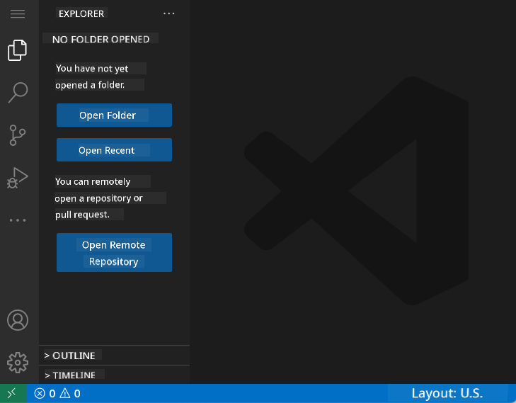
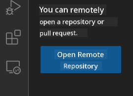
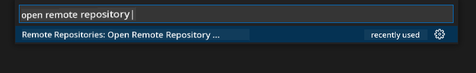
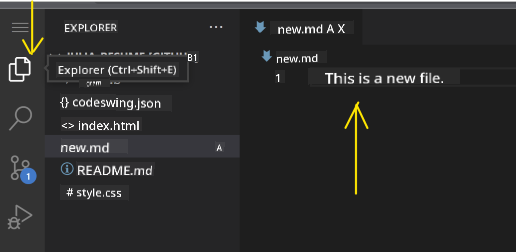
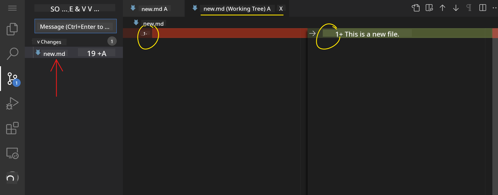
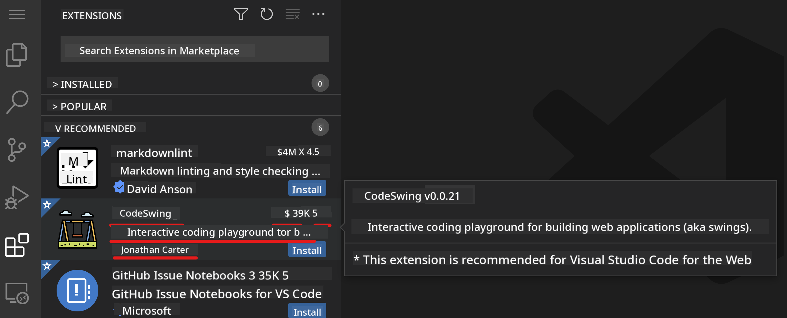
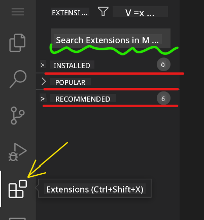
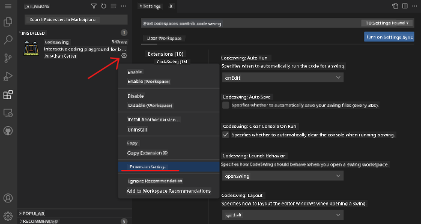

<!--
CO_OP_TRANSLATOR_METADATA:
{
  "original_hash": "1ba61d96a11309a2a6ea507496dcf7e5",
  "translation_date": "2025-08-29T13:25:55+00:00",
  "source_file": "8-code-editor/1-using-a-code-editor/README.md",
  "language_code": "en"
}
-->
# Using a code editor

This lesson introduces the basics of using [VSCode.dev](https://vscode.dev), a web-based code editor, so you can modify your code and contribute to a project without needing to install anything on your computer.

## Learning objectives

In this lesson, you will learn how to:

- Use a code editor in a coding project
- Track changes with version control
- Customize the editor for development

### Prerequisites

Before starting, you need to create an account on [GitHub](https://github.com). Visit [GitHub](https://github.com/) and sign up if you don’t already have an account.

### Introduction

A code editor is a vital tool for writing programs and collaborating on coding projects. Once you understand the basics of an editor and how to use its features, you can apply them to your coding tasks.

## Getting started with VSCode.dev

[VSCode.dev](https://vscode.dev) is a web-based code editor. You don’t need to install anything to use it—just open it like any other website. To get started, visit [https://vscode.dev](https://vscode.dev). If you’re not signed in to [GitHub](https://github.com/), follow the prompts to log in or create a new account.

Once it loads, the interface should look something like this:



There are three main sections, from left to right:

1. The _activity bar_, which includes icons like the magnifying glass 🔎, the gear ⚙️, and others.
2. The expanded activity bar, which defaults to the _Explorer_, also called the _side bar_.
3. The code area on the right.

Click on each icon to explore different menus. When finished, return to the _Explorer_ to start where you began.

When you create or modify code, it will happen in the large area on the right. This is also where you’ll view existing code, as you’ll see next.

## Open a GitHub repository

To begin, you need to open a GitHub repository. There are several ways to do this. Below are two methods for opening a repository so you can start making changes.

### 1. Using the editor

You can open a remote repository directly from the editor. When you visit [VSCode.dev](https://vscode.dev), you’ll see an _"Open Remote Repository"_ button:



Alternatively, you can use the command palette. The command palette is a search box where you can type commands or actions to find and execute them. Open it by selecting _View_ from the top-left menu, then choosing _Command Palette_, or by using the keyboard shortcut Ctrl-Shift-P (on macOS, Command-Shift-P).



Once the menu opens, type _open remote repository_ and select the first option. You’ll see a list of repositories you’re part of or have recently opened. You can also paste a full GitHub URL into the box. Use the following URL:

```
https://github.com/microsoft/Web-Dev-For-Beginners
```

✅ If successful, the repository’s files will load in the text editor.

### 2. Using the URL

You can also load a repository directly using its URL. For example, the full URL for the current repository is [https://github.com/microsoft/Web-Dev-For-Beginners](https://github.com/microsoft/Web-Dev-For-Beginners). Replace the GitHub domain with `VSCode.dev/github` to load the repository directly. The resulting URL would be [https://vscode.dev/github/microsoft/Web-Dev-For-Beginners](https://vscode.dev/github/microsoft/Web-Dev-For-Beginners).

## Edit files

Once the repository is open in your browser or vscode.dev, the next step is to make updates or changes to the project.

### 1. Create a new file

You can create a file in an existing folder or in the root directory. To create a new file, navigate to the desired location, click the _'New file ...'_ icon in the activity bar (on the left), name the file, and press Enter.


### 2. Edit and save a file in the repository

Using vscode.dev is convenient for making quick updates to your project without installing software locally. To update your code, click the _Explorer_ icon in the activity bar to view the repository’s files and folders. Select a file to open it in the code area, make your changes, and save.



After updating your project, click the _`source control`_ icon to view all the changes you’ve made to the repository.

To review your changes, select the file(s) in the `Changes` folder in the expanded activity bar. This will open a 'Working Tree' where you can visually inspect the changes. Red indicates deletions, while green shows additions.



If you’re satisfied with your changes, hover over the `Changes` folder and click the `+` button to stage them. Staging prepares your changes for committing to GitHub.

If you want to discard certain changes, hover over the `Changes` folder and click the `undo` icon.

Finally, type a `commit message` (a description of your changes), click the `check icon` to commit and push your changes.

When you’re done, click the `hamburger menu icon` in the top-left corner to return to the repository on github.com.


## Using extensions

Extensions in VSCode add new features and customization options to improve your development workflow. They also provide support for multiple programming languages and can be either general-purpose or language-specific.

To browse available extensions, click the _`Extensions icon`_ in the activity bar and type the extension’s name in the _'Search Extensions in Marketplace'_ field. You’ll see a list of extensions, each showing **the extension name, publisher, a brief description, download count**, and **star rating**.



You can also view:
- Previously installed extensions in the _`Installed folder`_
- Popular extensions in the _`Popular folder`_
- Recommended extensions based on your workspace or recently opened files in the _`Recommended folder`_



### 1. Install Extensions

To install an extension, type its name in the search field. Once it appears, click it to view more details in the code area. Then, click the _blue install button_ in either the activity bar or the code area.


### 2. Customize Extensions

After installing an extension, you may want to adjust its settings. To do this, click the _Extensions icon_, find your extension in the _Installed folder_, click the _**Gear icon**_, and navigate to _Extensions Setting_.



### 3. Manage Extensions

You can manage your extensions based on your needs. For example:

- **Disable:** Temporarily turn off an extension without uninstalling it.  
  To disable, select the installed extension in the activity bar, click the Gear icon, and choose 'Disable' or 'Disable (Workspace).' Alternatively, open the extension in the code area and click the blue Disable button.

- **Uninstall:** Remove an extension completely.  
  To uninstall, select the installed extension in the activity bar, click the Gear icon, and choose 'Uninstall.' Alternatively, open the extension in the code area and click the blue Uninstall button.

---

## Assignment

[Create a resume website using vscode.dev](https://github.com/microsoft/Web-Dev-For-Beginners/blob/main/8-code-editor/1-using-a-code-editor/assignment.md)

## Review & Self Study

Learn more about [VSCode.dev](https://code.visualstudio.com/docs/editor/vscode-web?WT.mc_id=academic-0000-alfredodeza) and its additional features.

---

**Disclaimer**:  
This document has been translated using the AI translation service [Co-op Translator](https://github.com/Azure/co-op-translator). While we strive for accuracy, please note that automated translations may contain errors or inaccuracies. The original document in its native language should be regarded as the authoritative source. For critical information, professional human translation is recommended. We are not responsible for any misunderstandings or misinterpretations resulting from the use of this translation.