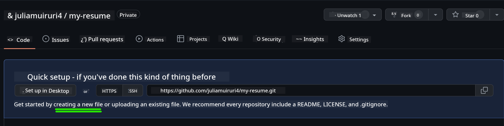
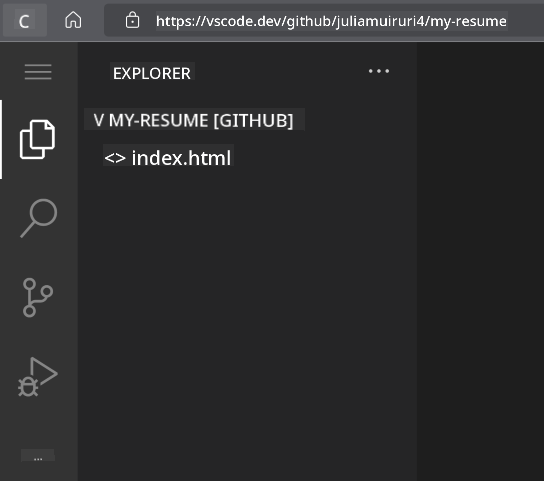
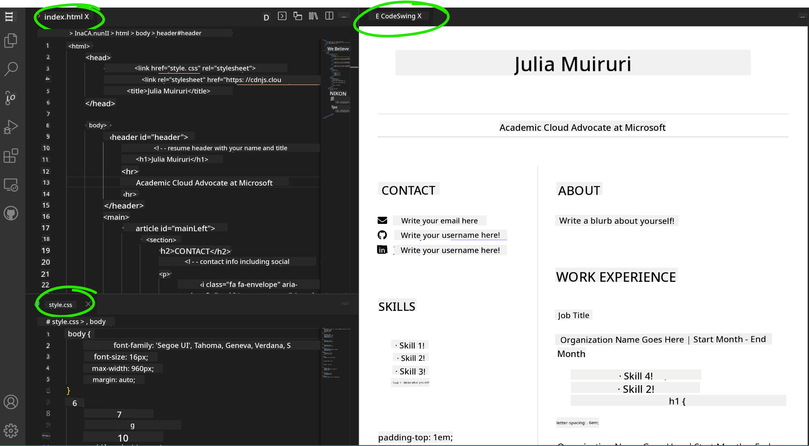

<!--
CO_OP_TRANSLATOR_METADATA:
{
  "original_hash": "bd3aa6d2b879c30ea496c43aec1c49ed",
  "translation_date": "2025-08-29T13:26:20+00:00",
  "source_file": "8-code-editor/1-using-a-code-editor/assignment.md",
  "language_code": "en"
}
-->
# Create a Resume Website Using vscode.dev

_How cool would it be to have a recruiter ask for your resume and you send them a URL?_ 😎

## Objectives

After completing this assignment, you will learn how to:

- Create a website to showcase your resume.

### Prerequisites

1. A GitHub account. Go to [GitHub](https://github.com/) and create an account if you don’t already have one.

## Steps

**Step 1:** Create a new GitHub repository and name it `my-resume`.

**Step 2:** Create an `index.html` file in your repository. We will add at least one file directly on github.com because you cannot open an empty repository on vscode.dev.

Click the `creating a new file` link, type the name `index.html`, and select the `Commit new file` button.



**Step 3:** Open [VSCode.dev](https://vscode.dev) and select the `Open Remote Repository` button.

Copy the URL of the repository you just created for your resume site and paste it into the input box:

_Replace `your-username` with your GitHub username._

```
https://github.com/your-username/my-resume
```

✅ If successful, you’ll see your project and the `index.html` file open in the text editor in your browser.



**Step 4:** Open the `index.html` file, paste the code below into your code area, and save.

<details>
    <summary><b>HTML code responsible for the content on your resume website.</b></summary>
    
        <html>

            <head>
                <link href="style.css" rel="stylesheet">
                <link rel="stylesheet" href="https://cdnjs.cloudflare.com/ajax/libs/font-awesome/5.15.4/css/all.min.css">
                <title>Your Name Goes Here!</title>
            </head>
            <body>
                <header id="header">
                    <!-- resume header with your name and title -->
                    <h1>Your Name Goes Here!</h1>
                    <hr>
                    Your Role!
                    <hr>
                </header>
                <main>
                    <article id="mainLeft">
                        <section>
                            <h2>CONTACT</h2>
                            <!-- contact info including social media -->
                            <p>
                                <i class="fa fa-envelope" aria-hidden="true"></i>
                                <a href="mailto:username@domain.top-level domain">Write your email here</a>
                            </p>
                            <p>
                                <i class="fab fa-github" aria-hidden="true"></i>
                                <a href="github.com/yourGitHubUsername">Write your username here!</a>
                            </p>
                            <p>
                                <i class="fab fa-linkedin" aria-hidden="true"></i>
                                <a href="linkedin.com/yourLinkedInUsername">Write your username here!</a>
                            </p>
                        </section>
                        <section>
                            <h2>SKILLS</h2>
                            <!-- your skills -->
                            <ul>
                                <li>Skill 1!</li>
                                <li>Skill 2!</li>
                                <li>Skill 3!</li>
                                <li>Skill 4!</li>
                            </ul>
                        </section>
                        <section>
                            <h2>EDUCATION</h2>
                            <!-- your education -->
                            <h3>Write your course here!</h3>
                            <p>
                                Write your institution here!
                            </p>
                            <p>
                                Start - End Date
                            </p>
                        </section>            
                    </article>
                    <article id="mainRight">
                        <section>
                            <h2>ABOUT</h2>
                            <!-- about you -->
                            <p>Write a blurb about yourself!</p>
                        </section>
                        <section>
                            <h2>WORK EXPERIENCE</h2>
                            <!-- your work experience -->
                            <h3>Job Title</h3>
                            <p>
                                Organization Name Goes Here | Start Month – End Month
                            </p>
                            <ul>
                                    <li>Task 1 - Write what you did!</li>
                                    <li>Task 2 - Write what you did!</li>
                                    <li>Write the outcomes/impact of your contribution</li>
                                    
                            </ul>
                            <h3>Job Title 2</h3>
                            <p>
                                Organization Name Goes Here | Start Month – End Month
                            </p>
                            <ul>
                                    <li>Task 1 - Write what you did!</li>
                                    <li>Task 2 - Write what you did!</li>
                                    <li>Write the outcomes/impact of your contribution</li>
                                    
                            </ul>
                        </section>
                    </article>
                </main>
            </body>
        </html>
</details>

Replace the _placeholder text_ in the HTML code with your resume details.

**Step 5:** Hover over the `my-resume` folder, click the `New File ...` icon, and create two new files in your project: `style.css` and `codeswing.json`.

**Step 6:** Open the `style.css` file, paste the code below, and save.

<details>
        <summary><b>CSS code to format the layout of the site.</b></summary>
            
            body {
                font-family: 'Segoe UI', Tahoma, Geneva, Verdana, sans-serif;
                font-size: 16px;
                max-width: 960px;
                margin: auto;
            }
            h1 {
                font-size: 3em;
                letter-spacing: .6em;
                padding-top: 1em;
                padding-bottom: 1em;
            }

            h2 {
                font-size: 1.5em;
                padding-bottom: 1em;
            }

            h3 {
                font-size: 1em;
                padding-bottom: 1em;
            }
            main { 
                display: grid;
                grid-template-columns: 40% 60%;
                margin-top: 3em;
            }
            header {
                text-align: center;
                margin: auto 2em;
            }

            section {
                margin: auto 1em 4em 2em;
            }

            i {
                margin-right: .5em;
            }

            p {
                margin: .2em auto
            }

            hr {
                border: none;
                background-color: lightgray;
                height: 1px;
            }

            h1, h2, h3 {
                font-weight: 100;
                margin-bottom: 0;
            }
            #mainLeft {
                border-right: 1px solid lightgray;
            }
            
</details>

**Step 6:** Open the `codeswing.json` file, paste the code below, and save.

    {
    "scripts": [],
    "styles": []
    }

**Step 7:** Install the `Codeswing` extension to preview the resume website in the code area.

Click the _`Extensions`_ icon on the activity bar and type in Codeswing. Either click the _blue install button_ on the expanded activity bar to install it or use the install button that appears in the code area once you select the extension to load additional information. After installing the extension, check your code area to see the changes to your project 😃.


This is what you will see on your screen after installing the extension.



If you’re satisfied with the changes you made, hover over the `Changes` folder and click the `+` button to stage the changes.

Type a commit message _(a description of the changes you made to the project)_ and commit your changes by clicking the `check`. Once you’re done working on your project, select the hamburger menu icon at the top left to return to the repository on GitHub.

Congratulations 🎉 You’ve just created your resume website using vscode.dev in a few steps.

## 🚀 Challenge

Open a remote repository where you have permissions to make changes and update some files. Next, try creating a new branch with your changes and make a Pull Request.

## Review & Self Study

Read more about [VSCode.dev](https://code.visualstudio.com/docs/editor/vscode-web?WT.mc_id=academic-0000-alfredodeza) and its other features.

---

**Disclaimer**:  
This document has been translated using the AI translation service [Co-op Translator](https://github.com/Azure/co-op-translator). While we strive for accuracy, please note that automated translations may contain errors or inaccuracies. The original document in its native language should be regarded as the authoritative source. For critical information, professional human translation is recommended. We are not responsible for any misunderstandings or misinterpretations resulting from the use of this translation.