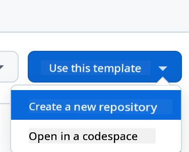
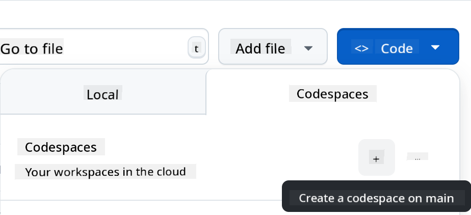

<!--
CO_OP_TRANSLATOR_METADATA:
{
  "original_hash": "cf15ff7770c5a484349383bb27d1131f",
  "translation_date": "2025-08-29T17:02:40+00:00",
  "source_file": "9-chat-project/README.md",
  "language_code": "en"
}
-->
# Chat project

This chat project demonstrates how to build a Chat Assistant using GitHub Models.

Here's what the completed project looks like:

<div>
  
</div>

To give some context, building Chat Assistants with generative AI is an excellent way to start learning about AI. In this lesson, you'll learn how to integrate generative AI into a web application. Let's get started.

## Connecting to generative AI

For the backend, we're using GitHub Models. It's a fantastic service that lets you use AI for free. Visit its playground and grab the code corresponding to your preferred backend language. Here's what it looks like at [GitHub Models Playground](https://github.com/marketplace/models/azure-openai/gpt-4o-mini/playground).

<div>
  
</div>

As mentioned, select the "Code" tab and choose your runtime.

<div>
  
</div>

In this example, we select Python, which means we'll use the following code:

```python
"""Run this model in Python

> pip install openai
"""
import os
from openai import OpenAI

# To authenticate with the model you will need to generate a personal access token (PAT) in your GitHub settings. 
# Create your PAT token by following instructions here: https://docs.github.com/en/authentication/keeping-your-account-and-data-secure/managing-your-personal-access-tokens
client = OpenAI(
    base_url="https://models.github.ai/inference",
    api_key=os.environ["GITHUB_TOKEN"],
)

response = client.chat.completions.create(
    messages=[
        {
            "role": "system",
            "content": "",
        },
        {
            "role": "user",
            "content": "What is the capital of France?",
        }
    ],
    model="openai/gpt-4o-mini",
    temperature=1,
    max_tokens=4096,
    top_p=1
)

print(response.choices[0].message.content)
```

Let's clean up this code a bit to make it reusable:

```python
def call_llm(prompt: str, system_message: str):
    response = client.chat.completions.create(
        messages=[
            {
                "role": "system",
                "content": system_message,
            },
            {
                "role": "user",
                "content": prompt,
            }
        ],
        model="openai/gpt-4o-mini",
        temperature=1,
        max_tokens=4096,
        top_p=1
    )

    return response.choices[0].message.content
```

With the `call_llm` function, we can now pass a prompt and a system prompt, and the function will return the result.

### Customize AI Assistant

To customize the AI assistant, you can define its behavior by setting the system prompt like this:

```python
call_llm("Tell me about you", "You're Albert Einstein, you only know of things in the time you were alive")
```

## Expose it via a Web API

Great, we've completed the AI part. Now let's integrate it into a Web API. For the Web API, we'll use Flask, but any web framework should work. Here's the code:

```python
# api.py
from flask import Flask, request, jsonify
from llm import call_llm
from flask_cors import CORS

app = Flask(__name__)
CORS(app)   # *   example.com

@app.route("/", methods=["GET"])
def index():
    return "Welcome to this API. Call POST /hello with 'message': 'my message' as JSON payload"


@app.route("/hello", methods=["POST"])
def hello():
    # get message from request body  { "message": "do this taks for me" }
    data = request.get_json()
    message = data.get("message", "")

    response = call_llm(message, "You are a helpful assistant.")
    return jsonify({
        "response": response
    })

if __name__ == "__main__":
    app.run(host="0.0.0.0", port=5000)
```

In this code, we create a Flask API and define two routes: "/" and "/chat". The "/chat" route is intended for the frontend to send questions to the backend.

To integrate *llm.py*, here's what we need to do:

- Import the `call_llm` function:

   ```python
   from llm import call_llm
   from flask import Flask, request
   ```

- Use it in the "/chat" route:

   ```python
   @app.route("/hello", methods=["POST"])
   def hello():
      # get message from request body  { "message": "do this taks for me" }
      data = request.get_json()
      message = data.get("message", "")

      response = call_llm(message, "You are a helpful assistant.")
      return jsonify({
         "response": response
      })
   ```

   In this step, we parse the incoming request to extract the `message` property from the JSON body. Then, we call the LLM using this function:

   ```python
   response = call_llm(message, "You are a helpful assistant")

   # return the response as JSON
   return jsonify({
      "response": response 
   })
   ```

That's it! We've completed the backend setup.

### Configure Cors

It's important to set up CORS (Cross-Origin Resource Sharing). Since the backend and frontend will run on different ports, we need to allow the frontend to communicate with the backend. Here's the code in *api.py* that handles this:

```python
from flask_cors import CORS

app = Flask(__name__)
CORS(app)   # *   example.com
```

Currently, it's configured to allow all origins ("*"), which is not secure. Make sure to restrict it when deploying to production.

## Run your project

Now that we have *llm.py* and *api.py*, here's how to run the backend:

- Install dependencies:

   ```sh
   cd backend
   python -m venv venv
   source ./venv/bin/activate

   pip install openai flask flask-cors openai
   ```

- Start the API:

   ```sh
   python api.py
   ```

   If you're using Codespaces, go to the Ports section at the bottom of the editor, right-click on the port, select "Port Visibility," and choose "Public."

### Work on a frontend

With the API up and running, let's create a frontend. We'll start with a basic frontend and improve it step by step. In a *frontend* folder, create the following:

```text
backend/
frontend/
index.html
app.js
styles.css
```

Start with **index.html**:

```html
<html>
    <head>
        <link rel="stylesheet" href="styles.css">
    </head>
    <body>
      <form>
        <textarea id="messages"></textarea>
        <input id="input" type="text" />
        <button type="submit" id="sendBtn">Send</button>  
      </form>  
      <script src="app.js" />
    </body>
</html>    
```

This is the bare minimum needed for a chat window. It includes a textarea for displaying messages, an input field for typing messages, and a button for sending messages to the backend. Next, let's look at the JavaScript in *app.js*.

**app.js**

```js
// app.js

(function(){
  // 1. set up elements  
  const messages = document.getElementById("messages");
  const form = document.getElementById("form");
  const input = document.getElementById("input");

  const BASE_URL = "change this";
  const API_ENDPOINT = `${BASE_URL}/hello`;

  // 2. create a function that talks to our backend
  async function callApi(text) {
    const response = await fetch(API_ENDPOINT, {
      method: "POST",
      headers: { "Content-Type": "application/json" },
      body: JSON.stringify({ message: text })
    });
    let json = await response.json();
    return json.response;
  }

  // 3. add response to our textarea
  function appendMessage(text, role) {
    const el = document.createElement("div");
    el.className = `message ${role}`;
    el.innerHTML = text;
    messages.appendChild(el);
  }

  // 4. listen to submit events
  form.addEventListener("submit", async(e) => {
    e.preventDefault();
   // someone clicked the button in the form
   
   // get input
   const text = input.value.trim();

   appendMessage(text, "user")

   // reset it
   input.value = '';

   const reply = await callApi(text);

   // add to messages
   appendMessage(reply, "assistant");

  })
})();
```

Here's a breakdown of the code:

1. We get references to all the elements we'll use later in the code.
2. This section defines a function that uses the built-in `fetch` method to call the backend.
3. The `appendMessage` function adds both the assistant's responses and the user's messages to the textarea.
4. We listen for the submit event, read the input field, display the user's message in the textarea, call the API, and render the assistant's response in the textarea.

Now let's move on to styling. You can get creative here, but here are some suggestions:

**styles.css**

```
.message {
    background: #222;
    box-shadow: 0 0 0 10px orange;
    padding: 10px:
    margin: 5px;
}

.message.user {
    background: blue;
}

.message.assistant {
    background: grey;
} 
```

These three classes style messages differently depending on whether they come from the assistant or the user. For inspiration, check out the `solution/frontend/styles.css` folder.

### Change Base URL

One thing we haven't set yet is the `BASE_URL`. This depends on where your backend is running. To set it:

- If you're running the API locally, use something like `http://localhost:5000`.
- If you're using Codespaces, it will look something like "[name]app.github.dev".

## Assignment

Create your own folder *project* with the following structure:

```text
project/
  frontend/
    index.html
    app.js
    styles.css
  backend/
    api.py
    llm.py
```

Copy the content from the instructions above, but feel free to customize it to your liking.

## Solution

[Solution](./solution/README.md)

## Bonus

Try changing the personality of the AI assistant. In *api.py*, you can modify the second argument in the `call_llm` function to define a different personality, for example:

```python
call_llm(message, "You are Captain Picard")
```

Also, customize the CSS and text to your liking by editing *index.html* and *styles.css*.

## Summary

Congratulations! You've learned how to create a personal assistant using AI from scratch. We used GitHub Models for the backend, Python for the API, and HTML, CSS, and JavaScript for the frontend.

## Set up with Codespaces

- Navigate to: [Web Dev For Beginners repo](https://github.com/microsoft/Web-Dev-For-Beginners).
- Create a repository from the template (make sure you're logged into GitHub) using the button in the top-right corner:

    

- Once you're in your repository, create a Codespace:

    

    This will launch an environment where you can start working.

---

**Disclaimer**:  
This document has been translated using the AI translation service [Co-op Translator](https://github.com/Azure/co-op-translator). While we aim for accuracy, please note that automated translations may include errors or inaccuracies. The original document in its native language should be regarded as the authoritative source. For critical information, professional human translation is advised. We are not responsible for any misunderstandings or misinterpretations resulting from the use of this translation.