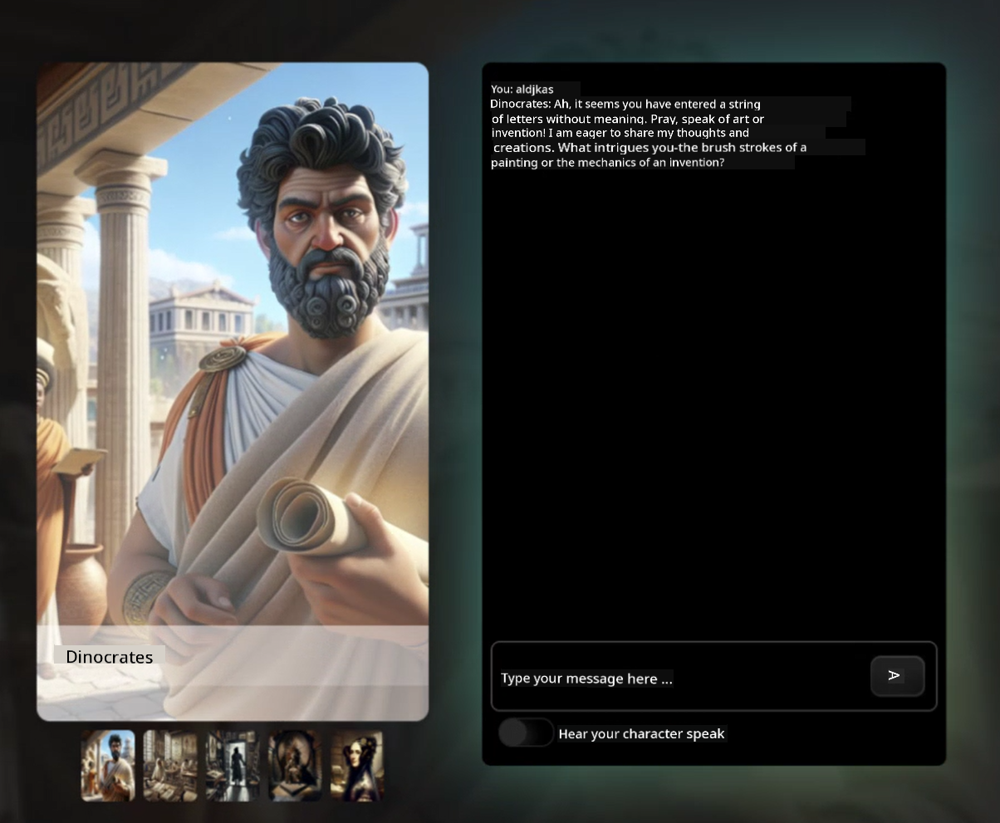
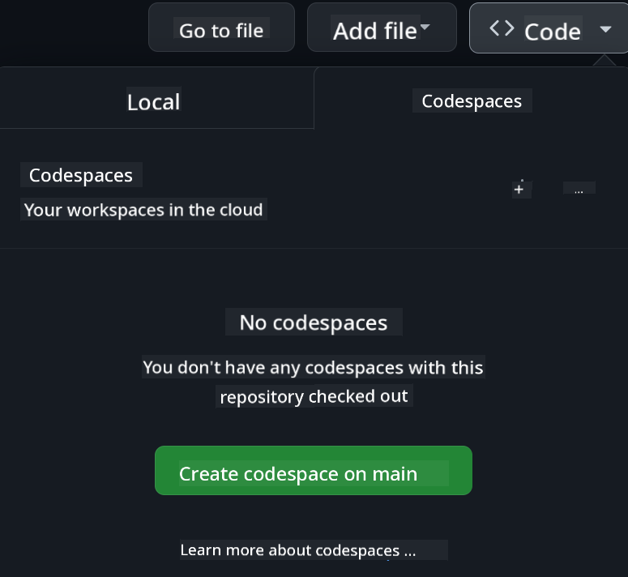

<!--
CO_OP_TRANSLATOR_METADATA:
{
  "original_hash": "1f45a6242179e3c001907339ab26af87",
  "translation_date": "2025-10-03T14:33:25+00:00",
  "source_file": "README.md",
  "language_code": "en"
}
-->
[](https://github.com/microsoft/Web-Dev-For-Beginners/blob/master/LICENSE)  
[](https://GitHub.com/microsoft/Web-Dev-For-Beginners/graphs/contributors/)  
[](https://GitHub.com/microsoft/Web-Dev-For-Beginners/issues/)  
[](https://GitHub.com/microsoft/Web-Dev-For-Beginners/pulls/)  
[](http://makeapullrequest.com)  

[](https://GitHub.com/microsoft/Web-Dev-For-Beginners/watchers/)  
[](https://GitHub.com/microsoft/Web-Dev-For-Beginners/network/)  
[](https://GitHub.com/microsoft/Web-Dev-For-Beginners/stargazers/)  

[](https://discord.gg/zxKYvhSnVp?WT.mc_id=academic-000002-leestott)  

# Web Development for Beginners - A Curriculum  

Learn the basics of web development with this 12-week course created by Microsoft Cloud Advocates. The curriculum includes 24 lessons covering JavaScript, CSS, and HTML through hands-on projects like terrariums, browser extensions, and space games. Engage with quizzes, discussions, and practical assignments to solidify your understanding. This project-based approach ensures effective learning and retention. Start your coding journey today!  

Join the Azure AI Foundry Discord Community  

[](https://discord.com/invite/ByRwuEEgH4)  

Follow these steps to begin using these resources:  
1. **Fork the Repository**: Click [](https://GitHub.com/microsoft/Web-Dev-For-Beginners/fork)  
2. **Clone the Repository**:   `git clone https://github.com/microsoft/Web-Dev-For-Beginners.git`  
3. [**Join The Azure AI Foundry Discord and connect with experts and fellow developers**](https://discord.com/invite/ByRwuEEgH4)  

### 🌐 Multi-Language Support  

#### Supported via GitHub Action (Automated & Always Up-to-Date)  

[French](../fr/README.md) | [Spanish](../es/README.md) | [German](../de/README.md) | [Russian](../ru/README.md) | [Arabic](../ar/README.md) | [Persian (Farsi)](../fa/README.md) | [Urdu](../ur/README.md) | [Chinese (Simplified)](../zh/README.md) | [Chinese (Traditional, Macau)](../mo/README.md) | [Chinese (Traditional, Hong Kong)](../hk/README.md) | [Chinese (Traditional, Taiwan)](../tw/README.md) | [Japanese](../ja/README.md) | [Korean](../ko/README.md) | [Hindi](../hi/README.md) | [Bengali](../bn/README.md) | [Marathi](../mr/README.md) | [Nepali](../ne/README.md) | [Punjabi (Gurmukhi)](../pa/README.md) | [Portuguese (Portugal)](../pt/README.md) | [Portuguese (Brazil)](../br/README.md) | [Italian](../it/README.md) | [Polish](../pl/README.md) | [Turkish](../tr/README.md) | [Greek](../el/README.md) | [Thai](../th/README.md) | [Swedish](../sv/README.md) | [Danish](../da/README.md) | [Norwegian](../no/README.md) | [Finnish](../fi/README.md) | [Dutch](../nl/README.md) | [Hebrew](../he/README.md) | [Vietnamese](../vi/README.md) | [Indonesian](../id/README.md) | [Malay](../ms/README.md) | [Tagalog (Filipino)](../tl/README.md) | [Swahili](../sw/README.md) | [Hungarian](../hu/README.md) | [Czech](../cs/README.md) | [Slovak](../sk/README.md) | [Romanian](../ro/README.md) | [Bulgarian](../bg/README.md) | [Serbian (Cyrillic)](../sr/README.md) | [Croatian](../hr/README.md) | [Slovenian](../sl/README.md) | [Ukrainian](../uk/README.md) | [Burmese (Myanmar)](../my/README.md)  

**If you'd like additional translations, supported languages are listed [here](https://github.com/Azure/co-op-translator/blob/main/getting_started/supported-languages.md)**  

[](https://open.vscode.dev/microsoft/Web-Dev-For-Beginners)  

#### 🧑‍🎓 _Are you a student?_  

Visit [**Student Hub page**](https://docs.microsoft.com/learn/student-hub/?WT.mc_id=academic-77807-sagibbon) for beginner resources, student packs, and even opportunities to earn free certificate vouchers. Bookmark this page and check back regularly as content is updated monthly.  

### 📣 Announcement - _New Project to build using Generative AI_  

A new AI Assistant project has been added—check it out [here](./09-chat-project/README.md).  

### 📣 Announcement - _New Curriculum_ on Generative AI for JavaScript  

Don't miss our new Generative AI curriculum!  

Visit [https://aka.ms/genai-js-course](https://aka.ms/genai-js-course) to get started!  

  

- Lessons covering everything from basics to Retrieval-Augmented Generation (RAG).  
- Interact with historical characters using GenAI and our companion app.  
- Fun and engaging narrative—you'll be time traveling!  

  

Each lesson includes assignments, knowledge checks, and challenges to help you learn topics like:  
- Prompting and prompt engineering  
- Text and image app generation  
- Search apps  

Visit [https://aka.ms/genai-js-course](https://aka.ms/genai-js-course) to get started!  

## 🌱 Getting Started  

> **Teachers**, we have [included some suggestions](for-teachers.md) on how to use this curriculum. We'd love your feedback [in our discussion forum](https://github.com/microsoft/Web-Dev-For-Beginners/discussions/categories/teacher-corner)!  

**[Learners](https://aka.ms/student-page/?WT.mc_id=academic-77807-sagibbon)**, for each lesson, start with a pre-lecture quiz, read the lecture material, complete the activities, and check your understanding with the post-lecture quiz.  

Enhance your learning experience by collaborating with peers on projects! Join discussions in our [discussion forum](https://github.com/microsoft/Web-Dev-For-Beginners/discussions), where moderators are available to answer your questions.  

For additional study materials, explore [Microsoft Learn](https://learn.microsoft.com/users/wirelesslife/collections/p1ddcy5jwy0jkm?WT.mc_id=academic-77807-sagibbon).  

### 📋 Setting up your environment  

This curriculum comes with a ready-to-use development environment! You can choose to run it in a [Codespace](https://github.com/features/codespaces/) (_browser-based, no installation required_) or locally on your computer using a text editor like [Visual Studio Code](https://code.visualstudio.com/?WT.mc_id=academic-77807-sagibbon).  

#### Create your repository  

To save your work, create your own copy of this repository. Click the **Use this template** button at the top of the page to create a new repository in your GitHub account with a copy of the curriculum.  

Follow these steps:  
1. **Fork the Repository**: Click the "Fork" button at the top-right corner of this page.  
2. **Clone the Repository**:   `git clone https://github.com/microsoft/Web-Dev-For-Beginners.git`  

#### Running the curriculum in a Codespace  

In your copy of this repository, click the **Code** button and select **Open with Codespaces**. This will create a new Codespace for you to work in.  

  

#### Running the curriculum locally on your computer  

To run this curriculum locally, you'll need a text editor, a browser, and a command-line tool. The first lesson, [Introduction to Programming Languages and Tools of the Trade](../../1-getting-started-lessons/1-intro-to-programming-languages), will guide you through selecting the tools that work best for you.  

We recommend using [Visual Studio Code](https://code.visualstudio.com/?WT.mc_id=academic-77807-sagibbon) as your editor, which includes a built-in [Terminal](https://code.visualstudio.com/docs/terminal/basics/?WT.mc_id=academic-77807-sagibbon). You can download Visual Studio Code [here](https://code.visualstudio.com/?WT.mc_id=academic-77807-sagibbon).  

1. Clone your repository to your computer. Click the **Code** button and copy the URL:  

    [CodeSpace](./images/createcodespace.png)  

    Then, open [Terminal](https://code.visualstudio.com/docs/terminal/basics/?WT.mc_id=academic-77807-sagibbon) within [Visual Studio Code](https://code.visualstudio.com/?WT.mc_id=academic-77807-sagibbon) and run the following command, replacing `<your-repository-url>` with the URL you just copied:  

    ```bash 
    git clone <your-repository-url>
    ```
  

2. Open the folder in Visual Studio Code. Click **File** > **Open Folder** and select the folder you just cloned.  

> Recommended Visual Studio Code extensions:  
>  
> * [Live Server](https://marketplace.visualstudio.com/items?itemName=ritwickdey.LiveServer&WT.mc_id=academic-77807-sagibbon) - to preview HTML pages within Visual Studio Code  
> * [Copilot](https://marketplace.visualstudio.com/items?itemName=GitHub.copilot&WT.mc_id=academic-77807-sagibbon) - to help you write code faster  

## 📂 Each lesson includes:  

- Optional sketchnote  
- Optional supplemental video  
- Pre-lesson warmup quiz  
- Written lesson  
- Step-by-step guides for project-based lessons  
- Knowledge checks  
- A challenge  
- Supplemental reading  
- Assignment  
- [Post-lesson quiz](https://ff-quizzes.netlify.app/web/)  
> **A note about quizzes**: All quizzes are located in the Quiz-app folder, with a total of 48 quizzes, each containing three questions. They are available [here](https://ff-quizzes.netlify.app/web/). The quiz app can be run locally or deployed to Azure; follow the instructions in the `quiz-app` folder.

## 🗃️ Lessons

|     |                       Project Name                       |                            Concepts Taught                             | Learning Objectives                                                                                                                 |                                                         Linked Lesson                                                          |         Author          |
| :-: | :------------------------------------------------------: | :--------------------------------------------------------------------: | ----------------------------------------------------------------------------------------------------------------------------------- | :----------------------------------------------------------------------------------------------------------------------------: | :---------------------: |
| 01  |                     Getting Started                      |           Introduction to Programming and Tools of the Trade           | Learn the basic principles behind most programming languages and the software that helps professional developers in their work      | [Intro to Programming Languages and Tools of the Trade](./1-getting-started-lessons/1-intro-to-programming-languages/README.md) |         Jasmine         |
| 02  |                     Getting Started                      |             Basics of GitHub, includes working with a team             | Learn how to use GitHub in your project and collaborate with others on a codebase                                                   |                            [Intro to GitHub](./1-getting-started-lessons/2-github-basics/README.md)                             |          Floor          |
| 03  |                     Getting Started                      |                             Accessibility                              | Learn the fundamentals of web accessibility                                                                                        |                       [Accessibility Fundamentals](./1-getting-started-lessons/3-accessibility/README.md)                       |       Christopher       |
| 04  |                        JS Basics                         |                         JavaScript Data Types                          | Understand the basics of JavaScript data types                                                                                      |                                       [Data Types](./2-js-basics/1-data-types/README.md)                                        |         Jasmine         |
| 05  |                        JS Basics                         |                         Functions and Methods                          | Learn about functions and methods to control the logic flow of an application                                                      |                              [Functions and Methods](./2-js-basics/2-functions-methods/README.md)                               | Jasmine and Christopher |
| 06  |                        JS Basics                         |                        Making Decisions with JS                        | Learn how to create conditions in your code using decision-making techniques                                                       |                                 [Making Decisions](./2-js-basics/3-making-decisions/README.md)                                  |         Jasmine         |
| 07  |                        JS Basics                         |                            Arrays and Loops                            | Work with data using arrays and loops in JavaScript                                                                                 |                                   [Arrays and Loops](./2-js-basics/4-arrays-loops/README.md)                                    |         Jasmine         |
| 08  |       [Terrarium](./3-terrarium/solution/README.md)       |                            HTML in Practice                            | Build the HTML to create an online terrarium, focusing on layout creation                                                           |                                 [Introduction to HTML](./3-terrarium/1-intro-to-html/README.md)                                 |           Jen           |
| 09  |       [Terrarium](./3-terrarium/solution/README.md)       |                            CSS in Practice                             | Build the CSS to style the online terrarium, focusing on CSS basics, including making the page responsive                           |                                  [Introduction to CSS](./3-terrarium/2-intro-to-css/README.md)                                  |           Jen           |
| 10  |            [Terrarium](./3-terrarium/solution/README.md)            |                 JavaScript Closures, DOM manipulation                  | Build the JavaScript to make the terrarium function as a drag-and-drop interface, focusing on closures and DOM manipulation         |                  [JavaScript Closures, DOM manipulation](./3-terrarium/3-intro-to-DOM-and-closures/README.md)                   |           Jen           |
| 11  |          [Typing Game](./4-typing-game/solution/README.md)          |                          Build a Typing Game                           | Learn how to use keyboard events to drive the logic of your JavaScript app                                                          |                                [Event-Driven Programming](./4-typing-game/typing-game/README.md)                                |       Christopher       |
| 12  | [Green Browser Extension](./5-browser-extension/solution/README.md) |                         Working with Browsers                          | Learn how browsers work, their history, and how to scaffold the first elements of a browser extension                               |                               [About Browsers](./5-browser-extension/1-about-browsers/README.md)                                |           Jen           |
| 13  | [Green Browser Extension](./5-browser-extension/solution/README.md) | Building a form, calling an API and storing variables in local storage | Build the JavaScript elements of your browser extension to call an API using variables stored in local storage                      |                [APIs, Forms, and Local Storage](./5-browser-extension/2-forms-browsers-local-storage/README.md)                 |           Jen           |
| 14  | [Green Browser Extension](./5-browser-extension/solution/README.md) |          Background processes in the browser, web performance          | Use the browser's background processes to manage the extension's icon; learn about web performance and some optimizations           |             [Background Tasks and Performance](./5-browser-extension/3-background-tasks-and-performance/README.md)              |           Jen           |
| 15  |           [Space Game](./6-space-game/solution/README.md)           |             More Advanced Game Development with JavaScript             | Learn about inheritance using both classes and composition, and the Pub/Sub pattern, in preparation for building a game             |                      [Introduction to Advanced Game Development](./6-space-game/1-introduction/README.md)                       |          Chris          |
| 16  |           [Space Game](./6-space-game/solution/README.md)           |                           Drawing to canvas                            | Learn about the Canvas API, used to draw elements on a screen                                                                       |                                [Drawing to Canvas](./6-space-game/2-drawing-to-canvas/README.md)                                |          Chris          |
| 17  |           [Space Game](./6-space-game/solution/README.md)           |                   Moving elements around the screen                    | Discover how elements can move using Cartesian coordinates and the Canvas API                                                      |                           [Moving Elements Around](./6-space-game/3-moving-elements-around/README.md)                           |          Chris          |
| 18  |           [Space Game](./6-space-game/solution/README.md)           |                          Collision detection                           | Make elements collide and react to each other using keypresses, and provide a cooldown function to ensure game performance          |                              [Collision Detection](./6-space-game/4-collision-detection/README.md)                              |          Chris          |
| 19  |           [Space Game](./6-space-game/solution/README.md)           |                             Keeping score                              | Perform math calculations based on the game's status and performance                                                                |                                    [Keeping Score](./6-space-game/5-keeping-score/README.md)                                    |          Chris          |
| 20  |           [Space Game](./6-space-game/solution/README.md)           |                     Ending and restarting the game                     | Learn about ending and restarting the game, including cleaning up assets and resetting variable values                              |                                [The Ending Condition](./6-space-game/6-end-condition/README.md)                                 |          Chris          |
| 21  |         [Banking App](./7-bank-project/solution/README.md)          |                 HTML Templates and Routes in a Web App                 | Learn how to create the scaffold of a multipage website's architecture using routing and HTML templates                             |                            [HTML Templates and Routes](./7-bank-project/1-template-route/README.md)                             |          Yohan          |
| 22  |         [Banking App](./7-bank-project/solution/README.md)          |                  Build a Login and Registration Form                   | Learn about building forms and handling validation routines                                                                          |                                           [Forms](./7-bank-project/2-forms/README.md)                                           |          Yohan          |
| 23  |         [Banking App](./7-bank-project/solution/README.md)          |                   Methods of Fetching and Using Data                   | Understand how data flows in and out of your app, how to fetch it, store it, and dispose of it                                       |                                            [Data](./7-bank-project/3-data/README.md)                                            |          Yohan          |
| 24  |         [Banking App](./7-bank-project/solution/README.md)          |                      Concepts of State Management                      | Learn how your app retains state and how to manage it programmatically                                                              |                                [State Management](./7-bank-project/4-state-management/README.md)                                |          Yohan          |
| 25 | [Browser/VScode Code](../../8-code-editor) | Working with VScode | Learn how to use a code editor | [Use VScode Code Editor](./8-code-editor/1-using-a-code-editor/README.md) | Chris |
| 26 | [AI Assistants](./9-chat-project/README.md) | Working with AI | Learn how to build your own AI assistant | [AI Assistant project](./9-chat-project/README.md) | Chris |

## 🏫 Pedagogy

Our curriculum is designed with two key teaching principles in mind:
* project-based learning
* frequent quizzes

The program covers the fundamentals of JavaScript, HTML, and CSS, along with the latest tools and techniques used by modern web developers. Students will gain hands-on experience by building projects such as a typing game, virtual terrarium, eco-friendly browser extension, space-invader-style game, and a banking app for businesses. By the end of the series, students will have a solid understanding of web development.

> 🎓 You can take the first few lessons in this curriculum as a [Learn Path](https://docs.microsoft.com/learn/paths/web-development-101/?WT.mc_id=academic-77807-sagibbon) on Microsoft Learn!

By aligning the content with projects, the learning process becomes more engaging for students, and concept retention is enhanced. We also included several introductory lessons on JavaScript basics, paired with videos from the "[Beginners Series to: JavaScript](https://channel9.msdn.com/Series/Beginners-Series-to-JavaScript/?WT.mc_id=academic-77807-sagibbon)" collection of tutorials, some of which were authored by contributors to this curriculum.

Additionally, a low-stakes quiz before class helps set the student's focus on the topic, while a second quiz after class reinforces retention. This curriculum is designed to be flexible and enjoyable, and it can be completed in full or in part. The projects start small and gradually increase in complexity over the 12-week cycle.

While we intentionally avoided introducing JavaScript frameworks to focus on the foundational skills needed as a web developer before adopting a framework, a good next step after completing this curriculum would be learning about Node.js through another video series: "[Beginner Series to: Node.js](https://channel9.msdn.com/Series/Beginners-Series-to-Nodejs/?WT.mc_id=academic-77807-sagibbon)".

> Visit our [Code of Conduct](CODE_OF_CONDUCT.md) and [Contributing](CONTRIBUTING.md) guidelines. We welcome your constructive feedback!

## 🧭 Offline access

You can run this documentation offline using [Docsify](https://docsify.js.org/#/). Fork this repository, [install Docsify](https://docsify.js.org/#/quickstart) on your local machine, and then in the root folder of this repository, type `docsify serve`. The website will be served on port 3000 on your localhost: `localhost:3000`.

## 📘 PDF

A PDF of all the lessons can be found [here](https://microsoft.github.io/Web-Dev-For-Beginners/pdf/readme.pdf).

## 🎒 Other Courses

Our team produces other courses! Check out:

- [MCP for Beginners](https://aka.ms/mcp-for-beginners)
- [Edge AI for Beginners](https://aka.ms/edgeai-for-beginners)
- [AI Agents for Beginners](https://aka.ms/ai-agents-beginners)
- [Generative AI for Beginners .NET](https://github.com/microsoft/Generative-AI-for-beginners-dotnet)
- [Generative AI with JavaScript](https://github.com/microsoft/generative-ai-with-javascript)
- [Generative AI with Java](https://github.com/microsoft/Generative-AI-for-beginners-java)
- [AI for Beginners](https://aka.ms/ai-beginners)
- [Data Science for Beginners](https://aka.ms/datascience-beginners)
- [ML for Beginners](https://aka.ms/ml-beginners)
- [Cybersecurity for Beginners](https://github.com/microsoft/Security-101)
- [Web Dev for Beginners](https://aka.ms/webdev-beginners)
- [IoT for Beginners](https://aka.ms/iot-beginners)
- [XR Development for Beginners](https://github.com/microsoft/xr-development-for-beginners)
- [Mastering GitHub Copilot for Agentic use](https://github.com/microsoft/Mastering-GitHub-Copilot-for-Paired-Programming)
- [Mastering GitHub Copilot for C#/.NET Developers](https://github.com/microsoft/mastering-github-copilot-for-dotnet-csharp-developers)
- [Choose Your Own Copilot Adventure](https://github.com/microsoft/CopilotAdventures)

## Getting Help

If you're stuck or have questions about building AI applications, join:

[](https://aka.ms/foundry/discord)

If you have product feedback or encounter issues while building, visit:

[](https://aka.ms/foundry/forum)

## License

This repository is licensed under the MIT license. See the [LICENSE](../../LICENSE) file for more details.

---

**Disclaimer**:  
This document has been translated using the AI translation service [Co-op Translator](https://github.com/Azure/co-op-translator). While we aim for accuracy, please note that automated translations may contain errors or inaccuracies. The original document in its native language should be regarded as the authoritative source. For critical information, professional human translation is recommended. We are not responsible for any misunderstandings or misinterpretations resulting from the use of this translation.