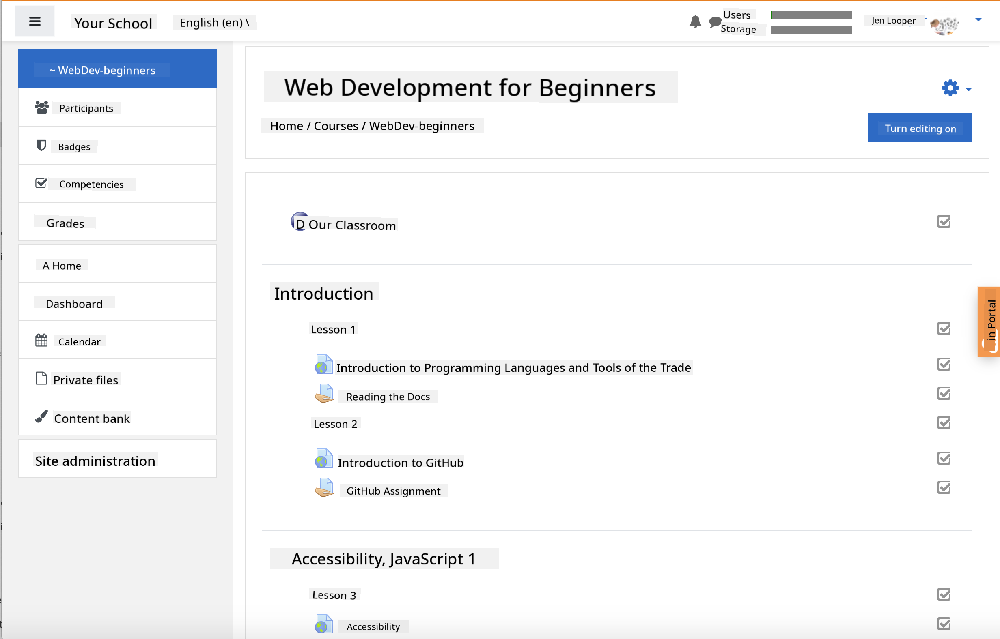
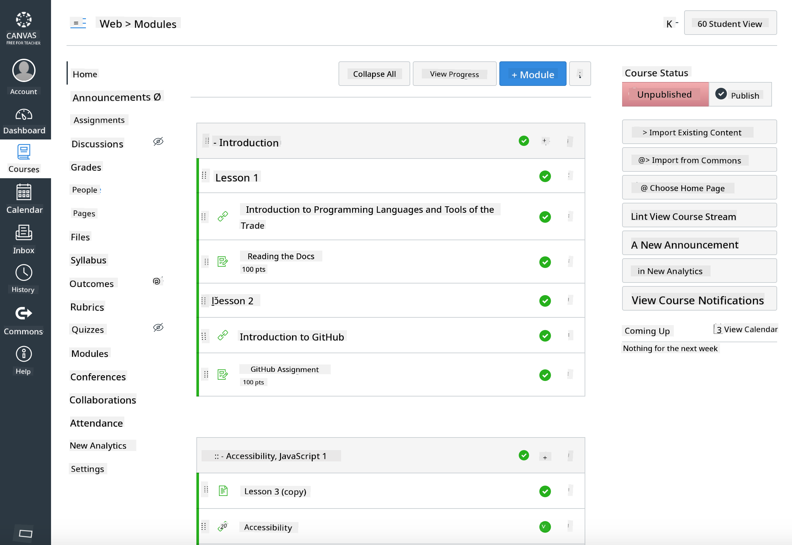

<!--
CO_OP_TRANSLATOR_METADATA:
{
  "original_hash": "75cb51f7ca9ea0b097ef4a1287e9290c",
  "translation_date": "2025-08-28T11:13:15+00:00",
  "source_file": "for-teachers.md",
  "language_code": "en"
}
-->
## For Educators

Would you like to use this curriculum in your classroom? Feel free to do so!

In fact, you can use it directly on GitHub by leveraging GitHub Classroom.

To get started, fork this repository. You'll need to create a separate repository for each lesson, so you'll need to extract each folder into its own repository. This way, [GitHub Classroom](https://classroom.github.com/classrooms) can handle each lesson individually.

These [detailed instructions](https://github.blog/2020-03-18-set-up-your-digital-classroom-with-github-classroom/) will guide you on how to set up your classroom.

## Using it in Moodle, Canvas, or Blackboard

This curriculum is compatible with these Learning Management Systems! You can use the [Moodle upload file](../../../../../../../teaching-files/webdev-moodle.mbz) for the complete content or try the [Common Cartridge file](../../../../../../../teaching-files/webdev-common-cartridge.imscc), which includes part of the content. Note that Moodle Cloud does not support full Common Cartridge exports, so it's better to use the Moodle download file, which can also be uploaded into Canvas. Let us know how we can enhance this experience for you.

> The curriculum displayed in a Moodle classroom

> The curriculum displayed in Canvas

## Using the repository as is

If you'd prefer to use this repository as it currently stands, without GitHub Classroom, that's also an option. You'll need to coordinate with your students on which lesson to work through together.

In an online format (Zoom, Teams, or similar), you could create breakout rooms for quizzes and mentor students to prepare them for learning. Then, invite students to complete the quizzes and submit their answers as 'issues' at a designated time. You could follow the same approach for assignments if you want students to collaborate openly.

If you'd rather use a more private format, ask your students to fork the curriculum, lesson by lesson, into their own private GitHub repositories and grant you access. This way, they can complete quizzes and assignments privately and submit them to you via issues on your classroom repository.

There are many ways to adapt this for an online classroom setting. Let us know what works best for you!

## Please share your feedback!

We want this curriculum to be as effective as possible for you and your students. Connect with us in the [Teacher corner](https://github.com/microsoft/Web-Dev-For-Beginners/discussions/categories/teacher-corner) and open a [**new issue**](https://github.com/microsoft/Web-Dev-For-Beginners/issues/new/choose) to share your requests, report bugs, or provide feedback.

---

**Disclaimer**:  
This document has been translated using the AI translation service [Co-op Translator](https://github.com/Azure/co-op-translator). While we aim for accuracy, please note that automated translations may include errors or inaccuracies. The original document in its native language should be regarded as the authoritative source. For critical information, professional human translation is advised. We are not responsible for any misunderstandings or misinterpretations resulting from the use of this translation.