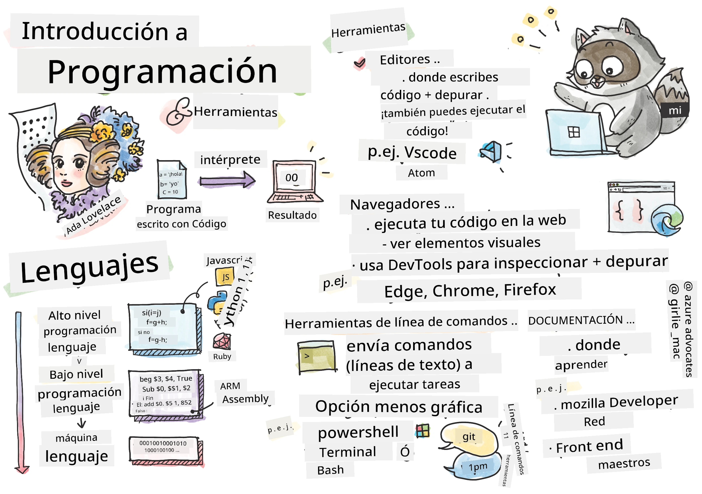
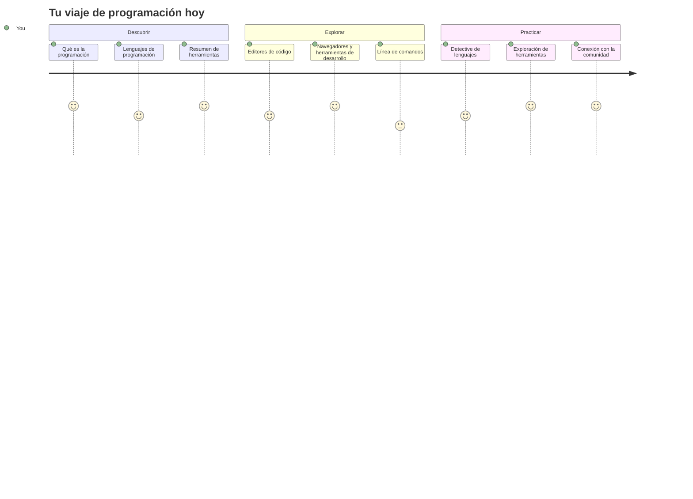
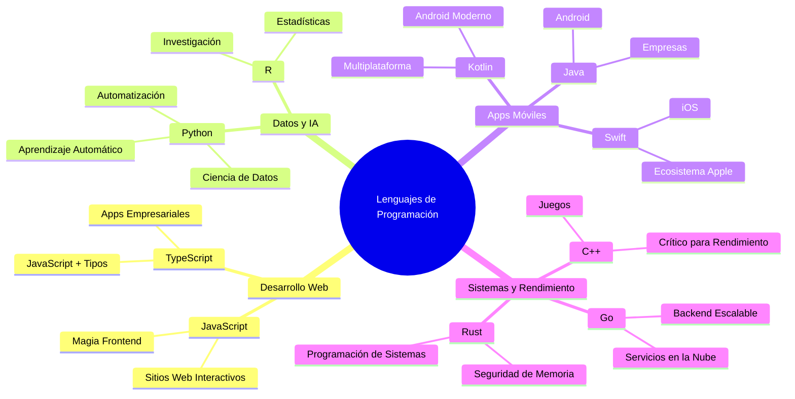
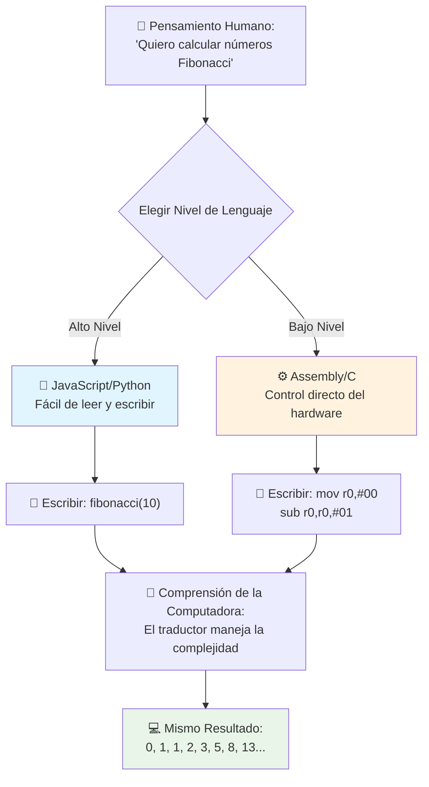
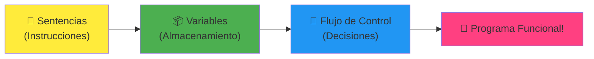
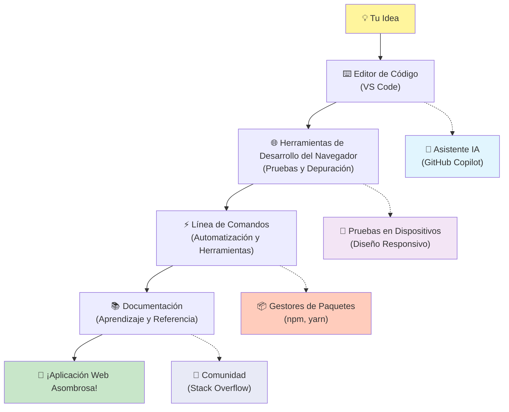
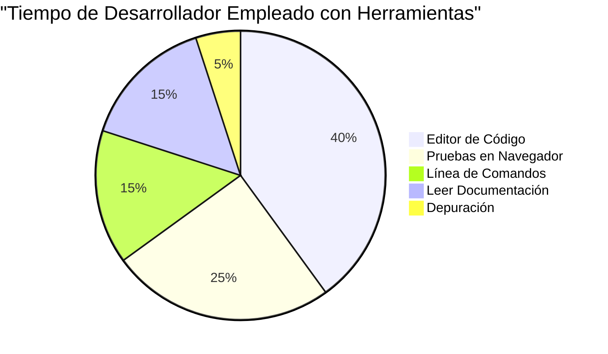
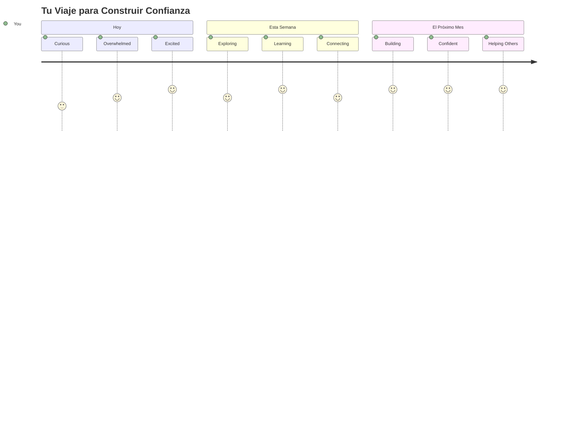

# Introducción a los Lenguajes de Programación y Herramientas Modernas para Desarrolladores

¡Hola, futuro desarrollador! 👋 ¿Puedo contarte algo que todavía me pone la piel de gallina todos los días? ¡Estás a punto de descubrir que programar no es solo sobre computadoras, sino sobre tener superpoderes reales para dar vida a tus ideas más salvajes!

¿Conoces ese momento cuando usas tu app favorita y todo funciona perfectamente? Cuando tocas un botón y algo absolutamente mágico sucede que te hace decir "wow, ¿cómo hicieron ESO?" Pues, alguien justo como tú, probablemente sentado en su cafetería favorita a las 2 AM con su tercer espresso, escribió el código que creó esa magia. Y aquí viene lo que te va a volar la cabeza: al final de esta lección, no solo entenderás cómo lo hicieron, ¡sino que estarás ansioso por intentarlo tú mismo!

Mira, entiendo totalmente si la programación te parece intimidante ahora mismo. Cuando empecé, honestamente pensé que tenías que ser un genio de las matemáticas o haber programado desde los cinco años. Pero esto es lo que cambió completamente mi perspectiva: programar es exactamente como aprender a tener conversaciones en un nuevo idioma. Empiezas con "hola" y "gracias," luego avanzas a pedir un café, y antes de que te des cuenta, ¡estás teniendo discusiones filosóficas profundas! Excepto que en este caso, estás conversando con computadoras, y ¿sabes qué? Son los compañeros de conversación más pacientes que jamás tendrás: nunca juzgan tus errores y siempre están felices de intentarlo otra vez.

Hoy vamos a explorar las increíbles herramientas que hacen que el desarrollo web moderno no solo sea posible, sino realmente adictivo. Estoy hablando de los mismos editores, navegadores y flujos de trabajo que los desarrolladores de Netflix, Spotify y tu estudio indie favorito usan cada día. Y aquí viene la parte que te hará bailar de alegría: ¡la mayoría de estas herramientas profesionales y estándar de la industria son completamente gratuitas!


> Sketchnote de [Tomomi Imura](https://twitter.com/girlie_mac)


## ¡Veamos Qué Sabes Ya!

Antes de saltar a lo divertido, tengo curiosidad: ¿qué sabes ya sobre este mundo de la programación? Y escucha, si estás mirando estas preguntas pensando "literalmente no tengo ni idea de nada," eso no solo está bien, ¡es perfecto! Eso significa que estás en el lugar correcto. Piensa en este cuestionario como estiramientos antes de hacer ejercicio: ¡solo estamos calentando los músculos del cerebro!

[Haz el cuestionario previo a la lección](https://forms.office.com/r/dru4TE0U9n?origin=lprLink)

## La Aventura Que Vamos a Emprender Juntos

¡Bien, estoy genuinamente emocionado por lo que vamos a explorar hoy! En serio, desearía poder ver tu cara cuando algunos de estos conceptos hagan clic. Aquí está el increíble viaje que emprenderemos juntos:

- **Qué es realmente la programación (y por qué es lo más genial que hay)** – Vamos a descubrir cómo el código es literalmente la magia invisible que potencia todo a tu alrededor, desde esa alarma que de alguna manera sabe que es lunes en la mañana hasta el algoritmo que te recomienda perfectamente en Netflix
- **Lenguajes de programación y sus asombrosas personalidades** – Imagina entrar a una fiesta donde cada persona tiene superpoderes completamente diferentes y maneras únicas de resolver problemas. Así es el mundo de los lenguajes de programación, ¡y te encantará conocerlos!
- **Los bloques fundamentales que hacen posible la magia digital** – Piensa en estos como el mejor set de LEGO creativo. Una vez entiendas cómo encajan estas piezas, te darás cuenta que puedes construir literalmente cualquier cosa que tu imaginación sueñe
- **Herramientas profesionales que harán que sientas que te acaban de entregar la varita de un mago** – No estoy exagerando aquí, estas herramientas realmente te harán sentir que tienes superpoderes, y la mejor parte: ¡son las mismas que usan los profesionales!

> 💡 **Aquí está el punto**: ¡Ni se te ocurra intentar memorizar todo hoy! Ahora mismo, solo quiero que sientas esa chispa de emoción sobre lo que es posible. Los detalles se quedarán de forma natural mientras practicamos juntos, ¡así es como ocurre el aprendizaje real!

> Puedes tomar esta lección en [Microsoft Learn](https://docs.microsoft.com/learn/modules/web-development-101/introduction-programming/?WT.mc_id=academic-77807-sagibbon)!

## Entonces, ¿Qué es Exactamente *la* Programación?

Muy bien, abordemos la pregunta del millón: ¿qué es realmente la programación?

Te contaré una historia que cambió completamente mi forma de pensar. La semana pasada, intentaba explicarle a mi mamá cómo usar el control remoto de nuestro nuevo televisor inteligente. Me sorprendí diciendo cosas como "Presiona el botón rojo, pero no el botón rojo grande, el botón rojo pequeño a la izquierda... no, tu otro izquierdo... bueno, ahora sostenlo por dos segundos, no uno, ni tres..." ¿Te suena? 😅

¡Eso es programar! Es el arte de dar instrucciones increíblemente detalladas y paso a paso a algo que es muy poderoso pero necesita que todo se explique perfectamente. Excepto que en vez de explicarle a tu mamá (que puede preguntar "¿qué botón rojo?!"), le explicas a una computadora (que simplemente hace exactamente lo que le dices, aunque no sea exactamente lo que quisiste decir).

Esto me voló la cabeza la primera vez que lo aprendí: las computadoras en realidad son bastante simples en su núcleo. Literalmente solo entienden dos cosas – 1 y 0, que es básicamente "sí" y "no" o "encendido" y "apagado." ¡Eso es todo! Pero aquí viene la magia – no tenemos que hablar en 1s y 0s como en The Matrix. Ahí es donde los **lenguajes de programación** vienen al rescate. Son como tener al mejor traductor del mundo que toma tus pensamientos humanos normales y los convierte en lenguaje para computadoras.

Y esto es lo que todavía me da escalofríos todas las mañanas cuando despierto: literalmente *todo* lo digital en tu vida empezó con alguien como tú, probablemente en pijama con una taza de café, escribiendo código en su laptop. ¿Ese filtro de Instagram que te hace ver impecable? Alguien lo programó. ¿La recomendación que te llevó a tu nueva canción favorita? Un desarrollador construyó ese algoritmo. ¿La app que te ayuda a dividir la cuenta de la cena con amigos? Sí, alguien pensó "esto es molesto, apuesto que puedo arreglarlo" y luego… ¡lo hizo!

Cuando aprendes a programar, no solo estás adquiriendo una habilidad nueva – te estás convirtiendo en parte de esta increíble comunidad de solucionadores de problemas que pasan sus días pensando: "¿Y si pudiera crear algo que haga el día de alguien un poquito mejor?" Honestamente, ¿hay algo más genial que eso?

✅ **Búsqueda de dato curioso**: Aquí tienes algo súper interesante para buscar cuando tengas un momento libre – ¿quién crees que fue el primer programador del mundo? Te doy una pista: ¡quizá no sea quien esperas! La historia de esta persona es absolutamente fascinante y muestra que la programación siempre ha sido sobre resolver problemas con creatividad y pensar fuera de la caja.

### 🧠 **Momento de reflexión: ¿Cómo te Sientes?**

**Tómate un momento para pensar:**
- ¿Tiene sentido para ti la idea de "dar instrucciones a las computadoras" ahora?
- ¿Puedes pensar en una tarea diaria que te gustaría automatizar con programación?
- ¿Qué preguntas te están surgiendo sobre todo esto de la programación?

> **Recuerda**: Es totalmente normal si algunos conceptos te parecen confusos ahora. Aprender a programar es como aprender un nuevo idioma – tu cerebro necesita tiempo para construir esas conexiones neuronales. ¡Lo estás haciendo genial!

## Los Lenguajes de Programación Son Como Diferentes Sabores de Magia

Bien, esto va a sonar raro, pero quédate conmigo – los lenguajes de programación son mucho como distintos tipos de música. Piénsalo: tienes jazz, que es suave e improvisacional; rock que es poderoso y directo; clásico que es elegante y estructurado; y hip-hop que es creativo y expresivo. Cada estilo tiene su propia vibra, su propia comunidad de fanáticos apasionados, y cada uno es perfecto para diferentes estados de ánimo y ocasiones.

Los lenguajes de programación funcionan exactamente igual. No usarías el mismo lenguaje para crear un juego móvil divertido que para procesar enormes cantidades de datos climáticos, así como no tocarías death metal en una clase de yoga (bueno, la mayoría de las clases de yoga, ¡jaja!).

Pero aquí está lo que me fascina cada vez que lo pienso: estos lenguajes son como tener al intérprete más paciente y brillante del mundo sentado a tu lado. Puedes expresar tus ideas de una manera que se siente natural para tu cerebro humano, y ellos hacen todo el trabajo complejo de traducir eso en los 1s y 0s que las computadoras en realidad entienden. Es como tener un amigo que habla perfectamente tanto "creatividad humana" como "lógica de computadora" – y que nunca se cansa, nunca necesita pausas para café, y nunca te juzga por preguntar lo mismo dos veces.

### Lenguajes de Programación Populares y Sus Usos


| Lenguaje | Mejor para | Por qué es popular |
|----------|------------|--------------------|
| **JavaScript** | Desarrollo web, interfaces de usuario | Corre en navegadores y potencia sitios web interactivos |
| **Python** | Ciencia de datos, automatización, IA | Fácil de leer y aprender, bibliotecas potentes |
| **Java** | Aplicaciones empresariales, apps Android | Independiente de plataforma, robusto para sistemas grandes |
| **C#** | Aplicaciones Windows, desarrollo de juegos | Gran soporte en el ecosistema Microsoft |
| **Go** | Servicios en la nube, sistemas backend | Rápido, sencillo, diseñado para computación moderna |

### Lenguajes de Alto Nivel vs. Bajo Nivel

Bien, este fue sinceramente el concepto que me rompió la cabeza cuando empecé, así que voy a compartir la analogía que finalmente hizo que lo entendiera – y espero que te ayude a ti también.

Imagina que estás visitando un país donde no hablas el idioma y necesitas desesperadamente encontrar el baño más cercano (todos hemos estado ahí, ¿verdad? 😅):

- **Programación de bajo nivel** es como aprender el dialecto local tan bien que puedes charlar con la abuela que vende fruta en la esquina usando referencias culturales, jerga local y chistes internos que solo alguien que creció ahí entendería. Súper impresionante e increíblemente eficiente… si eres fluido. Pero bastante abrumador cuando solo estás buscando un baño.

- **Programación de alto nivel** es como tener ese amigo local increíble que simplemente te entiende. Puedes decir "Realmente necesito encontrar un baño" en inglés simple, y él se encarga de toda la traducción cultural y te da indicaciones que tienen sentido para tu cerebro no local.

En términos de programación:
- Los **lenguajes de bajo nivel** (como Assembly o C) te permiten tener conversaciones increíblemente detalladas con el hardware real de la computadora, pero necesitas pensar como una máquina, lo cual es… bueno, digamos que es un gran cambio mental.
- Los **lenguajes de alto nivel** (como JavaScript, Python o C#) te dejan pensar como humano mientras ellos manejan todo el lenguaje máquina detrás de escena. Además, tienen comunidades increíblemente acogedoras llenas de personas que recuerdan lo que fue ser novato y genuinamente quieren ayudar.

¿Adivina con cuáles te voy a sugerir que empieces? 😉 Los de alto nivel son como rueditas de entrenamiento que realmente nunca querrás quitar porque hacen la experiencia mucho más agradable.


### Déjame Mostrarte Por Qué Los Lenguajes de Alto Nivel Son Mucho Más Amigables

Muy bien, estoy a punto de mostrarte algo que ejemplifica perfectamente por qué me enamoré de los lenguajes de alto nivel, pero primero – necesito que me prometas algo. Cuando veas ese primer ejemplo de código, ¡no te asustes! Se supone que se vea intimidante. ¡Ese es justo el punto que quiero mostrar!

Vamos a ver la misma tarea escrita en dos estilos completamente diferentes. Ambas crean lo que se llama la secuencia de Fibonacci – es este hermoso patrón matemático donde cada número es la suma de los dos anteriores: 0, 1, 1, 2, 3, 5, 8, 13… (Dato curioso: encontrarás este patrón literalmente en toda la naturaleza – espirales de semillas de girasol, patrones de piñas, ¡incluso la forma en que se forman las galaxias!)

¿Listo para ver la diferencia? ¡Vamos!

**Lenguaje de alto nivel (JavaScript) – Fácil para humanos:**

```javascript
// Paso 1: Configuración básica de Fibonacci
const fibonacciCount = 10;
let current = 0;
let next = 1;

console.log('Fibonacci sequence:');
```

**Esto es lo que hace este código:**
- **Declarar** una constante para especificar cuántos números de Fibonacci queremos generar
- **Inicializar** dos variables para hacer seguimiento del número actual y el siguiente en la secuencia
- **Configurar** los valores iniciales (0 y 1) que definen el patrón Fibonacci
- **Mostrar** un mensaje encabezado para identificar nuestro resultado

```javascript
// Paso 2: Generar la secuencia con un bucle
for (let i = 0; i < fibonacciCount; i++) {
  console.log(`Position ${i + 1}: ${current}`);
  
  // Calcular el siguiente número en la secuencia
  const sum = current + next;
  current = next;
  next = sum;
}
```

**Desglosando lo que sucede aquí:**
- **Recorrer** cada posición de nuestra secuencia usando un bucle `for`
- **Mostrar** cada número con su posición usando formato de plantilla literal
- **Calcular** el siguiente número de Fibonacci sumando los valores actual y siguiente
- **Actualizar** nuestras variables de seguimiento para pasar a la siguiente iteración

```javascript
// Paso 3: Enfoque funcional moderno
const generateFibonacci = (count) => {
  const sequence = [0, 1];
  
  for (let i = 2; i < count; i++) {
    sequence[i] = sequence[i - 1] + sequence[i - 2];
  }
  
  return sequence;
};

// Ejemplo de uso
const fibSequence = generateFibonacci(10);
console.log(fibSequence);
```

**En el código anterior, hemos:**
- **Creado** una función reutilizable usando la sintaxis moderna de función flecha
- **Construido** un arreglo para almacenar toda la secuencia en lugar de mostrar número por número
- **Usado** indexación de arreglos para calcular cada nuevo número a partir de valores previos
- **Retornado** la secuencia completa para un uso flexible en otras partes de nuestro programa

**Lenguaje de bajo nivel (ARM Assembly) – Fácil para máquinas:**

```assembly
 area ascen,code,readonly
 entry
 code32
 adr r0,thumb+1
 bx r0
 code16
thumb
 mov r0,#00
 sub r0,r0,#01
 mov r1,#01
 mov r4,#10
 ldr r2,=0x40000000
back add r0,r1
 str r0,[r2]
 add r2,#04
 mov r3,r0
 mov r0,r1
 mov r1,r3
 sub r4,#01
 cmp r4,#00
 bne back
 end
```

Fíjate cómo la versión en JavaScript se lee casi como instrucciones en inglés, mientras que la versión en Assembly usa comandos crípticos que controlan directamente el procesador de la computadora. Ambos logran exactamente la misma tarea, pero el lenguaje de alto nivel es mucho más fácil de entender, escribir y mantener para los humanos.

**Diferencias clave que notarás:**
- **Legibilidad**: JavaScript usa nombres descriptivos como `fibonacciCount` mientras que Assembly usa etiquetas crípticas como `r0`, `r1`
- **Comentarios**: Los lenguajes de alto nivel fomentan comentarios explicativos que hacen que el código se documente por sí mismo  
- **Estructura**: El flujo lógico de JavaScript coincide con cómo los humanos pensamos en los problemas paso a paso  
- **Mantenimiento**: Actualizar la versión de JavaScript para diferentes requerimientos es sencillo y claro  

✅ **Sobre la secuencia de Fibonacci**: Este patrón numérico absolutamente hermoso (donde cada número es la suma de los dos anteriores: 0, 1, 1, 2, 3, 5, 8...) aparece literalmente *en todas partes* en la naturaleza. Lo encontrarás en las espirales de los girasoles, los patrones de las piñas, la forma en que se curvan las conchas de nautilus e incluso en cómo crecen las ramas de los árboles. ¡Es realmente asombroso cómo las matemáticas y el código nos ayudan a entender y recrear los patrones que la naturaleza utiliza para crear belleza!

## Los Bloques de Construcción que Hacen que la Magia Ocurra

Muy bien, ahora que has visto cómo son los lenguajes de programación en acción, vamos a desglosar las piezas fundamentales que componen literalmente todos los programas escritos. Piensa en estos como los ingredientes esenciales de tu receta favorita: una vez que entiendas qué hace cada uno, ¡podrás leer y escribir código en prácticamente cualquier lenguaje!

Esto es algo así como aprender la gramática de la programación. ¿Recuerdas en la escuela cuando aprendías sobre sustantivos, verbos y cómo armar oraciones? La programación tiene su propia versión de gramática y, honestamente, ¡es mucho más lógica y indulgente que la gramática inglesa! 😄

### Sentencias: Las Instrucciones Paso a Paso

Comencemos con las **sentencias** — estas son como oraciones individuales en una conversación con tu computadora. Cada sentencia le indica a la computadora hacer una cosa específica, como dar direcciones: "Gira a la izquierda aquí," "Para en el semáforo en rojo," "Estaciona en ese lugar."

Lo que me encanta de las sentencias es lo legibles que suelen ser. Mira esto:

```javascript
// Declaraciones básicas que realizan acciones simples
const userName = "Alex";                    
console.log("Hello, world!");              
const sum = 5 + 3;                         
```
  
**Esto es lo que hace este código:**  
- **Declarar** una variable constante para almacenar el nombre de un usuario  
- **Mostrar** un mensaje de saludo en la consola  
- **Calcular** y almacenar el resultado de una operación matemática  

```javascript
// Sentencias que interactúan con páginas web
document.title = "My Awesome Website";      
document.body.style.backgroundColor = "lightblue";
```
  
**Paso a paso, esto es lo que sucede:**  
- **Modificar** el título de la página web que aparece en la pestaña del navegador  
- **Cambiar** el color de fondo de todo el cuerpo de la página  

### Variables: El Sistema de Memoria de tu Programa

Bien, las **variables** son honestamente uno de mis conceptos favoritos para enseñar porque son muy parecidas a cosas que usas todos los días.

Piensa por un segundo en la lista de contactos de tu teléfono. No memorizas el número de todos, sino que guardas "Mamá," "Mejor Amigo," o "Pizzería que entrega hasta las 2 AM" y dejas que tu teléfono recuerde los números reales. ¡Las variables funcionan exactamente igual! Son como contenedores etiquetados donde tu programa puede almacenar información y recuperarla más tarde con un nombre que realmente tiene sentido.

Lo realmente genial es que las variables pueden cambiar mientras tu programa se ejecuta (¡de ahí viene el nombre "variable"!). Igual que podrías actualizar ese contacto de la pizzería cuando descubres un lugar mejor, las variables pueden actualizarse cuando tu programa obtiene nueva información o cambian las situaciones.

Déjame mostrarte lo sencillamente hermoso que puede ser esto:

```javascript
// Paso 1: Creando variables básicas
const siteName = "Weather Dashboard";        
let currentWeather = "sunny";               
let temperature = 75;                       
let isRaining = false;                      
```
  
**Entendiendo estos conceptos:**  
- **Almacenar** valores constantes en variables `const` (como el nombre del sitio)  
- **Usar** `let` para valores que pueden cambiar durante la ejecución del programa  
- **Asignar** diferentes tipos de datos: cadenas (texto), números y booleanos (verdadero/falso)  
- **Elegir** nombres descriptivos que expliquen qué contiene cada variable  

```javascript
// Paso 2: Trabajando con objetos para agrupar datos relacionados
const weatherData = {                       
  location: "San Francisco",
  humidity: 65,
  windSpeed: 12
};
```
  
**En el ejemplo anterior hemos:**  
- **Creado** un objeto para agrupar información meteorológica relacionada  
- **Organizado** múltiples datos bajo un solo nombre de variable  
- **Usado** pares clave-valor para etiquetar claramente cada dato  

```javascript
// Paso 3: Usar y actualizar variables
console.log(`${siteName}: Today is ${currentWeather} and ${temperature}°F`);
console.log(`Wind speed: ${weatherData.windSpeed} mph`);

// Actualizando variables cambiables
currentWeather = "cloudy";                  
temperature = 68;                          
```
  
**Entendamos cada parte:**  
- **Mostrar** información usando literales de plantilla con la sintaxis `${}`  
- **Acceder** a las propiedades del objeto usando notación de puntos (`weatherData.windSpeed`)  
- **Actualizar** variables declaradas con `let` para reflejar condiciones cambiantes  
- **Combinar** varias variables para crear mensajes significativos  

```javascript
// Paso 4: Desestructuración moderna para un código más limpio
const { location, humidity } = weatherData; 
console.log(`${location} humidity: ${humidity}%`);
```
  
**Qué necesitas saber:**  
- **Extraer** propiedades específicas de objetos usando asignación por desestructuración  
- **Crear** nuevas variables automáticamente con los mismos nombres que las claves del objeto  
- **Simplificar** el código evitando la notación repetitiva con puntos  

### Flujo de Control: Enseñando a tu Programa a Pensar

Aquí es donde la programación se vuelve absolutamente alucinante. El **flujo de control** es básicamente enseñarle a tu programa cómo tomar decisiones inteligentes, justo como tú lo haces todos los días sin siquiera pensarlo.

Imagina esto: esta mañana seguramente pasaste por algo como "Si está lloviendo, llevo paraguas. Si hace frío, me pongo una chaqueta. Si voy atrasado, me salto el desayuno y tomo café en camino." Tu cerebro sigue naturalmente esta lógica if-then docenas de veces al día.

Esto es lo que hace que los programas se sientan inteligentes y vivos, en vez de solo seguir un guion aburrido y predecible. Pueden observar la situación, evaluar lo que sucede y responder adecuada y rápidamente. ¡Es como darle a tu programa un cerebro que se adapta y toma decisiones!

¿Quieres ver cómo funciona brillantemente? Mira esto:

```javascript
// Paso 1: Lógica condicional básica
const userAge = 17;

if (userAge >= 18) {
  console.log("You can vote!");
} else {
  const yearsToWait = 18 - userAge;
  console.log(`You'll be able to vote in ${yearsToWait} year(s).`);
}
```
  
**Esto es lo que hace este código:**  
- **Verificar** si la edad del usuario cumple con el requisito para votar  
- **Ejecutar** diferentes bloques de código según el resultado de la condición  
- **Calcular** y mostrar cuánto falta para que sea elegible para votar si tiene menos de 18 años  
- **Proporcionar** comentarios específicos y útiles para cada escenario  

```javascript
// Paso 2: Múltiples condiciones con operadores lógicos
const userAge = 17;
const hasPermission = true;

if (userAge >= 18 && hasPermission) {
  console.log("Access granted: You can enter the venue.");
} else if (userAge >= 16) {
  console.log("You need parent permission to enter.");
} else {
  console.log("Sorry, you must be at least 16 years old.");
}
```
  
**Desglose de lo que sucede aquí:**  
- **Combinar** múltiples condiciones usando el operador `&&` (y)  
- **Crear** una jerarquía de condiciones usando `else if` para múltiples escenarios  
- **Manejar** todos los casos posibles con una sentencia final `else`  
- **Ofrecer** comentarios claros y prácticos para cada situación distinta  

```javascript
// Paso 3: Condicional conciso con operador ternario
const votingStatus = userAge >= 18 ? "Can vote" : "Cannot vote yet";
console.log(`Status: ${votingStatus}`);
```
  
**Recuerda esto:**  
- **Usar** el operador ternario (`? :`) para condiciones simples con dos opciones  
- **Escribir** primero la condición, seguido de `?`, luego el resultado verdadero, luego `:`, y después el resultado falso  
- **Aplicar** este patrón cuando necesitas asignar valores basados en condiciones  

```javascript
// Paso 4: Manejo de múltiples casos específicos
const dayOfWeek = "Tuesday";

switch (dayOfWeek) {
  case "Monday":
  case "Tuesday":
  case "Wednesday":
  case "Thursday":
  case "Friday":
    console.log("It's a weekday - time to work!");
    break;
  case "Saturday":
  case "Sunday":
    console.log("It's the weekend - time to relax!");
    break;
  default:
    console.log("Invalid day of the week");
}
```
  
**Este código logra lo siguiente:**  
- **Comparar** el valor de la variable con múltiples casos específicos  
- **Agrupar** casos similares (días laborables vs fines de semana)  
- **Ejecutar** el bloque de código apropiado cuando encuentra coincidencia  
- **Incluir** un caso `default` para manejar valores inesperados  
- **Usar** sentencias `break` para evitar que el código continúe al siguiente caso  

> 💡 **Analogía del mundo real**: Piensa en el flujo de control como si tuvieras el GPS más paciente del mundo dándote indicaciones. Podría decir: "Si hay tráfico en la Calle Principal, toma la autopista. Si hay construcción bloqueando la autopista, prueba la ruta panorámica." Los programas usan exactamente ese tipo de lógica condicional para responder inteligentemente a diferentes situaciones y siempre ofrecer la mejor experiencia posible a los usuarios.

### 🎯 **Revisión de Conceptos: Dominio de los Bloques de Construcción**

**Veamos cómo te va con los fundamentos:**  
- ¿Puedes explicar la diferencia entre una variable y una sentencia con tus propias palabras?  
- Piensa en un escenario real donde usarías una decisión if-then (como nuestro ejemplo de votación)  
- ¿Qué es lo que más te sorprendió de la lógica de programación?  

**Pequeño impulso de confianza:**  

✅ **Lo que viene a continuación**: ¡Vamos a divertirnos mucho profundizando en estos conceptos mientras continuamos este increíble viaje juntos! Por ahora, solo enfócate en sentir esa emoción por todas las increíbles posibilidades que tienes por delante. Las habilidades y técnicas específicas se quedarán contigo naturalmente mientras practicamos juntos – prometo que será mucho más divertido de lo que esperas.

## Herramientas del Oficio

Muy bien, aquí es donde honestamente me emociono tanto que casi no puedo contenerme. 🚀 Vamos a hablar de las increíbles herramientas que te harán sentir como si te hubieran entregado las llaves de una nave espacial digital.

¿Sabes cómo un chef tiene esos cuchillos perfectamente equilibrados que parecen extensiones de sus manos? O cómo un músico tiene esa guitarra que parece cantar justo cuando la toca? Bueno, los desarrolladores tenemos nuestra propia versión de estas herramientas mágicas, y esto es lo que te va a dejar con la boca abierta: ¡la mayoría son completamente gratis!

Prácticamente estoy brincando en mi silla pensando en compartir estas contigo, porque han revolucionado por completo la manera en que construimos software. Hablamos de asistentes de codificación impulsados por IA que pueden ayudarte a escribir código (¡no es broma!), entornos en la nube donde puedes crear aplicaciones enteras desde literalmente cualquier lugar con Wi-Fi, y herramientas de depuración tan sofisticadas que parecen tener visión de rayos X para tus programas.

Y aquí viene la parte que aún me pone la piel de gallina: estas no son herramientas “para principiantes” que dejarás atrás. Son exactamente las mismas herramientas profesionales que usan desarrolladores en Google, Netflix y ese estudio indie de apps que tanto te gusta, en este mismo momento. ¡Vas a sentirte como un profesional usándolas!


### Editores de Código e IDEs: Tus Nuevos Mejores Amigos Digitales

Hablemos de editores de código, que en serio van a ser tus nuevos lugares favoritos para pasar el tiempo. Piensa en ellos como tu santuario personal de programación donde pasarás la mayoría del tiempo creando y perfeccionando tus creaciones digitales.

Pero aquí está lo realmente mágico de los editores modernos: no son simplemente editores de texto sofisticados. Son como tener al mentor de codificación más brillante y solidario sentado a tu lado las 24/7. Detectan tus errores antes de que los notes, sugieren mejoras que te hacen parecer un genio, te ayudan a entender qué hace cada parte del código y algunos hasta pueden predecir lo que vas a escribir y ofrecerte terminar tus ideas.

Recuerdo cuando descubrí la autocompletación — literalmente sentí que vivía en el futuro. Empiezas a escribir algo y tu editor dice “Oye, ¿estabas pensando en esta función que hace exactamente lo que necesitas?” Es como tener un lector de mente como compañero de codificación.

**¿Qué hace que estos editores sean increíbles?**

Los editores modernos ofrecen un impresionante conjunto de funciones diseñadas para aumentar tu productividad:

| Función | Qué Hace | Por Qué Ayuda |
|---------|----------|---------------|
| **Resaltado de sintaxis** | Colorea diferentes partes de tu código | Hace que el código sea más fácil de leer y detectar errores |
| **Autocompletado** | Sugiere código mientras escribes | Acelera la codificación y reduce errores tipográficos |
| **Herramientas de depuración** | Ayudan a encontrar y corregir errores | Ahorra horas en solucionar problemas |
| **Extensiones** | Agregan funciones especializadas | Personaliza tu editor para cualquier tecnología |
| **Asistentes de IA** | Sugieren código y explicaciones | Acelera el aprendizaje y la productividad |

> 🎥 **Recurso en video**: ¿Quieres ver estas herramientas en acción? Mira este [video de Herramientas del Oficio](https://youtube.com/watch?v=69WJeXGBdxg) para una visión completa.

#### Editores recomendados para desarrollo web

**[Visual Studio Code](https://code.visualstudio.com/?WT.mc_id=academic-77807-sagibbon)** (Gratis)  
- El más popular entre desarrolladores web  
- Excelente ecosistema de extensiones  
- Terminal incorporado e integración con Git  
- **Extensiones indispensables**:  
  - [GitHub Copilot](https://marketplace.visualstudio.com/items?itemName=GitHub.copilot) – Sugerencias de código impulsadas por IA  
  - [Live Share](https://marketplace.visualstudio.com/items?itemName=MS-vsliveshare.vsliveshare) – Colaboración en tiempo real  
  - [Prettier](https://marketplace.visualstudio.com/items?itemName=esbenp.prettier-vscode) – Formateo automático de código  
  - [Code Spell Checker](https://marketplace.visualstudio.com/items?itemName=streetsidesoftware.code-spell-checker) – Detecta errores ortográficos en tu código  

**[JetBrains WebStorm](https://www.jetbrains.com/webstorm/)** (De pago, gratis para estudiantes)  
- Herramientas avanzadas de depuración y pruebas  
- Autocompletado inteligente  
- Control de versiones incorporado  

**IDEs basados en la nube** (Varían precios)  
- [GitHub Codespaces](https://github.com/features/codespaces) – VS Code completo en tu navegador  
- [Replit](https://replit.com/) – Excelente para aprender y compartir código  
- [StackBlitz](https://stackblitz.com/) – Desarrollo web full-stack instantáneo  

> 💡 **Consejo para comenzar**: Empieza con Visual Studio Code – es gratis, ampliamente usado en la industria y tiene una enorme comunidad creando tutoriales y extensiones útiles.

### Navegadores Web: Tu Laboratorio Secreto de Desarrollo

Prepárate para que te explote la mente. Sabes que has estado usando navegadores para desplazarte en redes sociales y ver videos, ¿verdad? Pues resulta que han estado escondiendo un laboratorio secreto de desarrollo todo este tiempo, esperando a que lo descubras.

Cada vez que haces clic derecho en una página web y seleccionas “Inspeccionar elemento”, estás abriendo un mundo oculto de herramientas para desarrolladores que honestamente son más poderosas que algunos softwares caros por los que yo solía pagar cientos de dólares. Es como descubrir que tu cocina común y corriente ha estado ocultando un laboratorio de chef profesional tras un panel secreto.
La primera vez que alguien me mostró las DevTools del navegador, pasé como tres horas solo haciendo clic por aquí y diciendo "¿ESPERA, TAMBIÉN PUEDE HACER ESO?!" Literalmente puedes editar cualquier sitio web en tiempo real, ver exactamente qué tan rápido carga todo, probar cómo se ve tu sitio en diferentes dispositivos e incluso depurar JavaScript como un profesional total. ¡Es absolutamente alucinante!

**Aquí está por qué los navegadores son tu arma secreta:**

Cuando creas un sitio web o una aplicación web, necesitas ver cómo se ve y se comporta en el mundo real. Los navegadores no solo muestran tu trabajo, sino que también ofrecen retroalimentación detallada sobre rendimiento, accesibilidad y posibles problemas.

#### Herramientas de desarrollo del navegador (DevTools)

Los navegadores modernos incluyen suites de desarrollo completas:

| Categoría de herramienta | Qué hace | Caso de uso de ejemplo |
|--------------------------|----------|-----------------------|
| **Inspector de elementos** | Ver y editar HTML/CSS en tiempo real | Ajustar estilos para ver resultados inmediatos |
| **Consola** | Ver mensajes de error y probar JavaScript | Depurar problemas y experimentar con código |
| **Monitor de red** | Rastrear cómo se cargan los recursos | Optimizar el rendimiento y los tiempos de carga |
| **Comprobador de accesibilidad** | Probar diseño inclusivo | Asegurar que tu sitio funcione para todos los usuarios |
| **Simulador de dispositivos** | Vista previa en diferentes tamaños de pantalla | Probar diseño responsivo sin múltiples dispositivos |

#### Navegadores recomendados para desarrollo

- **[Chrome](https://developers.google.com/web/tools/chrome-devtools/)** - DevTools estándar de la industria con documentación extensa
- **[Firefox](https://developer.mozilla.org/docs/Tools)** - Excelentes herramientas para CSS Grid y accesibilidad
- **[Edge](https://docs.microsoft.com/microsoft-edge/devtools-guide-chromium/?WT.mc_id=academic-77807-sagibbon)** - Basado en Chromium con recursos de desarrollo de Microsoft

> ⚠️ **Consejo importante para pruebas**: ¡Siempre prueba tus sitios web en múltiples navegadores! Lo que funciona perfectamente en Chrome puede verse diferente en Safari o Firefox. Los desarrolladores profesionales prueban en todos los navegadores principales para asegurar experiencias de usuario consistentes.


### Herramientas de línea de comandos: tu puerta a superpoderes de desarrollador

Bien, tengamos un momento completamente honesto aquí sobre la línea de comandos, porque quiero que escuches esto de alguien que realmente lo entiende. La primera vez que la vi – solo esa pantalla negra aterradora con texto parpadeante – literalmente pensé, "No, absolutamente no. ¡Esto parece algo de una película de hackers de los años 80, y definitivamente no soy lo suficientemente inteligente para esto!" 😅

Pero esto es lo que desearía que alguien me hubiera dicho entonces, y que te estoy diciendo ahora: la línea de comandos no da miedo, en realidad es como tener una conversación directa con tu computadora. Piensa en la diferencia entre pedir comida a través de una aplicación elegante con imágenes y menús (lo cual es agradable y fácil) frente a entrar a tu restaurante local favorito donde el chef sabe exactamente lo que te gusta y puede preparar algo perfecto solo con que digas "sorpréndeme con algo increíble."

La línea de comandos es donde los desarrolladores se sienten como magos absolutos. Escribes unas pocas palabras aparentemente mágicas (ok, son solo comandos, pero se sienten mágicas), presionas enter y ¡BUM! – has creado estructuras enteras de proyectos, instalado herramientas poderosas de todo el mundo o desplegado tu app en internet para que millones la vean. Una vez que pruebas ese poder por primera vez, honestamente es bastante adictivo.

**Por qué la línea de comandos se convertirá en tu herramienta favorita:**

Mientras las interfaces gráficas son excelentes para muchas tareas, la línea de comandos sobresale en automatización, precisión y velocidad. Muchas herramientas de desarrollo funcionan principalmente a través de interfaces de línea de comandos, y aprender a usarlas eficientemente puede mejorar dramáticamente tu productividad.

```bash
# Paso 1: Crear y navegar al directorio del proyecto
mkdir my-awesome-website
cd my-awesome-website
```

**Esto es lo que hace este código:**
- **Crear** un nuevo directorio llamado "my-awesome-website" para tu proyecto
- **Navegar** al directorio recién creado para empezar a trabajar

```bash
# Paso 2: Inicializar el proyecto con package.json
npm init -y

# Instalar herramientas modernas de desarrollo
npm install --save-dev vite prettier eslint
npm install --save-dev @eslint/js
```

**Paso a paso, esto es lo que está pasando:**
- **Inicializar** un nuevo proyecto Node.js con configuraciones por defecto usando `npm init -y`
- **Instalar** Vite como una herramienta moderna de construcción para desarrollo rápido y compilaciones de producción
- **Agregar** Prettier para formateo automático de código y ESLint para verificaciones de calidad de código
- **Usar** el flag `--save-dev` para marcar estas como dependencias solo de desarrollo

```bash
# Paso 3: Crear la estructura del proyecto y los archivos
mkdir src assets
echo '<!DOCTYPE html><html><head><title>My Site</title></head><body><h1>Hello World</h1></body></html>' > index.html

# Iniciar el servidor de desarrollo
npx vite
```

**En lo anterior, hemos:**
- **Organizado** nuestro proyecto creando carpetas separadas para código fuente y recursos
- **Generado** un archivo HTML básico con la estructura adecuada del documento
- **Iniciado** el servidor de desarrollo de Vite para recarga en vivo y reemplazo en caliente de módulos

#### Herramientas esenciales de línea de comandos para desarrollo web

| Herramienta | Propósito | Por qué la necesitas |
|-------------|-----------|---------------------|
| **[Git](https://git-scm.com/)** | Control de versiones | Rastrear cambios, colaborar con otros, respaldar tu trabajo |
| **[Node.js & npm](https://nodejs.org/)** | Entorno de ejecución JavaScript y gestión de paquetes | Ejecutar JavaScript fuera de navegadores, instalar herramientas modernas de desarrollo |
| **[Vite](https://vitejs.dev/)** | Herramienta de construcción y servidor de desarrollo | Desarrollo ultra rápido con reemplazo en caliente de módulos |
| **[ESLint](https://eslint.org/)** | Calidad de código | Encontrar y corregir problemas en tu JavaScript automáticamente |
| **[Prettier](https://prettier.io/)** | Formateo de código | Mantener tu código consistentemente formateado y legible |

#### Opciones específicas por plataforma

**Windows:**
- **[Windows Terminal](https://docs.microsoft.com/windows/terminal/?WT.mc_id=academic-77807-sagibbon)** - Terminal moderno y con muchas funciones
- **[PowerShell](https://docs.microsoft.com/powershell/?WT.mc_id=academic-77807-sagibbon)** 💻 - Entorno de scripting poderoso
- **[Command Prompt](https://docs.microsoft.com/windows-server/administration/windows-commands/?WT.mc_id=academic-77807-sagibbon)** 💻 - Línea de comandos tradicional de Windows

**macOS:**
- **[Terminal](https://support.apple.com/guide/terminal/)** 💻 - Aplicación de terminal integrada
- **[iTerm2](https://iterm2.com/)** - Terminal mejorado con características avanzadas

**Linux:**
- **[Bash](https://www.gnu.org/software/bash/)** 💻 - Shell estándar de Linux
- **[KDE Konsole](https://docs.kde.org/trunk5/en/konsole/konsole/index.html)** - Emulador de terminal avanzado

> 💻 = Preinstalado en el sistema operativo

> 🎯 **Ruta de aprendizaje**: Comienza con comandos básicos como `cd` (cambiar directorio), `ls` o `dir` (listar archivos) y `mkdir` (crear carpeta). Practica con comandos modernos de flujo de trabajo como `npm install`, `git status` y `code .` (abre el directorio actual en VS Code). A medida que te sientas más cómodo, naturalmente aprenderás comandos más avanzados y técnicas de automatización.


### Documentación: tu mentor de aprendizaje siempre disponible

Bien, déjame compartir un pequeño secreto que te hará sentir mucho mejor sobre ser principiante: incluso los desarrolladores más experimentados pasan mucho tiempo leyendo documentación. Y eso no es porque no sepan lo que hacen, ¡es realmente una señal de sabiduría!

Piensa en la documentación como tener acceso a los profesores más pacientes y conocedores del mundo, disponibles las 24 horas del día, los 7 días de la semana. ¿Atascado en un problema a las 2 AM? La documentación está ahí con un abrazo virtual cálido y exactamente la respuesta que necesitas. ¿Quieres aprender sobre alguna función nueva que todos comentan? La documentación te respalda con ejemplos paso a paso. ¿Intentas entender por qué algo funciona de una determinada manera? Lo adivinaste: la documentación está lista para explicártelo de una forma que finalmente lo haga click.

Algo que cambió completamente mi perspectiva: el mundo del desarrollo web se mueve increíblemente rápido, y nadie (¡absolutamente nadie!) memoriza todo. He visto a desarrolladores senior con más de 15 años de experiencia consultar sintaxis básica y, ¿sabes qué? Eso no es vergonzoso, ¡es inteligente! No se trata de tener una memoria perfecta; se trata de saber dónde encontrar respuestas confiables rápidamente y entender cómo aplicarlas.

**Aquí es donde ocurre la verdadera magia:**

Los desarrolladores profesionales dedican una parte significativa de su tiempo a leer documentación – no porque no sepan lo que hacen, sino porque el panorama del desarrollo web evoluciona tan rápido que mantenerse actualizado requiere aprendizaje continuo. La buena documentación te ayuda a entender no solo *cómo* usar algo, sino *por qué* y *cuándo* usarlo.

#### Recursos esenciales de documentación

**[Mozilla Developer Network (MDN)](https://developer.mozilla.org/docs/Web)**
- El estándar de oro para documentación de tecnologías web
- Guías completas para HTML, CSS y JavaScript
- Incluye información sobre compatibilidad con navegadores
- Cuenta con ejemplos prácticos y demos interactivas

**[Web.dev](https://web.dev)** (de Google)
- Buenas prácticas modernas para desarrollo web
- Guías de optimización de rendimiento
- Principios de accesibilidad y diseño inclusivo
- Estudios de caso de proyectos reales

**[Documentación para desarrolladores de Microsoft](https://docs.microsoft.com/microsoft-edge/#microsoft-edge-for-developers)**
- Recursos de desarrollo para el navegador Edge
- Guías de Progressive Web Apps
- Perspectivas para desarrollo multiplataforma

**[Frontend Masters Learning Paths](https://frontendmasters.com/learn/)**
- Currículos de aprendizaje estructurados
- Cursos en vídeo de expertos de la industria
- Ejercicios prácticos de codificación

> 📚 **Estrategia de estudio**: No intentes memorizar la documentación, en su lugar, aprende a navegarla eficientemente. Guarda como favorito las referencias que usas frecuentemente y practica usando las funciones de búsqueda para encontrar información específica rápidamente.

### 🔧 **Chequeo de dominio de herramientas: ¿Qué te resuena?**

**Toma un momento para considerar:**
- ¿Qué herramienta te emociona más probar primero? (¡No hay respuesta incorrecta!)
- ¿La línea de comandos aún te parece intimidante o te da curiosidad?
- ¿Puedes imaginar usar las DevTools del navegador para echar un vistazo detrás del telón de tus sitios web favoritos?


> **Dato curioso**: La mayoría de los desarrolladores pasan alrededor del 40% de su tiempo en su editor de código, pero nota cuánto tiempo se dedica a probar, aprender y resolver problemas. ¡Programar no solo es escribir código, es crear experiencias!

✅ **Para reflexionar**: Aquí hay algo interesante para pensar: ¿cómo crees que las herramientas para construir sitios web (desarrollo) pueden ser diferentes de las herramientas para diseñar cómo se ven (diseño)? Es como la diferencia entre ser un arquitecto que diseña una casa hermosa y el contratista que realmente la construye. ¡Ambos son cruciales, pero necesitan cajas de herramientas diferentes! Este tipo de pensamiento realmente te ayudará a ver el panorama más amplio de cómo cobran vida los sitios web.

## Desafío del Agente GitHub Copilot 🚀

Usa el modo Agente para completar el siguiente desafío:

**Descripción:** Explora las características de un editor de código o IDE moderno y demuestra cómo puede mejorar tu flujo de trabajo como desarrollador web.

**Prompt:** Elige un editor de código o IDE (como Visual Studio Code, WebStorm, o un IDE basado en la nube). Enumera tres características o extensiones que te ayuden a escribir, depurar o mantener código más eficientemente. Para cada una, proporciona una breve explicación de cómo beneficia tu flujo de trabajo.

---

## 🚀 Desafío

**Muy bien, detective, ¿listo para tu primer caso?**

Ahora que tienes esta increíble base, tengo una aventura que te ayudará a ver lo increíblemente diverso y fascinante que es realmente el mundo de la programación. Y escucha – esto no es sobre escribir código todavía, así que no hay presión. ¡Piensa en ti como un detective de lenguajes de programación en tu primer caso emocionante!

**Tu misión, si decides aceptarla:**
1. **Conviértete en explorador de lenguajes**: Elige tres lenguajes de programación de universos completamente diferentes – quizá uno que construya sitios web, otro que cree apps móviles y otro que procese datos para científicos. Encuentra ejemplos de la misma tarea simple escrita en cada lenguaje. ¡Te prometo que te vas a asombrar de lo diferentes que pueden verse mientras hacen exactamente lo mismo!

2. **Descubre sus historias de origen**: ¿Qué hace especial a cada lenguaje? Aquí un dato genial: cada lenguaje de programación fue creado porque alguien pensó, "¿Sabes qué? Tiene que haber una mejor forma de resolver este problema específico." ¿Puedes descubrir cuáles fueron esos problemas? ¡Algunas de estas historias son realmente fascinantes!

3. **Conoce las comunidades**: Investiga qué tan acogedora y apasionada es la comunidad de cada lenguaje. Algunas tienen millones de desarrolladores compartiendo conocimiento y ayudándose mutuamente, otras son más pequeñas pero increíblemente unidas y solidarias. ¡Te encantará ver las diferentes personalidades que tienen estas comunidades!

4. **Confía en tu intuición**: ¿Cuál idioma te parece más accesible ahora mismo? No te estreses por hacer la elección "perfecta" – solo escucha tus instintos. Honestamente, no hay respuesta incorrecta, y siempre puedes explorar otros más adelante.

**Trabajo extra de detective**: Trata de descubrir qué sitios web o apps importantes están construidos con cada lenguaje. ¡Te garantizo que te sorprenderá saber qué impulsa Instagram, Netflix o ese juego móvil que no puedes dejar de jugar!

> 💡 **Recuerda**: No estás tratando de convertirte en un experto en ninguno de estos lenguajes hoy. Solo estás conociendo el vecindario antes de decidir dónde quieres establecerte. Tómate tu tiempo, diviértete y deja que tu curiosidad te guíe.

## ¡Celebremos lo que has descubierto!

¡Santo cielo, has absorbido tanta información increíble hoy! Estoy genuinamente emocionado por ver cuánto de este asombroso viaje se ha quedado contigo. Y recuerda – esto no es un examen donde necesites hacerlo todo perfecto. Esto es más como una celebración de todas las cosas geniales que has aprendido sobre este fascinante mundo en el que estás a punto de sumergirte.

[Realiza el quiz posterior a la lección](https://ff-quizzes.netlify.app/web/)
## Revisión y Autoestudio

**¡Tómate tu tiempo para explorar y divertirte con esto!**

¡Has cubierto mucho terreno hoy, y eso es algo de lo que estar orgulloso! Ahora viene la parte divertida: explorar los temas que despertaron tu curiosidad. Recuerda, esto no es tarea – ¡es una aventura!

**Profundiza en lo que te emociona:**

**Ponte manos a la obra con los lenguajes de programación:**
- Visita los sitios web oficiales de 2-3 lenguajes que llamaron tu atención. ¡Cada uno tiene su propia personalidad e historia!
- Prueba algunos entornos de codificación en línea como [CodePen](https://codepen.io/), [JSFiddle](https://jsfiddle.net/), o [Replit](https://replit.com/). No tengas miedo de experimentar – ¡no puedes romper nada!
- Lee sobre cómo se creó tu lenguaje favorito. En serio, algunas de estas historias de origen son fascinantes y te ayudarán a entender por qué los lenguajes funcionan como lo hacen.

**Familiarízate con tus nuevas herramientas:**
- Descarga Visual Studio Code si aún no lo has hecho – es gratis y te va a encantar.
- Pasa unos minutos navegando por el mercado de Extensiones. ¡Es como una tienda de apps para tu editor de código!
- Abre las Herramientas de Desarrollador de tu navegador y simplemente haz clic por ahí. No te preocupes por entender todo – solo familiarízate con lo que hay.

**Únete a la comunidad:**
- Sigue algunas comunidades de desarrolladores en [Dev.to](https://dev.to/), [Stack Overflow](https://stackoverflow.com/), o [GitHub](https://github.com/). ¡La comunidad de programación es increíblemente acogedora con los nuevos!
- Mira algunos videos de codificación para principiantes en YouTube. Hay muchos creadores geniales que recuerdan cómo es empezar.
- Considera unirte a encuentros locales o comunidades en línea. Créeme, a los desarrolladores les encanta ayudar a los nuevos.

> 🎯 **Escucha, esto es lo que quiero que recuerdes**: ¡No se espera que te conviertas en un mago del código de la noche a la mañana! Ahora mismo, solo estás conociendo este increíble nuevo mundo del que vas a ser parte. Tómate tu tiempo, disfruta el viaje, y recuerda – cada desarrollador que admiras estuvo una vez exactamente donde tú estás ahora, sintiéndose emocionado y quizás un poco abrumado. Eso es totalmente normal, y significa que lo estás haciendo bien.

## Tarea

[Reading the Docs](assignment.md)

> 💡 **Un pequeño empujón para tu tarea**: ¡Me encantaría verte explorar algunas herramientas que aún no hemos cubierto! Olvida los editores, navegadores y herramientas de línea de comandos que ya mencionamos – hay todo un universo increíble de herramientas de desarrollo esperando a ser descubierto. Busca aquellas que se mantengan activas y tengan comunidades vibrantes y serviciales (estas suelen tener los mejores tutoriales y la gente más amable para ayudarte cuando inevitablemente te atascas y necesitas una mano amiga).

---

## 🚀 Tu Línea de Tiempo de Aprendizaje en Programación

### ⚡ **Lo que puedes hacer en los próximos 5 minutos**
- [ ] Guarda en favoritos 2-3 sitios web de lenguajes de programación que te llamaron la atención
- [ ] Descarga Visual Studio Code si aún no lo has hecho
- [ ] Abre las DevTools (F12) de tu navegador y haz clic por cualquier sitio web
- [ ] Únete a una comunidad de programación (Dev.to, Reddit r/webdev, o Stack Overflow)

### ⏰ **Lo que puedes lograr en esta hora**
- [ ] Completa el quiz posterior a la lección y reflexiona sobre tus respuestas
- [ ] Configura VS Code con la extensión GitHub Copilot
- [ ] Prueba un ejemplo de "Hola Mundo" en 2 lenguajes de programación diferentes en línea
- [ ] Mira un video de "Un día en la vida de un desarrollador" en YouTube
- [ ] Comienza tu trabajo de detective de lenguajes de programación (del desafío)

### 📅 **Tu aventura de una semana**
- [ ] Completa la tarea y explora 3 herramientas nuevas de desarrollo
- [ ] Sigue a 5 desarrolladores o cuentas de programación en redes sociales
- [ ] Intenta crear algo pequeño en CodePen o Replit (aunque sea un "Hola, [Tu Nombre]!")
- [ ] Lee una publicación en blog de un desarrollador sobre su experiencia de codificación
- [ ] Únete a un meetup virtual o mira una charla de programación
- [ ] Comienza a aprender tu lenguaje elegido con tutoriales en línea

### 🗓️ **Tu transformación de un mes**
- [ ] Construye tu primer proyecto pequeño (¡aunque sea una página web sencilla!)
- [ ] Contribuye a un proyecto de código abierto (empieza con correcciones de documentación)
- [ ] Mentorea a alguien que recién comienza su camino en la programación
- [ ] Crea tu sitio web portafolio de desarrollador
- [ ] Conéctate con comunidades de desarrolladores locales o grupos de estudio
- [ ] Comienza a planear tu próximo objetivo de aprendizaje

### 🎯 **Reflexión final para cerrar**

**Antes de continuar, tómate un momento para celebrar:**
- ¿Qué fue lo que más te entusiasmó hoy sobre la programación?
- ¿Qué herramienta o concepto quieres explorar primero?
- ¿Cómo te sientes al comenzar este viaje en programación?
- ¿Qué pregunta te gustaría hacerle a un desarrollador ahora mismo?


> 🌟 **Recuerda**: Todo experto fue alguna vez principiante. Todo desarrollador senior alguna vez se sintió exactamente como tú ahora – emocionado, quizás un poco abrumado, y definitivamente curioso sobre lo que es posible. Estás en una compañía increíble, y este viaje va a ser espectacular. ¡Bienvenido al maravilloso mundo de la programación! 🎉

---

<!-- CO-OP TRANSLATOR DISCLAIMER START -->
**Aviso Legal**:
Este documento ha sido traducido utilizando el servicio de traducción automática [Co-op Translator](https://github.com/Azure/co-op-translator). Aunque nos esforzamos por la precisión, tenga en cuenta que las traducciones automáticas pueden contener errores o inexactitudes. El documento original en su idioma nativo debe considerarse la fuente autorizada. Para información crítica, se recomienda una traducción profesional realizada por humanos. No nos hacemos responsables de ningún malentendido o interpretación errónea derivada del uso de esta traducción.
<!-- CO-OP TRANSLATOR DISCLAIMER END -->