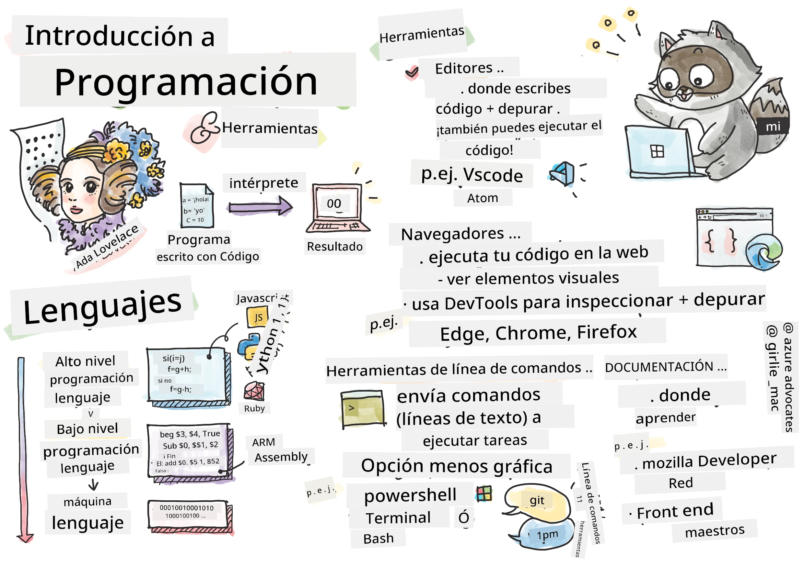
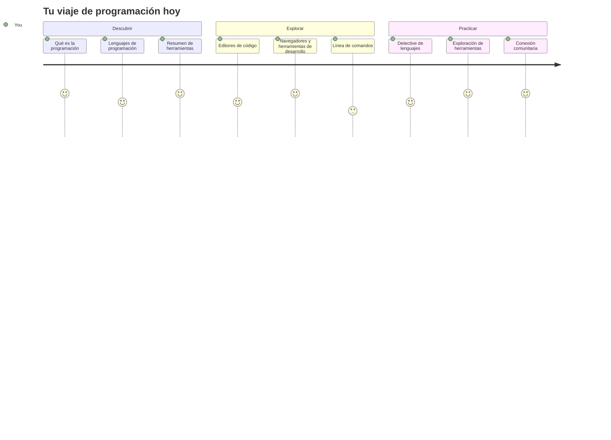
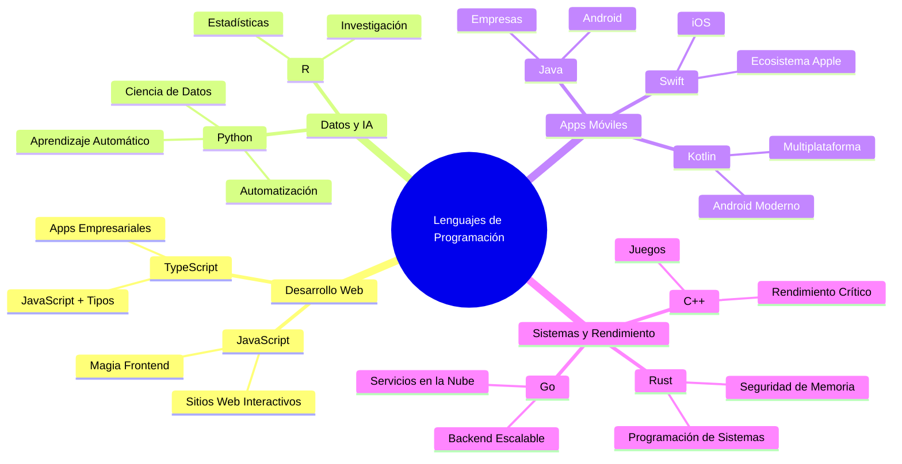
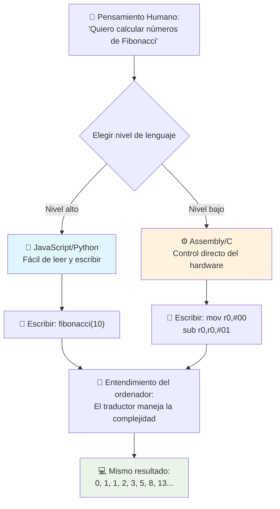
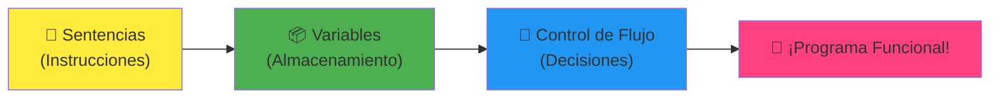
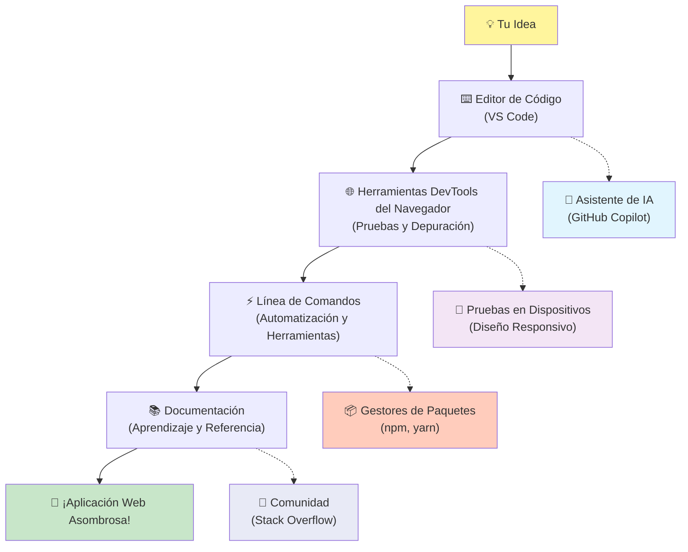
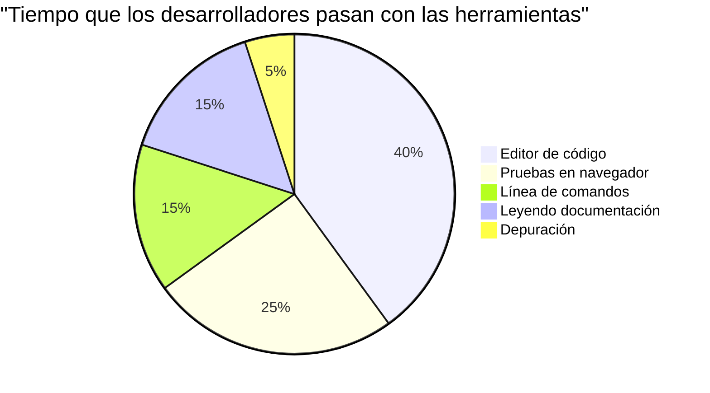
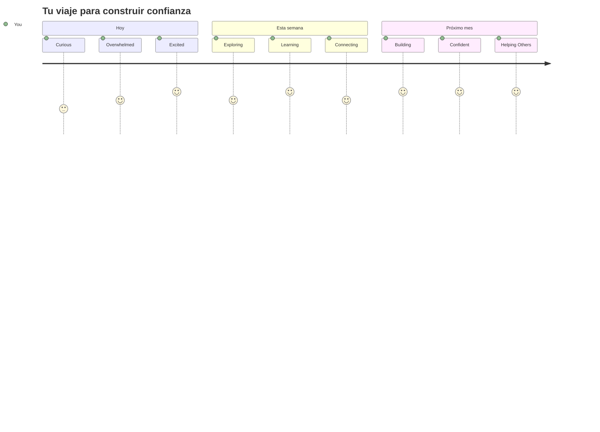

# Introducción a los Lenguajes de Programación y Herramientas Modernas para Desarrolladores

¡Hola, futuro desarrollador! 👋 ¿Puedo contarte algo que todavía me pone los pelos de punta todos los días? ¡Estás a punto de descubrir que programar no es solo sobre computadoras, sino que es como tener superpoderes reales para hacer que tus ideas más salvajes cobren vida!

¿Conoces ese momento cuando estás usando tu aplicación favorita y todo simplemente encaja perfectamente? Cuando tocas un botón y pasa algo absolutamente mágico que te hace decir "wow, ¿cómo HICIERON eso?" Pues alguien como tú – probablemente sentado en su cafetería favorita a las 2 AM con su tercer espresso – escribió el código que creó esa magia. Y aquí viene lo que te va a volar la mente: al final de esta lección, no solo entenderás cómo lo hicieron, ¡sino que estarás deseando intentarlo tú mismo!

Mira, entiendo perfectamente si ahora mismo la programación te parece intimidante. Cuando empecé, honestamente pensé que necesitabas ser un genio de las matemáticas o haber estado programando desde que tenías cinco años. Pero esto es lo que cambió completamente mi perspectiva: programar es exactamente como aprender a tener conversaciones en un nuevo idioma. Empiezas con "hola" y "gracias", luego avanzas a pedir un café, ¡y antes de que te des cuenta, estás teniendo profundas discusiones filosóficas! Excepto que en este caso, estás conversando con computadoras y, sinceramente, son las compañeras de conversación más pacientes del mundo: nunca juzgan tus errores y siempre están emocionadas de que lo intentes de nuevo.

Hoy, vamos a explorar las increíbles herramientas que hacen que el desarrollo web moderno no solo sea posible, sino seriamente adictivo. Estoy hablando de los mismos editores, navegadores y flujos de trabajo que usan los desarrolladores de Netflix, Spotify y tu estudio indie favorito todos los días. Y aquí está la parte que te hará bailar de alegría: ¡la mayoría de estas herramientas profesionales y estándar de la industria son completamente gratuitas!


> Sketchnote por [Tomomi Imura](https://twitter.com/girlie_mac)


```mermaid
journey
    title Tu viaje de programación hoy
    section Descubrir
      Qué es la programación: 5: You
      Lenguajes de programación: 4: You
      Resumen de herramientas: 5: You
    section Explorar
      Editores de código: 4: You
      Navegadores y herramientas de desarrollo: 5: You
      Línea de comandos: 3: You
    section Practicar
      Detective de lenguajes: 4: You
      Exploración de herramientas: 5: You
      Conexión comunitaria: 5: You
```
## ¡Veamos Qué Sabes Ya!

Antes de saltar a lo divertido, tengo curiosidad – ¿qué sabes ya sobre este mundo de la programación? Y oye, si al ver estas preguntas piensas "literalmente no sé nada de esto," ¡eso no solo está bien, es perfecto! Eso significa que estás en el lugar correcto. Piensa en este cuestionario como estiramiento antes de un entrenamiento – solo estamos calentando esos músculos cerebrales.

[Realiza el cuestionario previo a la lección](https://ff-quizzes.netlify.app/web/)


## La Aventura en la que Vamos a Embarcarnos Juntos

¡Vale, estoy genuinamente emocionado por lo que vamos a explorar hoy! En serio, ojalá pudiera ver tu cara cuando algunos de estos conceptos encajen. Aquí está el increíble viaje que vamos a tomar juntos:

- **Qué es realmente la programación (¡y por qué es lo más genial que existe!)** – Vamos a descubrir cómo el código es literalmente la magia invisible que impulsa todo a tu alrededor, desde esa alarma que de alguna manera sabe que es lunes por la mañana hasta el algoritmo que selecciona perfectamente tus recomendaciones en Netflix
- **Los lenguajes de programación y sus increíbles personalidades** – Imagina entrar a una fiesta donde cada persona tiene superpoderes completamente diferentes y distintas formas de resolver problemas. Así es el mundo de los lenguajes de programación, ¡y te encantará conocerlos!
- **Los bloques fundamentales que hacen posible la magia digital** – Piensa en estos como el set definitivo de LEGO creativo. Una vez que entiendas cómo encajan estas piezas, te darás cuenta de que literalmente puedes construir lo que tu imaginación sueñe
- **Herramientas profesionales que te harán sentir como si te acabaran de entregar una varita mágica** – No exagero aquí – estas herramientas realmente te harán sentir que tienes superpoderes, ¿y lo mejor? ¡Son las mismas que usan los profesionales!

> 💡 **Esto es lo importante**: No pienses ni por un momento en memorizar todo hoy. Ahora mismo, solo quiero que sientas esa chispa de emoción por lo que es posible. Los detalles se quedarán de forma natural mientras practicamos juntos – ¡así es el aprendizaje real!

> Puedes tomar esta lección en [Microsoft Learn](https://learn.microsoft.com/en-us/learn/modules/web-development-101/introduction-programming/?WT.mc_id=academic-77807-sagibbon)!

## Entonces, ¿Qué Es Exactamente la Programación?

Muy bien, abordemos la pregunta de un millón: ¿qué es realmente programar?

Te contaré una historia que cambió completamente cómo pienso sobre esto. La semana pasada, intentaba explicarle a mi mamá cómo usar nuestro nuevo control remoto inteligente para la TV. Me descubrí diciendo cosas como "Presiona el botón rojo, pero no el botón rojo grande, el botón rojo pequeño a la izquierda... no, tu otra izquierda... ok, ahora mantenlo presionado dos segundos, no uno, ni tres..." ¿Te suena familiar? 😅

¡Eso es programar! Es el arte de dar instrucciones increíblemente detalladas paso a paso a algo que es muy poderoso, pero que necesita que todo se explique perfectamente. Excepto que en lugar de explicarle a tu mamá (que puede preguntar "¿qué botón rojo?!"), le estás explicando a una computadora (que simplemente hace exactamente lo que dices, aunque no sea exactamente lo que quisiste decir).

Esto es lo que me impresionó cuando aprendí esto: las computadoras en realidad son bastante simples en su núcleo. Literalmente solo entienden dos cosas – 1 y 0, que básicamente es "sí" y "no" o "encendido" y "apagado." ¡Eso es todo! Pero aquí es donde empieza la magia – no tenemos que hablar en 1s y 0s como si estuviéramos en Matrix. Ahí es donde vienen al rescate los **lenguajes de programación**. Son como tener al mejor traductor del mundo que toma tus pensamientos humanos normales y los convierte en lenguaje de computadora.

Y aquí está lo que todavía me da escalofríos cada mañana al despertar: literalmente *todo* lo digital en tu vida comenzó con alguien como tú, probablemente en pijama con una taza de café, escribiendo código en su portátil. ¿Ese filtro de Instagram que te hace ver impecable? Alguien programó eso. ¿La recomendación que te llevó a tu nueva canción favorita? Un desarrollador creó ese algoritmo. ¿La app que te ayuda a dividir la cuenta de la cena con amigos? Sí, alguien pensó "esto es molesto, seguro que puedo arreglarlo" y luego... ¡lo hizo!

Cuando aprendes a programar, no solo estás adquiriendo una nueva habilidad – estás formando parte de esta increíble comunidad de solucionadores de problemas que pasan sus días pensando, "¿Qué pasaría si pudiera construir algo que haga el día de alguien un poquito mejor?" Honestamente, ¿hay algo más genial que eso?

✅ **Búsqueda de dato curioso**: Aquí tienes algo súper interesante para buscar cuando tengas un momento libre – ¿quién crees que fue el primer programador del mundo? Te doy una pista: ¡podría no ser quien esperas! La historia detrás de esta persona es absolutamente fascinante y muestra que la programación siempre ha sido sobre resolver problemas con creatividad y pensar fuera de la caja.

### 🧠 **Momento de reflexión: ¿Cómo te sientes?**

**Tómate un momento para reflexionar:**
- ¿Tiene sentido para ti ahora la idea de "dar instrucciones a las computadoras"?
- ¿Puedes pensar en una tarea diaria que te gustaría automatizar con programación?
- ¿Qué preguntas te están surgiendo en la cabeza sobre todo este asunto de la programación?

> **Recuerda**: Es totalmente normal que algunos conceptos se sientan confusos ahora mismo. Aprender a programar es como aprender un nuevo idioma – tu cerebro necesita tiempo para construir esas conexiones neuronales. ¡Lo estás haciendo genial!

## Los Lenguajes de Programación Son Como Diferentes Sabores de Magia

Vale, esto va a sonar raro, pero quédate conmigo – los lenguajes de programación son como diferentes tipos de música. Piensa en esto: tienes jazz, que es suave e improvisado; rock, que es poderoso y directo; clásico, que es elegante y estructurado; y hip-hop, que es creativo y expresivo. Cada estilo tiene su propia vibra, su propia comunidad de fans apasionados, y cada uno es perfecto para diferentes estados de ánimo y ocasiones.

¡Los lenguajes de programación funcionan exactamente igual! No usarías el mismo lenguaje para crear un juego móvil divertido que para procesar enormes cantidades de datos climáticos, igual que no pondrías death metal en una clase de yoga (bueno, en la mayoría de clases de yoga, ¡jeje!).

Pero esto es lo que cada vez que lo pienso me impresiona completamente: estos lenguajes son como tener al intérprete más paciente y brillante del mundo sentado a tu lado. Puedes expresar tus ideas de una manera que se siente natural para tu cerebro humano, y ellos se encargan de todo el trabajo increíblemente complejo de traducir eso a 1s y 0s que las computadoras realmente entienden. Es como tener un amigo que es perfectamente fluido tanto en "creatividad humana" como en "lógica de computadora" – ¡y nunca se cansa, nunca necesita pausas para café, y nunca te juzga por hacer la misma pregunta dos veces!

### Lenguajes de Programación Populares y Sus Usos


```mermaid
mindmap
  root((Lenguajes de Programación))
    Desarrollo Web
      JavaScript
        Magia Frontend
        Sitios Web Interactivos
      TypeScript
        JavaScript + Tipos
        Apps Empresariales
    Datos y IA
      Python
        Ciencia de Datos
        Aprendizaje Automático
        Automatización
      R
        Estadísticas
        Investigación
    Apps Móviles
      Java
        Android
        Empresas
      Swift
        iOS
        Ecosistema Apple
      Kotlin
        Android Moderno
        Multiplataforma
    Sistemas y Rendimiento
      C++
        Juegos
        Rendimiento Crítico
      Rust
        Seguridad de Memoria
        Programación de Sistemas
      Go
        Servicios en la Nube
        Backend Escalable
```
| Lenguaje | Mejor Para | Por Qué Es Popular |
|----------|------------|--------------------|
| **JavaScript** | Desarrollo web, interfaces de usuario | Funciona en navegadores y potencia sitios web interactivos |
| **Python** | Ciencia de datos, automatización, IA | Fácil de leer y aprender, librerías potentes |
| **Java** | Aplicaciones empresariales, apps Android | Independiente de plataforma, robusto para sistemas grandes |
| **C#** | Aplicaciones Windows, desarrollo de juegos | Fuerte soporte del ecosistema Microsoft |
| **Go** | Servicios en la nube, sistemas backend | Rápido, simple, diseñado para computación moderna |

### Lenguajes de Alto Nivel vs. Bajo Nivel

Bien, honestamente este fue el concepto que me voló la cabeza cuando empecé a aprender, así que voy a compartir la analogía que finalmente me hizo entender – ¡y espero que también te ayude!

Imagina que estás visitando un país donde no hablas el idioma y necesitas urgentemente encontrar el baño más cercano (a todos nos ha pasado, ¿verdad? 😅):

- **Programación de bajo nivel** es como aprender tan bien el dialecto local que puedes charlar con la abuela que vende fruta en la esquina usando referencias culturales, jerga local y bromas internas que sólo alguien que creció allí entendería. Súper impresionante e increíblemente eficiente... ¡si acaso eres fluido! Pero bastante abrumador cuando solo tratas de encontrar el baño.

- **Programación de alto nivel** es como tener ese amigo local increíble que simplemente te entiende. Puedes decir "Realmente necesito encontrar un baño" en inglés simple, y ellos manejan toda la traducción cultural y te dan instrucciones que tienen perfecto sentido para tu cerebro no local.

En términos de programación:
- Los **lenguajes de bajo nivel** (como Assembly o C) te permiten tener conversaciones sumamente detalladas con el hardware real de la computadora, pero necesitas pensar como una máquina, lo cual... bueno, digamos que es un cambio mental bastante grande.
- Los **lenguajes de alto nivel** (como JavaScript, Python o C#) te permiten pensar como un humano mientras ellos gestionan todo el lenguaje máquina detrás de escenas. Además, tienen comunidades increíblemente acogedoras llenas de gente que recuerda lo que es ser nuevo y que realmente quiere ayudar.

¿Adivina con cuáles voy a sugerirte que empieces? 😉 Los lenguajes de alto nivel son como tener rueditas de entrenamiento que en realidad nunca quieres quitar porque hacen toda la experiencia mucho más agradable.


```mermaid
flowchart TB
    A["👤 Pensamiento Humano:<br/>'Quiero calcular números de Fibonacci'"] --> B{Elegir nivel de lenguaje}
    
    B -->|Nivel alto| C["🌟 JavaScript/Python<br/>Fácil de leer y escribir"]
    B -->|Nivel bajo| D["⚙️ Assembly/C<br/>Control directo del hardware"]
    
    C --> E["📝 Escribir: fibonacci(10)"]
    D --> F["📝 Escribir: mov r0,#00<br/>sub r0,r0,#01"]
    
    E --> G["🤖 Entendimiento del ordenador:<br/>El traductor maneja la complejidad"]
    F --> G
    
    G --> H["💻 Mismo resultado:<br/>0, 1, 1, 2, 3, 5, 8, 13..."]
    
    style C fill:#e1f5fe
    style D fill:#fff3e0
    style H fill:#e8f5e8
```
### Déjame Mostrarte Por Qué Los Lenguajes de Alto Nivel Son Mucho Más Amigables

Muy bien, estoy a punto de mostrarte algo que demuestra perfectamente por qué me enamoré de los lenguajes de alto nivel, pero primero – necesito que me hagas una promesa. Cuando veas ese primer ejemplo de código, no entres en pánico. Se supone que debe parecer intimidante. ¡Ese es exactamente el punto que quiero hacer!

Vamos a ver la misma tarea escrita en dos estilos completamente diferentes. Ambas crean lo que se llama la secuencia de Fibonacci – es un hermoso patrón matemático donde cada número es la suma de los dos anteriores: 0, 1, 1, 2, 3, 5, 8, 13... (Dato curioso: encontrarás este patrón literalmente en todas partes en la naturaleza – espirales de semillas de girasol, patrones de piñas, ¡incluso la forma en que se forman las galaxias!)

¿Listo para ver la diferencia? ¡Vamos!

**Lenguaje de alto nivel (JavaScript) – Amigable para humanos:**

```javascript
// Paso 1: Configuración básica de Fibonacci
const fibonacciCount = 10;
let current = 0;
let next = 1;

console.log('Fibonacci sequence:');
```

**Esto es lo que hace este código:**
- **Declarar** una constante para especificar cuántos números de Fibonacci queremos generar
- **Inicializar** dos variables para seguir el número actual y el siguiente en la secuencia
- **Establecer** los valores iniciales (0 y 1) que definen el patrón de Fibonacci
- **Mostrar** un mensaje de encabezado para identificar nuestra salida

```javascript
// Paso 2: Generar la secuencia con un bucle
for (let i = 0; i < fibonacciCount; i++) {
  console.log(`Position ${i + 1}: ${current}`);
  
  // Calcular el siguiente número en la secuencia
  const sum = current + next;
  current = next;
  next = sum;
}
```

**Desglosando lo que pasa aquí:**
- **Recorrer** cada posición en la secuencia usando un bucle `for`
- **Mostrar** cada número con su posición usando formato de plantilla literal
- **Calcular** el siguiente número de Fibonacci sumando los valores actual y siguiente
- **Actualizar** nuestras variables para pasar a la siguiente iteración

```javascript
// Paso 3: Enfoque funcional moderno
const generateFibonacci = (count) => {
  const sequence = [0, 1];
  
  for (let i = 2; i < count; i++) {
    sequence[i] = sequence[i - 1] + sequence[i - 2];
  }
  
  return sequence;
};

// Ejemplo de uso
const fibSequence = generateFibonacci(10);
console.log(fibSequence);
```

**En lo anterior, hemos:**
- **Creado** una función reutilizable usando sintaxis moderna de funciones flecha
- **Construido** un arreglo para almacenar la secuencia completa en lugar de mostrar número por número
- **Usado** indexación de arreglos para calcular cada nuevo número a partir de valores previos
- **Retornado** la secuencia completa para uso flexible en otras partes de nuestro programa

**Lenguaje de bajo nivel (ARM Assembly) – Amigable para computadoras:**

```assembly
 area ascen,code,readonly
 entry
 code32
 adr r0,thumb+1
 bx r0
 code16
thumb
 mov r0,#00
 sub r0,r0,#01
 mov r1,#01
 mov r4,#10
 ldr r2,=0x40000000
back add r0,r1
 str r0,[r2]
 add r2,#04
 mov r3,r0
 mov r0,r1
 mov r1,r3
 sub r4,#01
 cmp r4,#00
 bne back
 end
```

Fíjate cómo la versión en JavaScript se lee casi como instrucciones en inglés, mientras que la versión en Assembly usa comandos crípticos que controlan directamente el procesador de la computadora. Ambas logran la misma tarea, pero el lenguaje de alto nivel es mucho más fácil para que los humanos entiendan, escriban y mantengan.

**Diferencias clave que notarás:**
- **Legibilidad**: JavaScript usa nombres descriptivos como `fibonacciCount` mientras que Assembly usa etiquetas crípticas como `r0`, `r1`
- **Comentarios**: Los lenguajes de alto nivel fomentan comentarios explicativos que hacen que el código se documente por sí mismo
- **Estructura**: El flujo lógico de JavaScript coincide con la forma en que los humanos pensamos sobre problemas paso a paso
- **Mantenimiento**: Actualizar la versión de JavaScript para diferentes requerimientos es sencillo y claro

✅ **Acerca de la secuencia de Fibonacci**: Este patrón de números absolutamente hermoso (donde cada número es igual a la suma de los dos anteriores: 0, 1, 1, 2, 3, 5, 8...) ¡aparece literalmente *en todas partes* en la naturaleza! Lo encontrarás en las espirales de los girasoles, los patrones de las piñas, la curva de las conchas de nautilus e incluso en cómo crecen las ramas de los árboles. ¡Es realmente asombroso cómo las matemáticas y el código pueden ayudarnos a entender y recrear los patrones que la naturaleza usa para crear belleza!


## Los Bloques Fundamentales Que Hacen Que la Magia Suceda

Bien, ahora que has visto cómo lucen los lenguajes de programación en acción, vamos a desglosar las piezas fundamentales que conforman literalmente todos los programas escritos. Piensa en estos como los ingredientes esenciales en tu receta favorita – una vez que entiendas qué hace cada uno, ¡podrás leer y escribir código en prácticamente cualquier lenguaje!

Esto es algo así como aprender la gramática de la programación. ¿Recuerdas en la escuela cuando aprendiste sobre sustantivos, verbos y cómo armar oraciones? La programación tiene su propia versión de gramática, y honestamente, ¡es mucho más lógica y tolerante que la gramática inglesa! 😄

### Sentencias: Las Instrucciones Paso a Paso

Comencemos con las **sentencias** – son como oraciones individuales en una conversación con tu computadora. Cada sentencia le dice a la computadora que haga algo específico, como dar indicaciones: "Gira a la izquierda aquí", "Detente en el semáforo rojo", "Estaciona en ese lugar".

Lo que me encanta de las sentencias es lo legibles que suelen ser. Mira esto:

```javascript
// Declaraciones básicas que realizan acciones individuales
const userName = "Alex";                    
console.log("Hello, world!");              
const sum = 5 + 3;                         
```

**Esto es lo que hace este código:**
- **Declarar** una variable constante para guardar el nombre de un usuario
- **Mostrar** un mensaje de saludo en la consola de salida
- **Calcular** y almacenar el resultado de una operación matemática

```javascript
// Declaraciones que interactúan con páginas web
document.title = "My Awesome Website";      
document.body.style.backgroundColor = "lightblue";
```

**Paso a paso, esto es lo que sucede:**
- **Modificar** el título de la página web que aparece en la pestaña del navegador
- **Cambiar** el color de fondo de todo el cuerpo de la página

### Variables: El Sistema de Memoria de Tu Programa

Bien, las **variables** son honestamente uno de mis conceptos favoritos para enseñar porque son muy parecidas a cosas que ya usas todos los días.

Piensa en la lista de contactos de tu teléfono por un segundo. No memorizas el número de teléfono de todos — en su lugar, guardas “Mamá”, “Mejor Amigo” o “Pizzería Que Reparte Hasta Las 2 AM” y dejas que tu teléfono recuerde los números reales. ¡Las variables funcionan exactamente igual! Son como contenedores etiquetados donde tu programa puede almacenar información y recuperarla después usando un nombre que realmente tenga sentido.

Lo realmente genial: las variables pueden cambiar mientras tu programa se ejecuta (de ahí viene el nombre "variable" — ¿ves qué hicieron ahí?). Así como puedes actualizar ese contacto de la pizzería cuando descubres un lugar aún mejor, las variables pueden actualizarse a medida que tu programa aprende nueva información o cambian las situaciones.

Déjame mostrarte cómo puede ser esto de maravillosamente simple:

```javascript
// Paso 1: Creando variables básicas
const siteName = "Weather Dashboard";        
let currentWeather = "sunny";               
let temperature = 75;                       
let isRaining = false;                      
```

**Entendiendo estos conceptos:**
- **Guardar** valores inmutables en variables `const` (como el nombre del sitio)
- **Usar** `let` para valores que pueden cambiar durante tu programa
- **Asignar** diferentes tipos de datos: cadenas (texto), números y booleanos (true/false)
- **Elegir** nombres descriptivos que expliquen lo que cada variable contiene

```javascript
// Paso 2: Trabajando con objetos para agrupar datos relacionados
const weatherData = {                       
  location: "San Francisco",
  humidity: 65,
  windSpeed: 12
};
```

**En el ejemplo anterior, hemos:**
- **Creado** un objeto para agrupar información del clima relacionada
- **Organizado** múltiples datos bajo un solo nombre de variable
- **Usado** pares clave-valor para etiquetar claramente cada dato

```javascript
// Paso 3: Uso y actualización de variables
console.log(`${siteName}: Today is ${currentWeather} and ${temperature}°F`);
console.log(`Wind speed: ${weatherData.windSpeed} mph`);

// Actualización de variables cambiantes
currentWeather = "cloudy";                  
temperature = 68;                          
```

**Vamos a entender cada parte:**
- **Mostrar** información usando literales de plantilla con la sintaxis `${}`
- **Acceder** a propiedades de un objeto usando notación de punto (`weatherData.windSpeed`)
- **Actualizar** variables declaradas con `let` para reflejar condiciones cambiantes
- **Combinar** múltiples variables para crear mensajes significativos

```javascript
// Paso 4: Desestructuración moderna para un código más limpio
const { location, humidity } = weatherData; 
console.log(`${location} humidity: ${humidity}%`);
```

**Lo que necesitas saber:**
- **Extraer** propiedades específicas de objetos usando asignación por destructuración
- **Crear** nuevas variables automáticamente con los mismos nombres que las claves del objeto
- **Simplificar** código evitando la repetición de notación de punto

### Flujo de Control: Enseñándole a Tu Programa a Pensar

Muy bien, aquí es donde la programación se vuelve absolutamente asombrosa. El **flujo de control** es básicamente enseñarle a tu programa a tomar decisiones inteligentes, exactamente como tú haces todos los días sin ni siquiera pensarlo.

Imagina esto: esta mañana probablemente hiciste algo como “Si está lloviendo, agarro un paraguas. Si hace frío, me pongo una chaqueta. Si voy tarde, me salto el desayuno y tomo café camino al trabajo”. ¡Tu cerebro sigue naturalmente esta lógica if-then docenas de veces cada día!

Esto es lo que hace que los programas se sientan inteligentes y vivos en vez de solo seguir un guion aburrido y predecible. Pueden realmente mirar una situación, evaluar qué está pasando y responder adecuadamente. Es como darle a tu programa un cerebro que puede adaptarse y tomar decisiones.

¿Quieres ver lo maravillosamente que funciona? Déjame mostrarte:

```javascript
// Paso 1: Lógica condicional básica
const userAge = 17;

if (userAge >= 18) {
  console.log("You can vote!");
} else {
  const yearsToWait = 18 - userAge;
  console.log(`You'll be able to vote in ${yearsToWait} year(s).`);
}
```

**Esto es lo que hace este código:**
- **Verificar** si la edad del usuario cumple con el requisito para votar
- **Ejecutar** diferentes bloques de código según el resultado de la condición
- **Calcular** y mostrar cuánto falta para que pueda votar si es menor de 18
- **Proveer** retroalimentación específica y útil para cada escenario

```javascript
// Paso 2: Múltiples condiciones con operadores lógicos
const userAge = 17;
const hasPermission = true;

if (userAge >= 18 && hasPermission) {
  console.log("Access granted: You can enter the venue.");
} else if (userAge >= 16) {
  console.log("You need parent permission to enter.");
} else {
  console.log("Sorry, you must be at least 16 years old.");
}
```

**Desglosando lo que sucede aquí:**
- **Combinar** múltiples condiciones usando el operador `&&` (y)
- **Crear** una jerarquía de condiciones con `else if` para múltiples escenarios
- **Manejar** todos los casos posibles con una sentencia final `else`
- **Proveer** retroalimentación clara y accionable para cada situación diferente

```javascript
// Paso 3: Condicional conciso con operador ternario
const votingStatus = userAge >= 18 ? "Can vote" : "Cannot vote yet";
console.log(`Status: ${votingStatus}`);
```

**Lo que debes recordar:**
- **Usar** el operador ternario (`? :`) para condiciones simples de dos opciones
- **Escribir** la condición primero, seguida de `?`, luego resultado si es verdadero, después `:`, y finalmente resultado si es falso
- **Aplicar** este patrón cuando necesites asignar valores según condiciones

```javascript
// Paso 4: Manejo de múltiples casos específicos
const dayOfWeek = "Tuesday";

switch (dayOfWeek) {
  case "Monday":
  case "Tuesday":
  case "Wednesday":
  case "Thursday":
  case "Friday":
    console.log("It's a weekday - time to work!");
    break;
  case "Saturday":
  case "Sunday":
    console.log("It's the weekend - time to relax!");
    break;
  default:
    console.log("Invalid day of the week");
}
```

**Este código logra lo siguiente:**
- **Comparar** el valor de una variable con múltiples casos específicos
- **Agrupar** casos similares (días laborables vs fines de semana)
- **Ejecutar** el bloque de código apropiado cuando se encuentra una coincidencia
- **Incluir** un caso `default` para manejar valores inesperados
- **Usar** sentencias `break` para evitar que el código continúe al siguiente caso

> 💡 **Analogía del mundo real**: Piensa en el flujo de control como tener el GPS más paciente del mundo dándote indicaciones. Puede decir: "Si hay tráfico en la Calle Principal, toma la autopista. Si la autopista está en construcción, prueba la ruta panorámica". Los programas usan exactamente el mismo tipo de lógica condicional para responder inteligentemente a diferentes situaciones y siempre brindar a los usuarios la mejor experiencia posible.

### 🎯 **Chequeo de Conceptos: Dominio de los Bloques Fundamentales**

**Veamos cómo vas con los fundamentos:**
- ¿Puedes explicar la diferencia entre una variable y una sentencia con tus propias palabras?
- Piensa en un escenario del mundo real donde usarías una decisión if-then (como nuestro ejemplo de votar)
- ¿Qué fue algo sobre la lógica de la programación que te sorprendió?

**Un refuerzo rápido de confianza:**

```mermaid
flowchart LR
    A["📝 Sentencias<br/>(Instrucciones)"] --> B["📦 Variables<br/>(Almacenamiento)"] --> C["🔀 Control de Flujo<br/>(Decisiones)"] --> D["🎉 ¡Programa Funcional!"]
    
    style A fill:#ffeb3b
    style B fill:#4caf50
    style C fill:#2196f3
    style D fill:#ff4081
```
✅ **Lo que viene ahora**: ¡Vamos a divertirnos muchísimo profundizando en estos conceptos mientras continuamos este increíble viaje juntos! Por ahora, solo céntrate en sentir esa emoción sobre todas las increíbles posibilidades que te esperan. Las habilidades y técnicas específicas se pegarán naturalmente a medida que practiquemos juntos – ¡te prometo que será mucho más divertido de lo que esperas!

## Herramientas del Oficio

Bien, honestamente aquí es donde me emociono tanto que apenas me puedo contener! 🚀 Estamos a punto de hablar de las increíbles herramientas que te harán sentir como si te acabaran de entregar las llaves de una nave espacial digital.

¿Sabes cómo un chef tiene esos cuchillos perfectamente balanceados que se sienten como extensiones de sus manos? ¿O cómo un músico tiene esa guitarra que parece cantar en cuanto la toca? Bueno, los desarrolladores tenemos nuestra propia versión de estas herramientas mágicas, y aquí está lo que te va a dejar maravillado – ¡la mayoría son completamente gratuitas!

Prácticamente salto en mi silla pensando en compartirlas contigo porque han revolucionado completamente cómo construimos software. Estamos hablando de asistentes de código impulsados por IA que pueden ayudarte a escribir código (¡no bromeo!), entornos en la nube donde puedes construir aplicaciones enteras desde literalmente cualquier lugar con Wi-Fi, y herramientas de depuración tan sofisticadas que son como tener visión de rayos X para tus programas.

Y aquí viene la parte que todavía me pone la piel de gallina: estas no son "herramientas para principiantes" que vas a dejar atrás. ¡Estas son las mismas herramientas profesionales que usan desarrolladores en Google, Netflix y ese estudio indie de apps que tanto te gusta justo en este momento! Usarlas te hará sentir como todo un profesional.


```mermaid
graph TD
    A["💡 Tu Idea"] --> B["⌨️ Editor de Código<br/>(VS Code)"] 
    B --> C["🌐 Herramientas DevTools del Navegador<br/>(Pruebas y Depuración)"]
    C --> D["⚡ Línea de Comandos<br/>(Automatización y Herramientas)"]
    D --> E["📚 Documentación<br/>(Aprendizaje y Referencia)"]
    E --> F["🚀 ¡Aplicación Web Asombrosa!"]
    
    B -.-> G["🤖 Asistente de IA<br/>(GitHub Copilot)"]
    C -.-> H["📱 Pruebas en Dispositivos<br/>(Diseño Responsivo)"]
    D -.-> I["📦 Gestores de Paquetes<br/>(npm, yarn)"]
    E -.-> J["👥 Comunidad<br/>(Stack Overflow)"]
    
    style A fill:#fff59d
    style F fill:#c8e6c9
    style G fill:#e1f5fe
    style H fill:#f3e5f5
    style I fill:#ffccbc
    style J fill:#e8eaf6
```
### Editores de Código e IDEs: Tus Nuevos Mejores Amigos Digitales

Hablemos de los editores de código – estos están a punto de convertirse seriamente en tus lugares favoritos para pasar el rato. Piensa en ellos como tu santuario personal de codificación donde pasarás la mayor parte del tiempo creando y perfeccionando tus obras digitales.

Pero aquí está lo absolutamente mágico de los editores modernos: no son solo editores de texto bonitos. Son como tener al mentor de codificación más brillante y solidario sentado justo a tu lado 24/7. Detectan tus errores tipográficos antes de que siquiera los notes, sugieren mejoras que te hacen parecer un genio, te ayudan a entender qué hace cada fragmento de código, ¡y algunos incluso pueden predecir lo que estás por escribir y ofrecer terminar tus ideas!

Recuerdo cuando descubrí la autocompletación — literalmente sentí que estaba viviendo en el futuro. Empiezas a escribir algo, y tu editor te dice, "Oye, ¿pensabas en esta función que hace exactamente lo que necesitas?" Es como tener un lector de mentes como compañero de codificación.

**¿Qué hace que estos editores sean tan increíbles?**

Los editores de código modernos ofrecen una impresionante variedad de características diseñadas para aumentar tu productividad:

| Característica | Qué Hace | Por qué Ayuda |
|---------------|----------|--------------|
| **Resaltado de Sintaxis** | Colorea diferentes partes de tu código | Facilita la lectura y detectar errores |
| **Autocompletado** | Sugiere código mientras escribes | Acelera la codificación y reduce errores tipográficos |
| **Herramientas de Depuración** | Te ayuda a encontrar y corregir errores | Ahorra horas solucionando problemas |
| **Extensiones** | Agrega funciones especializadas | Personaliza tu editor para cualquier tecnología |
| **Asistentes de IA** | Sugiere código y explicaciones | Acelera el aprendizaje y la productividad |

> 🎥 **Recurso en video**: ¿Quieres ver estas herramientas en acción? Mira este [video Herramientas del Oficio](https://youtube.com/watch?v=69WJeXGBdxg) para una visión completa.

#### Editores Recomendados para Desarrollo Web

**[Visual Studio Code](https://code.visualstudio.com/?WT.mc_id=academic-77807-sagibbon)** (Gratis)
- El más popular entre desarrolladores web
- Excelente ecosistema de extensiones
- Terminal integrado e integración con Git
- **Extensiones imprescindibles**:
  - [GitHub Copilot](https://marketplace.visualstudio.com/items?itemName=GitHub.copilot) - Sugerencias de código impulsadas por IA
  - [Live Share](https://marketplace.visualstudio.com/items?itemName=MS-vsliveshare.vsliveshare) - Colaboración en tiempo real
  - [Prettier](https://marketplace.visualstudio.com/items?itemName=esbenp.prettier-vscode) - Formateo automático de código
  - [Code Spell Checker](https://marketplace.visualstudio.com/items?itemName=streetsidesoftware.code-spell-checker) - Detecta errores tipográficos en tu código

**[JetBrains WebStorm](https://www.jetbrains.com/webstorm/)** (De pago, gratis para estudiantes)
- Herramientas avanzadas de depuración y pruebas
- Autocompletado inteligente de código
- Control de versiones integrado

**IDEs Basados en la Nube** (Diversos precios)
- [GitHub Codespaces](https://github.com/features/codespaces) - VS Code completo en tu navegador
- [Replit](https://replit.com/) - Genial para aprender y compartir código
- [StackBlitz](https://stackblitz.com/) - Desarrollo web full-stack instantáneo

> 💡 **Consejo para comenzar**: Empieza con Visual Studio Code – es gratis, muy usado en la industria y tiene una comunidad enorme creando tutoriales útiles y extensiones.


### Navegadores Web: Tu Laboratorio Secreto de Desarrollo

Bien, prepárate para que te explote la mente por completo. ¿Sabes cómo has estado usando los navegadores para ver redes sociales y videos? ¡Bueno, resulta que han estado ocultando este increíble laboratorio secreto para desarrolladores todo este tiempo, esperando que lo descubras!

Cada vez que clickeas derecho en una página web y seleccionas "Inspeccionar elemento", estás abriendo un mundo oculto de herramientas para desarrolladores que honestamente son más poderosas que algunos softwares caros por los que solía pagar cientos de dólares. ¡Es como descubrir que tu cocina común y corriente ha estado ocultando un laboratorio profesional de chef detrás de un panel secreto!
La primera vez que alguien me mostró las herramientas de desarrollo del navegador, pasé como tres horas simplemente haciendo clic por todas partes y diciendo "¡ESPERA, ¿ESO TAMBIÉN PUEDE HACERLO?!" Literalmente puedes editar cualquier sitio web en tiempo real, ver exactamente qué tan rápido carga todo, probar cómo se ve tu sitio en diferentes dispositivos e incluso depurar JavaScript como un profesional total. ¡Es absolutamente impresionante!

**Aquí está la razón por la que los navegadores son tu arma secreta:**

Cuando creas un sitio web o una aplicación web, necesitas ver cómo se ve y se comporta en el mundo real. Los navegadores no solo muestran tu trabajo, sino que también proporcionan retroalimentación detallada sobre rendimiento, accesibilidad y posibles problemas.

#### Herramientas para desarrolladores del navegador (DevTools)

Los navegadores modernos incluyen suites completas de desarrollo:

| Categoría de herramienta | Qué hace | Ejemplo de uso |
|--------------------------|----------|----------------|
| **Inspector de elementos** | Ver y editar HTML/CSS en tiempo real | Ajustar estilos para ver resultados inmediatos |
| **Consola** | Ver mensajes de error y probar JavaScript | Depurar problemas y experimentar con código |
| **Monitor de red** | Rastrear cómo se cargan los recursos | Optimizar el rendimiento y los tiempos de carga |
| **Verificador de accesibilidad** | Probar diseño inclusivo | Asegurar que tu sitio funcione para todos los usuarios |
| **Simulador de dispositivos** | Previsualizar en diferentes tamaños de pantalla | Probar diseño responsivo sin múltiples dispositivos |

#### Navegadores recomendados para desarrollo

- **[Chrome](https://developers.google.com/web/tools/chrome-devtools/)** - DevTools estándar de la industria con documentación extensa
- **[Firefox](https://developer.mozilla.org/docs/Tools)** - Excelentes herramientas para CSS Grid y accesibilidad
- **[Edge](https://docs.microsoft.com/microsoft-edge/devtools-guide-chromium/?WT.mc_id=academic-77807-sagibbon)** - Construido sobre Chromium con recursos para desarrolladores de Microsoft

> ⚠️ **Consejo importante para pruebas**: ¡Siempre prueba tus sitios web en múltiples navegadores! Lo que funciona perfectamente en Chrome puede verse diferente en Safari o Firefox. Los desarrolladores profesionales prueban en todos los navegadores principales para asegurar experiencias de usuario consistentes.


### Herramientas de línea de comandos: Tu puerta a superpoderes de desarrollador

Muy bien, tengamos un momento completamente honesto aquí sobre la línea de comandos, porque quiero que lo escuches de alguien que realmente lo entiende. La primera vez que la vi – esa pantalla negra y aterradora con texto parpadeante – literalmente pensé, "No, absolutamente no. ¡Esto parece algo de una película de hackers de los años 80 y definitivamente no soy lo suficientemente inteligente para esto!" 😅

Pero aquí está lo que desearía que alguien me hubiera dicho entonces, y lo que te digo ahora: la línea de comandos no da miedo, en realidad es como tener una conversación directa con tu computadora. Piensa en la diferencia entre pedir comida a través de una aplicación elegante con fotos y menús (lo cual es agradable y fácil) versus entrar a tu restaurante local favorito donde el chef sabe exactamente lo que te gusta y puede preparar algo perfecto solo con que digas "sorpréndeme con algo increíble."

La línea de comandos es donde los desarrolladores se sienten como magos absolutos. Tecleas unas pocas palabras que parecen mágicas (bueno, son solo comandos, pero se sienten mágicos), presionas enter y ¡BANG! — has creado estructuras de proyectos enteros, instalado herramientas poderosas de todo el mundo o desplegado tu aplicación en internet para que millones de personas la vean. Una vez que pruebas ese poder, honestamente es bastante adictivo.

**Por qué la línea de comandos se convertirá en tu herramienta favorita:**

Aunque las interfaces gráficas son geniales para muchas tareas, la línea de comandos sobresale en automatización, precisión y velocidad. Muchas herramientas de desarrollo funcionan principalmente a través de interfaces de línea de comandos, y aprender a usarlas eficientemente puede mejorar drásticamente tu productividad.

```bash
# Paso 1: Crear y navegar al directorio del proyecto
mkdir my-awesome-website
cd my-awesome-website
```

**Esto es lo que hace este código:**
- **Crear** un nuevo directorio llamado "my-awesome-website" para tu proyecto
- **Navegar** dentro del directorio recién creado para empezar a trabajar

```bash
# Paso 2: Inicializar el proyecto con package.json
npm init -y

# Instalar herramientas modernas de desarrollo
npm install --save-dev vite prettier eslint
npm install --save-dev @eslint/js
```

**Paso a paso, esto es lo que está pasando:**
- **Inicializar** un nuevo proyecto Node.js con configuraciones predeterminadas usando `npm init -y`
- **Instalar** Vite como herramienta moderna de construcción para desarrollos y compilaciones rápidas
- **Agregar** Prettier para formateo automático de código y ESLint para revisiones de calidad de código
- **Usar** la bandera `--save-dev` para marcar estas dependencias solo para desarrollo

```bash
# Paso 3: Crear la estructura del proyecto y los archivos
mkdir src assets
echo '<!DOCTYPE html><html><head><title>My Site</title></head><body><h1>Hello World</h1></body></html>' > index.html

# Iniciar el servidor de desarrollo
npx vite
```

**En lo anterior, hemos:**
- **Organizado** nuestro proyecto creando carpetas separadas para código fuente y recursos
- **Generado** un archivo HTML básico con estructura adecuada del documento
- **Iniciado** el servidor de desarrollo de Vite para recarga en vivo y reemplazo en caliente de módulos

#### Herramientas esenciales de línea de comandos para desarrollo web

| Herramienta | Propósito | Por qué la necesitas |
|-------------|-----------|---------------------|
| **[Git](https://git-scm.com/)** | Control de versiones | Rastrear cambios, colaborar y respaldar tu trabajo |
| **[Node.js & npm](https://nodejs.org/)** | Entorno de ejecución JavaScript y gestión de paquetes | Ejecutar JavaScript fuera del navegador e instalar herramientas modernas |
| **[Vite](https://vitejs.dev/)** | Herramienta de compilación y servidor de desarrollo | Desarrollo súper rápido con reemplazo en caliente de módulos |
| **[ESLint](https://eslint.org/)** | Calidad de código | Encontrar y corregir automáticamente problemas en tu JavaScript |
| **[Prettier](https://prettier.io/)** | Formateo del código | Mantener tu código con formato consistente y legible |

#### Opciones específicas por plataforma

**Windows:**
- **[Windows Terminal](https://docs.microsoft.com/windows/terminal/?WT.mc_id=academic-77807-sagibbon)** - Terminal moderno y con muchas funciones
- **[PowerShell](https://docs.microsoft.com/powershell/?WT.mc_id=academic-77807-sagibbon)** 💻 - Entorno potente de scripting
- **[Command Prompt](https://learn.microsoft.com/windows-server/administration/windows-commands/windows-commands)** 💻 - Línea de comandos tradicional de Windows

**macOS:**
- **[Terminal](https://support.apple.com/guide/terminal/)** 💻 - Aplicación de terminal integrada
- **[iTerm2](https://iterm2.com/)** - Terminal mejorado con funciones avanzadas

**Linux:**
- **[Bash](https://www.gnu.org/software/bash/)** 💻 - Shell estándar de Linux
- **[KDE Konsole](https://docs.kde.org/trunk5/en/konsole/konsole/index.html)** - Emulador de terminal avanzado

> 💻 = Preinstalado en el sistema operativo

> 🎯 **Camino de aprendizaje**: Comienza con comandos básicos como `cd` (cambiar directorio), `ls` o `dir` (listar archivos), y `mkdir` (crear carpeta). Practica con comandos modernos de flujo de trabajo como `npm install`, `git status`, y `code .` (abre el directorio actual en VS Code). A medida que te sientas más cómodo, naturalmente aprenderás comandos más avanzados y técnicas de automatización.


### Documentación: Tu mentor de aprendizaje siempre disponible

Bien, déjame compartirte un pequeño secreto que te hará sentir mucho mejor por ser principiante: incluso los desarrolladores más experimentados pasan gran parte de su tiempo leyendo documentación. Y no es porque no sepan lo que están haciendo; ¡es en realidad un signo de sabiduría!

Piensa en la documentación como tener acceso a los maestros más pacientes y conocedores del mundo, disponibles 24/7. ¿Atascado con un problema a las 2 AM? La documentación está ahí con un cálido abrazo virtual y justo la respuesta que necesitas. ¿Quieres aprender sobre alguna función genial de la que todos hablan? La documentación te respalda con ejemplos paso a paso. ¿Intentas entender por qué algo funciona de una manera determinada? Lo adivinaste: la documentación está lista para explicártelo de una forma que finalmente tenga sentido.

Aquí hay algo que realmente cambió mi perspectiva: el mundo del desarrollo web se mueve increíblemente rápido y nadie (¡absolutamente nadie!) recuerda todo de memoria. He visto a desarrolladores sénior con más de 15 años de experiencia buscar sintaxis básica, ¿y sabes qué? Eso no es vergonzoso, ¡es inteligente! No se trata de tener memoria perfecta, sino de saber dónde encontrar respuestas confiables rápidamente y cómo aplicarlas.

**Aquí es donde ocurre la verdadera magia:**

Los desarrolladores profesionales dedican una parte significativa de su tiempo a leer documentación, no porque no sepan lo que hacen, sino porque el desarrollo web evoluciona tan rápido que mantenerse actualizado requiere aprendizaje continuo. La buena documentación te ayuda a entender no solo *cómo* usar algo, sino *por qué* y *cuándo* usarlo.

#### Recursos esenciales de documentación

**[Mozilla Developer Network (MDN)](https://developer.mozilla.org/docs/Web)**
- El estándar de oro para documentación de tecnologías web
- Guías completas para HTML, CSS y JavaScript
- Incluye información de compatibilidad entre navegadores
- Presenta ejemplos prácticos y demos interactivas

**[Web.dev](https://web.dev)** (por Google)
- Mejores prácticas modernas de desarrollo web
- Guías de optimización de rendimiento
- Principios de accesibilidad y diseño inclusivo
- Estudios de caso de proyectos reales

**[Documentación para desarrolladores de Microsoft](https://docs.microsoft.com/microsoft-edge/#microsoft-edge-for-developers)**
- Recursos para desarrollo en el navegador Edge
- Guías para Progressive Web Apps
- Perspectivas de desarrollo multiplataforma

**[Rutas de aprendizaje Frontend Masters](https://frontendmasters.com/learn/)**
- Currículos estructurados de aprendizaje
- Cursos en video de expertos de la industria
- Ejercicios prácticos de codificación

> 📚 **Estrategia de estudio**: No trates de memorizar la documentación, en cambio, aprende a navegarla eficientemente. Marca como favoritos las referencias que uses frecuentemente y practica usar las funciones de búsqueda para encontrar información específica rápido.

### 🔧 **Chequeo de dominio de herramientas: ¿Qué te resuena?**

**Tómate un momento para considerar:**
- ¿Cuál herramienta te emociona más probar primero? (¡No hay respuesta incorrecta!)
- ¿La línea de comandos todavía te intimida o te da curiosidad?
- ¿Puedes imaginar usar las DevTools del navegador para asomarte detrás del telón de tus sitios web favoritos?


```mermaid
pie title "Tiempo que los desarrolladores pasan con las herramientas"
    "Editor de código" : 40
    "Pruebas en navegador" : 25
    "Línea de comandos" : 15
    "Leyendo documentación" : 15
    "Depuración" : 5
```
> **Dato divertido**: La mayoría de los desarrolladores pasan cerca del 40% de su tiempo en el editor de código, pero nota cuánto tiempo va a pruebas, aprendizaje y resolución de problemas. Programar no es solo escribir código, ¡es crear experiencias!

✅ **Para reflexionar**: Aquí tienes algo interesante para pensar: ¿cómo crees que las herramientas para construir sitios web (desarrollo) pueden ser diferentes de las herramientas para diseñar cómo se ven (diseño)? Es como la diferencia entre ser un arquitecto que diseña una casa hermosa y el contratista que realmente la construye. ¡Ambos son cruciales, pero necesitan cajas de herramientas diferentes! Este tipo de pensamiento te ayudará a ver el panorama completo de cómo cobran vida los sitios web.

## Desafío GitHub Copilot Agent 🚀

Usa el modo Agente para completar el siguiente desafío:

**Descripción:** Explora las características de un editor de código moderno o IDE y demuestra cómo puede mejorar tu flujo de trabajo como desarrollador web.

**Instrucción:** Elige un editor de código o IDE (como Visual Studio Code, WebStorm o un IDE basado en la nube). Enumera tres características o extensiones que te ayuden a escribir, depurar o mantener código de manera más eficiente. Para cada una, proporciona una breve explicación de cómo beneficia tu flujo de trabajo.

---

## 🚀 Desafío

**Muy bien, detective, ¿listo para tu primer caso?**

Ahora que tienes esta base increíble, tengo una aventura que te ayudará a ver cuán increíblemente diverso y fascinante es el mundo de la programación. Y escucha, esto no es aún para escribir código, ¡así que sin presiones! Piensa en ti mismo como un detective de lenguajes de programación en tu primer emocionante caso.

**Tu misión, si decides aceptarla:**
1. **Conviértete en explorador de lenguajes**: Escoge tres lenguajes de programación de universos completamente diferentes — tal vez uno que construya sitios web, otro que cree apps móviles y otro que procese datos para científicos. Busca ejemplos de una misma tarea simple escrita en cada lenguaje. ¡Te prometo que te asombrarás de lo diferentes que pueden verse mientras hacen exactamente lo mismo!

2. **Descubre sus historias de origen**: ¿Qué hace especial a cada lenguaje? Aquí un dato genial: cada lenguaje de programación fue creado porque alguien pensó, "¿Sabes qué? Tiene que haber una mejor forma de resolver este problema específico." ¿Puedes descubrir cuáles fueron esos problemas? Algunas de estas historias son genuinamente fascinantes.

3. **Conoce las comunidades**: Explora cuán acogedora y apasionada es la comunidad de cada lenguaje. Algunas tienen millones de desarrolladores compartiendo conocimientos y ayudándose mutuamente, otras son más pequeñas pero increíblemente unidas y solidarias. ¡Te encantará ver las diferentes personalidades de estas comunidades!

4. **Sigue tu instinto**: ¿Cuál lenguaje te parece más accesible ahora mismo? No te estreses por elegir el "perfecto" — solo escucha tus corazonadas. Honestamente, no hay respuesta incorrecta y siempre puedes explorar otros después.

**Trabajo extra de detective**: Intenta descubrir qué sitios web o apps importantes están construidos con cada lenguaje. Te garantizo que te sorprenderás al saber qué impulsa Instagram, Netflix o ese juego móvil al que no puedes dejar de jugar.

> 💡 **Recuerda**: No estás tratando de volverte experto en ninguno de estos lenguajes hoy. Solo estás conociendo el vecindario antes de decidir dónde quieres establecerte. Tómate tu tiempo, diviértete y deja que tu curiosidad te guíe.

## ¡Celebremos lo que has descubierto!

¡Santo cielo, has absorbido tanta información increíble hoy! Estoy genuinamente emocionado de ver cuánto de este increíble viaje se ha quedado contigo. Y recuerda — esto no es un examen donde necesitas hacerlo todo perfecto. Es más como una celebración de todas las cosas geniales que has aprendido sobre este fascinante mundo en el que estás a punto de sumergirte.

[Realiza el quiz post-lección](https://ff-quizzes.netlify.app/web/)

## Revisión y autoestudio

**Tómate tu tiempo para explorar y divertirte con ello!**
Has avanzado mucho hoy, ¡y eso es algo de lo que estar orgulloso! Ahora viene la parte divertida: explorar los temas que despertaron tu curiosidad. Recuerda, esto no es tarea – ¡es una aventura!

**Profundiza en lo que te entusiasma:**

**Ponte manos a la obra con los lenguajes de programación:**
- Visita los sitios web oficiales de 2-3 lenguajes que llamaron tu atención. ¡Cada uno tiene su propia personalidad e historia!
- Prueba algunos entornos de codificación en línea como [CodePen](https://codepen.io/), [JSFiddle](https://jsfiddle.net/), o [Replit](https://replit.com/). No tengas miedo de experimentar – ¡no puedes romper nada!
- Lee sobre cómo surgió tu lenguaje favorito. En serio, algunas de estas historias de origen son fascinantes y te ayudarán a entender por qué los lenguajes funcionan como lo hacen.

**Familiarízate con tus nuevas herramientas:**
- Descarga Visual Studio Code si aún no lo has hecho – ¡es gratis y te encantará!
- Dedica unos minutos a explorar el mercado de Extensiones. ¡Es como una tienda de apps para tu editor de código!
- Abre las Herramientas de Desarrollo de tu navegador y simplemente haz clic por ahí. No te preocupes por entender todo – solo familiarízate con lo que hay.

**Únete a la comunidad:**
- Sigue algunas comunidades de desarrolladores en [Dev.to](https://dev.to/), [Stack Overflow](https://stackoverflow.com/), o [GitHub](https://github.com/). ¡La comunidad de programación es increíblemente acogedora con los recién llegados!
- Mira algunos videos para principiantes en YouTube. Hay muchos creadores excelentes que recuerdan lo que es estar empezando.
- Considera unirte a encuentros locales o comunidades en línea. Confía en mí, ¡a los desarrolladores les encanta ayudar a los recién llegados!

> 🎯 **Escucha, esto es lo que quiero que recuerdes**: ¡No se espera que te conviertas en un mago de la programación de la noche a la mañana! Ahora mismo solo estás conociendo este increíble nuevo mundo del que vas a formar parte. Tómate tu tiempo, disfruta el viaje y recuerda – todos los desarrolladores que admiras alguna vez estuvieron sentados exactamente donde tú estás ahora, sintiéndose emocionados y tal vez un poco abrumados. Eso es totalmente normal, y significa que lo estás haciendo bien.


## Assignment

[Reading the Docs](assignment.md)

> 💡 **Un pequeño empujón para tu tarea**: ¡Me encantaría que explorases algunas herramientas que aún no hemos cubierto! Salta los editores, navegadores y herramientas de línea de comandos de los que ya hablamos – hay todo un universo increíble de herramientas de desarrollo esperando a ser descubiertas. Busca aquellas que estén activamente mantenidas y tengan comunidades vibrantes y solidarias (estas suelen tener los mejores tutoriales y la gente más amable cuando inevitablemente te atasques y necesites una mano amiga).

---

## 🚀 Tu línea de tiempo para el viaje de programación

### ⚡ **Lo que puedes hacer en los próximos 5 minutos**
- [ ] Anotar en favoritos 2-3 sitios web de lenguajes de programación que llamaron tu atención
- [ ] Descargar Visual Studio Code si aún no lo has hecho
- [ ] Abrir las DevTools del navegador (F12) y hacer clic por cualquier sitio web
- [ ] Unirte a una comunidad de programadores (Dev.to, Reddit r/webdev o Stack Overflow)

### ⏰ **Lo que puedes lograr en esta hora**
- [ ] Completar el cuestionario posterior a la lección y reflexionar sobre tus respuestas
- [ ] Configurar VS Code con la extensión GitHub Copilot
- [ ] Probar un ejemplo de "Hello World" en 2 lenguajes de programación diferentes en línea
- [ ] Ver un video de "Un día en la vida de un desarrollador" en YouTube
- [ ] Comenzar tu investigación de detective de lenguajes de programación (del reto)

### 📅 **Tu aventura de una semana**
- [ ] Completar la tarea y explorar 3 nuevas herramientas de desarrollo
- [ ] Seguir a 5 desarrolladores o cuentas de programación en redes sociales
- [ ] Intentar construir algo pequeño en CodePen o Replit (incluso solo "¡Hola, [Tu Nombre]!")
- [ ] Leer una entrada de blog de un desarrollador sobre su experiencia programando
- [ ] Unirte a un meetup virtual o ver una charla sobre programación
- [ ] Comenzar a aprender el lenguaje que elegiste con tutoriales en línea

### 🗓️ **Tu transformación de un mes**
- [ ] Construir tu primer proyecto pequeño (¡incluso una página web simple cuenta!)
- [ ] Contribuir a un proyecto de código abierto (comienza con correcciones en la documentación)
- [ ] Ser mentor de alguien que esté empezando su viaje en la programación
- [ ] Crear tu sitio web portafolio de desarrollador
- [ ] Conectarte con comunidades locales de desarrolladores o grupos de estudio
- [ ] Comenzar a planificar tu próximo hito de aprendizaje

### 🎯 **Chequeo final de reflexión**

**Antes de avanzar, tómate un momento para celebrar:**
- ¿Qué es algo de la programación que te emocionó hoy?
- ¿Qué herramienta o concepto quieres explorar primero?
- ¿Cómo te sientes acerca de empezar este viaje en programación?
- ¿Qué pregunta te gustaría hacerle a un desarrollador ahora mismo?


```mermaid
journey
    title Tu viaje para construir confianza
    section Hoy
      Curious: 3: You
      Overwhelmed: 4: You
      Excited: 5: You
    section Esta semana
      Exploring: 4: You
      Learning: 5: You
      Connecting: 4: You
    section Próximo mes
      Building: 5: You
      Confident: 5: You
      Helping Others: 5: You
```
> 🌟 **Recuerda**: Todo experto fue una vez un principiante. Todo desarrollador senior alguna vez se sintió exactamente como tú ahora – emocionado, quizás un poco abrumado, y definitivamente curioso sobre lo que es posible. Estás en una compañía increíble, y este viaje va a ser increíble. ¡Bienvenido al maravilloso mundo de la programación! 🎉

---

<!-- CO-OP TRANSLATOR DISCLAIMER START -->
**Descargo de responsabilidad**:  
Este documento ha sido traducido utilizando el servicio de traducción automática [Co-op Translator](https://github.com/Azure/co-op-translator). Aunque nos esforzamos por la precisión, tenga en cuenta que las traducciones automáticas pueden contener errores o inexactitudes. El documento original en su idioma nativo debe considerarse la fuente autorizada. Para información crítica, se recomienda una traducción profesional realizada por humanos. No nos hacemos responsables de malentendidos o interpretaciones erróneas que resulten del uso de esta traducción.
<!-- CO-OP TRANSLATOR DISCLAIMER END -->