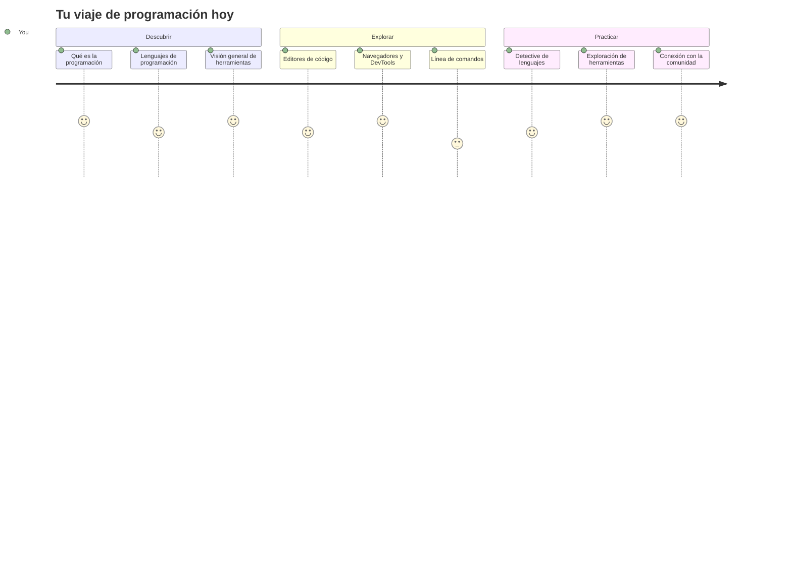
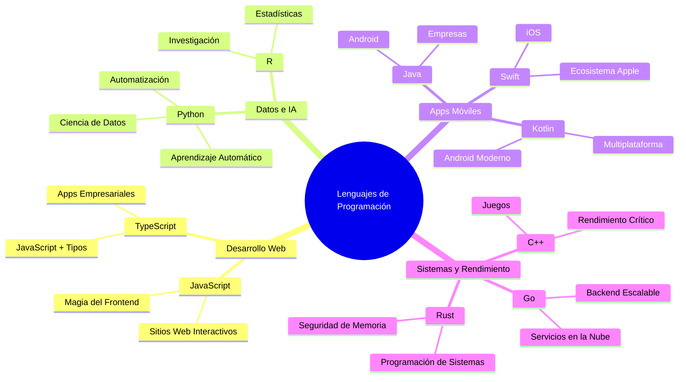
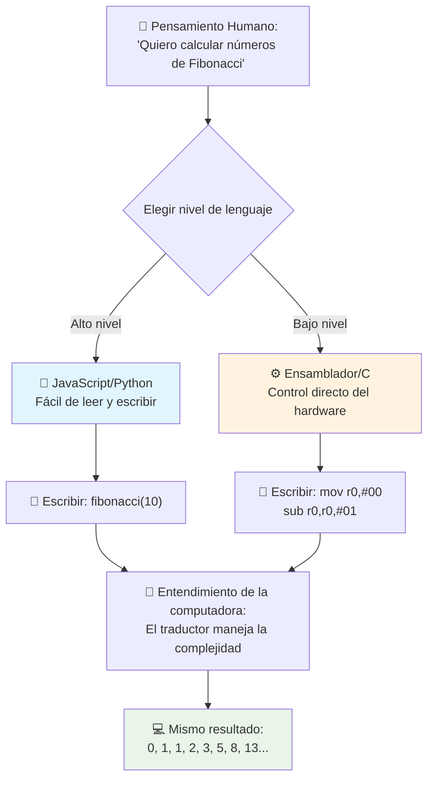
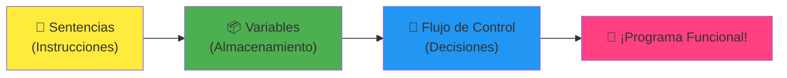
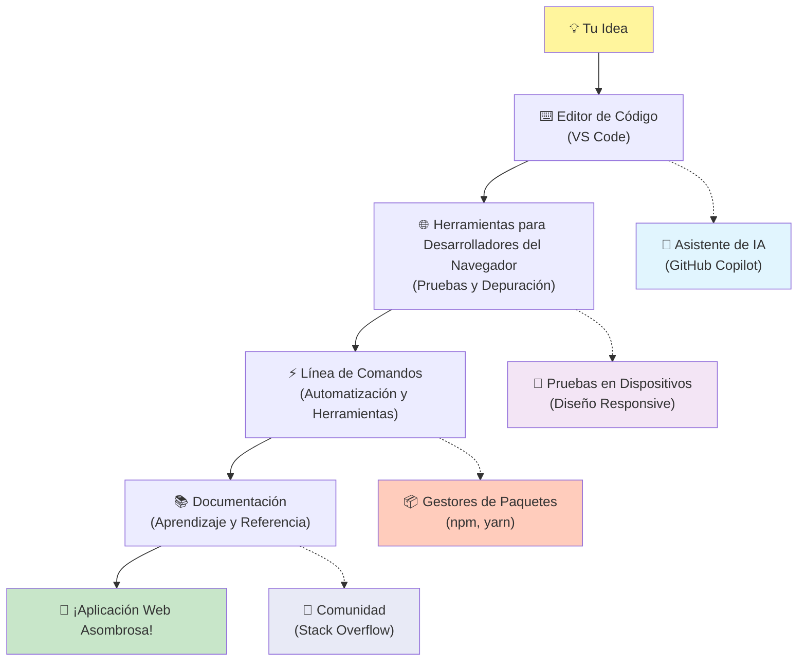
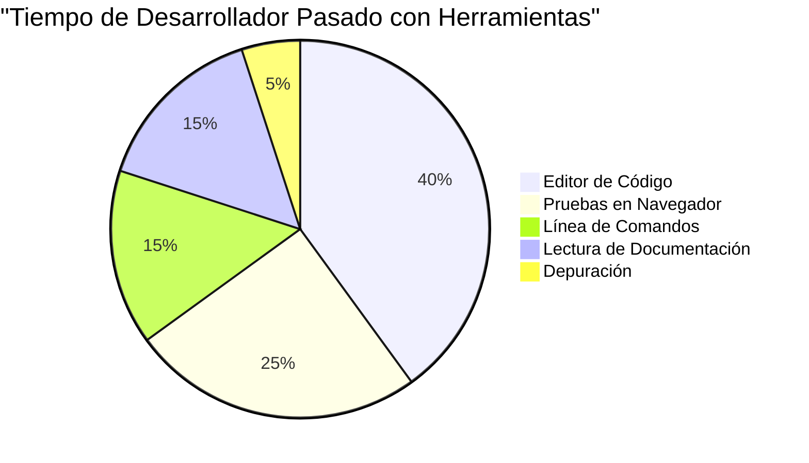
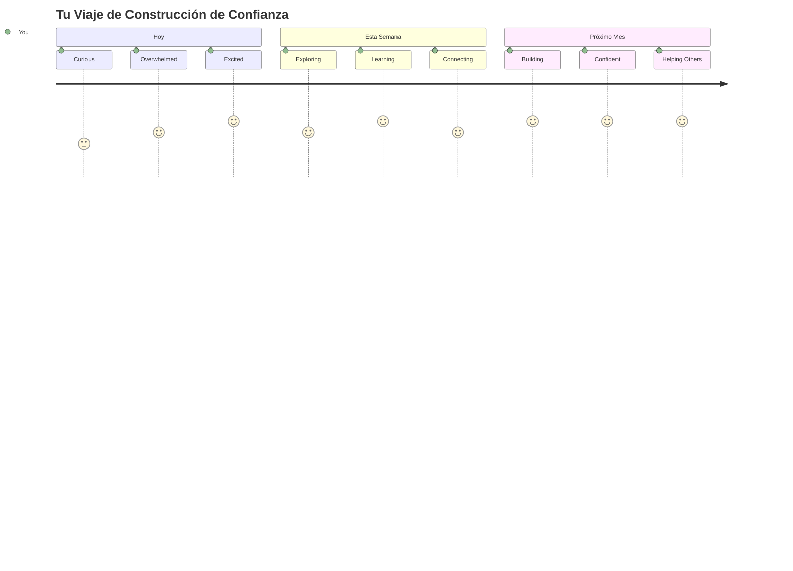

# Introducción a los Lenguajes de Programación y Herramientas Modernas para Desarrolladores
 
¡Hola, futuro desarrollador! 👋 ¿Puedo contarte algo que todavía me pone los pelos de punta todos los días? ¡Estás a punto de descubrir que programar no es solo sobre computadoras, sino que es tener superpoderes reales para dar vida a tus ideas más locas!

¿Conoces ese momento cuando usas tu app favorita y todo simplemente encaja a la perfección? Cuando tocas un botón y pasa algo absolutamente mágico que te hace decir "wow, ¿cómo lo HICIERON?" Bueno, alguien justo como tú – probablemente sentado en su cafetería favorita a las 2 AM con su tercer espresso – escribió el código que creó esa magia. Y aquí está lo que te volará la mente: al final de esta lección, no solo vas a entender cómo lo hicieron, sino que vas a estar deseando intentarlo tú mismo.

Mira, entiendo perfectamente si programar te parece intimidante ahora mismo. Cuando yo empecé, sinceramente pensaba que necesitabas ser una especie de genio de las matemáticas o haber estado programando desde que tenías cinco años. Pero esto fue lo que cambió por completo mi perspectiva: programar es exactamente como aprender a conversar en un idioma nuevo. Empiezas con "hola" y "gracias", luego pasas a pedir un café, y antes de que te des cuenta, ¡estás teniendo profundas conversaciones filosóficas! Excepto que en este caso, tienes conversaciones con computadoras, y ¿sabes qué? Son los compañeros de conversación más pacientes que vas a encontrar: nunca juzgan tus errores y siempre están entusiasmados por intentarlo de nuevo.

Hoy, vamos a explorar las increíbles herramientas que hacen que el desarrollo web moderno no solo sea posible, sino seriamente adictivo. Hablo de los mismos editores, navegadores y flujos de trabajo que usan desarrolladores en Netflix, Spotify y tu estudio indie de apps favorito todos los días. Y aquí viene la parte que te hará bailar de alegría: la mayoría de estas herramientas profesionales, estándar de la industria, ¡son completamente gratuitas!


> Sketchnote por [Tomomi Imura](https://twitter.com/girlie_mac)


```mermaid
journey
    title Tu viaje de programación hoy
    section Descubrir
      Qué es la programación: 5: You
      Lenguajes de programación: 4: You
      Visión general de herramientas: 5: You
    section Explorar
      Editores de código: 4: You
      Navegadores y DevTools: 5: You
      Línea de comandos: 3: You
    section Practicar
      Detective de lenguajes: 4: You
      Exploración de herramientas: 5: You
      Conexión con la comunidad: 5: You
```
## ¡Veamos Qué Sabes Ya!

Antes de saltar a lo divertido, tengo curiosidad — ¿qué sabes ya sobre este mundo de la programación? Y escucha, si estás viendo estas preguntas y piensas "literalmente no tengo ni idea de nada de esto," no solo está bien, ¡es perfecto! Eso significa que estás en el lugar justo. Piensa en este quiz como un estiramiento antes de hacer ejercicio — ¡solo estamos calentando esos músculos cerebrales!

[Haz el quiz previo a la lección](https://ff-quizzes.netlify.app/web/)


## La Aventura Que Vamos a Emprender Juntos

¡Ok, realmente estoy emocionado por lo que vamos a explorar hoy! En serio, ¡ojalá pudiera ver tu cara cuando algunos de estos conceptos encajen! Aquí está el increíble viaje que vamos a hacer juntos:

- **Qué es realmente la programación (¡y por qué es lo más genial que existe!)** – Vamos a descubrir cómo el código es literalmente la magia invisible que impulsa todo a tu alrededor, desde esa alarma que de alguna manera sabe que es lunes por la mañana hasta el algoritmo que te recomienda justo lo que quieres en Netflix
- **Lenguajes de programación y sus increíbles personalidades** – Imagina entrar a una fiesta donde cada persona tiene superpoderes diferentes y maneras propias de resolver problemas. Así es el mundo de los lenguajes de programación, y te va a encantar conocerlos
- **Los bloques fundamentales que hacen que la magia digital suceda** – Piensa en estos como el set definitivo de LEGO creativo. Una vez entiendas cómo encajan estas piezas, te darás cuenta de que puedes literalmente construir cualquier cosa que tu imaginación sueñe
- **Herramientas profesionales que te harán sentir como si te dieran una varita de mago** – No estoy siendo dramático aquí – estas herramientas realmente te harán sentir que tienes superpoderes, y la mejor parte: ¡son las mismas que usan los profesionales!

> 💡 **Esto es lo importante**: ¡Ni se te ocurra intentar memorizar todo hoy! Ahora mismo solo quiero que sientas esa chispa de emoción por lo que es posible. Los detalles se quedarán naturalmente mientras practicamos juntos – así es como sucede el aprendizaje real.

> Puedes hacer esta lección en [Microsoft Learn](https://learn.microsoft.com/en-us/learn/modules/web-development-101/introduction-programming/?WT.mc_id=academic-77807-sagibbon)!

## Entonces, ¿Qué Es *Realmente* Programar?

Bien, enfrentemos la pregunta del millón: ¿qué es realmente programar?

Te voy a contar una historia que cambió por completo cómo veo esto. La semana pasada, estaba tratando de explicarle a mi mamá cómo usar el control remoto nuevo de nuestro televisor inteligente. Me sorprendí diciéndole cosas como "Presiona el botón rojo, pero no el botón rojo grande, el botón rojo pequeño a la izquierda... no, tu otro izquierdo... ok, ahora mantén presionado dos segundos, no uno, no tres..." ¿Te suena? 😅

¡Eso es programar! Es el arte de dar instrucciones súper detalladas y paso a paso a algo que es muy poderoso pero necesita que todo esté perfectamente especificado. Excepto que en lugar de explicarle a tu mamá (que puede preguntar "¿qué botón rojo?!"), le estás explicando a una computadora (que simplemente hace exactamente lo que dices, incluso si lo que dijiste no es exactamente lo que querías decir).

Esto fue lo que me voló la cabeza cuando lo aprendí: las computadoras son en realidad bastante simples en su núcleo. Literalmente solo entienden dos cosas – 1 y 0, que básicamente es "sí" y "no" o "encendido" y "apagado". ¡Eso es todo! Pero aquí es donde se pone mágico – no tenemos que hablar en 1s y 0s como si estuviéramos en Matrix. Ahí es donde los **lenguajes de programación** vienen al rescate. Son como tener el mejor traductor del mundo que toma tus pensamientos humanos perfectamente normales y los convierte en lenguaje de computadora.

Y esto es lo que todavía me da escalofríos cada mañana que me despierto: literalmente *todo* lo digital en tu vida comenzó con alguien justo como tú, probablemente en pijama con una taza de café, escribiendo código en su laptop. ¿Ese filtro de Instagram que te hace ver impecable? Alguien codificó eso. ¿La recomendación que te llevó a tu nueva canción favorita? Un desarrollador creó ese algoritmo. ¿La app que te ayuda a dividir la cuenta en la cena con amigos? Sí, alguien pensó "esto es molesto, apuesto que puedo arreglarlo" y entonces... ¡lo hizo!

Cuando aprendes a programar, no solo estás adquiriendo una nueva habilidad – te estás convirtiendo en parte de esta increíble comunidad de solucionadores de problemas que pasan sus días pensando: "¿Y si pudiera construir algo que mejore un poco el día de alguien?" Honestamente, ¿hay algo más genial que eso?

✅ **Dato curioso para investigar**: Esto es algo súper genial para buscar cuando tengas un momento libre – ¿quién crees que fue el primer programador del mundo? Te doy una pista: ¡no es quien esperarías! La historia de esta persona es absolutamente fascinante y muestra que programar siempre ha sido sobre resolver problemas creativamente y pensar fuera de la caja.

### 🧠 **Momento de Reflexión: ¿Cómo Te Sientes?**

**Tómate un momento para pensar:**
- ¿Tiene sentido ahora la idea de "dar instrucciones a computadoras"?
- ¿Puedes pensar en una tarea diaria que te gustaría automatizar con programación?
- ¿Qué preguntas te están surgiendo sobre todo este tema de la programación?

> **Recuerda**: Es totalmente normal que algunos conceptos estén confusos ahora. Aprender a programar es como aprender un idioma nuevo – tu cerebro necesita tiempo para construir esas conexiones neuronales. ¡Lo estás haciendo genial!

## Los Lenguajes de Programación Son Como Diferentes Sabores de Magia

Esto va a sonar raro, pero quédate conmigo – los lenguajes de programación son muy parecidos a diferentes tipos de música. Piénsalo: tienes jazz, que es suave e improvisado; rock que es potente y directo; clásico que es elegante y estructurado, y hip-hop que es creativo y expresivo. Cada estilo tiene su propia vibra, su propia comunidad de fans apasionados, y cada uno es perfecto para diferentes estados de ánimo y ocasiones.

¡Los lenguajes de programación funcionan exactamente igual! No usarías el mismo lenguaje para construir un juego móvil divertido que para procesar enormes cantidades de datos climáticos, igual que no pondrías death metal en una clase de yoga (bueno, la mayoría de las clases de yoga no, al menos 😄).

Pero lo que me impresiona cada vez que lo pienso es esto: estos lenguajes son como tener al intérprete más paciente y brillante del mundo sentado a tu lado. Puedes expresar tus ideas de una manera que se siente natural para tu cerebro humano, y ellos se encargan de todo el trabajo increíblemente complejo de traducir eso a los 1s y 0s que las computadoras realmente entienden. Es como tener un amigo que habla perfectamente tanto "creatividad humana" como "lógica de computadora" – ¡y nunca se cansa, nunca necesita pausas para café y nunca te juzga por hacer la misma pregunta dos veces!

### Lenguajes de Programación Populares y Sus Usos


```mermaid
mindmap
  root((Lenguajes de Programación))
    Desarrollo Web
      JavaScript
        Magia del Frontend
        Sitios Web Interactivos
      TypeScript
        JavaScript + Tipos
        Apps Empresariales
    Datos e IA
      Python
        Ciencia de Datos
        Aprendizaje Automático
        Automatización
      R
        Estadísticas
        Investigación
    Apps Móviles
      Java
        Android
        Empresas
      Swift
        iOS
        Ecosistema Apple
      Kotlin
        Android Moderno
        Multiplataforma
    Sistemas y Rendimiento
      C++
        Juegos
        Rendimiento Crítico
      Rust
        Seguridad de Memoria
        Programación de Sistemas
      Go
        Servicios en la Nube
        Backend Escalable
```
| Lenguaje | Mejor Para | Por qué es Popular |
|----------|------------|--------------------|
| **JavaScript** | Desarrollo web, interfaces de usuario | Funciona en navegadores y potencia sitios interactivos |
| **Python** | Ciencia de datos, automatización, IA | Fácil de leer y aprender, bibliotecas poderosas |
| **Java** | Aplicaciones empresariales, apps Android | Independiente de plataforma, robusto para sistemas grandes |
| **C#** | Aplicaciones Windows, desarrollo de juegos | Fuerte soporte en el ecosistema Microsoft |
| **Go** | Servicios en la nube, sistemas backend | Rápido, simple, diseñado para computación moderna |

### Lenguajes de Alto Nivel vs. Bajo Nivel

Ok, honestamente este fue el concepto que me rompió el cerebro cuando empecé a aprender, así que voy a compartir la analogía que finalmente me hizo click — ¡y espero que también te ayude!

Imagina que visitas un país donde no hablas el idioma, y necesitas desesperadamente encontrar el baño más cercano (a todos nos ha pasado, ¿verdad? 😅):

- **Programación de bajo nivel** es como aprender el dialecto local tan bien que puedes conversar con la abuela que vende fruta en la esquina usando referencias culturales, jerga local y bromas internas que solo alguien que creció allí entendería. Súper impresionante e increíblemente eficiente... si hablas el idioma fluidamente. Pero bastante abrumador cuando solo buscas un baño.

- **Programación de alto nivel** es como tener ese increíble amigo local que simplemente te entiende. Puedes decir "Realmente necesito encontrar un baño" en inglés simple, y él se encarga de toda la traducción cultural y te da indicaciones que tu cerebro no local entiende perfectamente.

En términos de programación:
- **Lenguajes de bajo nivel** (como Assembly o C) te permiten tener conversaciones muy detalladas con el hardware real de la computadora, pero tienes que pensar como una máquina, lo cual... bueno, digamos que es un gran cambio mental.
- **Lenguajes de alto nivel** (como JavaScript, Python o C#) te permiten pensar como humano mientras ellos manejan todo el idioma máquina detrás de escena. Además, tienen comunidades increíblemente acogedoras llenas de gente que recuerda lo que es ser nuevo y realmente quiere ayudar.

¿Adivina con cuáles te sugiero empezar? 😉 Los lenguajes de alto nivel son como usar ruedas de entrenamiento que en realidad nunca querrás quitarte porque hacen que toda la experiencia sea mucho más disfrutable.


```mermaid
flowchart TB
    A["👤 Pensamiento Humano:<br/>'Quiero calcular números de Fibonacci'"] --> B{Elegir nivel de lenguaje}
    
    B -->|Alto nivel| C["🌟 JavaScript/Python<br/>Fácil de leer y escribir"]
    B -->|Bajo nivel| D["⚙️ Ensamblador/C<br/>Control directo del hardware"]
    
    C --> E["📝 Escribir: fibonacci(10)"]
    D --> F["📝 Escribir: mov r0,#00<br/>sub r0,r0,#01"]
    
    E --> G["🤖 Entendimiento de la computadora:<br/>El traductor maneja la complejidad"]
    F --> G
    
    G --> H["💻 Mismo resultado:<br/>0, 1, 1, 2, 3, 5, 8, 13..."]
    
    style C fill:#e1f5fe
    style D fill:#fff3e0
    style H fill:#e8f5e8
```
### Déjame Mostrarte Por Qué Los Lenguajes de Alto Nivel Son Mucho Más Amigables

Bien, estoy a punto de mostrarte algo que demuestra perfectamente por qué me enamoré de los lenguajes de alto nivel, pero primero – necesito que me prometas algo. Cuando veas ese primer ejemplo de código, ¡no te asustes! Se supone que debe parecer intimidante. ¡Ese es exactamente el punto que quiero hacer!

Vamos a ver la misma tarea escrita en dos estilos completamente diferentes. Ambos crean lo que se llama la secuencia de Fibonacci – es un hermoso patrón matemático donde cada número es la suma de los dos anteriores: 0, 1, 1, 2, 3, 5, 8, 13... (Dato curioso: encontrarás este patrón literalmente en todas partes en la naturaleza – las espirales de las semillas de girasol, los patrones de piñas, ¡incluso la forma en que se forman las galaxias!)

¿Listo para ver la diferencia? ¡Vamos!

**Lenguaje de alto nivel (JavaScript) – Amigable para humanos:**

```javascript
// Paso 1: Configuración básica de Fibonacci
const fibonacciCount = 10;
let current = 0;
let next = 1;

console.log('Fibonacci sequence:');
```

**Esto es lo que hace este código:**
- **Declarar** una constante para especificar cuántos números de Fibonacci queremos generar
- **Inicializar** dos variables para seguir los números actuales y siguientes en la secuencia
- **Configurar** los valores iniciales (0 y 1) que definen el patrón Fibonacci
- **Mostrar** un mensaje encabezado para identificar nuestra salida

```javascript
// Paso 2: Generar la secuencia con un bucle
for (let i = 0; i < fibonacciCount; i++) {
  console.log(`Position ${i + 1}: ${current}`);
  
  // Calcular el siguiente número en la secuencia
  const sum = current + next;
  current = next;
  next = sum;
}
```

**Desglosando lo que pasa aquí:**
- **Recorrer** cada posición en nuestra secuencia usando un bucle `for`
- **Mostrar** cada número con su posición utilizando formato de plantilla literal
- **Calcular** el siguiente número de Fibonacci sumando los valores actual y siguiente
- **Actualizar** nuestras variables para avanzar a la siguiente iteración

```javascript
// Paso 3: Enfoque funcional moderno
const generateFibonacci = (count) => {
  const sequence = [0, 1];
  
  for (let i = 2; i < count; i++) {
    sequence[i] = sequence[i - 1] + sequence[i - 2];
  }
  
  return sequence;
};

// Ejemplo de uso
const fibSequence = generateFibonacci(10);
console.log(fibSequence);
```

**En lo anterior, hemos:**
- **Creado** una función reutilizable usando la sintaxis moderna de funciones flecha
- **Construido** un arreglo para almacenar la secuencia completa en lugar de mostrar número por número
- **Usado** índices del arreglo para calcular cada nuevo número a partir de valores previos
- **Retornado** la secuencia completa para usarla de forma flexible en otras partes del programa

**Lenguaje de bajo nivel (ARM Assembly) – Amigable para computadoras:**

```assembly
 area ascen,code,readonly
 entry
 code32
 adr r0,thumb+1
 bx r0
 code16
thumb
 mov r0,#00
 sub r0,r0,#01
 mov r1,#01
 mov r4,#10
 ldr r2,=0x40000000
back add r0,r1
 str r0,[r2]
 add r2,#04
 mov r3,r0
 mov r0,r1
 mov r1,r3
 sub r4,#01
 cmp r4,#00
 bne back
 end
```

Fíjate cómo la versión en JavaScript se lee casi como instrucciones en inglés, mientras que la versión en Assembly usa comandos crípticos que controlan directamente el procesador de la computadora. Ambas logran la misma tarea, pero el lenguaje de alto nivel es mucho más fácil para los humanos de entender, escribir y mantener.

**Diferencias clave que notarás:**
- **Legibilidad**: JavaScript usa nombres descriptivos como `fibonacciCount` mientras que Assembly usa etiquetas crípticas como `r0`, `r1`
- **Comentarios**: Los lenguajes de alto nivel fomentan comentarios explicativos que hacen que el código sea autodocumentado
- **Estructura**: El flujo lógico de JavaScript coincide con cómo los humanos piensan sobre los problemas paso a paso
- **Mantenimiento**: Actualizar la versión de JavaScript para diferentes requisitos es sencillo y claro

✅ **Sobre la secuencia de Fibonacci**: ¡Este patrón numérico absolutamente maravilloso (donde cada número es la suma de los dos anteriores: 0, 1, 1, 2, 3, 5, 8...) aparece literalmente *en todas partes* en la naturaleza! Lo encontrarás en las espirales de los girasoles, los patrones de las piñas, la forma en que se curvan los caparazones de nautilus e incluso en cómo crecen las ramas de los árboles. ¡Es realmente asombroso cómo las matemáticas y el código pueden ayudarnos a entender y recrear los patrones que la naturaleza usa para crear belleza!


## Los Bloques de Construcción Que Hacen Que La Magia Ocurra

Muy bien, ahora que has visto cómo lucen los lenguajes de programación en acción, vamos a desglosar las piezas fundamentales que componen literalmente todos los programas jamas escritos. Piensa en estas como los ingredientes esenciales en tu receta favorita: una vez que entiendes lo que hace cada uno, ¡podrás leer y escribir código en prácticamente cualquier lenguaje!

Esto es algo parecido a aprender la gramática de la programación. ¿Recuerdas cuando en la escuela aprendiste sobre sustantivos, verbos y cómo armar oraciones? La programación tiene su propia versión de gramática, y sinceramente, es mucho más lógica y permisiva que la gramática del inglés alguna vez fue! 😄

### Sentencias: Las Instrucciones Paso a Paso

Empecemos con las **sentencias** – son como oraciones individuales en una conversación con tu computadora. Cada sentencia le dice a la computadora que haga una cosa específica, algo parecido a dar direcciones: "Gira a la izquierda aquí," "Detente en el semáforo en rojo," "Estaciona en ese lugar."

Lo que me encanta de las sentencias es lo legibles que suelen ser. Mira esto:

```javascript
// Sentencias básicas que realizan acciones únicas
const userName = "Alex";                    
console.log("Hello, world!");              
const sum = 5 + 3;                         
```

**Esto es lo que hace este código:**
- **Declarar** una variable constante para almacenar el nombre de un usuario
- **Mostrar** un mensaje de saludo en la salida de la consola
- **Calcular** y guardar el resultado de una operación matemática

```javascript
// Declaraciones que interactúan con páginas web
document.title = "My Awesome Website";      
document.body.style.backgroundColor = "lightblue";
```

**Paso a paso, esto es lo que sucede:**
- **Modificar** el título de la página web que aparece en la pestaña del navegador
- **Cambiar** el color de fondo de todo el cuerpo de la página

### Variables: El Sistema de Memoria de Tu Programa

Bueno, las **variables** son honestamente uno de mis conceptos favoritos para enseñar porque son muy parecidas a cosas que ya usas todos los días.

Piensa en la lista de contactos de tu teléfono por un momento. No memorizas el número de teléfono de todos, sino que guardas "Mamá," "Mejor Amigo" o "Pizzería que entrega hasta las 2 AM" y dejas que tu teléfono recuerde los números reales. ¡Las variables funcionan exactamente igual! Son como contenedores con etiquetas donde tu programa puede almacenar información y recuperarla más tarde usando un nombre que realmente tenga sentido.

Lo que es realmente genial: las variables pueden cambiar mientras tu programa se ejecuta (por eso se llaman "variables" – ¿ves qué hicieron ahí?). Así como podrías actualizar el contacto de esa pizzería cuando descubres un lugar aún mejor, las variables pueden actualizarse a medida que tu programa aprende información nueva o cambian las situaciones.

Déjame mostrarte lo simple y lindo que esto puede ser:

```javascript
// Paso 1: Creando variables básicas
const siteName = "Weather Dashboard";        
let currentWeather = "sunny";               
let temperature = 75;                       
let isRaining = false;                      
```

**Entendiendo estos conceptos:**
- **Guardar** valores inmutables en variables `const` (como el nombre del sitio)
- **Usar** `let` para valores que pueden cambiar durante la ejecución del programa
- **Asignar** distintos tipos de datos: cadenas (texto), números y booleanos (true/false)
- **Elegir** nombres descriptivos que expliquen qué contiene cada variable

```javascript
// Paso 2: Trabajando con objetos para agrupar datos relacionados
const weatherData = {                       
  location: "San Francisco",
  humidity: 65,
  windSpeed: 12
};
```

**En el ejemplo anterior, hemos:**
- **Creado** un objeto para agrupar información meteorológica relacionada
- **Organizado** múltiples datos bajo un nombre de variable
- **Usado** pares clave-valor para etiquetar claramente cada dato

```javascript
// Paso 3: Uso y actualización de variables
console.log(`${siteName}: Today is ${currentWeather} and ${temperature}°F`);
console.log(`Wind speed: ${weatherData.windSpeed} mph`);

// Actualización de variables cambiantes
currentWeather = "cloudy";                  
temperature = 68;                          
```

**Entendamos cada parte:**
- **Mostrar** información usando literales de plantilla con la sintaxis `${}`
- **Acceder** a propiedades del objeto usando notación de puntos (`weatherData.windSpeed`)
- **Actualizar** variables declaradas con `let` para reflejar condiciones cambiantes
- **Combinar** múltiples variables para crear mensajes significativos

```javascript
// Paso 4: Desestructuración moderna para un código más limpio
const { location, humidity } = weatherData; 
console.log(`${location} humidity: ${humidity}%`);
```

**Lo que necesitas saber:**
- **Extraer** propiedades específicas de objetos usando asignación por desestructuración
- **Crear** nuevas variables automáticamente con los mismos nombres que las claves del objeto
- **Simplificar** el código evitando notación de puntos repetitiva

### Flujo de Control: Enseñando a Tu Programa a Pensar

Bueno, aquí es donde la programación se vuelve realmente asombrosa. El **flujo de control** es básicamente enseñar a tu programa a tomar decisiones inteligentes, exactamente como tú haces todos los días sin siquiera pensarlo.

Imagina esto: esta mañana probablemente hiciste algo así como "Si está lloviendo, llevo paraguas. Si hace frío, me pongo una chaqueta. Si voy tarde, me salto el desayuno y tomo café en el camino." ¡Tu cerebro sigue esta lógica if-then docenas de veces cada día!

Esto es lo que hace que los programas parezcan inteligentes y vivos en lugar de sólo seguir un guion aburrido y predecible. Pueden observar una situación, evaluar qué pasa y reaccionar apropiadamente. ¡Es como darle a tu programa un cerebro que puede adaptarse y tomar decisiones!

¿Quieres ver qué tan bonito funciona? Déjame mostrarte:

```javascript
// Paso 1: Lógica condicional básica
const userAge = 17;

if (userAge >= 18) {
  console.log("You can vote!");
} else {
  const yearsToWait = 18 - userAge;
  console.log(`You'll be able to vote in ${yearsToWait} year(s).`);
}
```

**Esto es lo que hace este código:**
- **Verifica** si la edad del usuario cumple con el requisito para votar
- **Ejecuta** diferentes bloques de código según el resultado de la condición
- **Calcula** y muestra cuánto falta para ser elegible para votar si es menor de 18
- **Da** retroalimentación específica y útil para cada caso

```javascript
// Paso 2: Múltiples condiciones con operadores lógicos
const userAge = 17;
const hasPermission = true;

if (userAge >= 18 && hasPermission) {
  console.log("Access granted: You can enter the venue.");
} else if (userAge >= 16) {
  console.log("You need parent permission to enter.");
} else {
  console.log("Sorry, you must be at least 16 years old.");
}
```

**Desglose de lo que sucede aquí:**
- **Combina** múltiples condiciones usando el operador `&&` (y)
- **Crea** una jerarquía de condiciones con `else if` para múltiples escenarios
- **Maneja** todos los casos posibles con una sentencia final `else`
- **Provee** retroalimentación clara y accionable para cada situación diferente

```javascript
// Paso 3: Condicional conciso con operador ternario
const votingStatus = userAge >= 18 ? "Can vote" : "Cannot vote yet";
console.log(`Status: ${votingStatus}`);
```

**Lo que debes recordar:**
- **Usa** el operador ternario (`? :`) para condiciones simples de dos opciones
- **Escribe** la condición primero, seguida de `?`, luego el resultado verdadero, después `:`, y finalmente el resultado falso
- **Aplica** este patrón cuando necesites asignar valores basados en condiciones

```javascript
// Paso 4: Manejo de múltiples casos específicos
const dayOfWeek = "Tuesday";

switch (dayOfWeek) {
  case "Monday":
  case "Tuesday":
  case "Wednesday":
  case "Thursday":
  case "Friday":
    console.log("It's a weekday - time to work!");
    break;
  case "Saturday":
  case "Sunday":
    console.log("It's the weekend - time to relax!");
    break;
  default:
    console.log("Invalid day of the week");
}
```

**Este código logra lo siguiente:**
- **Compara** el valor de una variable con múltiples casos específicos
- **Agrupa** casos similares juntos (días de semana vs fines de semana)
- **Ejecuta** el bloque de código adecuado cuando encuentra coincidencia
- **Incluye** un caso `default` para manejar valores inesperados
- **Usa** sentencias `break` para evitar que el código continúe al siguiente caso

> 💡 **Analogía del mundo real**: Piensa en el flujo de control como tener el GPS más paciente del mundo dándote direcciones. Puede decir "Si hay tráfico en la Calle Principal, toma la autopista. Si hay construcción bloqueando la autopista, intenta la ruta escénica." Los programas usan este mismo tipo de lógica condicional para responder inteligentemente a diferentes situaciones y siempre dar a los usuarios la mejor experiencia posible.

### 🎯 **Chequeo de Conceptos: Dominio de los Bloques de Construcción**

**Veamos cómo vas con lo fundamental:**
- ¿Puedes explicar la diferencia entre una variable y una sentencia con tus propias palabras?
- Piensa en un escenario real donde usarías una decisión if-then (como nuestro ejemplo de votación)
- ¿Qué es algo sobre la lógica de programación que te sorprendió?

**Un rápido refuerzo de confianza:**

```mermaid
flowchart LR
    A["📝 Sentencias<br/>(Instrucciones)"] --> B["📦 Variables<br/>(Almacenamiento)"] --> C["🔀 Flujo de Control<br/>(Decisiones)"] --> D["🎉 ¡Programa Funcional!"]
    
    style A fill:#ffeb3b
    style B fill:#4caf50
    style C fill:#2196f3
    style D fill:#ff4081
```
✅ **Lo que viene a continuación**: ¡Nos vamos a divertir muchísimo profundizando en estos conceptos mientras continuamos este increíble viaje juntos! Por ahora, concéntrate en sentir esa emoción por todas las increíbles posibilidades que tienes por delante. Las habilidades y técnicas específicas se te pegarán de forma natural a medida que practiquemos juntos – ¡te prometo que será mucho más divertido de lo que esperas!

## Herramientas del Oficio

Muy bien, en serio, aquí es donde me emociono tanto que apenas me aguanto! 🚀 Estamos a punto de hablar de las increíbles herramientas que te harán sentir como si acabaras de recibir las llaves de una nave espacial digital.

¿Sabes cómo un chef tiene esos cuchillos perfectamente equilibrados que se sienten como extensiones de sus manos? ¿O cómo un músico tiene esa guitarra que parece cantar en el momento en que la toca? Bueno, los desarrolladores tenemos nuestra propia versión de estas herramientas mágicas, y esto es lo que va a dejarte completamente alucinado – ¡la mayoría de ellas son completamente gratuitas!

Estoy casi saltando en mi silla pensando en compartir esto contigo porque han revolucionado completamente cómo construimos software. Hablamos de asistentes de codificación impulsados por IA que pueden ayudarte a escribir tu código (¡no estoy bromeando!), entornos en la nube donde puedes construir aplicaciones completas desde literalmente cualquier lugar con Wi-Fi, y herramientas de depuración tan sofisticadas que son como tener visión de rayos X para tus programas.

Y aquí viene la parte que aún me pone la piel de gallina: estas no son "herramientas para principiantes" que vas a dejar atrás. Son las mismas herramientas profesionales que usan desarrolladores en Google, Netflix y ese estudio indie de apps que adoras, ahora mismo. ¡Vas a sentirte como un profesional usándolas!


```mermaid
graph TD
    A["💡 Tu Idea"] --> B["⌨️ Editor de Código<br/>(VS Code)"] 
    B --> C["🌐 Herramientas para Desarrolladores del Navegador<br/>(Pruebas y Depuración)"]
    C --> D["⚡ Línea de Comandos<br/>(Automatización y Herramientas)"]
    D --> E["📚 Documentación<br/>(Aprendizaje y Referencia)"]
    E --> F["🚀 ¡Aplicación Web Asombrosa!"]
    
    B -.-> G["🤖 Asistente de IA<br/>(GitHub Copilot)"]
    C -.-> H["📱 Pruebas en Dispositivos<br/>(Diseño Responsive)"]
    D -.-> I["📦 Gestores de Paquetes<br/>(npm, yarn)"]
    E -.-> J["👥 Comunidad<br/>(Stack Overflow)"]
    
    style A fill:#fff59d
    style F fill:#c8e6c9
    style G fill:#e1f5fe
    style H fill:#f3e5f5
    style I fill:#ffccbc
    style J fill:#e8eaf6
```
### Editores de Código e IDEs: Tus Nuevos Mejores Amigos Digitales

Hablemos de editores de código – ¡estos están a punto de convertirse en tus nuevos lugares favoritos para pasar el rato! Piénsalos como tu santuario personal de codificación donde pasarás la mayor parte de tu tiempo creando y perfeccionando tus creaciones digitales.

Pero aquí está lo realmente mágico de los editores modernos: no son simples editores de texto lujosos. Son como tener al mentor de codificación más brillante y alentador sentado justo a tu lado 24/7. Detectan tus errores tipográficos antes siquiera de que te des cuenta, sugieren mejoras que te hacen parecer un genio, te ayudan a entender qué hace cada pieza del código, y algunos incluso pueden predecir lo que vas a escribir y ofrecerte terminar tus ideas.

Recuerdo la primera vez que descubrí la autocompletación – literalmente sentí que estaba viviendo en el futuro. Empiezas a escribir algo, y tu editor dice: "Oye, ¿estabas pensando en esta función que hace exactamente lo que necesitas?" ¡Es como tener un lector de mentes como compañero de codificación!

**¿Qué hace que estos editores sean tan increíbles?**

Los editores modernos ofrecen una impresionante variedad de características diseñadas para aumentar tu productividad:

| Característica | Qué hace | Por qué ayuda |
|---------|--------------|--------------|
| **Resaltado de Sintaxis** | Colorea diferentes partes de tu código | Hace que el código sea más fácil de leer y detectar errores |
| **Autocompletado** | Sugiere código mientras escribes | Acelera la codificación y reduce errores tipográficos |
| **Herramientas de Depuración** | Te ayuda a encontrar y corregir errores | Ahorra horas de tiempo de solución de problemas |
| **Extensiones** | Añaden funciones especializadas | Personaliza tu editor para cualquier tecnología |
| **Asistentes de IA** | Sugieren código y explicaciones | Acelera el aprendizaje y la productividad |

> 🎥 **Recurso en Video**: ¿Quieres ver estas herramientas en acción? Mira este [video Herramientas del Oficio](https://youtube.com/watch?v=69WJeXGBdxg) para una visión completa.

#### Editores recomendados para desarrollo web

**[Visual Studio Code](https://code.visualstudio.com/?WT.mc_id=academic-77807-sagibbon)** (Gratis)
- El más popular entre desarrolladores web
- Excelente ecosistema de extensiones
- Terminal incorporado e integración con Git
- **Extensiones imprescindibles**:
  - [GitHub Copilot](https://marketplace.visualstudio.com/items?itemName=GitHub.copilot) - Sugerencias de código impulsadas por IA
  - [Live Share](https://marketplace.visualstudio.com/items?itemName=MS-vsliveshare.vsliveshare) - Colaboración en tiempo real
  - [Prettier](https://marketplace.visualstudio.com/items?itemName=esbenp.prettier-vscode) - Formateo automático de código
  - [Code Spell Checker](https://marketplace.visualstudio.com/items?itemName=streetsidesoftware.code-spell-checker) - Detecta errores tipográficos en tu código

**[JetBrains WebStorm](https://www.jetbrains.com/webstorm/)** (De pago, gratis para estudiantes)
- Herramientas avanzadas de depuración y pruebas
- Autocompletado de código inteligente
- Control de versiones integrado

**IDEs basados en la nube** (Precios varios)
- [GitHub Codespaces](https://github.com/features/codespaces) - VS Code completo en tu navegador
- [Replit](https://replit.com/) - Excelente para aprender y compartir código
- [StackBlitz](https://stackblitz.com/) - Desarrollo web full-stack instantáneo

> 💡 **Consejo para empezar**: Comienza con Visual Studio Code – es gratis, muy usado en la industria, y tiene una enorme comunidad creando tutoriales y extensiones útiles.


### Navegadores Web: Tu Laboratorio Secreto de Desarrollo

Prepárate para que te explote la mente completamente. ¿Sabías que has estado usando navegadores para desplazarte por redes sociales y ver videos? Pues resulta que han estado escondiendo este increíble laboratorio secreto para desarrolladores todo este tiempo, ¡esperando a que lo descubras!

Cada vez que haces clic derecho sobre una página web y seleccionas "Inspeccionar elemento," estás abriendo un mundo oculto de herramientas para desarrolladores que honestamente son más poderosas que algunos programas caros por los que solía pagar cientos de dólares. ¡Es como descubrir que tu cocina común y corriente ha estado ocultando un laboratorio de chef profesional detrás de un panel secreto!
La primera vez que alguien me mostró las DevTools del navegador, pasé como tres horas simplemente haciendo clic por todos lados y diciendo "¿¡ESPERA, ¿TAMBIÉN PUEDE HACER ESO?!". Literalmente puedes editar cualquier sitio web en tiempo real, ver exactamente qué tan rápido se carga todo, probar cómo se ve tu sitio en diferentes dispositivos e incluso depurar JavaScript como un profesional total. ¡Es absolutamente alucinante!

**Aquí está la razón por la que los navegadores son tu arma secreta:**

Cuando creas un sitio web o una aplicación web, necesitas ver cómo se ve y se comporta en el mundo real. Los navegadores no solo muestran tu trabajo, sino que también proporcionan retroalimentación detallada sobre rendimiento, accesibilidad y posibles problemas.

#### Herramientas de Desarrollo del Navegador (DevTools)

Los navegadores modernos incluyen suites completas de desarrollo:

| Categoría de Herramienta | Qué Hace | Caso de Uso Ejemplo |
|--------------------------|----------|---------------------|
| **Inspector de Elementos** | Ver y editar HTML/CSS en tiempo real | Ajustar el estilo para ver resultados inmediatos |
| **Consola** | Ver mensajes de error y probar JavaScript | Depurar problemas y experimentar con código |
| **Monitor de Red** | Rastrear cómo se cargan los recursos | Optimizar el rendimiento y tiempos de carga |
| **Verificador de Accesibilidad** | Probar diseño inclusivo | Asegurar que tu sitio funcione para todos los usuarios |
| **Simulador de Dispositivos** | Previsualizar en diferentes tamaños de pantalla | Probar diseño responsivo sin múltiples dispositivos |

#### Navegadores Recomendados para Desarrollo

- **[Chrome](https://developers.google.com/web/tools/chrome-devtools/)** - DevTools estándar de la industria con documentación extensa
- **[Firefox](https://developer.mozilla.org/docs/Tools)** - Excelentes herramientas para CSS Grid y accesibilidad
- **[Edge](https://docs.microsoft.com/microsoft-edge/devtools-guide-chromium/?WT.mc_id=academic-77807-sagibbon)** - Basado en Chromium con recursos para desarrolladores de Microsoft

> ⚠️ **Consejo Importante para Pruebas**: ¡Siempre prueba tus sitios web en múltiples navegadores! Lo que funciona perfectamente en Chrome puede verse diferente en Safari o Firefox. Los desarrolladores profesionales prueban en todos los navegadores principales para asegurar experiencias consistentes para los usuarios.


### Herramientas de Línea de Comandos: Tu Entrada a Súper Poderes de Desarrollador

Bien, tengamos un momento completamente honesto sobre la línea de comandos, porque quiero que escuches esto de alguien que realmente lo entiende. La primera vez que la vi, solo esa pantalla negra aterradora con texto parpadeante, literalmente pensé: "¡No, absolutamente no! Esto parece algo de una película de hackers de los años 80, ¡y definitivamente no soy lo suficientemente inteligente para esto!" 😅

Pero aquí está lo que desearía que alguien me hubiera dicho en ese entonces, y lo que te estoy diciendo ahora: la línea de comandos no da miedo; en realidad es como tener una conversación directa con tu computadora. Piensa en ello como la diferencia entre pedir comida a través de una aplicación elegante con fotos y menús (que es agradable y fácil) versus entrar a tu restaurante local favorito donde el chef sabe exactamente qué te gusta y puede preparar algo perfecto solo porque dices "sorpréndeme con algo increíble".

La línea de comandos es donde los desarrolladores se sienten como magos absolutos. Escribes algunas palabras aparentemente mágicas (bueno, son comandos, pero se sienten mágicos), presionas enter y ¡BUM! — has creado estructuras enteras de proyectos, instalado herramientas poderosas de todo el mundo o desplegado tu app en Internet para que millones la vean. ¡Una vez que pruebas ese poder, honestamente es bastante adictivo!

**Por qué la línea de comandos se convertirá en tu herramienta favorita:**

Aunque las interfaces gráficas son geniales para muchas tareas, la línea de comandos destaca en automatización, precisión y velocidad. Muchas herramientas de desarrollo funcionan principalmente a través de interfaces de línea de comandos, y aprender a usarlas eficientemente puede mejorar tu productividad dramáticamente.

```bash
# Paso 1: Crear y navegar al directorio del proyecto
mkdir my-awesome-website
cd my-awesome-website
```

**Esto es lo que hace este código:**
- **Crear** un nuevo directorio llamado "my-awesome-website" para tu proyecto
- **Navegar** hacia el directorio recién creado para comenzar a trabajar

```bash
# Paso 2: Inicializar el proyecto con package.json
npm init -y

# Instalar herramientas modernas de desarrollo
npm install --save-dev vite prettier eslint
npm install --save-dev @eslint/js
```

**Paso a paso, esto es lo que sucede:**
- **Inicializar** un nuevo proyecto Node.js con configuraciones por defecto usando `npm init -y`
- **Instalar** Vite como una herramienta moderna de construcción para desarrollo rápido y compilaciones de producción
- **Agregar** Prettier para formateo automático de código y ESLint para verificación de calidad de código
- **Usar** la bandera `--save-dev` para marcar estas como dependencias solo para desarrollo

```bash
# Paso 3: Crear la estructura del proyecto y los archivos
mkdir src assets
echo '<!DOCTYPE html><html><head><title>My Site</title></head><body><h1>Hello World</h1></body></html>' > index.html

# Iniciar el servidor de desarrollo
npx vite
```

**En lo anterior, hemos:**
- **Organizado** nuestro proyecto creando carpetas separadas para código fuente y recursos
- **Generado** un archivo HTML básico con la estructura correcta del documento
- **Iniciado** el servidor de desarrollo Vite para recarga en vivo y reemplazo en caliente de módulos

#### Herramientas Esenciales de Línea de Comandos para Desarrollo Web

| Herramienta | Propósito | Por qué la Necesitas |
|-------------|-----------|----------------------|
| **[Git](https://git-scm.com/)** | Control de versiones | Rastrear cambios, colaborar con otros, respaldar tu trabajo |
| **[Node.js & npm](https://nodejs.org/)** | Entorno de ejecución JavaScript y gestor de paquetes | Ejecutar JavaScript fuera de navegadores, instalar herramientas modernas de desarrollo |
| **[Vite](https://vitejs.dev/)** | Herramienta de construcción y servidor de desarrollo | Desarrollo ultrarrápido con reemplazo en caliente de módulos |
| **[ESLint](https://eslint.org/)** | Calidad de código | Encontrar y corregir problemas automáticamente en tu JavaScript |
| **[Prettier](https://prettier.io/)** | Formateo de código | Mantener tu código consistentemente formateado y legible |

#### Opciones Específicas por Plataforma

**Windows:**
- **[Windows Terminal](https://docs.microsoft.com/windows/terminal/?WT.mc_id=academic-77807-sagibbon)** - Terminal moderno con muchas funciones
- **[PowerShell](https://docs.microsoft.com/powershell/?WT.mc_id=academic-77807-sagibbon)** 💻 - Entorno potente para scripting
- **[Command Prompt](https://docs.microsoft.com/windows-server/administration/windows-commands/?WT.mc_id=academic-77807-sagibbon)** 💻 - Línea de comandos tradicional de Windows

**macOS:**
- **[Terminal](https://support.apple.com/guide/terminal/)** 💻 - Aplicación de terminal integrada
- **[iTerm2](https://iterm2.com/)** - Terminal mejorado con funciones avanzadas

**Linux:**
- **[Bash](https://www.gnu.org/software/bash/)** 💻 - Shell estándar en Linux
- **[KDE Konsole](https://docs.kde.org/trunk5/en/konsole/konsole/index.html)** - Emulador de terminal avanzado

> 💻 = Preinstalado en el sistema operativo

> 🎯 **Ruta de Aprendizaje**: Comienza con comandos básicos como `cd` (cambiar directorio), `ls` o `dir` (listar archivos) y `mkdir` (crear carpeta). Practica con comandos modernos de flujo de trabajo como `npm install`, `git status` y `code .` (abre el directorio actual en VS Code). Conforme te sientas más cómodo, naturalmente aprenderás comandos más avanzados y técnicas de automatización.


### Documentación: Tu Mentor de Aprendizaje Siempre Disponible

Ok, déjame compartir un pequeño secreto que te hará sentir mucho mejor sobre ser un principiante: incluso los desarrolladores más experimentados pasan gran parte de su tiempo leyendo documentación. ¡Y no es porque no sepan lo que hacen, sino que es una señal de sabiduría!

Piensa en la documentación como tener acceso a los profesores más pacientes y expertos del mundo, disponibles las 24 horas del día, los 7 días de la semana. ¿Atascado en un problema a las 2 a.m.? La documentación está allí con un cálido abrazo virtual y exactamente la respuesta que necesitas. ¿Quieres aprender sobre alguna característica nueva genial de la que todos hablan? La documentación te respalda con ejemplos paso a paso. ¿Intentas entender por qué algo funciona de cierta manera? Exacto, la documentación está lista para explicártelo de una forma que finalmente lo haga clic en tu cabeza.

Aquí hay algo que cambió por completo mi perspectiva: el mundo del desarrollo web se mueve increíblemente rápido, y nadie (y digo absolutamente nadie) tiene todo memorizado. He visto a desarrolladores seniors con más de 15 años de experiencia buscar sintaxis básica, y ¿sabes qué? Eso no es vergonzoso, ¡es inteligente! No se trata de tener una memoria perfecta; se trata de saber dónde encontrar respuestas confiables rápidamente y entender cómo aplicarlas.

**Aquí es donde sucede la verdadera magia:**

Los desarrolladores profesionales pasan una parte significativa de su tiempo leyendo documentación, no porque no sepan lo que hacen, sino porque el panorama del desarrollo web evoluciona tan rápido que mantenerse al día requiere aprendizaje continuo. La buena documentación te ayuda a entender no solo *cómo* usar algo, sino *por qué* y *cuándo* usarlo.

#### Recursos Esenciales de Documentación

**[Mozilla Developer Network (MDN)](https://developer.mozilla.org/docs/Web)**
- El estándar de oro para documentación de tecnologías web
- Guías completas para HTML, CSS y JavaScript
- Incluye información sobre compatibilidad entre navegadores
- Cuenta con ejemplos prácticos y demostraciones interactivas

**[Web.dev](https://web.dev)** (por Google)
- Mejores prácticas modernas para desarrollo web
- Guías de optimización de rendimiento
- Principios de accesibilidad y diseño inclusivo
- Estudios de caso de proyectos del mundo real

**[Microsoft Developer Documentation](https://docs.microsoft.com/microsoft-edge/#microsoft-edge-for-developers)**
- Recursos de desarrollo para el navegador Edge
- Guías para Progressive Web Apps
- Información para desarrollo multiplataforma

**[Frontend Masters Learning Paths](https://frontendmasters.com/learn/)**
- Currículos estructurados de aprendizaje
- Cursos en video de expertos de la industria
- Ejercicios prácticos de codificación

> 📚 **Estrategia de Estudio**: No intentes memorizar la documentación; en su lugar, aprende a navegarla eficientemente. Marca referencias que uses frecuentemente y practica usar las funciones de búsqueda para encontrar información específica rápidamente.

### 🔧 **Chequeo de Dominio de Herramientas: ¿Qué Resuena Contigo?**

**Tómate un momento para considerar:**
- ¿Con qué herramienta estás más emocionado de probar primero? (¡No hay respuesta equivocada!)
- ¿La línea de comandos todavía te intimida o te da curiosidad?
- ¿Puedes imaginar usar las DevTools del navegador para echar un vistazo tras el telón de tus sitios web favoritos?


```mermaid
pie title "Tiempo de Desarrollador Pasado con Herramientas"
    "Editor de Código" : 40
    "Pruebas en Navegador" : 25
    "Línea de Comandos" : 15
    "Lectura de Documentación" : 15
    "Depuración" : 5
```
> **Dato divertido**: La mayoría de los desarrolladores pasan aproximadamente el 40% de su tiempo en su editor de código, pero observa cuánto tiempo se va en pruebas, aprendizaje y resolución de problemas. Programar no es solo escribir código — es crear experiencias.

✅ **Tema para reflexionar**: Aquí hay algo interesante para pensar – ¿cómo crees que las herramientas para construir sitios web (desarrollo) podrían ser diferentes de las herramientas para diseñar cómo se ven (diseño)? Es como la diferencia entre ser un arquitecto que diseña una casa hermosa y el contratista que realmente la construye. ¡Ambos son cruciales, pero necesitan diferentes cajas de herramientas! Este tipo de pensamiento te ayudará a ver el panorama completo de cómo los sitios web cobran vida.

## Desafío del Agente GitHub Copilot 🚀

Usa el modo Agente para completar el siguiente desafío:

**Descripción:** Explora las características de un editor de código moderno o IDE y demuestra cómo puede mejorar tu flujo de trabajo como desarrollador web.

**Prompt:** Elige un editor de código o IDE (como Visual Studio Code, WebStorm, o un IDE basado en la nube). Enumera tres características o extensiones que te ayuden a escribir, depurar o mantener código de forma más eficiente. Para cada una, proporciona una breve explicación de cómo beneficia tu flujo de trabajo.

---

## 🚀 Desafío

**Muy bien, detective, ¿listo para tu primer caso?**

Ahora que tienes esta base increíble, tengo una aventura que te ayudará a ver lo increíblemente diverso y fascinante que es realmente el mundo de la programación. Y escucha – esto no es sobre escribir código todavía, ¡así que no hay presión! Piensa en ti mismo como un detective de lenguajes de programación en tu primer caso emocionante.

**Tu misión, si decides aceptarla:**
1. **Conviértete en explorador de lenguajes**: Elige tres lenguajes de programación de universos completamente distintos – tal vez uno que construya sitios web, otro que cree apps móviles y otro que analice datos para científicos. Busca ejemplos de la misma tarea sencilla escrita en cada lenguaje. ¡Te prometo que te vas a sorprender de lo diferentes que pueden verse mientras hacen exactamente lo mismo!

2. **Descubre sus historias de origen**: ¿Qué hace especial a cada lenguaje? Aquí hay un dato genial: cada lenguaje de programación fue creado porque alguien dijo, "¿Sabes qué? Tiene que haber una mejor manera de resolver este problema específico." ¿Puedes descubrir cuáles fueron esos problemas? ¡Algunas de esas historias son genuinamente fascinantes!

3. **Conoce las comunidades**: Observa qué tan acogedora y apasionada es la comunidad de cada lenguaje. Algunas tienen millones de desarrolladores compartiendo conocimiento y ayudándose mutuamente, otras son más pequeñas pero increíblemente unidas y solidarias. ¡Te encantará ver las diferentes personalidades que tienen estas comunidades!

4. **Sigue tu instinto**: ¿Qué lenguaje te parece más accesible ahora mismo? No te estreses por tomar la elección "perfecta" — simplemente escucha a tus instintos. Honestamente, no hay respuesta incorrecta aquí, y siempre puedes explorar otros después.

**Trabajo extra de detective**: Trata de descubrir qué sitios web o apps importantes están construidas con cada lenguaje. ¡Te garantizo que te sorprenderá saber qué impulsa Instagram, Netflix o ese juego móvil que no puedes dejar de jugar!

> 💡 **Recuerda**: No estás tratando de volverte un experto en ninguno de estos lenguajes hoy. Solo estás conociendo el vecindario antes de decidir dónde quieres establecerte. Tómate tu tiempo, diviértete y deja que tu curiosidad te guíe.

## ¡Celebremos lo que has descubierto!

¡Santo cielo, has absorbido tanta información increíble hoy! Estoy genuinamente emocionado de ver cuánto de este asombroso viaje se ha quedado contigo. Y recuerda – esto no es un examen donde necesites hacerlo todo perfecto. Es más como una celebración de todas las cosas geniales que has aprendido sobre este fascinante mundo en el que estás a punto de sumergirte.

[Toma el quiz posterior a la lección](https://ff-quizzes.netlify.app/web/)

## Repaso & Autoestudio

**Tómate tu tiempo para explorar y divertirte con ello!**
Has recorrido mucho camino hoy, ¡y eso es algo de lo que estar orgulloso! Ahora viene la parte divertida: explorar los temas que despertaron tu curiosidad. Recuerda, esto no es tarea – ¡es una aventura!

**Profundiza en lo que te entusiasma:**

**Manos a la obra con los lenguajes de programación:**
- Visita los sitios oficiales de 2-3 lenguajes que llamaron tu atención. ¡Cada uno tiene su propia personalidad e historia!
- Prueba algunos entornos de programación en línea como [CodePen](https://codepen.io/), [JSFiddle](https://jsfiddle.net/), o [Replit](https://replit.com/). No temas experimentar – ¡no puedes romper nada!
- Lee sobre cómo surgió tu lenguaje favorito. En serio, algunas de estas historias de origen son fascinantes y te ayudarán a entender por qué los lenguajes funcionan de la manera en que lo hacen.

**Familiarízate con tus nuevas herramientas:**
- Descarga Visual Studio Code si aún no lo has hecho – ¡es gratis y te va a encantar!
- Dedica unos minutos a navegar por el mercado de Extensiones. ¡Es como una tienda de apps para tu editor de código!
- Abre las Herramientas de Desarrollo de tu navegador y simplemente haz clic por ahí. No te preocupes por entenderlo todo – solo familiarízate con lo que hay.

**Únete a la comunidad:**
- Sigue algunas comunidades de desarrolladores en [Dev.to](https://dev.to/), [Stack Overflow](https://stackoverflow.com/), o [GitHub](https://github.com/). ¡La comunidad de programación es increíblemente acogedora con los principiantes!
- Mira algunos videos de programación para principiantes en YouTube. Hay muchos creadores geniales que recuerdan cómo es empezar desde cero.
- Considera unirte a encuentros locales o comunidades en línea. Créeme, a los desarrolladores les encanta ayudar a los que están empezando.

> 🎯 **Escucha, esto es lo que quiero que recuerdes**: No se espera que te conviertas en un mago de la programación de la noche a la mañana. Ahora mismo, solo estás conociendo este increíble nuevo mundo del que vas a formar parte. Tómate tu tiempo, disfruta el camino y recuerda – cada desarrollador que admiras alguna vez estuvo exactamente donde tú estás ahora, emocionado y tal vez un poco abrumado. Eso es totalmente normal y significa que lo estás haciendo bien.


## Tarea

[Reading the Docs](assignment.md)

> 💡 **Un pequeño empujón para tu tarea**: ¡Me encantaría que exploraras algunas herramientas que no hemos cubierto todavía! Olvídate de los editores, navegadores y herramientas de línea de comandos que ya mencionamos – hay todo un universo increíble de herramientas de desarrollo esperando a ser descubierto. Busca aquellas que estén activamente mantenidas y tengan comunidades vibrantes y colaborativas (normalmente estas tienen los mejores tutoriales y las personas más amables cuando inevitablemente te atasques y necesites un mano amiga).

---

## 🚀 Tu cronograma de viaje en la programación

### ⚡ **Qué puedes hacer en los próximos 5 minutos**
- [ ] Marcar en favoritos 2-3 sitios web de lenguajes de programación que llamaron tu atención
- [ ] Descargar Visual Studio Code si aún no lo has hecho
- [ ] Abrir las DevTools del navegador (F12) y hacer clic alrededor de cualquier sitio web
- [ ] Unirte a una comunidad de programación (Dev.to, Reddit r/webdev, o Stack Overflow)

### ⏰ **Qué puedes lograr esta hora**
- [ ] Completar el cuestionario posterior a la lección y reflexionar sobre tus respuestas
- [ ] Configurar VS Code con la extensión GitHub Copilot
- [ ] Probar un ejemplo de "Hello World" en 2 lenguajes de programación diferentes en línea
- [ ] Ver un video "Un día en la vida de un desarrollador" en YouTube
- [ ] Comenzar tu investigación detective sobre lenguajes de programación (del reto)

### 📅 **Tu aventura de una semana**
- [ ] Completar la tarea y explorar 3 nuevas herramientas de desarrollo
- [ ] Seguir a 5 desarrolladores o cuentas de programación en redes sociales
- [ ] Intentar construir algo pequeño en CodePen o Replit (¡incluso solo un "Hola, [Tu Nombre]!")
- [ ] Leer un post en un blog de desarrolladores acerca del recorrido de alguien más en programación
- [ ] Unirte a un encuentro virtual o ver una charla sobre programación
- [ ] Comenzar a aprender tu lenguaje elegido con tutoriales en línea

### 🗓️ **Tu transformación de un mes**
- [ ] Construir tu primer proyecto pequeño (¡incluso una página web simple cuenta!)
- [ ] Contribuir a un proyecto de código abierto (empieza con correcciones de documentación)
- [ ] Guiar a alguien que apenas está empezando su viaje en la programación
- [ ] Crear tu sitio web portafolio de desarrollador
- [ ] Conectarte con comunidades locales de desarrolladores o grupos de estudio
- [ ] Comenzar a planear tu siguiente meta de aprendizaje

### 🎯 **Reflexión final**

**Antes de seguir, tómate un momento para celebrar:**
- ¿Qué fue lo que más te entusiasmó hoy sobre la programación?
- ¿Qué herramienta o concepto quieres explorar primero?
- ¿Cómo te sientes al comenzar este viaje en la programación?
- ¿Qué pregunta te gustaría hacerle a un desarrollador ahora mismo?


```mermaid
journey
    title Tu Viaje de Construcción de Confianza
    section Hoy
      Curious: 3: You
      Overwhelmed: 4: You
      Excited: 5: You
    section Esta Semana
      Exploring: 4: You
      Learning: 5: You
      Connecting: 4: You
    section Próximo Mes
      Building: 5: You
      Confident: 5: You
      Helping Others: 5: You
```
> 🌟 **Recuerda**: Todo experto fue alguna vez un principiante. Todo desarrollador senior se sintió alguna vez como tú te sientes ahora – emocionado, quizá un poco abrumado, y definitivamente curioso sobre lo que es posible. Estás en una compañía increíble y este viaje va a ser increíble. ¡Bienvenido al maravilloso mundo de la programación! 🎉

---

<!-- CO-OP TRANSLATOR DISCLAIMER START -->
**Descargo de responsabilidad**:  
Este documento ha sido traducido utilizando el servicio de traducción automática [Co-op Translator](https://github.com/Azure/co-op-translator). Aunque nos esforzamos por la precisión, tenga en cuenta que las traducciones automáticas pueden contener errores o imprecisiones. El documento original en su idioma nativo debe considerarse la fuente autorizada. Para información crítica, se recomienda una traducción profesional realizada por humanos. No nos responsabilizamos por malentendidos o interpretaciones erróneas derivadas del uso de esta traducción.
<!-- CO-OP TRANSLATOR DISCLAIMER END -->