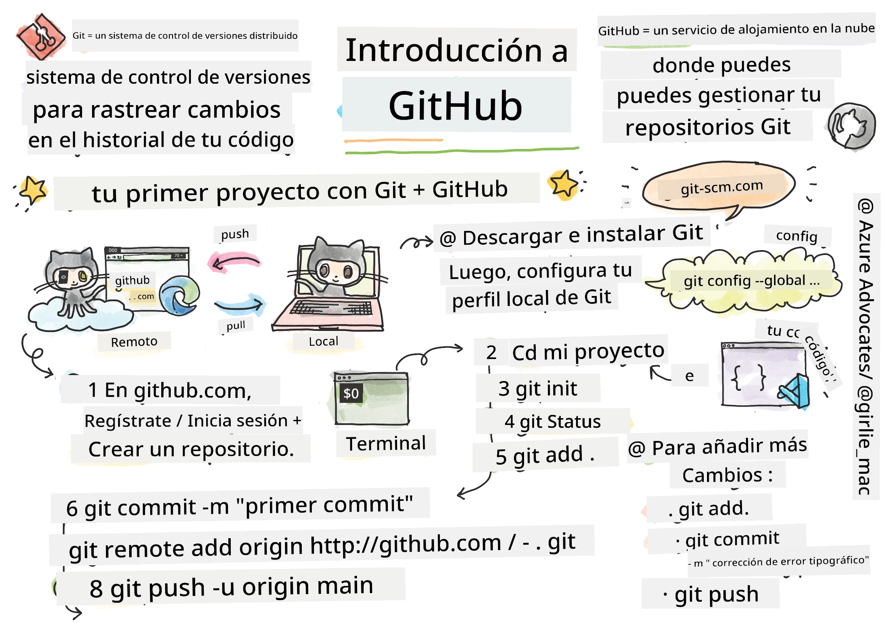
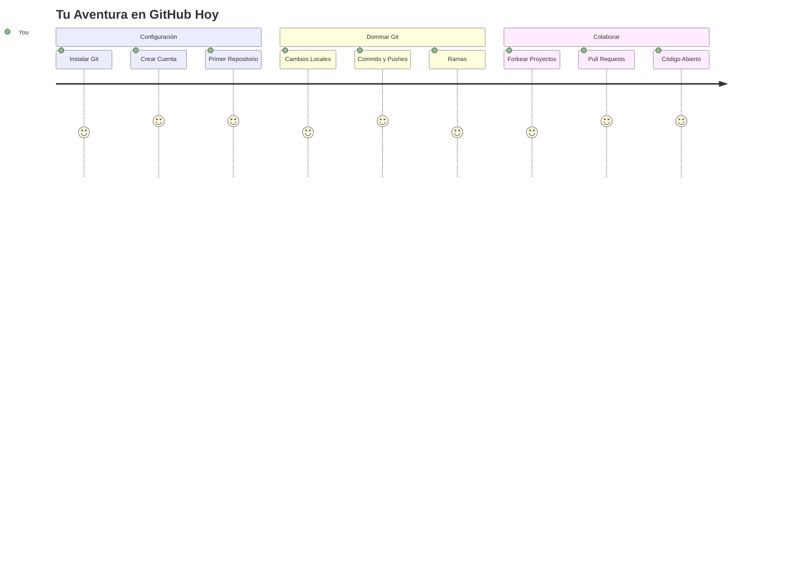
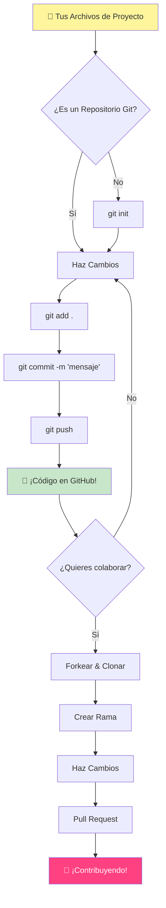
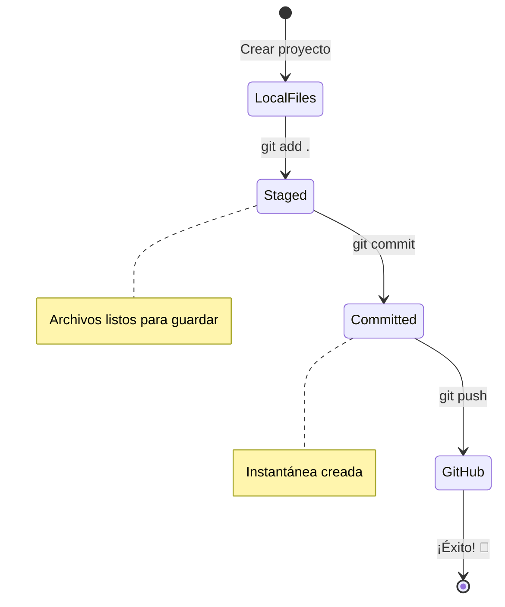
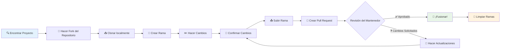
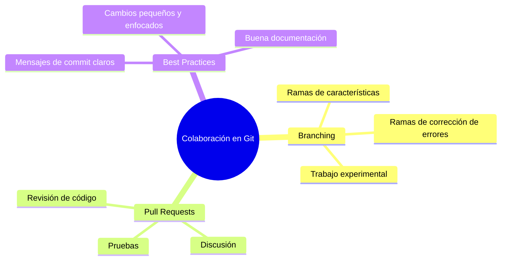
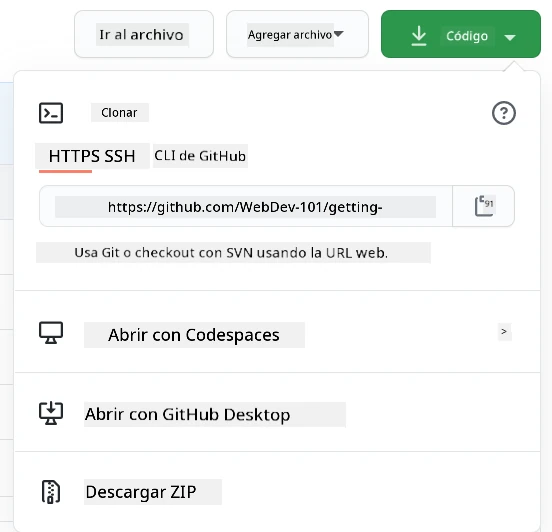
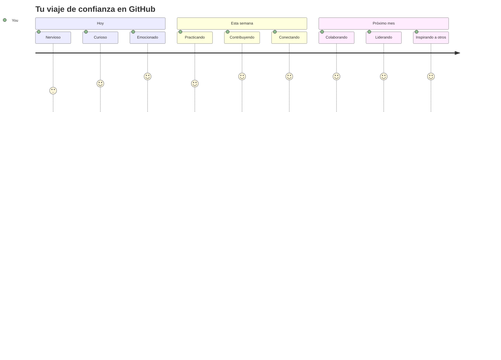

# Introducción a GitHub

¡Hola, futuro desarrollador! 👋 ¿Listo para unirte a millones de programadores en todo el mundo? Estoy realmente emocionado de presentarte GitHub – piensa en ello como la plataforma de redes sociales para programadores, excepto que en lugar de compartir fotos de tu almuerzo, compartimos código y construimos cosas increíbles juntos.

Lo que realmente me maravilla: cada aplicación en tu teléfono, cada sitio web que visitas y la mayoría de las herramientas que aprenderás a usar fueron creadas por equipos de desarrolladores colaborando en plataformas como GitHub. ¿Esa app de música que te encanta? Alguien como tú contribuyó a ella. ¿Ese juego que no puedes dejar? Sí, probablemente fue construido con colaboración en GitHub. ¡Y ahora TÚ vas a aprender cómo ser parte de esa increíble comunidad!

Sé que esto puede parecer mucho al principio – caray, recuerdo mirar mi primera página de GitHub pensando “¿qué demonios significa todo esto?” Pero aquí está la cosa: cada desarrollador empezó exactamente donde tú estás ahora. Al final de esta lección, tendrás tu propio repositorio en GitHub (piensa en ello como tu vitrina personal de proyectos en la nube), y sabrás cómo guardar tu trabajo, compartirlo con otros e incluso contribuir a proyectos que millones de personas usan.

Vamos a hacer este viaje juntos, paso a paso. Sin prisa, sin presión – solo tú, yo y algunas herramientas realmente geniales que van a convertirse en tus nuevos mejores amigos.


> Sketchnote por [Tomomi Imura](https://twitter.com/girlie_mac)


## Cuestionario previo a la lección
[Cuestionario previo a la lección](https://ff-quizzes.netlify.app)

## Introducción

Antes de sumergirnos en lo realmente emocionante, ¡vamos a preparar tu computadora para la magia de GitHub! Piensa en esto como organizar tus materiales de arte antes de crear una obra maestra – tener las herramientas correctas listas hace que todo sea mucho más fluido y divertido.

Te guiaré personalmente en cada paso de la configuración, y te prometo que no es tan intimidante como parece a primera vista. Si algo no te encaja de inmediato, ¡eso es completamente normal! Recuerdo configurar mi primer entorno de desarrollo y sentir como si estuviera leyendo jeroglíficos antiguos. Cada desarrollador estuvo exactamente donde tú estás ahora, preguntándose si lo está haciendo bien. Spoiler: si estás aquí aprendiendo, ¡ya lo estás haciendo bien! 🌟

En esta lección, cubriremos:

- cómo seguir el trabajo que haces en tu máquina
- cómo trabajar en proyectos con otros
- cómo contribuir al software de código abierto

### Prerrequisitos

¡Vamos a preparar tu computadora para la magia de GitHub! No te preocupes, esta configuración la solo necesitas hacer una vez, y luego estarás listo para todo tu viaje de programación.

Muy bien, empecemos con los cimientos. Primero, necesitamos comprobar si Git ya está instalado en tu computadora. Git es básicamente como tener un asistente súper inteligente que recuerda cada cambio que haces en tu código – mucho mejor que apretar frenéticamente Ctrl+S cada dos segundos (a todos nos ha pasado).

Veamos si Git ya está instalado escribiendo este comando mágico en tu terminal:
`git --version`

Si Git no está ahí todavía, no te preocupes. Solo ve a [descargar Git](https://git-scm.com/downloads) y consíguelo. Una vez que lo tengas instalado, necesitamos presentarte formalmente a Git:

> 💡 **Configuración inicial**: Estos comandos le dicen a Git quién eres. Esta información se adjuntará a cada commit que hagas, así que elige un nombre y correo electrónico con los que te sientas cómodo compartiendo públicamente.

```bash
git config --global user.name "your-name"
git config --global user.email "your-email"
```

Para verificar si Git ya está configurado puedes escribir:
```bash
git config --list
```

También necesitarás una cuenta de GitHub, un editor de código (como Visual Studio Code), y abrir tu terminal (o: símbolo del sistema).

Ve a [github.com](https://github.com/) y crea una cuenta si aún no tienes una, o inicia sesión y completa tu perfil.

💡 **Consejo moderno**: Considera configurar [claves SSH](https://docs.github.com/en/authentication/connecting-to-github-with-ssh) o usar [GitHub CLI](https://cli.github.com/) para una autenticación más fácil sin contraseñas.

✅ GitHub no es el único repositorio de código en el mundo; hay otros, pero GitHub es el más conocido

### Preparación

Necesitarás tanto una carpeta con un proyecto de código en tu máquina local (laptop o PC), como un repositorio público en GitHub, que servirá como ejemplo para cómo contribuir a proyectos de otros.

### Mantén tu código seguro

Hablemos de seguridad por un momento, pero no te preocupes, no vamos a abrumarte con cosas aterradoras. Piensa en estas prácticas de seguridad como en cerrar con llave tu auto o tu casa. Son hábitos simples que se vuelven una segunda naturaleza y mantienen tu trabajo duro protegido.

Te mostraremos las formas modernas y seguras de trabajar con GitHub desde el inicio. De esta manera, desarrollarás buenos hábitos que te servirán toda tu carrera como programador.

Cuando trabajes con GitHub, es importante seguir las mejores prácticas de seguridad:

| Área de Seguridad | Mejor Práctica | Por qué importa |
|---------------|---------------|----------------|
| **Autenticación** | Usa claves SSH o Tokens de Acceso Personal | Las contraseñas son menos seguras y están siendo eliminadas |
| **Autenticación en dos pasos** | Activa 2FA en tu cuenta de GitHub | Añade una capa extra de protección a tu cuenta |
| **Seguridad del repositorio** | Nunca hagas commit de información sensible | Las claves API y contraseñas nunca deben estar en repositorios públicos |
| **Gestión de dependencias** | Activa Dependabot para actualizaciones | Mantiene tus dependencias seguras y actualizadas |

> ⚠️ **Recordatorio crítico de seguridad**: Nunca hagas commit de claves API, contraseñas u otra información sensible en ningún repositorio. Usa variables de entorno y archivos `.gitignore` para proteger datos sensibles.

**Configuración de autenticación moderna:**

```bash
# Generar clave SSH (algoritmo moderno ed25519)
ssh-keygen -t ed25519 -C "your_email@example.com"

# Configurar Git para usar SSH
git remote set-url origin git@github.com:username/repository.git
```

> 💡 **Consejo profesional**: Las claves SSH eliminan la necesidad de ingresar contraseñas repetidamente y son más seguras que los métodos de autenticación tradicionales.

---

## Administra tu código como un profesional

¡Muy bien, AQUÍ es donde las cosas se ponen realmente emocionantes! 🎉 Estamos a punto de aprender cómo seguir y gestionar tu código como los profesionales, y honestamente, esta es una de mis cosas favoritas para enseñar porque cambia las reglas del juego.

Imagina esto: estás escribiendo una historia increíble, y quieres hacer seguimiento de cada borrador, cada edición brillante y cada momento de “espera, eso es genial” a lo largo del camino. ¡Eso es exactamente lo que Git hace por tu código! Es como tener el cuaderno más increíble que viaja en el tiempo y recuerda TODO – cada pulsación, cada cambio, cada “ups, eso rompió todo” que puedes deshacer al instante.

Seré honesto – esto puede parecer abrumador al principio. Cuando empecé, pensaba “¿Por qué no puedo simplemente guardar mis archivos como siempre?” Pero confía en mí: una vez que Git haga clic para ti (¡y lo hará!), tendrás uno de esos momentos de bombilla en la cabeza pensando “¿Cómo he programado SIN esto?” Es como descubrir que puedes volar cuando has estado caminando toda tu vida.

Supongamos que tienes una carpeta local con un proyecto de código y quieres empezar a seguir tu progreso usando git - el sistema de control de versiones. Algunas personas comparan usar git con escribir una carta de amor para tu yo futuro. Leyendo tus mensajes de commit días, semanas o meses después podrás recordar por qué tomaste una decisión, o “retroceder” un cambio – eso es, cuando escribes buenos “mensajes de commit”.


### Tarea: ¡Crea tu primer repositorio!

> 🎯 **Tu misión (y estoy tan emocionado por ti!)**: Vamos a crear tu primer repositorio en GitHub juntos. Para cuando terminemos aquí, tendrás tu propio rinconcito en Internet donde vive tu código, y habrás hecho tu primer “commit” (que es la manera elegante de decir que guardaste tu trabajo de forma inteligente).
>
> Honestamente, este es un momento muy especial – ¡estás a punto de unirte oficialmente a la comunidad global de desarrolladores! Todavía recuerdo la emoción de crear mi primer repositorio y pensar “¡Wow, realmente lo estoy haciendo!”

Vamos a recorrer esta aventura juntos, paso a paso. Tómate tu tiempo en cada parte – no hay premio por apresurarse, y te prometo que cada paso tendrá sentido. Recuerda, cada súper estrella de la programación que admiras alguna vez estuvo sentado exactamente donde tú estás, a punto de crear su primer repositorio. ¿Qué tan genial es eso?

> Mira el video
> 
> [](https://www.youtube.com/watch?v=9R31OUPpxU4)

**Hagámoslo juntos:**

1. **Crea tu repositorio en GitHub**. Ve a GitHub.com y busca ese botón verde brillante que dice **New** (o el signo **+** en la esquina superior derecha). Haz clic y selecciona **New repository**.

   Esto es lo que debes hacer:
   1. Ponle un nombre a tu repositorio – ¡hazlo significativo para ti!
   1. Añade una descripción si quieres (esto ayuda a otros a entender de qué trata tu proyecto)
   1. Decide si quieres que sea público (todo el mundo puede verlo) o privado (solo para ti)
   1. Recomiendo marcar la casilla para añadir un archivo README – es como la portada de tu proyecto
   1. Haz clic en **Create repository** y celebra – ¡acabas de crear tu primer repo! 🎉

2. **Ve a la carpeta de tu proyecto**. Ahora vamos a abrir tu terminal (no te preocupes, no es tan aterradora como parece). Necesitamos decirle a tu computadora dónde están los archivos de tu proyecto. Escribe este comando:

   ```bash
   cd [name of your folder]
   ```

   **Qué estamos haciendo aquí:**
   - Básicamente le decimos “Oye computadora, llévame a mi carpeta de proyecto”
   - Esto es como abrir una carpeta específica en tu escritorio, pero lo hacemos con comandos de texto
   - Reemplaza `[name of your folder]` con el nombre real de tu carpeta de proyecto

3. **Convierte tu carpeta en un repositorio Git**. ¡Aquí es donde sucede la magia! Escribe:

   ```bash
   git init
   ```

   **Esto es lo que acaba de pasar (¡muy cool!):**
   - Git acaba de crear una carpeta oculta `.git` dentro de tu proyecto – no la verás, pero está ahí
   - Tu carpeta normal ahora es un “repositorio” que puede seguir cada cambio que hagas
   - Piénsalo como darle superpoderes a tu carpeta para recordar todo

4. **Revisa qué está pasando**. Veamos qué piensa Git sobre tu proyecto ahora mismo:

   ```bash
   git status
   ```

   **Entendiendo lo que Git te está diciendo:**
   
   Quizá veas algo que se parece a esto:

   ```output
   Changes not staged for commit:
   (use "git add <file>..." to update what will be committed)
   (use "git restore <file>..." to discard changes in working directory)

        modified:   file.txt
        modified:   file2.txt
   ```

   **¡No te asustes! Esto significa:**
   - Los archivos en **rojo** son archivos que tienen cambios pero aún no están listos para guardar
   - Los archivos en **verde** (cuando los veas) están listos para guardar
   - Git te está ayudando diciéndote exactamente qué puedes hacer a continuación

   > 💡 **Consejo profesional**: El comando `git status` es tu mejor amigo. Úsalo cuando no entiendas qué está pasando. Es como preguntarle a Git “Oye, ¿cuál es la situación ahora mismo?”

5. **Prepara tus archivos para guardar** (esto se llama “staging”):

   ```bash
   git add .
   ```

   **Lo que acabamos de hacer:**
   - Le dijimos a Git “Oye, quiero incluir TODOS mis archivos en la próxima guardada”
   - El `.` es como decir “todo en esta carpeta”
   - Ahora tus archivos están “preparados” para el siguiente paso

   **¿Quieres ser más selectivo?** Puedes agregar solo archivos específicos:

   ```bash
   git add [file or folder name]
   ```

   **¿Por qué podrías querer hacer esto?**
   - A veces quieres guardar cambios relacionados juntos
   - Te ayuda a organizar tu trabajo en bloques lógicos
   - Hace más fácil entender qué cambió y cuándo

   **¿Cambiaste de opinión?** ¡No te preocupes! Puedes quitar archivos de la preparación así:

   ```bash
   # Deshacer la preparación de todo
   git reset
   
   # Deshacer la preparación de solo un archivo
   git reset [file name]
   ```

   No te preocupes – esto no borra tu trabajo, solo quita archivos de la pila “listos para guardar”.

6. **Guarda tu trabajo permanentemente** (¡haciendo tu primer commit!):

   ```bash
   git commit -m "first commit"
   ```

   **🎉 ¡Felicidades! Acabas de hacer tu primer commit!**
   
   **Esto es lo que acaba de pasar:**
   - Git tomó una “foto” de todos tus archivos preparados justo en este momento
   - Tu mensaje de commit “first commit” explica sobre qué es este punto de guardado
   - Git dio a esta foto un ID único para que siempre puedas encontrarla después
   - ¡Has empezado oficialmente a seguir la historia de tu proyecto!

   > 💡 **Mensajes futuros de commit**: Para tus próximos commits, sé más descriptivo. En lugar de “actualicé cosas”, prueba con “Agrega formulario de contacto a la página principal” o “Arregla error del menú de navegación”. Tu yo futuro te lo agradecerá.

7. **Conecta tu proyecto local a GitHub**. Ahora mismo, tu proyecto existe solo en tu computadora. Vamos a conectarlo a tu repositorio de GitHub para que puedas compartirlo con el mundo.

   Primero, ve a la página de tu repositorio en GitHub y copia la URL. Luego vuelve aquí y escribe:

   ```bash
   git remote add origin https://github.com/username/repository_name.git
   ```
   
   (¡Reemplaza esa URL con la URL real de tu repositorio!)

   **Lo que acabamos de hacer:**
   - Creamos una conexión entre tu proyecto local y tu repositorio de GitHub
   - "Origin" es solo un apodo para tu repositorio de GitHub – es como agregar un contacto a tu teléfono
   - Ahora tu Git local sabe a dónde enviar tu código cuando estés listo para compartirlo

   💡 **Forma más fácil**: Si tienes instalado GitHub CLI, puedes hacer esto con un solo comando:
   ```bash
   gh repo create my-repo --public --push --source=.
   ```

8. **Envía tu código a GitHub** (¡el gran momento!):

   ```bash
   git push -u origin main
   ```

   **🚀 ¡Esto es! ¡Estás subiendo tu código a GitHub!**
   
   **Qué está pasando:**
   - Tus commits están viajando desde tu computadora a GitHub
   - La bandera `-u` establece una conexión permanente para que futuros pushes sean más fáciles
   - "main" es el nombre de tu rama principal (como la carpeta principal)
   - Después de esto, ¡solo necesitas escribir `git push` para subidas futuras!

   💡 **Nota rápida**: Si tu rama se llama de otro modo (como "master"), usa ese nombre. Puedes verificar con `git branch --show-current`.

9. **Tu nuevo ritmo diario de codificación** (¡aquí es donde se vuelve adictivo!):

   A partir de ahora, cada vez que hagas cambios en tu proyecto, tienes este simple baile de tres pasos:

   ```bash
   git add .
   git commit -m "describe what you changed"
   git push
   ```

   **Esto se vuelve tu latido de codificación:**
   - Haz algunos cambios increíbles en tu código ✨
   - Prepáralos con `git add` ("¡Oye Git, presta atención a estos cambios!")
   - Guárdalos con `git commit` y un mensaje descriptivo (¡tu yo del futuro te lo agradecerá!)
   - Compártelos con el mundo usando `git push` 🚀
   - Repite – en serio, ¡esto se vuelve tan natural como respirar!

   Me encanta esta forma de trabajar porque es como tener múltiples puntos de guardado en un videojuego. ¿Hiciste un cambio que te gusta? ¡Haz commit! ¿Quieres probar algo arriesgado? No hay problema – siempre puedes volver a tu último commit si las cosas salen mal.

   > 💡 **Consejo**: También podrías querer adoptar un archivo `.gitignore` para evitar que archivos que no quieres rastrear aparezcan en GitHub – como ese archivo de notas que guardas en la misma carpeta pero no tiene lugar en un repositorio público. Puedes encontrar plantillas para archivos `.gitignore` en [.gitignore templates](https://github.com/github/gitignore) o crear uno usando [gitignore.io](https://www.toptal.com/developers/gitignore).

### 🧠 **Primera entrega al repositorio: ¿Cómo te sentiste?**

**Tómate un momento para celebrar y reflexionar:**
- ¿Cómo te sentiste al ver tu código aparecer en GitHub por primera vez?
- ¿Qué paso te pareció el más confuso y cuál resultó sorprendentemente fácil?
- ¿Puedes explicar con tus propias palabras la diferencia entre `git add`, `git commit` y `git push`?


> **Recuerda**: Incluso los desarrolladores experimentados a veces olvidan los comandos exactos. Que este flujo de trabajo se vuelva memoria muscular toma práctica – ¡vas muy bien!

#### Flujos de trabajo modernos de Git

Considera adoptar estas prácticas modernas:

- **Commits Convencionales**: Usa un formato estandarizado para mensajes de commit como `feat:`, `fix:`, `docs:`, etc. Aprende más en [conventionalcommits.org](https://www.conventionalcommits.org/)
- **Commits atómicos**: Haz que cada commit represente un solo cambio lógico
- **Commits frecuentes**: Haz commits seguido con mensajes descriptivos en lugar de commits grandes y poco frecuentes

#### Mensajes de commit

Una gran línea de asunto para un commit de Git completa la siguiente frase:  
Si se aplica, este commit <tu línea de asunto aquí>

Para el asunto usa el imperativo en presente: "cambia" no "cambió" ni "cambios".  
Como en el asunto, en el cuerpo (opcional) también usa el imperativo en presente. El cuerpo debe incluir la motivación del cambio y contrastar esto con el comportamiento previo. Estás explicando el `por qué`, no el `cómo`.

✅ Tómate unos minutos para navegar por GitHub. ¿Puedes encontrar un mensaje de commit realmente bueno? ¿Puedes encontrar uno muy minimalista? ¿Qué información crees que es la más importante y útil transmitir en un mensaje de commit?

## Trabajando con otros (¡La parte divertida!)

¡Sujeta tu sombrero porque AQUÍ es donde GitHub se vuelve absolutamente mágico! 🪄 Has dominado manejar tu propio código, pero ahora nos sumergimos en mi parte favorita – colaborar con personas increíbles de todo el mundo.

Imagínate esto: mañana te levantas y ves que alguien en Tokio mejoró tu código mientras dormías. Luego alguien en Berlín arregla un bug en el que estabas atorado. Por la tarde, un desarrollador en São Paulo añadió una función que ni siquiera habías pensado. Esto no es ciencia ficción – es solo un martes en el universo de GitHub.

Lo que me emociona es que las habilidades de colaboración que vas a aprender son los mismos flujos de trabajo EXÁCTOS que los equipos en Google, Microsoft y tus startups favoritas usan todos los días. No solo estás aprendiendo una herramienta genial – estás aprendiendo el lenguaje secreto que hace que todo el mundo del software trabaje en conjunto.

En serio, una vez que experimentes la emoción de que alguien haga merge de tu primera pull request, entenderás por qué los desarrolladores se apasionan tanto por el código abierto. ¡Es como ser parte del proyecto creativo y de equipo más grande del mundo!

> Mira el video  
>  
> [](https://www.youtube.com/watch?v=bFCM-PC3cu8)

La razón principal para poner cosas en GitHub fue hacer posible colaborar con otros desarrolladores.


En tu repositorio, navega a `Insights > Community` para ver cómo tu proyecto se compara con los estándares recomendados de la comunidad.

¿Quieres que tu repositorio luzca profesional y acogedor? Ve a tu repositorio y haz clic en `Insights > Community`. Esta función genial te muestra cómo se compara tu proyecto con lo que la comunidad de GitHub considera "buenas prácticas de repositorios".

> 🎯 **Haz que tu proyecto brille**: Un repositorio bien organizado con buena documentación es como tener una tienda limpia y acogedora. Cuenta a las personas que te importa tu trabajo y hace que otros quieran contribuir.

**Esto es lo que hace un repositorio increíble:**

| Qué añadir | Por qué es importante | Qué te aporta |
|-------------|-------------------|---------------------|
| **Descripción** | ¡La primera impresión cuenta! | La gente sabe al instante qué hace tu proyecto |
| **README** | La página principal de tu proyecto | Como un guía amable para nuevos visitantes |
| **Guías de contribución** | Muestra que das la bienvenida a ayuda | La gente sabe exactamente cómo puede ayudarte |
| **Código de Conducta** | Crea un espacio amigable | Todos se sienten bienvenidos a participar |
| **Licencia** | Claridad legal | Otros saben cómo pueden usar tu código |
| **Política de Seguridad** | Muestra que eres responsable | Demuestra prácticas profesionales |

> 💡 **Consejo profesional**: GitHub proporciona plantillas para todos estos archivos. Al crear un nuevo repositorio, marca las casillas para generar estos archivos automáticamente.

**Funciones modernas de GitHub para explorar:**

🤖 **Automatización y CI/CD:**  
- **GitHub Actions** para pruebas y despliegues automatizados  
- **Dependabot** para actualizaciones automáticas de dependencias  

💬 **Comunidad y gestión de proyectos:**  
- **GitHub Discussions** para conversaciones comunitarias más allá de issues  
- **GitHub Projects** para gestión de proyectos estilo kanban  
- **Reglas de protección de ramas** para aplicar estándares de calidad de código

Todos estos recursos beneficiarán la incorporación de nuevos miembros al equipo. Y generalmente son las cosas que los colaboradores nuevos miran antes de siquiera revisar tu código, para saber si tu proyecto es el lugar correcto para que dediquen su tiempo.

✅ Los archivos README, aunque requieren tiempo para prepararlos, a menudo son descuidados por mantenedores ocupados. ¿Puedes encontrar un ejemplo de uno particularmente descriptivo? Nota: hay algunas [herramientas para crear buenos READMEs](https://www.makeareadme.com/) que quizás quieras probar.

### Tarea: Fusionar algo de código

Las docs de contribución ayudan a que las personas contribuyan al proyecto. Explican qué tipos de contribuciones buscas y cómo funciona el proceso. Los colaboradores necesitarán pasar por una serie de pasos para poder contribuir a tu repo en GitHub:

1. **Hacer un fork de tu repo** Probablemente querrás que la gente haga un _fork_ de tu proyecto. Hacer fork significa crear una réplica de tu repositorio en su perfil de GitHub.  
1. **Clonar**. De ahí clonan el proyecto a su máquina local.  
1. **Crear una rama**. Querrás pedirles que creen una _rama_ para su trabajo.  
1. **Enfocar su cambio en un área**. Pide a los colaboradores que concentren sus contribuciones en una sola cosa a la vez – así hay más chances de que puedas _fusionar_ su trabajo. Imagina que escriben un arreglo de bug, añaden una nueva función y actualizan varias pruebas – ¿qué pasa si quieres, o solo puedes implementar, 2 de 3 cambios o solo 1 de 3?

✅ Imagina una situación donde las ramas son particularmente críticas para escribir y entregar buen código. ¿Qué casos de uso se te ocurren?

> Nota, sé el cambio que quieres ver en el mundo y crea ramas para tu propio trabajo también. Cualquier commit que hagas se añadirá a la rama en la que estés “checked out”. Usa `git status` para ver cuál es.

Repasemos un flujo de trabajo para colaboradores. Asumamos que el colaborador ya ha _forkeado_ y _clonado_ el repo, así que tiene un repo Git listo para trabajar en su máquina local:

1. **Crear una rama**. Usa el comando `git branch` para crear una rama que contendrá los cambios que piensa contribuir:

   ```bash
   git branch [branch-name]
   ```

   > 💡 **Enfoque moderno**: También puedes crear y cambiar a la nueva rama con un solo comando:
   ```bash
   git switch -c [branch-name]
   ```

1. **Cambiar a la rama de trabajo**. Cambia a la rama especificada y actualiza el directorio de trabajo con `git switch`:

   ```bash
   git switch [branch-name]
   ```

   > 💡 **Nota moderna**: `git switch` es el reemplazo moderno de `git checkout` cuando cambias ramas. Es más claro y seguro para principiantes.

1. **Hacer el trabajo**. Ahora quieres añadir tus cambios. No olvides informar a Git con los siguientes comandos:

   ```bash
   git add .
   git commit -m "my changes"
   ```

   > ⚠️ **Calidad del mensaje de commit**: Asegúrate de darle un buen nombre a tu commit, tanto para ti como para el mantenedor del repo que estás ayudando. ¡Sé específico sobre qué cambiaste!

1. **Combina tu trabajo con la rama `main`**. En algún momento terminas de trabajar y quieres combinar tu trabajo con el de la rama `main`. La rama `main` podría haber cambiado mientras tanto, así que asegúrate primero de actualizarla a la última versión con los siguientes comandos:

   ```bash
   git switch main
   git pull
   ```

   Ahora quieres asegurarte de que cualquier _conflicto_, situaciones donde Git no puede _combinar_ fácilmente los cambios, ocurra en tu rama de trabajo. Por eso ejecuta estos comandos:

   ```bash
   git switch [branch_name]
   git merge main
   ```

   El comando `git merge main` traerá todos los cambios de `main` a tu rama. Con suerte solo puedes continuar. Si no, VS Code te dirá dónde Git está _confundido_ y solo debes modificar los archivos afectados para indicar cuál contenido es el más correcto.

   💡 **Alternativa moderna**: Considera usar `git rebase` para un historial más limpio:
   ```bash
   git rebase main
   ```
   Esto reproduce tus commits encima de la última rama main, creando un historial lineal.

1. **Envía tu trabajo a GitHub**. Enviar tu trabajo a GitHub significa dos cosas. Hacer push de tu rama a tu repo y luego abrir una PR, Pull Request.

   ```bash
   git push --set-upstream origin [branch-name]
   ```

   El comando anterior crea la rama en tu repo forkeado.

### 🤝 **Revisión de habilidades de colaboración: ¿Listo para trabajar con otros?**

**Veamos cómo te sientes sobre la colaboración:**  
- ¿Te hace sentido ahora la idea de hacer fork y pull requests?  
- ¿Qué es una cosa acerca de trabajar con ramas que quieres practicar más?  
- ¿Qué tan cómodo te sientes contribuyendo a un proyecto de otra persona?


> **Impulso de confianza**: Cada desarrollador que admiras estuvo nervioso en su primera pull request. ¡La comunidad de GitHub es increíblemente acogedora con los nuevos!

1. **Abre una PR**. Luego, quieres abrir una PR. Para eso navegas al repo forkeado en GitHub. Verás una indicación en GitHub que te pregunta si quieres crear una nueva PR, haces clic y te llevan a una interfaz donde puedes cambiar el título del mensaje de commit, darle una descripción más adecuada. Ahora el mantenedor del repo que forkearon verá esta PR y _crucemos los dedos_ la apreciará y _fusionará_ tu PR. ¡Ahora eres un colaborador, yay!

   💡 **Consejo moderno**: También puedes crear PRs usando GitHub CLI:
   ```bash
   gh pr create --title "Your PR title" --body "Description of changes"
   ```

   🔧 **Mejores prácticas para PRs**:  
   - Enlaza a issues relacionados usando palabras clave como "Fixes #123"  
   - Añade capturas para cambios en la UI  
   - Solicita revisores específicos  
   - Usa PRs en draft para trabajo en progreso  
   - Asegúrate de que todas las comprobaciones CI pasen antes de solicitar revisión
1. **Limpieza**. Se considera una buena práctica _limpiar_ después de fusionar con éxito un PR. Quieres limpiar tanto tu rama local como la rama que enviaste a GitHub. Primero, elimínala localmente con el siguiente comando: 

   ```bash
   git branch -d [branch-name]
   ```

   Asegúrate de ir a la página de GitHub del repo bifurcado a continuación y eliminar la rama remota que acabas de enviar.

`Pull request` parece un término tonto porque en realidad quieres enviar tus cambios al proyecto. Pero el mantenedor (propietario del proyecto) o el equipo central necesita considerar tus cambios antes de fusionarlos con la rama "main" del proyecto, por lo que realmente estás solicitando una decisión de cambio a un mantenedor.

Un pull request es el lugar para comparar y discutir las diferencias introducidas en una rama con revisiones, comentarios, pruebas integradas y más. Un buen pull request sigue aproximadamente las mismas reglas que un mensaje de commit. Puedes agregar una referencia a un issue en el tracker de issues, cuando tu trabajo, por ejemplo, soluciona un issue. Esto se hace usando un `#` seguido del número de tu issue. Por ejemplo `#97`.

🤞Crucemos los dedos para que todas las comprobaciones pasen y los propietarios del proyecto fusionen tus cambios en el proyecto🤞

Actualiza tu rama local actual con todos los nuevos commits de la rama remota correspondiente en GitHub:

`git pull`

## Contribuyendo al Código Abierto (¡Tu oportunidad de hacer un impacto!)

¿Estás listo para algo que te va a volar la mente? 🤯 ¡Hablemos de contribuir a proyectos de código abierto — y me da escalofríos solo de pensar en compartir esto contigo!

Esta es tu oportunidad de ser parte de algo verdaderamente extraordinario. Imagina mejorar las herramientas que millones de desarrolladores usan cada día, o arreglar un error en una app que a tus amigos les encanta. Eso no es solo un sueño — ¡esto es de lo que se trata contribuir al código abierto!

Esto es lo que me emociona cada vez que lo pienso: cada herramienta que has estado aprendiendo — tu editor de código, los frameworks que exploraremos, incluso el navegador en el que estás leyendo esto — comenzó con alguien exactamente como tú haciendo su primera contribución. ¿Ese desarrollador brillante que creó tu extensión favorita de VS Code? Ellos fueron alguna vez un principiante haciendo clic en "create pull request" con manos temblorosas, justo como estás a punto de hacer tú.

Y aquí está la parte más hermosa: la comunidad de código abierto es como el abrazo grupal más grande de internet. La mayoría de los proyectos buscan activamente nuevos contribuyentes y tienen issues etiquetados como "good first issue" específicamente para personas como tú. Los mantenedores realmente se emocionan cuando ven nuevos contribuyentes porque recuerdan sus propios primeros pasos.

```mermaid
flowchart TD
    A[🔍 Explorar GitHub] --> B[🏷️ Encontrar "primer buen problema"]
    B --> C[📖 Leer las pautas de contribución]
    C --> D[🍴 Hacer un Fork del repositorio]
    D --> E[💻 Configurar entorno local]
    E --> F[🌿 Crear rama de función]
    F --> G[✨ Hacer tu contribución]
    G --> H[🧪 Probar tus cambios]
    H --> I[📝 Escribir commit claro]
    I --> J[📤 Hacer push y crear PR]
    J --> K[💬 Participar con comentarios]
    K --> L[🎉 ¡Fusionado! ¡Eres un contribuidor!]
    L --> M[🌟 Encontrar siguiente problema]
    
    style A fill:#e1f5fe
    style L fill:#c8e6c9
    style M fill:#fff59d
```
Aquí no solo estás aprendiendo a programar — estás preparándote para unirte a una familia global de constructores que se despiertan cada día pensando "¿Cómo podemos hacer el mundo digital un poco mejor?" ¡Bienvenido al club! 🌟

Primero, encuentra un repositorio (o **repo**) en GitHub que te interese y al que quieras contribuir con un cambio. Querrás copiar su contenido a tu máquina.

✅ Una buena manera de encontrar repositorios 'amigables para principiantes' es [buscar por la etiqueta 'good-first-issue'](https://github.blog/2020-01-22-browse-good-first-issues-to-start-contributing-to-open-source/).



Hay varias maneras de copiar código. Una es "clonar" el contenido del repositorio, usando HTTPS, SSH o la CLI de GitHub (Interfaz de Línea de Comandos).

Abre tu terminal y clona el repositorio así:
```bash
# Usando HTTPS
git clone https://github.com/ProjectURL

# Usando SSH (requiere configuración de clave SSH)
git clone git@github.com:username/repository.git

# Usando GitHub CLI
gh repo clone username/repository
```

Para trabajar en el proyecto, cambia a la carpeta correcta:
`cd ProjectURL`

También puedes abrir todo el proyecto usando:
- **[GitHub Codespaces](https://github.com/features/codespaces)** - El entorno de desarrollo en la nube de GitHub con VS Code en el navegador
- **[GitHub Desktop](https://desktop.github.com/)** - Una aplicación GUI para operaciones Git  
- **[GitHub.dev](https://github.dev)** - Presiona la tecla `.` en cualquier repo de GitHub para abrir VS Code en el navegador
- **VS Code** con la extensión de Pull Requests de GitHub

Finalmente, puedes descargar el código en una carpeta comprimida.

### Algunas cosas más interesantes sobre GitHub

Puedes marcar con estrella, seguir y/o "bifurcar" cualquier repositorio público en GitHub. Puedes encontrar tus repositorios marcados con estrella en el menú desplegable de la parte superior derecha. Es como agregar un marcador, pero para código.

Los proyectos tienen un rastreador de issues, mayormente en GitHub en la pestaña "Issues" a menos que se indique lo contrario, donde la gente discute problemas relacionados con el proyecto. Y la pestaña de Pull Requests es donde la gente discute y revisa cambios que están en progreso.

Los proyectos también pueden tener discusión en foros, listas de correo o canales de chat como Slack, Discord o IRC.

🔧 **Características modernas de GitHub**:
- **GitHub Discussions** - Foro integrado para conversaciones de la comunidad
- **GitHub Sponsors** - Apoya financieramente a los mantenedores  
- **Pestaña de Seguridad** - Reportes de vulnerabilidades y avisos de seguridad
- **Pestaña de Actions** - Ve flujos de trabajo automatizados y pipelines de CI/CD
- **Pestaña de Insights** - Análisis sobre contribuyentes, commits y salud del proyecto
- **Pestaña de Projects** - Herramientas integradas de gestión de proyectos de GitHub

✅ Explora tu nuevo repo de GitHub y prueba algunas cosas, como editar configuraciones, agregar información a tu repositorio, crear un proyecto (como un tablero Kanban), y configurar GitHub Actions para automatización. ¡Hay mucho que puedes hacer!

---

## 🚀 Desafío

Bien, es hora de poner a prueba tus nuevos súper poderes de GitHub! 🚀 Aquí tienes un desafío que hará que todo encaje de la manera más satisfactoria:

¡Toma a un amigo (o ese familiar que siempre te pregunta qué haces con toda esta "cosa de computadoras") y emprendan una aventura colaborativa de código juntos! Aquí es donde sucede la magia real – crea un proyecto, déjalo bifurcarlo, hagan algunas ramas y fusionen cambios como los profesionales que están convirtiéndose.

No te voy a mentir – probablemente se rían en algún momento (especialmente cuando ambos intenten cambiar la misma línea), quizá se rasquen la cabeza confundidos, pero definitivamente tendrán esos increíbles momentos “¡ajá!” que hacen que todo el aprendizaje valga la pena. Además, hay algo especial en compartir esa primera fusión exitosa con alguien más – es como una pequeña celebración de lo lejos que has llegado.

¿No tienes un compañero para programar aún? ¡No hay problema! La comunidad de GitHub está llena de personas increíblemente acogedoras que recuerdan cómo fue ser nuevo. Busca repositorios con etiquetas "good first issue" – básicamente están diciendo "¡Hey principiantes, vengan a aprender con nosotros!" ¿No es genial?

## Quiz después de la lección
[Quiz después de la lección](https://ff-quizzes.netlify.app/web/en/)

## Repaso y sigue aprendiendo

¡Uf! 🎉 Mírate – acabas de conquistar lo básico de GitHub como un verdadero campeón! Si tu cabeza se siente un poco llena ahora mismo, eso es completamente normal y honestamente es una buena señal. Acabas de aprender herramientas que a mí me tomaron semanas para sentirme cómodo cuando empecé.

Git y GitHub son increíblemente poderosos (de verdad, poderosos), y cada desarrollador que conozco – incluyendo aquellos que ahora parecen magos – tuvo que practicar y tropezar un poco antes de que todo encajara. El hecho de que hayas llegado hasta aquí significa que ya estás en camino de dominar algunas de las herramientas más importantes en el kit de herramientas de un desarrollador.

Aquí tienes algunos recursos absolutamente fantásticos para ayudarte a practicar y volverte aún más increíble:

- [Guía para contribuir a software de código abierto](https://opensource.guide/how-to-contribute/#how-to-submit-a-contribution) – Tu hoja de ruta para hacer una diferencia
- [Hoja de trucos de Git](https://training.github.com/downloads/github-git-cheat-sheet/) – Tenla a mano para referencia rápida

Y recuerda: ¡la práctica hace progreso, no perfección! Cuanto más uses Git y GitHub, más natural se volverá. GitHub ha creado algunos cursos interactivos increíbles que te permiten practicar en un entorno seguro:

- [Introducción a GitHub](https://github.com/skills/introduction-to-github)
- [Comunícate usando Markdown](https://github.com/skills/communicate-using-markdown)  
- [GitHub Pages](https://github.com/skills/github-pages)
- [Manejo de conflictos de merge](https://github.com/skills/resolve-merge-conflicts)

**¿Te sientes aventurero? Revisa estas herramientas modernas:**
- [Documentación de GitHub CLI](https://cli.github.com/manual/) – Para cuando quieras sentirte como un mago de la línea de comandos
- [Documentación de GitHub Codespaces](https://docs.github.com/en/codespaces) – ¡Programa en la nube!
- [Documentación de GitHub Actions](https://docs.github.com/en/actions) – Automatiza todo
- [Buenas prácticas de Git](https://www.atlassian.com/git/tutorials/comparing-workflows) – Lleva tu flujo de trabajo al siguiente nivel

## Desafío del Agente GitHub Copilot 🚀

Usa el modo Agente para completar el siguiente desafío:

**Descripción:** Crea un proyecto colaborativo de desarrollo web que demuestre el flujo de trabajo completo de GitHub que aprendiste en esta lección. Este desafío te ayudará a practicar la creación de repositorios, funciones de colaboración y flujos de trabajo modernos de Git en un escenario real.

**Instrucción:** Crea un repositorio público nuevo en GitHub para un proyecto sencillo llamado "Recursos de Desarrollo Web". El repositorio debe incluir un archivo README.md bien estructurado que liste herramientas y recursos útiles para desarrollo web, organizados por categorías (HTML, CSS, JavaScript, etc.). Configura el repositorio con los estándares comunitarios adecuados incluyendo una licencia, pautas para contribuciones y un código de conducta. Crea al menos dos ramas de características: una para agregar recursos CSS y otra para recursos JavaScript. Haz commits en cada rama con mensajes descriptivos, luego crea pull requests para fusionar los cambios a main. Activa características de GitHub como Issues, Discussions y configura un flujo básico de trabajo de GitHub Actions para comprobaciones automáticas.

## Asignación

Tu misión, si decides aceptarla: Completa el curso [Introducción a GitHub](https://github.com/skills/introduction-to-github) en GitHub Skills. Este curso interactivo te permitirá practicar todo lo que has aprendido en un entorno seguro y guiado. ¡Además, obtendrás una insignia genial cuando termines! 🏅

**¿Listo para más desafíos?**
- Configura la autenticación SSH para tu cuenta de GitHub (¡adiós contraseñas!)
- Prueba usar GitHub CLI para tus operaciones diarias con Git
- Crea un repositorio con un flujo de trabajo de GitHub Actions
- Explora GitHub Codespaces abriendo este mismo repositorio en un editor en la nube

---

## 🚀 Tu línea de tiempo para dominar GitHub

### ⚡ **Lo que puedes hacer en los próximos 5 minutos**
- [ ] Marca con estrella este repositorio y otros 3 proyectos que te interesen
- [ ] Configura la autenticación de dos factores en tu cuenta de GitHub
- [ ] Crea un README simple para tu primer repositorio
- [ ] Sigue a 5 desarrolladores cuyo trabajo te inspire

### 🎯 **Lo que puedes lograr esta hora**
- [ ] Completa el quiz posterior a la lección y reflexiona sobre tu viaje en GitHub
- [ ] Configura claves SSH para autenticación sin contraseñas en GitHub
- [ ] Haz tu primer commit significativo con un gran mensaje de commit
- [ ] Explora la pestaña "Explore" de GitHub para descubrir proyectos populares
- [ ] Practica bifurcar un repositorio y hacer un cambio pequeño

### 📅 **Tu aventura de una semana en GitHub**
- [ ] Completa los cursos de GitHub Skills (Introducción a GitHub, Markdown)
- [ ] Haz tu primer pull request a un proyecto de código abierto
- [ ] Configura un sitio GitHub Pages para mostrar tu trabajo
- [ ] Participa en GitHub Discussions sobre proyectos que te interesen
- [ ] Crea un repositorio con los estándares comunitarios adecuados (README, licencia, etc.)
- [ ] Prueba GitHub Codespaces para desarrollo en la nube

### 🌟 **Tu transformación de un mes**
- [ ] Contribuye a 3 proyectos distintos de código abierto
- [ ] Mentorea a alguien nuevo en GitHub (paga con generosidad)
- [ ] Configura flujos de trabajo automatizados con GitHub Actions
- [ ] Construye un portafolio mostrando tus contribuciones en GitHub
- [ ] Participa en Hacktoberfest o eventos comunitarios similares
- [ ] Conviértete en mantenedor de tu propio proyecto al que otros contribuyan

### 🎓 **Revisión final de dominio de GitHub**

**Celebra lo lejos que has llegado:**
- ¿Qué es lo que más te gusta de usar GitHub?
- ¿Qué característica de colaboración te entusiasma más?
- ¿Qué tan seguro te sientes para contribuir a código abierto ahora?
- ¿Cuál es el primer proyecto al que quieres contribuir?


> 🌍 **¡Bienvenido a la comunidad mundial de desarrolladores!** Ahora tienes las herramientas para colaborar con millones de desarrolladores en todo el mundo. Tu primera contribución puede parecer pequeña, pero recuerda: cada gran proyecto de código abierto comenzó con alguien haciendo su primer commit. La pregunta no es si harás un impacto, sino qué increíble proyecto se beneficiará primero de tu perspectiva única. 🚀

Recuerda: todo experto fue alguna vez un principiante. ¡Tú puedes! 💪

---

<!-- CO-OP TRANSLATOR DISCLAIMER START -->
**Aviso legal**:  
Este documento ha sido traducido utilizando el servicio de traducción automática [Co-op Translator](https://github.com/Azure/co-op-translator). Aunque nos esforzamos por la exactitud, tenga en cuenta que las traducciones automatizadas pueden contener errores o inexactitudes. El documento original en su idioma nativo debe considerarse la fuente autorizada. Para información crítica, se recomienda una traducción profesional realizada por un humano. No nos hacemos responsables por malentendidos o interpretaciones erróneas derivadas del uso de esta traducción.
<!-- CO-OP TRANSLATOR DISCLAIMER END -->