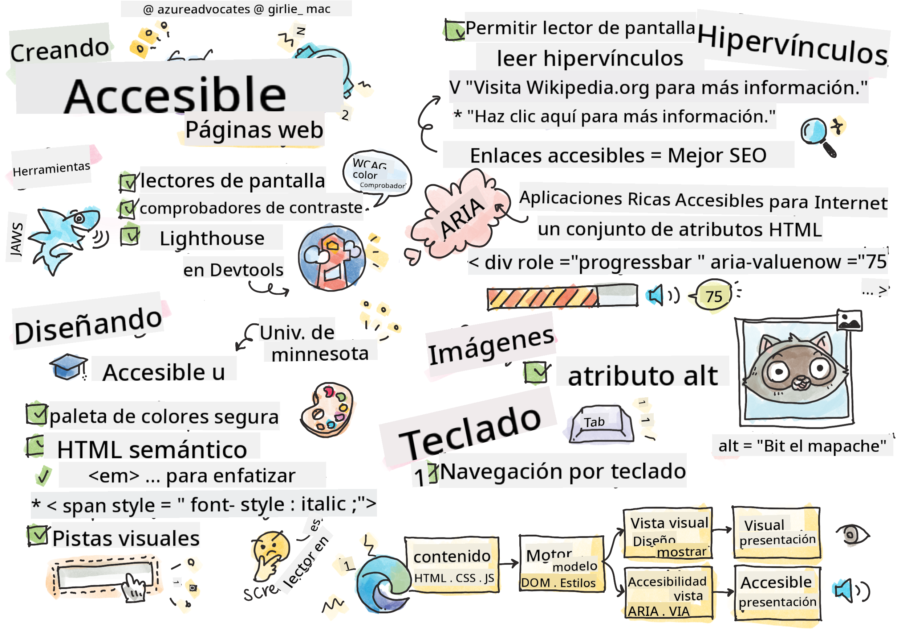

<!--
CO_OP_TRANSLATOR_METADATA:
{
  "original_hash": "f0c88c3e2cefa8952d356f802b1e47ca",
  "translation_date": "2025-08-29T14:02:15+00:00",
  "source_file": "1-getting-started-lessons/3-accessibility/README.md",
  "language_code": "es"
}
-->
# Creando Páginas Web Accesibles


> Sketchnote por [Tomomi Imura](https://twitter.com/girlie_mac)

## Cuestionario Previo a la Clase
[Cuestionario previo a la clase](https://ff-quizzes.netlify.app/web/)

> El poder de la Web está en su universalidad. El acceso para todos, independientemente de la discapacidad, es un aspecto esencial.
>
> \- Sir Timothy Berners-Lee, Director de W3C e inventor de la World Wide Web

Esta cita destaca perfectamente la importancia de crear sitios web accesibles. Una aplicación que no puede ser utilizada por todos es, por definición, excluyente. Como desarrolladores web, siempre debemos tener en mente la accesibilidad. Al enfocarnos en esto desde el principio, estaremos en buen camino para garantizar que todos puedan acceder a las páginas que creamos. En esta lección, aprenderás sobre las herramientas que pueden ayudarte a garantizar que tus recursos web sean accesibles y cómo construir con la accesibilidad en mente.

> Puedes tomar esta lección en [Microsoft Learn](https://docs.microsoft.com/learn/modules/web-development-101/accessibility/?WT.mc_id=academic-77807-sagibbon)!

## Herramientas para usar

### Lectores de pantalla

Una de las herramientas de accesibilidad más conocidas son los lectores de pantalla.

[Lectores de pantalla](https://en.wikipedia.org/wiki/Screen_reader) son clientes comúnmente utilizados por personas con discapacidades visuales. Así como dedicamos tiempo a garantizar que un navegador transmita correctamente la información que queremos compartir, también debemos asegurarnos de que un lector de pantalla haga lo mismo.

En su forma más básica, un lector de pantalla leerá una página de arriba hacia abajo de forma audible. Si tu página es solo texto, el lector transmitirá la información de manera similar a un navegador. Por supuesto, las páginas web rara vez son puramente texto; contienen enlaces, gráficos, colores y otros componentes visuales. Es importante asegurarse de que esta información se lea correctamente por un lector de pantalla.

Todo desarrollador web debería familiarizarse con un lector de pantalla. Como se destacó anteriormente, es el cliente que tus usuarios utilizarán. De la misma manera que estás familiarizado con cómo opera un navegador, deberías aprender cómo opera un lector de pantalla. Afortunadamente, los lectores de pantalla están integrados en la mayoría de los sistemas operativos.

Algunos navegadores también tienen herramientas integradas y extensiones que pueden leer texto en voz alta o incluso proporcionar algunas funciones básicas de navegación, como [estas herramientas enfocadas en accesibilidad del navegador Edge](https://support.microsoft.com/help/4000734/microsoft-edge-accessibility-features). Estas también son herramientas importantes de accesibilidad, pero funcionan de manera muy diferente a los lectores de pantalla y no deben confundirse con herramientas de prueba de lectores de pantalla.

✅ Prueba un lector de pantalla y un lector de texto del navegador. En Windows, [Narrador](https://support.microsoft.com/windows/complete-guide-to-narrator-e4397a0d-ef4f-b386-d8ae-c172f109bdb1/?WT.mc_id=academic-77807-sagibbon) está incluido por defecto, y [JAWS](https://webaim.org/articles/jaws/) y [NVDA](https://www.nvaccess.org/about-nvda/) también se pueden instalar. En macOS y iOS, [VoiceOver](https://support.apple.com/guide/voiceover/welcome/10) está instalado por defecto.

### Zoom

Otra herramienta comúnmente utilizada por personas con discapacidades visuales es el zoom. El tipo más básico de zoom es el zoom estático, controlado mediante `Control + signo más (+)` o disminuyendo la resolución de la pantalla. Este tipo de zoom hace que toda la página se redimensione, por lo que usar [diseño responsivo](https://developer.mozilla.org/docs/Learn/CSS/CSS_layout/Responsive_Design) es importante para proporcionar una buena experiencia de usuario en niveles de zoom aumentados.

Otro tipo de zoom depende de software especializado para ampliar un área de la pantalla y desplazarse, como usar una lupa real. En Windows, [Lupa](https://support.microsoft.com/windows/use-magnifier-to-make-things-on-the-screen-easier-to-see-414948ba-8b1c-d3bd-8615-0e5e32204198) está integrado, y [ZoomText](https://www.freedomscientific.com/training/zoomtext/getting-started/) es un software de ampliación de terceros con más funciones y una base de usuarios más grande. Tanto macOS como iOS tienen un software de ampliación integrado llamado [Zoom](https://www.apple.com/accessibility/mac/vision/).

### Comprobadores de contraste

Los colores en los sitios web deben elegirse cuidadosamente para responder a las necesidades de los usuarios con daltonismo o personas que tienen dificultad para ver colores de bajo contraste.

✅ Prueba un sitio web que disfrutes usando para verificar el uso de colores con una extensión de navegador como [el comprobador de contraste de color de WCAG](https://microsoftedge.microsoft.com/addons/detail/wcag-color-contrast-check/idahaggnlnekelhgplklhfpchbfdmkjp?hl=en-US&WT.mc_id=academic-77807-sagibbon). ¿Qué aprendes?

### Lighthouse

En el área de herramientas para desarrolladores de tu navegador, encontrarás la herramienta Lighthouse. Esta herramienta es importante para obtener una primera vista de la accesibilidad (así como otros análisis) de un sitio web. Aunque es importante no depender exclusivamente de Lighthouse, una puntuación del 100% es muy útil como punto de partida.

✅ Encuentra Lighthouse en el panel de herramientas para desarrolladores de tu navegador y realiza un análisis en cualquier sitio. ¿Qué descubres?

## Diseñando para la accesibilidad

La accesibilidad es un tema relativamente amplio. Para ayudarte, hay numerosos recursos disponibles.

- [Accessible U - Universidad de Minnesota](https://accessibility.umn.edu/your-role/web-developers)

Aunque no podremos cubrir todos los aspectos de la creación de sitios accesibles, a continuación se presentan algunos de los principios básicos que querrás implementar. Diseñar una página accesible desde el principio es **siempre** más fácil que volver a una página existente para hacerla accesible.

## Buenos principios de diseño

### Paletas de colores seguras

Las personas ven el mundo de diferentes maneras, y esto incluye los colores. Al seleccionar un esquema de colores para tu sitio, debes asegurarte de que sea accesible para todos. Una excelente [herramienta para generar paletas de colores es Color Safe](http://colorsafe.co/).

✅ Identifica un sitio web que sea muy problemático en su uso de colores. ¿Por qué?

### Usa el HTML correcto

Con CSS y JavaScript es posible hacer que cualquier elemento parezca cualquier tipo de control. `<span>` podría usarse para crear un `<button>`, y `<b>` podría convertirse en un hipervínculo. Aunque esto podría considerarse más fácil de estilizar, no transmite nada a un lector de pantalla. Usa el HTML apropiado al crear controles en una página. Si quieres un hipervínculo, usa `<a>`. Usar el HTML correcto para el control correcto se llama hacer uso de HTML semántico.

✅ Ve a cualquier sitio web y verifica si los diseñadores y desarrolladores están usando HTML correctamente. ¿Puedes encontrar un botón que debería ser un enlace? Pista: haz clic derecho y elige 'Ver código fuente de la página' en tu navegador para mirar el código subyacente.

### Crea una jerarquía de encabezados descriptiva

Los usuarios de lectores de pantalla [dependen mucho de los encabezados](https://webaim.org/projects/screenreadersurvey8/#finding) para encontrar información y navegar por una página. Escribir contenido descriptivo en los encabezados y usar etiquetas semánticas de encabezados es importante para crear un sitio fácilmente navegable para los usuarios de lectores de pantalla.

### Usa buenas pistas visuales

CSS ofrece control total sobre el aspecto de cualquier elemento en una página. Puedes crear cuadros de texto sin un contorno o hipervínculos sin un subrayado. Desafortunadamente, eliminar esas pistas puede dificultar que alguien que depende de ellas pueda reconocer el tipo de control.

## La importancia del texto de los enlaces

Los hipervínculos son fundamentales para navegar por la web. Por lo tanto, garantizar que un lector de pantalla pueda leer correctamente los enlaces permite que todos los usuarios naveguen por tu sitio.

### Lectores de pantalla y enlaces

Como cabría esperar, los lectores de pantalla leen el texto de los enlaces de la misma manera que leerían cualquier otro texto en la página. Con esto en mente, el texto demostrado a continuación podría parecer perfectamente aceptable.

> El pingüino pequeño, a veces conocido como el pingüino hada, es el pingüino más pequeño del mundo. [Haz clic aquí](https://en.wikipedia.org/wiki/Little_penguin) para más información.

> El pingüino pequeño, a veces conocido como el pingüino hada, es el pingüino más pequeño del mundo. Visita https://en.wikipedia.org/wiki/Little_penguin para más información.

> **NOTA** Como estás a punto de leer, **nunca** deberías crear enlaces que se vean como los anteriores.

Recuerda, los lectores de pantalla son una interfaz diferente a los navegadores con un conjunto diferente de características.

### El problema de usar la URL

Los lectores de pantalla leen el texto. Si aparece una URL en el texto, el lector de pantalla leerá la URL. En general, la URL no transmite información significativa y puede sonar molesta. Es posible que hayas experimentado esto si tu teléfono alguna vez ha leído en voz alta un mensaje de texto con una URL.

### El problema de "haz clic aquí"

Los lectores de pantalla también tienen la capacidad de leer solo los hipervínculos en una página, de manera similar a como una persona con visión escanea una página en busca de enlaces. Si el texto del enlace siempre es "haz clic aquí", todo lo que el usuario escuchará será "haz clic aquí, haz clic aquí, haz clic aquí, haz clic aquí, haz clic aquí, ...". Todos los enlaces ahora son indistinguibles entre sí.

### Buen texto de enlace

Un buen texto de enlace describe brevemente lo que hay al otro lado del enlace. En el ejemplo anterior sobre los pingüinos pequeños, el enlace es a la página de Wikipedia sobre la especie. La frase *pingüinos pequeños* sería un texto de enlace perfecto, ya que deja claro lo que alguien aprenderá si hace clic en el enlace: pingüinos pequeños.

> El [pingüino pequeño](https://en.wikipedia.org/wiki/Little_penguin), a veces conocido como el pingüino hada, es el pingüino más pequeño del mundo.

✅ Navega por la web durante unos minutos para encontrar páginas que usen estrategias de enlace poco claras. Compáralas con otros sitios que tengan mejores enlaces. ¿Qué aprendes?

#### Notas sobre motores de búsqueda

Como un beneficio adicional para garantizar que tu sitio sea accesible para todos, también ayudarás a los motores de búsqueda a navegar por tu sitio. Los motores de búsqueda usan el texto de los enlaces para aprender los temas de las páginas. Así que usar buen texto de enlace ayuda a todos.

### ARIA

Imagina la siguiente página:

| Producto      | Descripción        | Ordenar      |
| ------------ | ------------------ | ------------ |
| Widget       | [Descripción](../../../../1-getting-started-lessons/3-accessibility/') | [Ordenar](../../../../1-getting-started-lessons/3-accessibility/') |
| Súper widget | [Descripción](../../../../1-getting-started-lessons/3-accessibility/') | [Ordenar](../../../../1-getting-started-lessons/3-accessibility/') |

En este ejemplo, duplicar el texto de descripción y ordenar tiene sentido para alguien que usa un navegador. Sin embargo, alguien que usa un lector de pantalla solo escucharía las palabras *descripción* y *ordenar* repetidas sin contexto.

Para apoyar estos tipos de escenarios, HTML admite un conjunto de atributos conocidos como [Aplicaciones Ricas de Internet Accesibles (ARIA)](https://developer.mozilla.org/docs/Web/Accessibility/ARIA). Estos atributos te permiten proporcionar información adicional a los lectores de pantalla.

> **NOTA**: Como muchos aspectos de HTML, el soporte de navegadores y lectores de pantalla puede variar. Sin embargo, la mayoría de los clientes principales admiten atributos ARIA.

Puedes usar `aria-label` para describir el enlace cuando el formato de la página no lo permite. La descripción para widget podría configurarse como

``` html
<a href="#" aria-label="Widget description">description</a>
```

✅ En general, usar marcado semántico como se describe anteriormente supera el uso de ARIA, pero a veces no hay un equivalente semántico para varios widgets HTML. Un buen ejemplo es un Árbol. No hay un equivalente HTML para un árbol, por lo que identificas el `<div>` genérico para este elemento con un rol y valores ARIA adecuados. La [documentación de MDN sobre ARIA](https://developer.mozilla.org/docs/Web/Accessibility/ARIA) contiene más información útil.

```html
<h2 id="tree-label">File Viewer</h2>
<div role="tree" aria-labelledby="tree-label">
  <div role="treeitem" aria-expanded="false" tabindex="0">Uploads</div>
</div>
```

## Imágenes

Es evidente que los lectores de pantalla no pueden leer automáticamente lo que hay en una imagen. Garantizar que las imágenes sean accesibles no requiere mucho trabajo: para eso sirve el atributo `alt`. Todas las imágenes significativas deben tener un `alt` para describir lo que son.  
Las imágenes que son puramente decorativas deben tener su atributo `alt` configurado como una cadena vacía: `alt=""`. Esto evita que los lectores de pantalla anuncien innecesariamente la imagen decorativa.

✅ Como podrías esperar, los motores de búsqueda tampoco pueden entender lo que hay en una imagen. También usan el texto alternativo. Así que, una vez más, garantizar que tu página sea accesible proporciona beneficios adicionales.

## El teclado

Algunos usuarios no pueden usar un ratón o trackpad, y dependen de interacciones con el teclado para moverse de un elemento a otro. Es importante que tu sitio web presente tu contenido en un orden lógico para que un usuario de teclado pueda acceder a cada elemento interactivo mientras avanza por el documento. Si construyes tus páginas web con marcado semántico y usas CSS para estilizar su diseño visual, tu sitio debería ser navegable con teclado, pero es importante probar este aspecto manualmente. Aprende más sobre [estrategias de navegación con teclado](https://webaim.org/techniques/keyboard/).

✅ Ve a cualquier sitio web e intenta navegar por él usando solo tu teclado. ¿Qué funciona, qué no funciona? ¿Por qué?

## Resumen

Una web accesible para algunos no es una verdadera 'world-wide web'. La mejor manera de garantizar que los sitios que creas sean accesibles es incorporar las mejores prácticas de accesibilidad desde el principio. Aunque hay pasos adicionales involucrados, incorporar estas habilidades en tu flujo de trabajo ahora significará que todas las páginas que crees serán accesibles.

---

## 🚀 Desafío

Toma este HTML y reescríbelo para que sea lo más accesible posible, dadas las estrategias que aprendiste.

```html
<!DOCTYPE html>
<html>
  <head>
    <title>
      Example
    </title>
    <link href='../assets/style.css' rel='stylesheet' type='text/css'>
  </head>
  <body>
    <div class="site-header">
      <p class="site-title">Turtle Ipsum</p>
      <p class="site-subtitle">The World's Premier Turtle Fan Club</p>
    </div>
    <div class="main-nav">
      <p class="nav-header">Resources</p>
      <div class="nav-list">
        <p class="nav-item nav-item-bull"><a href="https://www.youtube.com/watch?v=CMNry4PE93Y">"I like turtles"</a></p>
        <p class="nav-item nav-item-bull"><a href="https://en.wikipedia.org/wiki/Turtle">Basic Turtle Info</a></p>
        <p class="nav-item nav-item-bull"><a href="https://en.wikipedia.org/wiki/Turtles_(chocolate)">Chocolate Turtles</a></p>
      </div>
    </div>
    <div class="main-content">
      <div>
        <p class="page-title">Welcome to Turtle Ipsum. 
            <a href="">Click here</a> to learn more.
        </p>
        <p class="article-text">
          Turtle ipsum dolor sit amet, consectetur adipiscing elit, sed do eiusmod tempor incididunt ut labore et dolore magna aliqua. Ut enim ad minim veniam, quis nostrud exercitation ullamco laboris nisi ut aliquip ex ea commodo consequat. Duis aute irure dolor in reprehenderit in voluptate velit esse cillum dolore eu fugiat nulla pariatur. Excepteur sint occaecat cupidatat non proident, sunt in culpa qui officia deserunt mollit anim id est laborum
        </p>
      </div>
    </div>
    <div class="footer">
      <div class="footer-section">
        <span class="button">Sign up for turtle news</span>
      </div><div class="footer-section">
        <p class="nav-header footer-title">
          Internal Pages
        </p>
        <div class="nav-list">
          <p class="nav-item nav-item-bull"><a href="../">Index</a></p>
          <p class="nav-item nav-item-bull"><a href="../semantic">Semantic Example</a></p>
        </div>
      </div>
      <p class="footer-copyright">&copy; 2016 Instrument</p>
    </div>
  </body>
</html>
```

## Cuestionario Posterior a la Clase
[Cuestionario posterior a la clase](https://ff-quizzes.netlify.app/web/en/)

## Revisión y Autoestudio
Muchos gobiernos tienen leyes relacionadas con los requisitos de accesibilidad. Investiga las leyes de accesibilidad de tu país. ¿Qué está cubierto y qué no? Un ejemplo es [este sitio web gubernamental](https://accessibility.blog.gov.uk/).

## Tarea

[Analiza un sitio web no accesible](assignment.md)

Créditos: [Turtle Ipsum](https://github.com/Instrument/semantic-html-sample) por Instrument

---

**Descargo de responsabilidad**:  
Este documento ha sido traducido utilizando el servicio de traducción automática [Co-op Translator](https://github.com/Azure/co-op-translator). Si bien nos esforzamos por garantizar la precisión, tenga en cuenta que las traducciones automatizadas pueden contener errores o imprecisiones. El documento original en su idioma nativo debe considerarse la fuente autorizada. Para información crítica, se recomienda una traducción profesional realizada por humanos. No nos hacemos responsables de malentendidos o interpretaciones erróneas que puedan surgir del uso de esta traducción.