# Creación de Páginas Web Accesibles

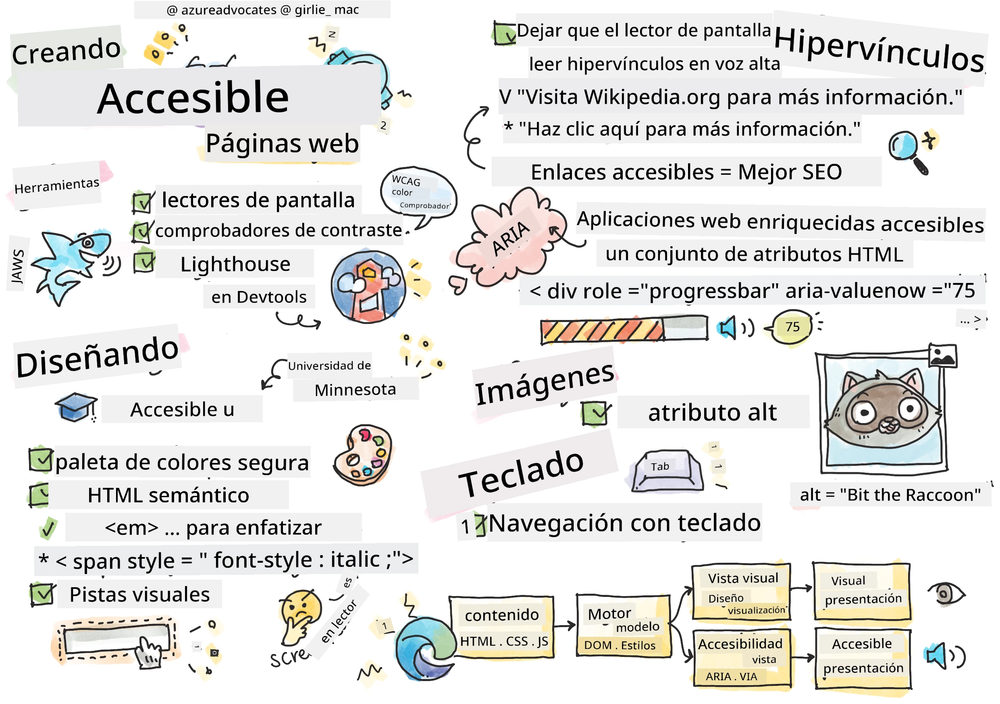
> Sketchnote por [Tomomi Imura](https://twitter.com/girlie_mac)

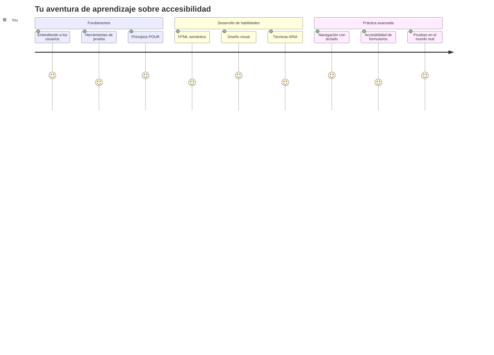
## Cuestionario previo a la clase
[Cuestionario previo a la clase](https://ff-quizzes.netlify.app/web/)

> El poder de la Web está en su universalidad. El acceso para todos, independientemente de la discapacidad, es un aspecto esencial.
>
> \- Sir Timothy Berners-Lee, Director del W3C e inventor de la World Wide Web

Aquí hay algo que podría sorprenderte: cuando construyes sitios web accesibles, no solo ayudas a personas con discapacidades, ¡sino que en realidad mejoras la web para todos!

¿Alguna vez has notado esos rebajes en las esquinas de las calles? Originalmente fueron diseñados para sillas de ruedas, pero ahora ayudan a personas con cochecitos, trabajadores de entregas con carros, viajeros con maletas con ruedas y también a ciclistas. Así es exactamente como funciona el diseño web accesible: soluciones que ayudan a un grupo a menudo terminan beneficiando a todos. ¿Bastante genial, verdad?

En esta lección, exploraremos cómo crear sitios web que realmente funcionen para todos, sin importar cómo naveguen por la web. Descubrirás técnicas prácticas que ya están integradas en los estándares web, practicarás con herramientas de prueba y verás cómo la accesibilidad hace que tus sitios sean más usables para todos los usuarios.

Al final de esta lección, tendrás la confianza para hacer de la accesibilidad una parte natural de tu flujo de trabajo de desarrollo. ¿Listo para explorar cómo las decisiones de diseño reflexivas pueden abrir la web a miles de millones de usuarios? ¡Vamos a sumergirnos!

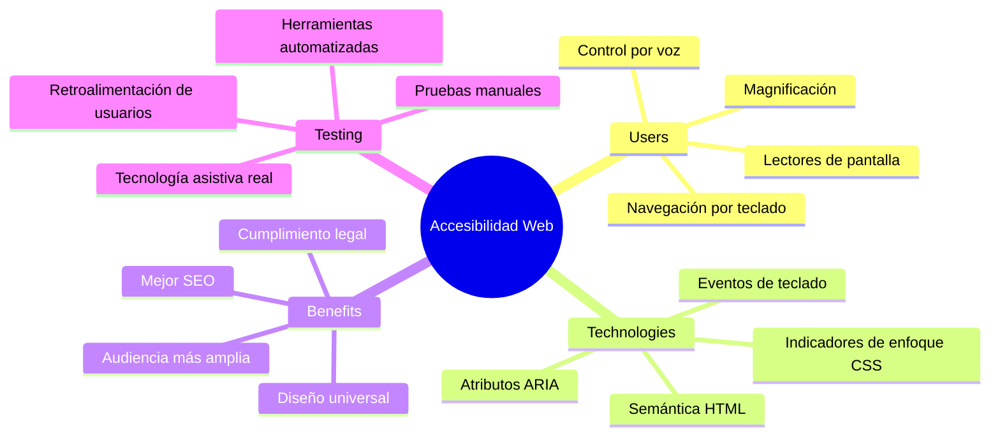
> ¡Puedes tomar esta lección en [Microsoft Learn](https://docs.microsoft.com/learn/modules/web-development-101/accessibility/?WT.mc_id=academic-77807-sagibbon)!

## Comprendiendo las Tecnologías Asistivas

Antes de lanzarnos a codificar, tomemos un momento para entender cómo las personas con diferentes habilidades realmente experimentan la web. Esto no es solo teoría: comprender estos patrones reales de navegación te hará un desarrollador mucho mejor.

Las tecnologías asistivas son herramientas bastante increíbles que ayudan a las personas con discapacidades a interactuar con los sitios web de maneras que podrían sorprenderte. Una vez que entiendes cómo funcionan estas tecnologías, crear experiencias web accesibles se vuelve mucho más intuitivo. Es como aprender a ver tu código a través de los ojos de otra persona.

### Lectores de pantalla

[Los lectores de pantalla](https://en.wikipedia.org/wiki/Screen_reader) son piezas de tecnología bastante sofisticadas que convierten texto digital en salida hablada o braille. Aunque son usados principalmente por personas con discapacidades visuales, también son muy útiles para usuarios con discapacidades de aprendizaje como la dislexia.

Me gusta pensar en un lector de pantalla como tener un narrador muy inteligente que te lee un libro. Lee el contenido en voz alta en un orden lógico, anuncia elementos interactivos como "botón" o "enlace" y proporciona atajos de teclado para saltar por una página. Pero aquí está la cosa: los lectores de pantalla solo pueden hacer su magia si construimos sitios web con estructura adecuada y contenido significativo. ¡Ahí es donde entras tú como desarrollador!

**Lectores de pantalla populares en distintas plataformas:**
- **Windows**: [NVDA](https://www.nvaccess.org/about-nvda/) (gratuito y el más popular), [JAWS](https://webaim.org/articles/jaws/), [Narrador](https://support.microsoft.com/windows/complete-guide-to-narrator-e4397a0d-ef4f-b386-d8ae-c172f109bdb1/?WT.mc_id=academic-77807-sagibbon) (integrado)
- **macOS/iOS**: [VoiceOver](https://support.apple.com/guide/voiceover/welcome/10) (integrado y muy capaz)
- **Android**: [TalkBack](https://support.google.com/accessibility/android/answer/6283677) (integrado)
- **Linux**: [Orca](https://wiki.gnome.org/Projects/Orca) (libre y de código abierto)

**Cómo navegan los lectores de pantalla el contenido web:**

Los lectores de pantalla ofrecen múltiples métodos de navegación que hacen que la exploración sea eficiente para usuarios experimentados:
- **Lectura secuencial**: Lee el contenido de arriba a abajo, como seguir un libro
- **Navegación por puntos de referencia**: Salta entre secciones de la página (encabezado, navegación, principal, pie de página)
- **Navegación por encabezados**: Salta entre encabezados para entender la estructura de la página
- **Listas de enlaces**: Genera una lista de todos los enlaces para acceso rápido
- **Controles de formularios**: Navega directamente entre campos de entrada y botones

> 💡 **Esto me sorprendió mucho**: El 68 % de usuarios de lectores de pantalla navegan principalmente por encabezados ([Encuesta WebAIM](https://webaim.org/projects/screenreadersurvey9/#finding)). Esto significa que tu estructura de encabezados es como un mapa para los usuarios—cuando la haces bien, literalmente ayudas a las personas a orientarse y encontrar contenido más rápido.

### Construyendo tu flujo de trabajo de pruebas

Aquí hay una buena noticia: ¡las pruebas efectivas de accesibilidad no tienen que ser abrumadoras! Querrás combinar herramientas automáticas (son fantásticas para detectar problemas evidentes) con algunas pruebas manuales. Aquí tienes un enfoque sistemático que he encontrado que detecta la mayoría de problemas sin comerse todo tu día:

**Flujo de trabajo esencial para pruebas manuales:**

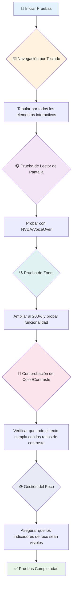
**Lista de verificación paso a paso para pruebas:**
1. **Navegación solo con teclado**: Usa solo Tab, Shift+Tab, Enter, Espacio y teclas de flechas
2. **Prueba con lector de pantalla**: Activa NVDA, VoiceOver o Narrador y navega con los ojos cerrados
3. **Pruebas de zoom**: Prueba en niveles de zoom 200 % y 400 %
4. **Verificación contra contraste de color**: Revisa todos los textos y componentes de la interfaz
5. **Prueba del indicador de enfoque**: Asegúrate que todos los elementos interactivos tengan estados visibles de enfoque

✅ **Comienza con Lighthouse**: Abre las DevTools de tu navegador, realiza una auditoría de accesibilidad con Lighthouse, y usa los resultados para guiar tu enfoque en pruebas manuales.

### Herramientas de zoom y ampliación

¿Sabes cómo a veces haces pellizco para hacer zoom en tu teléfono cuando el texto es muy pequeño, o entrecierras los ojos frente a la pantalla de la laptop a plena luz solar? Muchos usuarios confían en herramientas de ampliación para hacer que el contenido sea legible todos los días. Esto incluye a personas con baja visión, adultos mayores y cualquiera que haya intentado leer un sitio web al aire libre.

Las tecnologías modernas de zoom han evolucionado más allá de solo hacer las cosas más grandes. Entender cómo funcionan estas herramientas te ayudará a crear diseños responsivos que sigan siendo funcionales y atractivos a cualquier nivel de ampliación.

**Capacidades modernas de zoom en navegadores:**
- **Zoom de página**: Escala todo el contenido proporcionalmente (texto, imágenes, diseño) - este es el método preferido
- **Zoom solo en texto**: Aumenta el tamaño de fuente manteniendo el diseño original
- **Pellizcar para hacer zoom**: Soporte con gestos móviles para ampliación temporal
- **Soporte en navegadores**: Todos los navegadores modernos soportan zoom hasta 500 % sin romper funcionalidad

**Software especializado de ampliación:**
- **Windows**: [Lupa](https://support.microsoft.com/windows/use-magnifier-to-make-things-on-the-screen-easier-to-see-414948ba-8b1c-d3bd-8615-0e5e32204198) (integrado), [ZoomText](https://www.freedomscientific.com/training/zoomtext/getting-started/)
- **macOS/iOS**: [Zoom](https://www.apple.com/accessibility/mac/vision/) (integrado con funciones avanzadas)

> ⚠️ **Consideración de diseño**: WCAG exige que el contenido siga siendo funcional con zoom al 200%. En este nivel, el desplazamiento horizontal debe ser mínimo y todos los elementos interactivos deben seguir siendo accesibles.

✅ **Prueba tu diseño responsivo**: Haz zoom en tu navegador a 200 % y 400 %. ¿Tu diseño se adapta con elegancia? ¿Puedes acceder a toda la funcionalidad sin desplazamientos excesivos?

## Herramientas modernas para pruebas de accesibilidad

Ahora que entiendes cómo las personas navegan por la web con tecnologías asistivas, exploremos las herramientas que te ayudan a construir y probar sitios web accesibles.

Piénsalo así: las herramientas automáticas son geniales para detectar problemas obvios (como texto alternativo faltante), mientras que las pruebas manuales te ayudan a asegurar que tu sitio se sienta bien en el uso real. Juntas, te dan confianza de que tus sitios funcionan para todos.

### Prueba de contraste de color

Aquí una buena noticia: el contraste de color es uno de los problemas de accesibilidad más comunes, pero también uno de los más fáciles de solucionar. Un buen contraste beneficia a todos: desde usuarios con discapacidades visuales hasta personas que intentan leer sus teléfonos en la playa.

**Requisitos de contraste según WCAG:**

| Tipo de texto | WCAG AA (Mínimo) | WCAG AAA (Mejorado) |
|---------------|------------------|---------------------|
| **Texto normal** (menor a 18pt) | Ratio de contraste 4.5:1 | Ratio de contraste 7:1 |
| **Texto grande** (18pt+ o 14pt+ en negrita) | Ratio de contraste 3:1 | Ratio de contraste 4.5:1 |
| **Componentes de UI** (botones, bordes de formularios) | Ratio de contraste 3:1 | Ratio de contraste 3:1 |

**Herramientas esenciales para pruebas:**
- [Colour Contrast Analyser](https://www.tpgi.com/color-contrast-checker/) - App de escritorio con selector de color
- [WebAIM Contrast Checker](https://webaim.org/resources/contrastchecker/) - Basado en web con retroalimentación instantánea
- [Stark](https://www.getstark.co/) - Plugin para herramientas de diseño Figma, Sketch, Adobe XD
- [Accessible Colors](https://accessible-colors.com/) - Encuentra paletas de colores accesibles

✅ **Crea mejores paletas de colores**: Comienza con los colores de tu marca y usa verificadores de contraste para crear variaciones accesibles. Documenta estas como los tokens de color accesibles de tu sistema de diseño.

### Auditorías comprensivas de accesibilidad

La prueba de accesibilidad más efectiva combina múltiples enfoques. Ninguna herramienta sola detecta todo, así que crear una rutina de pruebas con varios métodos asegura una cobertura completa.

**Pruebas basadas en navegador (integradas en DevTools):**
- **Chrome/Edge**: Auditoría de accesibilidad con Lighthouse + Panel de accesibilidad
- **Firefox**: Inspector de accesibilidad con vista detallada del árbol
- **Safari**: Pestaña de auditoría en Web Inspector con simulación de VoiceOver

**Extensiones profesionales para pruebas:**
- [axe DevTools](https://www.deque.com/axe/devtools/) - Pruebas automatizadas estándar en la industria
- [WAVE](https://wave.webaim.org/extension/) - Retroalimentación visual con resaltado de errores
- [Accessibility Insights](https://accessibilityinsights.io/) - Suite completa de pruebas de Microsoft

**Integración en línea de comandos y CI/CD:**
- [axe-core](https://github.com/dequelabs/axe-core) - Biblioteca JavaScript para pruebas automatizadas
- [Pa11y](https://pa11y.org/) - Herramienta de pruebas de accesibilidad en línea de comandos
- [Lighthouse CI](https://github.com/GoogleChrome/lighthouse-ci) - Puntuación automática de accesibilidad

> 🎯 **Meta de pruebas**: Apunta a una puntuación de accesibilidad de Lighthouse de 95+ como línea base. Recuerda, las herramientas automáticas solo detectan cerca del 30-40 % de los problemas de accesibilidad—las pruebas manuales siguen siendo esenciales.

### 🧠 **Chequeo de habilidades en pruebas: ¿Listo para encontrar problemas?**

**Veamos cómo te sientes respecto a las pruebas de accesibilidad:**
- ¿Qué método de prueba te parece más accesible ahora mismo?
- ¿Puedes imaginarte navegando solo con teclado durante un día completo?
- ¿Cuál es una barrera de accesibilidad que hayas experimentado personalmente en línea?

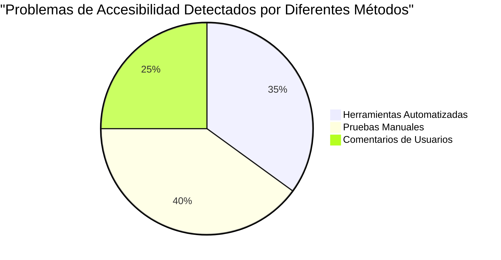
> **Refuerzo de confianza**: Los testers profesionales de accesibilidad usan esta misma combinación de métodos. ¡Estás aprendiendo prácticas estándar de la industria!

## Construyendo la accesibilidad desde cero

La clave del éxito en accesibilidad es integrarla desde el principio, desde el primer día. Sé que es tentador pensar "añadiré accesibilidad después," pero eso es como intentar agregar una rampa a una casa ya construida. ¿Posible? Sí. ¿Fácil? No realmente.

Piensa en la accesibilidad como planear una casa: es mucho más fácil incluir accesibilidad para silla de ruedas en tus planes arquitectónicos iniciales que hacer una adaptación después.

### Los principios POUR: tu base de accesibilidad

Las Pautas de Accesibilidad para el Contenido Web (WCAG) están construidas alrededor de cuatro principios fundamentales que forman la palabra POUR. No te preocupes—¡no son conceptos académicos aburridos! Son guías prácticas para hacer contenido que funcione para todos.

Una vez que comprendes POUR, tomar decisiones de accesibilidad se vuelve mucho más intuitivo. Es como tener una lista mental que guía tus elecciones de diseño. Vamos a desglosarlo:

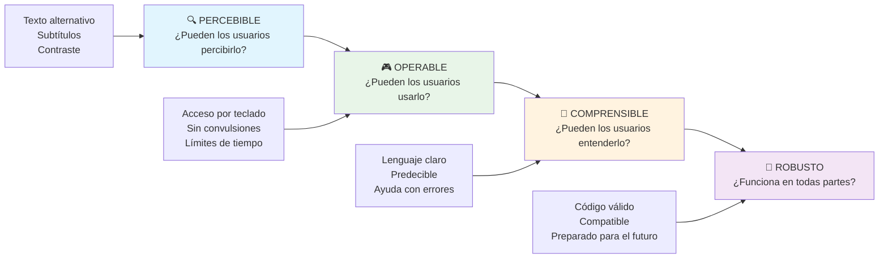
**🔍 Percibible**: La información debe ser presentable de maneras en que los usuarios puedan percibirla a través de sus sentidos disponibles

- Proporciona alternativas de texto para contenido no textual (imágenes, videos, audio)
- Asegura suficiente contraste de color para todo texto y componentes de interfaz
- Ofrece subtítulos y transcripciones para contenido multimedia
- Diseña contenido que siga siendo funcional al redimensionar hasta el 200%
- Usa múltiples características sensoriales (no solo color) para transmitir información

**🎮 Operable**: Todos los componentes de la interfaz deben ser operables mediante los métodos de entrada disponibles

- Haz que toda la funcionalidad sea accesible mediante navegación con teclado
- Proporciona a los usuarios tiempo suficiente para leer e interactuar con el contenido
- Evita contenido que cause convulsiones o trastornos vestibulares
- Ayuda a los usuarios a navegar eficientemente con estructura clara y puntos de referencia
- Asegura que los elementos interactivos tengan tamaños adecuados para ser seleccionados (mínimo 44px)

**📖 Comprensible**: La información y la operación de la interfaz deben ser claras y comprensibles

- Usa lenguaje claro y simple adecuado para tu audiencia
- Asegura que el contenido aparezca y funcione de manera predecible y consistente
- Proporciona instrucciones claras y mensajes de error para entradas del usuario
- Ayuda a los usuarios a entender y corregir errores en formularios
- Organiza el contenido con un orden de lectura lógico y jerarquía informativa

**💪 Robusto**: El contenido debe funcionar confiablemente con distintas tecnologías y dispositivos asistivos

- **Usa HTML válido y semántico como base**
- **Asegura compatibilidad con tecnologías asistivas actuales y futuras**
- **Sigue estándares web y buenas prácticas para el marcado**
- **Prueba en diferentes navegadores, dispositivos y herramientas asistivas**
- **Estructura el contenido para que degrade de manera adecuada cuando las funciones avanzadas no estén soportadas**

### 🎯 **Revisión de los principios POUR: Haciendo que perdure**

**Reflexión rápida sobre los fundamentos:**
- ¿Puedes pensar en una característica de un sitio web que falle en cada principio POUR?
- ¿Cuál principio te resulta más natural como desarrollador?
- ¿Cómo podrían estos principios mejorar el diseño para todos, no solo para usuarios con discapacidad?

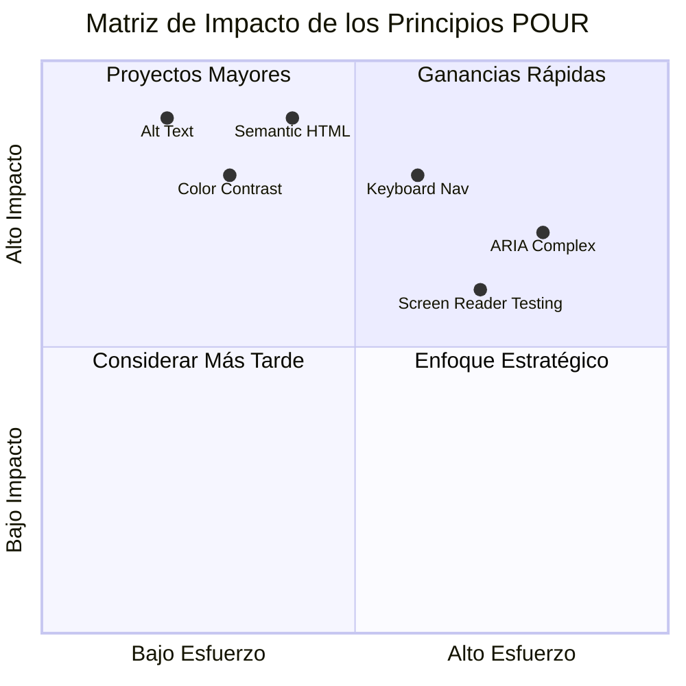
> **Recuerda**: Empieza con mejoras de alto impacto y bajo esfuerzo. ¡HTML semántico y texto alternativo te brindan el mayor impulso en accesibilidad con el menor esfuerzo!

## Creando Diseño Visual Accesible

El buen diseño visual y la accesibilidad van de la mano. Cuando diseñas pensando en la accesibilidad, a menudo descubres que estas restricciones conducen a soluciones más limpias y elegantes que benefician a todos los usuarios.

Exploremos cómo crear diseños visualmente atractivos que funcionen para todos, independientemente de sus habilidades visuales o las condiciones en las que estén viendo tu contenido.

### Estrategias de color y accesibilidad visual

El color es poderoso para la comunicación, pero nunca debería ser la única forma en que transmites información importante. Diseñar más allá del color crea experiencias más sólidas e inclusivas que funcionan en más situaciones.

**Diseña para diferencias en la visión del color:**

Aproximadamente el 8% de los hombres y el 0.5% de las mujeres tienen alguna forma de diferencia en la visión del color (a menudo llamada "daltonismo"). Los tipos más comunes son:
- **Deuteranopía**: Dificultad para distinguir rojo y verde
- **Protanopía**: El rojo parece más tenue
- **Tritanopía**: Dificultad con azul y amarillo (raro)

**Estrategias de color inclusivas:**

```css
/* ❌ Bad: Using only color to indicate status */
.error { color: red; }
.success { color: green; }

/* ✅ Good: Color plus icons and context */
.error {
  color: #d32f2f;
  border-left: 4px solid #d32f2f;
}
.error::before {
  content: "⚠️";
  margin-right: 8px;
}

.success {
  color: #2e7d32;
  border-left: 4px solid #2e7d32;
}
.success::before {
  content: "✅";
  margin-right: 8px;
}
```

**Más allá de los requisitos básicos de contraste:**
- Prueba tus combinaciones de color con simuladores para daltónicos
- Usa patrones, texturas o formas junto con el código de colores
- Asegúrate de que los estados interactivos sean distinguibles sin color
- Considera cómo se ve tu diseño en modo alto contraste

✅ **Prueba la accesibilidad del color**: Usa herramientas como [Coblis](https://www.color-blindness.com/coblis-color-blindness-simulator/) para ver cómo aparece tu sitio a usuarios con diferentes tipos de visión del color.

### Indicadores de enfoque y diseño de interacción

Los indicadores de enfoque son el equivalente digital del cursor: muestran a los usuarios que usan teclado dónde están en la página. Los indicadores de enfoque bien diseñados mejoran la experiencia para todos al hacer las interacciones claras y predecibles.

**Mejores prácticas modernas para indicadores de enfoque:**

```css
/* Enhanced focus styles that work across browsers */
button:focus-visible {
  outline: 2px solid #0066cc;
  outline-offset: 2px;
  box-shadow: 0 0 0 4px rgba(0, 102, 204, 0.25);
}

/* Remove focus outline for mouse users, preserve for keyboard users */
button:focus:not(:focus-visible) {
  outline: none;
}

/* Focus-within for complex components */
.card:focus-within {
  box-shadow: 0 0 0 3px rgba(74, 144, 164, 0.5);
  border-color: #4A90A4;
}

/* Ensure focus indicators meet contrast requirements */
.custom-focus:focus-visible {
  outline: 3px solid #ffffff;
  outline-offset: 2px;
  box-shadow: 0 0 0 6px #000000;
}
```

**Requisitos de indicadores de enfoque:**
- **Visibilidad**: Deben tener al menos una relación de contraste 3:1 con los elementos circundantes
- **Ancho**: Grosor mínimo de 2px alrededor de todo el elemento
- **Persistencia**: Deben permanecer visibles hasta que el enfoque se mueva a otro lugar
- **Distinción**: Deben ser visualmente diferentes de otros estados de UI

> 💡 **Consejo de diseño**: Los buenos indicadores de enfoque suelen usar una combinación de contorno, sombra y cambios de color para garantizar visibilidad sobre diferentes fondos y contextos.

✅ **Audita tus indicadores de enfoque**: Navega usando Tab por tu sitio y anota qué elementos tienen indicadores de enfoque claros. ¿Alguno es difícil de ver o falta por completo?

### HTML semántico: La base de la accesibilidad

El HTML semántico es como darle a las tecnologías asistivas un sistema GPS para tu sitio web. Cuando usas los elementos HTML correctos para su propósito, básicamente proporcionas a los lectores de pantalla, teclados y otras herramientas un mapa detallado para ayudar a los usuarios a navegar eficazmente.

Aquí tienes una analogía que realmente me ayudó: el HTML semántico es la diferencia entre una biblioteca bien organizada con categorías claras y señales útiles versus un almacén donde los libros están esparcidos al azar. Ambos lugares tienen los mismos libros, pero ¿en cuál preferirías intentar buscar algo? ¡Exacto!

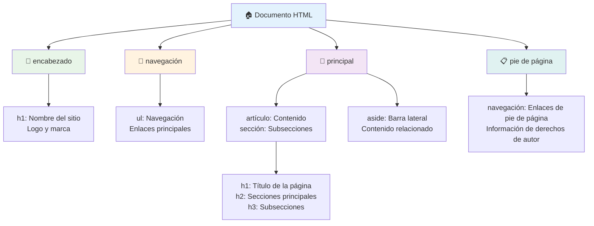
**Bloques de construcción de la estructura accesible de la página:**

```html
<!-- Landmark elements provide page navigation structure -->
<header>
  <h1>Your Site Name</h1>
  <nav aria-label="Main navigation">
    <ul>
      <li><a href="/home">Home</a></li>
      <li><a href="/about">About</a></li>
      <li><a href="/services">Services</a></li>
    </ul>
  </nav>
</header>

<main>
  <article>
    <header>
      <h1>Article Title</h1>
      <p>Published on <time datetime="2024-10-14">October 14, 2024</time></p>
    </header>
    
    <section>
      <h2>First Section</h2>
      <p>Content that relates to this section...</p>
    </section>
    
    <section>
      <h2>Second Section</h2>
      <p>More related content...</p>
    </section>
  </article>
  
  <aside>
    <h2>Related Links</h2>
    <nav aria-label="Related articles">
      <ul>
        <li><a href="/related-1">First related article</a></li>
        <li><a href="/related-2">Second related article</a></li>
      </ul>
    </nav>
  </aside>
</main>

<footer>
  <p>&copy; 2024 Your Site Name. All rights reserved.</p>
  <nav aria-label="Footer links">
    <ul>
      <li><a href="/privacy">Privacy Policy</a></li>
      <li><a href="/contact">Contact Us</a></li>
    </ul>
  </nav>
</footer>
```

**Por qué el HTML semántico transforma la accesibilidad:**

| Elemento Semántico | Propósito | Beneficio para lectores de pantalla |
|--------------------|-----------|------------------------------------|
| `<header>` | Encabezado de página o sección | "Marcador de banner" - navegación rápida al inicio |
| `<nav>` | Enlaces de navegación | "Marcador de navegación" - lista de secciones de nav |
| `<main>` | Contenido principal de la página | "Marcador principal" - salto directo al contenido |
| `<article>` | Contenido autónomo | Anuncia los límites del artículo |
| `<section>` | Grupos de contenido temático | Proporciona estructura al contenido |
| `<aside>` | Contenido relacionado en barra lateral | "Marcador complementario" |
| `<footer>` | Pie de página o sección | "Marcador de información de contenido" |

**Superpoderes de los lectores de pantalla con HTML semántico:**
- **Navegación por marcadores**: Salta entre secciones principales de la página al instante
- **Esquemas de encabezados**: Genera un índice a partir de la estructura de encabezados
- **Listas de elementos**: Crea listas de todos los enlaces, botones o controles de formulario
- **Conciencia de contexto**: Entiende las relaciones entre las secciones de contenido

> 🎯 **Prueba rápida**: Trata de navegar tu sitio con un lector de pantalla usando atajos de marcador (D para marcador, H para encabezado, K para enlace en NVDA/JAWS). ¿Tiene sentido la navegación?

### 🏗️ **Revisión de maestría en HTML semántico: Construyendo bases sólidas**

**Evaluemos tu comprensión semántica:**
- ¿Puedes identificar los marcadores en una página web solo mirando el HTML?
- ¿Cómo explicarías la diferencia entre `<section>` y `<div>` a un amigo?
- ¿Qué sería lo primero que revisarías si un usuario de lector de pantalla reportara problemas de navegación?

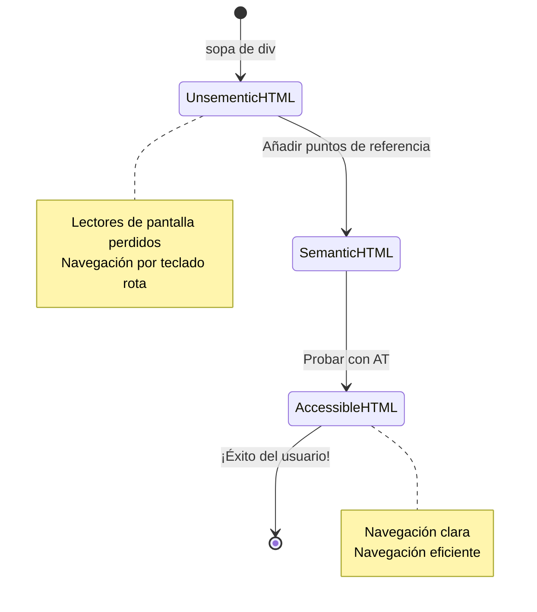
> **Consejo profesional**: Un buen HTML semántico resuelve aproximadamente el 70% de los problemas de accesibilidad automáticamente. ¡Domina esta base y vas por buen camino!

✅ **Audita tu estructura semántica**: Usa el panel de Accesibilidad en las DevTools de tu navegador para ver el árbol de accesibilidad y asegurarte de que tu marcado crea una estructura lógica.

### Jerarquía de encabezados: Creando un esquema lógico de contenido

Los encabezados son absolutamente cruciales para contenido accesible; son como la columna vertebral que sostiene todo. Los usuarios de lectores de pantalla dependen mucho de los encabezados para entender y navegar tu contenido. Piensa en ello como proporcionar un índice para tu página.

**Aquí está la regla de oro para los encabezados:**
Nunca saltes niveles. Siempre avanza lógicamente de `<h1>` a `<h2>` a `<h3>`, y así sucesivamente. ¿Recuerdas hacer esquemas en la escuela? Es exactamente el mismo principio: no saltarías de "I. Punto principal" directamente a "C. Sub-subpunto" sin un "A. Subpunto" en medio, ¿verdad?

**Ejemplo de estructura perfecta de encabezados:**

```html
<!-- ✅ Excellent: Logical, hierarchical progression -->
<main>
  <h1>Complete Guide to Web Accessibility</h1>
  
  <section>
    <h2>Understanding Screen Readers</h2>
    <p>Introduction to screen reader technology...</p>
    
    <h3>Popular Screen Reader Software</h3>
    <p>NVDA, JAWS, and VoiceOver comparison...</p>
    
    <h3>Testing with Screen Readers</h3>
    <p>Step-by-step testing instructions...</p>
  </section>
  
  <section>
    <h2>Color and Contrast Guidelines</h2>
    <p>Designing with sufficient contrast...</p>
    
    <h3>WCAG Contrast Requirements</h3>
    <p>Understanding the different contrast levels...</p>
    
    <h3>Testing Tools and Techniques</h3>
    <p>Tools for verifying contrast ratios...</p>
  </section>
</main>
```

```html
<!-- ❌ Problematic: Skipping levels, inconsistent structure -->
<h1>Page Title</h1>
<h3>Subsection</h3> <!-- Skipped h2 -->
<h2>This should come before h3</h2>
<h1>Another main heading?</h1> <!-- Multiple h1s -->
```

**Buenas prácticas para encabezados:**
- **Un `<h1>` por página**: Usualmente el título principal o encabezado del contenido principal
- **Progresión lógica**: Nunca saltes niveles (h1 → h2 → h3, no h1 → h3)
- **Contenido descriptivo**: Haz que los encabezados sean significativos incluso cuando se lean fuera de contexto
- **Estilo visual con CSS**: Usa CSS para la apariencia, niveles HTML para la estructura

**Estadísticas de navegación con lectores de pantalla:**
- El 68% de usuarios de lectores de pantalla navegan por encabezados ([Encuesta WebAIM](https://webaim.org/projects/screenreadersurvey9/#finding))
- Los usuarios esperan encontrar un esquema lógico de encabezados
- Los encabezados ofrecen la forma más rápida de entender la estructura de la página

> 💡 **Consejo profesional**: Usa extensiones de navegador como "HeadingsMap" para visualizar la estructura de tus encabezados. Debería leerse como un índice bien organizado.

✅ **Prueba la estructura de encabezados**: Usa la navegación por encabezados de un lector de pantalla (tecla H en NVDA) para recorrer tus encabezados. ¿La progresión cuenta la historia de tu contenido lógicamente?

### Técnicas avanzadas de accesibilidad visual

Más allá de lo básico de contraste y color, existen técnicas sofisticadas que ayudan a crear experiencias visuales realmente inclusivas. Estos métodos aseguran que tu contenido funcione en diferentes condiciones de visualización y tecnologías asistivas.

**Estrategias esenciales de comunicación visual:**

- **Retroalimentación multimodal**: Combina señales visuales, textuales y a veces auditivas
- **Divulgación progresiva**: Presenta la información en porciones digeribles
- **Patrones consistentes de interacción**: Usa convenciones de UI familiares
- **Tipografía responsiva**: Ajusta el tamaño del texto apropiadamente en distintos dispositivos
- **Estados de carga y error**: Proporciona retroalimentación clara para todas las acciones del usuario

**Utilidades CSS para mejorar la accesibilidad:**

```css
/* Screen reader only text - visually hidden but accessible */
.sr-only {
  position: absolute;
  width: 1px;
  height: 1px;
  padding: 0;
  margin: -1px;
  overflow: hidden;
  clip: rect(0, 0, 0, 0);
  white-space: nowrap;
  border: 0;
}

/* Skip link for keyboard navigation */
.skip-link {
  position: absolute;
  top: -40px;
  left: 6px;
  background: #000000;
  color: #ffffff;
  padding: 8px 16px;
  text-decoration: none;
  border-radius: 4px;
  font-weight: bold;
  transition: top 0.3s ease;
  z-index: 1000;
}

.skip-link:focus {
  top: 6px;
}

/* Reduced motion respect */
@media (prefers-reduced-motion: reduce) {
  .skip-link {
    transition: none;
  }
  
  * {
    animation-duration: 0.01ms !important;
    animation-iteration-count: 1 !important;
    transition-duration: 0.01ms !important;
  }
}

/* High contrast mode support */
@media (prefers-contrast: high) {
  .button {
    border: 2px solid;
  }
}
```

> 🎯 **Patrón de accesibilidad**: El "enlace de salto" es esencial para usuarios de teclado. Debe ser el primer elemento enfocable en tu página y saltar directamente al área principal de contenido.

✅ **Implementa navegación de salto**: Añade enlaces de salto a tus páginas y pruébalos presionando Tab apenas carga la página. Deben aparecer y permitirte saltar al contenido principal.

## Crear Texto de Enlace Significativo

Los enlaces son básicamente las autopistas de la web, pero un texto de enlace mal escrito es como tener señales que solo dicen "Lugar" en lugar de "Centro de Chicago". No muy útil, ¿verdad?

Aquí hay algo que me sorprendió cuando lo aprendí: los lectores de pantalla pueden extraer todos los enlaces de una página y mostrarlos como una gran lista. Imagina que alguien te diera un directorio de cada enlace en tu página. ¿Tendría sentido cada uno por sí solo? ¡Esa es la prueba que tu texto de enlace debe pasar!

### Entender patrones de navegación de enlaces

Los lectores de pantalla ofrecen potentes funciones de navegación por enlaces que dependen de un texto de enlace bien escrito:

**Métodos para la navegación de enlaces:**
- **Lectura secuencial**: Los enlaces se leen en contexto como parte del flujo del contenido
- **Generación de lista de enlaces**: Todos los enlaces de la página compilados en un directorio buscable
- **Navegación rápida**: Salta entre enlaces usando atajos de teclado (K en NVDA)
- **Funcionalidad de búsqueda**: Encuentra enlaces específicos escribiendo texto parcial

**Por qué el contexto importa:**
Cuando los usuarios de lectores de pantalla generan una lista de enlaces, ven algo así:
- "Descargar informe"
- "Saber más"
- "Haz clic aquí"
- "Política de privacidad"
- "Haz clic aquí"

¡Solo dos de estos enlaces proporcionan información útil cuando se leen fuera de contexto!

> 📊 **Impacto en el usuario**: Los usuarios de lectores de pantalla escanean listas de enlaces para entender el contenido rápido. El texto de enlace genérico los obliga a volver a navegar el contexto de cada enlace, ralentizando significativamente su experiencia de navegación.

### Errores comunes en texto de enlace que debes evitar

Entender lo que no funciona te ayuda a reconocer y corregir problemas de accesibilidad en contenido existente.

**❌ Texto genérico en enlaces que no da contexto:**

```html
<!-- Meaningless when read from a link list -->
<p>Our sustainability efforts are detailed in our recent report. 
   <a href="/sustainability-2024.pdf">Click here</a> to view it.</p>

<!-- Repeated generic text throughout the page -->
<div class="article-card">
  <h3>Web Accessibility Guide</h3>
  <p>Learn the fundamentals...</p>
  <a href="/accessibility-guide">Read more</a>
</div>
<div class="article-card">
  <h3>Color Contrast Tips</h3>
  <p>Improve your design...</p>
  <a href="/color-contrast">Read more</a>
</div>

<!-- URLs as link text (difficult for screen readers to announce) -->
<p>Visit https://www.w3.org/WAI/WCAG21/quickref/ for WCAG guidelines.</p>

<!-- Vague action words -->
<a href="/contact">Go</a> | <a href="/about">See</a> | <a href="/help">View</a>
```

**Por qué fallan estos patrones:**
- **"Haz clic aquí"** no dice nada sobre el destino
- **"Leer más"** repetido muchas veces genera confusión
- **URLs puro** son difíciles para que los lectores de pantalla las pronuncien claramente
- **Palabras únicas** como "Ir" o "Ver" carecen de contexto descriptivo

### Escribir texto de enlace excelente

El texto de enlace descriptivo beneficia a todos: los usuarios con visión pueden escanear rápidamente enlaces, y los usuarios de lectores de pantalla entienden los destinos de inmediato.

**✅ Ejemplos claros y descriptivos de texto de enlace:**

```html
<!-- Descriptive text that explains the destination -->
<p>Our comprehensive <a href="/sustainability-2024.pdf">2024 sustainability report (PDF, 2.1MB)</a> details our environmental initiatives.</p>

<!-- Specific, unique link text for each card -->
<div class="article-card">
  <h3>Web Accessibility Guide</h3>
  <p>Learn the fundamentals of inclusive design...</p>
  <a href="/accessibility-guide">Read our complete web accessibility guide</a>
</div>
<div class="article-card">
  <h3>Color Contrast Tips</h3>
  <p>Improve your design with better color choices...</p>
  <a href="/color-contrast">Explore color contrast best practices</a>
</div>

<!-- Meaningful text instead of raw URLs -->
<p>The <a href="https://www.w3.org/WAI/WCAG21/quickref/">WCAG 2.1 Quick Reference guide</a> provides comprehensive accessibility guidelines.</p>

<!-- Descriptive action links -->
<a href="/contact">Contact our support team</a> | 
<a href="/about">About our company</a> | 
<a href="/help">Get help with your account</a>
```

**Buenas prácticas para texto de enlace:**
- **Sé específico**: "Descargar el informe financiero trimestral" vs. "Descargar"
- **Incluye tipo y tamaño de archivo**: "(PDF, 1.2MB)" para archivos descargables
- **Menciona si los enlaces abren externo**: "(se abre en una nueva ventana)" cuando corresponda
- **Usa lenguaje activo**: "Contáctanos" vs. "Página de contacto"
- **Sé conciso**: Apunta a 2-8 palabras cuando sea posible

### Patrones avanzados de accesibilidad para enlaces

A veces las restricciones de diseño visual o requisitos técnicos necesitan soluciones especiales. Aquí técnicas sofisticadas para escenarios comunes desafiantes:

**Uso de ARIA para contexto mejorado:**

```html
<!-- When button text must be short but needs more context -->
<a href="/report.pdf" 
   aria-label="Download 2024 annual financial report, PDF format, 2.3MB">
  Download Report
</a>

<!-- When the full context comes from surrounding content -->
<h3 id="sustainability-heading">Sustainability Initiative</h3>
<p>Our efforts to reduce environmental impact...</p>
<a href="/sustainability-details" 
   aria-labelledby="sustainability-heading"
   aria-describedby="sustainability-summary">
  Learn more
</a>
<p id="sustainability-summary">Detailed breakdown of our 2024 environmental goals and achievements</p>
```

**Indicando tipos de archivo y destinos externos:**

```html
<!-- Method 1: Include information in visible link text -->
<a href="/annual-report.pdf">
  Download our 2024 annual report (PDF, 2.3MB)
</a>

<!-- Method 2: Use screen reader-only text for file details -->
<a href="/annual-report.pdf">
  Download our 2024 annual report
  <span class="sr-only">(PDF format, 2.3MB)</span>
</a>

<!-- Method 3: External link indication -->
<a href="https://example.com" 
   target="_blank" 
   aria-describedby="external-link-warning">
  Visit external resource
</a>
<span id="external-link-warning" class="sr-only">
  (opens in new window)
</span>

<!-- Method 4: Using CSS for visual indicators -->
<a href="https://example.com" class="external-link">
  External resource
</a>
```

```css
/* Visual indicator for external links */
.external-link::after {
  content: " ↗";
  font-size: 0.8em;
  color: #666;
}

/* Screen reader announcement for external links */
.external-link::before {
  content: "External link: ";
  position: absolute;
  left: -10000px;
  width: 1px;
  height: 1px;
  overflow: hidden;
}
```

> ⚠️ **Importante**: Cuando uses `target="_blank"`, siempre informa a los usuarios que el enlace abre en una ventana o pestaña nueva. Cambios inesperados en la navegación pueden ser desorientadores.

✅ **Prueba el contexto de tus enlaces**: Usa las herramientas de desarrollo de tu navegador para generar una lista de todos los enlaces en tu página. ¿Puedes entender el propósito de cada enlace sin ningún contexto alrededor?

## ARIA: Potenciando la accesibilidad HTML

[Aplicaciones enriquecidas accesibles (ARIA)](https://developer.mozilla.org/docs/Web/Accessibility/ARIA) son como tener un traductor universal entre tus complejas aplicaciones web y las tecnologías asistivas. Cuando el HTML solo no puede expresar todo lo que hacen tus componentes interactivos, ARIA interviene para llenar esos vacíos.

Me gusta pensar en ARIA como agregar anotaciones útiles a tu HTML, algo así como indicaciones escénicas en un guion teatral que ayudan a los actores a entender sus roles y relaciones.

**La regla más importante sobre ARIA es**: Usa siempre primero HTML semántico y luego añade ARIA para mejorarlo. Piensa en ARIA como un condimento, no como el plato principal. Debe clarificar y mejorar tu estructura HTML, nunca reemplazarla. ¡Domina primero esa base!

### Implementación estratégica de ARIA

ARIA es poderoso, pero con poder viene responsabilidad. Un ARIA incorrecto puede empeorar la accesibilidad más que no usar ARIA. Aquí cuándo y cómo usarlo eficazmente:

**✅ Usa ARIA cuando:**
- Crees widgets interactivos personalizados (acordeones, pestañas, carruseles)
- Construyes contenido dinámico que cambia sin recargar la página
- Proporcionas contexto adicional para relaciones complejas de UI
- Indicas estados de carga o actualizaciones en vivo de contenido
- Creas interfaces tipo app con controles personalizados

**❌ Evita ARIA cuando:**
- Los elementos HTML estándar ya proporcionan la semántica necesaria
- No estás seguro de cómo implementarlo correctamente
- Duplica información ya proporcionada por HTML semántico
- No lo has probado con tecnología asistiva real

> 🎯 **Regla de oro de ARIA**: "No cambies la semántica a menos que sea absolutamente necesario, garantiza siempre accesibilidad por teclado y prueba con tecnología asistiva real."
**Las cinco categorías de ARIA:**

1. **Roles**: ¿Qué es este elemento? (`button`, `tab`, `dialog`)
2. **Propiedades**: ¿Cuáles son sus características? (`aria-required`, `aria-haspopup`)
3. **Estados**: ¿Cuál es su condición actual? (`aria-expanded`, `aria-checked`)
4. **Puntos de referencia**: ¿Dónde está en la estructura de la página? (`banner`, `navigation`, `main`)
5. **Regiones en vivo**: ¿Cómo deben anunciarse los cambios? (`aria-live`, `aria-atomic`)

### Patrones esenciales de ARIA para aplicaciones web modernas

Estos patrones resuelven los desafíos de accesibilidad más comunes en aplicaciones web interactivas:

**Nombrar y describir elementos:**

```html
<!-- aria-label: Provides accessible name when visible text isn't sufficient -->
<button aria-label="Close newsletter subscription dialog">×</button>

<!-- aria-labelledby: References existing text as the accessible name -->
<section aria-labelledby="news-heading">
  <h2 id="news-heading">Latest News</h2>
  <!-- news content -->
</section>

<!-- aria-describedby: Links to additional descriptive text -->
<input type="password" 
       aria-describedby="pwd-requirements pwd-strength"
       required>
<div id="pwd-requirements">
  Password must contain at least 8 characters, including uppercase, lowercase, and numbers.
</div>
<div id="pwd-strength" aria-live="polite">
  <!-- Dynamic password strength indicator -->
</div>
```

**Regiones en vivo para contenido dinámico:**

```html
<!-- Polite announcements (don't interrupt current speech) -->
<div aria-live="polite" id="status-updates">
  <!-- Status messages appear here -->
</div>

<!-- Assertive announcements (interrupt and announce immediately) -->
<div aria-live="assertive" id="urgent-alerts">
  <!-- Error messages and critical alerts -->
</div>

<!-- Loading states with live regions -->
<button id="submit-btn" aria-describedby="loading-status">
  Submit Application
</button>
<div id="loading-status" aria-live="polite" aria-atomic="true">
  <!-- "Processing your application..." appears here -->
</div>
```

**Ejemplo de widget interactivo (acordeón):**

```html
<div class="accordion">
  <h3>
    <button aria-expanded="false" 
            aria-controls="panel-1" 
            id="accordion-trigger-1"
            class="accordion-trigger">
      Accessibility Guidelines
    </button>
  </h3>
  <div id="panel-1" 
       role="region"
       aria-labelledby="accordion-trigger-1" 
       hidden>
    <p>WCAG 2.1 provides comprehensive guidelines...</p>
  </div>
</div>
```

```javascript
// JavaScript para gestionar el estado del acordeón
function toggleAccordion(trigger) {
  const panel = document.getElementById(trigger.getAttribute('aria-controls'));
  const isExpanded = trigger.getAttribute('aria-expanded') === 'true';
  
  // Alternar estados
  trigger.setAttribute('aria-expanded', !isExpanded);
  panel.hidden = isExpanded;
  
  // Anunciar cambio a lectores de pantalla
  const status = document.getElementById('status-updates');
  status.textContent = isExpanded ? 'Section collapsed' : 'Section expanded';
}
```

### Mejores prácticas para la implementación de ARIA

ARIA es poderoso pero requiere una implementación cuidadosa. Seguir estas pautas ayuda a garantizar que tu ARIA mejore y no entorpezca la accesibilidad:

**🛡️ Principios básicos:**

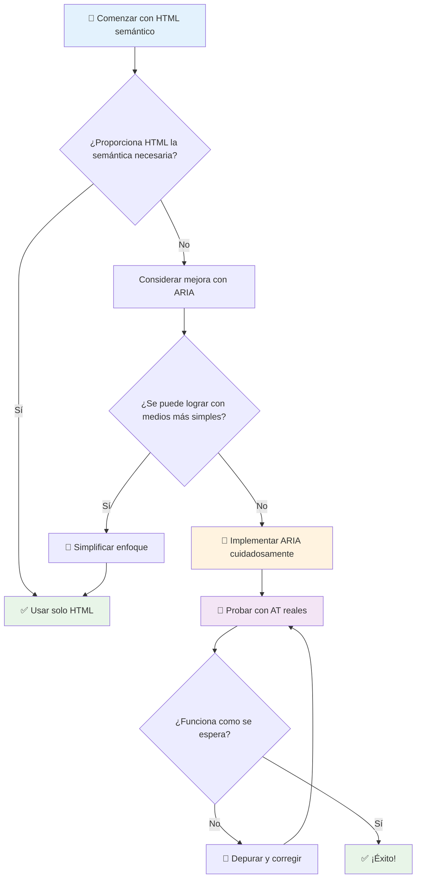
1. **HTML semántico primero**: Siempre prefiere `<button>` sobre `<div role="button">`
2. **No romper la semántica**: Nunca sobrescribas el significado existente de HTML (evita `<h1 role="button">`)
3. **Mantén la accesibilidad por teclado**: Todos los elementos interactivos ARIA deben ser completamente accesibles con teclado
4. **Prueba con usuarios reales**: El soporte ARIA varía significativamente entre tecnologías de asistencia
5. **Empieza simple**: Las implementaciones complejas de ARIA tienen más probabilidades de errores

**🔍 Flujo de trabajo de pruebas:**

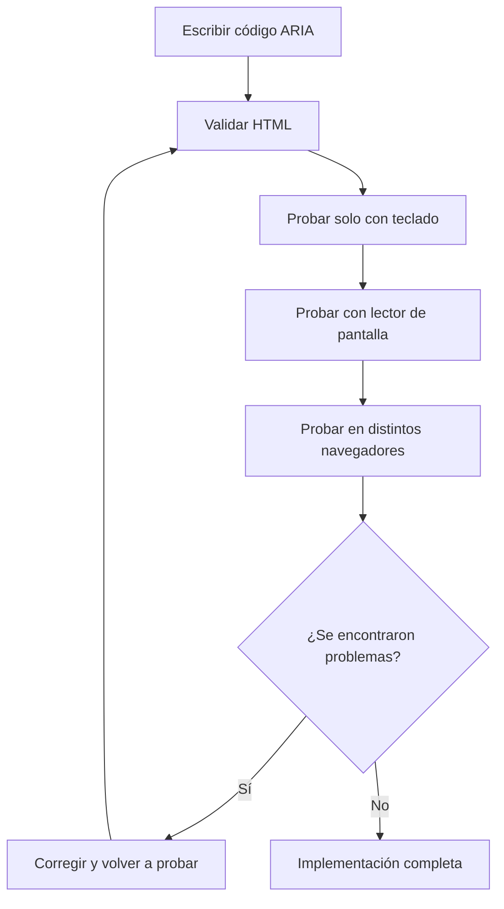
**🚫 Errores comunes de ARIA a evitar:**

- **Información contradictoria**: No contradigas la semántica de HTML
- **Etiquetado excesivo**: Demasiada información ARIA abruma a los usuarios
- **ARIA estática**: Olvidar actualizar los estados ARIA cuando cambia el contenido
- **Implementaciones no probadas**: ARIA que funciona en teoría pero falla en la práctica
- **Falta de soporte de teclado**: Roles ARIA sin interacciones correspondientes por teclado

> 💡 **Recursos para pruebas**: Usa herramientas como [accessibility-checker](https://www.npmjs.com/package/accessibility-checker) para validación automática de ARIA, pero siempre prueba con lectores de pantalla reales para una experiencia completa.

### 🎭 **Chequeo de habilidades ARIA: ¿Listo para interacciones complejas?**

**Evalúa tu confianza en ARIA:**
- ¿Cuándo elegirías ARIA sobre HTML semántico? (Pista: ¡casi nunca!)
- ¿Puedes explicar por qué `<div role="button">` suele ser peor que `<button>`?
- ¿Cuál es la cosa más importante para recordar al probar ARIA?

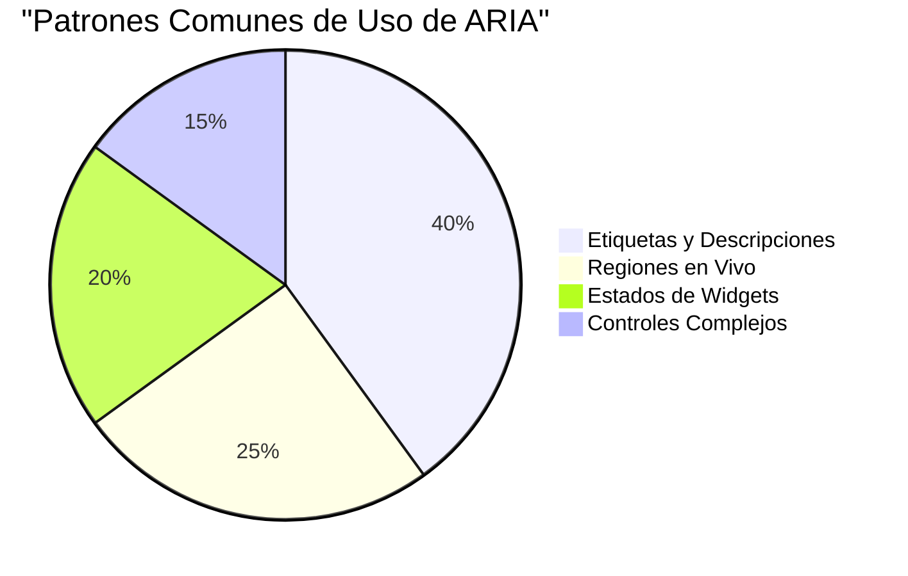
> **Insight clave**: La mayoría del uso de ARIA es para etiquetar y describir elementos. Los patrones complejos de widgets son mucho menos comunes de lo que podrías pensar.

✅ **Aprende de expertos**: Estudia la [Guía de prácticas de autoría ARIA](https://w3c.github.io/aria-practices/) para patrones probados y implementaciones de widgets interactivos complejos.

## Haciendo accesibles las imágenes y medios

El contenido visual y auditivo es parte esencial de las experiencias web modernas, pero puede crear barreras si no se implementa con cuidado. La meta es asegurar que la información y el impacto emocional de tus medios lleguen a todos los usuarios. Una vez aprendes cómo, se vuelve algo natural.

Diferentes tipos de medios necesitan distintos enfoques de accesibilidad. Es como cocinar: no tratarías un pescado delicado igual que un suculento filete. Entender estas diferencias te ayuda a elegir la solución adecuada para cada situación.

### Accesibilidad estratégica de imágenes

Cada imagen en tu sitio web cumple un propósito. Entender ese propósito te ayuda a escribir mejor texto alternativo y crear experiencias más inclusivas.

**Los cuatro tipos de imágenes y sus estrategias de texto alternativo:**

**Imágenes informativas** - transmiten información importante:
```html

```

**Imágenes decorativas** - puramente visuales sin valor informativo:
```html

```

**Imágenes funcionales** - sirven como botones o controles:
```html
<button>
  
</button>
```

**Imágenes complejas** - gráficas, diagramas, infografías:
```html

<div id="chart-description">
  <p>Detailed description: Sales data shows a steady increase across all quarters...</p>
</div>
```

### Accesibilidad en video y audio

**Requisitos para video:**
- **Subtítulos**: Versión en texto del contenido hablado y efectos de sonido
- **Descripciones de audio**: Narración de elementos visuales para usuarios ciegos
- **Transcripciones**: Versión completa en texto de todo el contenido audiovisual

```html
<video controls>
  <source src="video.mp4" type="video/mp4">
  <track kind="captions" src="captions.vtt" srclang="en" label="English">
  <track kind="descriptions" src="descriptions.vtt" srclang="en" label="Audio descriptions">
</video>
```

**Requisitos para audio:**
- **Transcripciones**: Versión en texto de todo el contenido hablado
- **Indicadores visuales**: Para contenido solo de audio, proporcionar señales visuales

### Técnicas modernas para imágenes

**Usando CSS para imágenes decorativas:**
```css
.hero-section {
  background-image: url('decorative-hero.jpg');
  /* Decorative images in CSS don't need alt text */
}
```

**Imágenes responsivas con accesibilidad:**
```html
<picture>
  <source media="(min-width: 800px)" srcset="large-chart.png">
  <source media="(min-width: 400px)" srcset="medium-chart.png">
  
</picture>
```

✅ **Prueba la accesibilidad de las imágenes**: Usa un lector de pantalla para navegar una página con imágenes. ¿Recibes suficiente información para entender el contenido?

## Navegación por teclado y gestión del enfoque

Muchos usuarios navegan por la web completamente con el teclado. Esto incluye personas con discapacidad motriz, usuarios avanzados que encuentran el teclado más rápido que el ratón y quien no tiene ratón funcional. Asegurarse de que tu sitio funcione bien con entrada por teclado es esencial y a menudo hace tu sitio más eficiente para todos.

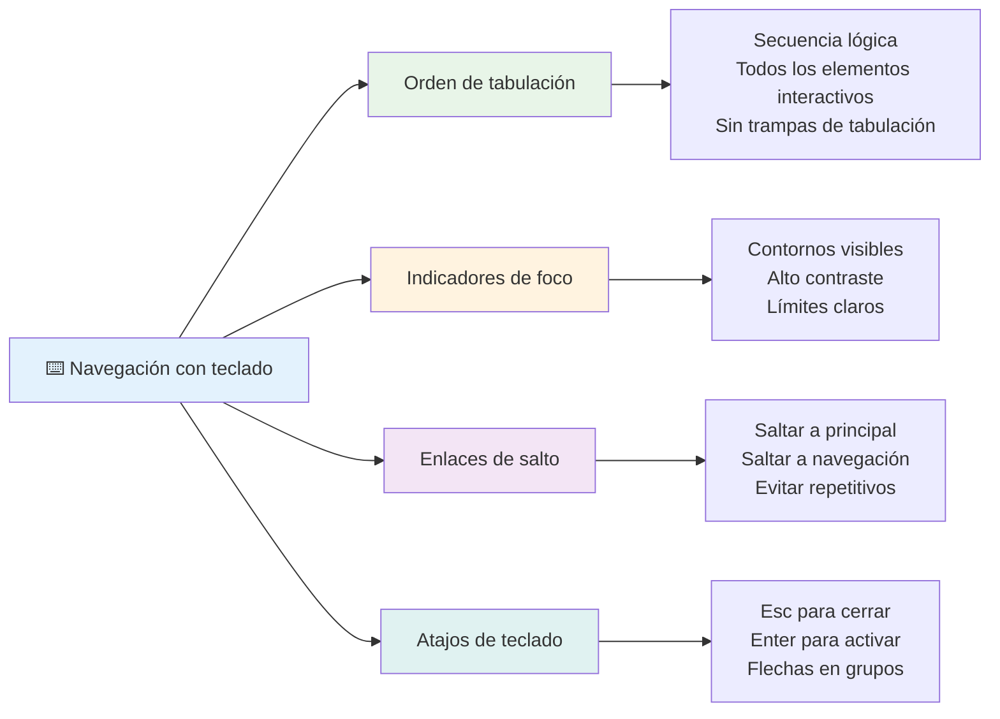
### Patrones esenciales para navegación por teclado

**Interacciones estándar por teclado:**
- **Tab**: Mover el foco hacia adelante entre elementos interactivos
- **Shift + Tab**: Mover el foco hacia atrás
- **Enter**: Activar botones y enlaces
- **Espacio**: Activar botones, marcar casillas
- **Teclas de flecha**: Navegar dentro de grupos de componentes (botones de opción, menús)
- **Escape**: Cerrar modales, menús desplegables o cancelar operaciones

### Mejores prácticas para gestión del enfoque

**Indicadores visibles de enfoque:**
```css
/* Ensure focus is always visible */
button:focus-visible {
  outline: 2px solid #4A90A4;
  outline-offset: 2px;
}

/* Custom focus styles for different components */
.card:focus-within {
  box-shadow: 0 0 0 3px rgba(74, 144, 164, 0.5);
}
```

**Enlaces para saltar contenido y navegar eficientemente:**
```html
<a href="#main-content" class="skip-link">Skip to main content</a>
<a href="#navigation" class="skip-link">Skip to navigation</a>

<nav id="navigation">
  <!-- navigation content -->
</nav>
<main id="main-content">
  <!-- main content -->
</main>
```

**Orden correcto de tabulación:**
```html
<!-- Use semantic HTML for natural tab order -->
<form>
  <label for="name">Name:</label>
  <input type="text" id="name" tabindex="0">
  
  <label for="email">Email:</label>
  <input type="email" id="email" tabindex="0">
  
  <button type="submit" tabindex="0">Submit</button>
</form>
```

### Atrapar el enfoque en modales

Al abrir diálogos modales, el foco debe quedarse atrapado dentro del modal:

```javascript
// Implementación moderna de trampa de enfoque
function trapFocus(element) {
  const focusableElements = element.querySelectorAll(
    'button, [href], input, select, textarea, [tabindex]:not([tabindex="-1"])'
  );
  
  const firstElement = focusableElements[0];
  const lastElement = focusableElements[focusableElements.length - 1];

  element.addEventListener('keydown', (e) => {
    if (e.key === 'Tab') {
      if (e.shiftKey && document.activeElement === firstElement) {
        e.preventDefault();
        lastElement.focus();
      } else if (!e.shiftKey && document.activeElement === lastElement) {
        e.preventDefault();
        firstElement.focus();
      }
    }
    
    if (e.key === 'Escape') {
      closeModal();
    }
  });
  
  // Enfocar el primer elemento cuando se abre el modal
  firstElement.focus();
}
```

✅ **Prueba la navegación por teclado**: Intenta navegar tu sitio usando solo la tecla Tab. ¿Puedes llegar a todos los elementos interactivos? ¿El orden del foco es lógico? ¿Los indicadores de foco son claramente visibles?

## Accesibilidad en formularios

Los formularios son fundamentales para la interacción del usuario y requieren atención especial en accesibilidad.

### Asociación de etiquetas y controles de formulario

**Cada control de formulario necesita una etiqueta:**
```html
<!-- Explicit labeling (preferred) -->
<label for="username">Username:</label>
<input type="text" id="username" name="username" required>

<!-- Implicit labeling -->
<label>
  Password:
  <input type="password" name="password" required>
</label>

<!-- Using aria-label when visual label isn't desired -->
<input type="search" aria-label="Search products" placeholder="Search...">
```

### Manejo de errores y validación

**Mensajes de error accesibles:**
```html
<label for="email">Email Address:</label>
<input type="email" id="email" name="email" 
       aria-describedby="email-error" 
       aria-invalid="true" required>
<div id="email-error" role="alert">
  Please enter a valid email address
</div>
```

**Buenas prácticas para validación de formularios:**
- Usa `aria-invalid` para indicar campos inválidos
- Proporciona mensajes de error claros y específicos
- Usa `role="alert"` para anuncios importantes de errores
- Muestra errores tanto inmediatamente como al enviar el formulario

### Conjuntos de campos y agrupación

**Agrupa controles de formulario relacionados:**
```html
<fieldset>
  <legend>Shipping Address</legend>
  <label for="street">Street Address:</label>
  <input type="text" id="street" name="street">
  
  <label for="city">City:</label>
  <input type="text" id="city" name="city">
</fieldset>

<fieldset>
  <legend>Preferred Contact Method</legend>
  <input type="radio" id="contact-email" name="contact" value="email">
  <label for="contact-email">Email</label>
  
  <input type="radio" id="contact-phone" name="contact" value="phone">
  <label for="contact-phone">Phone</label>
</fieldset>
```

## Tu viaje por la accesibilidad: conclusiones clave

¡Felicidades! Acabas de adquirir el conocimiento fundamental para crear experiencias web verdaderamente inclusivas. ¡Esto es algo muy emocionante! La accesibilidad web no se trata solo de cumplir con requisitos, sino de reconocer las diversas formas en que las personas interactúan con el contenido digital y diseñar para esa increíble complejidad.

Ahora formas parte de una comunidad creciente de desarrolladores que entienden que un buen diseño funciona para todos. ¡Bienvenido al club!

**🎯 Tu kit de herramientas de accesibilidad ahora incluye:**

| Principio central | Implementación | Impacto |
|----------------|----------------|---------|
| **Fundamento en HTML semántico** | Usa elementos HTML apropiados para su propósito | Los lectores de pantalla navegan eficientemente; los teclados funcionan automáticamente |
| **Diseño visual inclusivo** | Contraste suficiente, uso significativo del color, indicadores visibles de foco | Claro para todos en cualquier condición de iluminación |
| **Contenido descriptivo** | Texto significativo en enlaces, texto alternativo, encabezados | Los usuarios entienden el contenido sin contexto visual |
| **Accesibilidad por teclado** | Orden de tabulación, atajos de teclado, gestión del enfoque | Accesibilidad motriz y eficiencia para usuarios avanzados |
| **Mejora con ARIA** | Uso estratégico para cubrir huecos semánticos | Aplicaciones complejas que funcionan con tecnologías de asistencia |
| **Pruebas integrales** | Herramientas automatizadas + verificación manual + pruebas con usuarios reales | Detectar problemas antes de que afecten a los usuarios |

**🚀 Tus próximos pasos:**

1. **Integra la accesibilidad en tu flujo de trabajo**: Haz que la prueba sea parte natural de tu proceso de desarrollo
2. **Aprende de usuarios reales**: Busca retroalimentación de personas que usan tecnologías de asistencia
3. **Mantente actualizado**: Las técnicas de accesibilidad evolucionan con nuevas tecnologías y estándares
4. **Promueve la inclusión**: Comparte tu conocimiento y haz de la accesibilidad una prioridad del equipo

> 💡 **Recuerda**: Las limitaciones de accesibilidad a menudo conducen a soluciones innovadoras y elegantes que benefician a todos. Las rampas, los subtítulos y los controles por voz empezaron como características accesibles y se convirtieron en mejoras generalizadas.

**El caso de negocio es claro**: Los sitios accesibles llegan a más usuarios, tienen mejor posicionamiento en buscadores, costos de mantenimiento menores y evitan riesgos legales. Pero honestamente, ¿la razón real para preocuparse por la accesibilidad? Es mucho más profunda. Los sitios accesibles encarnan los mejores valores de la web: apertura, inclusión y la idea de que todos merecen acceso igualitario a la información.

Ahora estás equipado para construir la web inclusiva del futuro. Cada sitio accesible que creas hace que Internet sea un lugar más amigable para todos. ¡Eso es realmente asombroso cuando lo piensas!

## Recursos adicionales

Continúa tu aprendizaje de accesibilidad con estos recursos esenciales:

**📚 Estándares y guías oficiales:**
- [Pautas WCAG 2.1](https://www.w3.org/WAI/WCAG21/quickref/) - El estándar oficial de accesibilidad con referencia rápida
- [Guía de prácticas de autoría ARIA](https://w3c.github.io/aria-practices/) - Patrones completos para widgets interactivos
- [Guías WebAIM](https://webaim.org/) - Orientación práctica y amigable para principiantes

**🛠️ Herramientas y recursos para pruebas:**
- [axe DevTools](https://www.deque.com/axe/devtools/) - Pruebas de accesibilidad estándar en la industria
- [Checklist del Proyecto A11y](https://www.a11yproject.com/checklist/) - Verificación paso a paso de accesibilidad
- [Accessibility Insights](https://accessibilityinsights.io/) - Suite completa de pruebas de Microsoft
- [Color Oracle](https://colororacle.org/) - Simulador de daltonismo para pruebas de diseño

**🎓 Aprendizaje y comunidad:**
- [Encuesta WebAIM sobre lectores de pantalla](https://webaim.org/projects/screenreadersurvey9/) - Preferencias y comportamientos de usuarios reales
- [Componentes Inclusivos](https://inclusive-components.design/) - Patrones modernos para componentes accesibles
- [A11y Coffee](https://a11y.coffee/) - Consejos rápidos y perspectivas sobre accesibilidad
- [Iniciativa de Accesibilidad Web (WAI)](https://www.w3.org/WAI/) - Recursos completos de accesibilidad del W3C

**🎥 Aprendizaje práctico:**
- [Guía para desarrolladores en accesibilidad](https://www.accessibility-developer-guide.com/) - Orientación práctica para implementación
- [Universidad Deque](https://dequeuniversity.com/) - Cursos profesionales de formación en accesibilidad

## Desafío GitHub Copilot Agent 🚀

Usa el modo Agente para completar el siguiente desafío:

**Descripción:** Crea un componente de diálogo modal accesible que demuestre la correcta gestión del enfoque, atributos ARIA y patrones de navegación por teclado.

**Indicación:** Construye un componente de diálogo modal completo con HTML, CSS y JavaScript que incluya: atrapamiento correcto del enfoque, tecla ESC para cerrar, clic fuera para cerrar, atributos ARIA para lectores de pantalla y indicadores visibles de foco. El modal debe contener un formulario con etiquetas apropiadas y manejo de errores. Asegúrate que el componente cumpla con los estándares WCAG 2.1 AA.

## 🚀 Desafío

Toma este HTML y reescríbelo para que sea lo más accesible posible, dado lo que aprendiste.

```html
<!DOCTYPE html>
<html lang="en">
  <head>
    <meta charset="UTF-8">
    <meta name="viewport" content="width=device-width, initial-scale=1.0">
    <title>Turtle Ipsum - The World's Premier Turtle Fan Club</title>
    <link href='../assets/style.css' rel='stylesheet' type='text/css'>
  </head>
  <body>
    <header class="site-header">
      <h1 class="site-title">Turtle Ipsum</h1>
      <p class="site-subtitle">The World's Premier Turtle Fan Club</p>
    </header>
    
    <nav class="main-nav" aria-label="Main navigation">
      <h2 class="nav-header">Resources</h2>
      <ul class="nav-list">
        <li><a href="https://www.youtube.com/watch?v=CMNry4PE93Y">"I like turtles" video</a></li>
        <li><a href="https://en.wikipedia.org/wiki/Turtle">Basic turtle information</a></li>
        <li><a href="https://en.wikipedia.org/wiki/Turtles_(chocolate)">Chocolate turtles candy</a></li>
      </ul>
    </nav>
    
    <main class="main-content">
      <article>
        <h1>Welcome to Turtle Ipsum</h1>
        <p class="intro">
          <a href="/about">Learn more about our turtle community</a> and discover fascinating facts about these amazing creatures.
        </p>
        <p class="article-text">
          Turtle ipsum dolor sit amet, consectetur adipiscing elit, sed do eiusmod tempor incididunt ut labore et dolore magna aliqua. Ut enim ad minim veniam, quis nostrud exercitation ullamco laboris nisi ut aliquip ex ea commodo consequat. Duis aute irure dolor in reprehenderit in voluptate velit esse cillum dolore eu fugiat nulla pariatur. Excepteur sint occaecat cupidatat non proident, sunt in culpa qui officia deserunt mollit anim id est laborum.
        </p>
      </article>
    </main>
    
    <footer class="footer">
      <section class="newsletter-signup">
        <h2>Stay Updated</h2>
        <button type="button" onclick="showNewsletterForm()">Sign up for turtle news</button>
      </section>
      
      <nav class="footer-nav" aria-label="Footer navigation">
        <h2>Site Pages</h2>
        <ul>
          <li><a href="../">Home</a></li>
          <li><a href="../semantic">Semantic HTML example</a></li>
        </ul>
      </nav>
      
      <p class="footer-copyright">&copy; 2024 Instrument. All rights reserved.</p>
    </footer>
  </body>
</html>
```

**Mejoras clave realizadas:**
- Se añadió estructura HTML semántica correcta
- Se corrigió la jerarquía de encabezados (único h1, progresión lógica)
- Se añadió texto significativo en enlaces en lugar de "clic aquí"
- Se incluyeron etiquetas ARIA adecuadas para navegación
- Se agregó atributo lang y metaetiquetas adecuadas
- Se usó el elemento button para elementos interactivos
- Se estructuró el contenido del pie de página con puntos de referencia adecuados

## Cuestionario posterior a la clase
[Cuestionario posterior a la clase](https://ff-quizzes.netlify.app/web/en/)

## Repaso y estudio independiente

Muchos gobiernos tienen leyes respecto a requisitos de accesibilidad. Investiga las leyes de accesibilidad de tu país. ¿Qué cubren y qué no? Un ejemplo es [este sitio del gobierno](https://accessibility.blog.gov.uk/).

## Tarea

[Analiza un sitio web no accesible](assignment.md)

Créditos: [Turtle Ipsum](https://github.com/Instrument/semantic-html-sample) por Instrument

---

## 🚀 Tu línea de tiempo para dominar la accesibilidad

### ⚡ **Lo que puedes hacer en los próximos 5 minutos**
- [ ] Instalar la extensión axe DevTools en tu navegador
- [ ] Ejecutar una auditoría de accesibilidad con Lighthouse en tu sitio favorito
- [ ] Intentar navegar cualquier sitio usando solo la tecla Tab
- [ ] Probar el lector de pantalla integrado de tu navegador (Narrador/VoiceOver)

### 🎯 **Lo que puedes lograr en esta hora**
- [ ] Completar el cuestionario posterior a la lección y reflexionar sobre las ideas de accesibilidad
- [ ] Practicar escribir texto alternativo significativo para 10 imágenes diferentes
- [ ] Auditar la estructura de encabezados de un sitio usando la extensión HeadingsMap
- [ ] Corregir problemas de accesibilidad encontrados en el HTML del desafío
- [ ] Probar el contraste de color en tu proyecto actual con la herramienta de WebAIM

### 📅 **Tu viaje semanal de accesibilidad**
- [ ] Completar la tarea de analizar un sitio web no accesible
- [ ] Configurar tu entorno de desarrollo con herramientas de prueba de accesibilidad
- [ ] Practicar la navegación con teclado en 5 sitios web complejos diferentes  
- [ ] Construir un formulario simple con etiquetas adecuadas, manejo de errores y ARIA  
- [ ] Unirse a una comunidad de accesibilidad (A11y Slack, foro WebAIM)  
- [ ] Observar a usuarios reales con discapacidades navegar sitios web (YouTube tiene excelentes ejemplos)  

### 🌟 **Tu transformación de un mes**  
- [ ] Integrar pruebas de accesibilidad en tu flujo de desarrollo  
- [ ] Contribuir a un proyecto de código abierto corrigiendo problemas de accesibilidad  
- [ ] Realizar pruebas de usabilidad con alguien que use tecnología asistiva  
- [ ] Construir una biblioteca de componentes accesibles para tu equipo  
- [ ] Abogar por la accesibilidad en tu lugar de trabajo o comunidad  
- [ ] Ser mentor de alguien nuevo en conceptos de accesibilidad  

### 🏆 **Revisión final del campeón de accesibilidad**  

**Celebra tu recorrido en accesibilidad:**  
- ¿Qué fue lo más sorprendente que aprendiste sobre cómo las personas usan la web?  
- ¿Qué principio de accesibilidad resuena más con tu estilo de desarrollo?  
- ¿Cómo ha cambiado tu perspectiva sobre el diseño al aprender sobre accesibilidad?  
- ¿Cuál es la primera mejora de accesibilidad que quieres hacer en un proyecto real?  

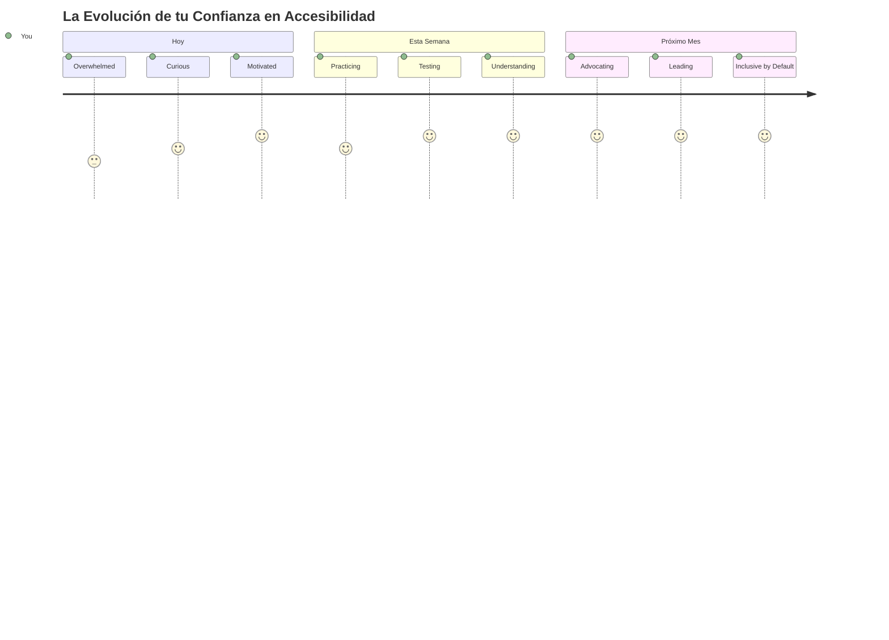
> 🌍 **¡Ahora eres un campeón de accesibilidad!** Entiendes que las grandes experiencias web funcionan para todos, sin importar cómo acceden a la web. Cada característica accesible que creas hace que internet sea más inclusivo. La web necesita desarrolladores como tú que ven la accesibilidad no como una limitación, sino como una oportunidad para crear mejores experiencias para todos los usuarios. ¡Bienvenido al movimiento! 🎉

---

<!-- CO-OP TRANSLATOR DISCLAIMER START -->
**Aviso Legal**:  
Este documento ha sido traducido utilizando el servicio de traducción automática [Co-op Translator](https://github.com/Azure/co-op-translator). Aunque nos esforzamos por la precisión, tenga en cuenta que las traducciones automáticas pueden contener errores o inexactitudes. El documento original en su idioma nativo debe considerarse la fuente autorizada. Para información crítica, se recomienda una traducción humana profesional. No nos hacemos responsables de malentendidos o interpretaciones erróneas que resulten del uso de esta traducción.
<!-- CO-OP TRANSLATOR DISCLAIMER END -->